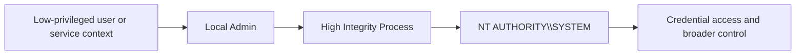
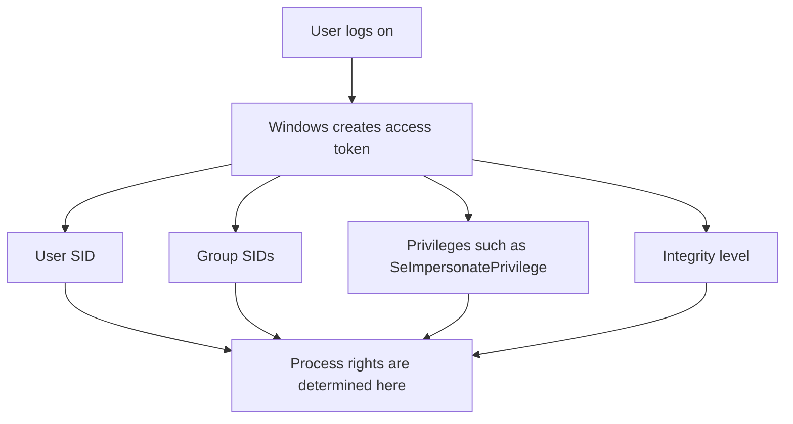
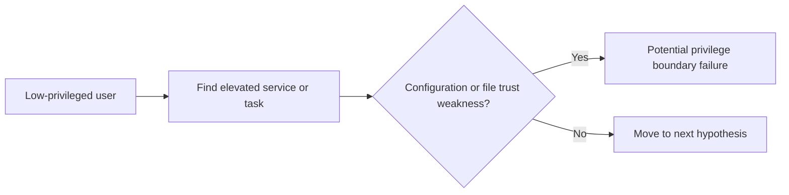
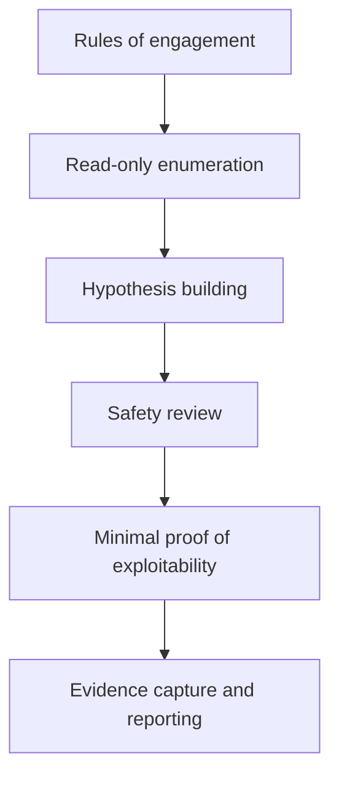
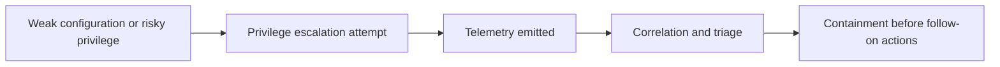
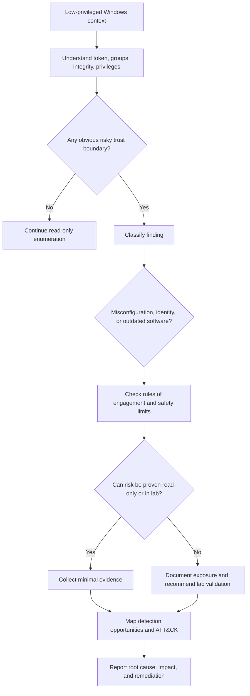

# Windows Privilege Escalation

> **Authorized adversary-emulation only:** This note explains how Windows privilege escalation works so operators and defenders can safely validate controls, detections, and hardening. The focus is on trust boundaries, misconfigurations, and evidence collection — **not** copy-paste intrusion steps.

---

## Table of Contents

1. [What Windows Privilege Escalation Means](#1-what-windows-privilege-escalation-means)
2. [Why It Matters in Red Teaming](#2-why-it-matters-in-red-teaming)
3. [How Windows Trust and Privilege Actually Work](#3-how-windows-trust-and-privilege-actually-work)
4. [Common Escalation Path Families](#4-common-escalation-path-families)
5. [Safe, Practical Assessment Methodology](#5-safe-practical-assessment-methodology)
6. [Read-Only Validation Checklist](#6-read-only-validation-checklist)
7. [Detection and Telemetry Opportunities](#7-detection-and-telemetry-opportunities)
8. [Hardening Priorities](#8-hardening-priorities)
9. [Reporting Windows PrivEsc Well](#9-reporting-windows-privesc-well)
10. [Decision Tree](#10-decision-tree)
11. [Key Takeaways](#11-key-takeaways)

---

## 1. What Windows Privilege Escalation Means

> **Beginner view:** you start with code execution or an interactive session as one security context, then discover a way to cross into a more powerful one such as local Administrator or `NT AUTHORITY\SYSTEM`.

In Windows, privilege escalation is rarely about a single dramatic trick. Most real paths come from one of four things:

- **identity design** that gives a process more rights than operators expect
- **misconfiguration** in services, tasks, files, registry keys, or installers
- **software weakness** such as an unpatched driver or vulnerable component
- **control gaps** where UAC, application control, or monitoring does not meaningfully reduce risk

A useful mental model is:

```text
Initial foothold -> Understand current token -> Find trust boundary mistake -> Validate safely -> Prove impact -> Report root cause
```

### Privilege escalation is about boundaries

The important question is not just:

> "Can I become admin?"

It is:

> "What trust boundary failed, and how far could a realistic adversary go before controls stopped them?"

That shift matters because mature red-team work is about **validating defenses**, not collecting flashy screenshots.



---

## 2. Why It Matters in Red Teaming

Privilege escalation is often the difference between **access** and **control**.

A low-privileged foothold may let an operator execute code, but it usually does **not** let them:

- inspect protected credential material
- alter system-wide services or scheduled tasks
- install software or persistence broadly
- disable security tooling
- access data owned by other users or the OS itself
- operate with the same freedom as local admin or SYSTEM

### In an adversary-emulation exercise, Windows priv esc helps answer:

| Question | Why It Matters |
|---|---|
| Can a normal user context reach admin or SYSTEM? | Measures containment strength after initial access |
| Are common misconfigurations present on workstations or servers? | Shows whether baseline hardening is consistent |
| Would defenders see the escalation attempt early? | Validates telemetry, correlation, and triage quality |
| Is the weakness architectural or just one host? | Determines whether the issue is systemic |

### Red-team mindset

A strong operator does not ask:

> "What exploit can I run first?"

A stronger operator asks:

> "What is the safest, most realistic way to test whether this environment prevents or detects privilege growth?"

---

## 3. How Windows Trust and Privilege Actually Work

To understand Windows privilege escalation, you need four concepts:

1. **accounts and groups**
2. **access tokens**
3. **integrity levels and UAC**
4. **privileged components** such as services, scheduled tasks, drivers, and installers

### 3.1 Accounts and groups

Windows does not treat every local user the same.

| Context | Typical Meaning |
|---|---|
| Standard user | Can run applications but has limited system control |
| Local Administrator | Powerful local rights, but often filtered through UAC |
| High integrity admin process | Elevated process running with stronger rights |
| `NT AUTHORITY\\SYSTEM` | Highly privileged local OS context |
| Service account | May hold powerful privileges without being a human admin |

### 3.2 Access tokens

An **access token** is Windows' way of saying:

- who the process is
- which groups it belongs to
- which privileges it has
- what integrity level it runs at

If you understand the token, you understand the real power of the process.



### 3.3 UAC and integrity levels

A common beginner mistake is to think:

> "If the account is in Administrators, I already have full admin."

Not exactly.

With User Account Control, an administrator may still start in a **medium integrity** context and only elevate selected processes when approved. That means:

- being an admin-capable user is **not** the same as running an elevated process
- a **high integrity** process is powerful, but still not always equal to SYSTEM
- weak UAC design or poor app behavior can create elevation opportunities

```text
Standard user -> must supply credentials to elevate
Admin user with UAC -> can approve elevation for selected actions
SYSTEM -> service/OS-level context above normal admin workflows
```

### 3.4 Privileges worth understanding

Some privileges deserve extra attention during authorized validation because they may indicate **higher-than-expected abuse potential**.

| Privilege | Why It Matters in Assessments |
|---|---|
| `SeImpersonatePrivilege` | Important when evaluating token handling and service trust boundaries |
| `SeAssignPrimaryTokenPrivilege` | Relevant to process creation and delegated execution scenarios |
| `SeBackupPrivilege` / `SeRestorePrivilege` | Can defeat normal file access expectations |
| `SeDebugPrivilege` | Signals strong local access and sensitive process exposure |
| `SeLoadDriverPrivilege` | Raises concern around driver trust and kernel exposure |

This is where ATT&CK mappings such as **T1548 Abuse Elevation Control Mechanism** and **T1134 Access Token Manipulation** become useful. They help teams describe the *behavior family* without turning the exercise into a how-to guide.

---

## 4. Common Escalation Path Families

The safest way to teach Windows priv esc is by **path families**, not exploit recipes.

### 4.1 Service and scheduled task trust problems

Windows services and scheduled tasks frequently run with elevated rights. If the configuration around them is weak, a lower-privileged user may gain leverage.

Common risk patterns include:

- writable service binaries or referenced folders
- weak ACLs on service configuration or task actions
- unsafe search paths and load order assumptions
- installers or updaters that run elevated while trusting low-integrity locations



### 4.2 Token and identity abuse opportunities

Some environments unintentionally give non-admin contexts surprisingly strong rights through:

- service accounts with risky privileges
- delegated execution paths
- identity boundaries that rely on fragile assumptions
- processes that can act on behalf of more privileged users or services

This is why red-team operators pay close attention to **who a process is allowed to impersonate**, **what token it inherits**, and **which services broker privileged actions**.

### 4.3 UAC and elevation-control weaknesses

UAC is a control mechanism, not a magic shield.

Assessment questions include:

- Are users routinely local admins?
- Are auto-elevate behaviors creating dangerous assumptions?
- Are trusted paths, installers, or helper applications granting more power than intended?
- Would defenders spot an unexpected high-integrity child process?

### 4.4 File system and registry permission problems

Many Windows escalation paths are really **ACL mistakes**.

Examples of risky conditions:

- a normal user can modify a binary loaded by an elevated process
- a user-writable directory appears early in a trusted search path
- registry keys controlling an elevated component can be altered by low-privileged users
- a scheduled task or service points to content stored in a weakly protected location

### 4.5 Drivers, kernel attack surface, and outdated software

At the advanced end, the concern shifts from misconfiguration to **high-impact technical weakness**:

- vulnerable signed drivers
- unpatched kernel issues
- insecure endpoint or management software
- third-party agents running as SYSTEM with weak self-protection

These paths can be extremely risky to validate in production. Mature teams usually treat them as:

- **evidence-led investigations** first
- **lab validation** second
- **production proof** only with strict approval and containment

### 4.6 Application-specific privilege boundaries

Priv esc is not only an OS story. Enterprise software often introduces its own local trust boundaries:

- management agents
- software deployment tools
- backup clients
- browser helper components
- database or web service wrappers

A good Windows priv esc review therefore asks:

> "Which *business software* on this host effectively behaves like a privileged platform?"

### Summary table

| Path Family | Typical Root Cause | Safe Validation Focus |
|---|---|---|
| Services / tasks | Weak ACLs, unsafe paths, overly trusted configs | Read config, inspect permissions, map who can modify what |
| Tokens / impersonation | Over-privileged service contexts, fragile brokering | Understand token privileges and brokered actions |
| UAC / elevation controls | Admin sprawl, weak prompts, trusted-path confusion | Validate separation between medium, high, and SYSTEM contexts |
| Files / registry | Inherited permissions, writable load paths | Review ACLs and ownership on high-trust components |
| Drivers / kernel | Outdated or unsafe software | Inventory versions, patch state, and signed driver exposure |
| Enterprise agents | Vendor design assumptions | Check whether local users can influence privileged workflows |

---

## 5. Safe, Practical Assessment Methodology

This section is the most important for real engagements.

### 5.1 Start with guardrails

Before doing anything technical, define:

- whether production hosts are in scope
- whether only read-only validation is allowed
- whether privileged proof must stop short of actual elevation
- which applications, user sessions, or business workflows are off-limits
- what stop conditions apply if security tooling reacts unexpectedly



### 5.2 Enumerate first, change nothing

The highest-value Windows priv esc work often begins with **read-only inspection**:

- current identity and privileges
- local groups and admin membership
- OS build and patch level
- running services and scheduled tasks
- software inventory
- permissions on binaries, folders, and registry keys tied to elevated components

This stage answers:

> "What trust boundaries exist here, and which of them look weak enough to justify deeper testing?"

### 5.3 Build hypotheses, not guesses

A mature operator turns raw findings into hypotheses.

Examples:

- "This updater runs as SYSTEM and references a user-writable folder."
- "This service account holds a risky privilege that does not match its business purpose."
- "This endpoint agent is outdated and may deserve controlled vendor-advisory review."
- "This host has local admin sprawl, so UAC may be the only remaining barrier."

### 5.4 Prefer minimal proof over full exploitation

Good red-team work proves the risk with the **least invasive evidence**.

Safer proof options may include:

- showing that a low-privileged user can modify a file or registry location trusted by an elevated component
- demonstrating that a risky privilege exists where it should not
- showing that a service or task resolves a path from a weakly protected location
- reproducing the issue in a lab with the same software version instead of production

### 5.5 Think in chains

Windows privilege escalation is often one link in a larger path.

```text
Initial access -> local discovery -> privilege escalation -> credential access -> lateral movement
```

That means reports should explain not only the local weakness, but also:

- what it unlocks next
- why that next step matters to the client's architecture
- whether detection opportunities existed at each transition

### 5.6 Know when not to validate live

Avoid aggressive live testing when the finding touches:

- kernel or driver behavior
- security tooling running as SYSTEM
- production update pipelines
- shared multi-user servers
- workloads where instability could become an incident

In those cases, the right answer is often:

> inventory -> verify version -> compare to advisory -> validate in lab -> report production exposure responsibly

---

## 6. Read-Only Validation Checklist

> These examples are for **authorized, read-only assessment and inventory**. They help you understand trust boundaries without changing the host.

### 6.1 Identity and privilege context

```powershell
whoami
whoami /all
whoami /priv
whoami /groups
```

Questions to answer:

- Am I a standard user, service account, or admin-capable user?
- Which privileges appear unexpectedly powerful for this context?
- Is the token medium integrity, high integrity, or SYSTEM?

### 6.2 OS build and patch posture

```powershell
systeminfo
Get-ComputerInfo | Select-Object OsName, OsVersion, OsBuildNumber, WindowsVersion
Get-HotFix | Sort-Object InstalledOn -Descending | Select-Object -First 20
```

Questions to answer:

- Is the host significantly behind patch baselines?
- Are there signs of legacy software or unsupported Windows versions?
- Should advanced findings be reviewed against vendor advisories before any validation?

### 6.3 Services and service permissions

```powershell
Get-CimInstance Win32_Service | Select-Object Name, StartName, State, PathName
sc.exe qc <service-name>
sc.exe query type= service state= all
```

Questions to answer:

- Which services run as SYSTEM or other privileged accounts?
- Do any binaries live in surprising or weakly protected locations?
- Do service paths or related folders deserve ACL review?

### 6.4 Scheduled tasks

```powershell
schtasks /query /fo LIST /v
Get-ScheduledTask | Select-Object TaskPath, TaskName, State
```

Questions to answer:

- Which tasks run with elevated rights?
- Who can modify the task definition or action target?
- Are tasks tied to scripts, binaries, or folders writable by normal users?

### 6.5 File and folder ACL review

```powershell
icacls "C:\Program Files"
icacls "C:\Path\To\Interesting\Folder"
```

Questions to answer:

- Do ordinary users have modify rights where they should not?
- Are elevated components loading from directories with inherited weak permissions?
- Does the path design depend on trust rather than explicit restriction?

### 6.6 Registry review

```powershell
reg query HKLM\Software /s
Get-ItemProperty "HKLM:\Software\Microsoft\Windows\CurrentVersion\Run"
```

Questions to answer:

- Which elevated components rely on registry-controlled paths or options?
- Are high-trust keys writable by low-privileged users?
- Could configuration changes alter behavior of an elevated process?

### 6.7 Driver and software inventory

```powershell
driverquery /v
Get-ItemProperty HKLM:\Software\Microsoft\Windows\CurrentVersion\Uninstall\*
```

Questions to answer:

- Are there outdated endpoint, management, or backup agents?
- Are vulnerable signed drivers or abandoned products present?
- Should the finding move into advisory-based validation rather than host experimentation?

### 6.8 A practical triage matrix

| If you find... | First question | Safe next step |
|---|---|---|
| Powerful token privilege | Why does this context have it? | Confirm business purpose and logging coverage |
| SYSTEM service in odd location | Who can modify the binary or parent folder? | Review ACLs and ownership |
| Elevated task calling a script | Who can edit the script or referenced directory? | Inspect task action and file permissions |
| Legacy agent or driver | Is there a public vendor advisory? | Compare version, validate in lab if needed |
| Admin user with weak UAC posture | Is admin membership routine on endpoints? | Assess policy, least privilege, and detection coverage |

---

## 7. Detection and Telemetry Opportunities

Windows privilege escalation should be taught alongside **defender observables**.

### 7.1 What defenders want to see

| Behavior Family | Useful Telemetry |
|---|---|
| Unexpected privilege growth | Process creation logs, token/elevation metadata, integrity level changes |
| Service abuse or reconfiguration | Service Control Manager logs, config change auditing, file modification telemetry |
| Scheduled task misuse | Task Scheduler operational logs, process lineage from task actions |
| Registry-based elevation-control abuse | Registry auditing and Sysmon-style registry events |
| Driver or kernel-related activity | Driver load telemetry, code integrity events, EDR kernel alerts |

### 7.2 High-value Windows events to consider

Depending on logging choices, teams often care about:

- **4688** process creation with command line and parent-child relationships
- **4672** special privileges assigned to new logon
- **4697** service installation where security auditing is enabled
- **7045** new service creation from the System log
- Sysmon events related to process creation, driver loads, file changes, and registry writes

The point is not to memorize event IDs. The point is to ask:

> "If a realistic escalation path were attempted here, what evidence chain should exist?"

### 7.3 Detection logic that actually helps

Better detections focus on combinations such as:

- unexpected elevated child processes from office tools, browsers, or user apps
- changes to service configuration followed by execution
- modifications to folders or registry locations trusted by elevated components
- unusual use of privileges that are rare for standard users or service accounts



### 7.4 ATT&CK framing

For reporting and control mapping, Windows priv esc commonly aligns with:

- **T1548 - Abuse Elevation Control Mechanism**
- **T1134 - Access Token Manipulation**

Those mappings help blue teams organize detections and mitigations around behavior families instead of single tools or public proof-of-concepts.

---

## 8. Hardening Priorities

The best remediation advice is specific and architectural.

### 8.1 Reduce local admin sprawl

If large numbers of users are local admins, UAC becomes a thin speed bump instead of meaningful separation.

### 8.2 Lock down ACLs on elevated components

Review:

- service binaries
- updater directories
- scheduled task targets
- privileged scripts
- registry keys controlling elevated behavior

### 8.3 Minimize dangerous privileges for service accounts

Service identities should have only the rights they actually need.

### 8.4 Patch and inventory aggressively

Especially for:

- endpoint and remote management agents
- backup software
- drivers
- legacy vendor software with SYSTEM-level services

### 8.5 Improve logging around trust boundaries

Prioritize visibility into:

- process creation with elevation context
- service creation and modification
- scheduled task changes
- registry writes to privileged control points
- driver loads

### 8.6 Prefer proof-resistant design

The strongest environments are not just monitored. They are built so that:

- low-privileged users cannot influence elevated code paths
- software update flows are strongly protected
- privileged helper components do not trust user-controlled locations
- admin privileges are rare, temporary, and auditable

---

## 9. Reporting Windows PrivEsc Well

A weak report says:

> "Privilege escalation to SYSTEM was possible."

A strong report says:

> "A low-privileged user could influence a SYSTEM-level service due to weak file permissions on a trusted path. This created a realistic local privilege escalation opportunity, reduced confidence in workstation containment, and could enable follow-on credential access. Existing telemetry did not clearly surface the prerequisite file-permission change or the resulting privileged execution chain."

### Include these elements

| Reporting Element | What Good Looks Like |
|---|---|
| Initial context | Who the operator was and what privileges existed at the start |
| Boundary crossed | User -> admin, user -> SYSTEM, or equivalent |
| Root cause | Weak ACL, risky privilege assignment, outdated software, weak elevation control |
| Safe proof | Minimal evidence that demonstrates exploitability without unnecessary impact |
| Detection outcome | What alerts appeared, what was missed, and why |
| Business impact | What the elevated context would enable next |
| Remediation | Precise hardening action, not generic advice |

### A simple reporting flow

```text
Starting context -> Weak trust boundary -> Safe proof -> Detection result -> Business impact -> Remediation plan
```

---

## 10. Decision Tree



---

## 11. Key Takeaways

- Windows privilege escalation is best understood as **trust-boundary failure**, not a bag of tricks.
- The most common paths involve **services, tasks, tokens, ACLs, UAC assumptions, and outdated privileged software**.
- Strong adversary-emulation work starts with **read-only enumeration**, builds **clear hypotheses**, and uses **minimal proof**.
- Mature reporting explains **what boundary failed, what it enabled next, what defenders saw, and how to fix the underlying design issue**.
- The safest and most valuable operator habit is:

> **Enumerate deeply, validate carefully, and prove risk without becoming the incident.**

---

> **Defender mindset:** treat Windows privilege escalation as a validation of least privilege, software trust, and telemetry quality. If a low-privileged context can reliably grow into admin or SYSTEM, the issue is rarely just one host — it is usually a sign of a broader control pattern.
