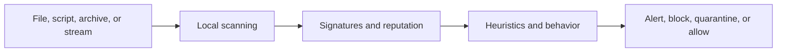
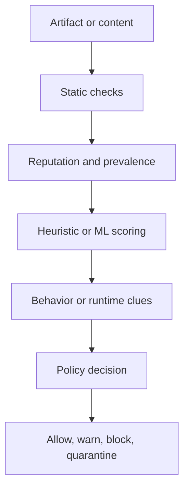
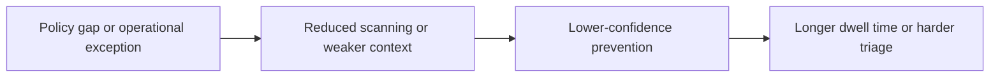
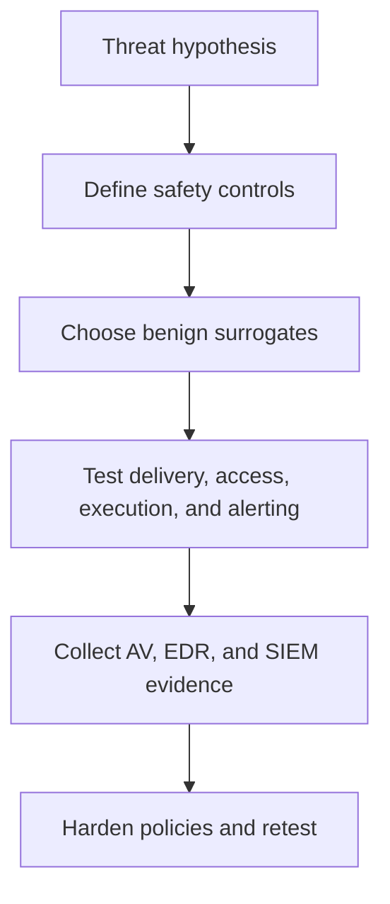

# Antivirus Evasion

> **Difficulty:** Beginner → Advanced | **Category:** Red Teaming | **Focus:** Safely validating how antivirus controls detect suspicious content, where coverage weakens, and how defenders can harden those gaps

**Antivirus evasion** is a valid topic in authorized adversary emulation because defenders need to know whether their prevention stack relies too much on simple signatures, weak policy assumptions, or inconsistent coverage. In a professional engagement, the goal is **not** to teach product bypass tricks or malware tradecraft. The goal is to understand **what the antivirus sees, what it misses, and why**.

> **Authorized-use only:** This note is for approved red-team, purple-team, and lab validation work. It intentionally avoids exploit code, AMSI bypass recipes, and step-by-step intrusion instructions.

---

## Table of Contents

1. [What Antivirus Evasion Means](#1-what-antivirus-evasion-means)
2. [How Modern Antivirus Actually Works](#2-how-modern-antivirus-actually-works)
3. [Where Antivirus Blind Spots Come From](#3-where-antivirus-blind-spots-come-from)
4. [Main Evasion Families at a High Level](#4-main-evasion-families-at-a-high-level)
5. [AV vs EDR vs Attack Surface Reduction](#5-av-vs-edr-vs-attack-surface-reduction)
6. [Authorized Adversary-Emulation Workflow](#6-authorized-adversary-emulation-workflow)
7. [Practical Safe Scenarios: Beginner to Advanced](#7-practical-safe-scenarios-beginner-to-advanced)
8. [Detection and Hardening Ideas](#8-detection-and-hardening-ideas)
9. [Common Misunderstandings](#9-common-misunderstandings)
10. [Reporting and Metrics](#10-reporting-and-metrics)
11. [Key Takeaways](#11-key-takeaways)
12. [References](#12-references)

---

## 1. What Antivirus Evasion Means

At a beginner level, **antivirus evasion** means trying to reduce the chance that security tooling will:

- block a suspicious artifact
- classify it with high confidence
- correlate it with related activity
- surface it quickly enough for defenders to act

The most useful mental model is:

> **AV evasion is usually about changing what gets scanned, when it gets scanned, or how clearly it looks malicious.**

That does **not** mean the adversary becomes invisible.

It means the defender may see:

- a weaker signal
- a later signal
- a more ambiguous signal
- a signal that only makes sense when combined with EDR, email, proxy, or identity data

### Beginner analogy

Think of airport security:

- a clearly prohibited item is easy to stop
- a disguised or nested item takes more inspection
- a trusted traveler lane may change how closely something is checked
- weak coordination between checkpoints creates gaps

Antivirus works the same way. It is not just one scanner making one yes/no decision.

### Safe red-team framing

In an authorized engagement, the useful question is not:

> "How do we beat antivirus?"

It is:

> "Which realistic delivery, packaging, scripting, or policy conditions reduce prevention quality, and can defenders detect that degradation?"

---

## 2. How Modern Antivirus Actually Works

Many beginners imagine antivirus as a hash blacklist. Modern AV is much broader than that.

According to Microsoft Defender documentation, always-on protection includes **real-time protection, behavior monitoring, and heuristics**. Microsoft’s AMSI documentation also explains that script and memory or stream content can be scanned and correlated across a session. That is important because many suspicious actions are not just simple files on disk.

### Common inspection points

| Inspection point | What gets examined | Why it matters |
|---|---|---|
| on download or write | newly created or downloaded content | catches threats before execution |
| on open or access | files a user or process touches | helps when content lands before it runs |
| on execute | programs, scripts, macro-driven activity | critical for last-mile prevention |
| on schedule or background | existing files and system areas | finds missed or dormant artifacts |
| in script-aware interfaces | interpreted content and runtime-reconstructed text | helps with script-heavy activity |
| in cloud-assisted workflows | reputation, prevalence, ML, sample analysis | improves verdicts beyond local signatures |

### Main detection layers

#### 1. Signatures and known-bad indicators

This is the classic layer:

- known malicious hashes
- known bad byte patterns
- suspicious strings
- known malicious metadata

It is fast and effective against common malware families, but it is not enough by itself.

#### 2. Reputation and prevalence

Antivirus can ask questions such as:

- is this file common in the enterprise?
- is it signed?
- is the signer trusted?
- has this file or domain been seen elsewhere?
- is this download brand new and low-reputation?

This matters because many malicious artifacts are not famous yet, but they still look **rare, unsigned, and contextually wrong**.

#### 3. Heuristics and machine learning

Heuristics try to decide whether something **looks like malware** even if it is not already in a signature database.

Common inputs include:

- packed or unusually high-entropy content
- suspicious section layout
- malformed or unusual metadata
- suspicious script structure
- risky parent-child process relationships

#### 4. Behavior monitoring

Behavior monitoring is where AV begins to overlap with EDR thinking. Microsoft explicitly notes this layer in its real-time protection guidance.

Examples of risky behavior include:

- suspicious startup persistence changes
- script-driven download and execute chains
- unusual changes to many files
- code execution from abnormal locations
- attempts to disable protections

#### 5. Script and in-memory scanning

The Windows Antimalware Scan Interface, or **AMSI**, exists so applications and script hosts can submit content for antimalware inspection. Microsoft documents that AMSI supports:

- file and memory or stream scanning
- content source reputation checks
- session-aware correlation of related fragments

This is important because a script may look harmless in pieces but become suspicious once reconstructed or interpreted.

### The practical takeaway

A good defender does not ask only:

> "Did the hash match?"

A better question is:

> "What layer should have seen this, and what assumption caused it to slip through?"

---

## 3. Where Antivirus Blind Spots Come From

Antivirus often struggles because **coverage is uneven**, not because the product is useless.

### Common blind spots

| Blind spot | Example | Why it creates risk |
|---|---|---|
| exclusions | paths, file types, or processes excluded for operational reasons | scrutiny is intentionally reduced |
| stale or disconnected systems | delayed updates, offline devices, isolated servers | reputation and intelligence are weaker |
| archive and container complexity | nested archives, renamed extensions, unusual containers | scanning may happen late or incompletely |
| trusted workflow bias | software distribution paths, admin scripts, build pipelines | suspicious activity can resemble normal operations |
| passive or mixed deployment modes | some hosts protected differently than others | attacker chooses the weakest zone |
| noisy endpoints | developer boxes, jump hosts, automation runners | weak alerts become easy to ignore |
| platform differences | Windows, macOS, Linux, containers, and servers have different depth | defenders assume parity that does not exist |
| policy drift | audit mode left in place, old exceptions never removed | environment slowly becomes softer than intended |

### A critical lesson

In mature environments, the root cause is often one of these:

- the AV saw something, but the alert was too weak
- the content was allowed because of reputation or path assumptions
- the suspicious artifact was caught, but the related execution chain was not connected
- exclusions existed for good business reasons, but nobody reviewed their risk over time

So safe AV-evasion study is really a study of **how enterprise assumptions fail under pressure**.

---

## 4. Main Evasion Families at a High Level

This section stays intentionally conceptual. It explains **what categories of weakness adversaries target** without giving bypass procedures.

### 1. Artifact mutation

The outer form of a file, script, or archive changes enough that simple signatures become less useful.

Examples at a high level:

- repackaging
- renaming
- reordering content
- wrapping content inside containers
- changing metadata or structure

**Defender question:**  
If the artifact changes shape, do we still catch it through heuristics, reputation, or runtime behavior?

### 2. Obfuscation and delayed meaning

The content is harder to interpret statically, and its true meaning only becomes clear later.

Examples at a high level:

- split strings
- encoded or compressed content
- script transformations
- staged reconstruction at runtime

**Defender question:**  
Do we inspect post-deobfuscation content through script telemetry, AMSI-aware scanning, or behavioral detections?

### 3. Trusted-tool abuse

The adversary leans on built-in or approved tooling so activity does not look foreign.

Examples at a high level:

- administrative interpreters
- deployment mechanisms
- enterprise automation tooling
- signed binaries used in the wrong context

**Defender question:**  
Can we distinguish legitimate administration from suspicious use of legitimate tools?

### 4. Reputation and context shaping

Instead of being obviously malicious, an artifact tries to look merely unusual, new, or low-signal.

Examples:

- rare but not yet known-bad content
- signed but contextually suspicious files
- execution from user-writable locations
- business-hour blending

**Defender question:**  
Do we score risk using signer, path, parent process, prevalence, and user role together?

### 5. Exclusion and policy abuse

Adversaries actively look for places where defenders lowered scrutiny on purpose.

Examples:

- backup directories
- software distribution paths
- build output folders
- approved admin utilities

**Defender question:**  
Are our exclusions minimal, reviewed, documented, and monitored for misuse?

### 6. Defense impairment attempts

MITRE ATT&CK tracks this area under **Impair Defenses (T1562)**. From a defender perspective, this includes attempts to weaken scanning, mute alerts, alter configuration, or interfere with collection.

**Defender question:**  
Do we detect attempts to disable, pause, exclude, or reconfigure antivirus quickly enough?

### Summary matrix

| Evasion family | Attacker goal | What defenders should measure | Safe emulation idea |
|---|---|---|---|
| artifact mutation | reduce simple signature hits | verdict consistency across file variants | compare benign test artifacts in plain vs wrapped forms |
| obfuscation | delay understanding | visibility after decoding or interpretation | harmless transformed scripts in a lab |
| trusted-tool abuse | blend into routine activity | parent-child, user, host, and task context | approved admin workflow simulation |
| reputation shaping | avoid high-confidence classification | low-prevalence and signer-aware detections | newly built benign utilities in test segments |
| exclusion abuse | operate where scrutiny is reduced | exception inventory and usage monitoring | review and validate exclusions with purple team |
| defense impairment | weaken protection stack | tamper alerts, config drift, recovery time | approved control-change test in maintenance window |

---

## 5. AV vs EDR vs Attack Surface Reduction

Beginners often mix these together. They overlap, but they are not identical.

| Control | Main strength | Main weakness if used alone |
|---|---|---|
| Antivirus | prevention of known and suspicious content | may miss context-rich attack chains |
| EDR | telemetry, hunting, response, story-building | depends on coverage and analyst workflows |
| Attack Surface Reduction / app-control style controls | proactively block risky behaviors and unsafe execution paths | requires careful rollout and exception management |

Microsoft’s ASR documentation is useful here because it shows how defenders can block specific risky behaviors such as:

- executable content from email and webmail
- potentially obfuscated scripts
- Office applications creating child processes
- code injection from Office
- persistence through WMI event subscription
- copied or impersonated system tools

### Why this matters

Antivirus alone may ask:

> "Is this object malicious enough to block?"

ASR-style controls often ask:

> "Is this behavior too risky to allow at all in this context?"

That is a more resilient design.

---

## 6. Authorized Adversary-Emulation Workflow

A professional workflow should validate prevention **without introducing dangerous tooling**.

### Step 1: Start with a hypothesis

Examples:

- "Exclusions on developer endpoints reduce meaningful scanning."
- "Packed or nested benign artifacts are treated differently from plain ones."
- "Script-aware inspection is weaker on some hosts than others."
- "Tamper protection and policy enforcement are not consistent across server tiers."

### Step 2: Define safety controls

Include:

- written authorization
- test host list
- approved time window
- rollback plan
- safe artifacts only
- named defenders and escalation contacts

### Step 3: Use safe surrogates

Good options include:

- **EICAR** or **AMTSO Security Features Check** items for verifying basic protection paths
- inert archives and renamed benign files for packaging tests
- harmless scripts that are intentionally transformed but do nothing dangerous
- change-controlled policy validation in lab or maintenance windows

### Step 4: Measure every control point

Do not test only "did it block?"

Also measure:

- was it scanned on write?
- was it scanned on open?
- was cloud reputation consulted?
- was runtime behavior logged?
- did AV, EDR, and SIEM tell the same story?

### Step 5: Compare policy zones

Test differences across:

- user workstations
- admin jump hosts
- servers
- developer systems
- remote or intermittently connected devices

### Step 6: Retest after hardening

A strong engagement proves improvement, not just weakness discovery.

---

## 7. Practical Safe Scenarios: Beginner to Advanced

These scenarios are designed to be useful, realistic, and non-weaponized.

### Beginner scenario: verify prevention is actually on

Use approved AV test content such as:

- EICAR
- AMTSO Security Features Check items

Validate:

- on-download detection
- on-open detection
- quarantine behavior
- user notification
- SIEM or endpoint alert visibility

**Success criterion:**  
Defenders can show exactly where the prevention event appeared and what action was taken.

### Intermediate scenario: packaging resilience

Test the same **benign** content in several safe forms:

- plain file
- zip archive
- nested archive
- renamed extension
- high-entropy but harmless wrapper

The goal is not to hide malware. The goal is to learn:

- which packaging changes reduce confidence
- whether archive scanning behaves consistently
- whether cloud-assisted verdicts differ from offline behavior

### Intermediate scenario: script visibility validation

Use harmless scripts that:

- build benign strings dynamically
- reconstruct non-malicious content at runtime
- simulate suspicious-looking structure without harmful actions

Then check:

- did script logging capture it?
- did AMSI-aware inspection see meaningful content?
- did the AV treat the runtime form differently than the stored form?

This is a very practical way to test whether defenders rely only on obvious static strings.

### Advanced scenario: exclusion governance review

Inventory and validate:

- path exclusions
- file type exclusions
- process exclusions
- passive-mode hosts
- stale or unhealthy sensors
- server-specific differences

Then ask:

- who approved the exception?
- does it still need to exist?
- is the excluded zone monitored another way?
- would an attacker naturally choose that path?

Often the most serious "AV evasion" issue is not a stealth technique. It is **years of accumulated operational exceptions**.

### Advanced scenario: multi-control correlation exercise

Simulate a benign multi-stage chain:

1. approved download of test content
2. archive handling
3. script-based unpacking of benign data
4. execution attempt of a harmless placeholder

Measure which teams or tools see each step:

- email or web proxy
- antivirus
- EDR
- identity tooling
- SIEM or XDR correlation

This teaches defenders where the story breaks apart.

### Practical maturity model

| Maturity | Team focus | Typical output |
|---|---|---|
| beginner | confirm prevention is on and visible | block/quarantine evidence |
| intermediate | compare static vs runtime visibility | policy and telemetry gap list |
| advanced | test exceptions, correlation, and resilience | prioritized hardening roadmap |

---

## 8. Detection and Hardening Ideas

The best response to AV evasion is not "buy more signatures." It is to reduce weak assumptions.

### 1. Keep core protections enabled

Microsoft documents that tamper protection helps keep settings such as:

- real-time protection
- behavior monitoring
- cloud protection
- security intelligence updates
- archived-file scanning
- antivirus exclusions

from being disabled or changed casually.

**Defender takeaway:**  
If you are not protecting the protection stack, attackers will test that first.

### 2. Review exclusions aggressively

Exclusions should be:

- minimal
- documented
- time-bounded when possible
- reviewed regularly
- monitored for execution and write activity

### 3. Use prevention layers, not one layer

Helpful combinations include:

- AV + EDR
- reputation + behavior monitoring
- ASR rules + script logging
- email/web filtering + endpoint enforcement

### 4. Harden risky execution paths

ASR-style controls are valuable because they target risky behavior patterns, not just malware families.

Useful examples from Microsoft’s rule set include blocking:

- obfuscated scripts
- executables from email and webmail
- risky Office child-process behavior
- copied or impersonated system tools
- some WMI and PSExec-originated process creation

### 5. Treat context as a detection feature

The same binary or script means different things depending on:

- signer
- path
- parent process
- user role
- device role
- time of day
- prevalence in the fleet

### 6. Test regularly with safe artifacts

AMTSO’s Security Features Check exists for exactly this reason: to verify configuration and operation **without introducing real malware**.

That makes continuous validation possible.

### Hardening checklist

| Control area | What good looks like |
|---|---|
| real-time protection | enabled consistently across tiers |
| cloud and intelligence updates | current and monitored |
| tamper protection | enabled where supported |
| exclusions | minimal, approved, and reviewed |
| archive scanning | validated with safe tests |
| script visibility | AMSI-aware and logging-backed where applicable |
| ASR or equivalent controls | audited, tuned, then enforced |
| reporting | AV and EDR events correlate cleanly |

---

## 9. Common Misunderstandings

### "If antivirus misses one thing, it failed completely"

Not true. Prevention is one layer. The real question is whether the broader stack still:

- detected
- correlated
- contained
- produced actionable evidence

### "Antivirus evasion is mostly about fancy malware"

Often false. In real environments, attackers benefit greatly from:

- exclusions
- policy drift
- trust in admin tooling
- low-prevalence binaries
- inconsistent host coverage

### "Signed means safe"

No. Signed only answers part of the trust question. Context still matters.

### "Script scanning solves script abuse"

Not by itself. You still need:

- logging
- parent-child context
- policy restrictions
- alert tuning
- analyst understanding

### "Tamper protection makes the problem disappear"

It helps a lot, but defenders still need:

- health monitoring
- exception review
- cross-tool correlation
- disciplined change control

---

## 10. Reporting and Metrics

A useful AV-evasion report should explain **where prevention confidence dropped and why**.

### Useful metrics

- percentage of tested hosts with real-time protection enabled
- percentage with cloud-assisted protection enabled
- percentage with tamper protection enabled where supported
- number of active exclusions by type
- time from event to alert
- block rate by stage: write, open, execute
- verdict consistency across artifact variants
- number of endpoints with missing or delayed telemetry
- whether SIEM or XDR correlated the full chain

### Good reporting structure

1. **Hypothesis tested**
2. **Safety controls used**
3. **Benign artifacts and scenarios**
4. **What AV saw**
5. **What AV missed**
6. **What EDR or other controls added**
7. **Root cause**
8. **Recommended hardening**
9. **Retest plan**

### Findings should answer questions like:

- Were protections consistently enabled?
- Did exclusions create realistic abuse opportunities?
- Did script-aware scanning add value?
- Did runtime behavior produce stronger evidence than static scanning?
- Which server or user tiers had weaker policy coverage?
- Would a defender understand the event sequence quickly enough?

---

## 11. Key Takeaways

- **Antivirus evasion is a defender-confidence problem, not just a malware problem.**
- Modern AV relies on signatures, reputation, heuristics, behavior monitoring, and content-aware interfaces such as AMSI.
- The biggest weaknesses are often exclusions, policy drift, inconsistent deployment, and poor cross-tool correlation.
- Safe adversary emulation should use **benign surrogates**, not real malicious tooling.
- The most valuable outcome is a measurable hardening plan: fewer risky exceptions, stronger prevention layers, better correlation, and faster response.

---

## 12. References

- OWASP Web Security Testing Guide — https://owasp.org/www-project-web-security-testing-guide/latest/
- Microsoft Learn: Antimalware Scan Interface (AMSI) — https://learn.microsoft.com/en-us/windows/win32/amsi/antimalware-scan-interface-portal
- Microsoft Learn: Configure real-time protection in Microsoft Defender Antivirus — https://learn.microsoft.com/en-us/defender-endpoint/configure-real-time-protection-microsoft-defender-antivirus
- Microsoft Learn: Attack surface reduction rules reference — https://learn.microsoft.com/en-us/defender-endpoint/attack-surface-reduction-rules-reference
- Microsoft Learn: Prevent changes to security settings with tamper protection — https://learn.microsoft.com/en-us/defender-endpoint/prevent-changes-to-security-settings-with-tamper-protection
- Microsoft Learn: Processes and Threads — https://learn.microsoft.com/en-us/windows/win32/procthread/processes-and-threads
- AMTSO Security Features Check — https://www.amtso.org/security-features-check/

> **Defender mindset:** Study antivirus evasion to understand where prevention weakens, where policies create accidental safe havens, and where runtime evidence compensates for weak static detections. The safest and most useful exercises are the ones that produce measurable security improvement without introducing harmful tradecraft.
