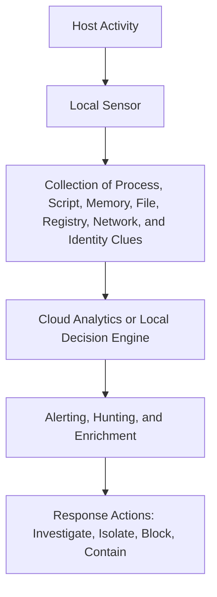
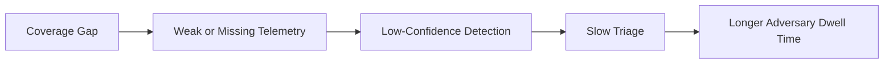
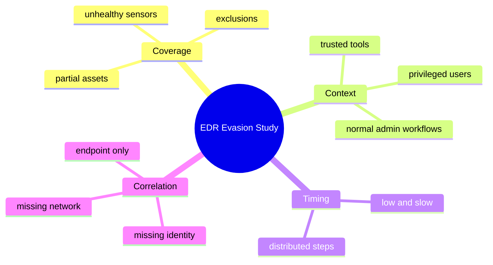
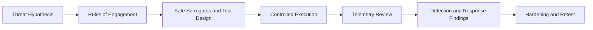
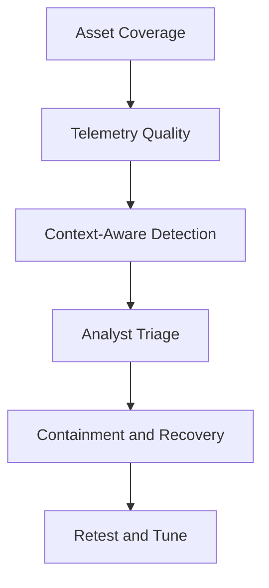
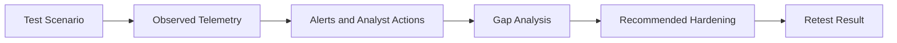

# EDR Evasion

> **Difficulty:** Beginner → Advanced | **Category:** Red Teaming | **Focus:** Safely validating how endpoint defenses detect, resist, and recover from adversary attempts to reduce endpoint visibility

**EDR evasion** is a legitimate study area in authorized adversary emulation because mature security teams need to know where endpoint visibility is weak, delayed, or easy to misinterpret. In a professional engagement, the goal is **not** to teach unsafe bypass tricks. The goal is to understand how attackers reduce defender confidence, then use that knowledge to improve telemetry, detection logic, hardening, and response.

> **Authorized-use only:** This note is for approved red-team, purple-team, and lab validation work. It intentionally avoids exploit code, product-bypass recipes, and step-by-step intrusion instructions.

---

## Table of Contents

1. [What EDR Evasion Means](#1-what-edr-evasion-means)
2. [How Modern EDR Actually Works](#2-how-modern-edr-actually-works)
3. [Where EDR Blind Spots Come From](#3-where-edr-blind-spots-come-from)
4. [Main Evasion Families at a High Level](#4-main-evasion-families-at-a-high-level)
5. [Authorized Adversary-Emulation Workflow](#5-authorized-adversary-emulation-workflow)
6. [Practical Safe Scenarios: Beginner to Advanced](#6-practical-safe-scenarios-beginner-to-advanced)
7. [Defender Countermeasures That Matter Most](#7-defender-countermeasures-that-matter-most)
8. [Common Misunderstandings](#8-common-misunderstandings)
9. [Reporting and Metrics](#9-reporting-and-metrics)
10. [References](#10-references)

---

## 1. What EDR Evasion Means

At a beginner level, **EDR evasion** means understanding how an attacker tries to avoid creating **high-confidence, actionable security signal** on an endpoint.

That can happen in several ways:

- the action is never collected as telemetry
- the telemetry exists but is weak or incomplete
- the behavior blends into normal administration
- the alert is too noisy or low-confidence to trigger response
- defenders see isolated events but fail to connect them into an intrusion story

The most important point is this:

> **EDR evasion is usually about reducing visibility or increasing ambiguity, not becoming literally invisible.**

### AV vs EDR

| Control Type | Primary Focus | Typical Strength | Typical Limitation |
|---|---|---|---|
| Traditional AV | known malicious files and signatures | fast prevention for common malware | weaker against fileless or behavior-driven activity |
| EDR | endpoint telemetry, behavior, investigation, response | richer context and response actions | still depends on coverage, tuning, and analyst workflows |
| XDR-style correlation | endpoint + identity + network + cloud | stronger attack-story reconstruction | only as good as data quality across all sources |

### Safe red-team framing

In an authorized exercise, the useful question is not:

> "How do I beat the product?"

It is:

> "Which endpoint behaviors, administrative paths, or telemetry gaps would let a realistic adversary operate longer before defenders understand what is happening?"

If any stage is weak, an attacker may gain room to operate.

---

## 2. How Modern EDR Actually Works

Many beginners imagine EDR as a single agent that either "catches" or "misses" malicious activity. In reality, modern endpoint security is a **pipeline** made of several layers.

### Common visibility layers

| Layer | What It Commonly Observes | Why It Matters |
|---|---|---|
| process telemetry | process starts, parents, command lines, integrity level | strong for attacker story building |
| script and interpreter telemetry | PowerShell, shells, scripting engines, macro-driven execution | useful for detecting living-off-the-land behavior |
| memory and execution telemetry | suspicious execution patterns, code loading anomalies, exploit-like behavior | important for non-file-based activity |
| file and registry telemetry | dropped artifacts, persistence changes, configuration changes | helpful for early detection and forensic evidence |
| network telemetry | outbound destinations, beacon patterns, suspicious east-west movement | supports context and correlation |
| identity context | user, device, privilege, sign-in risk, admin workflow context | helps distinguish routine admin work from suspicious use |

### Why EDR is powerful

EDR is powerful because it does not rely only on a malicious file hash. It can detect:

- suspicious process ancestry
- unusual script execution
- suspicious privilege use
- patterns that resemble staging, persistence, or lateral movement
- attempts to impair or disable security tooling

### Why EDR is not all-seeing

Even strong EDR has limits:

- not every asset is equally instrumented
- some operating systems or workloads have different visibility depth
- containers, ephemeral systems, and developer workstations create noisy baselines
- cloud control-plane activity may matter more than host telemetry in some intrusions
- analysts still need context to tell risky behavior from legitimate administration

### The practical takeaway

A red team studies EDR the same way it studies firewalls or IAM:

- where is coverage strong?
- where is it partial?
- where do trusted workflows create confusion?
- where does detection depend too heavily on one noisy signal?

---

## 3. Where EDR Blind Spots Come From

Attackers often succeed because security coverage is **inconsistent**, not because every defensive control has been technically defeated.

### Common sources of blind spots

| Blind Spot | Example | Why It Creates Risk |
|---|---|---|
| unmanaged or partially managed assets | lab systems, test VMs, legacy servers, isolated admin workstations | telemetry may be missing or delayed |
| trusted administrative activity | backup tools, software deployment tools, remote admin utilities | suspicious activity can look operationally normal |
| exclusions and allowlists | paths, processes, file types, or devices excluded for business reasons | attackers look for places where scrutiny is intentionally reduced |
| telemetry forwarding issues | agent unhealthy, sensor lag, storage backlog, intermittent connectivity | defenders may assume silence means safety |
| high-noise environments | developer boxes, CI/CD runners, jump hosts | real malicious patterns can hide in routine complexity |
| siloed monitoring | endpoint logs not correlated with identity, SaaS, or network data | no single team sees the full intrusion sequence |
| alert fatigue | many low-quality alerts from the same class of activity | important signals become easy to ignore |

### An important lesson

Well-run adversary emulation often discovers that the biggest issue is not "the EDR failed."

It is one of these:

- the EDR saw something but nobody prioritized it
- the right signal existed on another platform, not the endpoint
- the endpoint signal made sense only when combined with identity or network context
- the alert was tuned out because legitimate activity looked similar

This is why safe EDR-evasion study is really a study of **defender confidence under uncertainty**.

---

## 4. Main Evasion Families at a High Level

This section stays intentionally conceptual. It explains **what kinds of defender weaknesses adversaries target**, without teaching bypass procedures.

### 1. Artifact reduction

This family tries to reduce obvious static indicators such as suspicious files, well-known malware artifacts, or clearly malicious staging patterns.

**What defenders should ask:**  
If a payload becomes less obvious, do we still detect the execution chain, user context, or downstream behavior?

### 2. Trusted-tool abuse

This family relies on built-in tools, admin frameworks, or approved enterprise software so activity appears less foreign to the environment.

**What defenders should ask:**  
Can we distinguish ordinary administration from suspicious use of legitimate tools?

### 3. Behavioral blending

This focuses on making activity look close enough to normal that anomaly models or analysts do not treat it as urgent.

**What defenders should ask:**  
Are we baselining by user role, host function, and business workflow, or only by global averages?

### 4. Identity and context shaping

This family exploits the fact that the same action looks very different depending on:

- who performed it
- where they performed it from
- when they performed it
- what privileges they normally have

**What defenders should ask:**  
Would this action still look acceptable if the account, asset criticality, and prior sequence were considered together?

### 5. Telemetry impairment or tampering attempts

MITRE ATT&CK documents this as part of **Impair Defenses (T1562)**: adversaries may modify parts of the environment to hinder defensive mechanisms. In practice, this includes attempts to weaken sensors, change protection settings, abuse exclusions, or interfere with collection and analysis.

**What defenders should ask:**  
Do we detect attempts to disable, pause, modify, exclude, or silence protections quickly enough?

### 6. Low-and-slow sequencing

Rather than one loud burst of suspicious activity, the adversary spreads actions across time and hosts so each step looks individually unremarkable.

**What defenders should ask:**  
Can our detections connect low-signal events into a multi-stage campaign?

### 7. Cross-plane movement

Some attackers avoid heavily watched endpoints by shifting emphasis toward:

- identity abuse
- SaaS administration
- cloud control planes
- trusted automation systems

**What defenders should ask:**  
Are we over-relying on endpoint data for attacks that mostly unfold outside the endpoint?

### Summary matrix

| Evasion Family | What Changes | Defender Risk |
|---|---|---|
| artifact reduction | obvious suspicious artifacts | overreliance on signatures |
| trusted-tool abuse | tool appearance | legitimate and malicious use look similar |
| behavioral blending | context and baseline fit | anomaly thresholds become less useful |
| identity shaping | actor credibility | privileged or familiar accounts get too much trust |
| telemetry impairment | sensor or control effectiveness | defenders lose evidence quality |
| low-and-slow sequencing | timing and distribution | alerts stay isolated and low priority |
| cross-plane movement | where the attack is visible | security teams monitor only one layer well |

---

## 5. Authorized Adversary-Emulation Workflow

Professional red teams do not jump straight into "evasion." They build a controlled validation plan.

### Step 1: Start with a threat hypothesis

Examples of useful questions:

- Would a realistic attacker be more likely to blend into admin workflows than drop obvious malware?
- Are privileged engineering systems too noisy to monitor well?
- Would a tamper attempt be blocked, alerted, and escalated?
- Are cloud-admin actions correlated with endpoint events on the same user and device?

### Step 2: Define safety controls

Strong guardrails should cover:

- in-scope systems
- approved identities and test hosts
- prohibited actions
- stop conditions
- deconfliction and emergency contacts
- what "proof" is acceptable without creating real business impact

### Step 3: Use safe surrogates

For endpoint validation, mature teams prefer **harmless substitutes** over real offensive payloads.

| Safe Surrogate | What It Helps Validate |
|---|---|
| benign simulation binaries | process ancestry, command-line, and response workflows |
| vendor evaluation modes or security test features | prevention and detection controls without unsafe tooling |
| approved atomic-style tests | whether a specific ATT&CK behavior class is visible |
| synthetic detections and lab-generated telemetry | correlation, triage, and analyst workflows |
| configuration reviews | whether tamper protection, application control, or exclusions are weakening security |

### Step 4: Measure visibility before sophistication

A good testing progression is:

1. validate that basic telemetry is present  
2. validate that obvious suspicious behavior is detected  
3. validate whether realistic, lower-noise behavior still raises concern  
4. validate whether analysts can connect the full sequence

This is much more useful than immediately attempting the hardest possible scenario.

### Step 5: Include defender-side evidence

Collect evidence such as:

- raw telemetry presence
- alert titles and severities
- process trees
- host isolation or containment response
- analyst triage notes
- time to detect, time to escalate, time to contain

### Step 6: Retest after hardening

The real value is not proving a gap once. It is proving the organization can close the gap and measure improvement.

---

## 6. Practical Safe Scenarios: Beginner to Advanced

These scenarios are practical, but they remain non-destructive and non-instructional.

### Beginner scenario: basic endpoint visibility check

**Goal:** Confirm that endpoint controls reliably record suspicious-looking process ancestry and script execution on a managed host.

**Safe method:**

- use an approved benign test artifact or vendor-supported evaluation method
- run it on a controlled lab or explicitly authorized production test system
- compare what the host saw with what the SOC received

**What to verify:**

- was telemetry captured?
- did an alert fire?
- did the alert include useful context?
- did anyone investigate it?

### Intermediate scenario: trusted-tool ambiguity

**Goal:** Determine whether defenders can tell the difference between routine administration and suspicious use of legitimate tools.

**Safe method:**

- use approved administrative tooling in a controlled exercise
- vary user role, device type, and timing
- keep actions benign and reversible

**What to verify:**

- does the detection depend only on tool name?
- does account role affect alert fidelity?
- do analysts understand why the activity is abnormal in context?

### Advanced scenario: low-signal campaign correlation

**Goal:** Test whether defenders can connect a sequence of individually low-severity endpoint, identity, and network events into a meaningful attack narrative.

**Safe method:**

- distribute harmless actions over time
- use pre-approved identities and systems
- evaluate whether correlation occurs across platforms, not just on the host

**What to verify:**

- were the events linked together?
- did the investigation identify the right user, host, and timeline?
- did defenders recognize the business impact of the path?

### Advanced scenario: tamper resilience validation

Microsoft's tamper-protection guidance highlights that attackers often try to change security settings, modify exclusions, suspend processes or services, or otherwise impair protective tooling. In an authorized program, teams should validate this **safely**, using vendor-approved methods or dedicated lab workflows rather than real disablement attempts on live business systems.

**What to verify:**

- are anti-tampering protections enabled?
- are exclusions centrally controlled?
- do tamper attempts raise alerts?
- does the SOC investigate quickly?

### Practical maturity model

| Maturity Level | Primary Question | Good Outcome |
|---|---|---|
| beginner | do we have endpoint visibility at all? | telemetry is present and understandable |
| developing | can we distinguish routine from suspicious admin behavior? | context-aware alerting reduces false trust |
| mature | can we correlate endpoint, identity, and network clues? | low-signal behaviors combine into clear investigations |
| advanced | can we resist and detect attempts to impair protections? | tamper attempts are blocked, alerted, and escalated |

---

## 7. Defender Countermeasures That Matter Most

The best countermeasures are not "one weird trick." They are layered operational improvements.

### 1. Protect the protection stack

Public Microsoft guidance emphasizes **tamper protection** and **tamper resiliency** because attackers commonly try to weaken security controls before or during larger operations.

Important defensive themes include:

- keep anti-tampering protections enabled
- manage controls centrally rather than relying on local overrides
- review exclusions carefully
- alert on attempts to change protection settings
- monitor sensor health, not just malware alerts

### 2. Inventory coverage honestly

Organizations should know:

- which devices have full endpoint coverage
- which have partial coverage
- which are noisy and hard to monitor
- which are business critical even if rarely used

An unmonitored or unstable endpoint is often a bigger problem than a missed signature.

### 3. Detect on sequence, not just single events

Single events are easy to miss. Strong programs correlate:

- unusual process behavior
- identity risk or privilege changes
- outbound connections
- persistence clues
- security-setting modification attempts

### 4. Treat trusted tools as risky when context is wrong

Legitimate tools should not automatically mean legitimate intent.

Useful questions:

- is the user expected to run this tool?
- is this the right host for that action?
- is the timing normal?
- does the sequence fit maintenance or intrusion?

### 5. Harden against driver and policy abuse

Microsoft's tamper-resiliency guidance highlights broader protections such as:

- vulnerable driver blocking
- attack surface reduction rules
- application control
- least privilege and Zero Trust device management

These do not just block malware. They reduce the number of ways an attacker can weaken endpoint defenses in the first place.

### Countermeasure matrix

| Risk Area | Strong Defensive Response |
|---|---|
| telemetry gaps | monitor sensor health and missing-heartbeat conditions |
| exclusions and allowlists | central review, change control, regular cleanup |
| trusted-tool misuse | role-aware detection and admin workflow baselining |
| low-and-slow activity | sequence analytics and campaign correlation |
| tamper attempts | anti-tamper controls, alerting, application control, driver protections |
| siloed data | endpoint + identity + network + cloud correlation |

---

## 8. Common Misunderstandings

### "EDR evasion means defeating the product"

Usually false. Many real intrusions succeed because defenders are uncertain, overloaded, or missing context.

### "No alert means no telemetry"

Not always. Sometimes the data exists but:

- nobody tuned the rule
- the alert was suppressed
- the signal needed correlation with another source
- the analyst did not view it as important

### "Trusted tools are safe by default"

No. Trusted tools are often exactly what make suspicious activity harder to recognize.

### "If kernel or deep endpoint telemetry exists, the problem is solved"

Also false. Detection quality still depends on:

- coverage
- tuning
- baselines
- identity context
- analyst workflow quality

### "Tamper testing belongs in every production engagement"

Definitely not. Attempts to impair protections should be tightly controlled, explicitly authorized, and often limited to labs or vendor-approved workflows.

---

## 9. Reporting and Metrics

Good reporting turns "we found a gap" into something defenders can fix.

### Useful metrics

| Metric | What It Tells You |
|---|---|
| telemetry presence | whether the host produced the needed data |
| telemetry completeness | whether key context such as user, parent, and network destination was present |
| alert fidelity | whether the signal was actionable or noisy |
| time to detect | how quickly defenders noticed |
| time to triage | how quickly someone understood the significance |
| time to contain | how quickly the organization acted |
| tamper resilience | whether attempts to weaken protections were blocked or surfaced |
| correlation quality | whether endpoint, identity, and network evidence formed one story |

### A useful reporting structure

### Findings should answer questions like:

- Which endpoints were fully visible?
- Which actions created strong signal versus ambiguous signal?
- Which detections depended too much on one alert source?
- Did the SOC recognize the significance fast enough?
- Which hardening changes would most improve resilience?

### The best final sentence in an EDR-evasion report

> **The objective is not to prove that endpoint tools are useless; it is to show exactly where their visibility, resilience, or correlation weakens under realistic adversary pressure.**

---

## 10. References

- [MITRE ATT&CK – T1562 Impair Defenses](https://attack.mitre.org/techniques/T1562/)
- [Microsoft Defender for Endpoint – Tamper protection](https://learn.microsoft.com/en-us/defender-endpoint/prevent-changes-to-security-settings-with-tamper-protection)
- [Microsoft Defender for Endpoint – Tamper resiliency](https://learn.microsoft.com/en-us/defender-endpoint/tamper-resiliency)

---

> **Defender mindset:** Study EDR evasion to understand where visibility degrades, where trust is misplaced, and where telemetry needs correlation. The safest and most valuable exercises focus on evidence, resilience, and measurable improvement rather than unsafe bypass mechanics.
