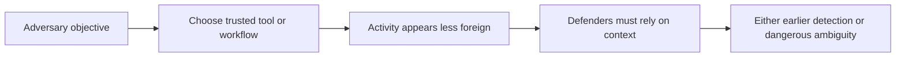
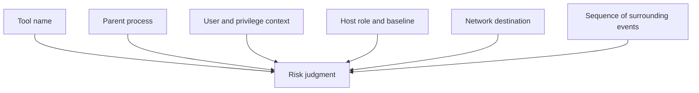
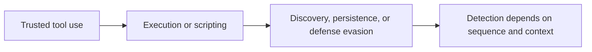
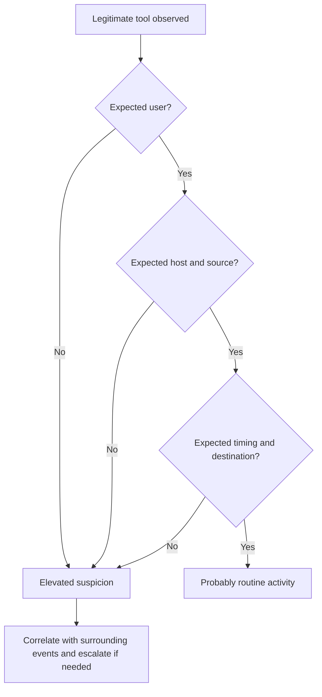
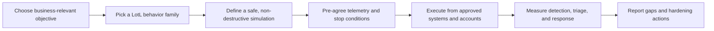
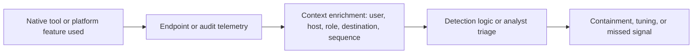

# Living off the Land

> **Difficulty:** Beginner → Advanced | **Category:** Red Teaming — Defense Evasion | **Focus:** Understanding how adversaries abuse trusted tools and how defenders can detect the behavior anyway

**Living off the land (LotL)** means using tools, binaries, scripts, services, or administrative workflows that already exist in the environment instead of introducing obviously foreign malware or tooling. In **authorized adversary emulation**, the purpose of studying LotL is to validate whether defenders can distinguish **normal administration** from **malicious use of trusted capability**.

> **Authorized-use only:** This note is for approved red-team, purple-team, and lab validation work. It intentionally avoids step-by-step intrusion instructions, exploit recipes, and harmful tradecraft details.

---

## Table of Contents

1. [What Living off the Land Means](#1-what-living-off-the-land-means)
2. [Why Adversaries Use It](#2-why-adversaries-use-it)
3. [The Core Mental Model](#3-the-core-mental-model)
4. [Where It Fits in ATT&CK](#4-where-it-fits-in-attck)
5. [Common LotL Behavior Families](#5-common-lotl-behavior-families)
6. [What Makes a Legitimate Tool Suddenly Suspicious](#6-what-makes-a-legitimate-tool-suddenly-suspicious)
7. [Authorized Adversary-Emulation Workflow](#7-authorized-adversary-emulation-workflow)
8. [Practical Safe Scenarios: Beginner to Advanced](#8-practical-safe-scenarios-beginner-to-advanced)
9. [Detection and Hardening Guidance](#9-detection-and-hardening-guidance)
10. [Common Analyst and Operator Mistakes](#10-common-analyst-and-operator-mistakes)
11. [Reporting and Metrics](#11-reporting-and-metrics)
12. [Key Takeaways](#12-key-takeaways)
13. [References](#13-references)

---

## 1. What Living off the Land Means

At a beginner level, living off the land means:

- using what the target already trusts
- reducing obviously foreign artifacts
- blending malicious intent into ordinary operating-system or admin behavior
- forcing defenders to rely on **context** instead of simple signatures

A common beginner misunderstanding is:

> "If the tool is built in, the activity must be safe."

That is false.

A built-in or signed tool can still be part of a harmful sequence. The key issue is not whether the tool is native. The key issue is **how, where, by whom, and in what sequence it is used**.

### Simple definition

```text
Living off the land = trusted capability used for untrusted purpose
```

### LotL is bigger than binaries

People often say **LOLBins** or **LOLBAS**:

- **LOLBins** = Living-off-the-Land binaries
- **LOLBAS** = Living-off-the-Land Binaries and Scripts, commonly used as a Windows-focused reference term
- **GTFOBins** = a Unix/Linux-focused reference for legitimate binaries that can be abused in unsafe configurations

But the idea is broader than executables. LotL may involve:

- built-in binaries
- scripting engines
- installers and signed utilities
- remote administration frameworks
- scheduled automation
- cloud and SaaS administration features
- file sync, backup, or deployment tools

### Why this matters in red teaming

In a mature authorized exercise, the question is not:

> "How do we evade security with a clever built-in tool?"

It is:

> "Would this environment recognize suspicious use of a trusted tool quickly enough to change the outcome of the intrusion?"

---

## 2. Why Adversaries Use It

Living off the land is attractive because defenders often grant extra trust to familiar tools and workflows.

### Main attacker advantages

| Advantage sought | Why LotL helps |
|---|---|
| lower initial suspicion | the process name may look familiar to analysts and allowlisting tools |
| fewer foreign artifacts | less need to drop obviously malicious binaries to disk |
| administrative plausibility | actions may resemble software deployment, troubleshooting, or scripting |
| policy bypass opportunities | some environments trust signed utilities too broadly |
| easier blending | activity can hide inside existing enterprise management noise |

### Important reality check

LotL is **not** magic invisibility.

Modern defenders specifically look for unusual use of trusted tools. In many environments, a built-in tool running from the wrong parent process, under the wrong account, at the wrong time, or against the wrong destination is highly suspicious.



### The real lesson

Living off the land does not remove evidence.
It changes the **shape** of evidence.

Instead of a clear malware signal, defenders may get:

- suspicious process ancestry
- odd command-line structure
- unusual child processes
- rare outbound destinations
- strange timing or account use
- inconsistent admin behavior for that host role

---

## 3. The Core Mental Model

The easiest way to understand LotL is to separate **tool trust** from **behavior trust**.

### A trusted binary is not a trusted action

| Question | Weak thinking | Strong thinking |
|---|---|---|
| Is the tool signed? | Then it is probably fine | Signed tools can still proxy suspicious behavior |
| Is the tool built in? | Then it is normal | Native tools can still be misused |
| Has the tool run here before? | Then this instance is safe | Context may be very different this time |
| Is there malware on disk? | No malware means no attack | The attack may rely on scripts, interpreters, or admin workflows |

### The context stack



If defenders judge only the **tool name**, they lose.
If they judge the **full context stack**, they improve dramatically.

### Beginner analogy

A screwdriver in a maintenance cart is normal.
A screwdriver in an access-control cabinet at 2 a.m. used by someone who never works facilities is not.

The tool stayed the same.
The **context** changed.

---

## 4. Where It Fits in ATT&CK

MITRE ATT&CK is useful here because LotL behavior often spans several techniques rather than one isolated trick.

### Common ATT&CK connections

| ATT&CK idea | Why it matters to LotL |
|---|---|
| **T1218 – System Binary Proxy Execution** | trusted or signed binaries may proxy execution of content or commands |
| **T1036 – Masquerading** | attackers may pair LotL with names, paths, or appearances that look routine |
| **T1059 – Command and Scripting Interpreter** | interpreters are common LotL surfaces because they already exist for admin work |
| **T1562 – Impair Defenses** | adversaries may use native tools to modify or weaken defensive controls |

### Why ATT&CK mapping helps

ATT&CK mapping turns vague statements like:

> "They used built-in tools."

into more actionable questions such as:

- Was a trusted binary used to proxy execution?
- Did the activity rely on scripting or interpreter abuse?
- Did the behavior impair logging, security tooling, or policy enforcement?
- Did the tool use look different from legitimate admin baselines?



### Practical ATT&CK takeaway

LotL is not one technique. It is a **tradecraft style** that appears across multiple phases of an intrusion.

---

## 5. Common LotL Behavior Families

This section stays high level on purpose. The goal is to understand **behavior families**, not memorize abuse recipes.

### 5.1 Proxy execution through trusted binaries

Some signed or built-in binaries can launch, load, or proxy other content.

**Why adversaries like this:** the parent process and executable name may look more legitimate than a custom implant.

**Why defenders care:** the surrounding chain often reveals the problem:

- unusual parent-child relationships
- unexpected file or script origins
- odd integrity level or user context
- abnormal network contact shortly after launch

### 5.2 Script and interpreter abuse

Command interpreters and scripting engines exist because administrators need automation.

**Examples of surfaces defenders often monitor conceptually:**

- shell interpreters
- PowerShell or equivalent automation engines
- script hosts
- macro-capable application environments

**Why this matters:** interpreters are flexible, widely deployed, and often central to legitimate work. That makes them powerful for both administrators and attackers.

### 5.3 Native transfer, staging, and packaging workflows

Operating systems and enterprise environments include legitimate ways to:

- fetch content
- move files
- unpack archives
- convert or encode data
- schedule background transfers

**Why adversaries like this:** they may avoid introducing separate downloaders or packaging tools.

**Defender view:** file movement is rarely suspicious by itself. The important signal is usually the combination of:

- rare source or destination
- unusual user or host role
- suspicious follow-on execution
- compressed timing between transfer and other attacker behaviors

### 5.4 Remote administration and systems-management surfaces

Many environments rely on legitimate remote-management capabilities.

That includes:

- remote shells
- management protocols
- deployment tooling
- software distribution systems
- orchestration and configuration frameworks

**Why adversaries like this:** the traffic and workflow can resemble normal operations.

**What defenders should validate:** not just whether the protocol exists, but whether the **origin, target, privilege level, and timing** make sense.

### 5.5 Scheduled and automated tasking

Automation is normal in enterprises.
That is exactly why it matters.

When adversaries abuse scheduled actions, service creation paths, or recurring jobs, the activity may look operational unless defenders correlate:

- who created it
- on which host tier
- from what management source
- with what preceding events

### 5.6 Cloud and SaaS living off the land

LotL is not limited to endpoints.

Modern attackers may use:

- existing cloud administration roles
- native control-plane actions
- email forwarding rules
- collaboration workflows
- file-sharing and synchronization features

This is still living off the land because the attacker is using **what the platform already provides**.

### Summary table

| Family | What it means | Why it blends | What defenders should focus on |
|---|---|---|---|
| proxy execution | trusted binary launches or loads something on the attacker's behalf | signed/native appearance | parent-child lineage, source artifact, follow-on activity |
| interpreter abuse | shells or scripting engines perform the action | admins use them daily | script telemetry, user role, rare patterns, timing |
| native transfer/staging | built-in transfer or packaging features move data or content | ordinary admin and user workflows exist | source/destination reputation, sequence correlation |
| remote admin abuse | legitimate management paths are reused | traffic resembles normal maintenance | admin tiering, source-host expectations, target sensitivity |
| scheduled automation | recurring or delayed actions are created | scheduled jobs are common in IT | creator identity, host role, persistence context |
| cloud/SaaS native abuse | platform features are misused instead of malware | actions occur inside approved services | audit logs, role anomalies, risky configuration changes |

---

## 6. What Makes a Legitimate Tool Suddenly Suspicious

This is the most important section for defenders.

The same tool may be:

- completely normal in one context
- one of the strongest intrusion signals in another

### Context dimensions that matter most

| Dimension | Low concern example | Higher concern example |
|---|---|---|
| **user** | expected admin role | ordinary user or unexpected service account |
| **host** | jump box or management server | kiosk, finance laptop, domain controller, developer build runner |
| **parent process** | known admin console | document viewer, browser, archive tool, or unusual chain |
| **time** | scheduled maintenance window | off-hours or inconsistent with role |
| **destination** | approved internal management targets | rare external domain, new internal tier, or sensitive server |
| **sequence** | documented workflow | discovery, staging, persistence, and remote actions clustered together |

### The practical detection question

Do not ask only:

> "Did this binary run?"

Ask:

> "Did this binary run in a way that fits the user, host, path, timing, and sequence we expect?"



### What high-maturity defenders do differently

They baseline by:

- role
- asset type
- administrative tier
- business process
- time pattern
- peer-group behavior

That is much stronger than a simple "allowed binary" list.

---

## 7. Authorized Adversary-Emulation Workflow

A professional exercise validates defender performance without turning the note into a misuse guide.

### Safe workflow



### Step-by-step at a safe level

1. **Choose the objective**  
   Example: validate whether defenders notice suspicious use of trusted administrative tooling on user workstations.

2. **Choose the behavior family**  
   Proxy execution, script abuse, native transfer, remote admin, or cloud-native administrative misuse.

3. **Design a benign simulation**  
   Use harmless payloads, test markers, or agreed validation artifacts that prove the path without causing damage.

4. **Predefine what defenders should see**  
   Endpoint telemetry, script logs, audit logs, proxy logs, identity events, and change-management evidence.

5. **Execute with controls**  
   Keep to approved hosts, approved identities, approved time windows, and documented deconfliction procedures.

6. **Review not just alerts, but understanding**  
   Did defenders recognize the activity as suspicious? Did they connect the events into the correct story?

### What good emulation avoids

- copy-paste bypass recipes
- destructive changes to security tooling
- introducing unnecessary risk just to make the exercise look impressive
- unrealistic actor theater disconnected from the client's environment

---

## 8. Practical Safe Scenarios: Beginner to Advanced

These scenarios are practical because they tell you **what to validate**, **what evidence to collect**, and **what success looks like** without teaching abuse steps.

### 8.1 Beginner scenario — suspicious trusted-tool execution on a workstation

**Goal:** Determine whether the SOC can distinguish ordinary user activity from suspicious use of a native execution surface.

**What to validate:**

- process lineage quality
- command-line visibility
- user-to-host baselines
- analyst recognition of unusual trusted-tool use

**Evidence to collect:**

- process tree
- user context
- host role
- timestamp
- any linked network or file events

**Success condition:** defenders escalate because the activity is contextually wrong, even if the binary itself is signed or native.

### 8.2 Intermediate scenario — LotL chain across endpoint and network telemetry

**Goal:** Validate whether defenders can connect several low-signal events into one story.

**Representative behavior pattern:**

1. trusted tool use
2. benign staging or transfer action
3. follow-on script or scheduled activity
4. outbound communication or access attempt inconsistent with the host role

**What to measure:**

- correlation quality across endpoint, network, and identity data
- time to detect the chain
- whether any single weak alert was ignored even though the sequence was strong

### 8.3 Advanced scenario — role-aware LotL detection on admin infrastructure

**Goal:** Test whether the organization can detect misuse of legitimate administration from systems where admin activity is already noisy.

This is harder because jump boxes, deployment servers, and automation runners often perform actions that look powerful by design.

**What to validate:**

- tier-aware baselining
- separation between routine automation and suspicious deviation
- controls around sensitive destinations
- whether the team can identify when a normal admin surface is used outside its normal purpose

**High-value learning outcome:**

Many organizations discover that they can detect LotL on user endpoints, but not on privileged management infrastructure where the same behavior is easier to excuse.

### 8.4 Cloud and SaaS scenario — native platform misuse without malware

**Goal:** Validate whether audit logs and identity analytics can detect risky use of built-in platform features.

**Focus areas:**

- unexpected admin actions
- unusual mailbox or file-sharing changes
- risky forwarding or synchronization behavior
- abnormal role use or consent changes

**Why this matters:**

Defenders who focus only on malware often miss attacks that stay mostly inside approved services.

---

## 9. Detection and Hardening Guidance

LotL defense is mostly about **context-rich visibility** and **policy discipline**.

### Detection ideas that actually matter

| Defensive priority | Why it matters |
|---|---|
| process lineage and parent-child analytics | trusted tools become suspicious when launched by unusual parents |
| script and interpreter logging | interpreters are flexible and common LotL surfaces |
| role-aware baselining | the same action means different things on a user laptop vs jump host |
| identity correlation | valid accounts are often central to LotL tradecraft |
| destination analysis | suspicious external or cross-tier destinations expose hidden intent |
| sequence analytics | several low-signal events together may show the intrusion clearly |

### Hardening controls

| Control | Defensive value |
|---|---|
| **Application control / allowlisting with context** | reduces unnecessary execution surfaces, especially on user endpoints |
| **Administrative tiering** | limits where powerful tools and accounts should operate |
| **Constrained scripting where possible** | narrows flexible abuse surfaces while preserving business use |
| **Least privilege** | reduces how much damage native tools can do under ordinary accounts |
| **Logging and forwarding health checks** | ensures defenders are not blind to trusted-tool abuse |
| **Cloud and SaaS audit monitoring** | catches native-platform misuse that never drops malware |

### Practical hardening principle

Remove or restrict capabilities that are not actually needed.

A binary or feature that is "legitimate" but unnecessary on broad classes of systems creates avoidable risk.

### Detection pipeline view



### What weak defenses often rely on

- static allowlists with no context
- binary name alone
- malware hash detections only
- isolated alerts without timeline correlation
- no distinction between admin tiers and user tiers

That approach is exactly what LotL tradecraft tries to exploit.

---

## 10. Common Analyst and Operator Mistakes

### Analyst mistakes

#### Mistake 1: trusting the executable name too much

A familiar name reduces suspicion, but it should not end analysis.

#### Mistake 2: looking at one event in isolation

LotL often appears ordinary until you examine the surrounding chain.

#### Mistake 3: ignoring host role

What is routine on a software deployment server may be highly suspicious on a user laptop.

#### Mistake 4: under-monitoring approved cloud workflows

Native SaaS and cloud features can become the attack path.

### Operator mistakes

#### Mistake 1: assuming LotL automatically equals realism

A realistic test uses behavior that fits the environment and threat model, not just famous tools.

#### Mistake 2: overfocusing on one binary

LotL is about trusted capability and context, not a scavenger hunt for a specific filename.

#### Mistake 3: creating unnecessary exposure

The point is to validate defenses safely, not to maximize stealth theatrics.

#### Mistake 4: failing to define expected observables

If you do not know what telemetry should exist, you cannot judge whether the defense actually failed.

---

## 11. Reporting and Metrics

A strong report explains how the trusted activity created defender ambiguity.

### Useful reporting questions

- Which trusted surface was used or simulated?
- Why was that surface plausible in this environment?
- What telemetry existed?
- What telemetry was missing, delayed, or low-confidence?
- Did defenders identify the activity as suspicious, or only as generic admin noise?
- What control would most reduce the ambiguity next time?

### Good metrics

| Metric | Why it helps |
|---|---|
| **time to first suspicious signal** | shows whether the environment produced any early clue |
| **time to correct analyst interpretation** | measures understanding, not just alert generation |
| **cross-source correlation quality** | shows whether endpoint, identity, and network data tell one story |
| **false-normal rate** | indicates how often risky native activity is excused as routine |
| **coverage by host role** | reveals blind spots on servers, jump boxes, SaaS, or cloud control planes |

### Example finding language

A useful finding usually sounds like this:

> "The environment generated telemetry for the trusted-tool activity, but detection logic and analyst baselines treated it as routine administration. This created a gap between visibility and understanding, increasing the likely dwell time of an attacker using living-off-the-land tradecraft."

That is more actionable than simply saying:

> "LOLBins were not detected."

---

## 12. Key Takeaways

- Living off the land means using **trusted capability for untrusted purpose**.
- The strongest defensive question is not "Did this native tool run?" but **"Was its use contextually normal?"**
- LotL is a tradecraft style that can appear across execution, persistence, defense evasion, discovery, lateral movement, and cloud administration.
- Mature detection depends on **context, sequence, role awareness, and cross-source correlation**.
- In authorized adversary emulation, the goal is to validate defender understanding safely — not to publish intrusion recipes.

---

## 13. References

- [MITRE ATT&CK – T1218: System Binary Proxy Execution](https://attack.mitre.org/techniques/T1218/)
- [MITRE ATT&CK – T1036: Masquerading](https://attack.mitre.org/techniques/T1036/)
- [MITRE ATT&CK – T1562: Impair Defenses](https://attack.mitre.org/techniques/T1562/)
- [LOLBAS Project](https://lolbas-project.github.io/)
- [GTFOBins](https://gtfobins.github.io/)
