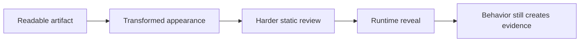
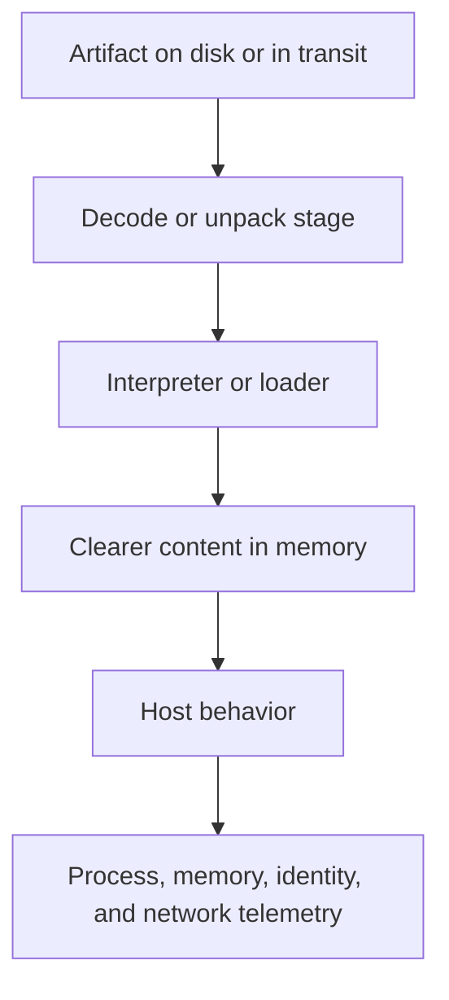
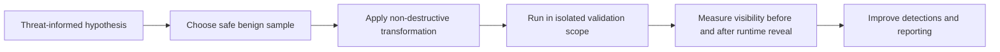
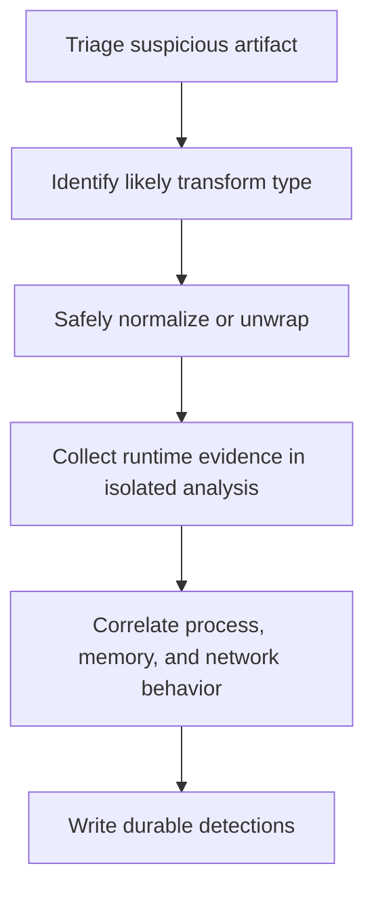

# Obfuscation Techniques

> **Difficulty:** Beginner → Advanced | **Category:** Red Teaming — Defense Evasion | **Focus:** Understanding how adversaries hide intent and how defenders can still uncover it

Obfuscation changes how code, scripts, commands, configuration, or files look so that their true purpose is less obvious to people and security tools. In authorized adversary-emulation, the goal of studying obfuscation is to validate whether defenders can recognize suspicious behavior when the easy clues are reduced. This note stays intentionally non-weaponized: it explains concepts, tradeoffs, analysis methods, and safe exercise design.

---

## Table of Contents

1. [What Obfuscation Means](#1-what-obfuscation-means)
2. [Why Adversaries Obfuscate](#2-why-adversaries-obfuscate)
3. [Obfuscation vs Encoding, Compression, and Encryption](#3-obfuscation-vs-encoding-compression-and-encryption)
4. [Common Obfuscation Layers](#4-common-obfuscation-layers)
5. [Why Runtime Still Reveals the Truth](#5-why-runtime-still-reveals-the-truth)
6. [Practical Adversary-Emulation Use Cases](#6-practical-adversary-emulation-use-cases)
7. [Defender Analysis Workflow](#7-defender-analysis-workflow)
8. [Operator and Defender Viewpoints](#8-operator-and-defender-viewpoints)
9. [Detection and Hardening Ideas](#9-detection-and-hardening-ideas)
10. [Common Mistakes](#10-common-mistakes)
11. [References](#11-references)

---

## 1. What Obfuscation Means

> **Beginner view:** obfuscation hides meaning, not necessarily capability.

If a readable artifact clearly shows what it intends to do, an obfuscated version tries to make that intent harder to see by changing the outer appearance. That may involve:

- changing structure
- hiding strings
- splitting logic across stages
- wrapping the real content inside another layer

A simple mental model is:

> **Obfuscation does not remove behavior. It delays understanding.**

### Safe analogy

Think of a tool placed inside several boxes:

- the tool is still the same tool
- but it takes longer to identify
- and each box may hide a different clue



### Why this matters in red teaming

Authorized teams study obfuscation to answer questions like:

- Can analysts identify risky behavior even when strings and structure are hidden?
- Do detections rely too heavily on simple signatures?
- Can defenders recover meaning from memory, process, or network context after runtime decoding?

---

## 2. Why Adversaries Obfuscate

Obfuscation is usually meant to increase defender workload or reduce low-effort detection.

Common goals include:

- making signatures less reliable
- slowing reverse engineering
- concealing high-signal strings, domains, or configuration data
- forcing defenders to inspect runtime behavior instead of only disk artifacts
- separating outer delivery from inner meaning

### ATT&CK context

MITRE ATT&CK documents this general area under:

- **T1027 – Obfuscated/Compressed Files and Information**
- **T1140 – Deobfuscate/Decode Files or Information**

These pair naturally:

- **T1027** describes how content is hidden
- **T1140** describes how it becomes usable again at runtime

### The tradeoff

Obfuscation helps the adversary only if the extra complexity is worth it.

| Benefit sought | Cost introduced |
|---|---|
| fewer obvious strings | harder debugging and maintenance |
| less readable source | more brittle execution paths |
| slower static analysis | more decode or unpack artifacts at runtime |
| reduced signature hits | increased chance of unusual loader behavior |

So the professional question is not:

> “Can we obfuscate this?”

It is:

> “Would this materially change what the defender sees, and is it realistic for the scenario?”

---

## 3. Obfuscation vs Encoding, Compression, and Encryption

These terms are often mixed together, but they are not the same.

| Technique | Main purpose | Does it require a secret key? | Defender takeaway |
|---|---|---|---|
| Encoding | represent data differently | no | usually easy to reverse once recognized |
| Compression | reduce size or package data | no | unpacking often restores normal content |
| Encryption | protect confidentiality | yes | content is hidden until decrypted |
| Obfuscation | make meaning or structure harder to understand | not always | look for the transform and the runtime reveal |

### Practical distinction

- **Encoding** changes representation.
- **Compression** changes size and layout.
- **Encryption** protects secrecy.
- **Obfuscation** increases analysis difficulty.

Real campaigns often combine all four.

```text
Readable content
   ↓
Compressed container
   ↓
Encoded wrapper
   ↓
Obfuscated loader logic
   ↓
Runtime decode / unpack
   ↓
Usable behavior
```

---

## 4. Common Obfuscation Layers

Obfuscation can happen at many layers. Mature defenders learn to ask which layer changed and what signal remains.

### 4.1 String and data obfuscation

This hides important text until later.

Examples at a high level:

- suspicious keywords split across fragments
- configuration stored as transformed blobs
- strings materialized only at runtime
- stack-built or reconstructed text

**What defenders still get:**

- high-entropy blobs
- decode routines
- reconstructed strings in memory
- suspicious behavior immediately after reveal

### 4.2 Script and source obfuscation

This makes code harder for humans and simple scanners to read.

Common patterns include:

- renamed variables and functions
- deeply nested expressions
- indirect execution paths
- excessive concatenation or generated code
- minified or one-line script structure

**What defenders still get:**

- interpreter activity
- process lineage
- command-line context
- script engine telemetry
- runtime content if logging or instrumentation is strong

### 4.3 Binary and loader obfuscation

This targets file structure and reverse engineering effort.

High-level patterns include:

- packing or wrapping the real payload
- altered control flow
- delayed import or API resolution
- code that only becomes clear after unpacking or decryption

**What defenders still get:**

- unusual file entropy
- suspicious section layout
- memory allocation and execution chains
- unpacked content in memory
- behavioral sequences after load

### 4.4 Container and delivery obfuscation

Sometimes the outer container is misleading even if the inner behavior is simple.

Examples include:

- nested archives
- renamed extensions
- decoy outer documents or installers
- harmless-looking wrappers around a more interesting inner artifact

**What defenders still get:**

- extraction events
- archive depth
- email and download provenance
- child processes launched from the container or viewer

### 4.5 Configuration concealment

Adversaries often hide:

- tasking
- destinations
- feature flags
- target lists
- timing rules

This matters because defenders may miss the true purpose until configuration is recovered.

**What defenders still get:**

- config parsing logic
- decode routines
- rare destinations after configuration reveal
- repeated operational patterns across samples

### 4.6 Staged runtime reveal

This is the most important idea:

> Many obfuscated artifacts look weak on disk but become obvious while running.



Obfuscation often removes early clues, but it rarely removes **all** clues.

---

## 5. Why Runtime Still Reveals the Truth

Defenders sometimes focus too much on the outer file and not enough on the execution path.

### A useful rule

If a transformed artifact is going to do something meaningful, it usually must eventually:

- decode
- unpack
- reconstruct
- or request the hidden content

That runtime step is where defenders often recover advantage.

### Visibility layers

| Layer | Questions defenders ask |
|---|---|
| File or email | Does the container look unusual? Is entropy high? Is nesting odd? |
| Process start | Which parent launched it? Does the execution path fit the user workflow? |
| Decode or unpack stage | Are there signs of transformation or memory staging? |
| Runtime behavior | What actions occur after the content becomes usable? |
| Network or identity context | Does the behavior align with normal business use? |

### The key lesson

Obfuscation is strongest against shallow inspection. It is weaker against:

- memory inspection
- process correlation
- sandboxing
- sequence-based detection
- cross-source analytics

---

## 6. Practical Adversary-Emulation Use Cases

This topic is valuable in authorized exercises when the goal is to validate detection depth, not to “hide better at any cost.”

### Safe exercise patterns

| Exercise question | Safe emulation pattern | What to measure |
|---|---|---|
| Can the SOC recognize risky script behavior when readability is reduced? | Use a harmless lab script that performs benign inventory actions, then transform its appearance without changing its harmless function | logging quality, analyst triage time, alert fidelity |
| Can analysts handle packed or wrapped artifacts? | Use a training sample that unpacks to benign functionality in an isolated environment | sandbox coverage, reverse-engineering workflow, memory capture quality |
| Can mail or file controls inspect nested containers? | Deliver a harmless nested sample to a validation environment | archive inspection depth, detonation coverage, analyst process |
| Can defenders recover meaning after runtime decoding? | Use a lab artifact that reveals only a benign message or mock configuration during execution | post-decode telemetry, detection sequencing, correlation quality |

### A safe adversary-emulation flow



### What makes the exercise realistic

A realistic exercise is not the one with the “coolest” concealment. It is the one that accurately tests:

- how defenders inspect transformed artifacts
- whether runtime decode events are visible
- whether sequence analytics survive reduced readability

---

## 7. Defender Analysis Workflow

A good workflow turns “hard to read” into “understood enough to respond.”

### Analysis pipeline



### Practical clues

| Clue | Why it matters |
|---|---|
| high-entropy blobs or packed sections | may indicate hidden strings, config, or wrapped content |
| tiny launcher plus large data blob | may indicate staged reveal |
| unreadable one-line script with many string operations | may indicate source-level concealment |
| unusual child process chain from document, archive, or script engine | container or wrapper may be hiding the real activity |
| behavior becomes clear only after load | static-only inspection is insufficient |

### Durable detections focus on behavior

The strongest detections are not written only around a literal string. They often combine:

- transform indicator
- execution context
- post-reveal behavior
- destination rarity
- user or host context

That matters because the outer representation may change frequently while the underlying operational pattern does not.

---

## 8. Operator and Defender Viewpoints

| Topic | Operator viewpoint | Defender viewpoint |
|---|---|---|
| Realism | Does the concealment level fit the modeled adversary? | Is this a likely threat pattern for our environment? |
| Safety | Can we test the question without introducing harmful capability? | Can we observe the sample without exposing production workflows? |
| Evidence | Will we still be able to explain the behavior clearly in reporting? | Can we reconstruct the runtime story from telemetry? |
| Detection | Which signals are reduced, and which remain strong? | Which control catches the activity after decoding or unpacking? |
| Cost | Is the extra complexity worth the learning value? | Are we over-relying on static signatures? |

### Red team rule of thumb

If additional obfuscation makes the exercise harder to explain than to detect, it probably does not improve the engagement.

---

## 9. Detection and Hardening Ideas

Defenders do not need perfect deobfuscation to win. They need enough visibility to identify suspicious behavior early and reliably.

### Practical defensive priorities

- collect telemetry from interpreters, loaders, and script engines
- preserve process lineage and parent-child relationships
- inspect nested archives and container depth where feasible
- baseline normal script and admin behavior for each environment
- capture runtime artifacts such as memory-resident strings or decoded configuration when allowed
- detect suspicious sequences, not just suspicious words
- alert when transformed content is followed by rare network or privileged behavior
- maintain analyst playbooks for packed, wrapped, or unreadable artifacts

### Maturity model

| Maturity | Characteristics |
|---|---|
| Basic | depends mostly on filenames, hashes, and obvious strings |
| Developing | adds sandboxing, archive inspection, and process context |
| Mature | correlates file, process, memory, identity, and network signals |
| Advanced | detects the sequence from transform → reveal → behavior even when outer content changes |

### Analyst mindset

Ask:

1. **What is being hidden?**
2. **When does it become usable?**
3. **What telemetry exists at that moment?**
4. **Which behavior after reveal matters most?**

Those four questions often cut through the noise quickly.

---

## 10. Common Mistakes

### 1. Treating obfuscation as magic invisibility

It usually removes some clues, not all clues.

### 2. Confusing encoding with strong secrecy

Many transformed artifacts are easy to normalize once recognized.

### 3. Relying only on static signatures

If detections stop at file content, runtime reveal will be missed.

### 4. Assuming all unreadable code is malicious

Commercial software, packers, and minified code can also look opaque. Context matters.

### 5. Overcomplicating red team exercises

The goal is to answer a security question safely, not to build a puzzle for its own sake.

### 6. Forgetting reporting clarity

If the exercise cannot be explained clearly, the learning value drops.

---

## 11. References

- [MITRE ATT&CK – T1027: Obfuscated/Compressed Files and Information](https://attack.mitre.org/techniques/T1027/)
- [MITRE ATT&CK – T1140: Deobfuscate/Decode Files or Information](https://attack.mitre.org/techniques/T1140/)
- [MITRE ATT&CK – TA0005: Defense Evasion](https://attack.mitre.org/tactics/TA0005/)
- [NIST SP 800-61 Rev. 2 – Computer Security Incident Handling Guide](https://nvlpubs.nist.gov/nistpubs/SpecialPublications/NIST.SP.800-61r2.pdf)

---

> **Key lesson:** Obfuscation is best understood as a delay tactic against analysis. In strong environments, defenders recover ground by watching the reveal point—where hidden content becomes behavior.
