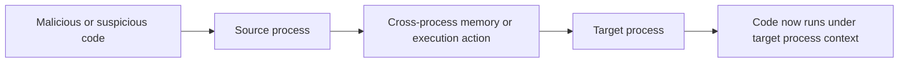
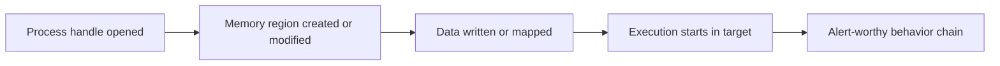
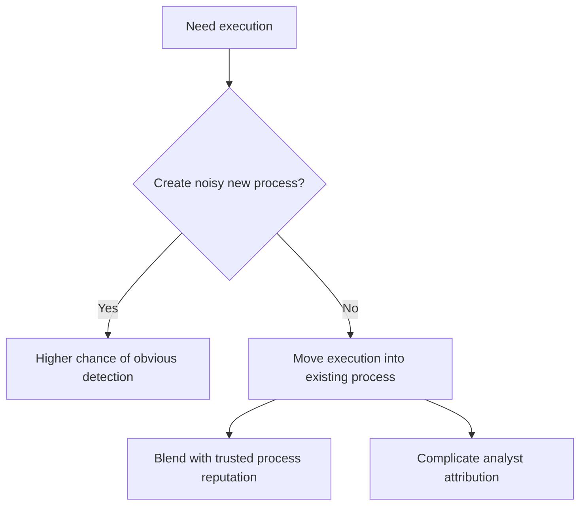
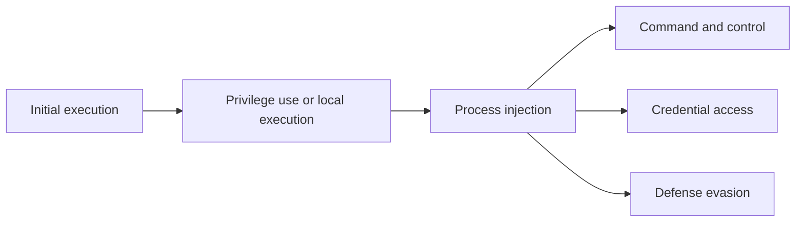
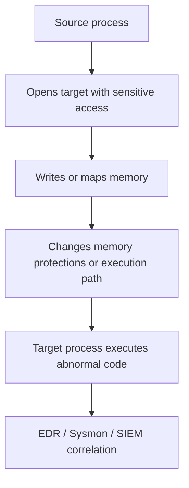
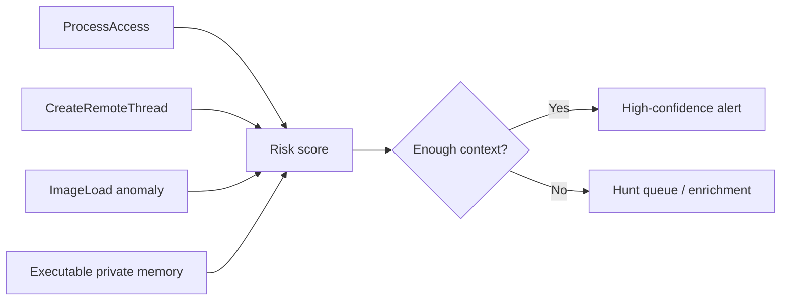
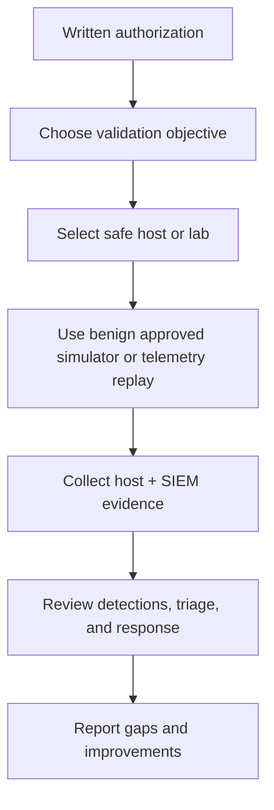
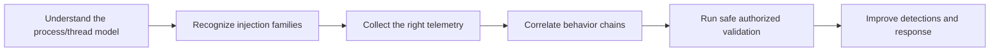

# Process Injection

> **Difficulty:** Intermediate → Advanced | **Category:** Red Teaming | **Focus:** Understanding cross-process code execution, its detection surface, and safe adversary-emulation use

**Process injection** is the act of causing code, a module, or a thread of execution associated with one process to run inside the memory space of another process.

In real intrusions, adversaries use it to blend malicious execution into trusted processes, inherit access or privileges, and reduce obvious artifacts. In **authorized adversary emulation**, the goal is not “stealth for its own sake,” but to validate whether defenders can detect suspicious cross-process memory and execution behavior.

> **Safety note:** This note intentionally stays at the **conceptual, defensive, and emulation-planning level**. It does **not** provide exploit code, shellcode, or step-by-step intrusion instructions.

---

## Table of Contents

1. [What Process Injection Is](#1-what-process-injection-is)
2. [Process and Thread Basics](#2-process-and-thread-basics)
3. [Why Adversaries Use It](#3-why-adversaries-use-it)
4. [Common Injection Families](#4-common-injection-families)
5. [Where It Fits in ATT&CK and Attack Chains](#5-where-it-fits-in-attck-and-attack-chains)
6. [What Defenders Usually See](#6-what-defenders-usually-see)
7. [Detection Logic That Actually Matters](#7-detection-logic-that-actually-matters)
8. [How to Emulate It Safely During an Authorized Exercise](#8-how-to-emulate-it-safely-during-an-authorized-exercise)
9. [A Practical Validation Workflow](#9-a-practical-validation-workflow)
10. [Common Analyst Pitfalls](#10-common-analyst-pitfalls)
11. [Reporting and Remediation Guidance](#11-reporting-and-remediation-guidance)
12. [Key Takeaways](#12-key-takeaways)
13. [References](#13-references)

---

## 1. What Process Injection Is

At a high level, process injection changes **where code runs**.

Instead of executing inside the original process, code is made to run inside a **different target process**.

That matters because defenders often trust some processes more than others.



### The beginner mental model

Think of a process as a **container** with:

- its own virtual memory
- one or more threads
- a security context
- loaded modules/DLLs/shared libraries
- handles to files, registry keys, sockets, and other objects

According to Microsoft, a process provides the resources needed to execute a program, while a thread is the schedulable unit that actually runs code. That distinction is important: many injection techniques manipulate **memory**, **threads**, or both.

### What makes it suspicious

Process injection becomes suspicious when one process:

- opens or manipulates another process unexpectedly
- writes into that process’s memory
- changes memory protections to allow execution
- starts or redirects execution in that remote process
- loads an unexpected module into it

Not every cross-process action is malicious. Accessibility tools, EDR products, debuggers, overlays, and some enterprise agents also interact with other processes. The key question is not “did one process touch another?” but **whether the full context looks abnormal**.

---

## 2. Process and Thread Basics

If you do not understand processes and threads, process injection feels mysterious. It is really just a combination of a few low-level building blocks.

### Core building blocks

| Concept | Simple meaning | Why it matters for injection |
|---|---|---|
| process | isolated execution container | the target that adversaries want to hide inside |
| thread | schedulable execution path | often the thing redirected or created |
| virtual memory | per-process address space | where code or data is placed |
| module | loaded executable component | some techniques load or map code as a module |
| handle | reference to a system object | suspicious access rights can reveal preparation for injection |

### Conceptual view

```text
Source Process
  ├─ obtains handle to target process
  ├─ interacts with target memory
  └─ influences execution

Target Process
  ├─ existing address space
  ├─ existing threads and modules
  └─ new or redirected execution path appears
```

### Why defenders care about the sequence

A single event is often weak.

A **sequence** is much stronger:



This sequence-based view is far more useful than relying on one API, one event ID, or one signature.

---

## 3. Why Adversaries Use It

Process injection is attractive because it can help with **stealth, access, and execution control**.

### Common attacker objectives

| Objective | Why injection helps |
|---|---|
| blend into trusted activity | code appears under a legitimate process name |
| inherit useful context | target process may already have network access, tokens, or user trust |
| reduce simple detections | defenders focused only on new suspicious processes may miss in-memory execution |
| evade file-based controls | execution may occur with little or no obvious dropped executable |
| complicate triage | analysts must separate legitimate target-process behavior from injected behavior |

### Example attacker thinking



### Important reality check

Modern EDRs are very aware of process injection. Many products specifically hunt for:

- remote thread creation
- suspicious process-access rights
- executable private memory
- memory writes into another process
- thread start addresses that do not map cleanly to known modules

So process injection is **not** a guaranteed bypass. It is simply a common adversary behavior that defenders should be prepared to detect.

---

## 4. Common Injection Families

MITRE ATT&CK tracks process injection under **T1055** and multiple sub-techniques. You do **not** need exploit-level details to understand the major families.

### 4.1 Remote thread style injection

The high-level pattern is that one process influences another process’s memory and then causes execution to begin there by means of a newly introduced thread.

**Why defenders notice it:** it often creates highly recognizable telemetry, especially around process access and cross-process thread creation.

### 4.2 APC-based execution

Instead of creating a brand-new remote thread, execution is queued into a thread that already exists.

**Why defenders care:** it can reduce the visibility of obvious thread-creation patterns, but still leaves behavioral clues in thread activity and memory state.

### 4.3 DLL or module-style injection

A process is manipulated so that it loads an additional module/library.

**Why defenders care:** module loads, unsigned DLLs, unexpected load paths, and abnormal load context can become strong signals.

### 4.4 Section mapping / shared-memory approaches

Rather than a crude “write bytes and run” pattern, some tradecraft maps memory sections between processes.

**Why defenders care:** it may avoid some classic signatures, but defenders can still hunt the relationship between handle access, memory mapping, and execution.

### 4.5 Process hollowing

A benign-looking process is created, but the execution image or memory backing is altered so the process does not really behave like the program it claims to be.

**Why defenders care:** the process image, memory, and execution flow no longer align cleanly.

### 4.6 Thread hijacking / context manipulation

Execution is redirected by modifying the state of an existing thread rather than introducing an obviously new one.

**Why defenders care:** it can be quieter than simple remote thread creation, but it still creates unusual thread-state transitions and memory artifacts.

### Quick comparison

| Family | Main idea | Typical detection surface |
|---|---|---|
| remote thread | start execution in another process with a new thread | process access + remote thread telemetry |
| APC-based | queue execution onto existing thread | thread behavior + memory changes |
| DLL/module injection | force-load code as module | image-load telemetry + path/signature anomalies |
| section mapping | share/map memory across processes | mapping behavior + execution from unusual regions |
| process hollowing | benign-looking process, different runtime reality | image-memory mismatch + suspicious startup sequence |
| thread hijacking | redirect an existing thread | thread context anomalies + execution pivot |

### What advanced analysts learn

Do not lock your thinking onto one API or one “classic” pattern.

The important question is:

> **Did execution move into a different process in a way that is inconsistent with the target’s normal purpose?**

---

## 5. Where It Fits in ATT&CK and Attack Chains

Process injection usually supports other goals rather than standing alone.

### Common places in an attack chain



### Why MITRE places it under Defense Evasion

Injection often helps attackers:

- hide malicious logic inside trusted processes
- reduce dependence on suspicious standalone binaries
- complicate static and file-based detection
- alter the process tree an analyst sees

### But it can support other tactics too

| Tactic area | How injection supports it |
|---|---|
| defense evasion | hide execution inside a trusted process |
| privilege escalation | move into a process with more useful context or integrity |
| credential access | operate closer to sensitive processes or security boundaries |
| command and control | run communications inside a common or internet-facing process |
| persistence | keep an in-memory foothold until reboot or process exit |

---

## 6. What Defenders Usually See

A mature defender rarely “sees process injection” as one single labeled event.

They see **clues** across endpoint telemetry.

### High-value telemetry sources

| Source | Why it matters |
|---|---|
| EDR endpoint telemetry | often correlates process access, memory changes, and execution |
| Sysmon | useful for process creation, image loads, CreateRemoteThread, and ProcessAccess |
| ETW / OS-level telemetry | can capture lower-level execution and memory behaviors |
| memory forensics | validates private executable memory, unusual modules, or altered image regions |
| SIEM correlation | connects low-level host events into a full sequence |

### Especially useful Sysmon events

Microsoft Sysmon documentation highlights several event types that are valuable here:

- **Event ID 1 – Process creation**
- **Event ID 7 – Image loaded**
- **Event ID 8 – CreateRemoteThread**
- **Event ID 10 – ProcessAccess**

That does **not** mean “enable everything blindly.” These events can be noisy. Good defenders filter known-good tools and prioritize high-risk source/target combinations.

### Common endpoint signals

| Signal | Why it is interesting |
|---|---|
| one process opens another with strong rights | may be preparing for memory interaction |
| execution begins from private executable memory | common red flag for in-memory payloads |
| thread start address is not inside a normal module | suggests shellcode or manually mapped code |
| unsigned or unexpected module appears in trusted process | may indicate module-based injection |
| target process behavior suddenly changes | process role and runtime behavior no longer match |

### Visualizing defender visibility



---

## 7. Detection Logic That Actually Matters

Strong detection logic is usually **behavioral and contextual**, not signature-only.

### 7.1 Sequence beats isolated events

A useful detection asks whether the following happened close together:

- source process accessed a target process
- target memory changed in a meaningful way
- execution started from an unusual address or module
- resulting process behavior no longer matched baseline

That is much stronger than “alert if Event ID 8 exists.”

### 7.2 Source-target context matters

Some source-target pairs are far more suspicious than others.

| Source process | Target process | Why it deserves attention |
|---|---|---|
| Office app | browser, explorer, system utility | unusual business relationship |
| scripting engine | security-sensitive process | often low-legitimacy source to high-value target |
| user-writable app path | signed system process | trust mismatch |
| short-lived launcher | long-lived trusted process | common staging pattern |

### 7.3 Memory context matters

Defenders should ask:

- Is code executing from a known image-backed region?
- Is the region private, writable, and executable?
- Does the thread start in memory that has no normal module metadata?
- Does the target process usually behave this way on this host?

### 7.4 Baselines matter

False positives happen because legitimate products also inject code:

- security tools
- endpoint management agents
- assistive technology
- browser extensions or graphics overlays
- application compatibility shims
- debuggers and profilers

The goal is not “alert on all injection-like behavior.” The goal is to distinguish:

- **expected enterprise software behavior**
- **rare but benign admin behavior**
- **suspicious cross-process execution chains**

### Practical hunting ideas

A mature hunt often looks for combinations such as:

- ProcessAccess + CreateRemoteThread involving unusual source images
- executable private memory in processes that usually run only image-backed code
- unexpected DLL loads from user-writable directories into trusted processes
- browser or system processes making new network connections immediately after suspicious memory activity
- repeated failed or blocked memory-manipulation attempts on protected processes

### High-signal analytic model



---

## 8. How to Emulate It Safely During an Authorized Exercise

This is where red-team discipline matters.

The purpose of emulation is to validate **detection and response**, not to introduce uncontrolled risk.

### Safer mindset

Instead of asking:

> “How do we get shellcode running in another process?”

Ask:

> “How do we safely validate whether the client can detect suspicious cross-process memory and execution behavior?”

### Recommended safety principles

- obtain explicit written authorization for memory-manipulation tradecraft
- define allowed hosts, processes, time windows, and stop conditions
- prefer isolated lab systems, canary endpoints, or pre-approved pilot hosts
- use **benign** and **controlled** test harnesses or vendor-safe simulation methods
- coordinate deconfliction when production stability matters
- capture evidence for reporting, not just success/failure

### Safe emulation options

| Goal | Safer way to validate it |
|---|---|
| verify telemetry exists | run an approved benign simulator in a lab or canary segment |
| verify SIEM correlation | replay known-good telemetry or test data into the pipeline |
| verify analyst workflow | tabletop the event chain with real logs from a controlled test |
| verify blocking controls | use pre-approved detection-validation tooling with rollback plans |

### What not to do

- do not run custom malware or live offensive payloads on production systems without explicit approval
- do not target critical business processes if a crash would affect operations
- do not assume “benign test” means “no risk” when interacting with security-sensitive processes
- do not treat a blocked attempt as failure; blocked behavior may actually prove the control works

### Exercise design flow



---

## 9. A Practical Validation Workflow

Here is a practical workflow that keeps the exercise controlled.

### Phase 1: Define the question

Be precise.

Examples:

- Can the client detect **cross-process thread creation**?
- Can they distinguish **expected enterprise injection** from suspicious cases?
- Can they investigate a trusted process that begins executing from unusual memory?
- Can they correlate the host event with subsequent network activity?

### Phase 2: Define success criteria

| Validation area | Example success criterion |
|---|---|
| collection | required endpoint events are present and searchable |
| detection | alert or hunt surfaces within expected SLA |
| triage | analyst can identify source, target, and why behavior is suspicious |
| response | containment decision is documented and technically appropriate |

### Phase 3: Collect the right evidence

Record:

- host name and environment
- source and target process names
- timestamps
- EDR alert IDs or case IDs
- Sysmon / SIEM event references
- analyst notes on triage quality
- whether the activity was blocked, alerted, ignored, or only found by hunting

### Phase 4: Review quality, not just existence

A detection that fires but says only “malicious behavior prevented” may be operationally weak if the SOC cannot answer:

- Which process was the source?
- Which process was the target?
- Was code executed, or only attempted?
- Did the target process make network connections afterward?
- Would an analyst know how urgent this is?

### Phase 5: Turn findings into action

A useful finding is not just “client missed process injection.”

A better finding is:

> “The environment collected ProcessAccess telemetry but did not correlate it with cross-process execution signals, causing suspicious memory activity in a trusted process to remain low-priority and uninvestigated.”

---

## 10. Common Analyst Pitfalls

### Pitfall 1: Treating process injection as one signature

There is no single universal signature. The family is too broad.

### Pitfall 2: Over-focusing on `CreateRemoteThread`

That event is useful, but attackers and test harnesses may use quieter execution paths.

### Pitfall 3: Ignoring normal enterprise injectors

Many legitimate tools inject or hook into processes. Poor allowlisting creates noise and analyst fatigue.

### Pitfall 4: Trusting the process name too much

“Looks like `explorer.exe`” is not enough. Analysts must inspect:

- memory characteristics
- module history
- signer context
- parent/child relationships
- timing and follow-on behavior

### Pitfall 5: Missing the downstream behavior

Injection is rarely the end goal. Watch what happens **after** the suspicious execution shift:

- new outbound connections
- access to sensitive processes
- credential-related activity
- persistence changes
- discovery or lateral movement

---

## 11. Reporting and Remediation Guidance

Good reporting connects the technique to concrete defensive gaps.

### Example findings table

| Observation | What it probably means | Defensive improvement |
|---|---|---|
| ProcessAccess events exist, but no correlated alerting | data is present but not operationalized | build sequence-based analytics |
| CreateRemoteThread fires constantly from benign tools | telemetry is too noisy to trust | improve baselines and allowlists |
| trusted process executed from private memory with no alert | memory analytics are weak or absent | tune EDR memory protections and hunts |
| analysts saw alert but lacked source/target context | triage content is insufficient | enrich detections with process lineage and memory metadata |
| control blocked action but SOC never reviewed it | prevention exists without response maturity | send blocked high-risk attempts into case workflow |

### Remediation themes defenders should consider

- strengthen endpoint telemetry coverage on high-value assets
- enable and tune Sysmon/EDR data needed for cross-process correlation
- hunt for execution from unusual memory regions
- baseline legitimate injectors by signer, path, and business function
- prioritize suspicious source-target relationships over single raw events
- protect high-value processes and review what software is allowed to interact with them

### How to write the executive takeaway

A strong summary sounds like this:

> “The environment partially detects process injection indicators, but current logic over-relies on isolated events and underuses memory-context correlation. As a result, suspicious execution inside trusted processes could be delayed in triage or missed unless an analyst performs manual enrichment.”

---

## 12. Key Takeaways

- process injection is about **moving execution into another process**
- it is popular because it can blend malicious behavior into trusted runtime context
- defenders should focus on **behavior chains**, not one API or one event
- good detection usually combines **process access, memory state, execution context, and follow-on behavior**
- in authorized red teaming, the safest objective is **validation of detection and response**, not uncontrolled stealth experimentation



---

## 13. References

- [MITRE ATT&CK – T1055 Process Injection](https://attack.mitre.org/techniques/T1055/)
- [Microsoft Learn – About Processes and Threads](https://learn.microsoft.com/en-us/windows/win32/procthread/about-processes-and-threads)
- [Microsoft Sysinternals – Sysmon](https://learn.microsoft.com/en-us/sysinternals/downloads/sysmon)
