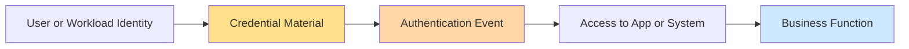
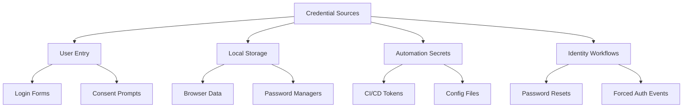
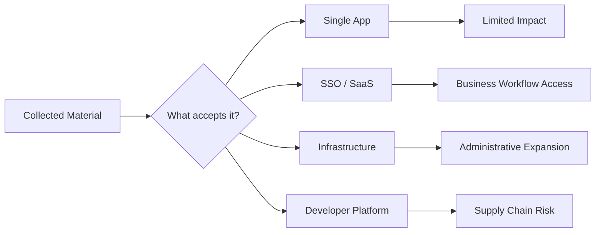
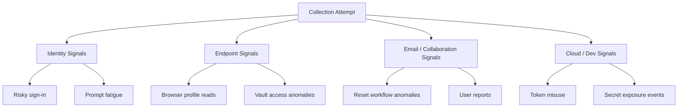
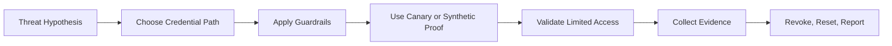

# Credential Harvesting

> **Phase 09 — Credential Access**  
> **Focus:** How authorized red teams safely model the collection of passwords, hashes, tokens, cookies, API keys, and other authentication material in order to validate identity defenses.  
> **Safety note:** This note is for **authorized adversary emulation and defensive learning only**. It explains concepts, decision-making, detection, and reporting. It does **not** provide step-by-step intrusion instructions. Prefer canary accounts, synthetic secrets, and preapproved proof methods over collecting real user credentials.

---

**Difficulty:** Beginner → Advanced  
**Category:** Red Teaming - Credential Access  
**Relevant ATT&CK concepts:** TA0006 Credential Access | T1056 Input Capture | T1187 Forced Authentication | T1555 Credentials from Password Stores | T1557 Adversary-in-the-Middle | T1110 Brute Force *(typically limited to validation context after collection)*

---

## Table of Contents

1. [What Credential Harvesting Means](#what-credential-harvesting-means)
2. [Why It Matters](#why-it-matters)
3. [Beginner Mental Model](#beginner-mental-model)
4. [What Counts as Credential Material](#what-counts-as-credential-material)
5. [Where Credentials Commonly Live](#where-credentials-commonly-live)
6. [How Authorized Red Teams Think About Harvesting](#how-authorized-red-teams-think-about-harvesting)
7. [Common Harvesting Pattern Families](#common-harvesting-pattern-families)
8. [Web, SaaS, and Cloud Identity Nuances](#web-saas-and-cloud-identity-nuances)
9. [Detection Opportunities](#detection-opportunities)
10. [Defensive Controls](#defensive-controls)
11. [Safe Adversary-Emulation Design](#safe-adversary-emulation-design)
12. [Worked Example](#worked-example)
13. [Reporting Guidance](#reporting-guidance)
14. [Common Mistakes](#common-mistakes)
15. [Key Takeaways](#key-takeaways)

---

## What Credential Harvesting Means

Credential harvesting is the collection of **authentication material** from places where users, systems, browsers, applications, or workflows legitimately hold it.

That material may include:

- usernames and passwords
- password hashes
- session cookies
- bearer or refresh tokens
- API keys and personal access tokens
- password-manager contents
- certificates and private keys
- recovery codes and reset artifacts

In red teaming, the point is not merely to "get a password." The point is to answer a more important question:

> **Can an attacker, using realistic and safe methods, obtain identity material that lets them cross a trust boundary?**

That trust boundary might be:

- internet user → VPN
- employee mailbox → SaaS admin console
- developer workstation → CI/CD pipeline
- browser session → cloud control plane
- help-desk process → account recovery path

---

## Why It Matters

Modern environments are identity-centric. Even when software vulnerabilities exist, valid identity material is often quieter, more reliable, and more scalable than exploitation.

A harvested credential may let an operator:

- blend into normal authentication patterns
- access data without deploying noisy tooling
- move from a user workflow into an administrative workflow
- reuse existing trust relationships instead of creating new malicious ones
- demonstrate architectural weakness without causing operational impact

This is why credential harvesting often has outsized value in adversary emulation. It tests whether the organization protects the **real perimeter**: identity.



If defenders only think about passwords, they miss the bigger picture. Attackers care about **whatever the system accepts as proof of identity**.

---

## Beginner Mental Model

A useful beginner model is:

```text
People type credentials
Browsers store credentials
Apps cache credentials
Automation uses credentials
Support processes reset credentials
```

If you remember those five places, you will understand most harvesting scenarios.

### The simple lifecycle

1. **Find likely sources** of identity material.
2. **Collect safely** using approved, realistic, low-impact methods.
3. **Classify value** by privilege, scope, lifetime, and replayability.
4. **Validate cautiously** without causing lockouts or user disruption.
5. **Report the trust weakness**, not just the collected secret.

This progression is what turns a basic concept into a professional red-team finding.

---

## What Counts as Credential Material

Not all credentials look like passwords, and not all are equally valuable.

| Material Type | What It Is | Typical Lifetime | Typical Risk |
|---|---|---|---|
| **Password** | Human-entered shared secret | Medium to long | Broad reuse risk if the same password works elsewhere |
| **Password hash** | Derived secret used in verification or replay contexts | Long until password changes | Useful for offline analysis or alternate auth abuse |
| **Session cookie** | Web session state proving an authenticated browser session | Short to medium | Can bypass password prompts if still valid |
| **Bearer token** | Token accepted directly by an API or application | Short to medium | Often powerful because possession equals access |
| **Refresh token** | Artifact used to obtain new access tokens | Medium to long | High risk because it can extend access silently |
| **API key / PAT** | Application or developer secret | Medium to long | Frequently over-scoped and weakly monitored |
| **Private key / certificate** | Cryptographic identity material | Long | High-value for workload and infrastructure trust |
| **Recovery code / reset artifact** | Backup or fallback auth material | Variable | Dangerous because it may bypass normal MFA paths |

### Practical lesson

A junior tester often asks:

> "Did we get a password?"

A stronger question is:

> "What form of identity material did we obtain, what accepts it, and how much trust does it unlock?"

That shift in thinking is what separates beginner knowledge from advanced identity-focused tradecraft.

---

## Where Credentials Commonly Live

Credential harvesting becomes much easier when you think in terms of **storage locations and workflow locations**.

### Storage locations

| Location | Why Credentials Appear There | Examples of Risk |
|---|---|---|
| **Browsers** | Convenience features save passwords, cookies, and autofill data | Reusable sessions, stored passwords, synced browser profiles |
| **Password managers** | Centralized secret storage for users or teams | Vault export misuse, weak access controls, shared folders |
| **Configuration files** | Applications and automation need credentials to run | Hard-coded API keys, service credentials, database strings |
| **Developer tooling** | CLI sessions and build pipelines use tokens | PAT sprawl, cloud CLI tokens, CI/CD secrets |
| **Logs and chat systems** | People paste secrets while troubleshooting | Token leakage, copied reset links, exposed webhook secrets |
| **Local system memory and caches** | Apps temporarily hold auth material to function | Session artifacts, cached tickets, temporary tokens |

### Workflow locations

| Workflow | Why It Matters |
|---|---|
| **Login prompts** | Users expect them and may trust look-alike experiences if context is convincing |
| **Consent and federation flows** | Cloud and SaaS environments increasingly rely on delegated trust rather than passwords alone |
| **Password reset processes** | Recovery channels are often weaker than primary authentication |
| **Help-desk verification** | Social proof and urgency can undermine strong technical controls |
| **File share or network auth workflows** | Some platforms automatically try to authenticate when connecting to trusted-looking resources |



---

## How Authorized Red Teams Think About Harvesting

A professional red team evaluates harvesting opportunities across five dimensions.

| Dimension | Key Question | Why It Matters |
|---|---|---|
| **Source realism** | Is this how a relevant adversary would plausibly collect identity material here? | Keeps the exercise credible |
| **Secret value** | What systems, apps, or tiers accept this material? | Determines business impact |
| **Lifetime** | How long does the material remain useful? | Separates opportunistic access from durable access |
| **Replayability** | Can it be reused directly, or only in limited context? | Affects whether follow-on access is practical |
| **Detectability** | What logs, alerts, or workflows should expose collection or use? | Makes the exercise measurable |

### The advanced mindset

Advanced operators stop thinking only about **accounts** and start thinking about **identity paths**.

For example:

- a password may unlock only one application
- a session cookie may unlock a single browser session
- a refresh token may continuously regenerate cloud access
- a developer PAT may reach source code, packages, and deployment workflows
- a help-desk recovery path may indirectly unlock an executive mailbox

The goal of the note, and of the exercise, is to understand the **identity path to the objective**.



---

## Common Harvesting Pattern Families

The point here is to understand **families of behavior**, not to memorize tools.

### 1. Phishing-aligned collection

This family focuses on user interaction with a believable authentication experience.

Typical red-team question:

> If a realistic identity prompt appeared in a normal business context, would users, controls, and detections stop it?

What defenders should study:

- user reporting speed
- conditional access reactions
- impossible travel or unusual client signals
- MFA prompt abuse and consent anomalies

### 2. Input capture

This family focuses on credentials at the moment of entry.

Conceptually, it asks whether a secret is safest **at rest** or **while being typed**. Many organizations protect storage better than live workflows.

What defenders should study:

- suspicious authentication prompts
- process lineage around credential-handling applications
- endpoint telemetry for unusual access to input-sensitive contexts

### 3. Password-store and browser collection

This family focuses on convenience features that improve usability but widen exposure.

Important lesson:

> Convenience is often the silent partner of credential risk.

What defenders should study:

- browser-profile access patterns
- vault export events
- unusual reads of secret-bearing local stores
- session use from unexpected devices or geographies

### 4. Application and developer secret discovery

This family covers secrets embedded in code, configuration, automation, and troubleshooting artifacts.

This is especially important in cloud and DevOps-heavy environments where human passwords matter less than workload identity.

What defenders should study:

- secret scanning results
- repository and pipeline access anomalies
- unusual reads of environment files, deployment configs, and build variables
- long-lived tokens with weak ownership or no rotation policy

### 5. Forced authentication and trust-triggered collection

Some enterprise workflows automatically try to authenticate when users or systems touch a resource they believe is legitimate.

This matters because the user may not intentionally "log in" at all; the workflow itself may attempt authentication.

What defenders should study:

- outbound auth attempts to unusual destinations
- name-resolution and file-access anomalies
- unexpected fallback to alternate auth paths
- authentication material appearing in contexts where users never expected a login event

### 6. Validation after collection

Harvesting and validation are related but not identical.

- **Harvesting** obtains the material.
- **Validation** confirms whether it still works.

In mature engagements, validation should be tightly scoped and carefully rate-limited to avoid lockouts, service disruption, or unnecessary noise.

### Pattern summary table

| Pattern Family | Typical Goal | Common Defender View |
|---|---|---|
| **Phishing-aligned collection** | Capture credentials during believable user interaction | Email, web, and identity telemetry correlation |
| **Input capture** | Observe credentials at entry time | Endpoint and process-behavior monitoring |
| **Password-store collection** | Obtain secrets already saved for convenience | Endpoint, vault, and profile-access monitoring |
| **Secret discovery** | Find tokens or keys in apps and automation | Repo, CI/CD, and secret-management analytics |
| **Forced authentication** | Trigger automatic auth behavior from trusted workflows | Network, identity, and protocol anomaly monitoring |
| **Validation** | Confirm limited reusability of collected material | Sign-in analytics, lockout monitoring, UEBA |

---

## Web, SaaS, and Cloud Identity Nuances

Credential harvesting in modern environments is not just about Windows passwords or web login forms.

### 1. Web sessions

Web applications often rely on:

- session cookies
- CSRF/anti-forgery context
- device or browser binding
- federated SSO redirects
- step-up authentication for sensitive actions

A mature assessment asks:

- Is session security stronger than password security?
- Are risky actions reauthenticated?
- Can a stolen session be used from a different browser or network?
- Do defenders distinguish normal session refresh from suspicious reuse?

### 2. SaaS and federation

In SaaS ecosystems, the identity provider often matters more than the application itself.

A harvested artifact may grant access not to one app, but to an entire set of federated services.

Important concepts:

- delegated trust
- consent grants
- conditional access context
- refresh-token protection
- session revocation speed

### 3. Cloud and developer environments

Cloud compromise frequently begins with secrets that were never meant for humans at all.

Examples of high-value material include:

- access keys used by scripts or automation
- personal access tokens used for repositories or package registries
- kubeconfig-style cluster access artifacts
- service principal or workload credentials
- CI/CD tokens that bridge source code to production deployment

### 4. Recovery and fallback channels

A surprisingly strong password policy can still be undermined by weak fallback controls.

Examples include:

- weak help-desk identity verification
- overly broad reset links
- persistent recovery codes
- backup mailboxes or phone numbers with poor governance

Advanced red teams pay close attention to fallback channels because they often reveal where the organization values convenience over identity assurance.

---

## Detection Opportunities

Credential harvesting should always be discussed together with **observability**.

### Identity telemetry

Watch for:

- successful sign-ins from unusual devices, networks, ASNs, or regions
- new user agents or clients immediately after password reset or MFA events
- impossible travel, rare protocol use, or unusual token refresh patterns
- unusual consent events, reauthentication bursts, or repeated MFA prompts

### Endpoint telemetry

Watch for:

- unexpected access to browser profiles, local vault stores, and credential-related files
- unusual process behavior around applications that handle authentication or secret entry
- access to temporary caches or secret-bearing artifacts outside normal parent-child process patterns

### Email, collaboration, and help-desk telemetry

Watch for:

- look-alike login communications and suspicious reset messages
- abnormal help-desk password reset volume or identity verification exceptions
- copied reset links, recovery messages, or secrets shared in chat and ticket systems

### Dev, cloud, and SaaS telemetry

Watch for:

- long-lived tokens used from new IP ranges or devices
- repository access spikes around files known to contain secrets or deployment metadata
- pipeline variable exposure, unusual artifact downloads, or emergency secret changes
- admin or privileged actions shortly after new token issuance or refresh activity

### Practical telemetry map



The most useful detections are usually **correlations**, not single alerts. A suspicious login becomes far more meaningful if it follows a reset event, a suspicious consent prompt, or an endpoint signal involving browser data.

---

## Defensive Controls

| Control | Why It Helps | Notes |
|---|---|---|
| **Phishing-resistant MFA** | Reduces the value of stolen passwords by binding auth to stronger factors and origin context | Important for internet-facing identity systems |
| **Conditional access and risk-based sign-in** | Detects or blocks unusual device, location, client, or session behavior | Strong when tuned to business reality |
| **Password manager governance** | Centralizes storage while reducing ad hoc secret sprawl | Needs strong vault controls and monitoring |
| **Secret management for apps and pipelines** | Removes credentials from code, chat, and config files | Critical in cloud-native environments |
| **Short-lived tokens and rapid revocation** | Limits usefulness of stolen sessions or bearer material | Especially valuable for SaaS and APIs |
| **Browser and endpoint hardening** | Protects local stores, cookies, profiles, and vault interaction points | Often overlooked in identity programs |
| **Recovery-path hardening** | Prevents password reset and help-desk workflows from becoming the weak link | Essential for executives and admins |
| **User reporting and responder readiness** | Turns suspicious prompts into actionable detections quickly | Social defenses matter in identity security |

### A simple way to remember defenses

```text
Reduce storage
Reduce lifetime
Reduce scope
Increase verification
Increase visibility
```

That five-line model covers a large percentage of real-world improvement opportunities.

---

## Safe Adversary-Emulation Design

A good credential-harvesting exercise is controlled, measurable, and low-impact.

### Recommended guardrails

- Use explicit written authorization.
- Prefer **canary accounts**, test tenants, or synthetic secrets where possible.
- Define which identity systems, user groups, and business workflows are in scope.
- Predefine stop conditions for lockouts, user confusion, or unexpected privilege expansion.
- Coordinate reset, revocation, and cleanup procedures before execution.
- Decide in advance what constitutes acceptable proof.

### Safer proof methods

Instead of collecting real user secrets, teams often prove risk by demonstrating one or more of the following:

- a controlled capture of test credentials
- access to a preapproved canary account
- capture of a synthetic token with logged revocation
- proof that a workflow would have yielded reusable identity material
- screenshots, telemetry, and audit events showing that the path was viable

### Exercise design flow



### What a mature team avoids

A mature team avoids turning credential harvesting into reckless credential collection.

They do **not** optimize for the largest possible haul. They optimize for:

- realistic adversary behavior
- minimal user and business impact
- strong defender learning value
- high-quality evidence
- clean remediation guidance

---

## Worked Example

Imagine an organization with:

- cloud SSO for most business applications
- browser-saved credentials still common on endpoints
- multiple SaaS apps protected by the same identity provider
- developers using PATs for repositories and package publishing
- a help desk that can trigger password resets for urgent requests

### Beginner view

A basic finding might be:

> "Users could be tricked into entering passwords."

That is true, but shallow.

### Stronger red-team view

A stronger analysis would ask:

- Which identity prompts are normal enough to be trusted?
- Would a captured password still be useful if MFA is present?
- Are session cookies or refresh tokens better targets than passwords?
- Could a help-desk process become the actual weak link?
- Would a developer token be more valuable than a user mailbox password?

### Defender learning outcome

The organization may discover that:

- password protections are decent,
- but browser session controls are weak,
- token revocation is slow,
- PATs are over-scoped,
- and help-desk verification is inconsistent.

That is a far better outcome than merely proving a user can be fooled. It tells defenders **where identity trust really breaks**.

---

## Reporting Guidance

A good report should describe the **identity weakness**, not just the collection event.

### Weak reporting

> "We harvested credentials from a user workflow."

### Strong reporting

> "The environment allowed realistic collection of reusable identity material through a normal-looking authentication workflow. Because the resulting material was accepted across federated SaaS applications and revocation controls were slow, a single user interaction could have enabled multi-application access before defenders were likely to intervene."

### Reporting structure

| Report Element | What to Include |
|---|---|
| **Scenario** | What adversary behavior was modeled and why it was relevant |
| **Guardrails** | How the exercise stayed safe and controlled |
| **Collected material type** | Password, token, cookie, PAT, reset artifact, etc. |
| **Business impact** | What systems or workflows would have been reachable |
| **Detection review** | What alerts fired, what was missed, and what correlated well |
| **Root cause** | Weak trust design, secret sprawl, weak recovery path, insufficient monitoring, etc. |
| **Remediation** | Controls that reduce storage, scope, lifetime, or replayability |

This reporting style helps decision-makers understand that harvesting is fundamentally an **architecture and workflow problem**, not just a user-awareness problem.

---

## Common Mistakes

### Focusing only on passwords

Modern identity abuse often revolves around tokens, sessions, and automation secrets.

### Treating all secrets as equal

A short-lived session cookie and a long-lived CI token create very different risk.

### Ignoring recovery channels

If the reset process is weak, strong primary authentication may not matter.

### Overlooking machine and workload identity

Cloud and DevOps environments frequently expose more value through non-human credentials than human passwords.

### Collecting more than needed

Good adversary emulation proves risk with the minimum collection necessary.

### Failing to map trust spread

A collected secret is only meaningful when you know **where else it works**.

---

## Key Takeaways

- Credential harvesting is the collection of **whatever the environment accepts as proof of identity**.
- The highest-value material is often not a password, but a token, session, or automation secret.
- Good red teams model harvesting to validate trust boundaries, not to maximize secret collection.
- The best defenses reduce secret sprawl, shorten secret lifetime, harden recovery paths, and improve telemetry correlation.
- In mature environments, identity workflows themselves are part of the attack surface.

---

> **Defender mindset:** Assume credentials can appear in browsers, apps, automation, resets, and routine business workflows. Design identity controls so that one captured artifact does not become a quiet path to broader trust.
