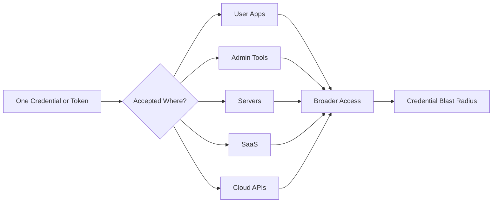
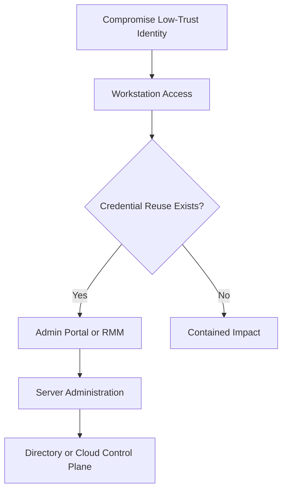
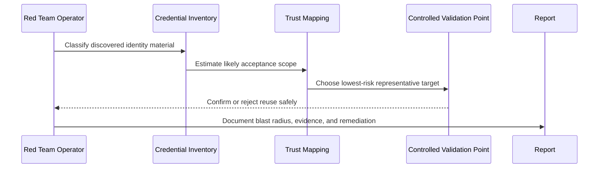

# Credential Reuse

> **Phase 09 — Credential Access**  
> **Focus:** How one valid password, local admin secret, SSH key, token, or service identity can unlock multiple systems when trust is reused across an environment.  
> **Authorized use only:** This note is for sanctioned adversary emulation, purple teaming, and defense. It explains concepts, safe validation ideas, and reporting guidance without giving harmful step-by-step intrusion instructions.

---

**Relevant ATT&CK concepts:** TA0006 Credential Access | TA0008 Lateral Movement | T1078 Valid Accounts | T1110.003 Password Spraying | T1550 Use Alternate Authentication Material

---

## Table of Contents

1. [Why It Matters](#why-it-matters)
2. [Beginner Mental Model](#beginner-mental-model)
3. [Credential Reuse vs Similar Terms](#credential-reuse-vs-similar-terms)
4. [What Can Be Reused](#what-can-be-reused)
5. [Why Reuse Happens in Real Environments](#why-reuse-happens-in-real-environments)
6. [Safe Adversary-Emulation Workflow](#safe-adversary-emulation-workflow)
7. [Diagrams](#diagrams)
8. [Common Enterprise Patterns](#common-enterprise-patterns)
9. [Detection Opportunities](#detection-opportunities)
10. [Defensive Controls](#defensive-controls)
11. [Reporting and Evidence](#reporting-and-evidence)
12. [Conceptual Scenarios](#conceptual-scenarios)
13. [Key Takeaways](#key-takeaways)

---

## Why It Matters

Credential reuse is one of the highest-value findings in an authorized engagement because it shows that **identity itself has become a shared attack surface**.

A software bug might affect one application. A reused credential can affect:

- many endpoints
- multiple admin tools
- several SaaS platforms
- different network tiers
- cloud control planes
- production workflows that were never meant to share trust

This is why MITRE ATT&CK groups valid accounts under a powerful technique family: once a legitimate identity is accepted, the operator may not need an exploit at all. They are using the environment's own authentication design.

A practical way to think about the risk is **credential blast radius**:

> **Credential blast radius = how many systems, trust zones, and privileged actions become reachable if one identity or secret is compromised.**

The biggest lesson for defenders is simple: **reuse turns a local problem into an enterprise problem**.

---

## Beginner Mental Model

Imagine a company where one key opens the office door, the server room, the supply closet, and the CEO's office. The key itself is small, but the trust behind it is huge.

Credential reuse is the digital version of that problem.

At a basic level, it means:

- the same password works in more than one place
- the same local administrator secret exists on many machines
- the same SSH key is copied across many servers
- the same API token is embedded into multiple pipelines or repositories
- the same service account is trusted by unrelated workloads

### Simple example

A user password is accepted by email, VPN, an HR portal, and a remote support tool.

If that password is compromised, the attacker did not just steal access to one app. They stole access to an **identity pathway**.

### Advanced view

Advanced environments do not only suffer from users reusing passwords. They also suffer from **operational reuse**, such as:

- shared service accounts across server fleets
- break-glass accounts used in both emergencies and daily administration
- build secrets copied from development into production
- long-lived personal access tokens reused across many repos or automation jobs
- old local admin passwords persisting where Windows LAPS or equivalent controls were not fully deployed

In mature environments, the real problem is often not weak users. It is **convenient trust architecture**.

---

## Credential Reuse vs Similar Terms

These ideas are related, but they are not the same.

| Term | Meaning | Main Idea | Why It Matters |
|---|---|---|---|
| **Credential reuse** | Authentication material found in one place is accepted somewhere else | One secret or identity works in multiple places | Expands blast radius fast |
| **Credential stuffing** | Previously exposed credentials are tried against a target service | Reuse from external breach data | Common against internet-facing logins |
| **Password spraying** | A small set of common passwords is tested across many accounts | Avoid lockouts while finding weak passwords | Often used early in operations |
| **Shared secret abuse** | A password, key, or token is intentionally duplicated across systems | Operational convenience becomes systemic risk | Typical with local admins and service accounts |
| **Alternate auth material reuse** | Tokens, cookies, keys, certificates, or hashes are accepted beyond their intended scope | Not all reuse involves plaintext passwords | Modern identity attacks often live here |

A useful rule:

- **Credential reuse** is the broad problem.
- **Stuffing** and **spraying** are ways reused credentials may be discovered or tested.
- **Shared secrets** and **alternate auth material** explain why the reuse exists in the first place.

---

## What Can Be Reused

Credential reuse is broader than just usernames and passwords.

| Credential Type | Typical Reuse Pattern | Why It Is Dangerous |
|---|---|---|
| **User password** | Same user identity works across VPN, email, SaaS, and internal portals | One compromise can cross many services immediately |
| **Shared local administrator password** | Same local admin secret exists on many endpoints | One endpoint compromise can lead to broad host-to-host admin access |
| **Service account password** | Same account authenticates to many servers or applications | High privilege, low visibility, long lifetime |
| **SSH private key** | Key copied to jump hosts, admin workstations, or automation jobs | Quiet access to many Linux systems |
| **API key / PAT** | Same token used in multiple repos, CI jobs, or environments | Can bridge source code, pipelines, and cloud actions |
| **Refresh token / bearer token** | Same token grants access across a suite of federated services | Bypasses the focus defenders often place only on passwords |
| **Certificate or workload identity** | One certificate or machine identity trusted across multiple services | Strong auth can still be over-scoped |
| **Break-glass account** | Emergency account is quietly used everywhere | Rarely monitored well, often highly privileged |

### Important nuance

Sometimes the secret is not literally reused, but the **identity trust is**.

Examples:

- one admin account is valid on many tiers
- one federated identity reaches many SaaS apps
- one help-desk role can reset or unlock many higher-value accounts

From an adversary-emulation perspective, this still behaves like credential reuse because **one compromise becomes many opportunities**.

---

## Why Reuse Happens in Real Environments

Reuse usually exists because it makes operations easier.

### 1. Human convenience

People remember one strong-ish password more easily than many unique ones. Without password managers or SSO, reuse becomes predictable.

### 2. Imaging and deployment shortcuts

Teams often build systems from templates. If the same administrative secret survives imaging, cloning, or first boot, reuse spreads silently.

### 3. Legacy service design

Old applications frequently depend on shared bind accounts, fixed database passwords, or long-lived integration keys.

### 4. Automation pressure

CI/CD systems, scripts, and infrastructure-as-code encourage copying secrets into many places unless a vault or managed identity model exists.

### 5. Incomplete control rollout

Controls like LAPS, MFA, token scoping, and secret rotation reduce reuse — but only if they are fully implemented. Partial rollout leaves islands of old trust.

### 6. Over-broad federation

Organizations centralize identity for convenience, but if every successful login reaches too many apps or admin surfaces, federation increases the impact of one compromise.

---

## Safe Adversary-Emulation Workflow

In an authorized engagement, the goal is not to "see how far you can get" by creating noisy authentication traffic. The goal is to **prove risk safely, minimally, and clearly**.

### 1. Build a credential inventory

Classify what has already been legitimately uncovered during the engagement:

- user passwords
- service accounts
- local admin credentials
- SSH keys
- tokens and API keys
- machine or workload identities

For each item, record:

- identity owner
- privilege level
- expected scope
- lifetime or expiry
- MFA requirements
- lockout sensitivity
- likely trust zones where it may also work

### 2. Map likely acceptance zones

Ask controlled questions such as:

- Is this identity valid only on one system, or across a fleet?
- Does it bridge user space to admin space?
- Does it bridge workstation, server, SaaS, and cloud?
- Does it cross development, staging, and production?
- Is it accepted interactively, through APIs, or both?

### 3. Estimate blast radius before testing

The safest operators do not start by authenticating everywhere. They start by estimating:

- business criticality
- chance of lockout
- user disruption risk
- blue-team visibility
- whether one representative validation is enough to prove the issue

### 4. Validate minimally

Good red-team validation is narrow and deliberate.

| Safer Validation Practice | Why It Helps |
|---|---|
| **Use one representative asset or service when possible** | Proves the issue without turning the exercise into broad intrusion activity |
| **Coordinate around lockout thresholds** | Prevents account disruption and help-desk noise |
| **Prefer non-destructive proof of acceptance** | Shows risk while minimizing operational impact |
| **Stop once the trust problem is demonstrated** | The finding is the shared trust, not how many systems you can touch |
| **Record timestamps and scope carefully** | Helps defenders correlate detections and reproduce the issue safely |

### 5. Document the trust boundary that failed

The report should explain:

- where the credential came from
- where else it was accepted
- what business boundary that crossed
- why the same identity should not have had that scope
- what control would have prevented it

### 6. End with remediation, not just proof

A mature finding does not say only, "the password worked elsewhere." It says:

- what architectural pattern caused it
- how much blast radius exists
- what compensating detections are missing
- what identity redesign will reduce the risk permanently

---

## Diagrams

### Diagram 1 — One Secret, Many Doors

### Diagram 2 — Trust Boundary Bridge

### Diagram 3 — Safe Validation Model

---

## Common Enterprise Patterns

| Pattern | Why It Appears | Practical Risk | Best Fix |
|---|---|---|---|
| **Shared local administrator passwords** | Imaging shortcuts, legacy support habits, incomplete LAPS rollout | One endpoint compromise can scale to many endpoints | Windows LAPS or equivalent per-device password rotation |
| **User password reuse across services** | Separate apps without SSO, weak password hygiene | Email, VPN, HR, and support systems fall together | SSO, password managers, banned-password controls, phishing-resistant MFA |
| **Help-desk or support account reuse** | Convenience during remote support and troubleshooting | Mid-tier identities become hidden admin bridges | Tiered admin model, just-in-time elevation, session recording |
| **Service account reuse across many servers** | Legacy apps, shared scheduled tasks, hard-coded app configs | Quiet high-privilege access with low human visibility | Per-service identities, vault-backed delivery, rotation |
| **Same secret across dev, test, and prod** | Fast deployments, copied environment files, weak secret governance | Lower-trust compromise reaches production | Separate identities per environment, scoped vault policies |
| **PAT or API token reused in many pipelines** | Developers reuse one token for multiple jobs and repos | Source control compromise spreads into build and cloud workflows | Short-lived tokens, OIDC/workload identity, repo-specific scopes |
| **SSH key reuse across admins and automation** | Key copying is easy and rarely cleaned up | Broad silent access to Linux fleets | Per-user/per-workload keys, centralized access management |
| **Break-glass account used routinely** | Emergency access becomes daily operational shortcut | One rarely monitored account becomes a skeleton key | Strict monitoring, offline storage, just-in-time alternatives |

### What advanced operators notice

Advanced adversary emulation focuses less on "did this one password work twice?" and more on questions like:

- Does a **user identity** open management interfaces it should never touch?
- Does a **machine identity** have authority beyond one workload?
- Does a **token audience or scope** exceed the application's need?
- Does a **support credential** quietly bridge endpoint, server, and cloud administration?
- Does a **local admin control** exist on paper but fail on newly built or legacy systems?

That is the difference between finding a credential issue and finding an **identity architecture weakness**.

---

## Detection Opportunities

Credential reuse often looks "legitimate" in isolated logs. Detection improves when defenders correlate across systems.

### Authentication behavior to watch

- the same account authenticating to multiple new assets in a short time window
- the same identity appearing across different protocols or trust tiers unusually quickly
- service accounts or workload identities used from interactive endpoints
- dormant accounts suddenly becoming active across many services
- break-glass or local admin accounts authenticating outside change windows

### Identity context mismatches

- user account appears on server administration tools it rarely or never touches
- token or API key shows up in unrelated repositories, runners, or workloads
- SSH key fingerprint is seen across multiple administrators or unrelated hosts
- password reset, MFA reset, or help-desk activity is followed by broad authentication success

### Environmental signals

- many systems accept the same local admin account pattern
- LAPS retrieval or password read events correlate with unusual remote administration
- repeated successful logons cross workstation, server, SaaS, and cloud within one narrative
- production access follows compromise of lower-trust development assets

### A useful defender metric

Track **credential blast radius** as an operational metric:

- How many systems accept a given account?
- How many trust zones can one token reach?
- How many privileged actions can one service identity perform?

The bigger the blast radius, the higher the priority.

---

## Defensive Controls

| Control | Why It Helps | Practical Notes |
|---|---|---|
| **Unique credentials per asset or workflow** | Prevents one compromise from scaling broadly | Most important control for local admin and service identities |
| **Windows LAPS or equivalent** | Rotates and stores unique local admin passwords per device | Especially important where endpoint admin reuse historically existed |
| **Tiered administration** | Prevents low-trust identities from being valid on high-value systems | Separate workstation, server, and cloud admin roles |
| **Phishing-resistant MFA** | Reduces the value of stolen passwords | Strongest when paired with conditional access and device trust |
| **Password managers and banned-password policies** | Makes user password uniqueness realistic | Human behavior improves when secure convenience exists |
| **Managed identities and vault-backed secrets** | Removes duplicated long-lived secrets from scripts and pipelines | Strong answer for service accounts and CI/CD |
| **Short-lived, scoped tokens** | Limits where and how long tokens are useful | Scope, audience, expiry, and revocation all matter |
| **Environment separation** | Stops dev/test secrets from unlocking production | Use different identities, tenants, and approval paths |
| **Break-glass governance** | Prevents emergency accounts from becoming daily shortcuts | Monitor heavily and restrict storage and use |
| **Behavior-based identity analytics** | Detects valid accounts being used abnormally | Needed because reused credentials often bypass signature-based controls |

### Defensive design principles

1. **Reduce shared trust** — do not let one identity unlock unrelated systems.
2. **Reduce credential lifetime** — short-lived secrets limit follow-on value.
3. **Reduce privilege overlap** — the same account should not span user, admin, and automation roles.
4. **Increase detection context** — the danger is often visible only when events are correlated.
5. **Design for recovery** — rotation, revocation, and re-issuance should be fast and routine.

---

## Reporting and Evidence

A strong credential reuse finding should be easy for both executives and engineers to understand.

### What to capture

- **credential type:** password, token, SSH key, local admin secret, service identity
- **source of discovery:** where it was uncovered during the authorized exercise
- **validated acceptance points:** the approved systems or services where reuse was confirmed
- **trust boundary crossed:** user-to-admin, workstation-to-server, dev-to-prod, SaaS-to-cloud
- **business impact:** what operations or data became reachable because of the reuse
- **detection gap:** what alerting or governance should have caught it but did not
- **recommended fix:** uniqueness, scoping, rotation, tiering, or architectural redesign

### Reporting language that works well

Instead of saying:

> "The same credential worked on three systems."

Prefer:

> "A credential obtained from a low-trust endpoint was accepted by multiple systems across the workstation and server tiers, demonstrating shared administrative trust and enabling unauthorized expansion of access without exploiting additional software weaknesses."

### Sensitive evidence handling

Do not place live secrets in the report body. Use:

- redacted screenshots
- partial identifiers
- hashed or masked token values
- secure appendix handling if raw evidence must be retained

The goal is to prove the weakness without creating a second secret-management problem.

---

## Conceptual Scenarios

### Scenario 1 — Shared Local Admin Passwords

A red team compromises one workstation and determines that the same local administrator secret is valid across multiple endpoints. The critical issue is not the first host. The critical issue is that endpoint administration was designed around shared trust. If Windows LAPS had been fully deployed and validated, the blast radius would have been far smaller.

### Scenario 2 — Help-Desk Identity as a Hidden Bridge

A support credential is intended for remote troubleshooting, but it also works on a password vault and several server management interfaces. The finding shows that a mid-tier operational identity quietly bridges user support and infrastructure administration.

### Scenario 3 — DevOps Token Reuse

A token discovered in a build context is valid across several repositories and automation workflows, and those workflows can influence production deployment. Even if the token was never meant for human use, it behaves like a highly reusable credential with real business impact.

### Scenario 4 — Federated SaaS Overreach

A single corporate identity signs in through the central IdP and immediately reaches many SaaS platforms with inconsistent access policies. No single app is broken, but the identity plane is too broad. The weakness is architectural, not application-specific.

---

## Key Takeaways

- Credential reuse is a **trust design problem**, not just a password hygiene problem.
- One valid credential can be more powerful than an exploit if it crosses enough boundaries.
- User passwords are only part of the story; service accounts, tokens, keys, and local admin secrets matter just as much.
- In authorized adversary emulation, the right goal is **controlled proof of blast radius**, not noisy broad authentication activity.
- The best defenses are uniqueness, tight scoping, short lifetime, strong identity tiers, and correlation-based detection.
