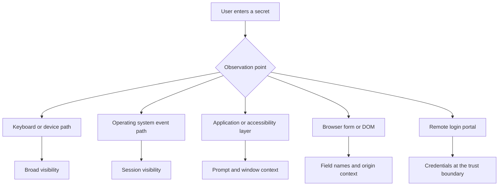
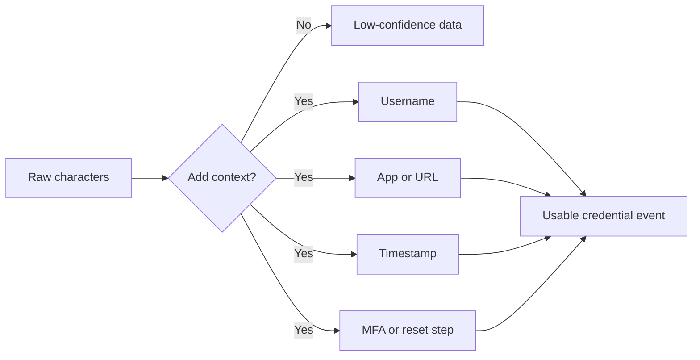
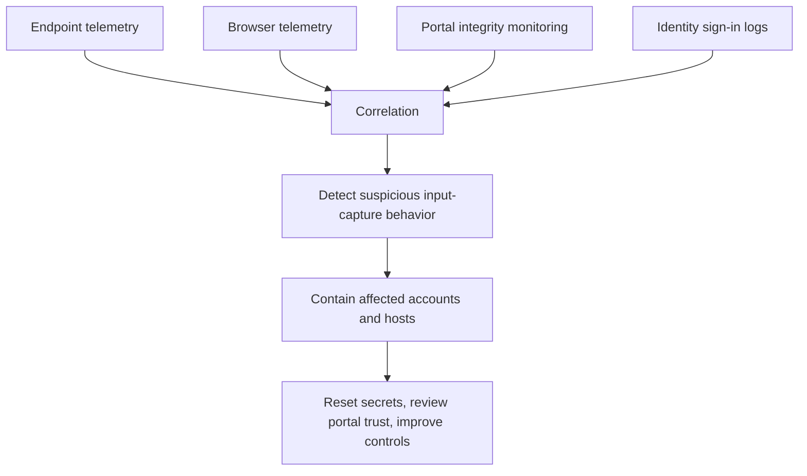

# Keylogging

> **Phase 09 — Credential Access**  
> **Focus:** Understanding how input capture works across endpoints, browsers, and login portals during authorized adversary emulation.  
> **Safety note:** This note is for authorized red-team and defensive learning only. It avoids step-by-step abuse instructions. Any real assessment should use written approval, test accounts, privacy-minimized collection, and strict retention limits.

---

**Relevant ATT&CK concepts:** TA0006 Credential Access | T1056 Input Capture | T1056.001 Keylogging | T1056.002 GUI Input Capture | T1056.003 Web Portal Capture

---

## Table of Contents

1. [Why It Matters](#why-it-matters)
2. [Quick Mental Model](#quick-mental-model)
3. [Beginner View](#beginner-view)
4. [From Basic to Advanced](#from-basic-to-advanced)
5. [Capture Layers and Tradeoffs](#capture-layers-and-tradeoffs)
6. [Practical Red-Team Lens](#practical-red-team-lens)
7. [Diagrams](#diagrams)
8. [What Makes Captured Input Valuable](#what-makes-captured-input-valuable)
9. [Detection Opportunities](#detection-opportunities)
10. [Defensive Controls](#defensive-controls)
11. [Safe Emulation Guidelines](#safe-emulation-guidelines)
12. [Reporting Ideas](#reporting-ideas)
13. [Common Misconceptions](#common-misconceptions)
14. [Key Takeaways](#key-takeaways)

---

## Why It Matters

Keylogging matters because it targets secrets **before** they become protected by transport encryption, token wrapping, or secure storage. A password manager, TLS session, or identity provider may protect credentials later in the workflow, but the user still has to type, paste, approve, or submit something first.

That is why MITRE ATT&CK places keylogging inside the broader **Input Capture** family rather than treating it as only “record keyboard events.” In modern environments, useful credential capture can include keyboard input, fake credential prompts, browser form interception, and compromised web portals that record secrets at the point of entry.

For defenders, the real lesson is simple: if important identities still rely on typed reusable secrets, the workstation, browser, and login surface are all part of the credential attack surface.

## Quick Mental Model

Think of keylogging as **watching authentication happen**.

```text
Typed secret + destination context + timing = usable credential event
```

A raw string of characters is less useful than many people think. What gives captured input value is the surrounding context:

- **Who** typed it
- **Where** they typed it
- **Which application or portal** it belongs to
- **When** it was entered
- **Whether it is reusable** after that moment

This is why advanced input capture tends to focus on context, not volume.

## Beginner View

At the beginner level, a keylogger is simply something that records what a user types. If a user enters a password, MFA code, recovery code, SSH passphrase, or admin credential, that secret may be exposed before the system finishes authenticating them.

A more realistic view is that “keylogging” often becomes shorthand for several related ideas:

- **Endpoint input capture:** observing keys or input events on the device
- **GUI prompt capture:** collecting credentials through fake or look-alike prompts
- **Browser form capture:** observing values inside login fields before submission
- **Portal-side capture:** a compromised remote-access or SSO page recording credentials as they are entered

So the beginner takeaway is:

> Keylogging is not only about keyboards. It is about capturing authentication input at the moment a person provides it.

## From Basic to Advanced

| Level | What it looks like | Why it matters | Main defensive question |
|---|---|---|---|
| **Level 1: Broad keystroke capture** | Everything typed is recorded with little context. | High noise, high privacy risk, low precision. | Do we notice suspicious software observing general input? |
| **Level 2: Context-aware endpoint capture** | Input is paired with window title, process, or user session. | Separates authentication events from normal typing. | Can telemetry link suspicious input capture to sensitive apps? |
| **Level 3: App or browser-aware capture** | Login fields, prompts, and authentication workflows are targeted. | Better signal, lower volume, more useful credentials. | Are browser, extension, and application trust boundaries monitored? |
| **Level 4: Workflow-aware capture** | Entire identity journeys are abused: prompts, VPN portals, SSO pages, MFA steps. | Focus shifts from keys to trusted auth surfaces. | Can we protect and monitor the places users trust with secrets? |

A mature red team usually cares far more about **where users still type valuable secrets** than about indiscriminately collecting every keystroke.

## Capture Layers and Tradeoffs

MITRE’s input-capture technique family is useful because it encourages you to think in layers.

| Capture Layer | What is being observed | Strength for an adversary | Typical weakness | Defensive focus |
|---|---|---|---|---|
| **Hardware / device path** | Raw input near the keyboard or HID path | Broad visibility | Operationally risky, invasive, hard to justify in most assessments | Physical security, device control, supply-chain trust |
| **OS event layer** | Keyboard and session events inside the operating system | Can see user activity across a session | May generate noisy telemetry and privacy concerns | EDR, application control, suspicious hook or event-monitoring behavior |
| **Application / accessibility layer** | Inputs as applications receive them | Better context around prompts and windows | Often leaves behavior traces in userland telemetry | Process behavior analytics, accessibility misuse monitoring |
| **Browser / form layer** | Values entered into login forms before submit | High-value context such as field names, origin, and page flow | Browser governance becomes critical | Extension control, CSP, DOM integrity, injected-script monitoring |
| **Portal / server-side layer** | Credentials as users submit them to a remote access page | Can scale across many users if the portal is trusted | Requires prior compromise or admin-path abuse; strong integrity controls may expose it | File integrity monitoring, config review, SSO/VPN hardening |

### Important tradeoff

Lower layers often provide **more coverage**, but higher layers provide **better context**. In real adversary emulation, the highest-value learning usually comes from understanding which layer is both plausible for the threat model and safe to emulate under the rules of engagement.

## Practical Red-Team Lens

In an authorized engagement, the question should not be:

> “Can we record everything users type?”

The better questions are:

- Are privileged users typing important passwords on low-trust endpoints?
- Are browser controls strong enough to protect sensitive login flows?
- Would tampering with a remote login surface be detected quickly?
- Can defenders distinguish ordinary user behavior from suspicious credential prompts?
- How much real risk remains if the organization adopts passwordless or phishing-resistant MFA?

### What a practical assessment is trying to prove

| Assessment Goal | Safer evidence to collect | Example learning outcome |
|---|---|---|
| **Measure typed-secret exposure** | Counts of sensitive login events, app names, or test-account submissions | “Admins still enter reusable passwords on general-purpose workstations.” |
| **Validate browser trust** | Policy review, telemetry on extensions, integrity checks on sensitive pages | “Browser controls would not detect unauthorized login-form tampering.” |
| **Assess portal integrity risk** | Change monitoring on VPN/SSO assets and access logs | “A trusted remote-access surface could become a credential collection point.” |
| **Assess response quality** | Blue-team detection timing and escalation paths | “Security operations saw the anomaly late and lacked user-notification playbooks.” |

The safest and most useful red-team finding is often a **control failure with minimal data collection**, not a large archive of captured secrets.

## Diagrams

### 1. Where input can be captured



### 2. Why context matters more than raw keystrokes



### 3. Defender view of the problem



## What Makes Captured Input Valuable

Not all captured input is equally useful.

| Captured Item | Why attackers value it | Context needed to make it useful | Defensive meaning |
|---|---|---|---|
| **Password** | Reusable and familiar | Username, destination system, timing | Reusable secrets still exist in the workflow |
| **MFA code** | Helpful during active session hijacking or prompt abuse | Exact timing and matching login session | OTPs are better than passwords alone, but still phishable or capturable in some flows |
| **Admin credential** | High privilege, high blast radius | Host role, privilege tier, admin scope | Admin workstations and privileged paths need stronger isolation |
| **Recovery code / reset secret** | Can bypass normal login flow | Which recovery process it belongs to | Account-recovery workflow is part of the identity attack surface |
| **Clipboard-pasted token or secret** | May avoid masked password fields entirely | Application, expiry, token type | Users and tools are moving secrets through insecure convenience paths |

A crucial defensive insight is that **context collapse** makes blue-team work harder. If defenders can only see “text was typed,” they may miss that the text was entered into a privileged admin prompt on a risky endpoint.

## Detection Opportunities

Detection works best when you monitor the whole identity path, not just the endpoint.

### Endpoint-focused signals

- Unexpected processes observing input-related events or interacting with accessibility features in unusual ways
- Suspicious clipboard access, screen-capture behavior, or window-enumeration activity around login events
- Unsigned or unapproved software appearing on systems used for privileged administration
- Process chains where user-facing apps suddenly spawn tools associated with monitoring or tampering

### Browser and application signals

- New or unexpected browser extensions requesting broad page access
- Sensitive pages receiving unusual script changes, DOM listeners, or injected resources
- Login flows behaving differently across versions, hosts, or user groups
- Applications that suddenly begin requesting credentials more often than normal

### Portal and identity signals

- Unauthorized file, template, or configuration changes on VPN, SSO, and remote-access portals
- Authentication success from unusual devices or locations immediately after odd login prompts or reset events
- Repeated credential-entry failures followed by sudden success, especially during high-friction auth workflows
- Help-desk reports, user complaints, or support tickets about strange prompts that align with suspicious sign-in telemetry

### Detection principle

The best detections usually combine:

```text
Host behavior + browser behavior + portal integrity + identity telemetry
```

That combination is far more effective than trying to spot “a keylogger” from one data source alone.

## Defensive Controls

Microsoft’s Credential Guard guidance is a good reminder that protecting **stored secrets** matters, but it does not eliminate every input-capture risk. If a user still types a secret into an exposed workflow, some risk remains before the secret reaches protected storage.

| Control | Why it helps |
|---|---|
| **Phishing-resistant MFA / passwordless authentication** | Reduces dependence on typed reusable secrets, which directly lowers the value of input capture. |
| **Privileged access workstation (PAW) model** | Keeps high-value admin credentials off lower-trust systems where input capture is more likely. |
| **Application allow-listing and browser extension governance** | Shrinks the set of software that can observe or tamper with credential-entry flows. |
| **Credential Guard / VBS / Secure Boot where applicable** | Raises the cost of stealing stored credentials and complements, but does not replace, input-capture defenses. |
| **Portal integrity monitoring** | Helps detect tampering with VPN, SSO, and external login surfaces before trust is abused at scale. |
| **Short-lived tokens and conditional access** | Limits replay value when a secret or code is exposed. |
| **Trusted auth UX and user education** | Users should know which prompts are legitimate and how to report suspicious ones quickly. |
| **Secret minimization** | Fewer typed passwords, fewer copied secrets, and less browser-stored auth material mean fewer capture opportunities. |

### Strategic takeaway

The strongest long-term mitigation is not “better keylogger detection.” It is **reducing the number of important secrets humans must manually enter**.

## Safe Emulation Guidelines

Because this topic can easily expose personal or business-sensitive data, authorized adversary emulation needs unusually strong guardrails.

1. **Get explicit written approval.** The rules of engagement should say exactly what is allowed, where, and for which accounts.
2. **Use test accounts whenever possible.** Dummy credentials and honey credentials create learning without collecting real user secrets.
3. **Prefer metadata over content.** Proving that a privileged password was typed on an unmanaged workstation is often enough; you do not always need the password itself.
4. **Minimize retention.** If any sensitive input is captured during an approved test, redact, hash, or purge it as quickly as possible.
5. **Limit scope to business-relevant workflows.** Focus on admin sign-ins, VPN portals, or critical SaaS logins, not broad personal activity.
6. **Coordinate with privacy, legal, and blue team stakeholders.** Input capture carries higher sensitivity than many other red-team techniques.
7. **Predefine stop conditions.** If collection begins touching unsanctioned personal data, the exercise should pause immediately.

### Good red-team discipline

A mature operator treats input capture as a **measurement problem**, not a trophy-collection problem.

## Reporting Ideas

If this risk is demonstrated during an assessment, a strong report should explain the trust failure clearly.

### Useful finding structure

- **Where the input was exposed:** workstation, browser, portal, or prompt
- **Which identity tier was affected:** user, admin, help desk, service operator
- **What context made the capture dangerous:** URL, app, privilege level, timing, recovery flow
- **What the organization failed to detect:** endpoint telemetry gap, portal integrity gap, identity correlation gap
- **What could happen next:** account takeover, remote access abuse, privilege escalation, recovery abuse
- **What reduces the risk most effectively:** passwordless adoption, PAWs, extension governance, integrity monitoring

### Example finding titles

- **Privileged credentials are still typed on general-purpose endpoints**
- **Remote access portal integrity controls do not detect unauthorized login-surface changes**
- **Browser governance gaps increase exposure of sensitive authentication flows**
- **Identity telemetry is not correlated with suspicious prompt behavior**

A good finding should help defenders prioritize **workflow redesign**, not just deploy another alert.

## Common Misconceptions

- **“Keylogging only means malware recording every key.”**  
  No. Modern input capture also includes GUI prompt capture, browser form capture, and compromised login portals.

- **“TLS solves the problem.”**  
  No. Encryption protects data in transit, but input can be captured before transmission.

- **“MFA makes keylogging irrelevant.”**  
  Not entirely. Some MFA methods still rely on codes, approvals, or recovery workflows that can be intercepted or socially engineered. Phishing-resistant MFA is much stronger.

- **“Only highly privileged attackers can do this.”**  
  Not always. Some capture points are closer to the application or browser layer and may not require the same access level as deeper system interception.

- **“Endpoint detection alone is enough.”**  
  Usually not. Browser controls, portal integrity, and identity analytics all matter.

## Key Takeaways

- Keylogging is best understood as part of the broader **input-capture** problem.
- The highest-value captures usually combine **typed input with context** such as app, URL, prompt, and timing.
- In authorized red teaming, the goal is to measure **where secrets are exposed**, not to collect unnecessary user data.
- Passwordless authentication, phishing-resistant MFA, privileged workstation isolation, and portal integrity monitoring all reduce this risk.
- Defenders should treat the **credential-entry workflow** itself as a security boundary.
