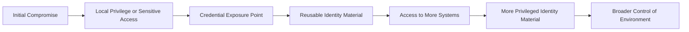
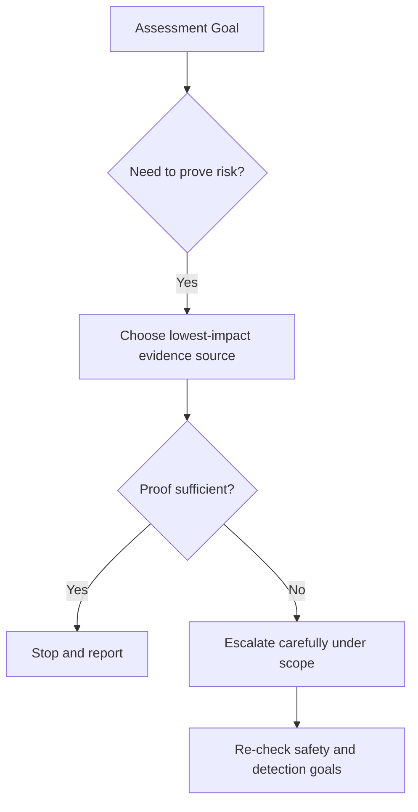
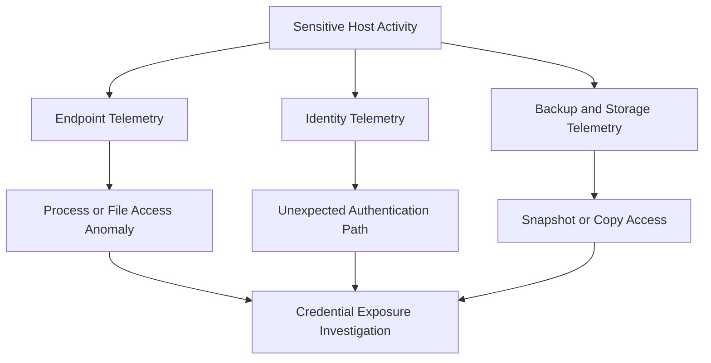

# Password Dumping

> **Phase 09 — Credential Access**  
> **Focus:** Understanding how authorized adversary-emulation teams assess password exposure in memory, local databases, directory services, and application stores after a host is compromised.  
> **Safety note:** This note is for approved security testing and defense only. It avoids step-by-step intrusion instructions and focuses on concepts, risk, validation strategy, detection, and hardening.

---

**Relevant ATT&CK concepts:** TA0006 Credential Access | T1003 OS Credential Dumping | T1003.001 LSASS Memory | T1003.003 NTDS | T1003.008 `/etc/passwd` and `/etc/shadow` | T1555 Credentials from Password Stores

---

## Table of Contents

1. [Why It Matters](#why-it-matters)
2. [Authorized Adversary-Emulation Framing](#authorized-adversary-emulation-framing)
3. [Beginner Mental Model](#beginner-mental-model)
4. [What Actually Gets “Dumped”](#what-actually-gets-dumped)
5. [How It Fits the Attack Chain](#how-it-fits-the-attack-chain)
6. [Where Secrets Commonly Live](#where-secrets-commonly-live)
7. [Platform-by-Platform View](#platform-by-platform-view)
8. [Practical Assessment Logic](#practical-assessment-logic)
9. [Risk vs. Noise](#risk-vs-noise)
10. [Detection Opportunities](#detection-opportunities)
11. [Defensive Controls](#defensive-controls)
12. [Reporting Guidance](#reporting-guidance)
13. [Conceptual Example](#conceptual-example)
14. [Key Takeaways](#key-takeaways)

---

## Why It Matters

Password dumping matters because **identity is the real blast radius multiplier**.

A host compromise is often local. A credential compromise is rarely local.

If an operator can show that one workstation, jump host, server, backup system, or domain controller exposes reusable identity material, the conversation changes from:

```text
"One machine was compromised"
```

to:

```text
"One machine can unlock many machines, users, applications, and trust paths"
```

That is why password dumping is so important in red teaming, incident response, and hardening work. It explains how a small foothold can become:

- broader lateral movement
- privilege escalation
- service account abuse
- cloud and SaaS access reuse
- long-lived persistence through valid credentials rather than malware

---

## Authorized Adversary-Emulation Framing

In a legitimate assessment, the goal is **not** to extract every secret possible.

The goal is to answer questions like:

- Can a compromise of this host expose reusable credentials?
- Which trust tiers are affected: user, admin, server, domain, cloud, backup?
- What is the least invasive way to prove the risk?
- Which controls prevented, detected, or limited the exposure?

That framing matters because mature teams operate with:

- written authorization
- rules of engagement
- deconfliction paths
- data minimization
- stop conditions
- reporting obligations

Good adversary emulation proves risk with the **smallest safe footprint** that still produces credible evidence.

---

## Beginner Mental Model

At a beginner level, password dumping is simple:

> Computers and applications need to remember authentication material somewhere.  
> If defenders do not protect those places well enough, a compromise can expose that material.

The “somewhere” may be:

- live memory
- local password databases
- cached logon data
- application vaults
- browser stores
- backup copies
- admin tooling profiles

The secret may not even be a readable password. It could be:

- a hash
- a cached verifier
- a ticket
- a protected blob
- a password manager entry
- an SSH key
- a token that acts like a password

That is why teams often use **password dumping** as shorthand for a wider reality:

```text
Stealing password material and password-equivalent material
from places systems keep it for convenience or operation.
```

---

## What Actually Gets “Dumped”

Not all credential material is equal.

| Artifact Type | What It Is | Why It Matters | Typical Defender Question |
|---|---|---|---|
| **Plaintext password** | Human-readable secret | Immediate reuse risk | Why was plaintext recoverable at all? |
| **Password hash** | One-way representation of a password | Can enable offline cracking or hash-based auth abuse in some workflows | Are local accounts unique and well managed? |
| **Cached credential** | Locally stored logon material | Lets a host “remember” prior authentication | Are privileged users logging into low-trust systems? |
| **Application-stored password** | Secret saved by a browser, RMM tool, DB client, or script | Often overlooked and highly reusable | Which applications are allowed to store secrets locally? |
| **Directory database secret material** | Credential data from central identity systems or backups | Extremely high blast radius | Are domain controllers and backup paths isolated? |
| **Password equivalent** | Token, key, ticket, or vault entry | May bypass the need for the original password | Are we protecting identity artifacts, not just passwords? |

### Important mindset

The most dangerous question is not:

```text
"Did the red team get a password?"
```

It is:

```text
"Did the red team get something the environment treats like a password?"
```

---

## How It Fits the Attack Chain



Password dumping is often the bridge between:

- **execution** and **identity compromise**
- **one endpoint** and **many endpoints**
- **temporary foothold** and **persistent enterprise access**

---

## Where Secrets Commonly Live

The practical lesson is that password exposure is rarely confined to one obvious location.

| Source | Examples | Why It Becomes Valuable | Common Defensive Blind Spot |
|---|---|---|---|
| **Authentication memory** | OS logon components, ticket caches, security subsystems | May contain recently used or delegated credentials | Focus stays on malware, not memory access behavior |
| **Local account databases** | Local account hashes, cached sign-ins | One host can become a pivot if passwords are reused | Shared local admin secrets |
| **Application stores** | Browsers, RMM tools, backup clients, DB consoles, password managers | Users save secrets for convenience | “It’s just a user workstation” thinking |
| **Config and automation** | Scripts, scheduled jobs, deployment files, CI runners | Service accounts often have broad reach | Operational teams hard-code for reliability |
| **Backups and snapshots** | System backups, domain controller copies, exported profiles | Offline analysis is quieter than live access | Backup security is treated as separate from identity security |
| **Admin workstations and jump hosts** | Tiered admin tools, remote support clients, cloud CLIs | High concentration of privileged identity material | Mixed-use admin systems |

---

## Platform-by-Platform View

### Windows

Windows environments are a major focus because they often concentrate enterprise identity material.

Common high-value areas include:

- **logon-related memory** used by authentication components
- **local account material** stored for local users
- **credential manager and application vaults**
- **cached domain logons**
- **Active Directory database material** on domain controllers or in backups

### Why Windows is so important

Many enterprise attack paths depend on Windows trust relationships:

- workstation to server
- helpdesk workstation to privileged account
- management server to many endpoints
- domain controller to the rest of the estate

### Defensive reality

Microsoft documents that **Credential Guard** uses virtualization-based security to isolate important Windows secrets such as NTLM hashes and Kerberos material. That is a strong mitigation, but it does **not** eliminate all credential exposure paths, and it does not protect every secret source equally. For example, local databases, application stores, and directory database copies still matter greatly.

### Linux and Unix-like systems

Linux systems often present a different pattern:

- local password hashes live in protected account files
- SSH keys may be more valuable than passwords
- shell history and automation scripts may reveal secrets
- service configuration and orchestration files may embed credentials
- long-running processes sometimes expose secrets through environment or runtime behavior

ATT&CK specifically notes the importance of `/etc/passwd` and `/etc/shadow` in Linux credential exposure discussions. In practice, though, many real findings come from **operational secret sprawl**, not just the local password database.

### macOS

On macOS, the conversation often centers on:

- Keychain-stored secrets
- browser-stored credentials
- developer tooling
- cloud and SaaS session material
- SSH keys and enterprise management profiles

macOS risk is frequently underestimated because teams think “less malware” means “less credential exposure.” That is not a safe assumption for red team or defender analysis.

### Directory services and backups

The highest-impact password dumping scenarios often involve **central identity stores** or copies of them:

- domain controller data
- directory database backups
- system state backups
- virtualization snapshots
- backup servers that quietly aggregate sensitive data

These paths are especially important because defenders sometimes harden production identity systems while leaving the **copy of the identity system** less protected.

---

## Practical Assessment Logic

For an authorized team, a useful decision model looks like this:

### 1. Start with the objective

Ask:

- What trust boundary are we trying to validate?
- Do we need to prove local impact, admin tier exposure, or domain-scale risk?
- Is there a lower-risk source that already answers the question?

### 2. Prefer the least invasive proof

Examples of lower-impact proof include:

- confirming that secrets are present without exporting them broadly
- validating that privileged identity material is cached on the wrong tier
- demonstrating that backup paths contain sensitive credential stores

### 3. Stop once the security claim is proven

If one controlled proof shows:

- privileged secrets are present
- controls failed to block exposure
- detection did or did not fire

then the engagement usually does **not** need wider collection.

### 4. Document blast radius, not just artifact count

Five low-value user passwords and one high-value service account do not mean “six equal findings.”

The real questions are:

- Which systems trust this identity?
- Which business processes depend on it?
- Can it reach backup, identity, cloud, or admin tiers?

---

## Risk vs. Noise

Not every credential-validation path carries the same operational risk.

| Assessment Approach | Typical Value | Operational Risk | Best Use in Authorized Testing |
|---|---|---|---|
| **Application and config review** | Often reveals stored secrets quickly | Low | Early-stage proof of secret sprawl |
| **User profile and vault review** | High on admin or shared systems | Medium | Validating workstation exposure safely |
| **Protected memory interaction** | Can reveal high-value secrets | High | Only when scope and safety justify it |
| **Offline analysis of authorized backups or images** | Very high if central stores are included | Medium to High | Demonstrating enterprise blast radius without noisy live interaction |
| **Directory database copy exposure validation** | Extremely high | High | Reserved for tightly controlled, explicitly approved testing |

### Practical rule

The more invasive the method, the stronger the justification should be.



---

## Detection Opportunities

Password dumping is not just a prevention problem. It is also a **visibility problem**.

### Endpoint signals

Look for:

- unusual access to sensitive security processes
- bulk reads of local credential stores
- access to password vault files from unexpected processes
- archive creation around user profiles, protected stores, or registry/database copies
- suspicious reads of Linux shadow data or equivalent account stores
- access to backup files, snapshots, or exported identity data outside normal workflows

### Identity signals

Look for:

- new authentication patterns immediately after a sensitive host is compromised
- local admin or service accounts authenticating to systems they do not normally access
- privileged logons originating from lower-trust user workstations
- authentication success from identities that were expected to stay on dedicated admin tiers

### Behavioral signals

Look for:

- a workstation suddenly behaving like an administration point
- a helpdesk host touching servers it never touched before
- backup infrastructure being accessed by accounts that normally only use endpoint systems
- service accounts authenticating interactively or from unusual sources

### Detection diagram



---

## Defensive Controls

The best defenses reduce both **credential availability** and **credential usefulness**.

| Control | Why It Helps |
|---|---|
| **Credential Guard / memory isolation** | Reduces exposure of important Windows secrets in memory on supported systems. |
| **Unique local admin passwords** | Prevents one local credential leak from scaling across the fleet. |
| **Tiered administration** | Keeps privileged credentials off user workstations and low-trust servers. |
| **Protected admin workstations and jump hosts** | Reduces the concentration of high-value secrets in everyday endpoints. |
| **Remove stored passwords where possible** | Replaces local caching with stronger identity flows or vault-backed retrieval. |
| **Password manager governance** | Centralizes storage and makes export, sync, and audit easier to control. |
| **Backup hardening** | Protects copies of identity stores, not just live systems. |
| **Short-lived tokens and just-in-time access** | Reduces the value of stolen password-equivalent artifacts. |
| **Monitoring for secret-store access** | Turns credential exposure attempts into detectable behavior. |
| **Privileged identity hygiene** | Prevents admins from logging into systems below their trust tier. |

### Defender mindset

Do not ask only:

```text
"Can an attacker read the secret?"
```

Also ask:

```text
"Why is this secret here?"
"Why is it reusable?"
"Why is it present on this tier?"
```

---

## Reporting Guidance

A strong password-dumping finding should describe more than a technique name.

Include:

- **where** the credential material was exposed
- **what kind** of material it was
- **whose trust level** it belonged to
- **how broadly** it could scale
- **which controls** blocked, detected, or failed to detect it
- **what minimum proof** was used to validate the issue
- **what remediation priority** the business should assign

### Report the blast radius clearly

Good:

```text
Compromise of one shared support workstation exposed reusable
identity material belonging to a privileged operations account,
creating a credible path to server administration.
```

Weak:

```text
Credentials were found on a workstation.
```

---

## Conceptual Example

During an authorized internal red team exercise, the team compromises a workstation used by a regular employee during the day and by a support engineer during remote troubleshooting sessions. The box does not contain highly sensitive business data, so it initially appears low value.

A safer, objective-driven review shows the real risk:

- the support workflow leaves behind privileged authentication material
- browser and admin tools retain recoverable secrets for convenience
- the same workstation can reach server-management platforms
- detection for sensitive credential-store access is weak

The lesson is not “this workstation was special.”

The lesson is:

```text
Shared usage + stored secrets + privileged workflows
= identity concentration risk
```

---

## Key Takeaways

- Password dumping is really about **identity material exposure**, not just readable passwords.
- One compromised host can become many compromises if reusable secrets are present.
- The most dangerous systems are often the ones where convenience and privilege meet.
- Windows memory, local stores, Linux account data, application vaults, and backup copies all matter.
- In authorized emulation, the right approach is to prove risk with the **least invasive evidence** possible.
- The best defenses reduce secret sprawl, isolate privileged identities, harden backup paths, and detect abnormal secret access quickly.
