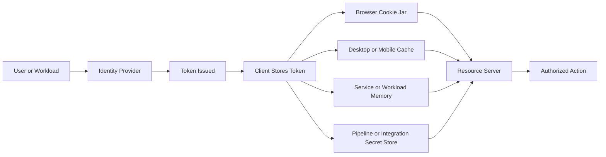
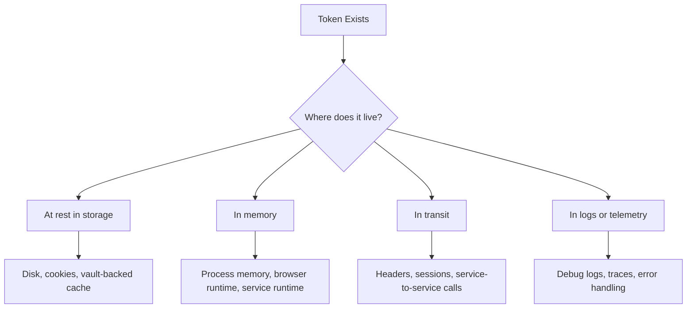
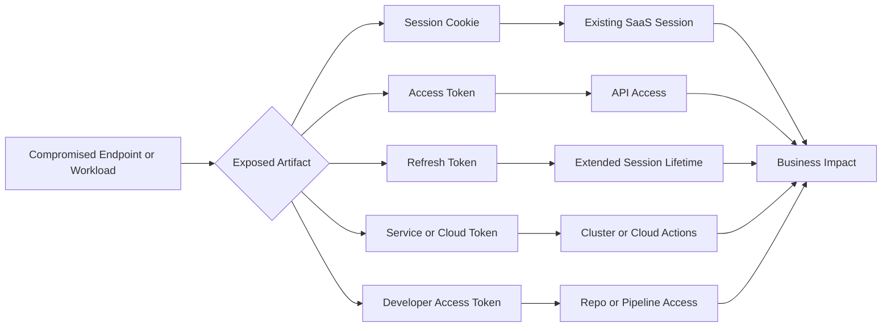

# Token Theft

> **Phase 09 — Credential Access**  
> **Difficulty:** Beginner -> Advanced  
> **Focus:** Understanding why session cookies, OAuth tokens, refresh tokens, cloud workload tokens, and developer access artifacts often matter more than passwords in modern environments.  
> **Authorized-use note:** This note is for sanctioned adversary emulation, purple teaming, and defensive architecture review only. It explains risk, validation ideas, detection, and hardening guidance without providing step-by-step intrusion instructions.

---

**Relevant ATT&CK concepts:** TA0006 Credential Access | T1528 Steal Application Access Token | T1539 Steal Web Session Cookie

---

## Table of Contents

1. [What Token Theft Means](#what-token-theft-means)
2. [Why It Matters](#why-it-matters)
3. [Token Types Every Operator Should Know](#token-types-every-operator-should-know)
4. [How the Token Trust Model Works](#how-the-token-trust-model-works)
5. [Where Tokens Show Up in Real Environments](#where-tokens-show-up-in-real-environments)
6. [Authorized Adversary-Emulation View](#authorized-adversary-emulation-view)
7. [Common Risk Patterns](#common-risk-patterns)
8. [What Changes from Beginner to Advanced](#what-changes-from-beginner-to-advanced)
9. [Detection Opportunities](#detection-opportunities)
10. [Defensive Controls](#defensive-controls)
11. [Incident Response Priorities](#incident-response-priorities)
12. [Practical Assessment Checklist](#practical-assessment-checklist)
13. [Key Takeaways](#key-takeaways)

---

## What Token Theft Means

In older environments, the password was usually the most important credential. In modern web, SaaS, cloud, and API-driven environments, the **token is often the credential that actually gets used**.

A token can represent:

- an already-authenticated browser session
- delegated API access for a user
- long-lived refresh capability
- workload or service identity
- access granted by a CI/CD platform or developer workflow

The important idea is simple:

> **If a platform trusts the token, an attacker may not need the password at all.**

That is why token theft matters so much in adversary emulation. It tests whether a compromise of one endpoint, browser, workload, or automation system can turn into trusted access somewhere else.

---

## Why It Matters

Token theft is dangerous because it frequently bypasses the assumptions defenders make about passwords and MFA.

### Why defenders care

| Reason | Why It Increases Risk |
|---|---|
| **MFA may already be satisfied** | A valid session cookie or access token can represent a login that already passed MFA. |
| **Modern apps are API-first** | SaaS and cloud platforms rely heavily on bearer tokens for day-to-day authorization. |
| **Tokens are everywhere** | Browsers, desktop apps, mobile apps, build agents, proxies, and workloads all use them. |
| **Some tokens are portable** | If a token is not strongly bound to device or sender, replay may be possible from another context. |
| **Refresh material extends dwell time** | A short-lived access token may be low value alone, but paired refresh capability can become persistent access. |
| **Workload identities are powerful** | Service accounts and managed identities often have broad cloud or cluster permissions. |

### Simple mental model

```text
Password proves who you are once.
Token proves what you are allowed to do right now.
```

In practice, the second part is often more useful to an attacker.

---

## Token Types Every Operator Should Know

Not all tokens are equally valuable. The first skill is learning the difference between them.

| Token / Artifact | What It Usually Does | Why It Is Valuable | Common Limiter |
|---|---|---|---|
| **Web session cookie** | Keeps a user logged into a website or SaaS platform | Can represent an already-authenticated browser session | May be tied to browser, device, IP, or session protections |
| **Access token** | Authorizes calls to an API or resource server | Can allow direct API use with user or app privileges | Usually short-lived and scoped |
| **Refresh token** | Obtains new access tokens without full re-authentication | Can extend access beyond normal access-token lifetime | Rotation, revocation, and conditional access policies |
| **ID token** | Conveys identity information to the client | Less useful for API authorization, but still sensitive | Often not accepted by resource servers |
| **Service account token** | Lets an application or workload act as a non-human identity | Often highly trusted inside clusters, pipelines, or automation | Scope may be limited if designed well |
| **Managed identity / metadata token** | Provides temporary cloud access for a workload | Can unlock control-plane actions without static secrets | Usually short-lived and workload-bound |
| **PAT / developer token** | Grants access to source control, packages, or automation APIs | Can expose code, pipelines, and secrets at scale | Expiry, scope controls, and org policy |
| **API key or integration secret** | Authenticates one service to another | Frequently broad and poorly monitored | Rotation and gateway restrictions |

### Important beginner distinction

- **Authentication artifacts** prove a login happened.
- **Authorization artifacts** prove some action is allowed.

Many real-world tokens do both in practice, which is why handling mistakes are so risky.

---

## How the Token Trust Model Works

A beginner-friendly way to think about token theft is to follow the trust chain.



### Core trust questions

1. **Who issued the token?**  
   An identity provider, application, cloud metadata service, or internal control plane.

2. **Who is supposed to use it?**  
   A browser, a client application, a containerized workload, or an automation process.

3. **What accepts it?**  
   A SaaS platform, cloud API, cluster API, internal service, or source-control system.

4. **What limits it?**  
   Scope, audience, expiration, revocation, sender binding, device compliance, or network conditions.

### The big operational lesson

The danger of token theft is not just the token value itself. The danger comes from the entire relationship:

```text
Issuer + Scope + Lifetime + Portability + Monitoring = Real Risk
```

Two tokens that look similar can produce very different outcomes depending on those five factors.

---

## Where Tokens Show Up in Real Environments

A common beginner mistake is to imagine tokens only as JWTs in web apps. In reality, token exposure spans many technologies.

### Common locations

| Environment | Typical Token Exposure Areas | Why It Matters |
|---|---|---|
| **Web browsers** | Cookies, local session state, extension interactions, browser debugging contexts | One user endpoint may expose many SaaS sessions |
| **Single-page apps** | Browser-managed storage and client-side session handling | Poor storage choices can make high-value tokens easier to expose |
| **Desktop clients** | Local caches, memory, embedded browser sessions | Thick clients often bridge user identity and enterprise APIs |
| **Mobile apps** | App storage, secure enclave usage, background refresh workflows | Enterprise mobile access can mirror desktop identity risk |
| **Cloud workloads** | Metadata services, workload identity tokens, sidecar access paths | Non-human identities may have broad permissions |
| **Containers and Kubernetes** | Service account tokens, mounted secrets, pod-to-API trust | Compromised workloads can become control-plane risk |
| **CI/CD systems** | Build tokens, package registry credentials, deployment identities | One pipeline token can expose code, artifacts, and cloud deployment paths |
| **Reverse proxies and observability tools** | Headers, traces, logs, debugging output | Tokens sometimes leak through tooling rather than primary app logic |

### A practical way to think about storage



This matters because the exposure path changes what telemetry defenders can collect and what controls actually work.

---

## Authorized Adversary-Emulation View

In a professional engagement, token theft is not about copying criminal behavior for its own sake. It is about validating whether trusted access can be abused under realistic, approved conditions.

### Safe validation goals

An authorized exercise usually asks questions like:

- Can a compromised user endpoint expose reusable SaaS sessions?
- Can delegated access tokens reach data or APIs defenders did not expect?
- Are refresh mechanisms extending access beyond acceptable risk?
- Are workload identities over-privileged relative to their business purpose?
- Can defenders detect token replay, unusual refresh behavior, or session migration?

### Safer exercise design

| Exercise Element | Safer Practice |
|---|---|
| **Identity selection** | Use approved test accounts, synthetic data, or white-team-coordinated identities when possible |
| **Proof of impact** | Demonstrate limited authorized access to a harmless target rather than broad account takeover |
| **Scope control** | Predefine which apps, tenants, APIs, and workloads are in scope |
| **Telemetry validation** | Decide in advance which identity, SaaS, endpoint, or cloud logs should show the activity |
| **Revocation plan** | Ensure tokens, sessions, and delegated grants can be revoked immediately after validation |

### What mature teams are really testing

They are usually testing one or more of these defense hypotheses:

1. **Token storage is not adequately protected**
2. **Replay protection is incomplete**
3. **Privilege on issued tokens is broader than intended**
4. **Refresh and revocation controls are too weak**
5. **Detection focuses on password abuse, not session abuse**

That framing keeps the note aligned with adversary emulation instead of intrusion instruction.

---

## Common Risk Patterns

These patterns appear repeatedly across modern environments.

| Pattern | What It Looks Like | Why It Is Dangerous | Defender Question |
|---|---|---|---|
| **Web session replay** | A valid cookie is reused outside the original browsing context | Password and MFA may no longer matter | Can we spot session movement across devices or networks? |
| **Delegated OAuth token abuse** | A token meant for one app or workflow is used to reach sensitive APIs | Users may not realize how much consent they granted | Do we log and review app consent, token use, and unusual scopes? |
| **Refresh-token persistence** | Access appears temporary, but new tokens can keep being issued | Dwell time becomes much longer than expected | Can we detect abnormal refresh frequency or source changes? |
| **Managed identity misuse** | A workload token is used for cloud control-plane actions beyond the workload's purpose | Non-human identities are often trusted and under-monitored | Are workload roles truly least-privilege? |
| **Service account sprawl** | Shared automation identities can access many systems | Compromise scales quickly across environments | Can we map each service token to a clear owner and purpose? |
| **Developer token leakage** | PATs or integration tokens expose repos, packages, and pipelines | Build systems often lead to wider secrets and cloud access | Are fine-grained scopes and expiry mandatory? |
| **Logging and tracing leaks** | Tokens appear in debug output, traces, proxies, or support tooling | Exposure occurs outside the expected auth path | Do we sanitize sensitive headers and auth artifacts everywhere? |

### Blast-radius view



---

## What Changes from Beginner to Advanced

The topic becomes more sophisticated as you stop treating all tokens as interchangeable.

### Beginner view

At a beginner level, the lesson is:

> **A stolen token may act like a password that already passed login.**

That is enough to understand why session handling matters.

### Intermediate view

At an intermediate level, operators start asking:

- Is this token a bearer token or bound to a sender/device?
- What resource audience accepts it?
- Is it human or workload identity?
- Does it carry broad scopes or narrow scopes?
- Can it be refreshed, rotated, or revoked quickly?

### Advanced view

At an advanced level, teams care about:

- trust boundaries between browser, app, proxy, and API
- differences between access tokens, refresh tokens, and session cookies
- SaaS and cloud identity telemetry quality
- workload identity abuse in containers and serverless systems
- delegated consent risk and app-to-app trust chains
- whether token replay is prevented or only detected later

### A useful maturity ladder

| Level | Main Question |
|---|---|
| **Beginner** | Can a stolen token bypass the login process? |
| **Intermediate** | What scope, lifetime, and portability make this token useful? |
| **Advanced** | How do identity architecture, trust chains, and telemetry affect replay, persistence, and blast radius? |

---

## Detection Opportunities

Token theft is often missed because defenders are watching for failed logins, brute force, or malware-like behavior while the attacker uses **valid** identity material.

### Useful detection themes

| Detection Theme | What to Look For |
|---|---|
| **Session migration** | Same session or token family appearing from new geography, ASN, device, browser profile, or workload path |
| **Refresh anomalies** | Refresh activity from a source that differs from the original client pattern |
| **Scope drift** | A token suddenly accessing data sets, APIs, or admin functions not typical for that identity |
| **Impossible workload behavior** | A service token calling cloud or cluster APIs outside its expected runtime pattern |
| **Unusual app consent** | New delegated permissions or third-party app grants that expand access unexpectedly |
| **Endpoint precursors** | Browser data access, secret-store access, memory reads, debugging enablement, or suspicious process interaction around apps that cache tokens |
| **Pipeline misuse** | Repository cloning spikes, artifact pulls, or deployment actions from unusual automation contexts |

### Strong telemetry sources

- identity provider sign-in and token issuance logs
- SaaS audit logs
- cloud control-plane logs
- Kubernetes audit logs
- endpoint telemetry around browsers and token-caching applications
- CI/CD audit trails
- proxy and API gateway telemetry

### What defenders should correlate

The best detections usually combine at least two views:

```text
Endpoint or workload signal
        +
Identity or API activity
        =
Stronger token-abuse evidence
```

For example, a token refresh event alone may be ambiguous. A refresh event plus unusual endpoint behavior or new API access is much more convincing.

---

## Defensive Controls

Good defense is not one feature. It is a layered design.

| Control | Why It Helps |
|---|---|
| **Short-lived access tokens** | Reduces the useful life of a stolen access token |
| **Refresh-token rotation** | Makes long-term silent reuse harder and creates stronger signals when refresh behavior is abnormal |
| **Revocation and session kill capability** | Lets defenders respond quickly when abuse is suspected |
| **Least-privilege scopes and roles** | Limits what a stolen token can do |
| **Token binding / sender-constrained designs where supported** | Makes replay from a different client or host harder |
| **Secure cookie settings** | Helps reduce web session exposure through common client-side paths |
| **Device and conditional access policies** | Adds environmental checks beyond possession of the token alone |
| **Workload identity over static secrets** | Removes some long-lived credentials, but only if roles remain tightly scoped |
| **Admin tiering and browser separation** | Prevents highly privileged sessions from living on lower-trust endpoints |
| **Log and trace scrubbing** | Prevents accidental token disclosure through observability tooling |
| **App governance and consent review** | Reduces delegated OAuth abuse and shadow integrations |

### Common misconception

> **"We use MFA, so token theft is less important."**

That is often false. MFA is excellent at the login step, but a valid session or refresh path may still represent a post-MFA credential.

---

## Incident Response Priorities

When token abuse is suspected, responders should focus on containment and trust re-establishment.

### First questions to answer

1. **What kind of token was involved?**  
   Session cookie, access token, refresh token, PAT, service account token, or workload identity token.

2. **What trusted it?**  
   A SaaS app, API gateway, cloud provider, Kubernetes API, source-control platform, or internal service.

3. **What was its blast radius?**  
   Identity scope, data access, admin actions, or downstream trust paths.

4. **Can it be revoked centrally?**  
   Session termination, refresh-token invalidation, delegated grant removal, PAT rotation, or service identity rotation.

5. **What system exposed it?**  
   Browser endpoint, workload, proxy, build system, log pipeline, or support tool.

### Response priorities

- revoke active sessions and refresh capability where possible
- review delegated grants and app consents
- investigate the endpoint or workload that exposed the token
- identify downstream actions performed with that identity
- rotate or reissue affected workload and developer credentials
- confirm detections fire on any repeated replay attempt

---

## Practical Assessment Checklist

Use this as a red-team, purple-team, or defensive review checklist.

### Architecture and storage

- Do we know where high-value tokens are stored across browsers, clients, workloads, and pipelines?
- Which tokens are bearer-portable, and which are sender- or device-constrained?
- Are refresh tokens present where they do not need to be?
- Are privileged admin sessions isolated from normal browsing activity?

### Scope and privilege

- Which identities receive the broadest scopes or roles?
- Do service accounts and managed identities have a single clear purpose?
- Can one developer or automation token reach source code, packages, and deployment systems at the same time?
- Are token audiences and permissions narrower than the business function requires?

### Detection and response

- Can we detect session migration, replay, or unusual refresh behavior?
- Can we correlate endpoint events with identity or API logs?
- Can we revoke sessions and delegated access quickly?
- Do cloud, SaaS, and CI/CD platforms send enough audit detail to support investigations?

### Exercise quality

- Are we validating realistic threat paths instead of generic "token bad" scenarios?
- Are we using approved identities and harmless proof targets?
- Are success criteria defined before testing starts?
- Are we measuring not just access, but defender visibility and response speed?

---

## Key Takeaways

- In modern environments, **tokens are often the credential that really matters**.
- The real risk depends on **scope, lifetime, portability, and monitoring**, not just token presence.
- Session cookies, access tokens, refresh tokens, service tokens, and developer tokens create different kinds of blast radius.
- Mature adversary emulation focuses on **safe validation of identity architecture and detection quality**, not on unsafe abuse instructions.
- Strong defenses require layered controls: **least privilege, short lifetimes, rotation, revocation, replay resistance, and good telemetry**.

---

> **Defender mindset:** Treat tokens as sensitive credentials, not just application plumbing. If a trusted token can move farther than the business intended, token theft becomes an identity architecture problem, not only an endpoint problem.
