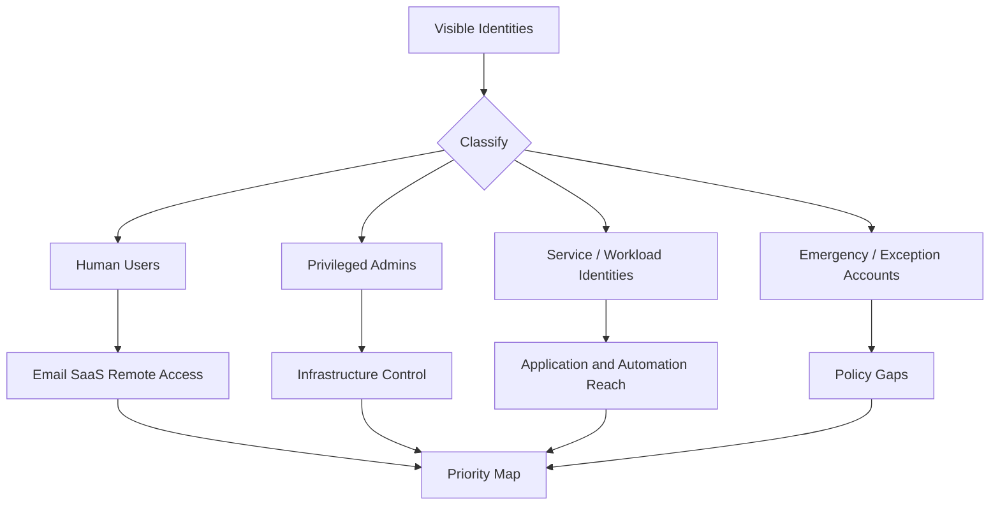
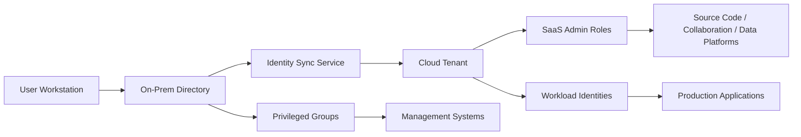

# Account Discovery

> **Phase 10 — Discovery**  
> **Focus:** Identifying which human, service, privileged, and emergency accounts exist so an authorized red team can understand identity exposure and defenders can reduce account-driven attack paths.  
> **Authorized-use note:** This note is for sanctioned adversary emulation, purple teaming, and defensive engineering. It explains what to look for, how to reason about findings, and how to detect risk **without** providing harmful step-by-step intrusion instructions.

---

**Relevant ATT&CK concepts:** TA0007 Discovery | T1087 Account Discovery | T1033 System Owner/User Discovery

---

## Table of Contents

1. [Why It Matters](#why-it-matters)
2. [Beginner View](#beginner-view)
3. [What Counts as an Account](#what-counts-as-an-account)
4. [How Authorized Account Discovery Works](#how-authorized-account-discovery-works)
5. [Common Patterns](#common-patterns)
6. [Practical Red-Team Questions](#practical-red-team-questions)
7. [Diagrams](#diagrams)
8. [Detection Opportunities](#detection-opportunities)
9. [Defensive Controls](#defensive-controls)
10. [Conceptual Example](#conceptual-example)
11. [Key Takeaways](#key-takeaways)
12. [References and Further Reading](#references-and-further-reading)

---

## Why It Matters

Account discovery is one of the fastest ways to understand an environment.

A hostname tells you **where** something is. An account tells you **who can do what**.

During an authorized engagement, account discovery helps answer questions such as:

- Which identities are ordinary users versus high-impact administrators?
- Which non-human identities run applications, pipelines, backups, or cloud workloads?
- Which accounts cross boundaries between on-prem, cloud, SaaS, and production systems?
- Which identities are exceptions to normal security controls such as MFA, approval workflows, or tiered administration?

MITRE ATT&CK highlights account discovery because valid usernames, email addresses, and account listings often shape later attacker decisions. In practice, this makes identity mapping one of the highest-value discovery activities for both red and blue teams.

---

## Beginner View

At a basic level, account discovery means building a trustworthy picture of **which identities exist** in the environment.

That usually starts with simple categories:

- **End-user accounts** for employees and contractors
- **Privileged administrator accounts** for infrastructure and security operations
- **Service accounts** for applications, scheduled jobs, APIs, and automation
- **Machine or workload identities** used by servers, containers, cloud functions, and agents
- **Emergency or break-glass accounts** meant for crisis access
- **External or federated identities** from partners, vendors, or subsidiaries

A beginner should first learn this core idea:

> The goal is not to collect a giant list of names.  
> The goal is to identify which accounts matter most, why they matter, and what risk they create if abused.

---

## What Counts as an Account

Many learners think only of classic directory users. Real environments are wider than that.

| Account Type | Plain-English Meaning | Why It Matters in Red Teaming | Typical Defensive Concern |
|---|---|---|---|
| **User account** | A normal person logging in for work | Large attack surface, often tied to email and SaaS | Phishing resistance, MFA, session monitoring |
| **Privileged account** | An identity with elevated administrative rights | Small population, very high impact | Tiering, PAM, session isolation |
| **Service account** | Identity used by software or scheduled tasks | Often broad and long-lived | Secret rotation, non-interactive monitoring |
| **Machine/workload identity** | Account bound to a host, container, or cloud workload | Can bridge systems silently | Least privilege, scoped tokens, lifecycle controls |
| **Break-glass account** | Emergency access identity for outages or lockouts | Rarely used but extremely sensitive | Strong storage, logging, limited exemptions |
| **Federated/external identity** | Identity from another org or identity provider | Can extend trust beyond obvious boundaries | Trust review, conditional access, offboarding |
| **SaaS admin account** | Admin identity inside apps like GitHub, M365, Salesforce, CI/CD | May control data or automation outside AD | Central governance, SSO enforcement |

### A useful mental model

Think of account discovery as building an **identity graph**:

```text
Identity → Role → Group → System → Data → Business Impact
```

That graph is what turns discovery into operational understanding.

---

## How Authorized Account Discovery Works

Authorized account discovery is best understood as a series of safe analytical steps.

### 1. Establish the current identity context

First determine what identity universe the current foothold belongs to.

Questions to answer:

- Is this system local-only, domain-joined, hybrid-joined, or cloud-native?
- Which identity providers are relevant: Active Directory, Microsoft Entra ID, Okta, Google Cloud IAM, AWS IAM, GitHub Enterprise, internal SSO, or another platform?
- Is the current user interactive, delegated, automated, or temporary?

This matters because account visibility changes drastically depending on context. A local workstation may reveal only a tiny slice of the environment, while a management plane or identity sync server reveals much more.

### 2. Separate human identities from non-human identities

This is one of the most important practical splits.

**Human identities** usually reflect departments, seniority, travel patterns, and business process access.

**Non-human identities** usually reflect system design:

- application pools
- API integrations
- deployment pipelines
- backup tooling
- monitoring agents
- containers and cloud services

In mature environments, non-human accounts often outnumber privileged humans and may have weaker oversight.

### 3. Classify by privilege level and blast radius

Microsoft's privileged access guidance emphasizes security levels because not all accounts deserve the same handling. During an engagement, it helps to classify identities into tiers such as:

- **Standard**: routine user activity
- **Sensitive/specialized**: finance, executives, developers of critical systems, help desk, approvers
- **Privileged**: directory admins, cloud admins, backup admins, hypervisor admins, CI/CD owners, security tooling admins

The red-team value here is prioritization:

- A single low-privilege user may matter because of email, browser sessions, or SaaS reach.
- A single privileged account may matter because it controls many systems.
- A seemingly ordinary service identity may matter because it quietly touches production, backup, and deployment paths.

### 4. Find concentration points

The most useful accounts are often not the loudest ones.

Look for identities that sit at **choke points**:

- directory administration
- virtualization platforms
- backup and recovery tooling
- identity synchronization services
- certificate services
- CI/CD systems
- secret stores and automation orchestrators
- endpoint management or remote support platforms

These accounts matter because they connect many systems at once.

### 5. Identify exception paths

Good environments have standards. Interesting environments have exceptions.

Exception accounts often include:

- legacy service accounts kept for compatibility
- accounts exempt from MFA or conditional access
- dormant users that were never removed
- emergency accounts with broad standing privilege
- partner or vendor accounts with unclear ownership
- local administrator accounts managed inconsistently across systems

These do not always look important at first glance, but they often represent the gap between policy and reality.

### 6. Expand from identities to relationships

Mature discovery asks relationship questions, not just inventory questions.

Examples:

- Which service account runs the application that authenticates users?
- Which admin groups can reset passwords for other admins?
- Which identities can approve deployments, alter secrets, or access backups?
- Which accounts exist in both on-prem and cloud control planes?
- Which roles combine business authority and technical access?

This is where a simple user list becomes an attack-path map.

### 7. Prioritize findings by operational value

A practical red team usually ranks discovered accounts into four buckets:

| Priority | Meaning | Example |
|---|---|---|
| **Immediate** | High privilege or broad control | Domain admin, tenant admin, backup admin |
| **Strategic** | Enables future movement or persistence | Identity sync account, deployment account |
| **Contextual** | Explains environment structure | Shared help-desk group, regional admin team |
| **Low value** | Limited access and little path expansion | Basic kiosk or temporary training account |

---

## Common Patterns

| Pattern | What It Means | Common Signals | Defensive Focus |
|---|---|---|---|
| **Large user population with a small admin core** | Typical enterprise design where few identities have outsized power | Many standard users, few privileged groups | Strong admin isolation and review of privilege concentration |
| **Service account sprawl** | Applications and jobs depend on many long-lived identities | Reused credentials, broad app permissions, stale ownership | Managed identities, vaulting, rotation, ownership tagging |
| **Hybrid identity overlap** | On-prem and cloud roles combine in the same operational paths | Sync services, federated sign-in, shared admins | Protect sync infrastructure and split high-risk duties |
| **SaaS shadow administration** | Admin power exists outside the main directory model | Local SaaS admins, app-specific tokens, exceptions to SSO | Centralize SaaS governance and require identity federation |
| **Dormant or emergency account risk** | Rarely used accounts retain large permissions | Long inactivity, sudden logins, limited monitoring | Disable by default, approval workflows, strong alerting |
| **Help-desk and support concentration** | Operational teams have password reset or endpoint reach | Delegated admin tools, remote support consoles | Separate roles, just-in-time access, logging of admin actions |

---

## Practical Red-Team Questions

These questions keep discovery useful and safe during an authorized exercise.

### Beginner questions

- Which accounts are visible from the current system or management plane?
- Which accounts appear to be human versus automated?
- Which identities seem tied to email, SaaS, or remote access?

### Intermediate questions

- Which groups or roles imply hidden privilege, not just obvious admin status?
- Which accounts are shared by teams, applications, or operational processes?
- Which accounts cross trust boundaries such as domain-to-cloud or production-to-backup?

### Advanced questions

- Where does identity administration concentrate operational power?
- Which identities can indirectly influence many systems through deployment, secrets, synchronization, or support tooling?
- Which exception accounts create a realistic attack path even if core admin accounts are well protected?

### A safe practitioner checklist

During reporting or internal review, a strong account-discovery note usually answers:

- **Inventory:** What account classes exist?
- **Ownership:** Who owns them?
- **Privilege:** What can they control?
- **Exposure:** Where are they reachable from?
- **Exceptions:** Which identities bypass normal policy?
- **Priority:** Which identities deserve immediate hardening?

---

## Diagrams

### 1. From raw identities to high-value findings



### 2. Identity graph in a hybrid enterprise



### 3. How defenders should think about account risk

```text
Low Visibility + High Privilege = High Concern
High Visibility + Low Privilege = Broad Monitoring Problem
Low Visibility + Cross-System Access = Silent Expansion Risk
Rare Use + Policy Exception = Immediate Review Candidate
```

---

## Detection Opportunities

Account discovery is often missed because individual actions may look administrative. Detection improves when defenders focus on **context and combinations**.

### What to watch for

- Unusual identity-directory lookups from user workstations or application servers
- New interest in admin rosters, privileged groups, password-reset roles, or support tooling
- Enumeration focused on service accounts, automation identities, or dormant users
- Sudden visibility into cloud roles, SaaS admins, tenant permissions, or app integrations from identities that do not normally perform governance work
- Correlation between account discovery and follow-on access attempts, privilege changes, token requests, or remote administration activity

### High-signal combinations

| Sequence | Why It Matters |
|---|---|
| **Account discovery → group/role review → privileged login attempt** | Suggests deliberate identity-path mapping |
| **Service account interest → secrets platform access → deployment system activity** | Indicates pursuit of non-human identity abuse paths |
| **Dormant account lookup → reactivation or login** | Strong sign of policy gap exploitation or account misuse |
| **SaaS admin review → repository or messaging platform changes** | Suggests movement beyond traditional endpoint boundaries |

### Good defensive telemetry sources

- Directory audit logs
- Identity provider sign-in and role-assignment logs
- PAM/PIM activity
- Endpoint telemetry for admin tooling and unusual directory interaction
- SaaS audit logs for admin-view access and role changes
- Cloud control-plane logs for IAM and service-account visibility events

---

## Defensive Controls

| Control | Why It Helps |
|---|---|
| **Identity governance and recertification** | Removes forgotten privilege, stale memberships, and unclear ownership |
| **Tiered administration** | Keeps powerful identities separate from everyday browsing and email use |
| **Privileged access management** | Reduces standing admin exposure and improves logging |
| **Managed service/workload identities** | Replaces long-lived secrets with tighter lifecycle control |
| **Conditional access and MFA discipline** | Makes exceptions rare, documented, and highly visible |
| **Central SaaS administration strategy** | Prevents admin sprawl outside the main identity model |
| **Break-glass account controls** | Ensures emergency access exists without becoming a hidden backdoor |
| **Role and group minimization** | Shrinks the identity graph and simplifies detection |

### Defensive design principle

A good identity program reduces both:

1. **the number of powerful accounts**, and  
2. **the number of systems each powerful account can influence**

That is how defenders raise attacker cost without relying only on detection.

---

## Conceptual Example

An authorized red team reviews a hybrid environment and finds three important identity patterns:

1. A small number of directory administrators are well protected.
2. Several legacy service accounts still support deployment and backup workflows.
3. A cloud tenant has app-specific administrators outside the normal privileged review process.

No exploit details are needed to see the risk.

The identity graph shows that while the obvious admin accounts are hardened, overlooked non-human and SaaS identities still provide broad operational reach. That becomes the key finding: **identity governance maturity is uneven across platforms**, creating realistic paths for an adversary to chain access.

---

## Key Takeaways

- Account discovery is really **identity exposure discovery**.
- The most dangerous accounts are not always the most visible ones.
- Service, workload, backup, deployment, and SaaS admin identities often matter as much as classic domain admins.
- Exception accounts reveal where security policy and operational reality diverge.
- The best output of account discovery is not a name list; it is a **prioritized identity map** tied to business impact.

---

## References and Further Reading

- MITRE ATT&CK — **T1087 Account Discovery**
- MITRE ATT&CK — **T1033 System Owner/User Discovery**
- Microsoft guidance on **privileged access security levels** for separating enterprise, specialized, and privileged roles
