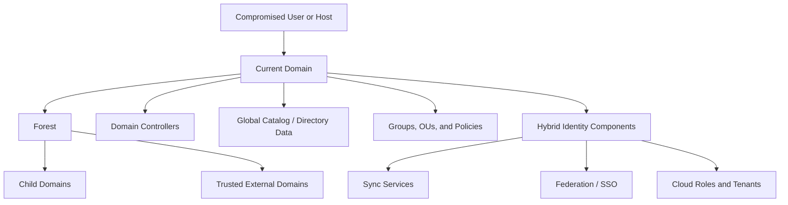
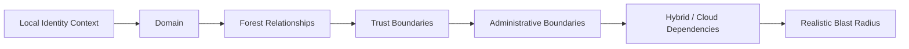
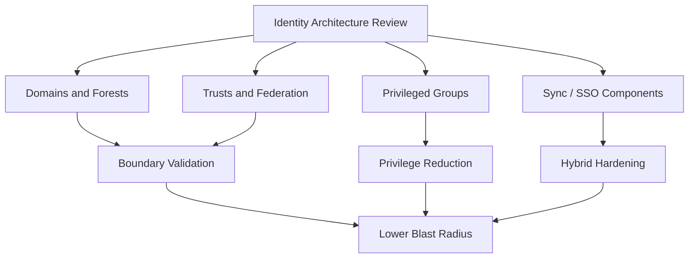

# Domain Discovery

> **Phase 10 — Discovery**  
> **Focus:** Understanding domains, forests, trusts, organizational units, identity services, and hybrid boundaries during **authorized adversary emulation**.  
> **Safety note:** This note is for defensive learning, security validation, and approved red team exercises. It explains what domain discovery is, what it reveals, and how defenders can detect and reduce risk. It does **not** provide step-by-step intrusion instructions.

---

**Relevant ATT&CK concepts:** TA0007 Discovery | T1482 Domain Trust Discovery | T1087 Account Discovery | T1016 System Network Configuration Discovery

---

## Table of Contents

1. [Why It Matters](#why-it-matters)
2. [Domain Discovery in One Picture](#domain-discovery-in-one-picture)
3. [Core Concepts](#core-concepts)
4. [Beginner View](#beginner-view)
5. [Intermediate to Advanced View](#intermediate-to-advanced-view)
6. [Authorized Discovery Workflow](#authorized-discovery-workflow)
7. [What to Map in Practice](#what-to-map-in-practice)
8. [Common Enterprise Patterns](#common-enterprise-patterns)
9. [How to Think Like a Defender](#how-to-think-like-a-defender)
10. [Detection Opportunities](#detection-opportunities)
11. [Defensive Controls](#defensive-controls)
12. [Reporting Guidance](#reporting-guidance)
13. [Conceptual Scenario](#conceptual-scenario)
14. [Key Takeaways](#key-takeaways)

---

## Why It Matters

Domain discovery is the process of learning **how identity is organized** inside an enterprise.

In a small lab, a compromised host may belong to one simple domain. In a real organization, identity is usually more complicated:

- multiple domains under one forest
- parent-child relationships
- external or partner trusts
- delegated administration
- separate admin tiers
- on-prem Active Directory connected to cloud identity platforms
- certificate services, federation servers, and sync infrastructure that quietly control access everywhere

For an authorized red team, domain discovery answers one of the most important questions in the entire operation:

> **What identity boundaries exist, and which of those boundaries are truly separate versus only appearing separate?**

For defenders, the same exercise exposes architectural weakness:

- hidden trust paths
- over-broad delegation
- identity synchronization dependencies
- business-unit separation that breaks down in practice
- “low-risk” environments that can still influence critical systems

---

## Domain Discovery in One Picture



The key lesson is simple:

**Domain discovery is not just “what domain am I in?”**  
It is **“what identity ecosystem is this host connected to?”**

---

## Core Concepts

Before going advanced, understand the building blocks.

### Domain

A **domain** is an identity and policy boundary.

It usually contains:

- users
- groups
- computers
- authentication services
- policy objects
- administrative roles

Think of a domain as a managed identity neighborhood.

### Forest

A **forest** is a collection of one or more domains that share a broader directory relationship.

A forest matters because it can enable:

- shared identity visibility
- trust relationships
- cross-domain administration patterns
- centralized search through the global catalog

Think of a forest as a city made up of multiple neighborhoods.

### Trust

A **trust** is a relationship that allows one identity boundary to recognize authentication from another.

Not every trust means full access, but every trust deserves attention because it may enable:

- authentication across boundaries
- delegated access
- path chaining between business units
- broader blast radius after compromise

### Organizational Unit (OU)

An **OU** is a logical container used to organize users, groups, and systems.

OUs often reveal:

- departmental structure
- geography
- admin ownership
- where privileged systems live
- where policy inheritance may create risk

### Domain Controller (DC)

A **domain controller** is a core identity server for the domain.

If a domain is the neighborhood, a DC is part of the infrastructure that makes the neighborhood function.

### Global Catalog (GC)

The **global catalog** helps users and systems find directory objects across the broader environment. It matters because discovery of GC-connected data often reveals how much visibility exists beyond the current domain.

### Hybrid Identity

Many enterprises connect on-prem identity to cloud identity.

This means domain discovery should include:

- sync services
- federation infrastructure
- SSO dependencies
- tenant relationships
- administrative roles that bridge on-prem and cloud

---

## Beginner View

If you are new to this topic, start with three basic questions:

1. **What domain is this user or host part of?**
2. **What systems provide identity for it?**
3. **Are there signs this domain is connected to anything else?**

At the beginner level, domain discovery is about recognizing that identity is structured.

A workstation is usually not isolated. It belongs to a wider system of:

- naming conventions
- DNS suffixes
- login realms
- directory services
- group memberships
- policy inheritance
- trust relationships

### Beginner mental model

```text
User/Host
   ↓
Current Domain
   ↓
Identity Infrastructure
   ↓
Possible Trusts / Connected Environments
```

If you remember only one thing, remember this:

**The goal is not to collect names. The goal is to understand identity relationships.**

---

## Intermediate to Advanced View

At higher maturity, domain discovery becomes less about inventory and more about **attack-path and defense-path analysis**.

Advanced operators and defenders care about questions like:

- Is this a single-domain environment or a multi-domain forest?
- Are there child domains with weaker administration?
- Are there external trusts to partners, labs, subsidiaries, or legacy environments?
- Does the organization use hybrid identity, sync servers, or federation?
- Which systems act as identity choke points?
- Are certificate services, directory sync, or privileged management platforms part of the identity path?
- Are administrative boundaries aligned with real business risk, or only with org chart labels?
- Can a low-tier system reveal data about high-tier identity architecture?

### Why advanced discovery matters

According to Microsoft AD DS documentation, Active Directory is a hierarchical directory with a schema, global catalog, query capability, and replication across domain controllers. That means identity information is intentionally designed to be searchable and distributed for legitimate enterprise use. From a defender’s perspective, that convenience is also why architecture visibility must be monitored.

MITRE ATT&CK also treats **domain trust discovery** as a recognizable behavior because adversaries repeatedly try to understand trust relationships before moving deeper into an environment.

### Advanced mental model



In other words:

**Discovery becomes valuable when it helps explain what compromise could mean at enterprise scale.**

---

## Authorized Discovery Workflow

This workflow is intentionally high-level and safe. It is designed for approved adversary emulation and defensive architecture review.

### 1. Confirm scope and rules of engagement

Before any discovery activity, confirm:

- which domains are in scope
- whether child domains, trusted forests, labs, and cloud tenants are included
- whether identity infrastructure is considered a no-touch or limited-touch zone
- what logging, deconfliction, and escalation procedures exist

In red teaming, a discovery result outside scope is still a finding, but not necessarily a target.

### 2. Establish current identity context

Start by understanding the immediate environment:

- current user identity
- current host identity
- domain membership
- DNS naming context
- visible directory affiliations
- whether the system appears on-prem, hybrid-joined, or cloud-connected

### 3. Map the directory hierarchy

Next, determine how the environment is structured:

- single domain or multiple domains
- forest relationships
- parent-child hierarchy
- business-unit separation
- environment naming patterns

### 4. Identify trust and federation edges

Now look for connections that matter more than the local domain itself:

- forest trusts
- external trusts
- partner or subsidiary access
- SSO platforms
- federation services
- sync infrastructure that bridges identity stores

### 5. Locate identity choke points

These are the systems and roles that matter most:

- domain controllers
- global catalog systems
- certificate authorities
- federation servers
- directory sync servers
- privileged admin groups
- admin workstations or management enclaves

### 6. Interpret what the architecture means

A mature discovery phase does not stop at the map. It asks:

- Which trust boundaries are strong?
- Which are weak or mostly administrative fiction?
- Which identity systems create broad blast radius if compromised?
- Which paths deserve defensive validation, segmentation review, or hardening?

### 7. Turn discovery into reporting and validation

The final step is to translate technical structure into business risk:

- what path exists
- why it matters
- what monitoring should have noticed it
- what architectural control would reduce exposure

---

## What to Map in Practice

The table below focuses on **safe, conceptual mapping goals**, not intrusive procedure.

| What to Map | Why It Matters | What It Can Reveal | Defensive Value |
|---|---|---|---|
| **Current domain and forest** | Establishes the base identity context | Whether the system is in a small isolated domain or a larger hierarchy | Helps defenders label expected relationships |
| **Trust relationships** | Trusts define where authentication may cross boundaries | Parent-child domains, external trusts, partner links | Helps validate whether trust scope is still justified |
| **Domain controllers and GC systems** | These are core identity infrastructure | Where authentication authority and searchable directory data live | Highlights crown-jewel systems for protection |
| **OUs and policy structure** | Reveals administrative organization | Department layout, server tiers, admin ownership, inherited policy | Helps spot risky delegation or over-broad policy application |
| **Privileged groups and admin tiers** | Shows where control concentrates | Enterprise admins, delegated admins, service owners | Supports privilege-separation reviews |
| **Hybrid identity components** | Modern identity often crosses on-prem and cloud | Sync servers, SSO dependencies, cloud role overlap | Identifies cross-boundary risk that traditional segmentation misses |
| **Naming conventions and service records** | Names often expose structure | Region, role, environment type, business unit, service purpose | Improves asset classification and anomaly detection |
| **Certificate and federation infrastructure** | Identity trust often extends beyond passwords | Token services, certificate dependencies, auth bridging | Helps defenders protect non-obvious identity paths |

### Practical questions to answer

A useful domain discovery note should help you answer these questions quickly:

- What identity boundary am I seeing right now?
- What higher-level directory structure exists around it?
- Which relationships are inherited versus explicitly trusted?
- Where are the crown-jewel identity systems?
- Which boundaries are likely to matter for lateral movement or privilege concentration?
- Which connected cloud or SaaS identity systems increase blast radius?

---

## Common Enterprise Patterns

| Pattern | What It Looks Like | What It Means for Red Teaming | What It Means for Defense |
|---|---|---|---|
| **Single-domain enterprise** | One main domain, centralized administration | Easier to understand, but core compromise has broad impact | Protect the few central identity systems extremely well |
| **Multi-domain forest** | Separate domains for geography or business units | A map of relationships matters more than any one host | Review cross-domain administration and trust necessity |
| **Subsidiary or partner trust** | Legacy acquisition or partner access remains in place | Lower-maturity environments may influence higher-value ones | Treat trust edges like external exposure points |
| **Admin-tiered enterprise** | Workstations, servers, and privileged systems are intentionally separated | Discovery focuses on where the separation is real versus porous | Strong tiering reduces blast radius and improves detection |
| **Hybrid identity environment** | On-prem AD linked to cloud identity and SSO | On-prem findings may have cloud impact, and vice versa | Protect sync, federation, and privileged cloud roles as identity crown jewels |
| **Legacy coexistence environment** | Old domains, migration remnants, exception-based access | Hidden dependencies often survive long after business need ends | Cleanup and trust reduction are major security wins |

---

## How to Think Like a Defender

Domain discovery should not be seen as an attacker-only topic.

Defenders should use the same lens to ask:

- Do we know every trust our environment depends on?
- Do we know which domains are effectively in the same blast radius?
- Do OUs and delegated administration reflect real security boundaries?
- Have hybrid identity components become more sensitive than the domain controllers people usually focus on?
- Could a compromise in a lower-tier business unit expose information or control relevant to a higher-tier one?

### Defender-first diagram



A good defender asks not only **“Can someone discover this?”** but also:

> **“If they do discover it, how much advantage does that actually give them?”**

---

## Detection Opportunities

Domain discovery often blends into legitimate administration, so detection must focus on **context and sequence**, not isolated curiosity.

Look for:

- unusual directory relationship queries from user workstations
- discovery activity from hosts that do not normally perform identity administration
- sudden interest in trusts, forests, OUs, or privileged groups after an initial compromise signal
- endpoints that begin interacting with domain controllers, global catalog systems, sync servers, or federation services outside normal patterns
- account behavior that shifts from ordinary business activity to broad architecture awareness
- cloud and on-prem identity telemetry that shows the same account exploring both sides of a hybrid environment

### Detection mindset

```text
Single event: often ambiguous
Sequence of identity-mapping events: much more meaningful
Identity discovery + trust interest + admin boundary awareness: high-value signal
```

The best detections connect:

1. **who** asked for the information  
2. **from where** they asked  
3. **what identity layer** they were exploring  
4. **what happened next**

---

## Defensive Controls

| Control | Why It Helps |
|---|---|
| **Trust minimization** | Fewer trusts mean fewer opportunities for one domain to inform or influence another. |
| **Identity tiering** | Clear separation between user, server, and admin functions reduces discovery value and blast radius. |
| **Protection of sync and federation systems** | Hybrid identity components can be as important as domain controllers and are often overlooked. |
| **Delegation review** | Regularly checking delegated administration prevents “separate” domains from being operationally entangled. |
| **Directory telemetry and baselining** | You can only spot abnormal architecture exploration if you know normal identity access patterns. |
| **Legacy trust cleanup** | Old mergers, test environments, and one-off business exceptions often create hidden risk. |
| **Privileged access discipline** | Limiting who can see or manage identity structure reduces both exposure and confusion. |
| **Architecture documentation for defenders** | Blue teams detect suspicious discovery faster when they actually understand their own trust map. |

---

## Reporting Guidance

In red team reporting, domain discovery findings are more valuable when written as **architecture risk**, not as a list of names.

Good reporting should explain:

- the identity boundary observed
- the connected boundaries that matter
- the trust, delegation, or hybrid relationship involved
- why that relationship changes potential impact
- what defenders should monitor
- what architectural change would reduce the problem

### Weak report statement

> “Multiple domains were present in the environment.”

### Strong report statement

> “The environment contained a multi-domain forest with administrative overlap and a trust path from a lower-maturity subsidiary domain into higher-value corporate identity infrastructure. This increased enterprise blast radius and reduced the practical separation expected by the organization.”

That second version is much more useful because it explains **risk, not just structure**.

---

## Conceptual Scenario

A red team begins with access to a standard user endpoint in a regional office. Early discovery shows the local domain is not isolated; it belongs to a larger forest. Additional authorized review reveals:

- a child domain used for legacy operations
- a trust path to shared corporate services
- directory sync infrastructure linking on-prem identity to cloud services
- privileged groups with broader visibility than the organization intended

No exploit details are required to understand the problem.

The architectural lesson is already clear:

- a “small” foothold may exist inside a much larger identity ecosystem
- weak trust design can undermine business-unit separation
- hybrid identity can extend the blast radius beyond traditional AD assumptions

This is exactly why domain discovery matters in adversary emulation: it turns isolated observations into a realistic picture of organizational risk.

---

## Key Takeaways

- A domain is an identity boundary, but discovery should always ask what sits **around** that boundary.
- Trusts, forests, OUs, and hybrid identity components often matter more than the local host itself.
- The most important discovery output is not a list of systems; it is a map of **identity relationships and blast radius**.
- Mature defenders treat domain discovery as an architecture-review problem, not just an attacker behavior.
- In authorized red team work, the value comes from explaining how identity design affects enterprise risk and detection quality.
