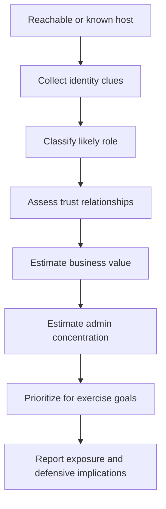
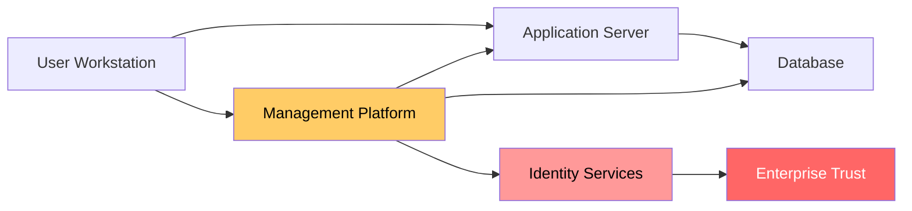

# Host Enumeration

> **Phase 10 — Discovery**  
> **Focus:** Determining which hosts exist, what they do, how they are administered, and which systems matter most during an **authorized adversary-emulation exercise**.  
> **Safety note:** This note is for authorized security testing, purple teaming, and defense improvement only. It emphasizes interpretation, prioritization, and detection-aware methodology rather than step-by-step intrusion instructions.

---

**Relevant ATT&CK concepts:** TA0007 Discovery | T1018 Remote System Discovery | T1082 System Information Discovery | T1033 System Owner/User Discovery

---

## Table of Contents

1. [Why It Matters](#why-it-matters)
2. [What Host Enumeration Means](#what-host-enumeration-means)
3. [Host Enumeration vs Other Discovery Tasks](#host-enumeration-vs-other-discovery-tasks)
4. [Beginner-to-Advanced Mental Model](#beginner-to-advanced-mental-model)
5. [A Safe Authorized Workflow](#a-safe-authorized-workflow)
6. [Useful Data Sources](#useful-data-sources)
7. [Role Classification Heuristics](#role-classification-heuristics)
8. [High-Value Host Categories](#high-value-host-categories)
9. [Diagrams](#diagrams)
10. [Detection Opportunities](#detection-opportunities)
11. [Defensive Controls](#defensive-controls)
12. [Common Mistakes](#common-mistakes)
13. [Conceptual Example](#conceptual-example)
14. [Key Takeaways](#key-takeaways)

---

## Why It Matters

Host enumeration is what turns a blurry environment into an understandable one.

Seeing that a system exists is only the starting point. What matters next is answering questions like:

- Is it a user workstation, server, jump host, appliance, or cloud workload?
- Does it sit close to sensitive data, identity infrastructure, or management tooling?
- Is it routinely touched by administrators, service accounts, or automation?
- Would activity on this host create outsized operational or defensive impact?

In real adversary emulation, host enumeration is not just about counting systems. It is about building a **decision-quality map** of the environment so the team can assess privilege pathways, choke points, detection gaps, and business risk.

---

## What Host Enumeration Means

Host enumeration is the process of identifying and **annotating systems with context**.

A raw list might say:

```text
10.10.14.22
10.10.14.45
10.10.20.11
```

A useful host-enumeration output says:

```text
10.10.14.22  → HR-WS-044      → User workstation
10.10.14.45  → SCCM-MGMT-01   → Endpoint management server
10.10.20.11  → SQL-FIN-PRD-02 → Finance database server
```

That extra context changes everything. It tells the operator or defender:

- where normal user activity lives,
- where privileged administration concentrates,
- where business-critical systems reside,
- and where one compromise could scale into a much larger problem.

---

## Host Enumeration vs Other Discovery Tasks

These discovery topics overlap, but they are not identical.

| Topic | Core Question | Main Output |
|---|---|---|
| **Network discovery** | What can this foothold reach? | Subnets, routes, trust boundaries, reachability |
| **Host enumeration** | What are these reachable systems? | Roles, ownership clues, criticality, management relationships |
| **Service discovery** | What is running on each host? | Exposed services, protocols, applications, admin surfaces |
| **Account discovery** | Who uses or administers these hosts? | User/admin presence, service accounts, privilege relationships |
| **Domain discovery** | How is identity and enterprise trust organized? | Domains, forests, trusts, OUs, core identity systems |

A simple way to remember it:

```text
Network discovery  = Where can I go?
Host enumeration   = What is there?
Service discovery  = What does it run?
Account discovery  = Who uses it?
Domain discovery   = Who trusts whom?
```

---

## Beginner-to-Advanced Mental Model

### Beginner view: “What kind of machine is this?”

At the beginner level, host enumeration is mostly role labeling:

- laptop
- desktop
- server
- printer
- jump box
- domain controller
- database

This is already valuable because it prevents random movement and helps focus on systems that actually matter.

### Intermediate view: “How important is this host?”

At the next level, you care about:

- whether admins log into it,
- whether it stores secrets or data,
- whether it manages other systems,
- whether it acts as an identity or trust anchor,
- whether it bridges otherwise separate segments.

This is where host enumeration becomes a prioritization exercise.

### Advanced view: “How does this host shape the attack graph?”

At the advanced level, the question is not just what the host is, but what it **enables**.

Examples:

- A backup server may expose many systems indirectly because it holds privileged access across the estate.
- A virtualization manager may provide administrative visibility into entire server clusters.
- An endpoint-management platform may push software, scripts, or configuration broadly.
- A certificate or identity system may sit at the center of enterprise trust.

The best enumeration identifies hosts whose compromise would **amplify** access, persistence, or impact.

---

## A Safe Authorized Workflow

In an authorized engagement, host enumeration should be deliberate, low-noise when possible, and aligned with the rules of engagement.

### 1. Start with already-approved visibility

Prefer trusted sources that already describe the environment, such as:

- asset inventories,
- EDR or endpoint-management consoles,
- CMDB records,
- cloud asset listings,
- directory services,
- DHCP and DNS records,
- virtualization or orchestration platforms.

This approach is safer and often more accurate than blindly touching many systems.

### 2. Enrich with local host context

A single foothold can reveal useful identity markers about nearby systems:

- naming conventions,
- domain membership,
- management agents,
- shared drives,
- recent remote connections,
- deployment tools,
- certificates,
- and application references.

These signals help transform names into business roles.

### 3. Correlate role, trust, and administration

A host matters more when several signals line up. For example:

- a server naming pattern suggests management,
- admin accounts regularly authenticate there,
- the system is reachable from multiple segments,
- and it interfaces with many other hosts.

That combination raises the host’s priority substantially.

### 4. Classify with confidence levels

Avoid pretending every guess is certain. A mature note set distinguishes between:

- **confirmed** role,
- **likely** role,
- **possible** role,
- and **unknown**.

This prevents false assumptions from driving the exercise.

### 5. Rank by exercise objective

A host that is technically interesting may still be irrelevant.

Prioritization should reflect the goal of the engagement:

- proving exposure of identity systems,
- testing admin-tier separation,
- reaching sensitive data,
- validating segmentation,
- or measuring detection quality around privileged infrastructure.

### 6. Keep safety and detectability in view

Good adversary emulation is not reckless discovery. Teams should consider:

- whether the host is in scope,
- whether touching it is likely to disrupt operations,
- whether the technique fits the scenario,
- and whether passive or pre-approved collection can answer the same question.

---

## Useful Data Sources

Different data sources reveal different parts of host identity.

| Data Source | What It Commonly Reveals | Why It Matters | Cautions |
|---|---|---|---|
| **DNS records** | Hostnames, aliases, naming schemes, environment labels | Useful for first-pass classification | Names can be stale or misleading |
| **DHCP / IPAM** | Address ownership, lease history, subnet context | Helps link a device to location or purpose | Dynamic leases can change quickly |
| **Directory services** | Computer objects, OUs, descriptions, domain membership | Strong clue for enterprise role and trust placement | Disabled or stale objects may remain |
| **EDR / endpoint inventory** | OS, installed tools, running agents, active users | Excellent for role confirmation and anomaly review | Coverage may be incomplete |
| **Virtualization / cloud control planes** | Instance names, tags, images, scaling groups | Critical for hybrid and cloud-heavy environments | Labels depend on admin hygiene |
| **Management platforms** | Which systems are centrally administered | Often exposes blast-radius risk | These systems are themselves high value |
| **Certificates / PKI metadata** | Internal naming, service identity, trust usage | Can reveal hidden functions and service roles | Interpretation requires context |
| **Authentication telemetry** | Which accounts log into which systems | Shows admin concentration and lateral pathways | Login volume alone does not prove business criticality |
| **Backup / monitoring platforms** | Cross-environment visibility and centralization | Highlights infrastructure with broad reach | Often among the most sensitive systems |

### A practical rule

The strongest classification usually comes from **multiple weak signals combined**, not one perfect clue.

Example:

```text
Hostname says: APP-PRD-07
EDR says: service-heavy Windows Server
Auth logs show: app-admin and deployment accounts
Monitoring tags say: customer portal

Combined result: likely production application server with elevated operational importance
```

---

## Role Classification Heuristics

The table below shows how teams often infer host role during authorized emulation or defensive analysis.

| Host Role | Common Clues | Why It Attracts Attention | Defensive Priority |
|---|---|---|---|
| **User workstation** | Interactive users, office software, browser activity, endpoint agents | Common initial foothold and credential exposure point | Strong endpoint protection and user-tier segmentation |
| **Shared workstation / kiosk** | Generic logons, limited app set, location-based naming | Less useful for privilege, but can reveal local operations | Strict lockdown and application control |
| **Application server** | Service accounts, app runtimes, API or middleware dependencies | Often adjacent to business logic and data stores | Secret hygiene, app isolation, patch discipline |
| **Database server** | DB engines, backup jobs, replication partners, high uptime | High data value and often business-critical | Network restriction, privileged query monitoring |
| **File server** | Large storage volumes, many user touches, share references | Excellent map of who uses what | Share auditing, access reviews, data classification |
| **Management server** | Remote admin tools, orchestration agents, software distribution | Can scale influence across many hosts | Highest monitoring priority and admin-tier isolation |
| **Identity infrastructure** | Directory, federation, certificate, or auth roles | Often central to enterprise trust | Protected admin paths and strong hardening |
| **Security tooling host** | SIEM, EDR relay, scanner, logging or response roles | Valuable for blue-team visibility and control | Tight access control and tamper monitoring |
| **Backup / recovery platform** | Broad host visibility, storage integration, service accounts | Frequently has powerful cross-estate access | Separate tiering and enhanced credential protection |
| **Cloud workload** | Tags, instance roles, orchestration metadata, autoscaling | Role may be short-lived but highly connected | Identity scoping, tag hygiene, workload isolation |

### Confidence scoring idea

A simple scoring model makes notes more useful:

```text
1 point  = weak clue (name pattern only)
2 points = medium clue (inventory or software evidence)
3 points = strong clue (admin/auth/management relationship)

0-2  = unknown / low confidence
3-4  = likely role
5-6  = high-confidence role
7+   = confirmed or near-confirmed operational significance
```

This is not a universal formula; it is a way to think more carefully.

---

## High-Value Host Categories

Some hosts deserve immediate attention because they create leverage disproportionate to their number.

### 1. Management systems

These include platforms used to administer, patch, deploy, orchestrate, back up, or remotely support other machines.

Why they matter:

- they often reach many systems,
- they may store privileged secrets,
- and their normal activity can mask powerful administrative operations.

### 2. Identity and trust anchors

These include directory infrastructure, federation systems, certificate services, and related authentication components.

Why they matter:

- they shape who can authenticate where,
- they often sit near the top of trust relationships,
- and weaknesses here tend to have enterprise-wide consequences.

### 3. Data concentration points

These are systems where valuable information accumulates:

- databases,
- file servers,
- analytics platforms,
- collaboration back ends,
- and backup repositories.

Why they matter:

- they represent business impact directly,
- and they often reveal who depends on them.

### 4. Bridging hosts

These are systems that connect otherwise separate areas:

- jump hosts,
- VPN gateways,
- synchronization servers,
- integration middleware,
- hybrid connectors,
- and cloud management nodes.

Why they matter:

- they collapse segmentation,
- expose trust boundaries,
- and can become pivot points in both red-team analysis and defender monitoring.

---

## Diagrams

### Diagram 1: Host Enumeration as a Decision Pipeline



### Diagram 2: Why Some Hosts Matter More Than Others



The diagram shows an important lesson: the most dangerous host is not always the one holding data directly. Often it is the one that **administers** many other systems or sits closest to trust.

---

## Detection Opportunities

Defenders can often spot host enumeration through changes in **breadth**, **curiosity**, and **context mismatch**.

### Behavioral signals to watch

- A user workstation suddenly begins gathering awareness about many internal hostnames outside its normal business scope.
- A non-admin endpoint starts interacting with infrastructure naming patterns, management references, or unusual inventory sources.
- Systems with limited business purpose, such as kiosks or single-use servers, begin showing broad awareness of unrelated hosts.
- Authentication or management telemetry shows a user or process building knowledge across many systems in a short period.

### Environmental signals to watch

- Increased lookup activity against internal naming systems or asset directories.
- New attention toward management tiers, backup platforms, hypervisors, or identity services.
- Correlation between one endpoint compromise and follow-on visibility into many host categories.
- Repeated attempts to classify systems based on role rather than simply contacting a single application dependency.

### High-signal hunting questions

- Which endpoints are suddenly learning about more hosts than usual?
- Which user-tier systems show interest in admin or infrastructure naming conventions?
- Which hosts are enumerating systems outside their assigned segment or business function?
- Where do we see broad host awareness shortly before credential abuse, remote administration, or privilege escalation alerts?

---

## Defensive Controls

| Control | Why It Helps |
|---|---|
| **Accurate asset inventory** | If defenders know real host roles, they can detect role-inconsistent behavior faster. |
| **Tiered administration** | Separating user, server, and admin workflows makes high-value hosts less naturally visible. |
| **Naming and tagging hygiene** | Clean labels help defenders manage systems, but overly revealing names can aid adversary understanding. Balance clarity with exposure. |
| **Management-plane isolation** | Remote management, backup, and orchestration systems should not be casually reachable from ordinary endpoints. |
| **Authentication telemetry correlation** | Seeing where privileged accounts log in helps identify admin concentration and risky pathways. |
| **Cloud and on-prem inventory unification** | Hybrid environments are hard to defend when host context is split across tools and teams. |
| **Behavior-based detection** | Enumerative behavior often stands out more clearly than any single hostname lookup or inventory action. |
| **Deception and decoys** | Honey systems, decoy names, and fake admin assets can expose exploratory behavior early. |

### A defender mindset shift

Do not ask only, “Was this host touched?”

Also ask:

- “Why did this endpoint need to know this host existed?”
- “Does this visibility align with the user’s role?”
- “Would compromise of this enumerated host materially expand attacker options?”

---

## Common Mistakes

### Mistake 1: Treating hostnames as truth

Names are helpful, but they can be stale, generic, misleading, or inherited from older systems.

### Mistake 2: Focusing only on servers

Many critical clues live on user systems, management tools, shared storage, or cloud control planes.

### Mistake 3: Ranking by prestige instead of access paths

A “crown jewel” system is not automatically the best next focus if it is well isolated, while a mundane management server may expose a much larger blast radius.

### Mistake 4: Ignoring administrative concentration

Hosts regularly used by admins or automation often matter more than hosts that merely store data.

### Mistake 5: Over-collecting noisy data

In authorized emulation, indiscriminate collection can create risk, operational friction, or unrealistic results. Prefer scoped, explainable, and objective-driven enumeration.

---

## Conceptual Example

Imagine an authorized red-team exercise begins from a standard employee workstation.

Early host awareness reveals three interesting systems:

```text
ENG-FS-01      → file server for engineering shares
SCCM-MGMT-01   → endpoint management infrastructure
ADCS-CA-02     → certificate services host
```

If the team only thinks in terms of “which host looks most important,” they may jump mentally to the certificate server.

But better host enumeration asks:

- Which system is normally used by administrators?
- Which one touches the widest number of endpoints?
- Which one would most likely expose weak segmentation, privileged workflows, or detection gaps?

In many organizations, the management server becomes the key finding even if it is not the final objective. It may reveal that ordinary user tiers can see or influence infrastructure that should be isolated. That is exactly the type of architectural weakness adversary emulation is meant to surface.

---

## Key Takeaways

- Host enumeration is about **meaning**, not just visibility.
- The goal is to label systems by role, trust, and operational value.
- The most important hosts are often the ones that **administer**, **authenticate**, or **aggregate** rather than the ones that look glamorous.
- Strong host enumeration combines many small clues into a reliable picture.
- For defenders, the best question is not just “what was touched?” but “why did this endpoint need awareness of that host at all?”
