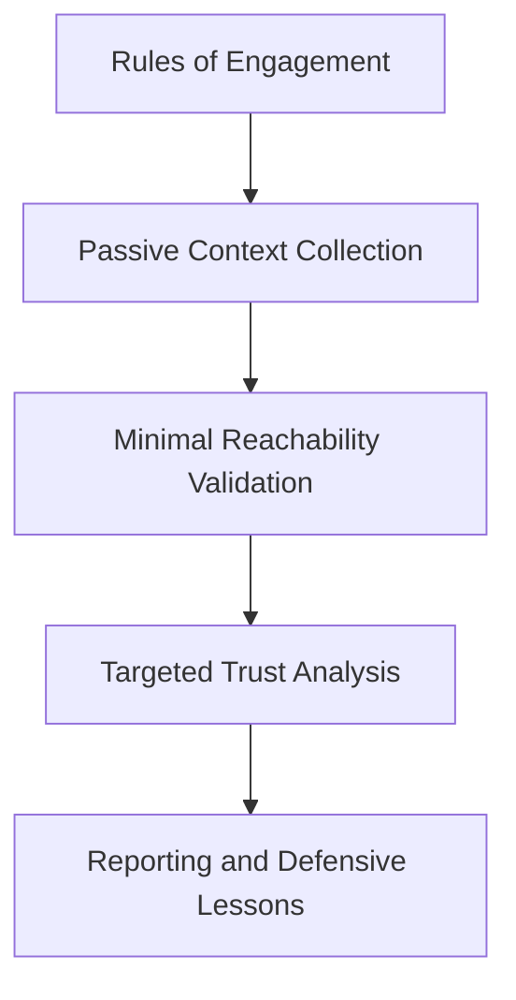
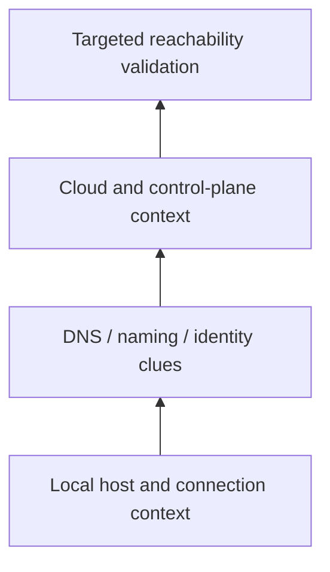
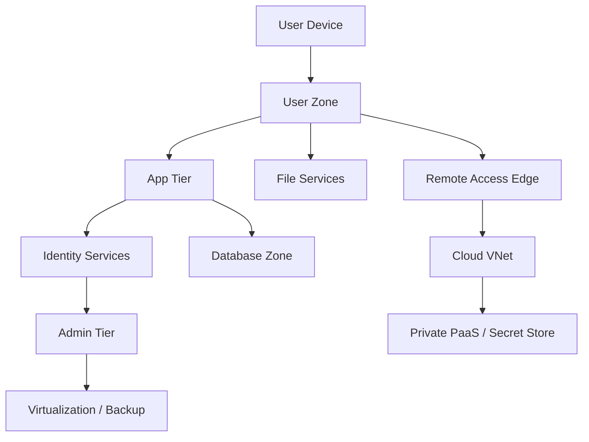
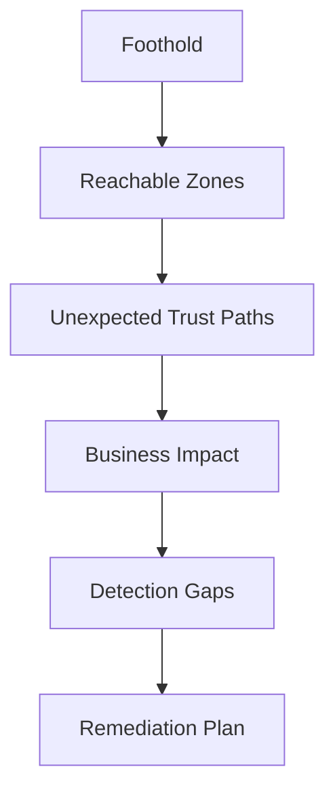

# Network Discovery

> **Phase 10 — Discovery**  
> **Focus:** Understanding what the current foothold can see, where trust boundaries really are, and which network paths matter most during an authorized adversary-emulation engagement.  
> **Safety note:** This note is for authorized security testing, purple teaming, and defensive learning only. It emphasizes scope control, low-risk validation, and detection value, and intentionally avoids harmful step-by-step intrusion instructions.

---

**Relevant ATT&CK concepts:** TA0007 Discovery | T1016 System Network Configuration Discovery | T1018 Remote System Discovery | T1046 Network Service Discovery | T1049 System Network Connections Discovery

**Useful framing from public guidance:** MITRE ATT&CK treats network/service discovery as a core adversary behavior, while Zero Trust guidance from Microsoft emphasizes assuming breach and using segmentation/micro-perimeters to reduce the value of discovery.

---

## Table of Contents

1. [Why Network Discovery Matters](#why-network-discovery-matters)
2. [Beginner View](#beginner-view)
3. [Authorized Adversary-Emulation Principles](#authorized-adversary-emulation-principles)
4. [Mental Model](#mental-model)
5. [Core Discovery Signals](#core-discovery-signals)
6. [How Network Discovery Works in Practice](#how-network-discovery-works-in-practice)
7. [Common Environment Patterns](#common-environment-patterns)
8. [What High-Value Reachability Looks Like](#what-high-value-reachability-looks-like)
9. [Cloud, Remote Access, and Hybrid Nuances](#cloud-remote-access-and-hybrid-nuances)
10. [Detection Opportunities](#detection-opportunities)
11. [Defensive Controls](#defensive-controls)
12. [Reporting Guidance](#reporting-guidance)
13. [Lab-Safe Practice Ideas](#lab-safe-practice-ideas)
14. [Key Takeaways](#key-takeaways)

---

## Why Network Discovery Matters

Network discovery is the moment when a single foothold turns into situational awareness.

A compromised endpoint by itself is only one system. Once reachability, routing, trust boundaries, naming conventions, and administrative paths become visible, that single system starts to reveal the shape of the wider environment.

That is why discovery matters so much in red teaming:

- it tells you **where the current foothold sits** in the organization
- it exposes **which security boundaries are real** versus assumed
- it identifies **which paths matter most** for identity, management, backup, and data systems
- it shows defenders **how much blast radius** exists after one endpoint is lost

The most important lesson is this:

> **Good network discovery is not about counting hosts. It is about understanding trust.**

---

## Beginner View

Beginners often imagine a network as “a lot of IP addresses.” In real environments, the network is a layered system of boundaries, relationships, and control points.

### Core building blocks

| Concept | Simple meaning | Why it matters during discovery |
|---|---|---|
| **Subnet / VLAN** | A local segment where systems share a broadcast or logical boundary | Shows what is “near” the foothold |
| **Default gateway / router** | The device that forwards traffic to other networks | Reveals where the next boundary lives |
| **DNS** | The naming system for hosts and services | Often leaks structure, role, and environment naming |
| **Firewall / ACL** | Policy that allows or blocks traffic | Defines which boundaries are enforced |
| **Proxy / VPN / ZTNA path** | Controlled route to other services | Can expose hidden connectivity or policy exceptions |
| **Management network** | Segment used for administration, backup, virtualization, or monitoring | Usually far more important than general user networks |
| **Cloud VPC/VNet / peering** | Logical cloud network boundaries and links | Hybrid trust often creates surprising paths |
| **Overlay / remote access network** | Connectivity added by SD-WAN, SASE, mesh VPN, or agent-based tools | Reachability may not match physical topology |

### Easy mental picture

```text
User Laptop
   │
   ├─ Local subnet
   │
   ├─ Default gateway
   │   ├─ File/print services
   │   ├─ Application servers
   │   ├─ Identity services
   │   └─ Remote/cloud paths
   │
   └─ Security controls decide what is actually reachable
```

A red team operator is not just asking “What exists?”

They are asking:

1. **Where am I?**
2. **What can I reach from here?**
3. **What should I *not* be able to reach from here?**
4. **Which reachable systems would amplify privilege, visibility, or control?**

---

## Authorized Adversary-Emulation Principles

Because network discovery can create operational risk, it should be handled with strong discipline.

### 1. Stay inside scope and rules of engagement

Discovery should never exceed approved ranges, environments, identities, or time windows. “Just checking one more segment” is still out of bounds if it was not authorized.

### 2. Prefer passive understanding before active validation

Local configuration, current connections, DNS context, EDR telemetry, CMDB data, cloud topology, and existing logs often reveal a large amount without generating extra noise.

### 3. Validate only what is necessary

The goal is not maximum coverage at any cost. The goal is enough evidence to answer the engagement question safely.

### 4. Treat fragile environments carefully

OT, medical, voice, printer, IoT, and legacy segments can react badly to noisy discovery. If the environment has known fragile assets, discovery plans should explicitly account for them.

### 5. Preserve detection value

A red team engagement should help defenders learn. Overly noisy discovery may prove only that broad scanning is detectable, while careful discovery can test whether defenders catch subtle trust-boundary exploration.

### Discovery safety ladder



---

## Mental Model

The best way to understand network discovery is as a progression from **local facts** to **environment meaning**.


### Stage 1: Local network facts

At the start, the foothold can reveal clues such as:

- interface layout
- active network adapters
- local addressing patterns
- default routes
- DNS suffixes and resolvers
- current peer connections
- proxy and VPN behavior
- management agents or endpoint tooling

These clues tell you what kind of place this host occupies.

### Stage 2: Reachable segments

The next question is not “what exists everywhere,” but “what this host can meaningfully talk to.”

That distinction matters because two environments can have the same assets but radically different risk if one allows broad east-west visibility and the other sharply limits lateral reachability.

### Stage 3: Trust boundaries

This is where discovery becomes strategically useful.

A route to another subnet matters much more if that subnet contains:

- identity infrastructure
- virtualization management
- backup/orchestration systems
- software deployment tools
- security tooling
- sensitive data stores
- cloud control-plane dependencies

### Stage 4: Priority paths

The most important output of discovery is a short list of high-value reachable paths, not a giant raw inventory dump.

---

## Core Discovery Signals

Network discovery becomes much easier when you separate **signals** from **interpretation**.

| Signal source | What it can reveal | Noise level | Why defenders should care |
|---|---|---|---|
| **Local interface and route data** | Current segment, gateways, reachable ranges, tunnel presence | Low | Shows where a compromised host sits |
| **Neighbor and name-resolution context** | Adjacent systems, naming conventions, hidden roles | Low to medium | Often exposes topology quietly |
| **Current connections** | Which systems this host already talks to | Low | Gives realistic business-path intelligence |
| **Endpoint telemetry / EDR process context** | Which apps, agents, and admin tools are present | Low | Explains likely admin and control relationships |
| **Directory, inventory, or CMDB context** | Ownership, environment role, criticality | Low | Helps classify value quickly |
| **Cloud topology and private service links** | VPC/VNet peering, private endpoints, transit patterns | Medium | Hybrid trust can expand blast radius |
| **Approved minimal probing** | Whether a specific path is truly reachable | Medium | Confirms if policy exists on paper or in practice |
| **Network flow data** | East-west communications and anomalies | Low for defenders, none for operator if pre-existing | Lets blue teams detect exploration patterns |

### A simple way to think about signals



The lower layers are often safer and richer than beginners expect.

---

## How Network Discovery Works in Practice

This section keeps the methodology practical while staying non-instructional.

### 1. Establish local context first

Before worrying about the wider network, understand the current vantage point.

Questions to answer:

- Is the foothold on a user subnet, server subnet, admin subnet, VPN pool, cloud workload network, or guest segment?
- Does the host use a proxy, secure access agent, or split-tunnel VPN?
- Do interface names, DNS suffixes, or certificates reveal environment roles?
- Does current traffic already show access to sensitive systems?

### 2. Build a hypothesis about segmentation

A mature operator forms a theory early:

- “This looks like a user device with broad internal name resolution.”
- “This seems to be a cloud workload with private links back on-prem.”
- “This subnet appears restricted, but existing connections suggest policy exceptions.”

That hypothesis guides what should be validated next.

### 3. Validate boundaries, not everything

The most useful validation is usually narrow and deliberate:

- Can a user-facing system directly reach identity infrastructure?
- Can ordinary endpoints see backup, virtualization, or deployment systems?
- Do name-resolution paths reveal hidden environments even when traffic is blocked?
- Do remote access paths bridge environments that are supposed to be separate?

### 4. Convert reachability into business meaning

A reachable system matters more when it changes what an adversary could do next.

Examples:

- a backup platform may imply environment-wide recovery or storage access
- a virtualization console may imply many-host administration
- a software deployment platform may imply code or agent distribution paths
- an identity service may imply authentication, policy, or federation leverage

### 5. Keep a trust-map, not just a host list

A mature output looks like this:

```text
Foothold: User workstation in regional office
Reachable: File services, core DNS, app tier, VPN edge, cloud private endpoint
Unexpected reachability: Backup console and virtualization management
Defensive meaning: User tier is not effectively separated from admin-tier services
```

That is far more valuable than “372 hosts discovered.”

---

## Common Environment Patterns

Different architectures produce very different discovery outcomes.

| Pattern | What it looks like | What discovery usually reveals | Defensive lesson |
|---|---|---|---|
| **Flat corporate LAN** | Broad mutual reachability across many hosts | Many peer systems, weak east-west boundaries, shared infrastructure visibility | Segmentation is the priority, not just endpoint hardening |
| **Tiered enterprise network** | User, server, and admin zones exist with managed paths | Jump hosts, policy choke points, clearer boundary crossings | Monitor and harden approved admin paths |
| **Hub-and-spoke WAN** | Branches connect to central services | Regional systems often still expose central trust dependencies | Branch compromise can still become enterprise compromise |
| **Hybrid on-prem + cloud** | Identity and routing span datacenter and cloud | Private links, peering, transit gateways, secret stores, management APIs | Hybrid trust review is essential |
| **Micro-segmented / Zero Trust design** | Narrow per-app or per-role paths | Discovery yields many dead ends and policy denials | This is good; dead ends are a success condition |
| **Remote-first enterprise** | VPN, ZTNA, SASE, or mesh agents define access | User location matters less than identity, device state, and policy | Visibility must follow identity and session context |
| **OT / ICS-adjacent environment** | Legacy protocols, fragile devices, strict safety concerns | Even small validation mistakes can cause risk | Discovery must be explicitly constrained and coordinated |

### Example environment map



The question is not whether every box exists.
The question is whether the arrows are tighter than they should be.

---

## What High-Value Reachability Looks Like

Not all reachable systems are equal. The most important discovery findings are usually the ones that multiply future options.

### Priority categories

| Category | Why it is high value | What it can imply defensively |
|---|---|---|
| **Identity services** | Central authentication and trust decisions | A single reachable trust core can collapse multiple boundaries |
| **Management systems** | Admin tools often control many endpoints | User-to-admin reachability is a major design weakness |
| **Backup / recovery platforms** | Broad access to data and many systems | Backup security should be treated as crown-jewel security |
| **Virtualization / orchestration** | One console may manage an entire estate | Hypervisor and orchestration access need strict isolation |
| **Deployment / CI-CD / software distribution** | Can influence code, agents, or packages at scale | Build and deployment paths are often underprotected |
| **Data concentration points** | Databases, warehouses, file clusters, analytics systems | Discovery should feed data-zone isolation reviews |
| **Security tooling** | Logging, EDR, SIEM, PKI, vulnerability management | Exposure here affects both defense and attacker visibility |

### A useful prioritization rule

Ask four questions for every newly understood path:

1. **Does it increase privilege?**
2. **Does it expand reachability?**
3. **Does it expose sensitive data?**
4. **Does it affect detection or recovery?**

If the answer is yes to more than one, it is usually a high-priority discovery finding.

---

## Cloud, Remote Access, and Hybrid Nuances

Modern discovery is no longer just “internal subnet mapping.” Many of the most important paths are identity-based or software-defined.

### Hybrid identity changes the game

If a workstation, cloud workload, SaaS admin plane, and on-prem domain all participate in shared identity decisions, then discovery must account for identity trust as much as IP reachability.

### Private connectivity hides important exposure

Private endpoints, VPC/VNet peering, transit hubs, service meshes, and cloud-native name resolution can create meaningful reachability without obvious traditional perimeter signs.

### Remote access is often a policy boundary, not a physical one

VPN, ZTNA, SASE, and agent-based access tools mean a user device may gain context-dependent reach into environments that look separate on paper.

### Why Zero Trust matters here

Microsoft’s Zero Trust network guidance emphasizes:

- **assume breach**
- **limit lateral movement through segmentation and micro-perimeters**
- **verify explicitly rather than trusting location alone**

That guidance is directly relevant to discovery because a strong design makes post-compromise mapping much less useful.

---

## Detection Opportunities

Good defenders do not wait for exploitation. They watch for the small changes that happen when a compromised endpoint starts learning about its environment.

### Host-level opportunities

- unexpected inspection of routes, adapters, or connection state from unusual user contexts
- sudden interest in internal naming, resolver behavior, or environment metadata
- administrative tooling appearing on systems that are not normal admin workstations

### Network-level opportunities

- one endpoint contacting many adjacent addresses or services it never touched before
- new east-west traffic crossing user-to-server or user-to-admin boundaries
- unusual protocol mix from a workstation, kiosk, or appliance
- internal exploration toward backup, virtualization, deployment, or PKI systems

### Identity and control-plane opportunities

- unusual directory or inventory lookups from endpoints that do not normally perform them
- cloud topology, secret-store, or private endpoint lookups from low-trust workloads
- remote-access policy paths being exercised in unusual sequences

### Deception opportunities

- decoy management interfaces
- canary service names
- honey subnets or unused address space with alerting
- fake admin-only DNS records with no business purpose

### Detection table

| Telemetry source | What to look for | Why it is useful |
|---|---|---|
| **EDR / endpoint logs** | Discovery-related process behavior from non-admin systems | Catches local context gathering early |
| **DNS logs** | Internal namespace exploration or unusual resolver queries | Discovery often starts with naming clues |
| **NetFlow / east-west telemetry** | Breadth-first connection attempts or first-time internal touches | Highlights mapping behavior |
| **Firewall logs** | Denied traffic across security tiers | Failed discovery can still be high-signal |
| **Identity logs** | Unusual inventory, directory, or management service access | Connects host behavior to trust exploration |
| **Cloud logs** | Lookup of private links, peering, secret stores, or control-plane inventory | Essential in hybrid environments |

---

## Defensive Controls

The best defensive response is not “hide everything.” It is to reduce unnecessary reachability, make trust explicit, and make exploration visible.

| Control | Why it helps |
|---|---|
| **Accurate asset and service inventory** | Discovery is less dangerous when defenders already know what exists and what should talk to it |
| **Macro- and micro-segmentation** | Limits how much a single foothold can see or reach |
| **Identity-based access design** | Reduces trust based purely on network location |
| **Admin path isolation** | Makes management services unreachable from ordinary user tiers |
| **DNS and naming hygiene** | Reduces accidental leakage of role, environment, and hidden services |
| **Route and policy review** | Finds “temporary” exceptions that became permanent attack paths |
| **East-west visibility** | Lets defenders spot exploration instead of seeing only north-south traffic |
| **Backup and orchestration hardening** | Protects systems that can amplify compromise dramatically |
| **Cloud boundary review** | Peering, private endpoints, and service meshes need the same rigor as on-prem routing |
| **Deception controls** | Converts exploratory behavior into early alerts |

### Simple defensive goal

```text
Compromise one user device
        ↓
Attacker learns very little
        ↓
High-value systems remain unreachable
        ↓
Exploration generates alerts
```

That is what “assume breach” should look like in practice.

---

## Reporting Guidance

A good red-team write-up does not stop at “network discovery occurred.” It explains what the discovery *meant*.

### Report the following

1. **Foothold context**
   - what type of system the team started from
   - what trust level that system should have had

2. **Observed reachability**
   - which segments, services, or control planes were visible
   - which paths were expected versus surprising

3. **High-value exposure**
   - reachable identity, management, backup, deployment, or data systems

4. **Architectural meaning**
   - whether segmentation was real, partial, or mostly nominal

5. **Detection observations**
   - whether blue team controls surfaced the exploration
   - which telemetry was missing or useful

6. **Remediation priority**
   - what to isolate first
   - what to monitor first
   - what to redesign longer term

### Example reporting format



### Strong finding language

- “A standard user-tier foothold could observe and reach services that should have been restricted to administrative pathways.”
- “Discovery revealed that segmentation controls were present in design documents but not fully enforced in routing and policy.”
- “The highest-risk issue was not host count, but direct visibility into identity and backup infrastructure from a low-trust starting position.”

---

## Lab-Safe Practice Ideas

These exercises keep learning practical without turning the note into an intrusion guide.

### Beginner

- Take a sample office network diagram and mark user, server, admin, and cloud zones.
- Given a mock routing table and DNS suffix list, infer where the endpoint sits in the environment.
- Classify a list of services into low-value versus high-value discovery findings.

### Intermediate

- Review a fictional environment and identify where segmentation appears weak.
- Compare two diagrams: one flat network and one micro-segmented design. Explain how discovery value changes.
- Build a reachability matrix showing which tiers should communicate and which should never communicate.

### Advanced

- Model a hybrid enterprise with remote access, cloud peering, and centralized identity. Identify the smallest number of trust paths that create the largest blast radius.
- Design a defender detection plan for subtle east-west exploration from a compromised user endpoint.
- Rewrite a raw discovery finding into an architecture-focused report entry for leadership and engineering audiences.

---

## Key Takeaways

- Network discovery is about **trust, reachability, and boundaries**, not just host counting.
- The best findings usually involve **identity, management, backup, orchestration, and data concentration points**.
- Mature adversary emulation starts with **passive context** and uses **minimal validation** to answer the real question safely.
- Mature defense assumes discovery will happen after compromise and focuses on **segmentation, visibility, and fast detection**.
- If a low-trust foothold can quickly build a useful trust map, the architecture is giving away too much.
