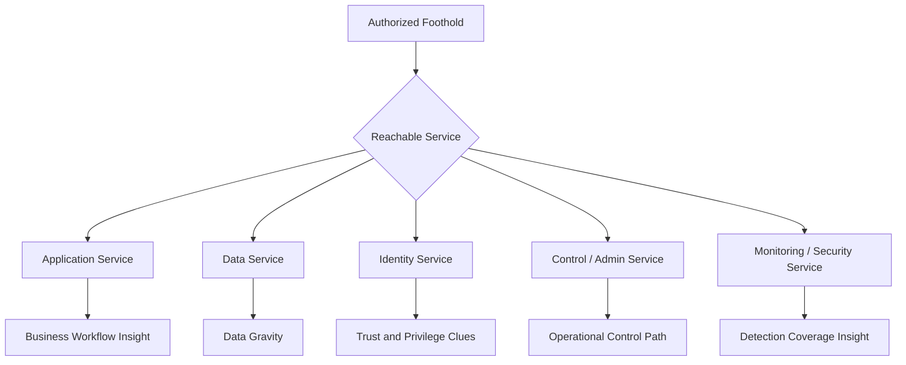
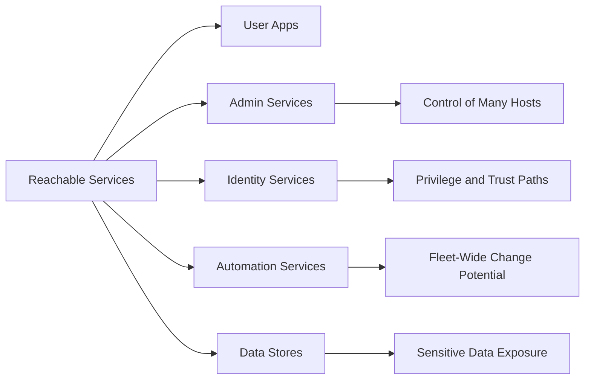
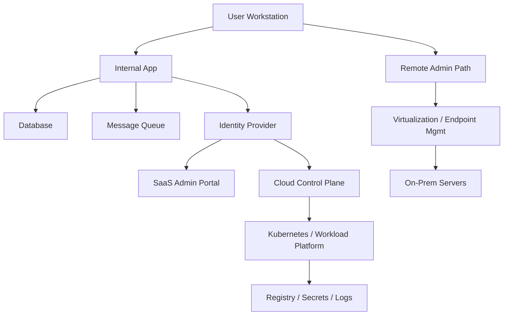

# Service Discovery

> **Phase 10 — Discovery**  
> **Focus:** Identifying reachable services from an authorized foothold, understanding the business role of each service, and determining which ones create realistic paths to privilege, data access, or broader control.  
> **Authorized use only:** This note is for scoped adversary emulation, purple teaming, detection engineering, and architecture review. Stay inside written rules of engagement, prefer low-impact observation, and do not convert discovery into exploitation unless that is separately authorized.

---

**Relevant ATT&CK concepts:** TA0007 Discovery | T1046 Network Service Discovery  
**Important mindset:** MITRE ATT&CK treats service discovery as identifying open services. In mature red team work, the real value is not the port list itself — it is the trust, identity, and operational meaning behind the service.

---

## Table of Contents

1. [Why It Matters](#why-it-matters)
2. [Beginner View](#beginner-view)
3. [Core Mental Model](#core-mental-model)
4. [Authorized Discovery Lifecycle](#authorized-discovery-lifecycle)
5. [High-Value Service Categories](#high-value-service-categories)
6. [How to Judge Service Importance](#how-to-judge-service-importance)
7. [Modern Environment Considerations](#modern-environment-considerations)
8. [Detection Opportunities](#detection-opportunities)
9. [Defensive Controls](#defensive-controls)
10. [Reporting Guidance](#reporting-guidance)
11. [Conceptual Example](#conceptual-example)
12. [Key Takeaways](#key-takeaways)

---

## Why It Matters

Service discovery is the point where a vague internal environment starts becoming a navigable system.

A hostname alone tells you very little. A host running a backup controller, identity sync service, CI/CD runner, cluster management API, or remote administration agent tells you much more:

- who likely authenticates there
- what systems it can influence
- what data it stores or brokers
- whether it bridges trust zones
- whether it could amplify a small foothold into a larger operational problem

In other words, service discovery is not just about **what is listening**. It is about **what matters**.

For defenders, this is equally important. If a user workstation can even see highly sensitive management or infrastructure services, the architecture may already be too permissive.

---

## Beginner View

A **service** is software that provides a function over a network or to other systems. Common examples include:

- web applications and APIs
- SSH, RDP, WinRM, and other remote administration services
- databases and caches
- directory and identity services
- message queues and integration buses
- monitoring, backup, and orchestration platforms

Beginners often think:

> “Open port = interesting.”

That is only partly true.

The better way to think is:

> “A discovered service is interesting when it reveals **capability**, **trust**, **data**, or **control**.”

### A simple progression

| Stage | Beginner Question | Advanced Question |
|---|---|---|
| **Reachability** | Is something listening? | From which zone, identity, or host type is it reachable? |
| **Identification** | What service is it? | What role does it play in the business or admin workflow? |
| **Authentication** | Does it require login? | What identity system, token, certificate, or service account is involved? |
| **Value** | Is it exposed? | Does it manage endpoints, bridge environments, store secrets, or touch sensitive data? |

---

## Core Mental Model

The most useful service discovery question is not:

> “What ports are open?”

It is:

> “Which reachable services change the operator’s understanding of control, trust, and blast radius?”

Think in layers:

1. **Application layer** — websites, APIs, internal portals, business apps
2. **Data layer** — databases, object stores, search clusters, caches
3. **Identity layer** — directories, SSO, certificate services, federation, IAM
4. **Control layer** — remote admin, virtualization, orchestration, deployment, backup
5. **Observation layer** — SIEM, logging, monitoring, EDR management

Some services serve users.  
Some services serve other services.  
Some services serve administrators.  
The last two categories are often the most strategically important.

### Four questions to ask for every discovered service

1. **Who authenticates here?**  
   Users, admins, workloads, service accounts, certificates, or federated identities?

2. **What does it control?**  
   A single host, a cluster, a backup domain, a deployment pipeline, or an entire tenant?

3. **What depends on it?**  
   Applications, scripts, schedulers, cloud workloads, or other management tools?

4. **What happens if it is abused or fails?**  
   User inconvenience, limited system impact, or enterprise-wide consequences?

---

## Authorized Discovery Lifecycle

In authorized adversary emulation, discovery should be deliberate, measurable, and safe.

### 1. Confirm scope and safety guardrails

Before any discovery work, define:

- which segments, tenants, or environments are in scope
- acceptable noise levels
- prohibited systems
- rate or timing constraints
- escalation paths if a sensitive service is exposed unexpectedly

### 2. Gather low-impact evidence first

A mature operator does not start by maximizing traffic volume. Start with sources that reveal service context with minimal disruption:

- existing asset inventories
- naming conventions
- DNS records
- TLS certificate subjects and issuers
- process or agent inventories
- network flow metadata
- service ownership information
- approved management dashboards

### 3. Classify business purpose

A reachable service matters more when you understand whether it supports:

- routine user activity
- centralized administration
- identity or authentication
- automation or deployment
- monitoring or security
- backup, recovery, or business continuity

### 4. Map trust and dependency edges

One service rarely stands alone. The real story is often in the relationships:

- application → database
- workload → secret store
- endpoint → management server
- cluster → container registry
- SaaS platform → identity provider
- backup controller → many servers

### 5. Prioritize by strategic value

A service becomes high priority when it combines two or more of these qualities:

- broad administrative reach
- proximity to identity systems
- access to sensitive data
- ability to deploy, schedule, or automate
- cross-zone or cross-environment trust
- weak segmentation around it

### 6. Report architectural meaning, not just technical detail

A good red team finding does not stop at:

> “Service X was reachable.”

It explains:

> “Service X was reachable from a lower-trust zone, participates in privileged administration, and creates a realistic pathway to broader environment control.”

### Practical evidence checklist

| Record This | Why It Matters |
|---|---|
| **Service name / protocol** | Basic identification is the starting point, not the conclusion. |
| **Where it is reachable from** | Reachability from a user subnet means something different than reachability only from a jump host. |
| **Authentication model** | Local auth, domain auth, SSO, tokens, certificates, and service accounts imply different trust paths. |
| **Business owner and purpose** | Criticality depends on what the service actually does. |
| **Connected systems** | Dependencies reveal pivot opportunities and blast radius. |
| **Administrative capability** | Services that deploy, back up, patch, sync, or orchestrate are usually more strategic. |
| **Expected telemetry** | Good findings include whether defenders should have seen the access. |

---

## High-Value Service Categories

Not all services deserve equal attention. The following categories usually matter most in red team and defensive architecture reviews.

| Category | Why It Matters | Typical Examples | What It Often Reveals | Defensive Priority |
|---|---|---|---|---|
| **Remote administration** | Direct management often means strong control over systems. | SSH, RDP, WinRM, bastions, hypervisor consoles | Admin workflow, privileged origin hosts, tier boundaries | Very high |
| **Identity and trust** | Identity services shape who can authenticate and where. | AD/LDAP, Kerberos, SSO, PKI, federation, IAM bridges | Trust anchors, delegated auth, certificate issuance, sync paths | Very high |
| **Data and state** | Persistent data stores often hold business-critical information. | SQL, NoSQL, object storage gateways, search clusters, caches | Data sensitivity, service account use, backup paths | High |
| **Automation and orchestration** | These services can influence many systems quickly. | CI/CD, patching, MDM, deployment tools, schedulers, backup platforms | Fleet-wide reach, automation identities, rollout paths | Very high |
| **Application integration** | Integration points connect many services and identities. | API gateways, service buses, queues, ESB, webhooks | Token exchange, hidden dependencies, asynchronous trust | High |
| **Platform control planes** | Modern infrastructure is often managed through a few key APIs. | Kubernetes APIs, cloud management layers, registries, IaC pipelines | Cluster reach, workload deployment, secret handling | Very high |
| **Security and observability** | These services show what defenders can or cannot see. | EDR management, SIEM, logging, monitoring, vulnerability management | Detection visibility, blind spots, operational response paths | High |

### Services that often look ordinary but are strategically important

- **Backup services** — often touch many systems and data sets
- **Directory sync and identity bridge services** — connect trust domains
- **Deployment pipelines** — can influence many workloads through automation
- **Virtualization management** — controls large parts of infrastructure from one place
- **Secret stores and key management services** — concentrate high-impact material
- **Monitoring collectors** — reveal what is monitored and where telemetry gaps exist

---

## How to Judge Service Importance

An advanced operator learns to separate:

- **visible services**
- **important services**

Those are not always the same thing.

### A useful prioritization model

| Factor | Low Strategic Value | High Strategic Value |
|---|---|---|
| **Administrative reach** | Affects one host or one small app | Manages many hosts, workloads, or users |
| **Identity adjacency** | Local auth only, isolated use | Integrates with directory, SSO, PKI, or federation |
| **Data gravity** | Minimal or disposable content | Sensitive business data, secrets, backups, audit data |
| **Automation leverage** | Manual operation only | Can deploy, schedule, sync, patch, or restore broadly |
| **Boundary crossing** | Single zone only | Bridges user/server/admin/cloud/SaaS boundaries |
| **Stealth potential** | Rare, unusual traffic | Common operational traffic that can blend in |
| **Detection maturity** | Highly monitored, well baselined | Weak ownership, poor logging, little review |

### Questions that change prioritization fast

- Does this service administer other systems?
- Does it issue or validate identity?
- Does it hold secrets, backups, tokens, or certificates?
- Does it connect on-premises and cloud resources?
- Does it sit in the normal path of business traffic, making misuse harder to spot?
- Would compromise here create operational, financial, or recovery impact?

### Common beginner mistake

Beginners often rank services by “how famous” they are.

For example, an internet-style web server may look more familiar than an internal backup coordinator or configuration management platform. In real environments, the quieter internal management service may be far more consequential.

---

## Modern Environment Considerations

Service discovery in modern enterprises is no longer just about classic server ports. It includes cloud control planes, container platforms, identity brokers, and SaaS administration surfaces.

### On-premises environments

Look for:

- management tiers
- virtualization consoles
- backup and recovery platforms
- software deployment infrastructure
- internal APIs behind reverse proxies
- legacy services that remain reachable for convenience

### Cloud environments

Important questions include:

- which services are exposed through load balancers or gateways
- which services are only reachable internally
- which identities talk to cloud APIs
- where secrets, logs, and object storage are centralized
- whether hybrid links make cloud control paths reachable from on-prem hosts

### Containers and orchestration

In containerized environments, service discovery is often about **logical services** as much as host services:

- cluster APIs
- internal DNS-based service naming
- ingress controllers
- service meshes
- image registries
- secrets and configuration backends

These environments matter because a small number of control-plane services can represent a great deal of downstream influence.

### SaaS and identity-integrated services

SaaS platforms also create service relationships:

- SSO-connected admin portals
- ticketing and workflow systems
- messaging platforms
- endpoint management dashboards
- source control and build systems

An advanced service map often has to include systems that are not “inside the LAN” but are still part of the organization’s operational trust graph.

---

## Detection Opportunities

Service discovery leaves clues when defenders know what “normal” looks like.

| Detection Idea | Why It Matters | High-Confidence Context |
|---|---|---|
| **A workstation begins touching many internal services it never used before** | Suggests exploratory behavior rather than routine workflow | User endpoint suddenly accesses admin, backup, or infra services |
| **A host queries or connects across many service categories in a short period** | Indicates inventory building or trust mapping | Same source reaches identity, data, and management systems |
| **Lower-trust zones reach management services directly** | Often reveals either exposure gaps or adversary interest | Standard user subnet talking to hypervisor, patching, or backup services |
| **Internal service banner or metadata requests from unexpected devices** | Can indicate classification or fingerprinting activity | Kiosk, printer, or VDI pool acting like an admin workstation |
| **Cloud or SaaS admin APIs accessed from unusual origins** | Modern control planes are high-value and often tightly scoped | Source IP, device posture, or role mismatch |
| **Service graph expansion after an endpoint alert** | Discovery usually precedes lateral movement decisions | Post-compromise endpoint starts learning the environment |

### Useful defensive thinking

Good detection does not only ask:

> “Was there a scan?”

It also asks:

> “Did this host start learning about services outside its normal business function?”

That mindset catches quieter, more selective discovery.

---

## Defensive Controls

The best defense is not merely hiding services. It is reducing unnecessary reachability and making important services observable, attributable, and well governed.

| Control | Why It Helps |
|---|---|
| **Strong service inventory** | Defenders need to know which services exist, who owns them, and which zones should reach them. |
| **Segmentation with real enforcement** | Discovery becomes less useful when user endpoints cannot naturally reach admin, identity, and data tiers. |
| **Dedicated management paths** | Sensitive services should be accessible only from hardened admin systems or trusted workflows. |
| **Identity hardening** | MFA, certificate hygiene, scoped service accounts, and tiered administration reduce the value of discovered services. |
| **Telemetry by service role** | Management, identity, backup, and orchestration services should produce richer logs than ordinary application services. |
| **Naming and ownership clarity** | Clear ownership makes strange services and strange access easier to detect and remediate. |
| **Exposure review for modern platforms** | Cloud, Kubernetes, CI/CD, and SaaS admin surfaces need the same governance as traditional servers. |

### Architectural lesson

If a service would be dangerous in the wrong hands, it should not be casually reachable from low-trust locations.

---

## Reporting Guidance

A strong red team note or report section should describe services in terms that help both operators and defenders make decisions.

### Good reporting structure

| Include | Why |
|---|---|
| **What the service is** | Gives technical clarity |
| **Where it was reachable from** | Shows segmentation reality |
| **Why it matters operationally** | Connects the finding to privilege, data, or business risk |
| **Which trust relationships it implies** | Helps defenders understand cascade risk |
| **How mature detection should have looked** | Supports purple-team value |
| **What control would reduce risk** | Turns discovery into architecture improvement |

### Example reporting language

Instead of writing:

> “Several internal services were identified.”

Prefer:

> “Multiple administrative and automation services were reachable from a standard user trust zone, including backup and deployment infrastructure. This indicates weak separation between user and control planes and increases the potential blast radius of any workstation compromise.”

That kind of language is more useful because it explains **security meaning**, not just **technical presence**.

---

## Conceptual Example

Assume an authorized red team starts from a single user workstation in a hybrid enterprise.

The initial service map shows:

- normal business applications
- an internal API tier
- a backup coordination service
- endpoint management infrastructure
- identity federation components
- a cloud-connected workload platform

None of that is exploitation by itself. But it immediately changes the picture of the environment:

- the backup service suggests broad infrastructure touch points
- endpoint management suggests fleet-wide administrative pathways
- identity federation suggests cross-environment trust
- the workload platform suggests automation and secret distribution paths

The key finding is architectural:

> A compromise that begins in a user context may be only a few trust relationships away from services that influence the wider enterprise.

For defenders, that insight drives segmentation review, identity hardening, logging improvements, and better control-plane isolation.

---

## Key Takeaways

- Service discovery is not just a list of open ports; it is a map of capability, trust, and control.
- The most important services are often internal management, identity, automation, backup, and platform-control services.
- Mature discovery work emphasizes **business role**, **dependencies**, and **blast radius**, not just protocol names.
- In authorized adversary emulation, low-impact observation and careful classification are more valuable than noisy enumeration.
- Good defensive design makes critical services hard to reach, easy to monitor, and clearly owned.
