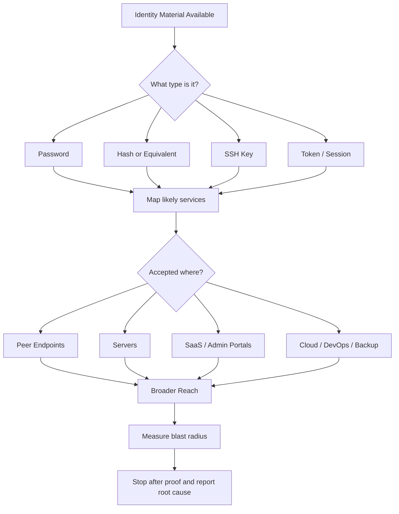
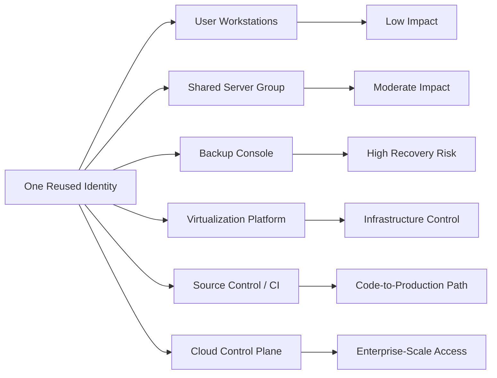
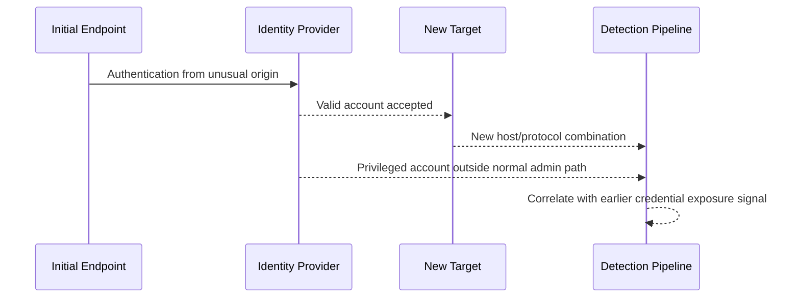

# Credential Reuse Attacks

> **Phase 11 — Lateral Movement**  
> **Focus:** How authorized operators safely validate whether passwords, hashes, keys, tokens, or sessions obtained in one place are accepted somewhere else.  
> **Safety note:** This note is educational and defensive in purpose. It explains concepts, trust relationships, and detection ideas without providing step-by-step intrusion instructions.  
> **Authorized emulation note:** In real engagements, only test identities and systems explicitly covered by the rules of engagement, use the least-disruptive proof possible, and stop once the risk is demonstrated.

---

**Relevant ATT&CK concepts:** TA0008 Lateral Movement | T1078 Valid Accounts | T1550 Use Alternate Authentication Material | T1021 Remote Services

---

## Table of Contents

1. [Why It Matters](#why-it-matters)
2. [Beginner View](#beginner-view)
3. [What Counts as Credential Reuse?](#what-counts-as-credential-reuse)
4. [Why Reuse Succeeds](#why-reuse-succeeds)
5. [How It Works](#how-it-works)
6. [Common Patterns](#common-patterns)
7. [Credential Reuse vs Related Techniques](#credential-reuse-vs-related-techniques)
8. [Diagram 1: Reuse-to-Movement Flow](#diagram-1-reuse-to-movement-flow)
9. [Diagram 2: Credential Blast Radius](#diagram-2-credential-blast-radius)
10. [Diagram 3: Defender Correlation View](#diagram-3-defender-correlation-view)
11. [Detection Opportunities](#detection-opportunities)
12. [Defensive Controls](#defensive-controls)
13. [Safe Red-Team Validation Workflow](#safe-red-team-validation-workflow)
14. [Reporting Guidance](#reporting-guidance)
15. [Conceptual Example](#conceptual-example)
16. [Public References](#public-references)
17. [Key Takeaways](#key-takeaways)

---

## Why It Matters

Credential reuse is one of the most realistic ways a small foothold becomes a larger incident. An attacker does not need a new exploit if the environment already allows the same identity material to open multiple doors.

That is why credential reuse appears repeatedly in real-world reporting. MITRE ATT&CK's **Valid Accounts (T1078)** examples show adversaries using legitimate credentials for remote access, persistence, privilege escalation, and lateral movement across many campaigns. In practice, reuse is often less about "breaking in" and more about **discovering that trust is too broad**.

For defenders, this is important because successful reuse often looks like normal authentication. The protocol, account, and login flow may all be legitimate. The real problem is **where** the identity appears, **what** it is allowed to reach, and **how much blast radius** comes from one secret.

## Beginner View

Think of credential reuse like a building badge that was meant for one room but also opens the server room, the backup office, and the roof door.

At a beginner level, credential reuse means:

- a password that works on more than one system
- the same local administrator secret on many endpoints
- one service account controlling many servers
- one SSH key trusted by many hosts
- one browser or API token accepted across multiple apps or tenants

At an intermediate level, the key idea is that **reuse is about acceptance**, not just identical passwords. A reusable secret might be:

- a plaintext password
- a password hash that some protocols accept indirectly
- an SSH private key
- a Personal Access Token (PAT)
- an OAuth refresh token or app token
- a session cookie
- a long-lived cloud access token

At an advanced level, credential reuse becomes a **trust-architecture problem**:

- one identity spans too many systems
- one admin tier can log into lower-trust devices
- one automation secret is embedded across multiple pipelines
- one external support account bridges multiple customers or environments
- one management plane can operate at enterprise scale once authenticated

In other words, advanced operators do not just ask, "Does this password work somewhere else?" They ask, **"What trust relationships become reachable if this identity is accepted here?"**

## What Counts as Credential Reuse?

| Material | Typical Example | Accepted By | Why It Matters |
|---|---|---|---|
| **Password** | Help-desk or maintenance credential | VPN, RDP, SaaS, internal portals | Same user secret can open many services |
| **Local admin secret** | Shared workstation admin password | Peer endpoints, server admin paths | One host compromise can scale laterally |
| **Password hash / equivalent auth material** | NTLM-style reusable material | Legacy Windows auth paths | Plaintext may not be needed if the protocol accepts an equivalent secret |
| **SSH key** | Shared admin private key | Linux fleets, network gear, Git access | One key may cross many hosts and roles |
| **API / app token** | PAT, CI token, service token | Repos, build systems, deployment APIs | Can unlock code, secrets, and production paths |
| **Web session or cookie** | Existing authenticated browser session | Admin consoles, SaaS platforms | Session reuse can bypass password prompts |
| **Cloud credential** | Access key, role session, refresh token | Control plane APIs, storage, compute | Reuse can jump from one workload to many resources |

> **Important:** The question is not only whether the same secret exists in multiple places. The bigger question is whether one compromised identity can be **presented repeatedly** to different trust boundaries.

## Why Reuse Succeeds

Credential reuse usually succeeds because of design shortcuts, operational convenience, or legacy compatibility.

### Common root causes

| Root Cause | What It Looks Like | Why It Creates Lateral Movement |
|---|---|---|
| **Shared secrets** | Same local admin password or same service credential on many assets | One compromise becomes many authentications |
| **Over-broad privileges** | One account administers workstations, servers, backup systems, and SaaS | Each successful login increases reach sharply |
| **Legacy authentication** | Old protocols or fallback auth remain enabled | Reusable material stays valuable longer |
| **Weak identity tiering** | Privileged admins sign in to ordinary user endpoints | High-value credentials appear on low-trust devices |
| **Token sprawl** | Long-lived PATs, OAuth refresh tokens, automation tokens | Non-human identities become movement pathways |
| **Flat management planes** | RMM, virtualization, CI/CD, backup, or orchestration tools are broadly reachable | One console account may operate at scale |
| **Poor rotation hygiene** | Password changes are infrequent or predictable | Exposure remains useful for too long |

### A simple mental model

Reuse becomes dangerous when these three conditions exist together:

1. **Portable identity material** — something can be replayed or reused
2. **Broad acceptance surface** — many systems accept it
3. **Valuable next hop** — the next system increases privilege, reach, or business impact

If all three are true, credential reuse is often the fastest path forward.

## How It Works

### 1. Start with already-obtained identity material

In a real adversary intrusion, that material may come from prior access, poor storage, phishing, memory exposure, misconfiguration, or token theft. In an authorized emulation, the important point is simply that the operator now has some form of authentication material and wants to understand its blast radius safely.

### 2. Classify the material before testing it

A password, SSH key, API token, browser session, and cloud role credential do not behave the same way. Each maps to different protocols, logs, expiry models, and detection opportunities.

### 3. Map the likely acceptance surface

This is the most important thinking step. Ask:

- Which services would realistically accept this identity?
- Is it human, local admin, service, workload, or vendor-managed?
- Is the identity tied to one host, one team, one platform, or the whole enterprise?
- Would successful reuse create access to peers, servers, management systems, or control planes?

### 4. Validate with the least-disruptive proof possible

Mature red-team work does not turn every valid credential into a noisy campaign. The goal is to prove a trust path, not to maximize logins. Often the best finding is a **single, well-chosen validation** that demonstrates shared trust without causing lockouts, user disruption, or unnecessary spread.

### 5. Measure blast radius, not just login success

A credential accepted by one extra workstation matters. A credential accepted by backup servers, virtualization managers, deployment systems, or cloud administration paths matters much more.

### 6. Stop after proving the story

The value of the finding comes from the risk narrative:

- what identity material was reusable
- where it was accepted
- what that acceptance exposed
- what architectural weakness caused it
- how defenders should reduce the blast radius

That story is usually more useful than a long chain of extra pivots.

## Common Patterns

| Pattern | What It Means | Why It Is Dangerous | High-Value Defensive Fix |
|---|---|---|---|
| **Shared local administrator passwords** | Many endpoints use the same local admin secret | One endpoint compromise can unlock peer systems | Use Windows LAPS or equivalent unique local admin rotation |
| **Service account reuse** | One automation or maintenance account works across many servers | Non-human accounts often run continuously and quietly | Redesign service identities and reduce scope |
| **Admin password reuse across tiers** | An admin identity is valid on workstations and high-value infrastructure | Low-trust devices become stepping stones to sensitive systems | Use admin tiering and dedicated privileged workstations |
| **SSH key reuse** | The same key is trusted by many Linux hosts, network devices, or Git services | One key can cross environments quickly | Use per-role or per-host keying with rotation |
| **Token reuse in DevOps** | PATs or CI tokens work across repos, pipelines, registries, or deployments | Source control exposure can become production exposure | Use short-lived tokens and workload identity |
| **Cloud credential reuse** | The same credential or refresh path reaches multiple subscriptions/accounts | One foothold may expand into large control-plane access | Use JIT/JEA-style access, conditional access, and segmentation |
| **Shared vendor or MSP access** | External support identities are reused across tenants or environments | A third-party compromise can bridge organizations | Separate customer access and require strong controls per tenant |
| **Session reuse** | Existing authenticated sessions remain valid across sensitive portals | Password changes may not immediately remove access | Bind sessions to device, risk, and re-auth controls |

## Credential Reuse vs Related Techniques

These terms are often mixed together, but they are not identical.

| Technique | Core Idea | Typical Starting Point | Main Risk |
|---|---|---|---|
| **Credential reuse** | Material already obtained is accepted somewhere else | Known password, token, key, or session | Trust spreads farther than intended |
| **Credential stuffing** | Credentials from one service are tried on another service | External breach data | Users reuse passwords across sites |
| **Password spraying** | One or a few candidate passwords are tried across many accounts | Guessing common passwords | Weak password hygiene and lockout gaps |
| **Pass-the-Hash** | Equivalent authentication material is reused instead of plaintext | Recovered hash material | Protocol accepts alternate auth material |
| **Session hijacking / cookie reuse** | Existing session state is reused instead of logging in again | Captured session artifacts | Session controls are weaker than password controls |

A practical way to remember it:

- **Reuse** asks: "Where else does what I already have work?"
- **Spraying** asks: "Can one likely password open many accounts?"
- **Stuffing** asks: "Do old breached credentials work here too?"
- **PtH / token reuse** asks: "Do I even need the original password?"

## Diagram 1: Reuse-to-Movement Flow



## Diagram 2: Credential Blast Radius



### Reading the diagram

The same credential is not equally dangerous everywhere. Reuse risk grows as the identity reaches:

- more assets
- more privileged systems
- more centralized platforms
- more business-critical recovery or deployment functions

That is why defenders should rank findings by **blast radius**, not by login count alone.

## Diagram 3: Defender Correlation View



### Why this matters for defenders

Individual events may look normal:

- successful login
- expected protocol
- valid account
- no malware signature

The detection value often comes from the **sequence**:

1. a credential becomes exposed or appears on a low-trust asset
2. the same identity suddenly authenticates to new systems
3. the next systems are more privileged than the first

That is the signature of credential reuse as lateral movement.

## Detection Opportunities

### Identity and authentication telemetry

- Alert when an account suddenly appears on **new hosts, new protocols, or new administration surfaces**.
- Track **first-time-seen** authentications for privileged, service, and automation accounts.
- Compare the source device of an authentication with the account's **approved origin**. An admin account used from a normal workstation should stand out.
- Watch for one identity touching multiple tiers in a short period: workstation, server, hypervisor, backup, SaaS, cloud.

### Endpoint and server telemetry

- Review where privileged sessions land. The presence of powerful credentials on user endpoints is often the earlier problem.
- Monitor for remote administration from non-jump-host systems.
- Flag management activity that occurs through valid tools but from unusual devices, users, or schedules.

### SaaS, cloud, and DevOps telemetry

- Track token use across repositories, build systems, artifact stores, deployment pipelines, and cloud consoles.
- Alert when the same token or service principal is used from new IP ranges, unusual devices, or unrelated workflows.
- Monitor refresh-token and session reuse after risky sign-in events, password resets, or role changes.

### Questions analysts should ask

| Question | Why It Helps |
|---|---|
| **Has this identity authenticated here before?** | Reuse often appears as first-time-seen access |
| **Is the source device expected for this account?** | Origin mismatch is often the clearest signal |
| **Did the identity move up a trust tier?** | Workstation to backup or virtualization is especially important |
| **Is this a human account acting like automation, or the reverse?** | Mixed usage often reveals shared secrets or poor account design |
| **Would this one credential affect recovery, identity, or deployment systems?** | Those are high-priority response cases |

## Defensive Controls

| Control | Why It Helps |
|---|---|
| **Unique secrets per system where practical** | Eliminates the scale advantage of one credential opening many assets |
| **Windows LAPS or equivalent local admin rotation** | Microsoft specifically positions LAPS to reduce lateral-traversal and pass-the-hash risk from shared local admin passwords |
| **Admin tiering and privileged access workstations** | Keeps privileged identities off ordinary endpoints and limits where admin accounts can sign in |
| **MFA and phishing-resistant authentication** | Reduces the value of stolen passwords for many remote services |
| **Short-lived tokens and workload identity** | Limits token reuse in cloud and DevOps ecosystems |
| **PAM / JIT access** | Privilege exists only when needed, which reduces reusable standing access |
| **Session risk controls and re-authentication** | Makes stolen sessions and cookies less portable |
| **Origin restrictions and jump hosts** | A valid credential from the wrong device should not reach sensitive services |
| **Service account redesign** | Split broad automation identities into smaller, purpose-bound accounts |
| **Continuous credential exposure review** | Find blast-radius hotspots before attackers do |

### Practical defensive priorities

If a team cannot fix everything at once, the highest-value sequence is usually:

1. remove shared local administrator passwords
2. protect privileged identities with dedicated admin paths
3. shorten token and service credential lifetime
4. enforce stronger controls on backup, virtualization, directory, and deployment systems
5. detect first-time-seen use of privileged identities from unexpected origins

## Safe Red-Team Validation Workflow

This workflow keeps the exercise realistic without becoming unnecessarily disruptive.

### 1. Confirm the rules first

Before validating anything, know:

- which systems are in scope
- which identity classes are approved for testing
- account lockout thresholds
- business-hour restrictions
- stop conditions for user impact or operational risk

### 2. Prioritize by business value, not volume

Do not prove reuse everywhere. Prove it where it matters most:

- backup and recovery platforms
- virtualization or orchestration systems
- directory and identity systems
- DevOps and deployment pipelines
- systems that bridge network segments or trust tiers

### 3. Use the smallest proof that answers the question

A mature operator does not need to create broad sessions or touch sensitive data to prove risk. The goal is to answer:

- Is the identity accepted?
- What privilege level does it create?
- What high-value systems become reachable?
- What architectural weakness explains this?

### 4. Avoid creating artificial blast radius

Do not turn a valid finding into extra noise by validating every possible host. One well-chosen proof on a representative system is often enough.

### 5. Capture evidence that helps remediation

Useful evidence includes:

- identity type and intended purpose
- system or platform where it was accepted
- trust tier crossed
- business function exposed
- likely root cause such as shared secrets, over-broad scope, or poor tiering

## Reporting Guidance

A strong finding should explain more than "credential worked in two places."

### Good report structure

| Element | What to Include |
|---|---|
| **Finding statement** | One identity was accepted beyond its intended scope |
| **Impact** | What additional systems, privileges, or business functions became reachable |
| **Root cause** | Shared secret, over-broad role, token sprawl, weak admin tiering, legacy auth |
| **Evidence** | Minimal proof of acceptance and resulting access level |
| **Detection gap** | Whether security tooling noticed the new origin, new protocol, or new tier |
| **Remediation** | How to reduce blast radius, rotate secrets, and redesign trust |

### Questions that make reports better

- Was the issue a **secret reuse** problem, a **scope** problem, or both?
- Did the credential cross from a lower-trust zone into a higher-trust one?
- Would password rotation alone fix the problem, or does the identity model need redesign?
- Would the same weakness let a real adversary reach backup, deployment, identity, or cloud control planes?

## Conceptual Example

An authorized red-team exercise begins with access on one employee workstation. During prior approved assessment activity, the team identifies a maintenance identity used by IT operations. The team validates, within scope and under lockout guardrails, that the same identity is accepted by:

- several peer workstations
- a server management jump point
- a backup administration portal

The most important lesson is not that the password was reused. The important lesson is that **one operational identity crossed three trust layers**:

```text
User Endpoint -> IT Maintenance Access -> Backup Administration
```

That makes the finding strategically important because backup platforms affect recovery, ransomware resilience, and enterprise response capability.

## Public References

- **MITRE ATT&CK — T1078 Valid Accounts:** real-world examples of adversaries using legitimate credentials for access and movement
- **Microsoft Windows LAPS overview:** why unique, rotated local admin passwords reduce lateral-traversal risk
- **Microsoft privileged access workstation guidance:** why privileged identities should use dedicated admin devices and tighter access paths

## Key Takeaways

- Credential reuse is often the most realistic lateral movement path because the environment authenticates the attacker successfully.
- Reuse is not limited to passwords; hashes, keys, tokens, cookies, and cloud credentials can all play the same role.
- The real danger is **blast radius**: where else the same identity is accepted and what trust tier it reaches next.
- The best red-team validation proves the trust failure with minimal disruption.
- The best defenses shrink acceptance scope, isolate privileged identities, rotate secrets, and detect when valid accounts appear in the wrong place.
