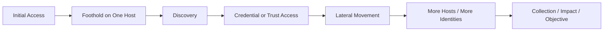
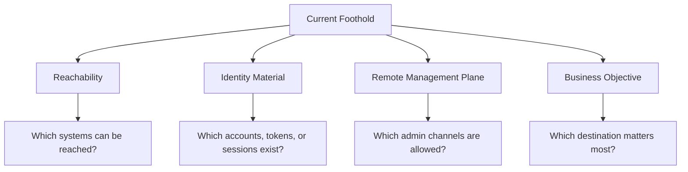
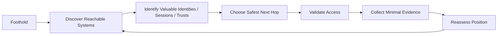
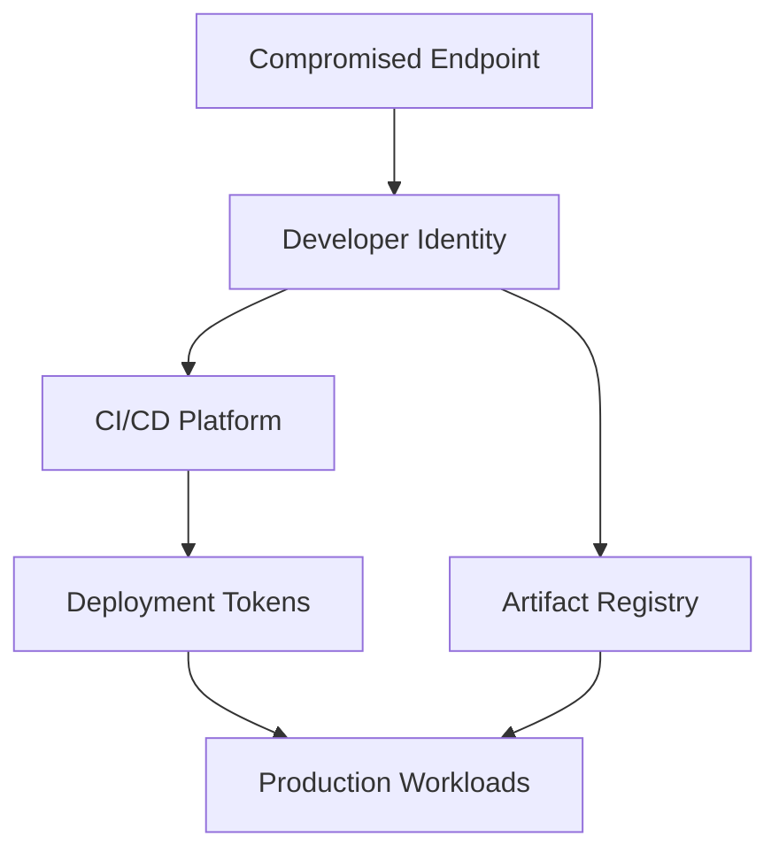
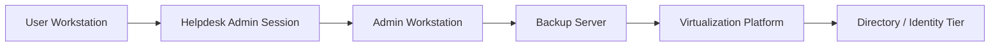
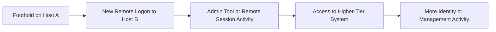

# Lateral Movement Overview

> **Difficulty:** Beginner → Advanced | **Category:** Red Teaming  
> **Authorized use only:** This note is for approved adversary emulation, purple teaming, and defensive architecture review.  
> **Safety note:** It explains decision-making, attack-path logic, and detection opportunities without giving step-by-step intrusion instructions, exploit recipes, or execution playbooks.

---

**Relevant ATT&CK concepts:** **TA0008 Lateral Movement** | **T1021 Remote Services** | **T1210 Exploitation of Remote Services** | **T1550 Use Alternate Authentication Material** | **T1072 Software Deployment Tools**

---

## Table of Contents

1. [What Is Lateral Movement?](#1-what-is-lateral-movement)
2. [Why It Matters in Red Teaming](#2-why-it-matters-in-red-teaming)
3. [Safety Boundaries for Authorized Emulation](#3-safety-boundaries-for-authorized-emulation)
4. [Beginner Mental Model](#4-beginner-mental-model)
5. [Lateral Movement vs Privilege Escalation vs Pivoting](#5-lateral-movement-vs-privilege-escalation-vs-pivoting)
6. [The Core Decision Loop](#6-the-core-decision-loop)
7. [Major Lateral Movement Families](#7-major-lateral-movement-families)
8. [Environment-Specific Patterns](#8-environment-specific-patterns)
9. [Building and Scoring a Lateral Movement Path](#9-building-and-scoring-a-lateral-movement-path)
10. [Detection Opportunities](#10-detection-opportunities)
11. [Defensive Design Principles](#11-defensive-design-principles)
12. [Safe Adversary-Emulation Workflow](#12-safe-adversary-emulation-workflow)
13. [Worked Conceptual Scenarios](#13-worked-conceptual-scenarios)
14. [How to Report Lateral Movement Risk](#14-how-to-report-lateral-movement-risk)
15. [Key Takeaways](#15-key-takeaways)
16. [References](#16-references)

---

## 1. What Is Lateral Movement?

**Lateral movement** is the process of moving from one system, identity, or management plane to another after an initial foothold has already been established.

In simple language:

- **Initial access** gets you into the environment
- **Privilege escalation** gives you more power on the current system
- **Lateral movement** gets you to additional systems or accounts
- **Collection/exfiltration/impact** are the later outcomes you may be trying to reach

A useful beginner analogy is a building:

- Initial access gets you through the front door
- Privilege escalation gets you a master key
- Lateral movement lets you walk into other rooms, offices, and control panels

That is why lateral movement is so important: it turns a **local problem** into an **environment-wide problem**.



### Plain-English Definition

An operator performing lateral movement is asking:

> "Given what I already control, what other system, account, service, or control plane can I safely and realistically reach next?"

That next hop might be:

- another workstation
- a server
- an admin workstation
- a hypervisor or virtualization platform
- a software deployment platform
- a cloud tenant or cloud VM management plane
- a SaaS admin console tied to enterprise identity

In mature intrusions, the most valuable hop is often **not** "the next random host." It is the next **trust boundary**.

---

## 2. Why It Matters in Red Teaming

In authorized adversary emulation, lateral movement is where a campaign starts to look realistic.

A red team rarely proves meaningful risk by saying only:

- "we got code execution on one laptop"

The more useful question is:

- "what business-critical systems became reachable because of that foothold?"

### Why defenders care

| Perspective | Why Lateral Movement Matters |
|---|---|
| **Red Team** | Demonstrates realistic blast radius and attack-path depth |
| **Blue Team** | Provides high-value detection opportunities before objective completion |
| **Purple Team** | Helps validate whether identity, endpoint, and network telemetry correlate correctly |
| **Leadership** | Translates a technical foothold into business impact |
| **Incident Response** | Helps scope how far compromise may have spread |

### What it often reveals

Lateral movement findings usually expose deeper architectural weaknesses such as:

- shared administrative credentials
- poor tier separation
- excessive remote administration exposure
- weak identity hygiene
- unmanaged trust relationships
- overpowered software deployment tooling
- cloud-to-on-prem or on-prem-to-cloud identity bridges

A strong lateral movement assessment does **not** just show that movement is possible. It explains **why the path existed**.

---

## 3. Safety Boundaries for Authorized Emulation

Because lateral movement touches many systems and identities, it can be one of the riskiest phases of a red team engagement if poorly controlled.

### Minimum guardrails

Before emulating lateral movement, define:

1. **Written authorization** — exactly which networks, systems, identities, and techniques are in scope
2. **Prohibited targets** — domain controllers, safety systems, OT, production databases, executive devices, or regulated systems if excluded
3. **Account lockout protections** — avoid tests that can mass-lock accounts or disrupt identity services
4. **Rate and volume limits** — keep east-west activity bounded and measurable
5. **Stop conditions** — clear criteria for halting if instability or unsafe access is observed
6. **Evidence thresholds** — decide what level of proof is enough so the team does not take unnecessary action

### Proof over impact

A mature red team asks:

> "What is the least intrusive action that still proves the path exists?"

That usually means preferring:

- validating access rather than using it aggressively
- demonstrating path reachability rather than maximizing spread
- collecting high-quality evidence rather than causing visible operational effects

### Important rule

If the objective can be proven with:

- access confirmation
- a path diagram
- controlled screenshots
- log correlation
- a small number of safe validation events

then stop there.

That is good emulation. Reckless expansion is not.

---

## 4. Beginner Mental Model

Beginners often think lateral movement is only about "remote shell to another box." That is too narrow.

Lateral movement depends on four things:



### The four questions

| Question | What it means |
|---|---|
| **What can I reach?** | Network paths, segmentation, routing, firewall policy, cloud control plane visibility |
| **Who can I be?** | Accounts, tokens, tickets, sessions, delegated roles, application identities |
| **How can I access it?** | Remote services, management tools, orchestration platforms, trust relationships |
| **Why move there?** | To reach a crown jewel, shorten the path, gain stability, or widen access |

### Crown jewels and stepping stones

Not every host is equally valuable.

A practical model is:

- **Stepping stone:** helps you move farther
- **Amplifier:** increases your privileges, trust, or reach
- **Crown jewel:** gives direct business impact or major control

Examples:

| Type | Example |
|---|---|
| **Stepping stone** | User workstation on the right subnet |
| **Amplifier** | Admin workstation, jump server, management server, virtualization console |
| **Crown jewel** | Directory services, backup platform, PKI, CI/CD, identity provider, sensitive database |

Advanced operators spend less time asking "what can I compromise?" and more time asking "what is the shortest trustworthy path to the control plane that matters?"

---

## 5. Lateral Movement vs Privilege Escalation vs Pivoting

These terms are related but not identical.

| Concept | Main Question | Example Outcome |
|---|---|---|
| **Privilege Escalation** | How do I gain more privilege on this system? | User → local admin / root / SYSTEM |
| **Lateral Movement** | How do I reach another system, identity, or platform? | Workstation → file server |
| **Pivoting** | How do I route traffic through a compromised system to reach otherwise inaccessible networks? | DMZ host → internal subnet visibility |
| **Discovery** | What exists and what relationships connect it? | Admin sessions, trusts, reachable services |

### Why people confuse them

They frequently chain together:

```text
Foothold -> Local Privilege Escalation -> Credential/Token Access -> Lateral Movement -> Pivoting -> More Discovery -> Objective
```

But from an analytical point of view, they solve different problems.

- **Privilege escalation** solves a **power** problem
- **Pivoting** solves a **reachability** problem
- **Lateral movement** solves a **path** problem

---

## 6. The Core Decision Loop

Once an operator has a foothold, lateral movement becomes a repeating cycle.



### What a strong operator evaluates at each hop

| Factor | Why it matters | Typical questions |
|---|---|---|
| **Value** | Some systems unlock far more control than others | Does this host lead to identity, backup, virtualization, or deployment infrastructure? |
| **Reachability** | A perfect target is useless if you cannot talk to it | Is there a path from here to there? |
| **Identity fit** | Movement usually succeeds through existing trust | Does the current identity already have access? |
| **Noise** | Some methods are much more observable | Will this create unusual admin traffic, services, or login patterns? |
| **Safety** | Red teams must protect production stability | Could this destabilize an endpoint, lock accounts, or trigger failover? |
| **Evidence quality** | You need enough proof for reporting | What minimal evidence demonstrates the path clearly? |

### The advanced mindset

Advanced lateral movement is usually:

- more selective
- more identity-driven
- more trust-aware
- more management-plane focused
- less noisy than broad host-by-host expansion

In other words, the operator is not "wandering the network." They are navigating a **graph of trust**.

---

## 7. Major Lateral Movement Families

MITRE ATT&CK describes lateral movement as a tactic that includes several different technique families. The important lesson is that movement is not one trick; it is a category of paths.

### 7.1 Technique family overview

| Family | Plain-English Idea | Common Examples | Why It Works | Defender Lens |
|---|---|---|---|---|
| **Remote Services** | Using legitimate remote access channels | RDP, SSH, SMB admin shares, WinRM, VNC | The environment already trusts remote admin protocols | Look for normal protocols from abnormal sources |
| **Alternate Authentication Material** | Reusing non-password auth artifacts | Hashes, tickets, tokens, session cookies | Systems cache or honor previously issued credentials | Watch identity reuse across unusual systems and times |
| **Remote Service Exploitation** | Leveraging a vulnerability on an internal service | Unpatched SMB, RDP, database, web admin service | Internal systems are often less hardened than internet-facing ones | Track internal exploitation telemetry and patch state |
| **Software Deployment / Management Planes** | Abusing tools built to administer many systems | SCCM, Intune, vCenter, RMM, Ansible, cloud instance managers | Management tooling is designed for broad remote control | Treat admin planes as crown jewels |
| **Session Hijacking / Session Piggybacking** | Taking over a session that already exists | RDP/SSH/session reuse, token or browser session abuse | Real users already opened the door | Monitor session transitions and impersonation patterns |
| **Trust and Delegation Abuse** | Using permissions, sync, delegation, or inherited trust | Helpdesk rights, delegated OU control, app role assignment | Permissions are often broader than intended | Audit graph relationships, not just local admins |
| **Cloud / Hybrid Identity Movement** | Moving through federated identity or cloud control planes | Cloud VM access, tenant roles, synced identities | One identity can bridge many environments | Correlate on-prem and cloud identity events |
| **Shared Content / Internal Influence** | Using shared spaces or internal trust to spread access | Internal spearphishing, repo/package trust, shared drives | Internal users trust internal content | Watch origin context, not just message content |

### 7.2 Key insight

The most dangerous movement paths often use **legitimate administrative design** rather than obviously malicious malware behavior.

That is why lateral movement is so hard to detect:

- protocol may be normal
- user may be legitimate
- destination may be a normal admin target
- action may look like maintenance

The real anomaly is usually the **context**:

- wrong source host
- wrong time
- wrong user-device pairing
- wrong sequence
- wrong tier boundary

---

## 8. Environment-Specific Patterns

Lateral movement looks different depending on the environment.

### 8.1 Windows and Active Directory environments

Windows enterprise environments are rich in:

- shared identity
- cached logons
- remote administration protocols
- delegated administration
- management tooling

High-value destinations often include:

- admin workstations
- jump servers
- backup servers
- SCCM / ConfigMgr / Intune administration
- virtualization platforms
- certificate services
- domain controllers

| Area | Common Trust Edge | Why It Matters |
|---|---|---|
| **User workstation** | Admin session reuse, local admin rights, mapped shares | Good starting point but usually not the end goal |
| **Admin workstation** | Access to many server tiers | Often a major amplifier node |
| **Backup platform** | Broad read/write reach across servers | Powerful for impact and persistence concerns |
| **Directory services** | Authentication authority | Often the highest-value identity target |
| **Management server** | Broad remote execution/control | Can scale compromise quickly if abused |

### 8.2 Linux and Unix-heavy environments

In Linux-centric environments, movement often revolves around:

- SSH trust
- key reuse
- orchestration platforms
- automation accounts
- shared secrets in configs, scripts, or CI systems

High-value paths may go through:

- bastion hosts
- deployment pipelines
- config management servers
- container orchestration control planes
- secrets stores

### 8.3 Cloud and hybrid environments

Cloud changes lateral movement in an important way:

> Movement may happen through **control planes and identities**, not only host-to-host network hops.

Examples of high-level cloud movement paths include:

- synced enterprise identity reaching cloud administration
- cloud admin role reaching virtual machines or secrets
- workload identity reaching storage, databases, or serverless services
- remote management services reaching many instances without traditional east-west traffic

| Cloud / Hybrid Pattern | What It Means |
|---|---|
| **Identity federation path** | On-prem compromise influences cloud access |
| **Tenant admin path** | One privileged cloud role reaches many assets |
| **Instance management path** | Cloud-native admin tooling becomes the movement mechanism |
| **SaaS admin path** | Identity provider trust extends reach into business platforms |

### 8.4 DevOps and platform engineering environments

Modern enterprises often centralize power in delivery systems.

Potential amplifier nodes include:

- CI/CD platforms
- artifact registries
- infrastructure-as-code pipelines
- remote monitoring and management platforms
- source control with deployment tokens

These are sometimes more valuable than a traditional server because they can influence **many systems at once**.



---

## 9. Building and Scoring a Lateral Movement Path

A **lateral movement path** is the sequence of trust relationships, access methods, and reachable systems that connect an initial foothold to a meaningful objective.

### Think in graph form



Each arrow is not just a network connection. It represents some combination of:

- network reachability
- identity permission
- remote management exposure
- delegated trust
- session presence
- operational opportunity

### Path scoring model

A practical way to evaluate a path is to score each hop.

| Criterion | Low Score | High Score |
|---|---|---|
| **Business value** | Low-importance endpoint | Identity, backup, PKI, virtualization, payment, or production control system |
| **Access confidence** | Weak or speculative path | Strong observed trust or documented access |
| **Detection risk** | Loud or unusual activity | Activity that blends with expected admin behavior |
| **Safety** | High risk of disruption | Low-impact validation path |
| **Expansion potential** | Dead end | Opens multiple downstream trust paths |

### Why this matters for red teaming

A good red team does not need to touch every host.

Instead, it should identify:

1. the **most realistic path**
2. the **lowest-risk proof point**
3. the **highest-value architectural weakness**

That is more defensible, safer, and more useful in reporting.

### Example of a strong finding

A strong lateral movement finding is not:

- "we moved to three more machines"

A strong finding is:

- "a user workstation compromise exposed an admin session path that provided reach into backup infrastructure, which in turn had trusted access to virtualization management and identity systems"

That explains **risk propagation**, not just host count.

---

## 10. Detection Opportunities

Lateral movement is one of the best places for defenders to win because it creates **relationships** that can be observed across systems.

### The main idea

Single events are often inconclusive.

The real signal comes from **correlation**:

- identity event + endpoint event + network event + timing



### High-value telemetry categories

| Telemetry Source | What to look for |
|---|---|
| **Identity logs** | Logons from unusual source hosts, impossible admin paths, new role use, ticket/token anomalies |
| **Endpoint telemetry** | Remote session creation, service creation, child-process chains from admin tools, unusual session ownership |
| **Network telemetry** | New east-west connections, remote management protocols from unexpected systems, cross-segment admin traffic |
| **Cloud audit logs** | Unusual role assumption, VM management actions, cross-environment identity use |
| **Management platforms** | Script pushes, software deployment jobs, console access outside change windows |

### Especially suspicious patterns

| Pattern | Why it matters |
|---|---|
| **Low-tier host administering high-tier host** | Violates tiering expectations |
| **User workstation initiating server admin protocols** | Often a path discovery or movement indicator |
| **Identity used from a new source host** | Strong signal of credential or session misuse |
| **Rapid multi-hop movement** | Suggests path expansion rather than normal support activity |
| **Helpdesk / deployment / backup tool misuse** | These tools are designed for scale, so abuse has high blast radius |
| **Cloud role usage immediately after on-prem activity** | Can indicate hybrid identity traversal |

### Detection mindset

The question is usually not:

- "Is RDP malicious?"

The question is:

- "Why is this identity using this protocol from this device to this tier at this time in this sequence?"

That is the right analytical frame.

---

## 11. Defensive Design Principles

The best defense against lateral movement is not a single product. It is an architecture that makes movement both **harder** and **louder**.

### Core principles

| Control | Why it helps |
|---|---|
| **Administrative tiering** | Prevents lower-trust systems from directly managing higher-trust systems |
| **Separate admin identities** | Reduces reuse of powerful credentials on ordinary endpoints |
| **Privileged access workstations** | Keeps admin activity off user workstations |
| **MFA and phishing-resistant auth** | Makes credential theft less useful for remote access paths |
| **JIT / JEA / PAM** | Shrinks standing privilege and limits long-lived access |
| **Local admin password randomization** | Reduces credential reuse across systems |
| **Network segmentation** | Forces attackers to cross monitored boundaries |
| **Remote admin restriction** | Limits RDP/SSH/WinRM/SMB exposure to only approved sources |
| **Session isolation** | Prevents privileged sessions from appearing on lower-tier devices |
| **Protect management planes** | Backup, deployment, virtualization, and identity systems should be treated as crown jewels |

### Modern reality

Many enterprises focus on servers and domain controllers, but attackers frequently prefer:

- identity providers
- deployment platforms
- backup infrastructure
- SaaS administration
- cloud instance management

These are **force multipliers**. Defenders should protect them accordingly.

### Zero trust interpretation

From a zero-trust perspective, lateral movement thrives when the environment assumes:

- internal location implies trust
- possession of a credential implies legitimacy
- administration from any managed device is acceptable

Strong design replaces those assumptions with:

- continuous verification
- device trust checks
- least privilege
- context-aware access decisions

---

## 12. Safe Adversary-Emulation Workflow

For authorized red teams, lateral movement should be run as a controlled validation exercise, not as uncontrolled expansion.

### Recommended workflow

1. **Define the objective**  
   Decide what business question you are answering. Example: "Can a user workstation compromise realistically reach backup or identity infrastructure?"

2. **Build a hypothesis**  
   Map the likely trust path before touching additional systems.

3. **Choose the least intrusive proof**  
   Prefer low-impact validation over deep interaction.

4. **Coordinate guardrails**  
   Confirm stop conditions, escalation contacts, and excluded identities/systems.

5. **Validate one hop at a time**  
   Each hop should have a reason, an evidence plan, and a safety check.

6. **Capture evidence immediately**  
   Record time, source, destination, identity context, and what the hop proves.

7. **Stop at the proof point**  
   Once the architectural weakness is demonstrated, do not keep expanding just because you can.

### What "good" looks like

A good lateral movement emulation:

- answers a clear objective
- stays inside scope
- produces high-quality evidence
- avoids operational disruption
- helps defenders understand broken trust paths

A poor one:

- fans out broadly without purpose
- touches unnecessary systems
- creates avoidable identity risk
- produces exciting screenshots but weak architectural insight

---

## 13. Worked Conceptual Scenarios

These examples are intentionally **conceptual**. They are meant to teach path analysis, not provide intrusion instructions.

### Scenario 1: Enterprise workstation to backup risk

```text
Compromised User Workstation
        ↓
Observed privileged support activity
        ↓
Path to Admin Workstation
        ↓
Trusted access to Backup Platform
        ↓
Potential influence over many servers
```

**What this demonstrates:**

- user endpoints and admin activity were not sufficiently separated
- the backup platform was reachable through a realistic trust path
- one low-trust compromise could threaten broad enterprise recovery capability

**Why it matters:** backup systems are often one of the most security-critical amplifier nodes in the environment.

### Scenario 2: Hybrid identity path

```text
On-Prem User Device
        ↓
Compromised Enterprise Identity
        ↓
Federated Cloud Access
        ↓
Cloud Admin Role / VM Management Plane
        ↓
Broader reach across workloads
```

**What this demonstrates:**

- cloud lateral movement may occur through identity and control plane actions rather than traditional host-to-host movement
- hybrid identity is a bridge, not just a convenience feature

### Scenario 3: DevOps control-plane path

```text
Developer Endpoint
        ↓
Access to Source Control / Runner Context
        ↓
CI/CD Platform Trust
        ↓
Deployment Influence
        ↓
Production Environment Reach
```

**What this demonstrates:**

- modern movement paths often pass through delivery pipelines
- source control, runners, and deployment tokens can be higher-value than individual application servers

### Scenario 4: Helpdesk delegation path

```text
User Device
        ↓
Helpdesk Credential / Session Exposure
        ↓
Delegated Management Rights
        ↓
Server Administration Surface
        ↓
Higher-Tier Access Opportunity
```

**What this demonstrates:**

- delegated rights can create unintended trust chains
- support workflows are often security-critical even when they seem operationally routine

---

## 14. How to Report Lateral Movement Risk

Lateral movement findings are most useful when they describe the **path**, not just the endpoint.

### Report structure

| Section | What to include |
|---|---|
| **Initial foothold** | Where the path started and under what authorization assumptions |
| **Attack path** | The systems, identities, or platforms involved in sequence |
| **Trust mechanism** | Why the path existed: remote service, delegated rights, session reuse, management plane, federated identity, etc. |
| **Evidence** | Minimal, safe proof that the hop or path was possible |
| **Business impact** | What critical platform or business process became reachable |
| **Detection observations** | What should have alerted, and what actually did |
| **Root cause** | Architectural weakness, not just symptom |
| **Remediation** | Specific controls that would break the path |

### The most important reporting question

Do not stop at:

- "Host B was reachable from Host A"

Explain:

- why that path existed
- what it exposed next
- which control would have broken it
- why the organization should care

### Example reporting language

A good executive-friendly statement looks like this:

> "An initial compromise of a standard user workstation could be escalated into access to enterprise backup infrastructure through an observed administrative trust path. This path existed because privileged administration was performed from lower-tier systems and remote management exposure was broader than operationally necessary."

That is much more valuable than a list of machines.

---

## 15. Key Takeaways

- Lateral movement is the process of turning one foothold into wider reach across systems, identities, and control planes.
- In modern environments, the most important movement paths are often **identity-driven** and **management-plane driven**, not just host-to-host.
- The real unit of analysis is the **trust path**, not the individual machine.
- For red teams, the goal is to prove the path safely and clearly — not to spread as far as possible.
- For defenders, the strongest controls are tiering, identity hardening, remote admin restriction, segmentation, and protection of management platforms.
- Detection works best when identity, endpoint, network, and cloud telemetry are correlated as a timeline.

---

## 16. References

- MITRE ATT&CK — **TA0008: Lateral Movement**: https://attack.mitre.org/tactics/TA0008/
- MITRE ATT&CK — **T1021: Remote Services**: https://attack.mitre.org/techniques/T1021/
- MITRE ATT&CK — **T1210: Exploitation of Remote Services**: https://attack.mitre.org/techniques/T1210/
- MITRE ATT&CK — **T1550: Use Alternate Authentication Material**: https://attack.mitre.org/techniques/T1550/
- MITRE ATT&CK — **T1072: Software Deployment Tools**: https://attack.mitre.org/techniques/T1072/

