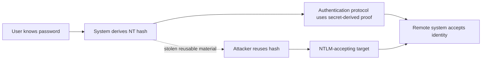
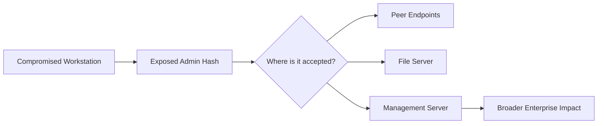
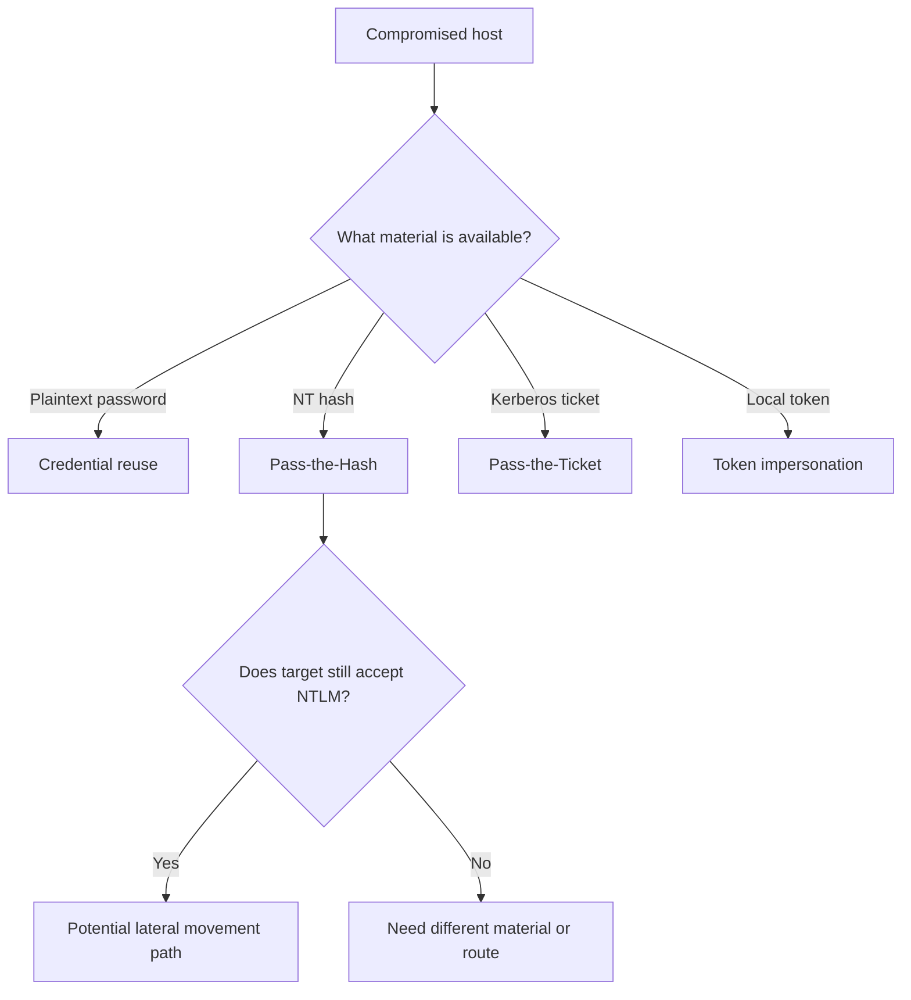
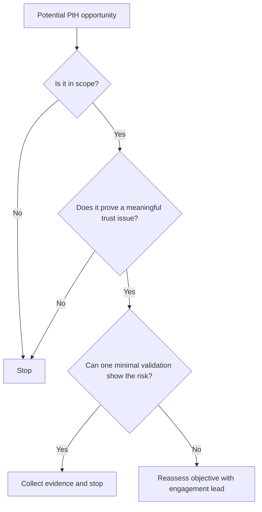
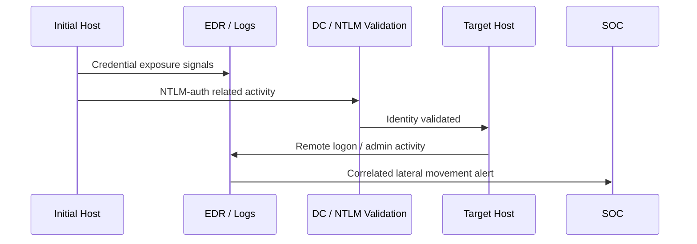
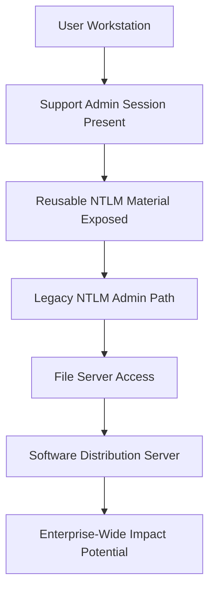

# Pass-the-Hash

> **Phase 11 — Lateral Movement**  
> **Focus:** How authorized adversary emulation models the risk of using stolen NTLM hash material to authenticate without the plaintext password.  
> **Safety note:** This note is for defensive education and authorized red-team work only. It explains concepts, detection, and hardening guidance without providing step-by-step intrusion instructions.

---

**Relevant ATT&CK concepts:** TA0008 Lateral Movement | T1550.002 Use Alternate Authentication Material: Pass the Hash

---

## Table of Contents

1. [Why It Matters](#why-it-matters)
2. [What Is Pass-the-Hash?](#what-is-pass-the-hash)
3. [Where It Fits in an Attack Chain](#where-it-fits-in-an-attack-chain)
4. [Authentication Primer: Password vs Hash vs Ticket](#authentication-primer-password-vs-hash-vs-ticket)
5. [Why Pass-the-Hash Works](#why-pass-the-hash-works)
6. [Conditions That Make It Possible](#conditions-that-make-it-possible)
7. [Common Red-Team Patterns](#common-red-team-patterns)
8. [Pass-the-Hash vs Related Techniques](#pass-the-hash-vs-related-techniques)
9. [Authorized Emulation Workflow](#authorized-emulation-workflow)
10. [Detection Opportunities](#detection-opportunities)
11. [Defensive Controls](#defensive-controls)
12. [Conceptual Example](#conceptual-example)
13. [Key Takeaways](#key-takeaways)
14. [References](#references)

---

## Why It Matters

Pass-the-Hash (PtH) matters because it breaks a common defender assumption: **an attacker does not always need the plaintext password to move laterally**. In Windows-heavy environments, a stolen NTLM hash can become usable authentication material when NTLM is still accepted and the identity has remote access.

That makes PtH less of a "magic trick" and more of a **trust-design problem**:

- Where do privileged accounts log in?
- Which systems still accept NTLM?
- How widely are local admin rights reused?
- How quickly can defenders detect unusual NTLM-based movement?

In an authorized adversary-emulation exercise, PtH is useful because it helps answer a realistic question:

> **If one host is compromised, how far can reusable credential material carry that compromise?**

---

## What Is Pass-the-Hash?

PtH is the use of a **stolen password hash** as the effective credential for authentication, instead of the original password.

### Beginner explanation

Think of authentication material like this:

- **Password** = the secret phrase
- **Hash** = a transformed version of that secret used by the system
- **Ticket / token** = proof issued after successful authentication

In classic PtH scenarios, the attacker does **not** recover the original password. Instead, they reuse the **hash** in an authentication flow that accepts it as "good enough" proof of identity.

### The key idea

PtH is usually associated with:

- **Windows environments**
- **NTLM authentication**
- **Lateral movement**
- **Remote administration paths**

It is especially dangerous when a compromised workstation contains reusable admin credential material and nearby systems still trust NTLM-based authentication.

### What PtH is not

PtH is **not**:

- password cracking
- guessing or brute forcing
- universal authentication abuse across every protocol
- the same as Pass-the-Ticket

It is a specific form of **alternate authentication material abuse**.

---

## Where It Fits in an Attack Chain

PtH usually appears after an attacker already has a foothold and has obtained reusable credential material.

```text
Initial Access
   ↓
Privilege or Credential Exposure
   ↓
Discovery of reachable systems and admin paths
   ↓
[PASS-THE-HASH]
   ↓
Remote access to additional hosts
   ↓
Higher-value objectives
```

### Typical campaign role

PtH often connects these phases:

- **Credential Access** → a hash is recovered
- **Discovery** → remote services and trust paths are mapped
- **Lateral Movement** → a second host is reached
- **Privilege Escalation / Collection** → more powerful systems become exposed

This is why PtH frequently appears in attack chains involving:

- help-desk accounts
- reused local administrator credentials
- server maintenance accounts
- legacy environments with broad NTLM support

---

## Authentication Primer: Password vs Hash vs Ticket

To understand PtH, beginners need one clear mental model.

### Identity material at a glance

| Material | What It Is | Where It Fits | Why It Matters |
|---|---|---|---|
| **Password** | Secret known by the user | Initial proof of identity | If stolen, it works anywhere the real password works |
| **NT hash** | A derived representation of the password | Used in NTLM-related authentication flows | In PtH, this may be enough without knowing the password |
| **Kerberos ticket** | A token issued after authentication | Used inside Kerberos-based environments | Relevant to Pass-the-Ticket, not classic PtH |
| **Access token / session** | Local proof of an authenticated process or user | Used on a host after login | Relevant to token theft/impersonation |

### Conceptual authentication flow



### Practical takeaway

The defender question is not just:

> "Was the password stolen?"

It is also:

> "Was any **equivalent credential material** stolen that the environment still trusts?"

---

## Why Pass-the-Hash Works

PtH works because some authentication workflows allow the **hash-derived proof** to stand in for direct knowledge of the original password.

### High-level logic

1. A host is compromised.
2. Reusable credential material is exposed.
3. A target service still accepts NTLM-style authentication.
4. The compromised identity has useful rights on another system.
5. The attacker authenticates without ever knowing the original password.

### The crucial weakness

The true weakness is rarely "hashes exist." Hashes always exist somewhere in identity systems.

The real weakness is the combination of:

- **reusable credential material**
- **broad acceptance of NTLM**
- **insufficient privilege separation**
- **remote administration reach**

### Why defenders sometimes underestimate PtH

Teams often focus on password complexity and miss the bigger issue:

- a strong password does not help if its **hash** is exposed
- MFA may not help if the lateral path uses legacy internal admin workflows
- a single endpoint compromise can matter much more when admin identities log on there

---

## Conditions That Make It Possible

PtH is only meaningful when several conditions line up.

| Condition | Why It Matters | Risk Indicator |
|---|---|---|
| **Hash material is exposed** | There must already be reusable credential material to abuse | Privileged sessions on lower-trust devices, memory exposure, poor credential hygiene |
| **NTLM is still accepted** | Classic PtH depends on a path that trusts NTLM-style auth | Legacy systems, NTLM fallback, mixed old/new Windows estates |
| **The account has remote rights** | A stolen identity is only useful where it is authorized | Local admin reuse, broad help-desk rights, server ops accounts |
| **Network reachability exists** | Lateral movement requires an actual path | Flat networks, permissive admin VLANs, direct workstation-to-server access |
| **Defenses do not block or isolate the attempt** | Host and identity controls can reduce or contain blast radius | Weak segmentation, missing credential isolation, limited alerting |

### The most common enterprise enablers

#### 1. Local admin password reuse

If many endpoints share the same local administrator credential, one compromised machine can expose a credential that works on many peers.

#### 2. Privileged users logging into user workstations

When admins, support staff, or service engineers log onto ordinary endpoints, those systems become stepping stones.

#### 3. NTLM fallback in "mostly Kerberos" environments

Many organizations think they are safe because Kerberos is present, but practical risk remains if NTLM still appears on important paths.

#### 4. Management planes with broad trust

Backup servers, deployment tools, virtualization managers, jump servers, and monitoring platforms can massively amplify the impact of one stolen admin hash.

---

## Common Red-Team Patterns

Below are the patterns most often worth discussing in reports and tabletop reviews.

| Pattern | What It Looks Like | Why It Scales | Defensive Focus |
|---|---|---|---|
| **Shared local admin credential** | One workstation compromise exposes a credential accepted by many peers | Each peer becomes reachable with the same identity | Windows LAPS, local admin randomization, segmentation |
| **Help-desk or IT support exposure** | Support accounts authenticate to many endpoints | High spread plus legitimate-looking admin activity | Tiered administration, PAWs, restricted logon rights |
| **Server operations account reuse** | One ops credential is accepted across server tiers | Quickly turns one server into many | Role separation, JIT/JEA, PAM |
| **Legacy NTLM-only dependency** | A business app or workflow still relies on NTLM | Modern controls are bypassed by compatibility exceptions | NTLM reduction roadmap, app modernization |
| **Management infrastructure abuse** | Backup, deployment, or virtualization systems become reachable | One management node can become an enterprise force multiplier | Admin isolation, approval workflows, hardened management tiers |

### Blast-radius diagram



### Red-team reporting insight

PtH findings are strongest when they show **blast radius**, not just technical possibility.

For example, a good report statement sounds like:

> "A compromised workstation containing a support-admin session could have enabled NTLM-authenticated administrative access to multiple server-adjacent systems because the same identity retained broad rights and NTLM remained enabled on those paths."

That is much more valuable than simply saying "Pass-the-Hash was possible."

---

## Pass-the-Hash vs Related Techniques

Beginners often mix these together. They are related, but not identical.

| Technique | Credential Material Used | Typical Protocol Context | Main Idea |
|---|---|---|---|
| **Credential reuse** | Plaintext password | Any service accepting the password | Reuse the real password directly |
| **Pass-the-Hash** | NT hash | NTLM-style authentication | Reuse the hash without knowing the password |
| **Overpass-the-Hash** | Hash used to obtain Kerberos-oriented access material | Hybrid NTLM/Kerberos abuse path | Use hash-derived access to pivot into ticket-based auth |
| **Pass-the-Ticket** | Kerberos ticket | Kerberos | Reuse a stolen ticket instead of the password or hash |
| **Token impersonation** | Local token/session material | Host-local or adjacent trust path | Reuse an authenticated session context |

### Decision tree



### Practical difference

PtH is often a story about **legacy authentication acceptance**.

Pass-the-Ticket is usually a story about **Kerberos ticket theft**.

Credential reuse is often a story about **password scope and over-permissioning**.

---

## Authorized Emulation Workflow

In professional red teaming, the goal is not to "spray" the environment or maximize spread. The goal is to **prove risk safely, minimally, and clearly**.

### Safe workflow for authorized assessments

#### 1. Start with scope and guardrails

Before any validation:

- confirm which hosts and accounts are in scope
- define stop conditions
- know which management tiers are off-limits
- agree on what counts as sufficient proof

#### 2. Prove the trust weakness, not the whole worst case

The most mature demonstration is often:

- one compromised endpoint
- one exposed privileged identity
- one approved target
- one carefully documented proof of access

That is usually enough to show the architecture problem.

#### 3. Minimize disruption

Good adversary emulation avoids:

- broad host sweeps
- unnecessary account usage
- user-visible interruption
- data access beyond what the objective requires

#### 4. Capture evidence for defenders

A useful PtH exercise should leave defenders with:

- the trust path that made movement possible
- the identity involved
- the systems that accepted the material
- the logs and alerts that should have detected it

### Operator decision model



### Practical red-team questions

When evaluating PtH safely, ask:

1. **Which identity material was exposed?**
2. **Why was it present on this host?**
3. **What tier of systems trusts that identity?**
4. **Could the same point be proven with fewer touches?**
5. **What would defenders need to detect this next time?**

---

## Detection Opportunities

PtH detection works best as **sequence detection**, not as a single-event hunt.

### What defenders should correlate

| Signal | What to Watch For | Why It Helps |
|---|---|---|
| **NTLM authentications from unusual origins** | Sensitive servers receiving NTLM logons from ordinary workstations | PtH often abuses valid protocols from invalid source systems |
| **Privileged account use on low-trust hosts** | Admin identities authenticating from user endpoints | Often the setup condition that makes PtH possible |
| **Lateral movement right after credential exposure** | Host compromise indicators followed by remote auth to peers/servers | The timeline is often more revealing than any one event |
| **Unexpected admin share or remote-management activity** | SMB admin paths, remote service actions, management traffic | PtH commonly pairs with ordinary admin channels |
| **NTLM where Kerberos is expected** | Legacy fallback on high-value systems | This highlights places where PtH remains viable |

### Useful Windows telemetry areas

Depending on the environment, defenders often review:

- **successful logon events on the target host**
- **NTLM validation activity**
- **special-privilege assignments**
- **service creation or remote execution artifacts**
- **SMB/admin-share access**
- **EDR process and network correlation**

### Practical detection logic

Strong detections often ask:

- Did a sensitive host receive **NTLM** logon activity from a source that normally should use a jump host?
- Did a privileged account appear on a workstation and then authenticate elsewhere soon after?
- Did the environment show **credential-theft-adjacent** telemetry before a new wave of remote administration events?
- Did the same identity touch multiple systems in a short period from an unusual origin?

### Detection timeline diagram



---

## Defensive Controls

PtH is best reduced through **identity architecture**, **credential isolation**, and **administrative discipline**.

| Control | Why It Helps | Practical Outcome |
|---|---|---|
| **Reduce NTLM wherever possible** | Removes or shrinks the protocol path PtH depends on | Fewer places where stolen hashes remain useful |
| **Use unique local admin passwords** | Prevents one endpoint compromise from scaling to many | Limits peer-to-peer blast radius |
| **Tier administrative access** | Keeps privileged identities off lower-trust systems | Reduces hash exposure on workstations |
| **Harden LSASS / LSA protections** | Makes credential theft harder and raises attacker cost | Less reusable credential material available after compromise |
| **Use credential isolation features** | Protects high-value authentication material in memory | Reduces the chance that one foothold yields reusable secrets |
| **Restrict remote admin origins** | Admin protocols should be reachable only from hardened paths | Valid credentials from user workstations become less useful |
| **Segment management systems** | Backup, virtualization, and deployment tools should be isolated | Prevents one admin path from becoming an enterprise-wide pivot |
| **Continuously monitor privileged identity travel** | Detects when admin identities appear in the wrong places | Enables earlier response before full spread |

### Why host hardening matters

Microsoft guidance around **added LSA protection** emphasizes that LSASS protection helps prevent nonprotected processes from reading memory or injecting code into the Local Security Authority process. That matters because PtH risk is downstream from **credential exposure**. If credential material is harder to steal, PtH becomes harder to execute.

### Defender priorities in order

If a team cannot do everything at once, the highest-value order is usually:

1. **eliminate shared local admin passwords**
2. **keep privileged accounts off workstations**
3. **reduce NTLM acceptance on sensitive paths**
4. **harden credential storage and monitoring**

---

## Conceptual Example

Imagine this authorized red-team scenario:

- A user workstation is compromised during an approved exercise.
- A support administrator had recently signed into that workstation.
- The environment still allows NTLM-based remote administration on several internal systems.
- The same support identity has local admin rights on file servers and a software distribution server.

### What this means

The important lesson is **not** "the red team can use a fancy technique."

The important lesson is:

1. privileged identity material reached a low-trust endpoint
2. that material remained reusable
3. nearby systems still accepted it
4. those systems formed a trust ladder toward more sensitive infrastructure

### Conceptual risk path



### What a mature report would emphasize

- why the support credential was present on the workstation
- which systems still trusted NTLM for that identity
- how many systems shared the same administrative trust
- what controls would have broken the chain

That framing gives defenders something actionable.

---

## Key Takeaways

- PtH is a **credential-equivalence** problem: the environment trusts the hash strongly enough for it to matter.
- The technique is most dangerous when **NTLM remains enabled**, **privileged identities appear on low-trust hosts**, and **admin rights are broadly reused**.
- For red teams, the goal is to prove the trust weakness with **minimal, authorized validation**.
- For defenders, the biggest wins are **NTLM reduction**, **unique admin credentials**, **privileged access tiering**, and **credential isolation**.
- The best PtH detections correlate **credential exposure**, **NTLM authentication**, and **remote admin activity** into one story.

---

## References

- MITRE ATT&CK — **T1550.002: Use Alternate Authentication Material: Pass the Hash**  
  https://attack.mitre.org/techniques/T1550/002/
- Microsoft Learn — **Configuring added protection for the Local Security Authority**  
  https://learn.microsoft.com/en-us/windows-server/security/credentials-protection-and-management/configuring-additional-lsa-protection
