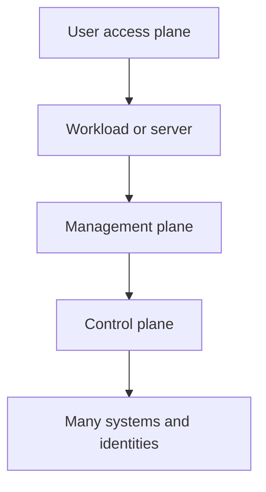
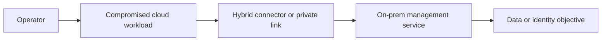
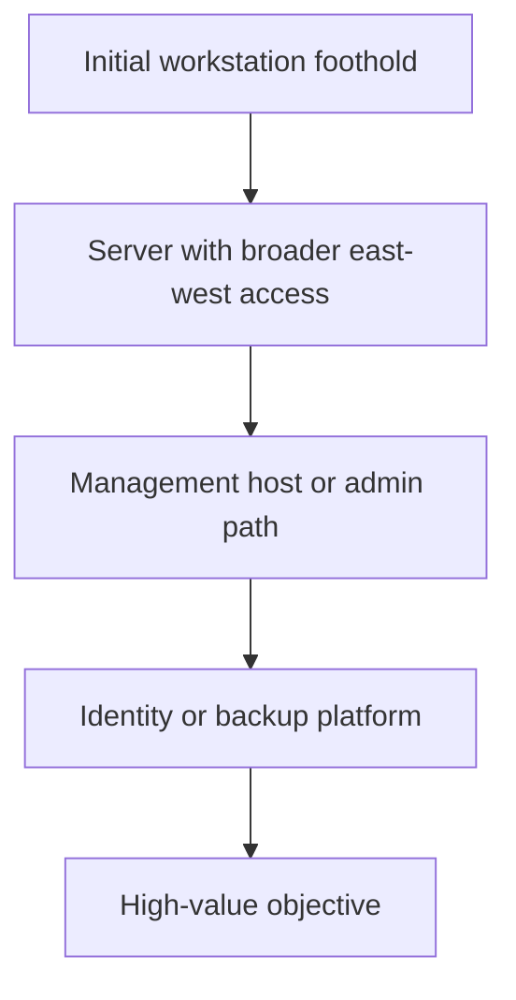

# Pivoting Techniques

> **Phase 11 — Lateral Movement**  
> **Focus:** How an authorized adversary-emulation team uses compromised or approved intermediary systems to reach networks, services, and management planes that were not directly reachable at the start of an exercise.  
> **Safety note:** This note is for defensive learning and authorized red-team simulation only. It explains architecture, decision-making, visibility, and tradeoffs without giving step-by-step intrusion instructions.

---

**Relevant ATT&CK concepts:** TA0008 Lateral Movement | T1090 Proxy | T1572 Protocol Tunneling

MITRE ATT&CK treats many pivoting behaviors as either **proxying** or **protocol tunneling**. In plain language, pivoting is about **turning one foothold into controlled reachability somewhere else**.

---

## Table of Contents

1. [Why It Matters](#why-it-matters)
2. [Beginner View](#beginner-view)
3. [A Simple Mental Model](#a-simple-mental-model)
4. [Key Terms You Should Know](#key-terms-you-should-know)
5. [Where Useful Pivot Paths Come From](#where-useful-pivot-paths-come-from)
6. [Common Pivoting Models](#common-pivoting-models)
7. [Choosing the Right Pivot Pattern](#choosing-the-right-pivot-pattern)
8. [Multi-Hop and Advanced Pivoting](#multi-hop-and-advanced-pivoting)
9. [Red-Team Safety and Operational Discipline](#red-team-safety-and-operational-discipline)
10. [Detection Opportunities](#detection-opportunities)
11. [Defensive Controls](#defensive-controls)
12. [Conceptual Scenarios](#conceptual-scenarios)
13. [Common Mistakes](#common-mistakes)
14. [Key Takeaways](#key-takeaways)

---

## Why It Matters

Most valuable systems are not exposed directly to the internet or to ordinary user networks. Identity systems, virtualization clusters, backup platforms, management consoles, databases, and cloud control paths usually sit behind some boundary.

Pivoting matters because it answers a simple question:

> “If the first foothold cannot reach the real objective, what trusted path can?”

In real adversary emulation, pivoting is often the moment where a small compromise turns into a realistic campaign story:

- a workstation becomes access to a server subnet,
- a server becomes access to a management plane,
- a management plane becomes access to many workloads,
- and a hybrid connector can become a bridge between cloud and on-premises environments.

That is why defenders should think of pivoting as **reachability abuse**, not just “tunneling.”

---

## Beginner View

At the most basic level, a pivot is just a **bridge host**.

If the red team can reach Host A, and Host A can reach Host B, then Host A may become the path to Host B.

```text
Operator → Initial Foothold → Hidden Network → Objective
```

Examples:

- a user workstation that can reach internal file servers,
- a web server in a DMZ that can reach an application subnet,
- an admin jump box that can reach management interfaces,
- a cloud workload that can reach private on-prem services through a connector.

Beginner takeaway:

- **A pivot is not the goal.**
- **The goal is the next trust zone.**

---

## A Simple Mental Model

When deciding whether pivoting is relevant, ask three questions:

1. **Can this host reach something I cannot?**
2. **Can I use an identity or service that is accepted there?**
3. **Can I prove that path safely and clearly enough for the client to learn from it?**

If the answer to all three is yes, you likely have a meaningful pivot opportunity.

### Easy memory rule

```text
Reachability + Trust + Control = Useful Pivot
```

If one of those is missing, the pivot may exist technically but have little operational value.

---

## Key Terms You Should Know

| Term | Meaning |
|---|---|
| **Pivot host** | The intermediary system used to relay or route access deeper into the environment |
| **Jump host** | A managed intermediate host used for administration; it can also become an attacker pathway if trust is weak |
| **Proxy** | A service that relays traffic between two endpoints |
| **Tunnel** | An encapsulated communication path used to carry traffic through another protocol or channel |
| **Port forwarding** | Relaying one specific service or port through an intermediate host |
| **SOCKS / application proxying** | Relaying multiple application connections through a single intermediary |
| **Multi-hop pivot** | Chaining more than one pivot to reach progressively deeper segments |
| **Dual-homed host** | A system with connectivity into more than one network or trust zone |
| **Management plane** | Systems used to administer workloads, devices, virtualization, backups, or cloud resources |
| **Control plane** | Identity, policy, and orchestration layers that can influence many systems at once |

### Pivoting vs tunneling vs lateral movement

These terms overlap, but they are not identical:

- **Lateral movement** is the broader campaign activity of moving from one system to another.
- **Pivoting** is the reachability technique that makes some of that movement possible.
- **Tunneling** is one technical method used to implement a pivot.

---

## Where Useful Pivot Paths Come From

The best pivots usually appear where architecture created a trusted pathway for normal operations.

### Common sources of pivot value

| Environment feature | Why it becomes useful |
|---|---|
| **Dual-homed servers** | They naturally connect two zones that should be treated differently |
| **Admin workstations** | They often have privileged reach into management services |
| **Backup and monitoring servers** | They talk broadly across the environment and are highly trusted |
| **Virtualization or orchestration consoles** | One control point can influence many hosts |
| **Remote support tooling** | It already exists to cross boundaries for legitimate operations |
| **Cloud connectors / sync agents** | They bridge cloud identity or cloud workloads with on-prem resources |
| **Developer and CI/CD systems** | They may touch code, secrets, workloads, and production interfaces |

### Why management paths matter so much

Microsoft’s enterprise access guidance separates environments into **control plane**, **management plane**, and **data/workload plane**. That model is useful here because pivoting becomes much more dangerous when a lower-trust system can influence a higher plane.



The lesson is simple:

> A pivot into a management or control path is usually more important than a pivot into a single server.

---

## Common Pivoting Models

### 1. Single-service forwarding

This is the narrowest model. The team only needs one remote service, such as an internal web app, database interface, or management port.

**Why teams use it**

- minimal scope,
- easier to explain,
- lower noise than broad relay behavior,
- good for proving one important exposure path.

**Defender clue:** a host that suddenly behaves like a relay for one unusual destination.

---

### 2. Application proxy pivoting

Here the pivot carries multiple application connections rather than one fixed service. This supports broader discovery or access to several internal tools through a single intermediary.

**Why teams use it**

- flexible once established,
- useful when multiple destinations matter,
- supports realistic “operator working through a jump point” behavior.

**Defender clue:** endpoint starts looking like a proxy, broker, or transit device.

---

### 3. Remote administration path pivoting

Sometimes the “pivot” is not a tunnel at all. It is simply an abuse of a legitimate admin pathway:

- jump servers,
- remote support tools,
- endpoint management,
- backup consoles,
- virtualization consoles,
- configuration management.

This is especially realistic in mature environments because it mirrors how administrators actually work.

**Defender clue:** valid protocols from invalid origins, or valid identities in invalid contexts.

---

### 4. Layer-3 or network-overlay style pivoting

This is the broadest model. Instead of relaying one app at a time, the operator effectively extends reachable network space through the pivot.

**Why teams use it**

- useful in segmented environments,
- makes deeper discovery possible,
- can support multi-hop campaign simulation.

**Tradeoff:** richer functionality usually means more telemetry and greater blast radius if handled poorly.

---

### 5. Cloud and hybrid pivoting

Modern environments often have paths like:

- cloud workload to private subnet,
- cloud identity to on-prem application,
- synchronization service to directory infrastructure,
- management portal to virtualization or container estate.

These are not “classic” pivots, but they are absolutely pivot paths.



**Defender clue:** cross-environment access that follows legitimate connectivity but violates expected role boundaries.

---

## Choosing the Right Pivot Pattern

A mature red team does not ask only “Can we pivot?” It asks “Which pivot gives the best learning value with the least unnecessary risk?”

### Practical decision matrix

| Question | Why it matters |
|---|---|
| **What is the next objective?** | A single admin panel and a whole hidden subnet require different pivot designs |
| **How much reach is truly needed?** | Narrow access is safer and often enough to prove the risk |
| **What telemetry will this create?** | Some pivot styles look far more suspicious than others |
| **Will users notice?** | Interactive paths may create disruption, prompts, or performance changes |
| **Can the evidence be explained clearly afterward?** | A good pivot story should translate into architecture lessons for defenders |

### Quick comparison

| Pivot style | Best for | Main strength | Main drawback |
|---|---|---|---|
| **Single-service forward** | One specific internal objective | Tight scope | Limited flexibility |
| **Application proxy** | Several related tools or services | Broad usability | Stronger transit signals |
| **Jump-host style** | Realistic admin-like movement | Blends with existing workflows | Heavily dependent on identity controls |
| **Network-overlay / broad routing** | Deep exploration of segmented zones | Maximum reach | Highest complexity and detection surface |
| **Cloud / hybrid bridge** | Modern enterprise realism | Reveals trust-boundary design flaws | Can affect multiple teams and platforms |

### The practical rule

Use the **smallest pivot** that proves the **largest meaningful risk**.

---

## Multi-Hop and Advanced Pivoting

Advanced environments rarely stop at one bridge. Some campaign paths require several transitions:



### What changes as pivots stack up

Every extra hop adds:

- more failure points,
- more telemetry,
- more synchronization and routing complexity,
- more chances to touch higher-value trust zones,
- and more reporting value if the chain is realistic and well-scoped.

### Advanced patterns to understand

| Pattern | What makes it advanced |
|---|---|
| **Multi-hop network path** | Each new host extends reach into a deeper subnet or security tier |
| **Identity-assisted pivoting** | Credentials or tokens matter as much as network position |
| **Management-plane pivoting** | One console or orchestrator can indirectly touch many assets |
| **Hybrid trust pivoting** | Cloud, SaaS, and on-prem pathways combine into one campaign route |
| **Protocol transformation** | Traffic changes form across the path, which may obscure intent but also create detection artifacts |

### Important advanced insight

The most dangerous pivot is often not the one with the most network reach.

It is the one that crosses into a **more trusted administrative context**.

---

## Red-Team Safety and Operational Discipline

Authorized adversary emulation should treat pivoting as a controlled experiment, not a free-form tunnel-building exercise.

### Safe operating principles

| Principle | Why it matters |
|---|---|
| **Stay inside scope** | Pivot paths can accidentally touch excluded segments or business-critical systems |
| **Prefer least disruptive proof** | The objective is to demonstrate risk, not maximize technical reach |
| **Time-box and de-scope pivots** | Temporary, narrow pivots reduce exposure and clean-up effort |
| **Coordinate with deconfliction rules** | Transit behavior can trigger security controls or operational concern |
| **Preserve a clear evidence trail** | The client should understand what path existed and why it mattered |

### Useful red-team questions before pivoting

- Is this path explicitly in scope?
- Does proving one service path teach the lesson without expanding further?
- Could this impact production traffic or user experience?
- Will this create a misleading picture of risk if not explained carefully?
- What architecture weakness does this pivot actually demonstrate?

---

## Detection Opportunities

Pivoting often stands out less because of a specific tool and more because of a **change in host role**.

### What defenders should look for

| Signal | Why it matters |
|---|---|
| **Endpoint behaving like a relay** | Workstations and ordinary servers usually should not become transit points |
| **Unexpected inbound/outbound pairings** | A host accepting one connection and immediately opening another can indicate forwarding behavior |
| **New traffic across segmentation boundaries** | Pivoting often creates paths that are unusual for that asset class |
| **Admin protocols from non-admin origins** | Legitimate protocols can still be strong lateral movement indicators |
| **Cross-plane access shifts** | Workload-to-management or user-to-control-plane paths are especially important |
| **Long-lived or dense internal connection patterns** | Proxies and tunnels can create durable or unusually broad communication footprints |

### Detection mindset

Instead of asking only:

> “Did a known tunneling tool run?”

also ask:

> “Did this system suddenly start acting like infrastructure?”

### Practical timeline view

```text
Foothold established
    ↓
Discovery activity on local host
    ↓
New relay-like traffic behavior
    ↓
Admin or internal service access from unusual origin
    ↓
Access to higher-value system
```

That sequence is often more useful than any single alert.

---

## Defensive Controls

The best pivot defense is not “block all tunnels.” It is to reduce unnecessary trust paths and make important ones highly visible.

| Control | Why it helps |
|---|---|
| **Strong segmentation** | Limits what any one compromised host can reach |
| **Administrative tiering** | Prevents low-trust systems from reaching high-trust management paths |
| **Dedicated jump infrastructure** | If pivot-like behavior must exist, keep it on monitored and hardened systems |
| **Least privilege for services and connectors** | Hybrid bridges should not carry more authority than necessary |
| **Egress and relay monitoring** | Helps detect hosts that begin acting as brokers or tunnels |
| **Privileged access controls** | MFA, PAM, approval workflows, and origin restrictions reduce abuse of admin paths |
| **Role-based network design** | A host should talk only to what it truly needs for its business function |

### Defensive architecture lesson

If an ordinary endpoint can become a bridge into a management plane, the problem is usually not the endpoint alone.

The problem is the **path design**.

---

## Conceptual Scenarios

### Scenario 1: Dual-homed analytics server

A reporting server can reach both user workstations and a protected database subnet. A red team demonstrates that compromising the reporting server creates a path into data services that normal user devices should never influence.

**Lesson:** dual-homed or multi-network servers deserve special scrutiny.

---

### Scenario 2: Help-desk admin path

A help-desk workstation does not host sensitive data, but it can legitimately access remote administration tooling across many endpoints. The pivot is not valuable because of the workstation itself. It is valuable because of the **operational trust** behind it.

**Lesson:** support tooling can be a stronger movement path than many servers.

---

### Scenario 3: Hybrid bridge

A cloud-hosted workload can communicate with an on-prem connector used for application integration. The red team proves that compromising the workload would create a realistic pathway toward internal management services.

**Lesson:** cloud-to-on-prem connectivity should be modeled as a trust boundary, not just a convenience feature.

---

## Common Mistakes

### 1. Treating every reachable host as equally valuable

A good pivot is about **path quality**, not host count.

### 2. Building broader access than the objective requires

Wide pivoting may impress technically, but narrow proof is often safer and more useful.

### 3. Ignoring identity context

Network reach without accepted authentication may not move the campaign forward.

### 4. Forgetting the management plane

Many of the most realistic pivot paths lead into consoles, orchestrators, backup systems, and admin workflows rather than directly into crown-jewel data.

### 5. Reporting only the tunnel, not the trust flaw

Clients benefit most when the finding explains:

- what trusted path existed,
- why it existed,
- what higher-value zone it exposed,
- and how to redesign that path safely.

---

## Key Takeaways

- Pivoting is best understood as **using trust and reachability to cross boundaries**.
- The strongest pivots usually come from **management paths, dual-homed systems, and hybrid connectors**.
- The right pivot is the one that proves the **most meaningful architectural risk** with the **least unnecessary scope**.
- Defenders should watch for hosts that suddenly behave like **relays, jump boxes, or transit infrastructure**.
- Good architecture limits pivot value by separating **user**, **workload**, **management**, and **control** paths.

---

> **Defender mindset:** A pivot is a design lesson. If one compromised system can become a bridge into a more trusted zone, the real issue is not just the bridge host — it is the trust relationship that made the bridge valuable.
