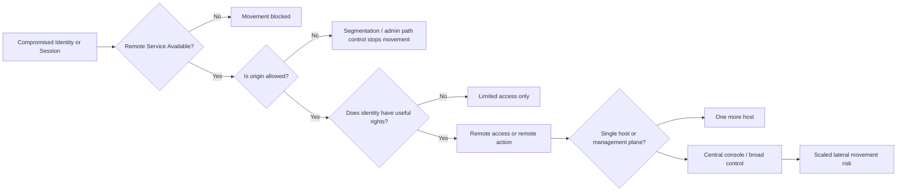
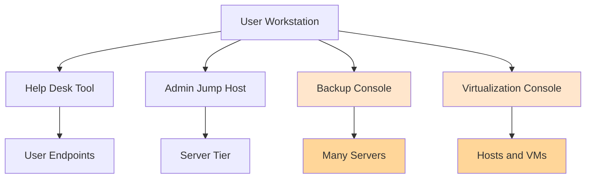
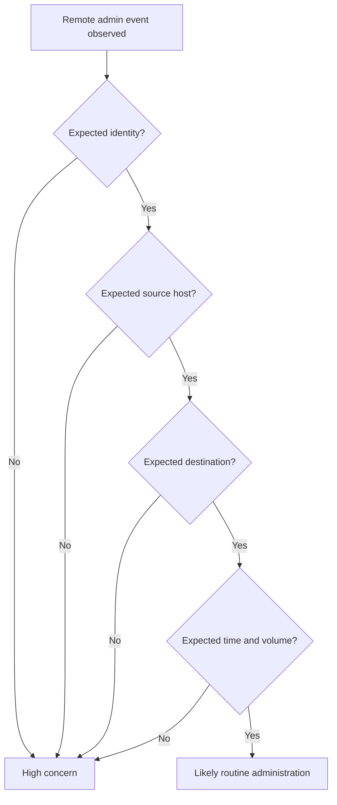

# Remote Service Abuse

> **Phase 11 — Lateral Movement**  
> **Focus:** How legitimate remote administration paths become movement pathways when identity, segmentation, and management-plane controls are weak.  
> **Safety note:** This note is for **authorized adversary emulation, purple teaming, and defense improvement only**. It explains concepts, decision-making, and detection without giving harmful step-by-step intrusion instructions.

---

**Relevant ATT&CK concepts:** TA0008 Lateral Movement | T1021 Remote Services | T1021.001 RDP | T1021.002 SMB/Windows Admin Shares | T1021.004 SSH | T1021.005 VNC | T1021.006 WinRM | T1047 WMI | T1078 Valid Accounts

---

## Table of Contents

1. [Why It Matters](#why-it-matters)
2. [Beginner View](#beginner-view)
3. [What Counts as Remote Service Abuse?](#what-counts-as-remote-service-abuse)
4. [The Four Conditions That Make It Possible](#the-four-conditions-that-make-it-possible)
5. [Remote Service Families and Tradeoffs](#remote-service-families-and-tradeoffs)
6. [How Red Teams Think About It](#how-red-teams-think-about-it)
7. [Diagrams](#diagrams)
8. [Practical Authorized-Exercise Ideas](#practical-authorized-exercise-ideas)
9. [Detection Opportunities](#detection-opportunities)
10. [Defensive Controls](#defensive-controls)
11. [Common Failure Modes](#common-failure-modes)
12. [Conceptual Scenario](#conceptual-scenario)
13. [Key Takeaways](#key-takeaways)

---

## Why It Matters

Remote service abuse is one of the most realistic forms of lateral movement because it often does **not** require a noisy exploit. If a team member, administrator, automation account, or management platform already has legitimate remote access, then a compromised identity can turn normal administration into an attack path.

That is why this topic matters so much in adversary emulation:

- it tests whether **valid credentials** are enough to move around,
- it reveals whether **administrative boundaries** actually exist,
- it shows whether **management tools become force multipliers**, and
- it exposes environments where suspicious activity looks almost identical to routine IT work.

In other words, remote service abuse is rarely about “hacking the protocol.” It is usually about **abusing trust that was already there**.

---

## Beginner View

A **remote service** is any service that lets one system or one identity interact with another system from a distance.

Common examples:

- **RDP / VDI / VNC** for remote desktop access
- **SSH** for shell access on Linux, network devices, and modern Windows environments
- **WinRM / PowerShell remoting / WMI** for Windows administration
- **SMB-based administration** for file access, service interaction, and remote management workflows
- **Hypervisor, backup, deployment, and RMM consoles** that can operate many systems at once
- **Remote support platforms** used by help desk or third-party support teams

A beginner-friendly way to think about it:

```text
Stolen or over-privileged identity
          +
Reachable remote management path
          +
Weak control boundaries
          =
Lateral movement opportunity
```

The key lesson: a remote service is not automatically dangerous. It becomes dangerous when the **wrong identity can use it from the wrong place to reach the wrong target**.

---

## What Counts as Remote Service Abuse?

Remote service abuse means using an existing remote access or administration channel in a way that helps an operator move to another host, tier, or management plane.

That can happen in several ways:

### 1. Direct host-to-host movement
A compromised workstation reaches a server through a legitimate remote protocol.

### 2. User-to-admin boundary crossing
An identity that should only access one class of assets can suddenly manage a more privileged class.

### 3. Console-mediated movement
Instead of connecting to each host directly, an operator uses a **central management system** that already has broad reach.

### 4. Trust amplification
A low-value foothold leads to a system that administers many others, such as:

- endpoint management servers,
- software deployment systems,
- virtualization management consoles,
- backup infrastructure,
- remote monitoring and management platforms,
- jump hosts and bastions.

This is why mature defenders treat remote services as **trust pathways**, not just open ports.

---

## The Four Conditions That Make It Possible

Remote service abuse usually becomes viable when four things line up.

### 1. Reachability
Can the current host actually talk to the target service?

Questions to ask:

- Can user workstations reach admin services directly?
- Are management protocols exposed across too many network segments?
- Are there jump hosts, or can everyone talk to everything?

### 2. Authentication Acceptance
Will the target accept the identity, token, key, or delegated access the operator has?

Questions to ask:

- Does the account have local admin, server admin, or console access?
- Is the same identity valid across many systems?
- Are service accounts or automation identities broader than intended?

### 3. Authorization Depth
What can that identity actually do after connecting?

Examples:

- simple login only,
- file transfer,
- shell access,
- process creation,
- service control,
- system-wide orchestration through a console.

### 4. Visibility and Friction
How noticeable is the action, and how many controls must be bypassed?

Examples:

- MFA on privileged RDP access adds friction,
- session recording on bastions raises visibility,
- workstation-origin WinRM to servers may stand out,
- actions through a heavily used admin console may blend in.

A useful mental model:

```text
Opportunity = Reachability × Authentication × Authorization × Low Friction
```

If defenders reduce any one of those factors, the movement path becomes harder.

---

## Remote Service Families and Tradeoffs

Different remote services enable different movement styles. The important thing is not memorizing every protocol; it is understanding the **tradeoffs**.

### Service Comparison Table

| Service family | Typical legitimate use | Why it becomes a movement path | Common visibility profile | Defensive priority |
|---|---|---|---|---|
| **Interactive desktop** (RDP, VDI, VNC) | Full desktop administration, support, jump-host workflows | Gives rich host access and user context | Often high: visible sessions, user impact, desktop artifacts | Restrict origins, require MFA, use hardened jump hosts |
| **Shell remoting** (SSH, WinRM, PowerShell remoting) | Scripting, configuration, automation | Efficient control with low user disruption | Medium: command and auth logs, host telemetry | Tier admin access, record sessions, restrict sources |
| **Management APIs / WMI-like admin channels** | Querying systems, automation, orchestration | Can look like standard enterprise management traffic | Medium to low unless well baselined | Audit management namespaces, app allowlisting, origin analytics |
| **SMB / admin-share style management** | File operations, service interaction, software delivery | Lets operators stage tools or interact with admin surfaces | Medium to high: share access, service changes, logons | Limit admin shares, local admin sprawl, lateral SMB reach |
| **Central management platforms** (RMM, deployment, backup, vCenter, SCCM-like tools) | Fleet-wide administration | One console may control hundreds of hosts | High value but often under-monitored | Treat as crown jewels; strong PAM, approvals, logging |
| **Remote support tools** | Help desk and vendor support | Trusted remote control can bridge tiers | Variable; often legitimate-looking | Vendor access controls, session approvals, audit review |

> **Advanced point:** The most dangerous remote service is often not the one with the most features. It is the one that quietly connects **low-trust origins** to **high-value systems**.

### Platform Notes

#### Windows-heavy environments
Common remote management paths include:

- **RDP** for interactive administration
- **WinRM**, which Microsoft describes as its implementation of the **WS-Management** protocol
- **WMI** for system querying and management
- **SMB/admin-share workflows** for operational management

This matters because many Windows admin workflows are built around central identity and remote administration by design.

#### Linux and mixed environments
Common paths include:

- **SSH** for servers, appliances, and containers
- automation platforms that distribute commands or configuration
- web-based admin consoles for virtualization, storage, or orchestration

#### macOS and user-support environments
Remote service risk can include:

- screen-sharing and remote support tools,
- SSH,
- Apple Remote Desktop-style workflows,
- MDM and device-management channels.

The broader point is cross-platform: if remote administration is normal, then **identity quality and path control** matter more than the protocol name.

---

## How Red Teams Think About It

In an authorized exercise, remote service abuse is not just “which protocol works?” A strong operator thinks in layers.

### 1. Which path best matches the objective?
If the objective is to validate whether privileged administration boundaries hold, the question is not “Can I get a shell?” It is:

- Can a user-tier asset reach a server-tier service?
- Can a reused admin credential cross tiers?
- Can a management console administer systems outside intended scope?

### 2. Which path is safest to validate?
Good adversary emulation minimizes disruption.

Safer proof patterns often focus on:

- authenticated access validation,
- read-only inventory actions,
- agreed benign commands or checks,
- limited-scope demonstration against pre-approved targets.

The goal is to prove the security gap, **not** to create unnecessary impact.

### 3. Which path is most realistic?
The most realistic route is often the one already used by IT.

Examples:

- help-desk workflows into user devices,
- admin workstations into server tiers,
- backup systems into critical infrastructure,
- hypervisor or virtualization management into entire clusters,
- deployment tools into large device populations.

### 4. Which path changes the campaign graph?
Some remote services only move you to one more host. Others move you to a **platform that manages many hosts**.

That difference is huge.

```text
Compromised workstation -> single file server      = tactical gain
Compromised workstation -> management console      = strategic gain
Management console -> many servers or endpoints    = force multiplier
```

### 5. Which path is easiest for defenders to miss?
Remote service abuse is dangerous because defenders may log the protocol but fail to ask:

- Was the source system expected?
- Was the account expected?
- Was the destination expected?
- Was the time, sequence, and volume expected?

Detection quality depends on **context**, not just raw protocol telemetry.

---

## Diagrams

### 1. Remote Service Abuse as a Trust Problem



### 2. Why Management Consoles Matter So Much



### 3. Defender View: What Should Be Asked?



---

## Practical Authorized-Exercise Ideas

These ideas keep the focus on **validation and learning**, not disruption.

### 1. Map the admin path, not just the port
Instead of asking only “is the service open?”, ask:

- Which asset classes can reach it?
- Which identities can authenticate to it?
- Which actions are permitted after login?
- Is it supposed to be reachable from this network zone?

### 2. Test tier boundaries
A strong exercise checks whether:

- user workstations can directly access server admin services,
- help-desk accounts can reach infrastructure tiers,
- server admins can access identity systems from standard workstations,
- management consoles are isolated from user-tier compromise.

### 3. Validate proof options approved in the rules of engagement
Examples of safe proof styles:

- session establishment confirmation,
- authorized read-only checks,
- approved marker-file or inventory-style validation,
- pre-agreed execution of benign test actions on designated hosts.

### 4. Include indirect remote services
Many environments focus on RDP and SSH but miss:

- deployment platforms,
- backup consoles,
- RMM agents,
- hypervisor dashboards,
- cloud control planes synchronized with on-prem identity,
- vendor support channels.

### 5. Measure time-to-detection, not just reachability
A valuable purple-team question is:

> If an unexpected workstation starts using remote admin paths into server infrastructure, how quickly would anyone notice?

That often tells you more than whether the connection technically succeeds.

---

## Detection Opportunities

Remote service abuse is best detected as a **sequence**, not a single event.

### High-value correlations
Look for:

- compromise indicators on one host followed by new remote admin sessions elsewhere,
- the same identity touching multiple systems in a short period,
- remote admin activity from non-approved workstations,
- cross-tier access that violates expected admin design,
- remote management actions through consoles by unusual users or from unusual locations.

### Telemetry Areas to Watch

| Telemetry area | Why it matters | Example defender question |
|---|---|---|
| **Authentication logs** | Show who logged on where and from what origin | Is this account expected to access this host from this source? |
| **RDP / SSH / WinRM / WMI logs** | Reveal remote protocol usage | Is the protocol normal for this asset pair? |
| **SMB / admin-share access** | Highlights remote admin-style file and service activity | Why is this workstation touching administrative shares? |
| **PowerShell and command telemetry** | Helps distinguish routine automation from suspicious remote admin behavior | Is this script source approved and common? |
| **Management console audit logs** | Critical for backup, virtualization, deployment, and RMM systems | Did an unusual user or source initiate broad actions? |
| **EDR process ancestry and network telemetry** | Connects remote logon, spawned processes, and lateral movement sequence | What happened immediately after the remote session started? |

### Behavior Patterns That Commonly Stand Out

- workstation-origin remote administration into server or identity tiers,
- interactive remote logons at unusual hours,
- an account that normally manages five hosts suddenly touching fifty,
- backup or virtualization admins authenticating from non-admin endpoints,
- remote support tools initiated outside normal help-desk workflows,
- newly compromised hosts beginning to use remote services they never used before.

### Practical Detection Mindset

A remote session may be legitimate in isolation. What makes it suspicious is the combination of:

```text
unexpected user + unexpected source + unexpected target + suspicious sequence
```

That is why baselining normal admin behavior is essential.

---

## Defensive Controls

### Identity Controls

| Control | Why it helps |
|---|---|
| **MFA for privileged remote access** | Makes stolen passwords less useful on remote services |
| **Privileged Access Management (PAM)** | Limits standing privilege and improves auditability |
| **Just-in-time / short-lived admin rights** | Reduces the window in which remote access can be abused |
| **Separate admin identities** | Stops everyday user compromise from immediately becoming admin movement |

### Network and Path Controls

| Control | Why it helps |
|---|---|
| **Administrative tiering** | Keeps lower-trust systems from directly reaching high-value management planes |
| **Jump hosts / privileged access workstations** | Forces remote administration through controlled origins |
| **Segmentation and ACLs** | Removes unnecessary host-to-host management reachability |
| **Disable unused remote services** | Reduces the number of viable movement paths |

### Monitoring and Governance Controls

| Control | Why it helps |
|---|---|
| **Session logging / recording where appropriate** | Adds visibility to remote admin activity |
| **Management console audit review** | Central platforms often matter more than individual hosts |
| **Approval workflows for high-risk actions** | Makes misuse of RMM, backup, or deployment tools more visible |
| **Behavior analytics for admin paths** | Detects legitimate protocols used from illegitimate contexts |

### Design Principle to Remember

```text
The safest remote service is not the one with the best banner warning.
It is the one that is reachable only from the right place,
by the right identity, for the right purpose, with strong logging.
```

---

## Common Failure Modes

These patterns repeatedly turn remote services into easy movement paths:

1. **Admins using normal user workstations for privileged administration**  
   A compromised everyday endpoint becomes an admin launch point.

2. **Flat network reachability to management services**  
   Too many hosts can talk to RDP, SSH, WinRM, SMB, or management APIs.

3. **Over-broad local admin or service-account rights**  
   One recovered credential works across many systems.

4. **Central tools treated as ordinary servers**  
   Backup, deployment, virtualization, and RMM platforms are often under-protected relative to their power.

5. **Weak audit and alerting on management planes**  
   Organizations log endpoint events but not the consoles controlling the endpoints.

6. **Remote support trust without strong guardrails**  
   Vendor or help-desk tooling can bypass segmentation if poorly governed.

7. **No baseline for normal administration**  
   Defenders see the protocol but cannot judge whether the context is abnormal.

---

## Conceptual Scenario

A red team gains a limited foothold on a user workstation during an authorized exercise. No exploit chain is needed for the next lesson.

What matters is this:

- the workstation can reach several remote admin services,
- a privileged support identity is active in the environment,
- a backup console and a virtualization console are reachable from places they should not be,
- monitoring focuses on malware indicators, not on management-path misuse.

The exercise does **not** need to perform destructive actions to prove risk. A safe validation may simply demonstrate that a lower-trust starting point can authenticate to, or operate through, a higher-trust remote management path.

That finding is strategically important because it shows the environment is organized like this:

```text
User compromise -> remote admin path -> management plane -> many critical systems
```

This is exactly why remote service abuse is such a high-value lateral movement topic.

---

## Key Takeaways

- Remote service abuse is usually about **trust misuse**, not protocol exploitation.
- The critical questions are **who can connect, from where, to what, and with what rights**.
- Central management platforms are often more important than individual remote protocols.
- The best authorized exercises prove the path safely and show defenders where boundaries failed.
- The best defenses make remote administration **restricted, tiered, and highly visible**.
