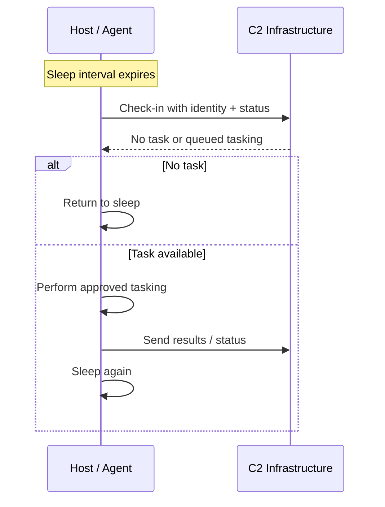
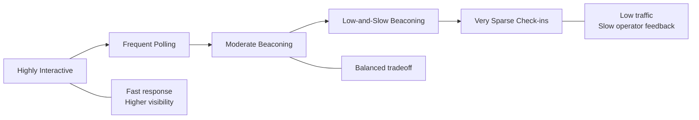
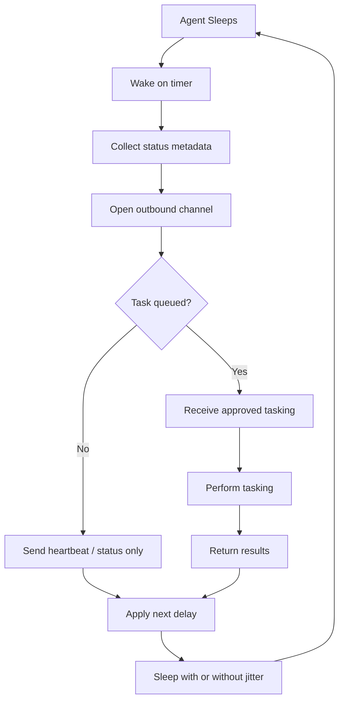
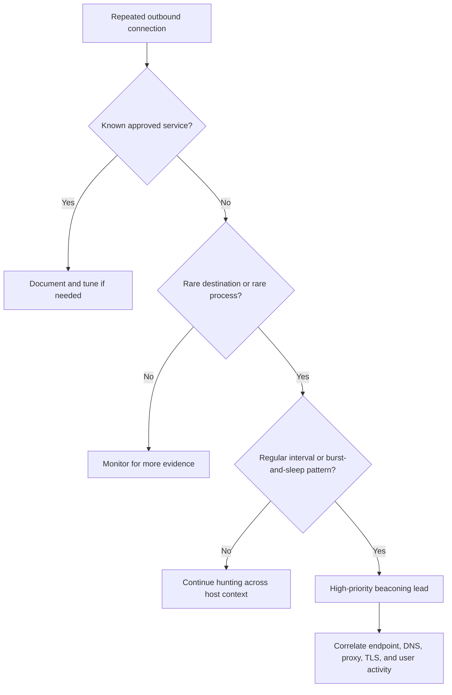

# Beaconing

> **Phase 12 — Command and Control**  
> **Focus:** How periodic check-ins help an operator manage access, what beacon traffic looks like in real environments, and how defenders can detect it.  
> **Authorized-use note:** This note is for approved adversary emulation, detection engineering, and defensive education only. It explains concepts, tradeoffs, and hunting ideas without giving step-by-step intrusion instructions.

---

**Relevant ATT&CK concepts:** TA0011 Command and Control | T1071 Application Layer Protocol | T1001 Data Obfuscation | T1573 Encrypted Channel

---

## Table of Contents

1. [Why It Matters](#why-it-matters)
2. [Beginner View](#beginner-view)
3. [Beaconing vs Interactive C2](#beaconing-vs-interactive-c2)
4. [Anatomy of a Beacon Cycle](#anatomy-of-a-beacon-cycle)
5. [Core Timing Concepts](#core-timing-concepts)
6. [Common Beaconing Patterns](#common-beaconing-patterns)
7. [What Beaconing Looks Like Across Protocols](#what-beaconing-looks-like-across-protocols)
8. [Diagram: Beacon Lifecycle](#diagram-beacon-lifecycle)
9. [Detection Opportunities](#detection-opportunities)
10. [False Positives and Analyst Pitfalls](#false-positives-and-analyst-pitfalls)
11. [Authorized Adversary-Emulation View](#authorized-adversary-emulation-view)
12. [Practical Hunt Workflow](#practical-hunt-workflow)
13. [Key Takeaways](#key-takeaways)

---

## Why It Matters

Beaconing is one of the most common command-and-control behaviors because it solves a simple problem: a compromised system needs a reliable way to ask, **“Do you have work for me?”**

A permanent live session is noisy, fragile, and easy to notice when network controls are tight. A beacon, by contrast, can be small, periodic, and resilient. That makes it useful in real intrusions and equally useful in **authorized red-team exercises** that test whether defenders can spot recurring outbound traffic.

For defenders, beaconing matters because the **timing pattern itself** is often more revealing than the content. Even when traffic is encrypted, the rhythm may still stand out.

---

## Beginner View

Think of beaconing like a phone that wakes up every so often and sends a short message:

```text
"I am here. Do you need anything from me?"
```

If the answer is **no**, it goes back to sleep.
If the answer is **yes**, it receives instructions, performs approved tasking in an authorized exercise, sends back results, and sleeps again.

That sleep-check-sleep model is the heart of beaconing.

### Simple Mental Model

```text
Sleep → Check in → Receive tasking (or none) → Return results → Sleep
```

### Why Beginners Confuse It with a Reverse Shell

A reverse shell is usually thought of as a more direct, live connection.
A beacon is usually thought of as a **polling model**.

Both are command-and-control concepts, but beaconing emphasizes:

- **periodic check-ins**
- **asynchronous tasking**
- **lower constant exposure**
- **better survivability on unstable networks**

---

## Beaconing vs Interactive C2

| Characteristic | Beaconing | Interactive C2 |
|---|---|---|
| **Connection style** | Periodic polling or check-ins | Near-real-time, more session-like |
| **Responsiveness** | Slower | Faster |
| **Typical traffic volume** | Usually smaller and more regular | Often more variable |
| **Operational exposure** | Lower constant visibility | Higher constant visibility |
| **Best for** | Persistence, quiet management, delayed tasking | Hands-on-keyboard work that needs immediacy |
| **Defender clue** | Regular cadence | Bursty operator-driven behavior |

A mature operation may use both models at different times. In an authorized engagement, that difference helps teams test whether security monitoring catches **slow recurring traffic** as well as **high-interaction sessions**.

---

## Anatomy of a Beacon Cycle

A beacon is not just “one packet every few minutes.” It is usually a small workflow.

### 1. Sleep

The implant or agent waits for its next communication window.

### 2. Wake and prepare metadata

Before reaching out, it may collect lightweight state such as:

- host identity
- user context
- privilege level
- task status
- last successful check-in time

### 3. Establish outbound communication

The host creates an outbound request using whatever channel is in scope for the exercise or intrusion pattern being emulated.

### 4. Ask for work

If the server has nothing queued, the response may be tiny.
If work exists, the response may include instructions or references to additional data.

### 5. Return status or results

Results may be immediate, delayed, chunked, or held until a future beacon depending on network constraints and exercise design.

### 6. Sleep again

The cycle repeats until the session is terminated, blocked, or otherwise expires.

### Sequence View



---

## Core Timing Concepts

The most important beaconing ideas are often timing ideas.

### Sleep Interval

The base delay between check-ins.

- Short interval = faster operator response, more observable traffic
- Long interval = slower response, lower traffic volume

### Jitter

A controlled amount of variation around the base interval.

Instead of contacting a server at exactly the same time every cycle, the timing shifts within a range. From a defender’s view, jitter matters because **perfect regularity is easy to detect**, while light variation looks more realistic.

### Burst Window

A short period of heavier communication followed by longer quiet periods.

This often happens when results need to be sent back, modules need to be updated, or the operator is temporarily more active.

### Cadence

The overall communication rhythm over time.

Cadence is broader than interval. It includes:

- timing
- duration
- byte volume
- protocol behavior
- time-of-day patterns

### Practical Timing Example

| Observed Check-ins | Interpretation |
|---|---|
| `300s, 300s, 300s, 300s` | Very rigid; simple to find statistically |
| `287s, 321s, 294s, 309s` | Same general rhythm, but jittered |
| `5m, 5m, 5m, then 2 KB burst, then 5m` | Periodic beacon with occasional task/result activity |
| `Only during business hours` | More context-aware behavior |
| `All day, all night, weekends too` | May stand out if the host is user-driven |

### Why Timing Is So Important

Encryption can hide content.
Timing still leaks behavior.

That is why beacon hunting often starts with:

- repeated destination contact
- repeated time gaps
- repeated small transfers
- repeated process-to-destination pairs

---

## Common Beaconing Patterns

| Pattern | What It Means | What Defenders Usually Notice | Notes |
|---|---|---|---|
| **Fixed interval beaconing** | Every check-in occurs at nearly the same delay | Very regular timing | Easy to detect, easy to explain |
| **Jittered beaconing** | Intervals vary around a baseline | Still periodic, but less perfect | Common in more mature tooling |
| **Low-and-slow beaconing** | Long sleep intervals and minimal data | Sparse but persistent traffic | Requires longer observation windows |
| **Burst-and-sleep** | Short active exchange, then long quiet period | Byte spikes followed by silence | Often seen when tasking/results are queued |
| **Context-aware beaconing** | Timing changes based on host or user context | Activity aligns to work hours or host state | Harder to distinguish from normal software |
| **Multi-stage beaconing** | Early-stage and long-term channels behave differently | Initial contact differs from later steady state | Important when reconstructing incident timelines |

### Cadence Spectrum



---

## What Beaconing Looks Like Across Protocols

Beaconing is a behavior, not a single protocol. The same idea can appear inside different transports.

| Protocol Family | What the Beacon May Resemble | What Defenders Can Often Still See |
|---|---|---|
| **HTTPS / Web protocols** | Regular outbound web requests to a stable destination | Timing, destination rarity, TLS metadata, process context |
| **DNS** | Recurring name resolution or structured query patterns | Query frequency, subdomain behavior, resolver path |
| **Mail / messaging style traffic** | Delayed, store-and-forward style polling | Unusual endpoints, cadence mismatch, nonstandard client behavior |
| **Internal protocols** | Communication between compromised nodes, pivots, or relays | Host-to-host repetition, rare peer relationships |
| **Encrypted custom traffic** | Content hidden but flow remains measurable | Session setup patterns, packet sizes, timing, endpoint ownership |

### Important Point

A beacon does **not** stop being a beacon just because it uses HTTPS.
It is still a beacon if the host repeatedly checks in with a recognizable rhythm.

---

## Diagram: Beacon Lifecycle



---

## Detection Opportunities

Beacon detection is usually about **metadata plus context**, not just signatures.

### 1. Find Repetition

Look for systems that contact the same destination repeatedly with similar time gaps.

Useful questions:

- Does one host reach the same rare destination every few minutes?
- Is the interval unusually consistent?
- Does the pattern continue overnight or on weekends?

### 2. Measure Regularity

A simple analyst-friendly approach is to measure interval consistency.

```text
Mean interval = average time between check-ins
Standard deviation = how much the interval changes
Coefficient of variation (CV) = stddev / mean
```

Interpretation:

- **Low CV** often suggests rigid or near-rigid recurrence
- **Moderate CV** may suggest jittered beaconing
- **High CV** is more typical of human-driven browsing or noisy SaaS activity

### 3. Add Destination Rarity

Timing alone is not enough. Many legitimate enterprise tools also poll.

A stronger signal is:

```text
Recurring timing + rare destination + unusual process + low business relevance
```

### 4. Add Process Context

The network connection becomes more interesting when tied to:

- an unusual parent process
- a script interpreter where one is not expected
- a recently dropped binary
- a host that normally should not initiate outbound traffic

### 5. Compare Population Behavior

Legitimate software often appears on **many hosts**.
Malicious beaconing often appears on **very few hosts**.

Examples:

- An update agent contacting the vendor from 8,000 endpoints is likely normal
- A single workstation contacting an unknown external service every 7 minutes is more suspicious

### 6. Watch for Burst-and-Sleep Patterns

A host may look quiet most of the time but show repeated:

- small check-ins
- occasional medium-sized responses
- short result uploads
- immediate return to silence

That “heartbeat with brief spikes” shape is common and huntable.

### 7. Correlate Time, Bytes, and Destination

The most reliable detections often combine:

- **time regularity**
- **byte count consistency**
- **destination reputation or rarity**
- **host role**
- **process identity**

### Practical Detection Scorecard

| Signal | Why It Helps | Alone or Combined? |
|---|---|---|
| **Stable interval** | Highlights recurrence | Good first filter |
| **Low-prevalence destination** | Cuts down noisy enterprise traffic | Stronger when combined |
| **Consistent byte pattern** | Suggests structured polling | Helpful supporting evidence |
| **Same process every time** | Connects traffic to execution context | Very valuable |
| **Odd time-of-day behavior** | Reveals mismatch with normal user activity | Good triage clue |
| **Long-duration persistence** | Shows it is not just a one-off connection | Important for confidence |

---

## False Positives and Analyst Pitfalls

A lot of legitimate software “beacons” in the plain-English sense.
That is why analysts must avoid equating **periodic traffic** with **malicious traffic**.

### Common Legitimate Look-Alikes

| Legitimate Source | Why It Looks Similar | How to Separate It |
|---|---|---|
| **EDR / security agents** | Frequent health checks and telemetry uploads | Known vendor, known certificate, broad deployment |
| **Software update services** | Recurring polling for updates | Common across many hosts, approved destination |
| **Backup / sync clients** | Regular state checks and bursts of transfer | Business justification, user/application ownership |
| **Monitoring tools** | Heartbeat behavior by design | Clear asset-management context |
| **Cloud management agents** | Scheduled polling to control planes | Expected on servers or managed endpoints |

### Common Mistakes

- Treating all periodic HTTPS as suspicious
- Looking only at destination IP without process context
- Ignoring host role and business purpose
- Using too short an observation window for low-and-slow traffic
- Failing to compare one host against the wider fleet

### Good Analyst Habit

Ask this question:

```text
Is this traffic both regular and unjustified for this host?
```

That question is often better than:

```text
Is this traffic encrypted or periodic?
```

---

## Authorized Adversary-Emulation View

In a legitimate red-team engagement, beaconing is not about “being sneaky for its own sake.” It is about **testing defensive visibility** under controlled conditions.

### What a Red Team Usually Wants to Learn

- Can the organization spot recurring outbound management traffic?
- Do proxy, DNS, and TLS logs preserve enough context?
- Can defenders distinguish legitimate polling from suspicious polling?
- Does the SOC detect slow, long-lived activity or only noisy one-time alerts?

### Safe Planning Considerations

For authorized exercises, teams should predefine:

- scope and approved infrastructure
- communication windows and rate limits
- deconfliction contacts
- logging and evidence requirements
- termination conditions and cleanup expectations

### Practical Exercise Design Goal

A good beaconing simulation should answer a detection question such as:

```text
"Would our telemetry reveal a low-volume, recurring outbound channel from a workstation or server?"
```

That framing keeps the exercise educational and measurable.

---

## Practical Hunt Workflow

If you suspect beaconing, a defender-friendly workflow looks like this:

### 1. Start with repeated outbound relationships

Find hosts that contact the same destination on a recurring basis.

### 2. Rank by rarity

Prioritize destinations seen from:

- few internal hosts
- few days in historical data
- unusual geographies or ownership patterns

### 3. Add timing analysis

Measure interval consistency over a long enough window.

### 4. Enrich with endpoint context

Identify:

- process name
- parent process
- user session state
- integrity or privilege level
- recent file creation or script execution near the first seen time

### 5. Validate against approved software

Check whether the behavior belongs to:

- enterprise security tooling
- IT management software
- update infrastructure
- cloud or backup agents

### 6. Escalate based on combined evidence

Confidence rises when several indicators align:

```text
Rare destination + recurring timing + suspicious process + no business justification
```

### 7. Contain carefully

If the activity is suspicious, responders should preserve visibility while reducing risk:

- isolate according to incident procedures
- capture relevant telemetry
- preserve process, network, and DNS evidence
- avoid destroying evidence through rushed cleanup

### Triage Decision Diagram



---

## Key Takeaways

- Beaconing is the recurring check-in behavior that lets an operator manage access over time.
- The most important beacon signal is often **rhythm**, not payload content.
- HTTPS, DNS, and other common protocols can all carry beacon-like behavior.
- Good detection combines **timing**, **destination rarity**, **process context**, and **host role**.
- In authorized adversary emulation, beaconing should be used to test monitoring maturity, not to provide abuse instructions.
