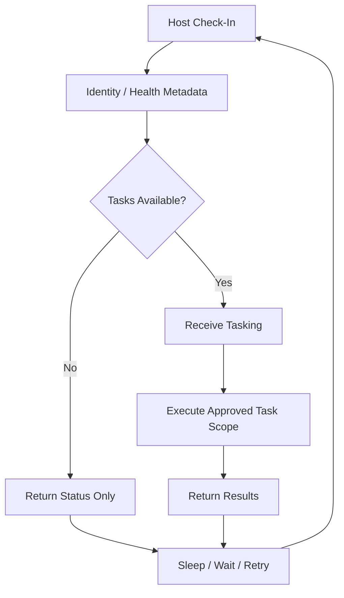
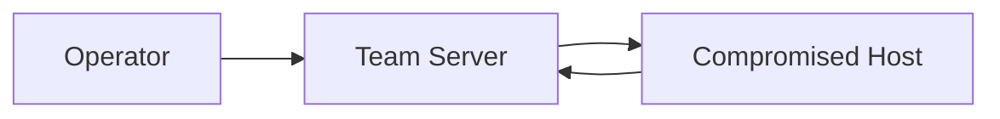
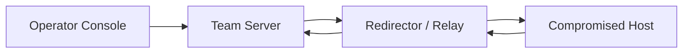

# 📡 C2 Communication — How an Operation Stays Connected

> **Module:** Red Teaming → Command and Control  
> **Difficulty:** Beginner → Advanced  
> **Tags:** `#c2` `#command-and-control` `#redteam` `#network-traffic` `#detection` `#mitre-attack`  
> **Authorized-use note:** This topic is for sanctioned adversary emulation, detection engineering, and defensive education. It explains communication design, tradeoffs, and blue-team detection without giving step-by-step intrusion instructions.

---

## Relevant ATT&CK Concepts

- **TA0011 — Command and Control**
- **T1071 — Application Layer Protocol**
- **T1095 — Non-Application Layer Protocol**
- **T1573 — Encrypted Channel**
- **T1001 — Data Obfuscation**
- **T1132 — Data Encoding**

MITRE ATT&CK highlights an important reality: adversaries often use **common protocols** such as web traffic, DNS, file transfer, or other network transports because blending into ordinary enterprise traffic is usually more effective than inventing something exotic.

---

## Table of Contents

1. [Why C2 Communication Matters](#why-c2-communication-matters)
2. [Beginner Mental Model](#beginner-mental-model)
3. [What a C2 Channel Must Actually Do](#what-a-c2-channel-must-actually-do)
4. [Communication Lifecycle](#communication-lifecycle)
5. [Common Communication Models](#common-communication-models)
6. [Protocol Families and Tradeoffs](#protocol-families-and-tradeoffs)
7. [Architecture Patterns](#architecture-patterns)
8. [The C2 Design Triangle](#the-c2-design-triangle)
9. [What Mature Operators Think About](#what-mature-operators-think-about)
10. [Detection and Hunting Ideas](#detection-and-hunting-ideas)
11. [Defensive Controls](#defensive-controls)
12. [Authorized Adversary-Emulation Checklist](#authorized-adversary-emulation-checklist)
13. [Common Analyst Mistakes](#common-analyst-mistakes)
14. [Practical Learning Exercises](#practical-learning-exercises)
15. [Key Takeaways](#key-takeaways)

---

## Why C2 Communication Matters

Initial access only creates a **foothold**. Command and control is what turns that foothold into a manageable operation.

Without C2 communication, an implant or agent is mostly isolated. With a communication path, an operator can:

- verify the host is still alive
- understand host identity and privilege context
- queue tasks or instructions
- receive task results or status
- update configuration
- shut down or revoke access safely

In other words:

```text
Initial Access = Entry
C2 Communication = Control
Control + Time = Operational Reach
```

For defenders, C2 traffic is also one of the best places to detect an intrusion because most operations eventually need to **talk outward** somehow.

---

## Beginner Mental Model

Think of C2 like a **radio link between a field unit and headquarters**.

- The **operator** is headquarters.
- The **compromised host** is the field unit.
- The **communication channel** is the radio path.
- The **tasking** is the message being sent.
- The **results** are the reply.

```text
HQ / Operator  ←──── communication path ────→  Field Unit / Implant
      sends tasks                                     sends results
```

A beginner-friendly way to remember it:

> **C2 is not just “remote control.”** It is a full communication system for identity, timing, reliability, task delivery, and response collection.

---

## What a C2 Channel Must Actually Do

A real-world C2 channel is more than “send command, get output.” Even in authorized adversary emulation, the communication layer usually has several jobs.

### 1. Registration

A newly established agent needs to identify itself in some form:

- host identity
- operating system
- user context
- privilege level
- health or version state

### 2. Task Retrieval

The host needs a way to ask:

```text
Do you have work for me?
```

This may happen on a schedule, on demand, or through a more interactive session model.

### 3. Result Return

The channel must return:

- task output
- success/failure state
- timing or retry status
- error messages

### 4. Session Control

Operators may need to:

- pause communications
- change timing
- rotate destinations
- revoke or disable the channel

### 5. Resilience

Networks are unstable. Proxies fail. Domains get blocked. Hosts go offline. Mature communication design assumes failure and plans for:

- retry behavior
- fallback destinations
- bounded error handling
- controlled loss of contact

---

## Communication Lifecycle

A useful way to understand C2 is to see it as a repeated lifecycle rather than a single “connection.”



### Phase-by-phase view

| Phase | Purpose | Practical Question |
|---|---|---|
| **Check-in** | Confirm the host is reachable | Is the agent still alive? |
| **Identification** | Tie traffic to a specific host/session | Which host is this? |
| **Tasking** | Deliver work or configuration | What should happen next? |
| **Execution** | Perform the authorized action | Was the requested task completed? |
| **Return path** | Send output back | What did the host observe or do? |
| **Sleep / retry** | Reduce noise and survive outages | When should it speak again? |

---

## Common Communication Models

Different operations need different kinds of channels. There is no single “best” model.

### 1. Polling / Beaconing

The host checks in periodically and asks for work.

**Strengths:**
- simple
- reliable
- easy to manage at scale

**Weaknesses:**
- timing patterns may stand out
- can be less responsive for hands-on activity

### 2. Interactive Sessions

The channel behaves more like an active conversation with fast back-and-forth exchanges.

**Strengths:**
- responsive
- useful for operator-driven actions

**Weaknesses:**
- more traffic
- more obvious if the environment does not normally support that behavior

### 3. Layered or Relayed Communication

The endpoint does not talk directly to the main team server. One or more relays sit in the middle.

**Strengths:**
- separation between endpoint-facing and operator-facing infrastructure
- easier containment of exposure if one layer is detected

**Weaknesses:**
- more operational complexity
- more moving parts to monitor and maintain

### 4. Internal Relay / Pivot-Aware Communication

Sometimes traffic is relayed through already-controlled internal systems or approved choke points inside the target environment.

**Strengths:**
- can reflect how real adversaries move communications through trusted paths

**Weaknesses:**
- complicated
- risky in a live environment if not tightly scoped and controlled

> In authorized adversary emulation, complexity should always be justified by the learning objective, not by novelty alone.

---

## Protocol Families and Tradeoffs

MITRE ATT&CK notes that adversaries often choose **application-layer protocols** because they resemble ordinary traffic. Defenders should remember that the protocol alone rarely answers the whole question; context matters more.

| Protocol Family | Why It Gets Used | Strengths | Weaknesses | Defender Lens |
|---|---|---|---|---|
| **HTTP / HTTPS** | Blends with normal web traffic | Proxy-friendly, common, scalable | Metadata is still observable; reputation matters | Check destination rarity, process ancestry, headers, proxy path, timing |
| **DNS** | Often widely allowed and always present | Survives restrictive environments, useful for lightweight signaling | Low bandwidth, highly watched in mature environments | Look for unusual query structure, timing, destination patterns |
| **Mail / Messaging-style protocols** | May resemble collaboration or notification traffic | Familiar traffic class in some orgs | Hard to justify from many hosts | Validate whether the host role should generate it |
| **Raw TCP / UDP / ICMP or custom transports** | Flexible and sometimes useful in segmented networks | Can avoid application-layer assumptions | Usually stands out more in enterprise monitoring | Hunt for unusual destinations, protocols, or direct outbound flows |
| **Internal protocols (for relays)** | Used between pivot nodes, proxies, or enclave systems | Can follow trusted internal paths | Internal east-west traffic is often heavily baselineable | Correlate with host roles, admin tools, and segmentation policy |

### Easy memory trick

```text
Common protocol  ≠  safe protocol
Encrypted traffic ≠  trustworthy traffic
Rare destination + odd process + regular timing = strong hunting lead
```

---

## Architecture Patterns

### 1. Direct Communication

The simplest model is direct contact between the host and the main server.



**Why it matters:** easy to understand, but also easy to attribute and block.

### 2. Layered Communication with Redirectors

A more mature pattern places infrastructure between the host and the main control plane.



**Why it matters:** separates exposed infrastructure from core coordination systems.

### 3. Multi-Layer Enterprise View

This diagram helps explain why defenders need both endpoint and network telemetry.

```text
[Process / Script / Service]
           │
           ▼
   [Host Network Stack]
           │
           ▼
    [Proxy / Firewall]
           │
           ▼
 [Internet Destination Layer]
           │
           ▼
   [Relay / SaaS / Team Infra]
```

A blue team that only sees the destination misses the process. A blue team that only sees the process misses the network path. The strongest detections combine both.

---

## The C2 Design Triangle

Most C2 communication design comes down to balancing three things:

```text
                 Stealth
                   /\
                  /  \
                 /    \
                /      \
     Reliability -------- Interactivity
```

You usually cannot maximize all three at once.

- **More interactivity** usually means more frequent traffic.
- **More stealth** often means less responsiveness.
- **More reliability** can mean more fallback logic, more infrastructure, and more observable behavior.

### Practical meaning

| If you optimize for... | You often sacrifice... |
|---|---|
| **Interactivity** | Quietness |
| **Stealth** | Speed and convenience |
| **Reliability** | Simplicity |

This triangle is one of the easiest ways to reason about why beaconing, encrypted channels, obfuscation, and covert channels are separate note topics.

---

## What Mature Operators Think About

In real adversary simulation, “Can it communicate?” is only the first question. The better questions are:

### 1. Does it fit the environment?

Traffic should make sense for:

- the host type
- the user role
- the network segment
- the organization’s proxy and egress model

A workstation, jump host, domain controller, kiosk, and build server should not all look the same on the network.

### 2. What metadata will defenders still see?

Even when content is protected, defenders may still observe:

- destination IP or domain
- timing and recurrence
- packet size or flow volume
- TLS fingerprints or certificate traits
- which process initiated the traffic
- whether the traffic used the corporate proxy

### 3. How does the channel fail?

Failure planning is a major part of mature communication design:

- What happens if the destination is blocked?
- What happens if the host loses DNS or proxy access?
- What happens if the endpoint is isolated but not powered off?
- What happens if only some paths are allowed during business hours?

### 4. How is safety enforced?

For an authorized exercise, safety is non-negotiable:

- scoped infrastructure only
- approved time windows
- revocation / shutdown capability
- deconfliction with defenders and stakeholders
- bounded data handling
- logging sufficient for after-action review

---

## Detection and Hunting Ideas

Defenders rarely need to read every packet to detect C2 well. They need to understand **behavior**.

### A practical hunting workflow

| Question | What to Inspect | Why It Helps |
|---|---|---|
| **Who communicated?** | Hostname, user, process, parent process | Identifies whether the source makes sense |
| **Where did it go?** | Domain, IP, ASN, geo, reputation, rarity | Rare destinations matter more than popular ones |
| **When did it happen?** | Time-of-day, weekends, user idle periods, recurrence | Periodic or out-of-hours traffic often stands out |
| **How did it travel?** | Proxy path, TLS metadata, DNS behavior, port/protocol | Reveals bypasses and protocol mismatch |
| **How much data moved?** | Byte counts, flow duration, burst pattern | Tiny repetitive flows and long-lived sessions can both be suspicious |

### High-value signals

- recurring outbound connections to a **low-prevalence destination**
- network activity from an **unexpected process**
- traffic that **ignores business hours** or user presence
- encrypted sessions that **bypass expected proxies**
- repeated small flows with stable cadence
- host-role mismatches, such as infrastructure talking like a browser when it is not one

### False positives to keep in mind

Good analysts do not confuse all regular traffic with C2. Common lookalikes include:

- software update agents
- browser sync activity
- endpoint security telemetry
- backup agents
- remote monitoring and management tools
- cloud identity or collaboration clients

That is why **baseline first, hunt second** is such an important rule.

---

## Defensive Controls

| Control | Why It Matters |
|---|---|
| **Egress filtering** | Limits what internal systems can talk to directly |
| **Proxy enforcement** | Makes outbound traffic more observable and controllable |
| **DNS logging and analytics** | Helps find unusual destinations and signal patterns |
| **Endpoint-network correlation** | Ties a connection to the exact initiating process |
| **Destination rarity scoring** | Rare external services are excellent hunt pivots |
| **Certificate and TLS inspection strategy** | Adds context when content itself is encrypted |
| **Segmentation and allow-listing** | Reduces where a compromised system can communicate |
| **Fast isolation playbooks** | Lets defenders contain suspected C2 without improvising |

### Defender mindset

```text
Don't ask only:
"Is this packet malicious?"

Also ask:
"Should this host, using this process, be talking to this destination,
this often, in this way, at this time?"
```

That question is often far more powerful than signature matching alone.

---

## Authorized Adversary-Emulation Checklist

This section is especially important for red teamers. Good C2 communication design is not only about realism; it is also about **control and safety**.

### Before the engagement

- confirm written authorization and scope
- define allowed infrastructure and destinations
- agree on communication windows and deconfliction rules
- decide how the channel will be revoked or disabled
- identify where logs will be retained for reporting and lessons learned

### During the engagement

- use only approved communication paths
- monitor for unintended spread, unstable behavior, or excessive noise
- keep telemetry sufficient for reconstruction and reporting
- coordinate when detection objectives require defender visibility

### After the engagement

- account for all communication endpoints used
- remove or disable authorized infrastructure cleanly
- document what defenders saw, what they missed, and why
- convert communication observations into durable detections and egress policy improvements

> The safest red team is not the one with the most complex C2. It is the one with the clearest control, the best documentation, and the strongest deconfliction.

---

## Common Analyst Mistakes

### Mistake 1: Focusing only on malware families

C2 detection should not depend entirely on recognizing a named tool. Many strong detections work even when the specific tooling changes.

### Mistake 2: Assuming encrypted means invisible

Encryption hides content, not:

- timing
- volume
- path
- destination
- source process
- business context

### Mistake 3: Treating rare traffic as automatically malicious

Rare traffic is a **lead**, not a verdict. Validation matters.

### Mistake 4: Ignoring the host role

The same traffic may be ordinary for a browser-heavy workstation and strange for a database server.

### Mistake 5: Looking at network or endpoint data in isolation

The best investigations combine both.

---

## Practical Learning Exercises

These are safe study ideas for learners, defenders, and authorized red-team trainees.

### Exercise 1: Build a mental baseline

Pick three benign systems in a lab or enterprise-approved environment and compare:

- normal destinations
- normal proxy behavior
- normal timing patterns
- common parent processes for outbound traffic

### Exercise 2: Classify communication style

Take examples of benign outbound traffic and label them conceptually as:

- periodic
- bursty
- interactive
- update-related
- user-driven

This builds intuition for spotting what does not fit.

### Exercise 3: Sketch an enterprise egress diagram

Draw how traffic leaves the environment:

```text
Host → Proxy → Firewall → Internet → Service
```

Then mark where defenders can observe:

- DNS
- proxy logs
- TLS metadata
- endpoint process telemetry
- firewall flow records

### Exercise 4: Turn observations into detections

For each suspicious pattern, ask:

- what log source would show this?
- what host types should be excluded?
- what business tools look similar?
- how would we validate it safely?

These exercises teach the **thinking style** behind C2 analysis without teaching abusive tradecraft.

---

## Key Takeaways

- C2 communication is the **operational heartbeat** of an intrusion.
- The job of a C2 channel is broader than “send command, get output.”
- Protocol choice matters, but **context matters more**.
- Mature designs balance **stealth, reliability, and interactivity**.
- Defenders do not need perfect packet visibility if they have strong metadata, host context, and egress governance.
- In authorized adversary emulation, safe C2 design means **scope, control, deconfliction, and clean shutdown**.

---

## See Also

- `beaconing.md`
- `encrypted-c2.md`
- `covert-channels.md`
- `traffic-obfuscation.md`
