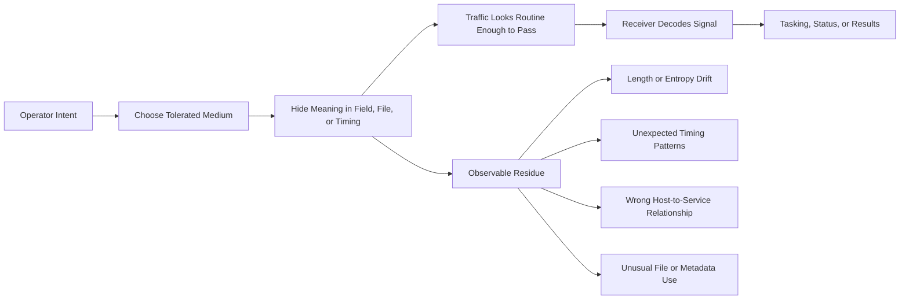
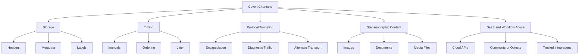
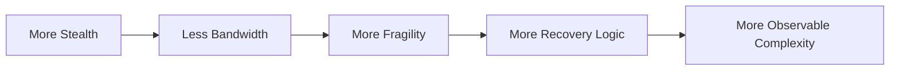
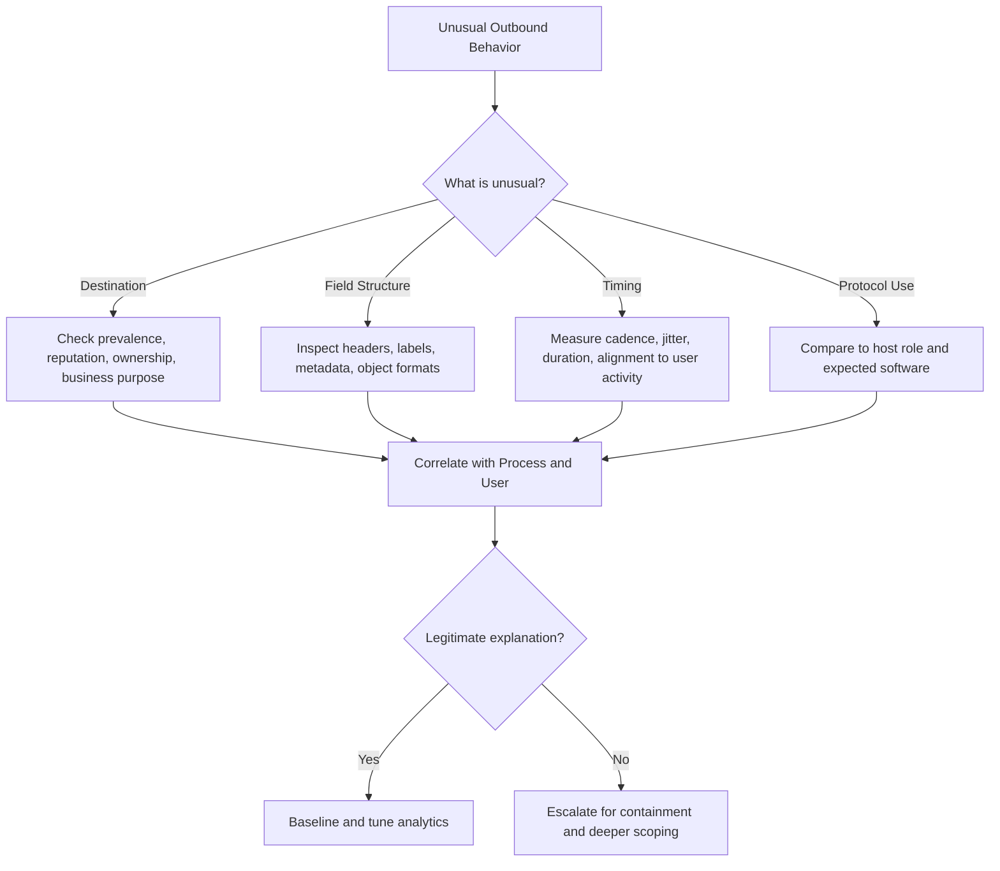

# Covert Channels

> **Phase 12 — Command and Control**  
> **Focus:** How authorized adversary-emulation teams evaluate whether commands, identifiers, or results could be hidden inside tolerated traffic, metadata, files, or timing patterns.  
> **Safety note:** This note is for **authorized red teaming, purple teaming, and defensive validation only**. It explains concepts, tradeoffs, detection ideas, and safe planning considerations without providing step-by-step intrusion instructions.

---

**Relevant ATT&CK concepts:** TA0011 Command and Control | T1001 Data Obfuscation | T1572 Protocol Tunneling | T1095 Non-Application Layer Protocol

---

## Table of Contents

1. [Why It Matters](#why-it-matters)
2. [Beginner View](#beginner-view)
3. [Covert vs. Encrypted vs. Obfuscated](#covert-vs-encrypted-vs-obfuscated)
4. [Mental Model](#mental-model)
5. [Main Families of Covert Channels](#main-families-of-covert-channels)
6. [Tradeoffs and Design Constraints](#tradeoffs-and-design-constraints)
7. [Authorized Red-Team Framing](#authorized-red-team-framing)
8. [Documented Patterns in Public Reporting](#documented-patterns-in-public-reporting)
9. [Detection Opportunities](#detection-opportunities)
10. [Practical Hunting Workflow](#practical-hunting-workflow)
11. [Defensive Controls](#defensive-controls)
12. [Common Mistakes](#common-mistakes)
13. [Key Takeaways](#key-takeaways)

---

## Why It Matters

Covert channels matter because many organizations block obviously suspicious traffic but still allow a large amount of legitimate outbound communication. If defenders think only in terms of **ports and protocols**, they may miss the more important question:

**“Is this approved traffic being used in an unapproved way?”**

That is the real teaching value of covert channels in red-team work. The lesson is rarely “one weird trick bypasses security.” The lesson is usually:

- allowed traffic is not automatically safe,
- business-critical services create trust blind spots,
- and detection quality depends on behavioral context, not just signatures.

For beginners, covert channels explain why “HTTPS allowed” is not the same thing as “communications controlled.” For advanced defenders, they force better baselining of DNS, SaaS APIs, metadata fields, timing patterns, and host-to-service relationships.

---

## Beginner View

A **covert channel** is a hidden communication path inside something that already looks normal or tolerated.

Think of it like this:

- **Normal channel:** a user sends a standard web request to a legitimate service.
- **Covert channel:** hidden meaning is carried inside that request’s timing, headers, identifiers, media, or protocol behavior.

The attacker is not always trying to make traffic invisible. More often, they are trying to make it look **boring enough not to be investigated**.

### Simple intuition

If normal C2 is like openly talking on a phone call, a covert channel is like:

- hiding meaning inside pauses,
- slipping notes inside an allowed envelope,
- or embedding instructions inside content everyone expects to see anyway.

That is why covert channels are often **low-bandwidth but high-value**. They may carry only:

- host identifiers,
- short commands,
- tasking beacons,
- routing hints,
- or “I am still here” status messages.

---

## Covert vs. Encrypted vs. Obfuscated

These concepts are related, but they are not the same.

| Concept | Main Idea | What Defenders Still See | Why It Matters |
|---|---|---|---|
| **Encrypted traffic** | Content is unreadable without keys | Destination, timing, volume, protocol, certificates, process context | Encryption protects content, not necessarily intent |
| **Obfuscated traffic** | Traffic is reshaped to be harder to classify | Inconsistencies, unusual formatting, metadata, behavior | Obfuscation changes appearance more than purpose |
| **Covert channel** | Meaning is hidden inside something tolerated | Residual anomalies in usage, timing, field structure, workflow context | The channel itself is disguised as ordinary behavior |
| **Side channel** | Information is inferred from indirect effects | Cache timing, power use, physical leakage | Usually a different problem from network C2 |

### Important distinction

A covert channel can also be encrypted and obfuscated.

A mature defender therefore asks three separate questions:

1. **What protocol is this?**
2. **What is the traffic trying to look like?**
3. **Does this host have any legitimate reason to use that protocol or service this way?**

---

## Mental Model

A covert channel usually has five parts:

1. **A tolerated medium** — something the environment already allows.
2. **An encoding surface** — where meaning is hidden.
3. **A cadence** — how often communication happens.
4. **A decoding point** — where the hidden signal is interpreted.
5. **An operational goal** — why this channel exists at all.

### Common encoding surfaces

Hidden meaning is often placed in:

- request or response metadata,
- query names and labels,
- headers or cookies,
- file structure or media content,
- packet sizes or ordering,
- or the time gap between otherwise ordinary events.

The protocol may be normal. The **usage pattern** is what becomes abnormal.

---

## Main Families of Covert Channels

### 1. Storage channels

A **storage channel** hides meaning inside a field, object, or data structure.

Typical examples at a high level include:

- name-resolution labels,
- HTTP headers or cookies,
- URL paths or parameters,
- file metadata,
- or SaaS object fields such as titles, comments, or tags.

### Why defenders miss them

Because many tools focus on payload body content but do not deeply baseline:

- field length,
- field entropy,
- field rarity,
- or whether a host normally uses that field at all.

### What defenders should watch

- unusually long identifiers,
- repeated structured randomness,
- headers that are present but make no application sense,
- metadata fields that change frequently for no business reason,
- and high-cardinality values in places that are usually stable.

---

### 2. Timing channels

A **timing channel** hides meaning in **when** events occur rather than only in their content.

For example, the useful signal may be encoded in:

- short vs. long delays,
- fixed vs. bursty check-in intervals,
- event ordering,
- or response timing patterns.

These channels are often slow, but they can be surprisingly resilient because the content itself may look harmless.

### Why they are difficult

Timing channels often evade shallow inspection because no single packet looks suspicious. The suspicious part appears only when defenders analyze:

- periodicity,
- jitter,
- user activity alignment,
- and long-term frequency patterns.

### Defender mindset

Ask whether the traffic looks like a **machine schedule**, a **human schedule**, or neither.

---

### 3. Protocol tunneling and non-application-layer channels

Some covert channels use protocols that are permitted for diagnostics, infrastructure, or internal tooling, but not expected for sustained command-and-control behavior.

At a conceptual level, this can include:

- tunneling through approved protocols,
- hiding signaling in lower-layer or diagnostic traffic,
- or encapsulating one communication pattern inside another.

The important defensive question is not just whether the protocol is allowed, but whether the **host role, process ancestry, and traffic pattern** fit legitimate use.

### Typical red-team teaching point

An organization may technically “allow” a protocol for troubleshooting, but have no alerting for:

- persistent workstation use,
- large or repeated message sizes,
- or connections originating from unexpected processes.

---

### 4. Steganographic content channels

A **steganographic channel** hides instructions or identifiers inside content such as images, documents, audio, or other files that appear benign.

This family is especially useful for explaining a key concept:

> The suspicious artifact may look harmless in isolation; the risk appears when you correlate file handling, process behavior, and outbound communications.

### Defensive clues

Look for combinations such as:

- unusual media manipulation by non-media processes,
- repeated download of external content with changing structure,
- unexpected parsing of image or document formats,
- or content fetches that make little sense for the host’s role.

---

### 5. Workflow and SaaS channels

Modern covert communication does not have to hide only in raw protocols. It can hide in **business workflows**.

Conceptually, that means signals can ride inside:

- collaboration platforms,
- cloud APIs,
- ticketing systems,
- messaging integrations,
- or shared content services.

### Why this matters

Defenders are often more comfortable blocking unknown domains than questioning trusted SaaS workflows. That makes identity, application governance, and API telemetry extremely important.

### What to baseline

- which users normally access which SaaS applications,
- which hosts normally call which APIs,
- expected token provenance,
- object creation rates,
- and whether service usage matches business function.

---

## Channel taxonomy at a glance

| Channel Family | Where the hidden meaning lives | Typical Strength | Typical Weakness | Best Defensive Lens |
|---|---|---|---|---|
| **Storage** | Fields, headers, labels, metadata | Simple and flexible | Visible once fields are normalized | Schema + entropy + rarity analysis |
| **Timing** | Delays, ordering, cadence | Hard to spot with packet-only review | Very low bandwidth | Time-series baselines |
| **Protocol tunneling** | Encapsulation inside tolerated protocols | Can cross restrictive egress controls | Often creates unusual flow patterns | Protocol-aware monitoring |
| **Steganographic** | Media or document structure | Blends with normal content exchange | Requires file handling artifacts | File + network correlation |
| **SaaS/workflow** | Cloud objects and business processes | Hides inside trusted platforms | Leaves identity and audit evidence | App governance + identity analytics |

---

## Tradeoffs and Design Constraints

Covert channels are always a compromise.

| Design Goal | What Teams Want | What Usually Happens in Reality |
|---|---|---|
| **Stealth** | Traffic blends into normal business activity | Often reduces throughput and increases complexity |
| **Bandwidth** | Enough room for commands, status, and results | Higher throughput usually creates clearer anomalies |
| **Reliability** | Messages arrive in order and survive filtering | More reliability often means more protocol structure |
| **Operator control** | Predictable, low-friction tasking | Better control often means more frequent check-ins |
| **Low detection risk** | Minimal logging and low prevalence | Rare destinations or odd fields may stand out faster |

### The core tension

### What advanced defenders should remember

The stealthiest channel is not always the most dangerous one. In real operations, defenders often catch covert channels because operators prioritize:

- reliability over realism,
- speed over patience,
- or convenience over strict environmental fit.

That is good news for blue teams.

---

## Authorized Red-Team Framing

In an **authorized** adversary-emulation engagement, covert-channel content should be framed as a way to test monitoring assumptions, not as a license to “get creative” without guardrails.

### Questions to answer before any simulation

| Planning Question | Why It Matters |
|---|---|
| **What specific defensive assumption are we testing?** | Example: “Do we detect suspicious DNS usage on user endpoints?” |
| **Which channels are explicitly in scope?** | Keeps work aligned to the rules of engagement |
| **What safety limits exist on destinations, frequency, and data type?** | Prevents operational or legal surprises |
| **What telemetry should the blue team be expected to use?** | Makes results measurable |
| **What constitutes success?** | Detection, triage quality, containment speed, or analytic gaps |

### Safe engagement principles

- Use **pre-approved infrastructure and destinations** only.
- Prefer **benign identifiers and synthetic data** rather than sensitive content.
- Keep simulations **minimal and measurable**, not “as stealthy as possible at any cost.”
- Coordinate **deconfliction and emergency stop conditions** in advance.
- Treat covert-channel testing as a **validation exercise for monitoring**, not as a stunt.

### Good red-team learning objectives

- Can defenders distinguish normal DNS/API use from hidden signaling?
- Can analysts correlate network traffic to the responsible process and user?
- Can the organization identify trusted services being used in untrusted ways?
- Can detections survive encryption, metadata variation, and low-volume timing changes?

---

## Documented Patterns in Public Reporting

Public ATT&CK-aligned reporting shows that covert communication is not one single trick. It appears in several forms.

| Documented Pattern | Publicly Reported Example | Defensive Lesson |
|---|---|---|
| **HTTP metadata misuse** | MITRE ATT&CK describes Okrum hiding messages in Cookie and Set-Cookie headers | Header content and structure deserve baselining |
| **Steganographic C2 content** | ATT&CK examples include HAMMERTOSS, LightNeuron, LunarWeb, and LunarMail using image or document-related hiding | File, process, and network telemetry must be correlated |
| **Diagnostic or alternate transport use** | ATT&CK lists families using ICMP, TCP, UDP, or related non-application-layer communications | “Allowed for troubleshooting” is not the same as “safe at scale” |
| **Protocol tunneling** | ATT&CK T1572 includes DNS-over-HTTPS, SSH tunneling, and encapsulated traffic patterns in public reporting | Context and destination governance matter as much as packet inspection |

These examples are useful for **defender education**, because they show that covert channels often leave evidence in at least one of these areas:

- identity,
- host role,
- process ancestry,
- timing,
- field structure,
- or destination rarity.

---

## Detection Opportunities

The best detection opportunities come from asking how a protocol or service is **normally used in your environment**.

### 1. DNS-focused signals

Watch for:

- unusually long or highly random-looking labels,
- repeated lookups with similar structure but changing substrings,
- elevated NXDOMAIN rates,
- rare external resolvers or unexpected DNS-over-HTTPS destinations,
- and systems whose DNS behavior does not fit their role.

### Good analytic question

Does this host generate DNS requests that look more like **encoded payload fragments** than ordinary service discovery?

---

### 2. HTTP/S and API-focused signals

Watch for:

- oversized or highly variable headers,
- cookies or identifiers that do not fit the application,
- repeated small requests to low-prevalence endpoints,
- abnormal user-agent diversity from a single process,
- and API usage by hosts that should never call that service directly.

### Good analytic question

Is the traffic merely encrypted, or is it also **behaviorally wrong** for the host, user, or process behind it?

---

### 3. Timing-focused signals

Watch for:

- highly regular check-ins from hosts that should be event-driven,
- tiny exchanges that recur for days or weeks,
- “human” applications behaving with machine-like precision,
- or traffic bursts that repeatedly align to specific intervals.

### Good analytic question

Would a normal user, application, or scheduler create this timing pattern for a legitimate reason?

---

### 4. File and media correlation signals

Watch for:

- media downloads followed by unusual parsing or transformation,
- non-media processes manipulating image or document files,
- outbound communications immediately after local file modifications,
- or rare MIME types and object sizes tied to suspicious process trees.

### Good analytic question

Is this content being handled as a normal business artifact, or as a **carrier for hidden signaling**?

---

### 5. SaaS and workflow signals

Watch for:

- new or low-prevalence application use,
- token activity from strange hosts,
- excessive object creation or comment churn,
- impossible travel or impossible device context for SaaS access,
- and privileged integrations talking outside their normal pattern.

### Good analytic question

Is this trusted platform being used in a way that matches its business purpose for this user and endpoint?

---

## Practical Hunting Workflow

A strong investigation usually moves from broad anomaly to narrow explanation.

### Practical hunting checklist

1. **Start with the host role.** Is this a workstation, server, appliance, or developer box?
2. **Identify the responsible process.** “HTTPS” is not enough; which executable initiated it?
3. **Assess destination legitimacy.** A known provider can still be an abused provider.
4. **Inspect shape, not just content.** Length, entropy, cardinality, cadence, and rarity matter.
5. **Compare to peers.** If one system behaves differently from similar systems, ask why.
6. **Use long time windows.** Low-and-slow channels are often obvious only over days.

### Three practical, non-procedural examples

| Scenario | What Looks Normal | What Actually Stands Out |
|---|---|---|
| **Workstation DNS traffic** | The host performs regular name lookups | Labels are unusually long, high-entropy, and consistently structured |
| **Encrypted web traffic** | Requests use HTTPS to a common hosting provider | The host sends tiny periodic requests with unstable custom headers from an unexpected parent process |
| **Cloud collaboration access** | A trusted SaaS platform is in use | A server account creates repetitive objects at machine cadence with no business justification |

---

## Defensive Controls

| Control | Why It Helps |
|---|---|
| **Tight egress governance** | Limits which destinations, APIs, and protocols can be used from each segment or role |
| **Process-aware network telemetry** | Lets analysts tie suspicious communication to the executable and user behind it |
| **DNS and proxy baselining** | Reveals unusual label structure, endpoint rarity, and traffic cadence |
| **SaaS and identity analytics** | Trusted platforms are safer only when access patterns are governed and monitored |
| **File + network correlation** | Essential for spotting steganographic or content-based channels |
| **Role-based allowlists** | A finance workstation, build server, and domain controller should not share the same outbound profile |
| **Threat-hunting feedback loops** | Every suspicious pattern can improve future analytics and detections |

### Especially effective defensive ideas

- Baseline the **top destinations per host role**.
- Track **rare external services** contacted by internal endpoints.
- Alert on **unexpected protocol use by unusual processes**.
- Measure **field entropy and size drift** for commonly used protocols.
- Review **new SaaS applications and integrations** as part of security governance.

---

## Common Mistakes

### Mistake 1: Treating encryption as stealth

Encrypted traffic can still be highly suspicious if destination, cadence, process, and host role do not fit.

### Mistake 2: Focusing only on ports and protocols

Most meaningful detection comes from **usage context**, not only from protocol names.

### Mistake 3: Ignoring low-volume anomalies

Covert channels are often intentionally small. If your analytics only prioritize volume, you may miss them.

### Mistake 4: Forgetting identity and application context

Trusted SaaS traffic is much easier to evaluate when you know which user, device, token, and integration produced it.

### Mistake 5: Looking at network data alone

Some of the strongest signals appear only when combining:

- endpoint telemetry,
- proxy or DNS logs,
- identity records,
- and file activity.

---

## Key Takeaways

- A covert channel hides meaning inside **tolerated behavior**, not necessarily inside obviously malicious traffic.
- The strongest defensive question is: **“Is this being used the way this host, process, and user should use it?”**
- Storage, timing, tunneling, steganographic, and SaaS-based channels each leave different kinds of residue.
- Stealth, bandwidth, reliability, and realism are always in tension.
- In authorized red-team work, covert channels should validate **monitoring assumptions and defensive visibility**, not chase unsafe realism.
- Defenders usually win by correlating **context, cadence, metadata, and role-based expectations**.
