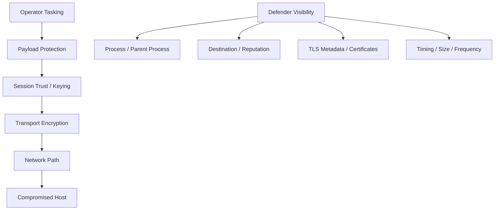
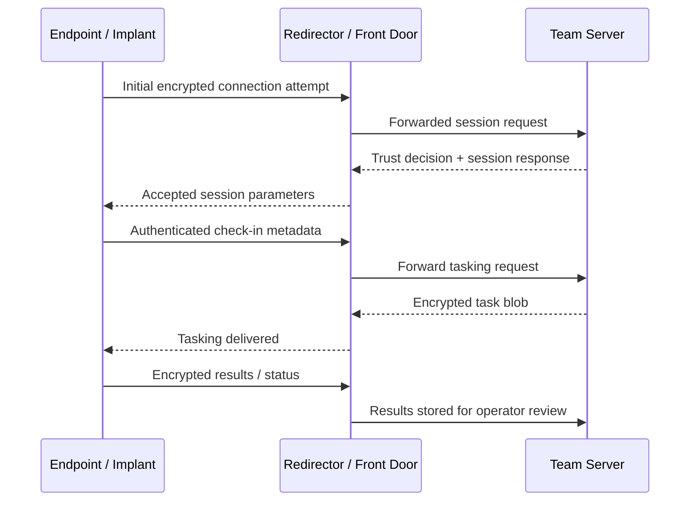
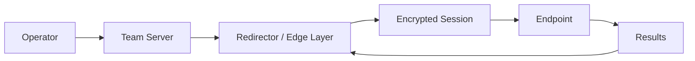
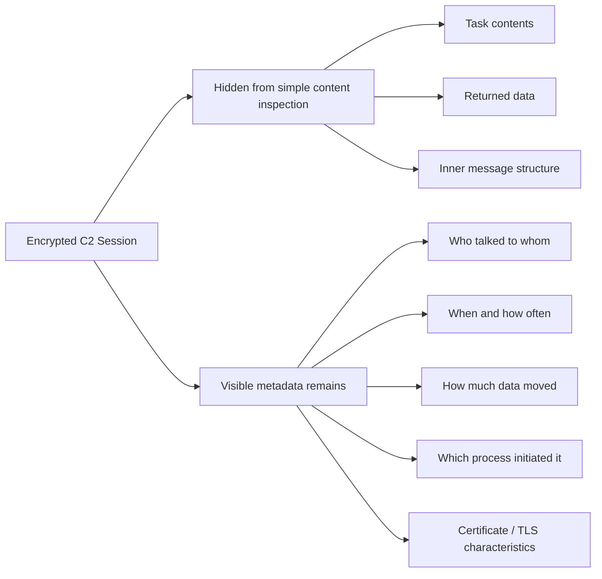

# Encrypted C2

> **Phase 12 — Command and Control**  
> **Focus:** How authorized red teams and defenders should think about encrypted command-and-control channels: what encryption protects, what it does **not** protect, and how to detect suspicious channels without relying on plaintext inspection.  
> **Safety note:** This note is for **authorized adversary emulation, purple teaming, and defense**. It explains architecture, tradeoffs, telemetry, and safe lab ideas without giving step-by-step intrusion instructions.

---

**Relevant ATT&CK concepts:** TA0011 Command and Control | T1573 Encrypted Channel | T1573.001 Symmetric Cryptography | T1573.002 Asymmetric Cryptography

---

## Table of Contents

1. [Why It Matters](#why-it-matters)
2. [Beginner View](#beginner-view)
3. [Mental Model: What “Encrypted C2” Really Means](#mental-model-what-encrypted-c2-really-means)
4. [The Three Protection Layers](#the-three-protection-layers)
5. [High-Level Session Lifecycle](#high-level-session-lifecycle)
6. [Common Authorized-Exercise Patterns](#common-authorized-exercise-patterns)
7. [What Defenders Can Still See](#what-defenders-can-still-see)
8. [Operator Tradeoffs and Failure Modes](#operator-tradeoffs-and-failure-modes)
9. [Detection Opportunities](#detection-opportunities)
10. [Defensive Controls](#defensive-controls)
11. [Practical Safe Exercises](#practical-safe-exercises)
12. [Key Takeaways](#key-takeaways)

---

## Why It Matters

Encryption is normal on modern networks. Browsers, update agents, identity platforms, chat tools, cloud APIs, and business applications all depend on it. That creates an important red-team and blue-team lesson:

> **Encrypted does not mean trusted.** It only means the content is harder to read in transit.

In an authorized adversary-emulation exercise, encrypted C2 teaches three big ideas:

1. **Why defenders cannot depend on plaintext inspection alone** for detection.
2. **Why metadata becomes critical** when content is hidden.
3. **Why mature operations care about trust, identity, and session design** just as much as raw connectivity.

MITRE ATT&CK tracks encrypted channels under **T1573**, with real-world procedures ranging from TLS-wrapped traffic to layered schemes that combine transport encryption with additional payload protection. The lesson for defenders is consistent: once content visibility drops, process context, destination reputation, certificate behavior, and traffic shape matter much more.

---

## Beginner View

Think of encrypted C2 like this:

- A compromised system needs a way to **check in**.
- The operator needs a way to **send instructions**.
- The host needs a way to **send results back**.
- Encryption tries to stop everyone in the middle from easily reading or modifying that exchange.

If plain C2 is like sending postcards, encrypted C2 is like sending messages inside a locked envelope.

That sounds powerful, but the envelope still reveals useful clues:

- who sent it
- where it went
- when it was sent
- how often messages appear
- how large the messages are
- which application sent them

That is why defenders often catch suspicious encrypted traffic through **context**, not content.

---

## Mental Model: What “Encrypted C2” Really Means

“Encrypted C2” is not one thing. In practice, it usually means one or more of the following:

| Layer | What is being protected | Typical purpose | What defenders may still observe |
|---|---|---|---|
| **Transport encryption** | The network session itself | Prevent casual interception in transit | IPs, ports, timing, certificate details, process context |
| **Session authentication** | Who is allowed to talk to whom | Prevent sinkholing, hijacking, or unauthorized peers | Failed handshakes, certificate anomalies, unusual trust chains |
| **Payload encryption** | The actual tasking/results inside the channel | Add protection even if transport is visible or terminated upstream | Message sizes, cadence, flow symmetry, endpoint behavior |

A useful way to remember it:

```text
Transport encryption hides the road conversation.
Session authentication decides who may enter the road.
Payload encryption hides the package inside the vehicle.
```

### Why layering matters

A sanctioned red-team exercise may simulate more than one protection layer at once because each layer solves a different problem:

- **TLS/SSL** protects data in transit.
- **Asymmetric cryptography** helps with identity and key exchange.
- **Symmetric cryptography** is efficient for ongoing message protection.
- **Mutual authentication** improves trust between endpoint and server.

This is one reason encrypted C2 can look simple from the outside while being carefully structured internally.

---

## The Three Protection Layers

### 1. Transport layer

This is the outer secure channel, often something the network already expects to see.

**Goal:** protect the connection while it crosses the network.

Common ideas at this layer:

- TLS-wrapped HTTP or HTTPS-style traffic
- SSH-protected control paths
- VPN-like tunnels in controlled lab or assessment environments

**Important point:** transport encryption hides content better than it hides behavior.

### 2. Trust and keying layer

This is how both sides decide whether to trust each other.

**Goal:** stop the wrong peer from joining the conversation.

Typical concepts:

- certificates
- public/private key pairs
- pre-shared trust material
- ephemeral session keys
- key rotation over time

**Important point:** a channel can be encrypted yet still poorly authenticated.

### 3. Payload layer

This is extra protection around the actual commands, configuration, and returned data.

**Goal:** preserve confidentiality even if the outer transport is inspected, logged, or terminated somewhere upstream.

Typical concepts:

- encrypted task blobs
- encrypted result packages
- integrity checks or message authentication
- per-session or per-message wrapping

**Important point:** extra payload encryption often makes defenders rely even more on metadata and endpoint telemetry.

### Layered view



---

## High-Level Session Lifecycle

The exact implementation varies, but the logic usually follows a familiar pattern.



### What is happening conceptually?

1. **A session starts** over an encrypted transport.
2. **Trust is established** using keys, certificates, or pre-arranged material.
3. **A host identity is tracked** so the server knows which endpoint is talking.
4. **Tasking and results move** through a protected channel.
5. **Keys, endpoints, or certificates may rotate** during long-running operations.

### Why this matters to defenders

Every one of those steps can leave clues:

- unusual libraries or crypto APIs used by a process
- a rare certificate chain
- repeated small encrypted check-ins
- a host talking to a destination outside its normal role
- session behavior that does not match browsers or sanctioned enterprise tooling

---

## Common Authorized-Exercise Patterns

Below are safe, high-level patterns commonly discussed in adversary-emulation design and defensive analysis.

| Pattern | What it looks like conceptually | Why teams use it in authorized exercises | Defensive focus |
|---|---|---|---|
| **TLS-wrapped channel** | Encrypted application traffic over a common secure transport | Models the reality that most enterprise traffic is encrypted | Certificate behavior, JA3/JA4-style fingerprints, process context |
| **Layered encryption** | Protected payloads inside an already encrypted session | Simulates environments where transport visibility alone is insufficient | Traffic shape, host role, endpoint telemetry |
| **Mutual-authenticated channel** | Both sides prove identity before deeper interaction | Useful for controlled trust and reducing accidental interaction | Unusual client certificates, failed trust attempts |
| **Redirected architecture** | External front door forwards traffic to internal team infrastructure | Separates exposure from core control systems | Infrastructure relationships, low-prevalence destinations |
| **Protocol-shaped traffic** | Encrypted traffic designed to resemble expected enterprise use | Helps evaluate whether defenders rely on weak assumptions | Consistency between claimed protocol and real behavior |

### Simple architecture view



### Important caution

In mature environments, the safest way to think about these patterns is **not** “How do I hide traffic?”
It is:

- **What assumptions are defenders making?**
- **What telemetry survives encryption?**
- **Which patterns are realistic enough to test controls without creating unnecessary risk?**

---

## What Defenders Can Still See

Encrypted C2 removes some visibility, but not all of it.

### Usually still visible

- source and destination IPs
- destination domain lookups
- ports and protocols
- connection start and end time
- session duration
- packet counts and byte counts
- flow directionality
- certificate metadata
- process ancestry on the endpoint
- user, logon session, and host role context

### Often partially visible

- TLS handshake characteristics
- server name indication (depending on protocol/version/features)
- certificate issuer and validity patterns
- whether traffic was proxied, inspected, or bypassed

### Usually not directly visible

- plaintext commands
- plaintext results
- exact task payload contents
- internal message semantics

### Visibility map



### The central defensive lesson

> If you cannot read the content, you must understand the **story** around the content.

That story comes from metadata, baselines, endpoint correlation, and identity-aware analysis.

---

## Operator Tradeoffs and Failure Modes

Authorized adversary emulation is useful when it highlights real tradeoffs rather than pretending encryption makes a channel invisible.

### Common tradeoffs

| Decision area | Benefit | Cost / Risk |
|---|---|---|
| **Using common encrypted transports** | Blends with legitimate enterprise traffic | Legitimate protocols have recognizable patterns that poor imitation can break |
| **Adding extra payload encryption** | Protects message contents beyond outer transport | More complexity, more implementation mistakes, harder troubleshooting |
| **Mutual authentication** | Stronger trust between endpoint and server | Certificate handling and rotation become operational burdens |
| **Frequent key or endpoint rotation** | Reduces exposure after detection | Can create unusual churn visible to defenders |
| **Long-lived sessions** | Better operator responsiveness | Stable outbound relationships are huntable |
| **Low-and-slow polling** | Less conspicuous than noisy traffic | Predictable cadence can still form a beacon signature |

### Frequent failure modes

Even encrypted traffic stands out when:

- the wrong process initiates it
- the destination is rare for that environment
- the certificate chain is strange or short-lived in suspicious ways
- the connection bypasses normal enterprise proxies
- message timing looks machine-like rather than user-driven
- the host role does not match the application behavior
- the session is encrypted but the surrounding DNS behavior is obviously abnormal

### Practical takeaway

Encryption is a **protective layer**, not an invisibility cloak.

---

## Detection Opportunities

Encrypted C2 detection is strongest when network, endpoint, and identity telemetry are combined.

### 1. Process-aware network hunting

Ask:

- Which executable opened the encrypted session?
- Is that process expected to make outbound connections at all?
- Does its parent process make sense?
- Is the user context normal for that application?

Examples of suspicious combinations:

- scripting engines or ad hoc utilities making persistent outbound TLS connections
- office, installer, or temporary binaries initiating stable encrypted egress
- service accounts generating unexpected internet-facing encrypted traffic

### 2. Destination and prevalence analysis

Ask:

- Is the destination common across the environment, or rare?
- Is the domain newly observed for this organization?
- Does the host normally contact that destination?
- Does the ASN, geography, or reputation fit the business use case?

### 3. Certificate and handshake analytics

Ask:

- Does the certificate chain match a known enterprise or SaaS pattern?
- Are certificate lifetimes or issuers unusual?
- Does the TLS fingerprint align with the claimed client software?
- Are there repeated failed handshakes or trust mismatches?

MITRE’s detection guidance for encrypted channels specifically highlights suspicious outbound encrypted sessions from processes that do not normally initiate them, especially when paired with abnormal certificate chains or rare destinations.

### 4. Flow-shape analysis

Ask:

- Is there a regular beacon pattern?
- Are there repeated small outbound requests with small inbound tasking?
- Is the traffic highly asymmetric?
- Does the host maintain a long-lived, quiet relationship with a low-prevalence endpoint?

### 5. Cross-telemetry correlation

The most reliable detections usually connect:

- DNS logs
- proxy logs
- TLS metadata
- endpoint process telemetry
- user and host identity data
- threat intelligence or prevalence scoring

### Defender hunting questions

```text
What process started the encrypted session?
Was the destination expected for this host role?
Did the certificate and TLS behavior match that application?
Is the cadence human-like, app-like, or beacon-like?
What changed on the host right before the session began?
```

---

## Defensive Controls

| Control | Why it helps |
|---|---|
| **Egress filtering** | Reduces which hosts, applications, and destinations can create outbound encrypted channels. |
| **Proxy enforcement** | Makes bypass attempts more obvious and preserves important metadata. |
| **Process-to-network correlation** | Rebuilds the context lost when payloads are encrypted. |
| **Certificate governance** | Helps identify strange trust chains, unexpected client certs, and low-prevalence destinations. |
| **Application allow-listing** | Prevents unapproved tools from freely creating arbitrary encrypted sessions. |
| **Behavioral baselining** | Makes rare outbound encrypted relationships easier to spot. |
| **Segmentation and role-aware policy** | A database server, kiosk, and developer workstation should not share the same outbound freedoms. |
| **Incident playbooks** | When encrypted C2 is suspected, responders need a safe way to contain without losing forensic value. |

### A good defender mindset

Do not ask only:

> “Can I decrypt this?”

Also ask:

> “Should this host, process, and user be having this encrypted conversation at all?”

---

## Practical Safe Exercises

These exercises stay on the **analysis and defense** side of the line while still teaching how encrypted C2 is detected.

### Exercise 1: Compare normal vs suspicious encrypted traffic

Collect metadata from:

- a browser visiting a common SaaS platform
- an update agent contacting a vendor service
- a lab-generated encrypted session from a controlled test application

Then compare:

- destination prevalence
- certificate chain patterns
- process ancestry
- session duration
- request timing
- bytes sent vs received

**Goal:** learn that “encrypted” is common, but **contextual fit** is what separates normal from suspicious.

### Exercise 2: Build a hunting worksheet

Create a simple worksheet with columns for:

- host
- process
- parent process
- destination
- TLS/certificate notes
- beacon cadence notes
- verdict

**Goal:** train analysts to investigate encrypted sessions systematically instead of relying on gut feeling.

### Exercise 3: Review proxy-bypass scenarios

Look for hosts that create outbound encrypted sessions:

- outside expected proxy paths
- with rare user agents or fingerprints
- to domains never before seen in the environment

**Goal:** reinforce that control-plane visibility is often more valuable than payload decryption.

### Exercise 4: Map detections to ATT&CK

Take one suspicious encrypted session and map it to:

- **TA0011 Command and Control**
- **T1573 Encrypted Channel**
- any related execution, persistence, or discovery behaviors visible on the endpoint

**Goal:** connect network clues to full attack-chain reasoning.

---

## Key Takeaways

- Encrypted C2 is about **protecting communications**, not making them magically invisible.
- In authorized adversary emulation, the real lesson is how encryption shifts defenders from **content inspection** to **metadata and context analysis**.
- Strong designs usually layer **transport protection**, **trust establishment**, and sometimes **additional payload protection**.
- Defenders should focus on **who talked, to where, with what process, under what identity, and with what traffic pattern**.
- The most suspicious encrypted session is often not the one with the strongest crypto, but the one that **does not belong** in that environment.
