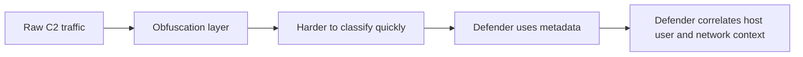
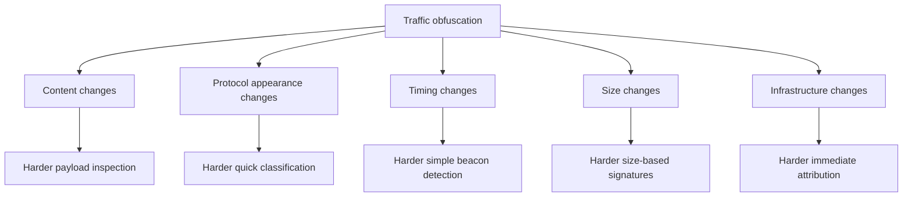
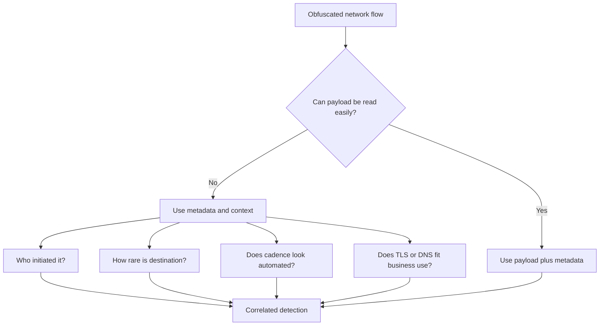

# Traffic Obfuscation

> **Phase 12 — Command and Control**  
> **Focus:** How authorized adversary-emulation teams make C2 traffic harder to classify by changing its appearance, timing, or surrounding infrastructure.  
> **Safety note:** This note is for authorized red-team learning and defensive analysis only. It explains concepts, tradeoffs, and detection ideas without giving step-by-step intrusion instructions.

---

**Relevant ATT&CK concepts:** TA0011 Command and Control | T1001 Data Obfuscation | T1132 Data Encoding | T1071 Application Layer Protocol

---

## Table of Contents

1. [Why It Matters](#why-it-matters)
2. [Beginner View](#beginner-view)
3. [Mental Model: What Obfuscation Really Does](#mental-model-what-obfuscation-really-does)
4. [What Can Be Obfuscated](#what-can-be-obfuscated)
5. [Common Obfuscation Patterns](#common-obfuscation-patterns)
6. [Why Mature Defenders Still Catch It](#why-mature-defenders-still-catch-it)
7. [Authorized Red-Team Planning Guidance](#authorized-red-team-planning-guidance)
8. [Detection Opportunities](#detection-opportunities)
9. [Defensive Controls](#defensive-controls)
10. [Common Mistakes](#common-mistakes)
11. [Conceptual Example](#conceptual-example)
12. [Key Takeaways](#key-takeaways)

---

## Why It Matters

Traffic obfuscation matters because many defenders no longer depend on simple signatures alone. They look at:

- destination reputation,
- protocol consistency,
- timing regularity,
- certificate and TLS metadata,
- process ancestry,
- and whether the traffic makes sense for that host.

In an authorized adversary-emulation exercise, studying traffic obfuscation helps answer an important question:

> **How much can communication blend in before context, behavior, and correlation still expose it?**

That makes this topic useful for both sides:

- **red teams** learn how realistic communication design affects detection,
- **blue teams** learn which signals survive even when payloads are disguised,
- **purple teams** learn where network analytics need more context.

---

## Beginner View

Traffic obfuscation means making traffic **look less obviously suspicious**.

That can involve changing:

- how messages are formatted,
- how often they appear,
- how large they are,
- which protocol they seem to use,
- or what infrastructure they travel through.

A simple mental shortcut is:

```text
Encryption protects the content.
Obfuscation changes the appearance.
Stealth depends on whether the whole story still looks normal.
```

Advanced operators know obfuscation is not magic. It may reduce one signal while exposing another. For example:

- content may be harder to inspect,
- but timing may still look machine-like,
- destination choice may still be rare,
- and the originating process may still make no business sense.

---

## Mental Model: What Obfuscation Really Does

Obfuscation does **not** usually make communication invisible.
It usually changes the defender's job from **easy classification** to **slower correlation**.



The practical lesson is this:

| Question | Weak security model | Strong security model |
|---|---|---|
| "Can we read the payload?" | Often the main question | Only one question among many |
| "Is the protocol common?" | May be treated as safe | Must still match host role and behavior |
| "Is the traffic encrypted?" | May reduce visibility greatly | Still leaves strong metadata and context |
| "Does it blend with the environment?" | Judged superficially | Judged across endpoint, identity, DNS, TLS, proxy, and cloud logs |

So the real contest is not **hidden vs visible**.
It is usually **signal reduction vs multi-source correlation**.

---

## What Can Be Obfuscated

### 1. Payload content

The visible message body may be encoded, wrapped, padded, or structured to avoid simple pattern matching.

**Defender takeaway:** normalization and decoding pipelines can remove some of the disguise.

### 2. Protocol appearance

Traffic may try to resemble ordinary web, API, or service communication.

**Defender takeaway:** protocol-looking traffic is not the same as protocol-correct traffic.

### 3. Timing and cadence

Regular intervals may be adjusted with delay variation, burst behavior, or user-aware scheduling.

**Defender takeaway:** simple beacon rules may fail, but long-term statistical analysis still helps.

### 4. Size and chunking

Messages may be split, padded, or shaped to avoid stable transfer patterns.

**Defender takeaway:** unusual size distributions can still become a clue.

### 5. Destination and infrastructure path

Traffic may pass through redirectors, relays, or more plausible-looking destinations.

**Defender takeaway:** rarity, provider relationships, DNS history, and certificate context still matter.

### 6. Application context

Operators may try to make the traffic appear to come from something expected on the host.

**Defender takeaway:** process-aware network telemetry is often decisive.

---

## Common Obfuscation Patterns

| Pattern | High-level idea | Why teams study it | What defenders can still look for |
|---|---|---|---|
| **Encoding and wrapping** | Change data representation without changing its purpose | Tests whether analytics rely too heavily on raw content | Decoded structure, consistency, and surrounding metadata |
| **Protocol mimicry** | Make traffic resemble common enterprise traffic | Tests whether defenders validate protocol behavior deeply | Header oddities, sequence mismatches, missing expected behaviors |
| **Timing variation** | Reduce obvious periodicity | Tests whether detection depends on fixed beacon intervals | Long-horizon cadence analysis, overnight activity, host-role mismatch |
| **Size shaping** | Alter transfer sizes or split data across smaller exchanges | Tests sensitivity to packet or flow signatures | Unusual distributions, repetition, or burst structure |
| **Infrastructure shaping** | Use domains, certificates, or relays that appear less suspicious | Tests destination governance and rarity analytics | Low-prevalence endpoints, new infrastructure, certificate anomalies |
| **Layered obfuscation** | Combine several methods at once | Simulates more mature adversary tradecraft | Complexity itself can create mistakes or fingerprints |

### Visual summary



### Important reality check

The more accurately traffic tries to imitate something legitimate, the more chances there are to get small details wrong.

That is why defenders often catch obfuscated traffic through:

- missing protocol behaviors,
- incorrect request/response patterns,
- inconsistent certificate or domain use,
- odd timing for the host's business role,
- or a process that should never be making those connections.

---

## Why Mature Defenders Still Catch It

Obfuscation usually weakens **single-signal detection** more than **context-rich detection**.



A mature SOC may still detect obfuscated traffic by asking:

- Which executable opened the connection?
- Is this normal for this user, host, subnet, or server role?
- Has the destination ever been seen before?
- Do the TLS, DNS, or proxy details match approved software?
- Does the timing continue when no human is active?
- Does the traffic appear shortly after suspicious identity or endpoint events?

This is why strong defenders often win with **correlation** rather than **content inspection alone**.

---

## Authorized Red-Team Planning Guidance

In a legitimate exercise, the goal is not "hide at all costs." The goal is to test the right defensive assumptions while staying safe, explainable, and within scope.

### Questions to ask before using more obfuscation

| Planning question | Why it matters |
|---|---|
| **What exercise objective does this support?** | Extra realism should answer a detection or response question, not add unnecessary risk. |
| **Is it allowed by the rules of engagement?** | Traffic shaping choices can affect visibility, deconfliction, and incident handling. |
| **Can the team still explain and reproduce what happened?** | Reporting value drops if operators cannot clearly describe the communication design. |
| **Will telemetry still be available for learning?** | An exercise should teach defenders, not remove all useful evidence. |
| **What breaks if infrastructure changes mid-operation?** | Complex communication paths increase troubleshooting and cleanup burden. |

### Safe professional mindset

Use obfuscation in exercises to evaluate:

- whether defenders rely too much on payload visibility,
- whether destination governance is effective,
- whether endpoint-network correlation works,
- and whether analysts can distinguish "common-looking" from "business-appropriate."

Do **not** treat obfuscation as a goal by itself.
Treat it as a way to test detection maturity.

---

## Detection Opportunities

- Hunt for **rare external destinations** contacted by unusual processes.
- Compare **claimed protocol behavior** with what the host normally runs.
- Look for **automated cadence** even when exact intervals vary.
- Inspect **TLS and certificate patterns** for new, low-prevalence, or mismatched characteristics.
- Correlate **DNS, proxy, EDR, and identity logs** instead of trusting one telemetry source.
- Watch for **overnight or weekend activity** that continues independently of users.
- Review **new infrastructure relationships** such as first-seen domains, providers, or ASNs.

### Fast analyst checklist

| If you see this... | Ask this next... |
|---|---|
| HTTPS traffic that looks ordinary | Which process created it, and is that process approved? |
| Variable but recurring outbound traffic | Does the destination remain stable and low-prevalence? |
| Small transfers that avoid fixed intervals | Do they still align with a machine-like schedule over days? |
| Plausible domains or certificates | Are they normal for this host population and business unit? |
| Traffic that avoids easy signatures | Does endpoint or identity context make the behavior abnormal anyway? |

---

## Defensive Controls

| Control | Why it helps |
|---|---|
| **Egress filtering** | Limits which systems can talk externally and through which paths. |
| **Proxy and DNS logging** | Provides destination history, timing, and policy context. |
| **Process-aware network telemetry** | Reveals which executable and user context initiated the traffic. |
| **Baselining and rarity analytics** | Makes uncommon destinations and behaviors stand out faster. |
| **TLS and certificate enrichment** | Adds clues even when content cannot be inspected. |
| **Multi-source correlation** | Combines weak individual clues into strong detection decisions. |
| **Purple-team validation** | Confirms whether current analytics survive realistic traffic shaping. |

### Simple defender model

```text
If content visibility decreases,
increase dependence on:
- host context
- destination context
- timing context
- identity context
- historical rarity
```

---

## Common Mistakes

### 1. Confusing obfuscation with invisibility

Obfuscation may hide the easy clue, not the important clue.

### 2. Focusing only on packets

Modern detection often depends just as much on endpoint, identity, and cloud telemetry.

### 3. Overcomplicating the exercise

If the team cannot troubleshoot, deconflict, or explain the communication model, the design may be too complex for the learning objective.

### 4. Assuming common protocols are automatically safe cover

A very common protocol can still be suspicious when used by the wrong process at the wrong time to the wrong destination.

### 5. Ignoring reporting value

The best red-team exercise does not just evade detection. It produces a clear lesson defenders can act on afterward.

---

## Conceptual Example

An authorized red team wants to test whether the SOC can detect communication that superficially resembles ordinary encrypted web traffic.

The team does **not** measure success by "Did nobody notice anything?" Instead, they measure:

- whether analysts spot that the destination is rare,
- whether endpoint telemetry ties the traffic to an unexpected process,
- whether timing still appears automated,
- and whether the defenders can explain why the traffic is inconsistent with normal business behavior.

That is the real educational value of traffic obfuscation:

```text
Normal-looking traffic
        does not always mean
Normal business behavior
```

---

## Key Takeaways

- Traffic obfuscation changes how communication looks, not what it is for.
- Mature defenders can still detect obfuscated traffic through context, rarity, timing, and correlation.
- In authorized adversary emulation, obfuscation should support a learning objective, not become an end in itself.
- The strongest question is not "Can we disguise the traffic?" but "Which signals still remain, and can defenders use them?"

---

> **Defender mindset:** When payload visibility drops, shift attention to who connected, where they connected, how often they did it, and whether that behavior fits the environment.
