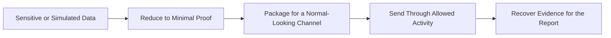
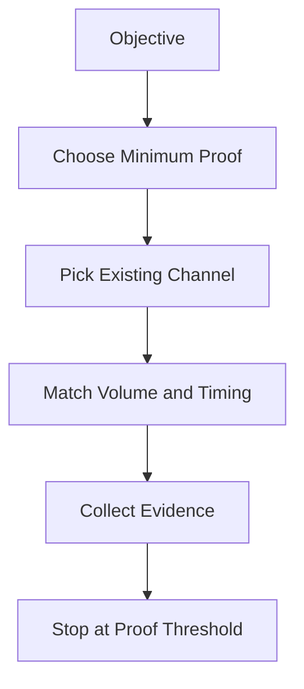
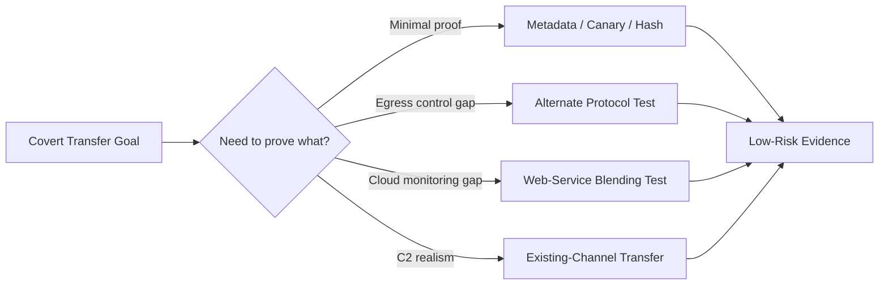
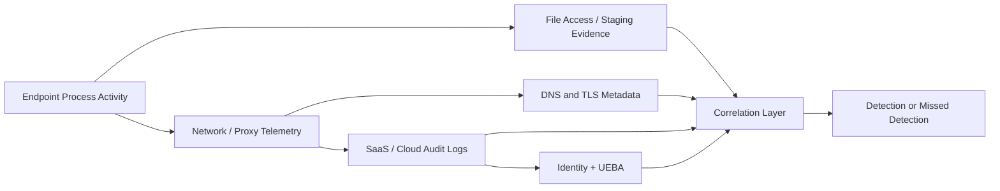
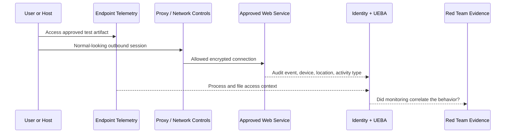
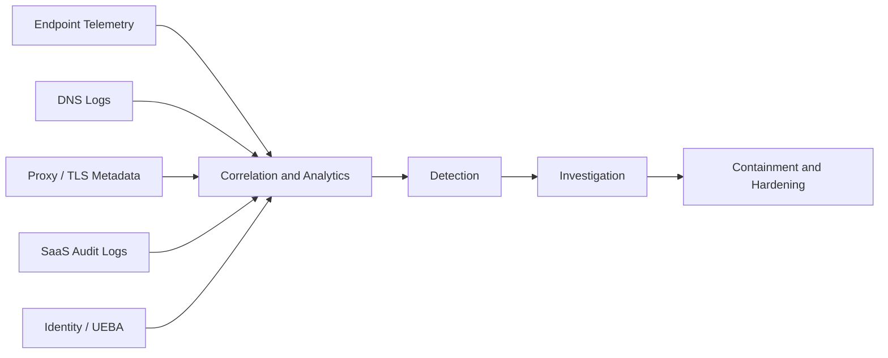

# Covert Data Transfer

> **Difficulty:** Beginner → Advanced | **Category:** Red Teaming | **Related MITRE ATT&CK:** T1041, T1048, T1567
> **Authorized Use Only:** This note is for approved adversary emulation, detection engineering, and defensive validation. Use customer-approved scope, synthetic data or canaries, explicit stop conditions, and the minimum proof necessary.

---

## Table of Contents

1. [What Covert Data Transfer Means](#1-what-covert-data-transfer-means)
2. [Why Red Teams Simulate It](#2-why-red-teams-simulate-it)
3. [Core Building Blocks](#3-core-building-blocks)
4. [Channel Families](#4-channel-families)
5. [Beginner → Advanced Mental Model](#5-beginner--advanced-mental-model)
6. [Practical Emulation Patterns](#6-practical-emulation-patterns)
7. [Trade-Offs and Failure Modes](#7-trade-offs-and-failure-modes)
8. [Detection and Defensive View](#8-detection-and-defensive-view)
9. [Reporting Guidance](#9-reporting-guidance)
10. [References](#10-references)

---

## 1. What Covert Data Transfer Means

**Covert data transfer** is the movement of data in a way that tries to blend into expected activity rather than look like an obvious export.

The important idea is this:

- **Overt transfer** is visible and direct.
- **Covert transfer** tries to look routine, harmless, or boring.
- **Successful covert transfer is not invisible**. It is simply less likely to stand out immediately.

In red teaming, this topic matters because real adversaries rarely announce exfiltration with a giant archive sent to a brand-new server over a noisy protocol. They often reuse channels that the environment already trusts or barely inspects.

### Overt vs covert

| Type | What it looks like | Why defenders notice it |
|---|---|---|
| Overt transfer | obvious upload to an unusual destination | new destination, large volume, unusual timing |
| Covert transfer | data hidden inside normal-looking traffic | harder to distinguish from business activity |
| Proof-only transfer | tiny, approved marker proving access | minimal risk, usually safest for engagements |

### A simple definition to remember

> Covert transfer is usually about **blending**, not disappearing.

If the traffic shape, destination, identity, or timing looks wrong for the host or user, defenders can still catch it.

---

## 2. Why Red Teams Simulate It

Authorized adversary emulation uses covert transfer scenarios to test whether the client can detect the **last mile of attacker success**: data leaving the environment.

### What a good simulation validates

- whether egress controls are based on **allow lists** or real behavior analysis
- whether DLP inspects only content or also looks at **destination, timing, identity, and volume**
- whether DNS, proxy, endpoint, SaaS, and identity telemetry are correlated
- whether blue teams notice suspicious use of legitimate services
- whether the client can distinguish normal uploads from attacker-shaped uploads

### MITRE ATT&CK view

| Technique | High-level meaning | Red team lesson |
|---|---|---|
| **T1041 – Exfiltration Over C2 Channel** | data leaves over the same path already used for command and control | existing trusted channels can carry more than commands |
| **T1048 – Exfiltration Over Alternative Protocol** | data leaves over a protocol different from the main C2 path | allowed protocols can become fallback exfil paths |
| **T1567 – Exfiltration Over Web Service** | data leaves through a legitimate web or cloud service | sanctioned services can provide excellent cover |

### Why this is operationally realistic

A client may block obviously suspicious outbound traffic, but still allow:

- web API calls over HTTPS
- normal DNS resolution
- diagnostics traffic
- uploads to cloud platforms or collaboration suites
- background application sync traffic

That is why mature defenders focus on **context**, not just protocol names.

---

## 3. Core Building Blocks

Every covert transfer design can be understood as five parts.

| Building block | Meaning | Safe red team guidance |
|---|---|---|
| **Payload** | what is being proved or moved | prefer synthetic data, canaries, hashes, or tiny approved fragments |
| **Cover channel** | the normal-looking activity carrying it | choose something that already exists in the environment |
| **Transformation** | how the payload is reduced, chunked, or represented | keep it simple and engagement-safe |
| **Cadence** | when and how often data moves | match normal timing and volume patterns |
| **Recovery** | how the team proves the transfer happened | collect only the evidence needed for reporting |

### Payload first, channel second

A common beginner mistake is to think only about the channel.

A stronger design starts with the question:

**What is the smallest proof of impact that still answers the engagement objective?**

Examples of safer proof:

- a customer-approved canary string
- a file hash rather than file content
- a few bytes of synthetic test data
- metadata such as filename, size, or classification label

This approach reduces client risk while still demonstrating control weakness.

### The “boring beats clever” principle

A covert design usually works better when it is:

- ordinary-looking
- low-volume
- predictable to the operator
- easy to explain in the report

Overly clever channels often create strange artifacts that defenders notice quickly.

---

## 4. Channel Families

Covert transfer methods usually fall into a few broad families.

### 4.1 Storage channels

A **storage channel** hides information in some part of a request, record, or object.

Examples include high-level ideas such as:

- metadata fields
- DNS names or labels
- HTTP headers or parameters
- cloud object names or comments
- document properties or log-friendly identifiers

**Strength:** simple concept, easy to explain.  
**Weakness:** unusual field values, entropy, or object naming often stand out.

### 4.2 Timing channels

A **timing channel** uses the spacing, ordering, or rhythm of otherwise normal events to encode information.

Examples include:

- pauses between requests
- burst patterns
- ordered sequences of harmless actions

**Strength:** little visible payload content.  
**Weakness:** reliability is poor, and statistical monitoring can expose it.

### 4.3 Existing-channel transfer

This is the idea behind **T1041**: the same path already used for remote tasking or beaconing also carries exfiltrated data.

**Strength:** no need for a brand-new protocol path.  
**Weakness:** defenders may already be watching the channel closely once it is identified.

### 4.4 Alternate-protocol transfer

This is the idea behind **T1048**: instead of using the main path, the operator shifts to another allowed protocol.

Examples at a high level:

- DNS as a proof channel
- HTTPS upload behavior shaped like application traffic
- diagnostic or management traffic used in unexpected ways

**Strength:** can bypass controls focused on one protocol family.  
**Weakness:** the protocol may have strong size, formatting, or visibility constraints.

### 4.5 Web-service blending

This is the idea behind **T1567**: data moves through a real external service that the environment already trusts.

Examples include:

- collaboration suites
- code hosting platforms
- cloud storage
- ticketing or messaging platforms

**Strength:** legitimate domains and TLS create strong cover.  
**Weakness:** SaaS audit logs, identity telemetry, and UEBA often make abuse very visible.

### Channel comparison

| Channel family | Typical cover | Bandwidth | Common defender view | Best engagement use |
|---|---|---:|---|---|
| Existing C2 channel | established beacon or management path | low → medium | endpoint + network correlation | show that one trusted channel can do both control and exfil |
| Alternate protocol | DNS, HTTPS, diagnostics, file services | low → medium | protocol-specific analytics | validate egress filtering and protocol visibility |
| Web-service blending | sanctioned SaaS or cloud | medium | SaaS audit + identity + proxy | test cloud monitoring and business-app governance |
| Timing channel | normal actions with abnormal rhythm | very low | statistical anomaly detection | niche detection exercise, not bulk proof |
| Proof-only metadata channel | names, labels, small markers | very low | often low scrutiny until correlated | safest demonstration of impact |

---

## 5. Beginner → Advanced Mental Model

### Beginner view: “hide in normal traffic”

At the beginner level, covert transfer is easy to understand:

- pick a channel that is allowed
- keep the amount of data small
- avoid behavior that looks obviously new or loud

This is useful, but incomplete.

### Intermediate view: “fit the environment”

At the intermediate level, the question becomes:

- does this host normally use this protocol?
- does this user normally talk to this service?
- is this volume normal at this time of day?
- would this request shape look routine for this application?

This is where **environmental baselining** matters.

### Advanced view: “assume every layer sees something”

At the advanced level, covert transfer is not about one packet or one request. It is about the **full observation surface**:

- endpoint telemetry
- proxy and TLS metadata
- DNS logs
- SaaS audit trails
- identity-provider events
- UEBA baselines
- DLP and content inspection

### The advanced lesson

A channel may be allowed, but the **behavior around it** may still be suspicious.

That is why mature red teams focus on:

- host fit
- user fit
- service fit
- timing fit
- visibility fit

---

## 6. Practical Emulation Patterns

This section stays intentionally **high level and engagement-safe**. The goal is to help you design realistic tests without turning the note into a step-by-step intrusion guide.

### 6.1 Proof-only transfer

This is often the best option for professional engagements.

**Idea:** prove access using the smallest possible approved artifact.

Use when:

- the client mainly wants evidence that exfiltration was possible
- the environment contains regulated or highly sensitive data
- the rules of engagement prioritize safety over realism

Good proof choices:

- synthetic canary token
- document hash
- filename + directory path
- limited metadata from a mock file

### 6.2 Web-service blending assessment

**Idea:** test whether sanctioned cloud or SaaS activity is monitored well enough to spot unusual use.

Use when:

- the client relies heavily on collaboration and cloud platforms
- the objective is to test CASB, SSE, SaaS audit logging, or identity analytics

What to evaluate:

- unusual device or user-agent patterns
- activity outside normal working windows
- uploads from hosts that rarely use the service
- impossible-travel or unfamiliar-location signals
- unusual sharing or download patterns

### 6.3 Alternate-protocol proof channel

**Idea:** demonstrate that a low-bandwidth alternate protocol could carry proof data when more obvious channels are blocked.

Use when:

- the engagement is testing egress controls, DNS visibility, or protocol analytics
- the customer wants to know whether “allowed” traffic is simply trusted by default

Safe design guidance:

- prove only a small marker
- predefine a stop threshold
- coordinate closely if shared infrastructure is involved

### 6.4 Existing-channel exfil simulation

**Idea:** show that a trusted remote-management or already-established channel can be abused for more than commands.

Use when:

- the objective is to test segmentation between command traffic and data movement
- the client wants realism around attacker dwell time and multi-purpose channels

What defenders should notice:

- burst size changes
- different request cadence
- unusual server responses
- data-volume drift on a channel normally used for tiny control messages

### 6.5 Metadata-only impact demonstration

**Idea:** prove business impact without moving meaningful content.

Examples of proof content:

- record counts
- file classifications
- document names
- internal project names approved for testing

This is often the best compromise between realism and client safety.

### Safe emulation decision guide

| Objective | Safer pattern | Why it works |
|---|---|---|
| Prove data access | canary, hash, metadata | validates impact with minimal risk |
| Test DNS or protocol analytics | proof-only alternate protocol | validates monitoring without bulk movement |
| Test cloud governance | web-service blending | exercises SaaS, IdP, and UEBA detections |
| Test beacon-channel abuse | existing-channel simulation | shows control vs transfer blending |
| Test reporting quality | metadata-only impact demo | gives clear evidence for stakeholders |

---

## 7. Trade-Offs and Failure Modes

### Core trade-offs

| Trade-off | Meaning |
|---|---|
| **Stealth vs bandwidth** | quieter channels usually carry less data |
| **Realism vs safety** | the most realistic test may not be the safest one |
| **Legitimate cover vs rich logging** | real business services often create excellent audit trails |
| **Encryption vs anomaly** | hidden content may still look statistically unusual |
| **Staging convenience vs forensic footprint** | temporary packaging may leave artifacts on disk or in memory |

### Common failure modes

- choosing a channel that does not belong on the source host
- sending too much data too quickly
- using a service the account never normally touches
- generating obviously random-looking names or metadata
- ignoring SaaS, IdP, and CASB logs
- proving impact with more real customer data than necessary
- forgetting pre-agreed abort conditions

### What experienced operators learn

The hardest part is rarely “can data leave?”

The harder questions are:

- can it leave **without obvious novelty**?
- can it leave in a way that matches **normal business rhythm**?
- can it leave while staying inside **engagement safety controls**?
- can the result be explained clearly to both executives and engineers?

---

## 8. Detection and Defensive View

Defenders do not need perfect content inspection to catch covert transfer. They need **behavioral context** and **cross-layer correlation**.

### What to baseline

- which hosts usually talk to which services
- which users normally upload, share, or sync data
- expected request sizes and timing
- normal working hours and source locations
- normal device and user-agent patterns

Microsoft documents that anomaly detection and UEBA can score activity using factors such as **location, device and user agent, activity rate, risky IP address, and impossible travel**. That is exactly the type of context covert-transfer detection benefits from.

### Useful detections by channel type

| Channel type | Useful detection ideas |
|---|---|
| DNS-like channels | long or high-entropy names, rare domains, unusual query rates, strange label structure |
| HTTPS / API-shaped channels | unexpected uploads, unusual headers or request sizes, odd periodicity, mismatched user-agent/device patterns |
| Web-service blending | abnormal tenant activity, unusual sharing, rare app usage, off-hours transfers, impossible travel |
| Existing-channel transfer | beacon size drift, response-size changes, bursts on a usually tiny control channel |
| Timing channels | statistically abnormal spacing, ordered event patterns, repeated low-volume rhythms |

### Defensive architecture

### Practical defensive questions

- Does this host normally communicate with this destination?
- Does this user normally upload or share data this way?
- Was sensitive file access observed shortly before the outbound event?
- Did the device, IP, or browser pattern change?
- Did a sanctioned service see unusual behavior even though the domain was trusted?

### Hardening measures

- centralize DNS and retain full query visibility
- combine proxy, endpoint, SaaS, and identity logs
- apply DLP to both content and behavior
- alert on new or rarely used external services
- govern sanctioned web services with strong audit retention
- test controls regularly with **approved proof-only simulations**

> **NIST alignment:** Security monitoring guidance such as NIST SP 800-53 emphasizes continuous monitoring and layered controls. Covert transfer is exactly the kind of problem that layered visibility is meant to catch.

---

## 9. Reporting Guidance

A strong covert-transfer finding explains **how the transfer blended in**, **what telemetry existed**, and **what the client should improve next**.

### What to capture in the report

- the engagement objective and safety constraints
- whether the transfer was proof-only, metadata-only, or service-blending
- the approved data type used for validation
- which controls were tested: DNS, proxy, SaaS, DLP, IdP, UEBA, EDR
- what was seen by defenders and what was missed
- what made the transfer believable in that environment

### Simple reporting structure

| Section | What to include |
|---|---|
| Scenario | “Authorized simulation of covert data transfer using approved minimal proof” |
| Objective | what business risk or detection gap was being tested |
| Evidence | canary, hash, metadata, timestamps, alert outcomes |
| Detection gap | which controls failed to correlate the event |
| Risk statement | why a real adversary could do more damage |
| Recommendations | specific visibility, governance, and response improvements |

### Recommendations usually worth discussing

- better per-user and per-host baselines
- stronger monitoring of sanctioned cloud services
- correlation between file access and outbound activity
- anomaly detection for rarely used destinations and unusual timing
- safer proof-only validation exercises on a recurring schedule

---

## 10. References

- [MITRE ATT&CK – T1041 Exfiltration Over C2 Channel](https://attack.mitre.org/techniques/T1041/)
- [MITRE ATT&CK – T1048 Exfiltration Over Alternative Protocol](https://attack.mitre.org/techniques/T1048/)
- [MITRE ATT&CK – T1567 Exfiltration Over Web Service](https://attack.mitre.org/techniques/T1567/)
- [NIST SP 800-53 Rev. 5 – Security and Privacy Controls for Information Systems and Organizations](https://csrc.nist.gov/pubs/sp/800/53/r5/upd1/final)
- [RFC 1035 – Domain Names: Implementation and Specification](https://www.rfc-editor.org/rfc/rfc1035)
- [Microsoft Learn – Defender for Cloud Apps Anomaly Detection Policies](https://learn.microsoft.com/en-us/defender-cloud-apps/anomaly-detection-policy)
- [OWASP Web Security Testing Guide](https://owasp.org/www-project-web-security-testing-guide/)
