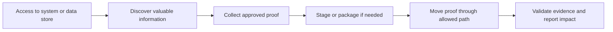
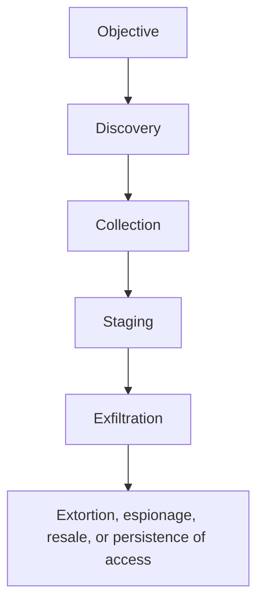
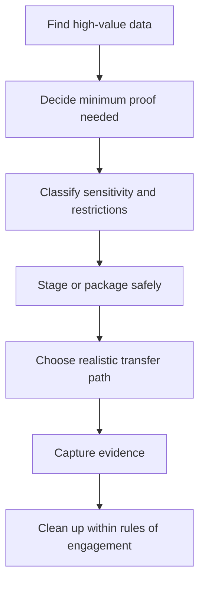
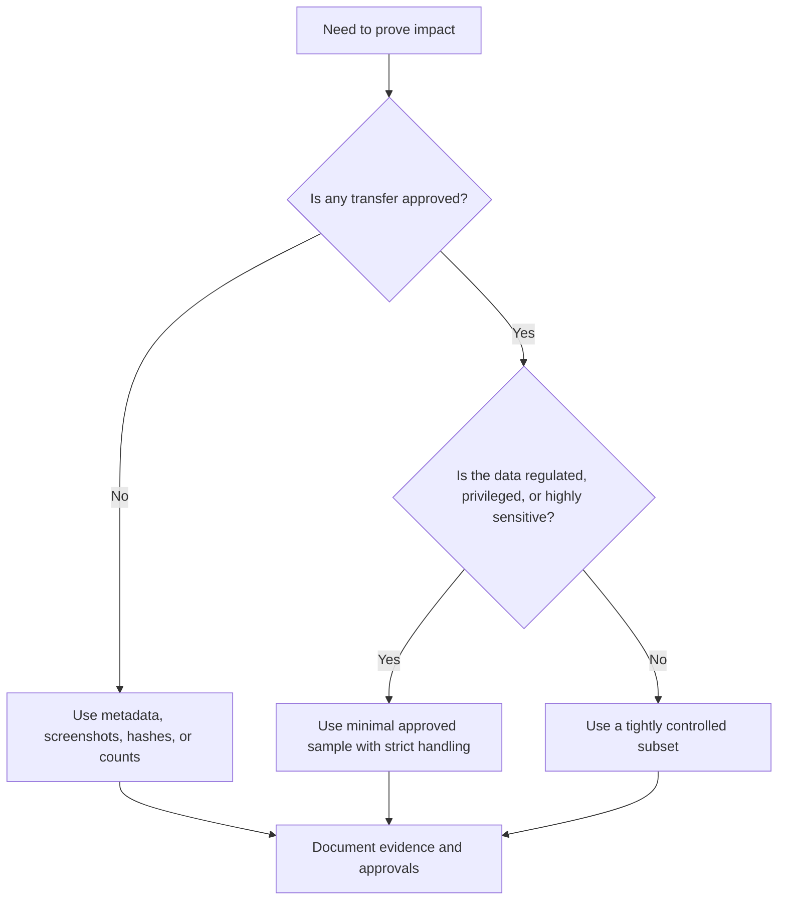
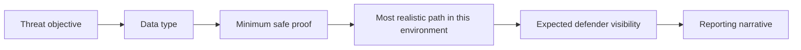
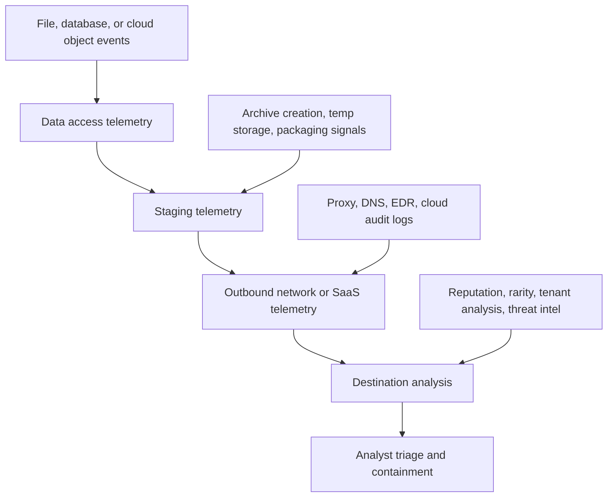

# Data Exfiltration Overview

> **Difficulty:** Beginner → Advanced | **Category:** Red Teaming | **MITRE Tactic:** [TA0010 – Exfiltration](https://attack.mitre.org/tactics/TA0010/)
> **Authorized use only:** This note is for sanctioned adversary-emulation, red-team, and purple-team exercises. It focuses on strategy, proof models, safety, and detection value rather than step-by-step intrusion guidance.

---

## Table of Contents

1. [What Data Exfiltration Means](#1-what-data-exfiltration-means)
2. [Why It Matters in Adversary Emulation](#2-why-it-matters-in-adversary-emulation)
3. [The Exfiltration Lifecycle](#3-the-exfiltration-lifecycle)
4. [Safe Proof Models and Rules of Engagement](#4-safe-proof-models-and-rules-of-engagement)
5. [Channel Families and Trade-Offs](#5-channel-families-and-trade-offs)
6. [Practical Engagement Patterns](#6-practical-engagement-patterns)
7. [Defender Perspective and Detection Choke Points](#7-defender-perspective-and-detection-choke-points)
8. [Evidence, Metrics, and Reporting](#8-evidence-metrics-and-reporting)
9. [Common Pitfalls](#9-common-pitfalls)
10. [Key Takeaways](#10-key-takeaways)
11. [References](#11-references)

---

## 1. What Data Exfiltration Means

> **Data exfiltration is the controlled movement of information from a target environment to another location in order to prove what an adversary could access, steal, or stage.**

In beginner terms, exfiltration answers a simple question:

> *"If this compromise were real, what valuable information could leave the environment?"*

In mature red team work, that question becomes broader. Teams also need to understand:

- what data could be reached
- how convincingly business impact can be demonstrated
- which controls should have interrupted the sequence
- how to prove risk without mishandling client data

### Collection vs staging vs exfiltration

| Term | What it means | Why it matters |
|---|---|---|
| **Collection** | Identifying and gathering interesting data inside the environment | Shows reach and access |
| **Staging** | Temporarily organizing or packaging data before transfer | Improves efficiency but increases local artifacts |
| **Exfiltration** | Moving approved proof or samples out of the environment | Demonstrates business impact and tests outbound controls |

Exfiltration is rarely the first thing a realistic adversary does. It usually appears after discovery, collection, and decision-making.

---

## 2. Why It Matters in Adversary Emulation

Organizations often understand compromise in technical terms such as session theft, local admin rights, or cloud role abuse. Leadership usually reacts most strongly to **business impact**.

### Why this phase changes the report

| Demonstrated condition | What stakeholders hear | Why it matters |
|---|---|---|
| Access to customer records | "We could lose regulated data" | Legal, regulatory, and reputation risk |
| Access to source code or build secrets | "Our products and trust chain are exposed" | IP theft and supply-chain risk |
| Access to identity material | "Attackers could come back after cleanup" | Persistence of risk |
| Quiet transfer of small proof | "Our egress and DLP controls were not enough" | Detection gap validation |
| Only hashes or metadata needed | "Impact can be shown safely" | Strong reporting with less handling risk |

### Exfiltration in the attack story

For adversary emulation, exfiltration is not just a technical act. It is the point where the exercise proves whether a plausible attacker objective could translate into a meaningful business loss.

---

## 3. The Exfiltration Lifecycle

A practical way to learn this topic is to think of exfiltration as a **pipeline**, not a single action.

### Stage 1: Identify high-value data

Operators prioritize information that best answers the engagement objective, such as:

- customer or employee records
- source code and engineering documents
- cloud configuration, secrets, and tokens
- finance, legal, or executive material
- backups, key databases, and infrastructure configuration

### Stage 2: Minimize and classify

Before anything leaves the environment, mature teams decide:

- Is a filename list enough?
- Is a screenshot or row count enough?
- Can sanitized data prove the same point?
- Is the data regulated or contractually restricted?

### Stage 3: Stage and package

Data may be organized for easier handling. In conceptual terms, that can involve:

- reducing size
- splitting large sets into manageable units
- applying encryption where approved
- shaping content for the chosen transport
- preparing a very small proof set instead of a bulk archive

### Stage 4: Choose the path

The path depends on environment, visibility, and engagement safety:

- an existing operator-controlled channel
- a common web-facing path
- a cloud or SaaS workflow that resembles normal business behavior
- a relay or intermediate location in multi-hop scenarios
- a non-network path in highly constrained environments, if explicitly approved

### Stage 5: Validate and clean up

The final goals are to:

- confirm the proof is sufficient for reporting
- preserve evidence for the report
- remove temporary artifacts where rules of engagement allow
- stop before the exercise becomes the incident

### Beginner lens vs advanced lens

| Lens | Main question |
|---|---|
| **Beginner** | "Can data leave the environment?" |
| **Intermediate** | "Which path would a realistic attacker choose here?" |
| **Advanced** | "How do we validate the path, prove impact, and measure detection without mishandling data?" |

---

## 4. Safe Proof Models and Rules of Engagement

The most mature exfiltration exercises are often the least dramatic. They are built around **proof minimization**.

### Common proof models

| Proof model | Typical use | Safety level | Reporting value |
|---|---|---|---|
| File paths, names, and counts | Highly sensitive repositories | Highest | Shows reach and scale |
| Screenshots of approved views | Regulated or confidential records | High | Easy for non-technical readers |
| Hashes of approved artifacts | Need proof of possession without content exposure | High | Strong technical evidence |
| Small sanitized sample | Explicitly approved exercises | Medium | Good realism with lower risk |
| Controlled subset of real data | Narrow, tightly governed scenarios | Lower | Highest realism but greatest handling burden |

> **Rule of thumb:** Use the smallest, safest artifact that still proves the business point.

### Decision model

### Rules-of-engagement questions to settle early

1. What types of data are off-limits?
2. Is transfer allowed, or only proof of access?
3. Who approves exceptions in real time?
4. Where can approved proof be stored?
5. When must staged data be deleted?
6. What are the stop conditions if risk changes?

Without these answers, exfiltration becomes operationally unsafe very quickly.

---

## 5. Channel Families and Trade-Offs

This note stays at the **design level**, not the execution level. The important lesson is not memorizing channels; it is understanding why an operator would favor one family over another.

### High-level channel families

| Channel family | Best for | Key strength | Main limitation | ATT&CK examples |
|---|---|---|---|---|
| Existing command-and-control path | Small proofs and quick validation | Simple and already established | Strongly tied to known beacon traffic | T1041 |
| Common web traffic or API-shaped traffic | General business environments | Reliable and often expected | Proxy, DLP, and SaaS logging may be strong | T1567 |
| Alternative protocol | Environments where the primary path is constrained | Can avoid reliance on one path | May stand out if rare in the environment | T1048 |
| Scheduled or automated transfer | Repeated low-volume proof or recurring collection | Blends with timing patterns | Creates repeatable signals defenders can hunt | T1020, T1029 |
| Size-limited or chunked movement | Threshold-aware environments | Reduces sudden spikes | Increases duration and sequence complexity | T1030 |
| Physical or non-standard medium | Air-gapped or unusual scenarios | Bypasses some network controls | Heavy safety and legal scrutiny | T1011, T1052 |

### Channel selection questions

Experienced operators ask:

- What outbound paths already exist for this asset?
- Which destinations would look normal for this business unit or workload?
- How much volume is actually required?
- What telemetry is strongest here: endpoint, DNS, proxy, SaaS, or cloud audit logs?
- Is the chosen path realistic for the adversary being emulated?
- What happens if the path is blocked?

### Practical trade-off matrix

| Goal | Usually favors | Because |
|---|---|---|
| Lowest handling risk | metadata, screenshots, hashes | proves impact without moving content |
| Highest realism | approved subset over a common business path | mirrors real intrusion patterns |
| Lowest noise | small, paced transfer or non-transfer proof | avoids dramatic spikes |
| Fastest reporting evidence | existing channel or approved screenshots | lowest setup cost |
| Strongest defender validation | end-to-end controlled proof through monitored egress | tests whether controls see the full sequence |

---

## 6. Practical Engagement Patterns

Real red-team work becomes easier to understand when you map exfiltration to **attacker intent** rather than just technology.

### 6.1 Ransomware-style objective

| Element | Typical pattern |
|---|---|
| Primary aim | Demonstrate leverage over business-critical data |
| Valuable targets | File shares, backups, finance records, legal documents |
| Safer proof | Directory evidence, file counts, hash-based proof, limited approved samples |
| Defender lesson | Can we detect broad collection, staging, and outbound preparation early? |

### 6.2 Espionage-style objective

| Element | Typical pattern |
|---|---|
| Primary aim | Quiet access to strategic or intellectual-property data |
| Valuable targets | Source code, R&D, executive communications, acquisition plans |
| Safer proof | Small curated samples, sanitized excerpts, metadata proof |
| Defender lesson | Can we distinguish slow, low-volume sensitive access from normal work? |

### 6.3 Insider-misuse-style objective

| Element | Typical pattern |
|---|---|
| Primary aim | Abuse legitimate access to move information outward |
| Valuable targets | Collaboration platforms, CRM exports, SaaS documents |
| Safer proof | Export logs, file lists, screenshots of accessible data |
| Defender lesson | Do governance and behavioral analytics cover trusted users and SaaS workflows? |

### 6.4 Cloud-control-plane objective

| Element | Typical pattern |
|---|---|
| Primary aim | Move data between cloud services or accounts without touching traditional perimeter controls |
| Valuable targets | Object storage, snapshots, managed databases, secrets |
| Safer proof | Cross-account access proof, bucket listings, row counts, event logs |
| Defender lesson | Are cloud audit logs and data movement alerts treated as exfiltration telemetry? |

### A simple way to think about realism

A strong exercise can explain every link in that chain.

---

## 7. Defender Perspective and Detection Choke Points

Defenders do not need perfect packet inspection to catch exfiltration. They need enough visibility across the **sequence**.

### Common choke points

1. **Sensitive data access**
   - unusual repository access
   - unexpected database exports
   - large reads from executive or finance shares

2. **Staging behavior**
   - archive creation where it is uncommon
   - compression or packaging of unusual data sets
   - transient storage in odd directories or temporary locations

3. **Outbound movement**
   - new or rare external destinations
   - unexpected SaaS usage by a host or role
   - timing patterns that do not match business workflows

4. **Destination and identity context**
   - unfamiliar domains or cloud tenants
   - transfers initiated by unusual processes
   - identity behavior that does not fit the user, role, or asset

### Layered detection model

### Questions defenders should ask

- Do we know where crown-jewel data actually lives?
- Can we see both **access** and **egress**, or only one side?
- Are cloud-to-cloud transfers treated as data exfiltration?
- Can we connect a sensitive read event to later outbound activity?
- Do we have a safe policy for validating exfiltration controls during exercises?

---

## 8. Evidence, Metrics, and Reporting

A good exfiltration note should teach people how to **measure** this phase, not just name it.

### What operators should capture

| Evidence type | Why it matters |
|---|---|
| Timestamped screenshots or metadata | easy executive proof |
| Asset, identity, and data owner context | ties activity to business impact |
| Data class or sensitivity label | shows why the path matters |
| Transfer approval record | proves rules-of-engagement compliance |
| Detection outcomes | validates whether controls worked |
| Cleanup confirmation | closes the loop responsibly |

### Useful exercise metrics

| Metric | What it tells you |
|---|---|
| Time to detect sensitive access | whether early-stage telemetry is effective |
| Time to detect outbound movement | whether egress monitoring is working |
| Proof sufficiency | whether the team gathered enough evidence without over-collecting |
| Data-handling compliance | whether the exercise stayed within approved boundaries |
| Alert-to-investigation quality | whether defenders understood the activity as a coherent intrusion story |

### Reporting language that lands with stakeholders

Weak narrative:

> "We had domain admin and transferred files."

Stronger narrative:

> "We demonstrated that a realistic adversary could reach finance and engineering data, stage approved proof safely, and move that proof through channels that existing monitoring did not escalate in time."

That framing connects:

- attacker objective
- business relevance
- control gap
- remediation priority

---

## 9. Common Pitfalls

### Treating exfiltration as a volume contest

The goal is not to move the most data. The goal is to prove the most meaningful risk with the least unnecessary handling.

### Ignoring the environment

A path that is stealthy in theory may be noisy in a cloud-first or SaaS-heavy organization, and vice versa.

### Forgetting the adversary model

A ransomware-style scenario, espionage scenario, and insider scenario often imply very different proof models and timelines.

### Separating exfiltration from collection

Most defenders miss the connection between **what was accessed** and **what later left**. Good exercises force that connection into the report.

### Mishandling client data

Unsafe collection or transfer can turn a useful exercise into a compliance problem. Mature teams prove impact without overreaching.

---

## 10. Key Takeaways

- Exfiltration is the phase that converts technical access into **demonstrable business impact**.
- In red teaming, the best proof is usually the **smallest approved artifact** that still tells a convincing story.
- Channel choice is a question of **realism, visibility, volume, and safety**, not just protocol preference.
- The most valuable defender lesson is often the **sequence**: sensitive access, staging, outbound movement, and response.
- Mature adversary emulation proves what could have left the environment **without becoming the incident**.

---

## 11. References

- [MITRE ATT&CK – Exfiltration (TA0010)](https://attack.mitre.org/tactics/TA0010/)
- [MITRE ATT&CK – T1041 Exfiltration Over C2 Channel](https://attack.mitre.org/techniques/T1041/)
- [MITRE ATT&CK – T1048 Exfiltration Over Alternative Protocol](https://attack.mitre.org/techniques/T1048/)
- [MITRE ATT&CK – T1567 Exfiltration Over Web Service](https://attack.mitre.org/techniques/T1567/)
- [MITRE ATT&CK – T1020 Automated Exfiltration](https://attack.mitre.org/techniques/T1020/)
- [MITRE ATT&CK – T1029 Scheduled Transfer](https://attack.mitre.org/techniques/T1029/)
- [MITRE ATT&CK – T1030 Data Transfer Size Limits](https://attack.mitre.org/techniques/T1030/)
- [NIST SP 800-53 Rev. 5](https://csrc.nist.gov/pubs/sp/800/53/r5/upd1/final)
