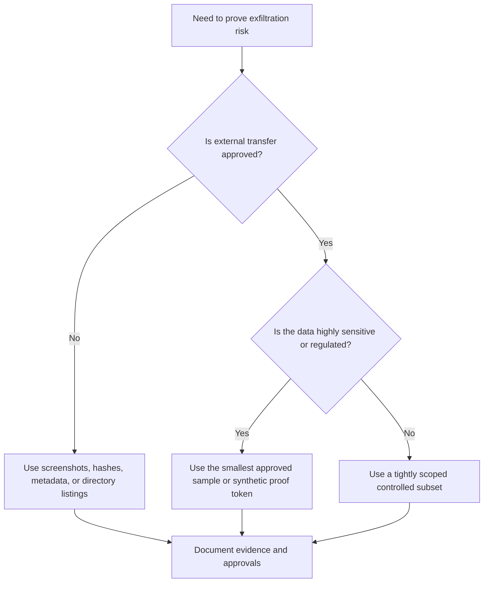
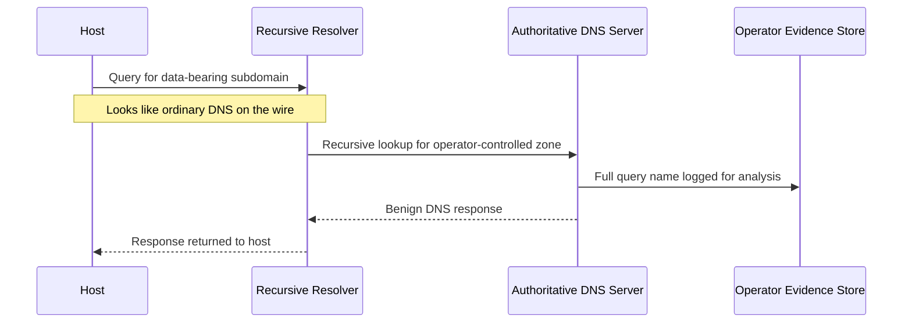
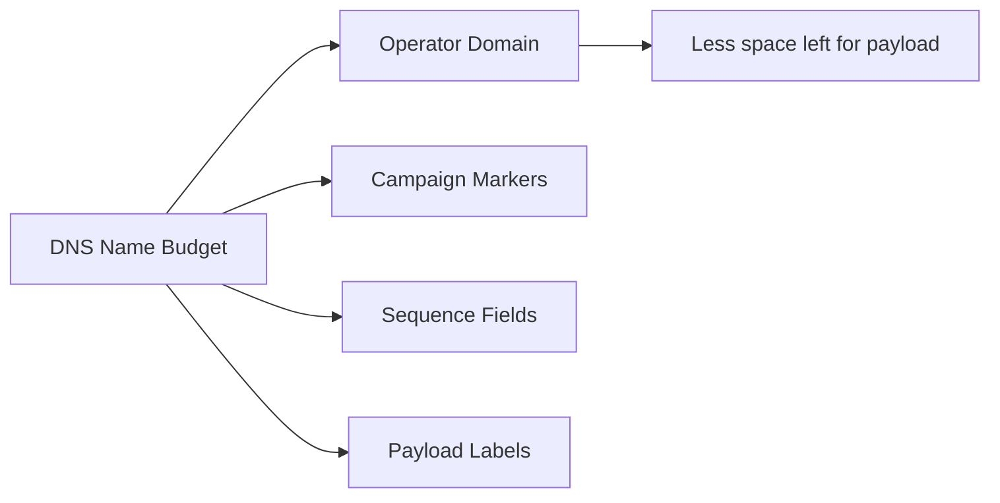
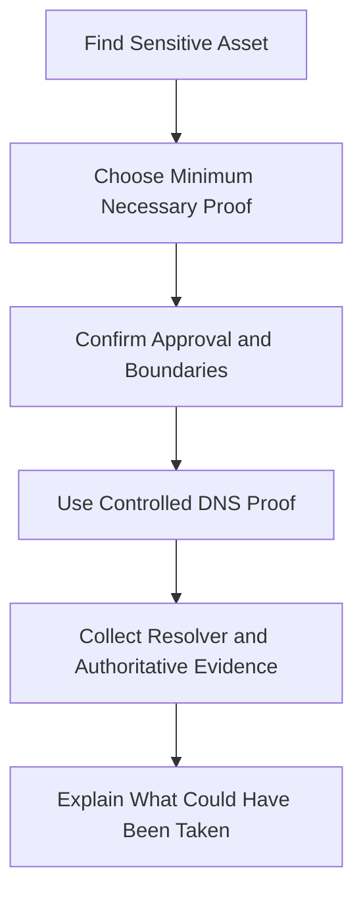
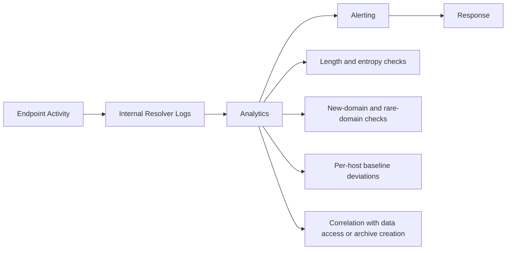

# DNS Exfiltration

> **Difficulty:** Beginner → Advanced | **Category:** Red Teaming | **MITRE ATT&CK:** [T1048 – Exfiltration Over Alternative Protocol](https://attack.mitre.org/techniques/T1048/) / [T1071.004 – DNS](https://attack.mitre.org/techniques/T1071/004/)

---

## Table of Contents

1. [Why DNS Matters in Red Teaming](#1-why-dns-matters-in-red-teaming)
2. [Authorized Use and Safety Boundaries](#2-authorized-use-and-safety-boundaries)
3. [How DNS Exfiltration Works](#3-how-dns-exfiltration-works)
4. [DNS Mechanics That Shape the Technique](#4-dns-mechanics-that-shape-the-technique)
5. [Practical Red Team Design Patterns](#5-practical-red-team-design-patterns)
6. [Beginner → Advanced Mental Model](#6-beginner--advanced-mental-model)
7. [Detection and Hardening](#7-detection-and-hardening)
8. [Key Takeaways](#8-key-takeaways)
9. [References](#9-references)

---

## 1. Why DNS Matters in Red Teaming

DNS appears in red team reporting so often because it sits at the center of normal network activity.

- endpoints need DNS to reach internal and external resources
- many organizations allow DNS egress even when other outbound paths are tightly controlled
- recursive resolvers hide the final authoritative destination from the originating host
- DNS telemetry is sometimes collected incompletely or analyzed only at a basic level

That makes DNS useful for **low-bandwidth proof of impact** in restrictive environments.

> **Important:** In a professional engagement, DNS should usually be treated as a **small, controlled proof channel** rather than a bulk-transfer method.

### Why operators care about it

| Advantage | Why it matters |
|---|---|
| Ubiquity | DNS is required almost everywhere |
| Indirection | Queries pass through recursive resolvers before reaching the authoritative server |
| Low expectations | Many defenders expect DNS noise, not business data |
| Flexible encoding space | Query names can carry small chunks of text-safe data |

### Why defenders still catch it

| Limitation | Practical impact |
|---|---|
| Very low bandwidth | good for proof, poor for large archives |
| Structured protocol limits | labels and names have hard size constraints |
| Strong modern analytics | high-entropy or very long subdomains stand out |
| Centralized observability | one resolver can expose many hosts at once |


---

## 2. Authorized Use and Safety Boundaries

DNS exfiltration is a topic for **authorized adversary emulation only**. In real engagements, the hardest part is often not the protocol. It is making the exercise safe, legal, and useful.

### Minimum-safe mindset

A mature red team asks:

> *“What is the smallest, safest proof that still demonstrates business risk?”*

That usually means preferring one of these over raw sensitive data:

- approved proof tokens
- hashes of approved files
- filenames or metadata only
- row counts, schema names, or screenshots
- a tiny sanitized sample explicitly allowed in writing

### Safety checklist before any DNS proof activity

1. confirm written authorization for the receiving domain and infrastructure
2. define what evidence types are allowed to leave the environment
3. set strict volume limits and time windows
4. document who approved the activity and how evidence will be stored
5. plan cleanup, retention, and deletion requirements in advance

### Proof-first decision model



The best red team notes do not celebrate moving data. They explain how to **prove impact responsibly**.

---

## 3. How DNS Exfiltration Works

At a high level, DNS exfiltration places small encoded fragments inside DNS requests for a domain controlled by the operator. The operator’s authoritative DNS server sees those requests and records the data-bearing parts of the name.

### Core idea

```text
<chunk>.<campaign>.<operator-domain>
```

Example anatomy:

```text
q1.host7.payload.example-redteam.net
│  │     │       └─ operator-controlled zone
│  │     └──────── encoded or tagged proof fragment
│  └────────────── source or sequence marker
└───────────────── order / campaign context
```

### End-to-end flow



### Why this works at all

The originating host usually does **not** talk directly to the operator’s server. Instead, its recursive resolver forwards the lookup outward. From the endpoint’s perspective, it may look like a standard DNS transaction. From the operator’s perspective, the authoritative server receives a stream of query names that can be reconstructed into a small proof set.

### Query path vs response path

A useful distinction:

| Path | What it means |
|---|---|
| Query-side transfer | data rides in the requested name itself |
| Response-side transfer | data or instructions appear in DNS answers such as TXT, A, or AAAA records |

For exfiltration discussions, the **query side** is usually the main focus because that is the direction leaving the client environment.

---

## 4. DNS Mechanics That Shape the Technique

A lot of beginner confusion disappears once you understand the protocol limits.

### Constraints that matter most

| DNS property | Why it matters to exfiltration |
|---|---|
| 63-octet maximum per label | each dot-separated segment has a hard size ceiling |
| 255-octet wire-format name limit | long domains reduce space available for payload |
| Case-insensitive comparison | encodings should not rely on upper/lowercase differences |
| Caching | repeated lookups may never reach the authoritative server |
| Normalization by resolvers | unusual characters and formats may be rejected or altered |
| Logging at resolvers | defenders may see full query names even if endpoints do not |

> **RFC note:** RFC 1035 is the classic reference for preferred name syntax, case handling, and DNS size limits.

### What this means in practice

#### 4.1 Bandwidth is tiny

DNS is not a realistic channel for large archives. It is much better for:

- short secrets
- proof tokens
- filenames
- hashes
- tiny approved samples

#### 4.2 Encoding must survive DNS rules

Operators need text that fits DNS naming rules. In practice, teams prefer encodings that remain stable through case folding and avoid symbols that do not belong in labels.

#### 4.3 Caching changes the behavior

If the same query name is repeated, a resolver may answer from cache instead of forwarding it again. That has two major implications:

- operators may lose visibility if they assume every query reaches the authoritative server
- defenders can look for large numbers of unique, one-time names as a suspicious pattern

#### 4.4 Shorter domains are more efficient

The longer the operator’s base domain, the less room remains for the data-bearing portion.



### Safe rule of thumb

A red team should think of DNS exfiltration as a **precision instrument**:

- low volume
- high control
- strong reporting value
- poor fit for mass transfer

---

## 5. Practical Red Team Design Patterns

This section stays intentionally focused on **design thinking**, not intrusive step-by-step execution.

### 5.1 Patterns that support realistic, low-risk proof

| Pattern | Why mature teams use it |
|---|---|
| Minimal proof artifact | reduces client data handling risk |
| Clear sequence tagging | makes later reporting and reconstruction easier |
| Host or campaign context markers | helps attribute evidence to the right source system |
| Low-and-slow pacing | avoids obvious spikes and threshold alerts |
| Resolver-aware planning | accounts for caching, split DNS, and internal forwarding |
| Short-lived approved infrastructure | limits exposure and simplifies cleanup |

### 5.2 What “practical” looks like in a safe engagement

A practical, authorized use case is often something like:

- proving that a host can reach an external authoritative DNS zone
- demonstrating that a small approved token can traverse the environment
- showing that DNS logging or DLP controls do not detect the behavior
- capturing enough evidence to explain business impact without exporting real records

### 5.3 Common mistakes inexperienced operators make

| Mistake | Why it hurts |
|---|---|
| Trying to move too much data | creates noise and weakens the lesson |
| Assuming DNS is invisible | modern defenders often baseline and score DNS behavior |
| Ignoring resolver caching | repeated names may not leave the network |
| Using real sensitive data when proof would do | increases client risk unnecessarily |
| Focusing only on transport | the real report value comes from context and impact |

### 5.4 A practical reporting-oriented model



The strongest outcome is usually not “we transferred the most.” It is “we transferred the least necessary amount and still proved the exposure clearly.”

---

## 6. Beginner → Advanced Mental Model

### Beginner view

“DNS exfiltration works because DNS is usually allowed.”

That is true, but incomplete.

### Intermediate view

“DNS exfiltration works when small encoded chunks survive naming rules and travel through recursive resolvers to an operator-controlled authoritative server.”

This is the right technical foundation.

### Advanced view

“DNS exfiltration is only valuable when the operator understands resolver architecture, caching behavior, logging maturity, split-horizon DNS, volume thresholds, and what level of proof is actually needed.”

### A maturity comparison

| Level | What the operator focuses on |
|---|---|
| Beginner | the protocol is open |
| Intermediate | the labels, limits, and resolver path |
| Advanced | safety, observability, realism, and report value |

### What advanced teams usually optimize for

- **evidence quality** over raw transfer volume
- **environment realism** over cleverness
- **detection learning** over technical novelty
- **client safety** over dramatic demonstrations

---

## 7. Detection and Hardening

Defenders do not need to block DNS completely to make this technique hard. They need strong visibility and reasonable policy.

### High-value detection ideas

- monitor full query names, not only destination IPs
- alert on very long or highly entropic subdomains
- look for sudden increases in unique DNS names from one host
- baseline normal domain diversity per host and per user group
- correlate sensitive file access with later DNS anomalies
- review direct external DNS attempts that bypass internal resolvers
- inspect or govern DNS-over-HTTPS and DNS-over-TLS paths

### A defender’s mental model



### Hardening measures that matter

| Control | Why it helps |
|---|---|
| Force endpoints to use centralized resolvers | creates a consistent observation point |
| Block direct outbound DNS from endpoints | reduces unsanctioned resolver use |
| Retain full DNS logs | enables reconstruction of suspicious names |
| Inspect encrypted DNS usage | prevents blind spots from unmanaged DoH/DoT |
| Combine DNS telemetry with EDR and DLP | reveals the full collection-to-egress chain |
| Alert on newly observed or low-reputation domains | catches suspicious external zones early |

### Why DNS is still a good exercise topic

Even when defenders detect it, DNS exfiltration is valuable in red teaming because it tests:

- egress control quality
- DNS logging depth
- anomaly detection maturity
- approval and evidence-handling procedures
- the organization’s ability to connect data access with outbound behavior

---

## 8. Key Takeaways

- DNS exfiltration is best understood as a **low-bandwidth covert proof channel**.
- The real challenge is not “can data fit in DNS?” but **can the team prove impact safely and realistically?**
- Professional red teams should prefer **minimal approved evidence** over raw sensitive data.
- Defenders can greatly reduce the risk with centralized resolvers, full query logging, and anomaly analysis.
- The most useful red team write-ups connect **DNS mechanics, safety controls, detection opportunities, and business impact** in one story.

---

## 9. References

- [MITRE ATT&CK – T1048 Exfiltration Over Alternative Protocol](https://attack.mitre.org/techniques/T1048/)
- [MITRE ATT&CK – T1071.004 DNS](https://attack.mitre.org/techniques/T1071/004/)
- [MITRE ATT&CK – TA0010 Exfiltration](https://attack.mitre.org/tactics/TA0010/)
- [RFC 1035 – Domain Names: Implementation and Specification](https://www.rfc-editor.org/rfc/rfc1035)
- [RFC 1034 – Domain Names: Concepts and Facilities](https://www.rfc-editor.org/rfc/rfc1034)
