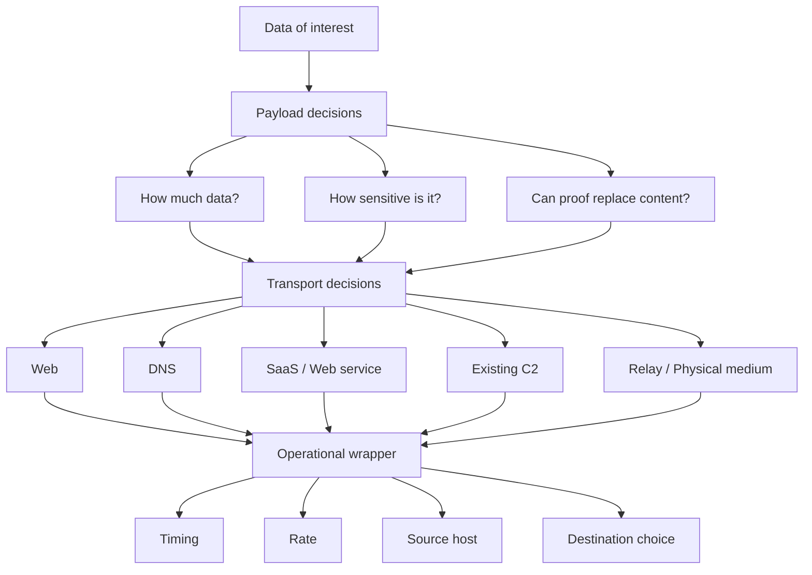
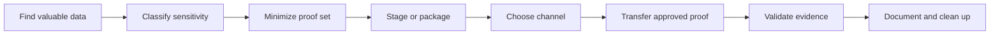
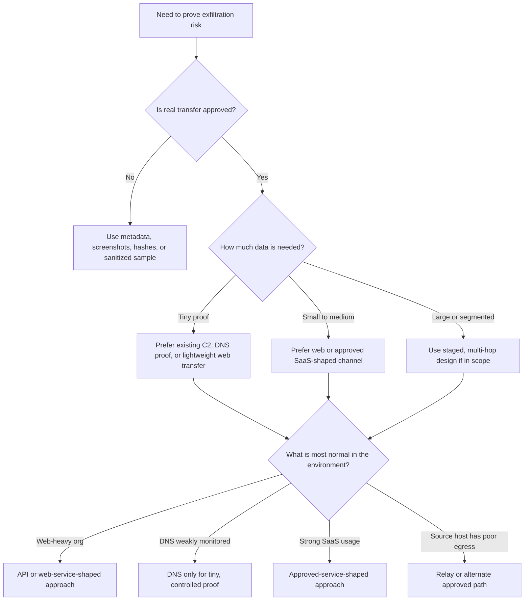
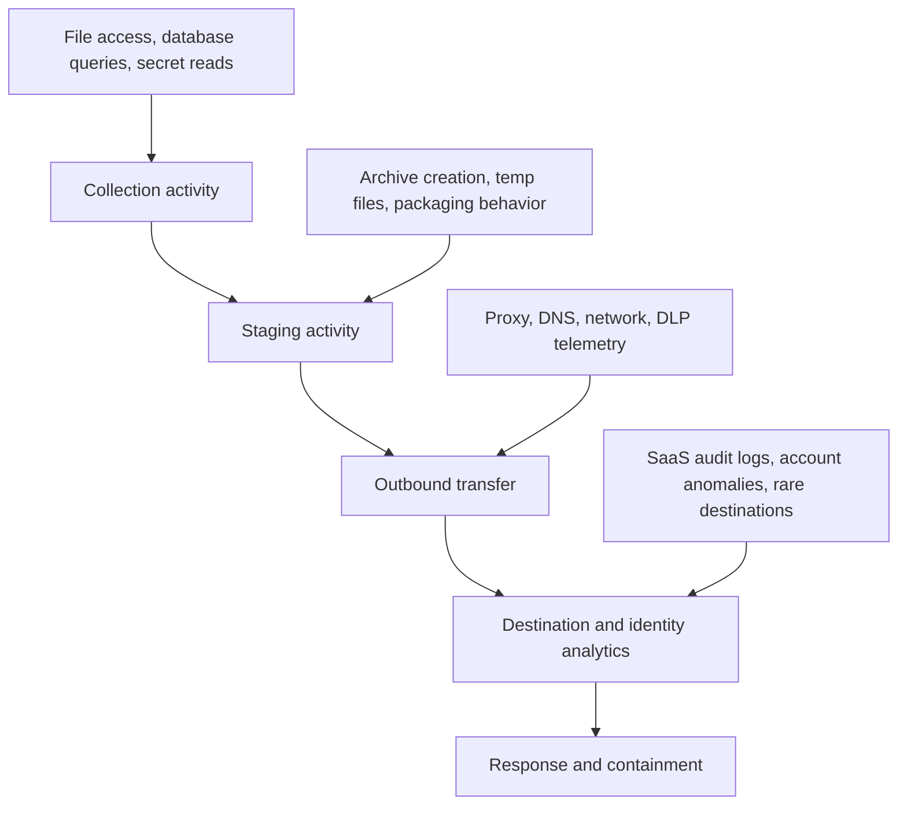
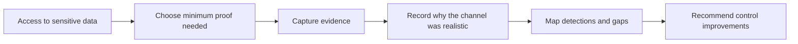

# Exfiltration Techniques

> **Difficulty:** Beginner → Advanced | **Category:** Red Teaming | **MITRE ATT&CK:** [TA0010 – Exfiltration](https://attack.mitre.org/tactics/TA0010/), [T1041](https://attack.mitre.org/techniques/T1041/), [T1048](https://attack.mitre.org/techniques/T1048/), [T1567](https://attack.mitre.org/techniques/T1567/), [T1020](https://attack.mitre.org/techniques/T1020/), [T1029](https://attack.mitre.org/techniques/T1029/), [T1030](https://attack.mitre.org/techniques/T1030/)

> **Authorized adversary-emulation only:** This note is for approved red team exercises, purple teaming, and defensive education. Use only within written scope, protect client data, and prefer minimal proof of access over transferring real sensitive content.

---

## Table of Contents

1. [What an Exfiltration Technique Really Is](#1-what-an-exfiltration-technique-really-is)
2. [The Exfiltration Pipeline](#2-the-exfiltration-pipeline)
3. [Core Technique Families](#3-core-technique-families)
4. [How Operators Choose a Channel](#4-how-operators-choose-a-channel)
5. [Practical Design Patterns](#5-practical-design-patterns)
6. [Technique Comparison Matrix](#6-technique-comparison-matrix)
7. [Environment-Specific Examples](#7-environment-specific-examples)
8. [Defender Analytics and Detection](#8-defender-analytics-and-detection)
9. [Reporting and Evidence Handling](#9-reporting-and-evidence-handling)
10. [Common Mistakes](#10-common-mistakes)
11. [Key Takeaways](#11-key-takeaways)
12. [References](#12-references)

---

## 1. What an Exfiltration Technique Really Is

Beginners often think an exfiltration technique is just a **protocol** such as HTTPS or DNS. In mature red team work, that is only one part of the picture.

An exfiltration technique is usually a combination of:

- **payload design** — what data is moved and how it is minimized
- **transport choice** — what path carries the data out
- **operational wrapper** — when, how fast, and from which host or identity the transfer happens

That is why two transfers over HTTPS can look completely different:

- one may be a noisy bulk upload that immediately triggers review
- another may look like normal API traffic and fit the organization’s usual rhythm

### A simple mental model



### Why this matters

A good red team note does not ask only:

> *“Can data leave the environment?”*

It also asks:

> *“What path makes sense for this adversary, this environment, and this level of approved realism?”*

---

## 2. The Exfiltration Pipeline

Exfiltration is rarely a single action. It is better understood as a pipeline.



### Beginner view

At a basic level, the exfiltration phase answers a simple question:

- **What could the operator take?**

### Intermediate view

At the next level, the question becomes:

- **What could the operator take without creating obviously abnormal behavior?**

### Advanced view

At the most mature level, the question becomes:

- **What proof of impact best matches the emulated adversary while still protecting client data and producing high-quality reporting evidence?**

### Practical lesson

The most professional transfer is often the **smallest** one that still proves impact.

Examples of lower-risk proof models:

- filenames and directory listings
- schema names and record counts
- screenshots of accessible sensitive content
- cryptographic hashes of approved files
- a very small sanitized sample

---

## 3. Core Technique Families

There is no single best exfiltration technique. Each family trades off **bandwidth, stealth, reliability, and investigative risk**.

### 3.1 Existing command-and-control channel

This means data leaves through the same path already used for command traffic.

**Best for:**

- low-volume proof
- quick validation that impact is possible
- engagements where simplicity matters more than bandwidth

**Strengths:**

- no new egress path is required
- infrastructure is already established
- easy to explain in reporting

**Weaknesses:**

- ties theft activity to a path defenders may already be watching
- usually poor for large transfers
- repeated use can make beacon traffic look abnormal

### 3.2 Web and HTTPS-based transfer

This is the most common modern family because web traffic is almost always allowed.

**Best for:**

- small to medium data sets
- enterprise environments with normal outbound web usage
- scenarios where business traffic already includes APIs, uploads, or telemetry

**Strengths:**

- reliable and familiar
- blends well in cloud-heavy organizations
- easy to shape around normal application behavior

**Weaknesses:**

- proxy logs, SSL inspection, and DLP can expose it
- new destinations can stand out immediately
- high-volume uploads are easy to investigate

### 3.3 DNS-shaped transfer

DNS-based exfiltration is useful when web egress is tightly filtered but recursive DNS still works.

**Best for:**

- very small artifacts
- proof of concept in restrictive egress environments
- demonstrating a blind spot in DNS monitoring

**Strengths:**

- sometimes available even in locked-down networks
- defenders often monitor it less well than web traffic
- useful for showing control gaps with tiny proofs

**Weaknesses:**

- extremely low bandwidth
- long or high-entropy queries are suspicious
- good DNS analytics catches poor implementations quickly

> **Rule of thumb:** DNS is usually a proof channel, not a bulk transfer channel.

### 3.4 Web services and SaaS platforms

This family uses a legitimate external service instead of a dedicated operator-controlled endpoint.

**Best for:**

- organizations that already rely heavily on SaaS
- remote-first or cloud-native clients
- scenarios where trusted services create realistic cover

**Strengths:**

- blends with approved business destinations
- often benefits from existing firewall allowances
- reflects many real-world campaigns mapped in ATT&CK T1567

**Weaknesses:**

- SaaS audit logs are often excellent evidence for defenders
- account behavior, tenant telemetry, and location anomalies matter
- realism goes up, but so does the need for legal and data-handling discipline

### 3.5 Email, chat, and collaboration workflows

These channels rely on everyday business communication patterns.

**Best for:**

- social-engineering-linked scenarios
- low-volume document transfer
- insider-style emulation where misuse of business tools is part of the objective

**Strengths:**

- easy for non-technical stakeholders to understand
- often aligns with insider and contractor threat models
- can demonstrate policy, DLP, and workflow weaknesses together

**Weaknesses:**

- mail gateways, attachment controls, and retention logs are powerful
- unusual sender, recipient, or file patterns stand out
- poor fit for large or repeated transfers

### 3.6 Internal relays and multi-hop staging

Instead of sending directly out, data first moves to another internal or intermediary location before final transfer.

**Best for:**

- segmented networks
- environments where the source host has poor outbound access
- adversary emulation requiring separation between collection and release points

**Strengths:**

- supports realistic campaign design
- can reduce direct exposure from the original source host
- helps explain how attackers move from collection to release

**Weaknesses:**

- creates more artifacts
- increases complexity and failure points
- defenders can correlate cross-host movement and staging behavior

### 3.7 Alternative and physical mediums

This family includes non-standard network paths or removable storage concepts.

**Best for:**

- air-gapped or highly isolated scenarios
- insider-style or niche threat models
- tabletop discussion of risk when full technical simulation is not appropriate

**Strengths:**

- useful for showing that network controls are not the whole story
- reflects ATT&CK techniques like T1011 and T1052

**Weaknesses:**

- often outside normal red team safety boundaries
- requires strong written authorization and chain-of-custody handling
- may be more appropriate as a validated scenario than an executed transfer

---

## 4. How Operators Choose a Channel

Experienced operators select a technique by working backward from the objective.

### The six questions that matter most

| Question | Why it matters |
|---|---|
| **How much data is really needed?** | Tiny proof and bulk theft require different channels. |
| **What outbound paths are normal here?** | Normality often matters more than raw bandwidth. |
| **What logs will exist?** | Proxy, DNS, SaaS, endpoint, and identity telemetry all change the choice. |
| **How sensitive is the data?** | The more regulated the data, the stronger the case for minimization. |
| **How patient can the operator be?** | Slow scheduled transfers may be safer than fast spikes. |
| **What did the client approve?** | Scope and data-handling rules override technical preference. |

### Channel selection flow



### A practical operator mindset

Instead of thinking, *“Which protocol is clever?”*, think:

- Which choice looks ordinary on this host?
- Which choice matches the emulated adversary?
- Which choice gives the report the best evidence with the least handling risk?

---

## 5. Practical Design Patterns

This is where beginner knowledge becomes operator judgment.

### 5.1 Volume discipline

A mature operator treats data volume like a risk budget.

| Proof model | Typical use | Risk level |
|---|---|---|
| Filename/path only | highly sensitive data or tight scope | Very low |
| Screenshot of access | executive reporting and regulated content | Low |
| Hash of approved file | prove possession without disclosing content | Low |
| Small sanitized sample | realistic evidence with controls | Medium |
| Full data set | only with explicit approval and strict handling | High |

### 5.2 Size shaping

MITRE ATT&CK T1030 highlights a simple reality: large transfers are easier to detect than controlled chunks.

**What it means:**

- divide movement into smaller pieces
- stay below obvious thresholds when appropriate to the scenario
- avoid sharp spikes that look unlike the host’s normal behavior

**Defender clue:** many small transfers from a host that rarely uploads anything can still be very suspicious.

### 5.3 Scheduled transfer

ATT&CK T1029 captures another common idea: timing matters.

**Why operators care:**

- scheduled movement can blend into backup, sync, or business-hour patterns
- it reduces sudden bursts that analysts notice immediately

**Defender clue:** “normal time” traffic from an unusual user, process, or destination is still abnormal.

### 5.4 Internal staging

Staging means gathering data into a temporary location before the final move.

**Why it helps:**

- simplifies transfer logistics
- supports segmented or multi-hop environments
- can keep the source system from talking directly to the final destination

**Why it is risky:**

- archive creation is visible
- staging leaves forensic artifacts
- defenders can catch the sequence: collection → staging → egress

### 5.5 Payload transformation

This usually includes some combination of:

- compression to reduce size
- chunking to manage thresholds
- encoding to fit text-oriented channels
- encryption to reduce content visibility

These are not “advanced tricks.” They are normal design choices. What makes them risky is **context**: encrypted archives or oddly structured payloads on the wrong host can be highly suspicious.

### 5.6 Identity and destination shaping

The destination and identity used during transfer often matter as much as the payload itself.

Questions to ask:

- Does this host already talk to that destination?
- Does this user normally upload data externally?
- Would this service already be allowed by policy?
- Is the traffic location or tenant behavior abnormal?

### 5.7 Reliability planning

Advanced operators design for failure.

They ask:

- What if only part of the proof arrives?
- What evidence still supports the report if transfer is interrupted?
- Does a failed transfer still show a useful detection story?

---

## 6. Technique Comparison Matrix

| Technique family | Typical volume | Stealth potential | Operational complexity | Logging surface | Best use case | Main weakness |
|---|---|---|---|---|---|---|
| Existing C2 channel | Low | Medium | Low | Beacon, EDR, network telemetry | fast proof of capability | poor scalability |
| HTTPS / API-shaped web | Low to medium | Medium to high | Medium | proxy, TLS inspection, DLP | common enterprise environments | new destinations stand out |
| DNS-based | Very low | Medium to high in weakly monitored networks | Medium | DNS logs, entropy analytics | restrictive egress, tiny proofs | bandwidth is extremely limited |
| SaaS / web service | Medium | Medium | Medium | tenant audit logs, CASB, identity telemetry | cloud-heavy organizations | strong provider-side evidence |
| Email / collaboration tools | Low to medium | Low to medium | Low | mail, chat, retention, DLP | insider-style or workflow abuse scenarios | content controls are common |
| Internal relay / multi-hop | Medium to high | Medium | High | endpoint, lateral movement, network correlation | segmented environments | more artifacts and failure points |
| Physical / alternate medium | Variable | Variable | High | physical controls, endpoint, policy review | air-gapped or special scenarios | high legal and procedural burden |

### Quick memory aid

```text
Need tiny proof?        -> C2 or DNS-shaped proof
Need reliability?       -> Web/API-shaped transfer
Need realism in SaaS org? -> Web service / cloud-shaped path
Need segmented movement? -> Internal staging or relay model
Need maximum safety?    -> Metadata, hashes, screenshots
```

---

## 7. Environment-Specific Examples

The goal here is not to provide a playbook, but to show how selection logic changes across environments.

### 7.1 Corporate workstation behind a proxy

**Usually normal:**

- web browsing
- application API calls
- approved collaboration tools

**Often practical:**

- web-shaped transfer for small proof
- SaaS-shaped transfer if it matches real employee behavior and is explicitly approved

**Usually poor choices:**

- noisy uncommon protocols
- unusually large uploads from a user endpoint

### 7.2 Cloud workload or build server

**Usually normal:**

- API traffic
- object storage access
- service-to-service authentication

**Important nuance:**

Cloud environments generate strong audit trails. A technique may blend in at the network layer while still standing out clearly in identity, API, or tenant logs.

### 7.3 Restrictive egress server

**Usually normal:**

- limited outbound web traffic
- recursive DNS
- communication only with a few internal services

**Often practical:**

- tiny proof through tightly controlled channels
- internal relay design if the source host should not speak directly outward

**Key lesson:**

On restrictive systems, small realistic proof is usually more valuable than trying to force a high-bandwidth transfer.

### 7.4 Hybrid workforce using many SaaS platforms

**Usually normal:**

- file sync
- browser-based collaboration
- API-heavy desktop applications

**Operator consideration:**

The environment may offer many believable paths, but defenders also gain richer identity and provider telemetry. The most realistic channel may also be the most attributable.

---

## 8. Defender Analytics and Detection

Red team notes on exfiltration should always include the defender’s view. This is where the exercise creates value.

### A layered detection model



### High-value defensive signals

| Signal | Why it matters |
|---|---|
| Sudden archive creation on a sensitive endpoint | Often appears between collection and transfer. |
| Sensitive data access followed by outbound connections | Strong sequence-based clue. |
| Long or high-entropy DNS queries | Common indicator of DNS misuse. |
| Rare external destination for a finance, HR, or admin host | High investigative value. |
| Unusual uploads to cloud services | Strong signal in SaaS-heavy environments. |
| “Normal” traffic from an unusual identity or geolocation | Context beats protocol. |

### Why layered defenses work

Microsoft’s DLP guidance emphasizes that organizations protect data across **apps, devices, and inline web traffic**, not just email. That matters because exfiltration rarely stays inside one telemetry source.

A mature defensive program correlates:

- what data was accessed
- where it was staged
- how it left
- which user, device, or workload was involved
- what external service or destination received it

### Useful blue team questions

1. Do we know where our crown-jewel data lives?
2. Can we detect archive creation on systems that rarely create archives?
3. Are DNS, SaaS, and proxy analytics connected, or siloed?
4. Can we tell the difference between normal file sync and suspicious transfer behavior?
5. Do we have a safe way to validate exfiltration during exercises without mishandling real data?

---

## 9. Reporting and Evidence Handling

In red teaming, the note is incomplete if it explains transfer options but ignores evidence handling.

### What should be documented

- the client approval that allowed the proof model
- what type of data was accessed
- whether proof used metadata, hashes, screenshots, or samples
- what channel family was selected and why
- what telemetry or detections were observed
- how evidence was stored, protected, and later deleted

### A safe reporting flow



### Why reporting quality matters

A dramatic but poorly controlled transfer teaches less than a careful minimal proof tied to:

- business impact
- ATT&CK mapping
- observed detection gaps
- concrete remediation priorities

---

## 10. Common Mistakes

| Mistake | Why it is a problem | Better approach |
|---|---|---|
| Moving more data than necessary | increases legal, privacy, and reporting risk | prove impact with the minimum approved evidence |
| Picking a channel only because it is fast | ignores host context and logging | choose what looks normal in that environment |
| Focusing only on payload secrecy | misses identity, destination, and timing analytics | evaluate the full observable story |
| Ignoring SaaS and tenant logs | creates false sense of stealth | assume provider-side evidence exists |
| Treating DNS as a bulk channel | unrealistic and noisy | keep DNS for tiny proofs and control validation |
| Forgetting staging artifacts | defenders often catch packaging, not transfer | include local artifact risk in planning |
| Reporting only “we exfiltrated data” | weak learning value | explain volume, path, telemetry, and business impact |

### One sentence to remember

> **Good exfiltration technique selection is less about clever transport and more about believable behavior under the client’s rules.**

---

## 11. Key Takeaways

- Exfiltration techniques are not just protocols; they are **workflows**.
- The best channel depends on **volume, normality, logging, and approval boundaries**.
- ATT&CK techniques like **T1029** and **T1030** remind us that timing and size are often as important as the protocol itself.
- SaaS and web-service exfiltration can look realistic, but they also create rich audit evidence.
- The strongest red team outcome is usually a **minimal, well-documented proof of impact** tied to concrete detection lessons.

---

## 12. References

- [MITRE ATT&CK – TA0010 Exfiltration](https://attack.mitre.org/tactics/TA0010/)
- [MITRE ATT&CK – T1041 Exfiltration Over C2 Channel](https://attack.mitre.org/techniques/T1041/)
- [MITRE ATT&CK – T1048 Exfiltration Over Alternative Protocol](https://attack.mitre.org/techniques/T1048/)
- [MITRE ATT&CK – T1567 Exfiltration Over Web Service](https://attack.mitre.org/techniques/T1567/)
- [MITRE ATT&CK – T1020 Automated Exfiltration](https://attack.mitre.org/techniques/T1020/)
- [MITRE ATT&CK – T1029 Scheduled Transfer](https://attack.mitre.org/techniques/T1029/)
- [MITRE ATT&CK – T1030 Data Transfer Size Limits](https://attack.mitre.org/techniques/T1030/)
- [Microsoft Learn – Learn about data loss prevention](https://learn.microsoft.com/en-us/purview/dlp-learn-about-dlp)
