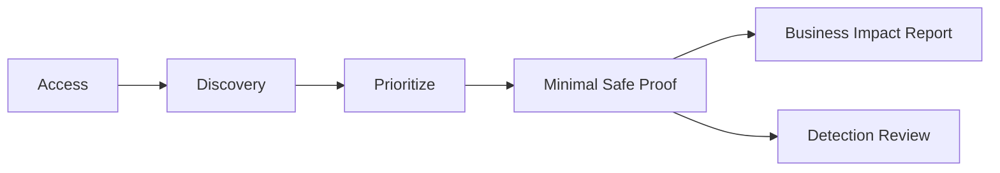
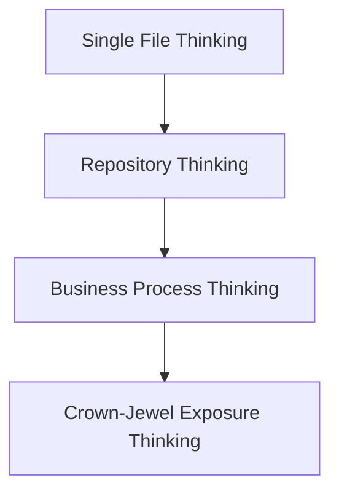
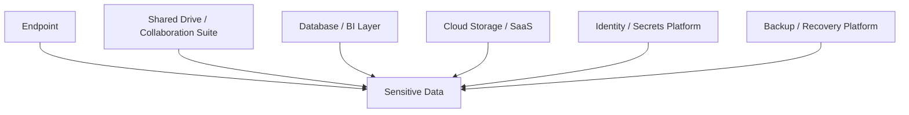
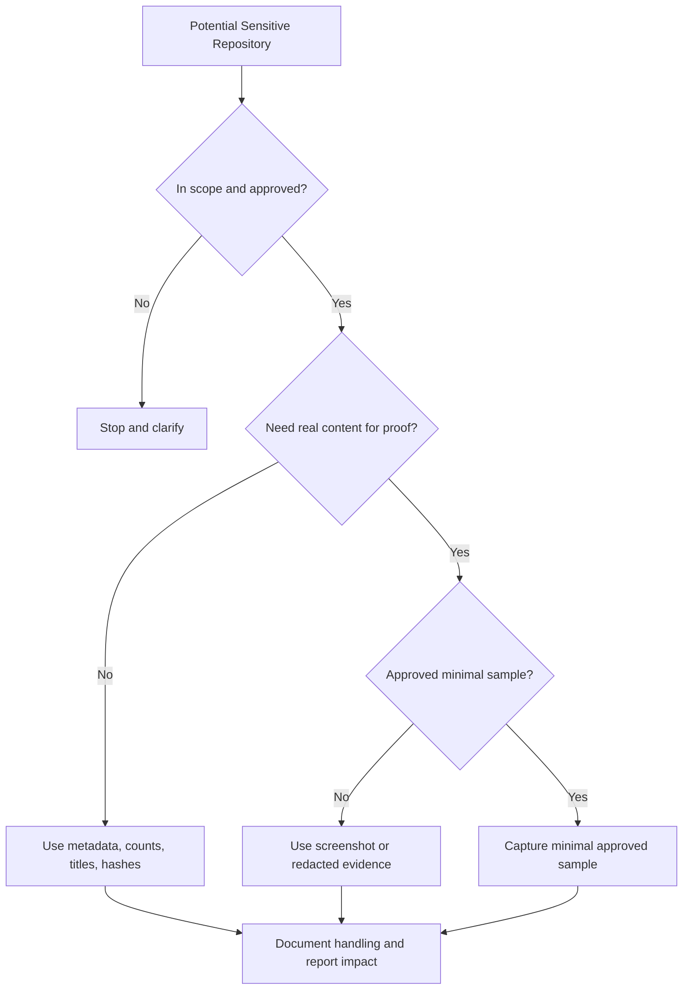
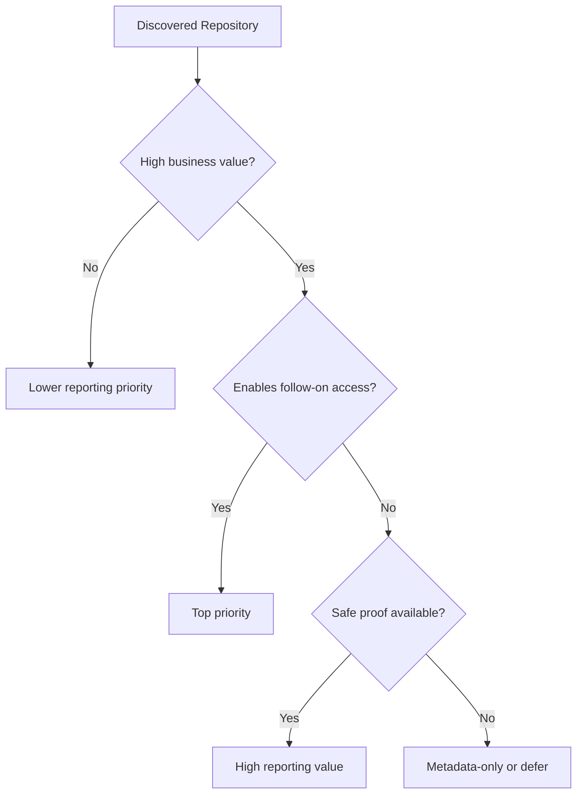
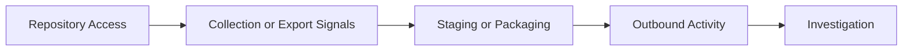

# Sensitive Data Discovery

> **Phase 13 — Data Exfiltration**  
> **Focus:** Finding and safely proving access to the information that would matter most to the client during an authorized adversary-emulation exercise.  
> **Safety note:** This note is for authorized red teaming and defensive validation only. It explains how to identify, prioritize, and evidence sensitive data exposure without providing step-by-step intrusion instructions.

---

**Relevant ATT&CK concepts:** TA0009 Collection | TA0010 Exfiltration | T1005 Data from Local System | T1039 Data from Network Shared Drive | T1213 Data from Information Repositories | T1074 Data Staged | T1560 Archive Collected Data

---

## Table of Contents

1. [Why It Matters](#why-it-matters)
2. [Beginner View](#beginner-view)
3. [What Counts as Sensitive Data](#what-counts-as-sensitive-data)
4. [The Crown-Jewel Mindset](#the-crown-jewel-mindset)
5. [Common Repositories and Where Sensitive Data Hides](#common-repositories-and-where-sensitive-data-hides)
6. [A Safe Discovery Workflow](#a-safe-discovery-workflow)
7. [Prioritization Matrix](#prioritization-matrix)
8. [Safe Proof Models](#safe-proof-models)
9. [Practical Adversary-Emulation Scenarios](#practical-adversary-emulation-scenarios)
10. [Detection Opportunities](#detection-opportunities)
11. [Defensive Controls](#defensive-controls)
12. [Key Takeaways](#key-takeaways)
13. [References](#references)

---

## Why It Matters

Sensitive data discovery is the point where a technical foothold becomes a **business story**.

A shell, a cloud session, or an administrative login may prove compromise. But leadership usually cares more about a different question:

> **What could a realistic adversary have reached, reused, or taken from here?**

That is why mature red team work treats data discovery as more than “look for files.” It is a disciplined effort to answer:

- what information is most valuable to the organization
- where that information actually lives
- which identities and systems can reach it
- how to prove exposure safely without mishandling client data

A useful mental model is:

- **compromise** tells you where you are
- **discovery** tells you what matters
- **proof** tells the client what was truly at risk

---

## Beginner View

At a beginner level, sensitive data discovery means learning to look past the operating system and think about the **organization's important information**.

### Simple idea

If you land on a workstation, server, cloud tenant, or SaaS admin panel, do not ask only:

> “What files are here?”

Ask instead:

> “What business process does this system touch, and what sensitive information flows through it?”

### Beginner → Advanced progression

| Level | Typical thinking | More mature thinking |
|---|---|---|
| Beginner | “Find passwords or customer files.” | “Find the data that best proves business impact.” |
| Intermediate | “Look at shares, databases, and cloud storage.” | “Map identities, repositories, exports, and backups.” |
| Advanced | “Find valuable files.” | “Understand the shortest path from access to crown-jewel data with the least risky proof model.” |

### The big shift

Beginners search for **obvious content**.

Experienced operators search for **valuable repositories, delegated access, and trust paths**.

That shift is important because sensitive data is often not sitting in one dramatic folder named `secret-data`. It is spread across collaboration platforms, exports, backups, CI/CD pipelines, dashboards, shared drives, and cloud services.

---

## What Counts as Sensitive Data

In an authorized adversary-emulation exercise, “sensitive” means more than regulated data.

It includes **anything whose exposure, theft, alteration, or reuse would materially help an adversary or materially harm the client**.

### Major categories

| Category | Examples | Why it matters |
|---|---|---|
| Identity material | passwords, API keys, session tokens, SSH keys, certificates | enables more access and persistence |
| Regulated data | PII, PHI, payment data, student records | legal, regulatory, and breach-notification impact |
| Intellectual property | source code, models, product designs, formulas | strategic and competitive damage |
| Business operations data | contracts, HR files, finance data, forecasts | reputational and operational harm |
| Security architecture data | network diagrams, IAM mappings, runbooks, inventories | helps future compromise and evasion |
| Recovery material | backups, snapshots, recovery docs, secrets escrow | supports mass impact and resilience bypass |
| Executive or legal data | board decks, M&A plans, privileged investigations | high-value strategic exposure |

### A practical definition

A data source becomes especially important when it has one or more of these properties:

1. **High business value** — leadership would care immediately if it were exposed.
2. **High adversary value** — it helps expand access, persistence, or leverage.
3. **High breadth** — one repository affects many users, systems, or business units.
4. **High sensitivity** — it is regulated, confidential, or strategically significant.

### Confidentiality is only part of the story

| Security property | Example question |
|---|---|
| Confidentiality | Would disclosure trigger legal, financial, or reputational damage? |
| Integrity | Would modification of this data change business outcomes or trust? |
| Availability | Would loss of this data weaken recovery or normal operations? |

For example, backups and CI/CD secrets are not just confidential. They can also affect **integrity** and **availability**, which is why they are often more dangerous than people realize.

---

## The Crown-Jewel Mindset

A strong red team note should connect **business value** to **technical reachability**.

The crown-jewel mindset asks:

- what information the client truly cares about
- which systems and repositories hold it
- which identities can reach it
- how a realistic adversary would recognize it as valuable
- how to prove that exposure with the least invasive evidence

### Crown-jewel path model

### Questions mature operators ask

| Question | Why it matters |
|---|---|
| What would matter most to executives, legal, or regulators? | Keeps reporting aligned to business reality |
| What data would a real adversary reuse for further access? | Prioritizes identity material, configs, and recovery assets |
| Which repositories concentrate the most value? | Helps find broad impact with less noise |
| Can we prove access with metadata instead of content? | Reduces data-handling risk |
| Does this finding match the adversary model? | Improves realism and reporting fidelity |

### Common mistake

A common beginner mistake is to over-focus on production databases and ignore everything around them.

In practice, a real adversary may care just as much about:

- exported CSVs on analyst endpoints
- cloud storage buckets with reports or backups
- CI/CD secrets that unlock deployments
- documentation platforms containing architecture and credentials
- ticketing systems containing screenshots, logs, and troubleshooting artifacts

Sometimes the easiest-to-reach data is not the primary database, but the **less protected copy of it**.

---

## Common Repositories and Where Sensitive Data Hides

Sensitive data discovery gets easier when you stop thinking only in terms of hosts and start thinking in terms of **repositories**.

### 1. Endpoints

Common high-value data on user and administrator endpoints includes:

- synchronized document folders
- downloaded reports and exports
- browser-saved or application-cached credentials
- local developer environments and configuration files
- screenshots, notes, and temporary archives
- mail attachments and offline copies of shared documents

**Why endpoints matter:** they often contain the human-friendly version of sensitive data after it has already been exported from a controlled system.

### 2. File shares and collaboration platforms

Typical repositories include:

- department shares for HR, finance, legal, and engineering
- SharePoint, Google Drive, OneDrive, Confluence, and similar systems
- wiki spaces with architecture diagrams or support procedures
- team folders holding board material, contracts, or incident records

**Why they matter:** these systems often combine broad visibility, weak ownership, and years of accumulated sensitive content.

### 3. Databases and analytics layers

Important sources may include:

- production databases
- reporting replicas and data warehouses
- business intelligence exports and dashboards
- staging data stores that mirror production content
- scheduled report outputs and flat-file extracts

**Why they matter:** organizations often protect the main database better than the reporting and export ecosystem around it.

### 4. Cloud storage and SaaS applications

Common examples include:

- object storage buckets and blob containers
- SaaS admin portals
- CRM and ticketing platforms
- artifact registries and package repositories
- audit, logging, and data lake platforms

**Why they matter:** permissions can sprawl quickly, and cross-system integrations may expose more than the primary application itself.

### 5. Identity, secrets, and trust infrastructure

High-impact data sources include:

- password vaults
- IAM role mappings and delegated admin records
- application secrets and certificates
- SSO and federation configurations
- signing keys and service account material

**Why they matter:** these repositories may contain less data volume than a file share, but they often provide much higher **reusability** for a realistic adversary.

### 6. Backup, recovery, and operational systems

Often overlooked but extremely valuable:

- backup consoles and repositories
- snapshots and exported archives
- disaster recovery documents
- infrastructure-as-code state files
- recovery credentials and escrowed keys

**Why they matter:** backups frequently provide broad historical coverage of the environment in one place.

### Repository comparison table

| Repository type | Typical contents | Why it is attractive | Safer proof style |
|---|---|---|---|
| Endpoint sync folder | exports, working docs, screenshots | user-curated high-value data | filenames, timestamps, partial screenshot |
| Shared drive or collaboration site | cross-team documents, finance, legal, engineering | concentration of business data | folder metadata, owner, document titles |
| Reporting database or BI platform | customer data, operational metrics | broad records and easy executive impact | schema names, row counts, sanitized sample |
| CI/CD or artifact platform | deployment tokens, configs, signing material | enables follow-on access | variable names, role scope, access screenshot |
| Secret store or vault | credentials, certificates, API tokens | high leverage despite small volume | access proof, secret type, scope metadata |
| Backup system | compressed copies of many systems | wide blast radius | inventory view, backup set names, retention info |

### Visualizing the repository view

The best discovery notes help readers see that crown-jewel exposure is usually **distributed**, not isolated.

---

## A Safe Discovery Workflow

This workflow is about **authorized assessment handling**, not intrusion steps.

### Stage 1: Confirm scope and handling rules

Before treating any repository as a target for proof, confirm:

- the repository is in scope
- the client permits access validation for that data type
- retention and deletion requirements are understood
- regulated or privileged material has special handling rules

### Stage 2: Identify likely high-value repositories

Use the adversary model and the environment type to predict where meaningful data is most likely to live.

Examples:

- espionage-focused exercises may emphasize R&D, legal, and executive repositories
- financially motivated scenarios may emphasize identity material, finance systems, backups, and payment-related data
- insider-style scenarios may emphasize collaboration platforms, exports, and SaaS admin paths

### Stage 3: Classify sensitivity and owner

For each promising repository, ask:

- who owns this data
- what business process it supports
- whether it is primary data, exported data, or backup data
- whether it enables follow-on compromise or only business impact proof

### Stage 4: Choose the least invasive proof model

In many engagements, metadata is enough.

Use the smallest proof that still answers the engagement objective:

- path and filename evidence
- schema names and record counts
- screenshot with careful redaction
- cryptographic hash of a permitted sample
- minimal sanitized sample only when explicitly approved

### Stage 5: Capture evidence and document handling

Good evidence collection includes:

- what was accessed
- why it matters
- how access was validated
- what was retained for reporting
- who approved any handling beyond metadata

### Stage 6: Stop when the point is proven

A mature operator knows when to stop. The goal is not to collect the maximum amount of client data. The goal is to prove the risk clearly and safely.

---

## Prioritization Matrix

Not every sensitive source deserves equal attention. Strong prioritization keeps the exercise realistic and safe.

### Practical scoring factors

| Factor | High score means |
|---|---|
| Business impact | the data matters directly to leadership, customers, or regulators |
| Adversary reuse value | the data helps gain more access, persistence, or leverage |
| Breadth | one repository exposes many users, systems, or business units |
| Evidence safety | meaningful proof is possible without excessive data handling |
| Environmental realism | the repository fits the emulated adversary and path |
| Detection value | the activity should teach defenders something useful |

### Quick prioritization logic

### Example priorities

| Example repository | Likely priority | Why |
|---|---|---|
| Customer analytics export share | High | strong business impact and easy executive understanding |
| Signing-key or certificate store | Very high | smaller volume, but major trust and follow-on risk |
| Backup management console | Very high | broad coverage and recovery implications |
| Old project wiki | Medium | may be sensitive, but impact is often narrower |
| General user downloads folder | Variable | depends on role, department, and contents |

A useful rule is:

> **Prefer the evidence source that best combines business impact, adversary realism, and safe handling.**

---

## Safe Proof Models

The hardest part of sensitive data discovery is often not finding the data. It is proving the finding without becoming the incident.

### Proof options

| Proof model | Best for | Strength | Handling risk |
|---|---|---|---|
| File path, title, metadata | highly sensitive content | lowest exposure and good location context | low |
| Folder view or repository screenshot | collaboration systems, shares, portals | strong for executives and reviewers | low-medium |
| Schema names and record counts | databases and analytics systems | proves scale without exposing records | low |
| Hash of approved sample | proving possession without revealing contents | strong technical evidence | low-medium |
| Sanitized sample | approved demonstrations | clear business realism | medium |
| Full content transfer | rare, tightly controlled cases only | highest realism | highest |

### What good reporting sounds like

Weak reporting:

> “We stole the whole database.”

Stronger reporting:

> “We validated access to the customer reporting repository containing approximately 1.8 million records. Per engagement restrictions, only schema names, record counts, and a sanitized screenshot were retained as evidence.”

### Executive proof vs defender proof

| Audience | Usually cares about |
|---|---|
| Executives | what data was at risk and why it matters |
| Legal / compliance | whether regulated or privileged content was reachable |
| Defenders | what repository was touched, by which identity, with what telemetry |
| Engineers | which trust paths and permissions enabled the exposure |

The best evidence set often includes **one business-readable artifact** and **one defender-usable artifact**.

---

## Practical Adversary-Emulation Scenarios

These examples stay conceptual on purpose. They show how to think, not how to break in.

### Scenario 1: Developer workstation access

| Aspect | Example |
|---|---|
| Likely repositories | local code checkout, cloud CLI context, sync folders, docs exports |
| Sensitive data types | source code, environment files, API tokens, architecture notes |
| Safe proof | repository names, secret type metadata, redacted screenshot |
| Defender lesson | developer endpoints often bridge code, cloud, and documentation |

### Scenario 2: Collaboration-suite access

| Aspect | Example |
|---|---|
| Likely repositories | shared drives, executive folders, incident docs, finance reports |
| Sensitive data types | board material, contracts, HR files, response records |
| Safe proof | folder titles, owner metadata, document counts, redacted preview |
| Defender lesson | SaaS permissions and external sharing often matter as much as endpoint security |

### Scenario 3: CI/CD or build-platform access

| Aspect | Example |
|---|---|
| Likely repositories | pipeline variables, artifacts, deployment manifests, signing material |
| Sensitive data types | service credentials, release packages, internal configs |
| Safe proof | variable names, scope metadata, role mappings, artifact listings |
| Defender lesson | build systems can expose both intellectual property and future compromise paths |

### Scenario 4: Backup or recovery platform access

| Aspect | Example |
|---|---|
| Likely repositories | backup sets, snapshots, restore inventories, retention policies |
| Sensitive data types | historical system images, exported databases, escrowed keys |
| Safe proof | backup set names, protected system inventory, retention screenshots |
| Defender lesson | backup platforms concentrate enormous value and often have weaker day-to-day scrutiny |

### A useful advanced insight

The most dangerous repository is not always the most obvious one.

A small secrets vault, signing service, or backup console may produce more realistic impact than a noisy attempt to show access to every database in the company.

---

## Detection Opportunities

Many organizations monitor outbound transfer more closely than **the search for meaningful data**. That leaves a blind spot.

### Valuable discovery-stage signals

- unusual access to high-sensitivity shares or collaboration spaces
- broad listing, search, or export behavior from identities that do not normally perform it
- service accounts touching user-oriented repositories
- endpoint access to legal, finance, executive, or HR data from unusual roles
- access to backups, snapshots, and recovery inventories outside normal administration patterns
- movement from repository access to staging behavior or archive creation
- new API clients or tokens reading large amounts of SaaS data

### Layered detection model

### Discovery-focused questions defenders should ask

1. Do we know which repositories hold crown-jewel data?
2. Can we tell when a normal user or service suddenly touches unusual sensitive sources?
3. Are collaboration platforms, BI tools, and backup systems monitored like core infrastructure?
4. Can we correlate repository access with later staging or exfiltration activity?
5. Do our alerts distinguish routine administration from suspicious broad discovery?

---

## Defensive Controls

Sensitive data discovery is much harder for an adversary when organizations make data easier to classify and harder to reach casually.

| Control | Why it helps |
|---|---|
| Data inventory and classification | tells defenders where crown-jewel data actually lives |
| Least-privilege and role review | reduces routine overexposure of valuable repositories |
| Secret management discipline | keeps credentials and certificates out of casual storage locations |
| Collaboration and SaaS governance | limits sprawl, oversharing, and anonymous links |
| Backup isolation and privileged access control | protects the broadest single copies of enterprise data |
| Database and repository activity monitoring | improves visibility into unusual access patterns |
| DLP and egress monitoring | helps catch movement after discovery |
| Data security posture management | surfaces exposed stores, stale permissions, and risky sharing |
| Safe evidence policies for exercises | lets red teams prove impact without mishandling production data |

### Defensive maturity progression

| Maturity level | What it looks like |
|---|---|
| Basic | some DLP, limited repository visibility, mostly reactive access reviews |
| Intermediate | classified repositories, stronger role ownership, SaaS audit coverage |
| Advanced | crown-jewel mapping, behavioral analytics, repository-specific detections, approved proof workflows |

The strongest organizations do not rely on one control. They combine **classification, access governance, telemetry, and safe exercise procedures**.

---

## Key Takeaways

- Sensitive data discovery is the bridge between technical access and business impact.
- The right question is not just “what files exist?” but “what information matters most, where does it live, and how can we prove exposure safely?”
- Realistic adversary-emulation work prioritizes **repositories, identities, exports, and backups**, not just obvious databases.
- The best proof is usually the **minimum evidence necessary** to show impact clearly.
- Defenders should monitor not only exfiltration, but also the earlier behavior of **searching for and concentrating sensitive data**.

---

## References

- [MITRE ATT&CK – Collection (TA0009)](https://attack.mitre.org/tactics/TA0009/)
- [MITRE ATT&CK – Exfiltration (TA0010)](https://attack.mitre.org/tactics/TA0010/)
- [MITRE ATT&CK – T1005 Data from Local System](https://attack.mitre.org/techniques/T1005/)
- [MITRE ATT&CK – T1039 Data from Network Shared Drive](https://attack.mitre.org/techniques/T1039/)
- [MITRE ATT&CK – T1213 Data from Information Repositories](https://attack.mitre.org/techniques/T1213/)
- [MITRE ATT&CK – T1074 Data Staged](https://attack.mitre.org/techniques/T1074/)
- [MITRE ATT&CK – T1560 Archive Collected Data](https://attack.mitre.org/techniques/T1560/)
- [NIST Privacy Framework](https://www.nist.gov/privacy-framework)
- [Verizon Data Breach Investigations Report](https://www.verizon.com/business/resources/reports/dbir/)
