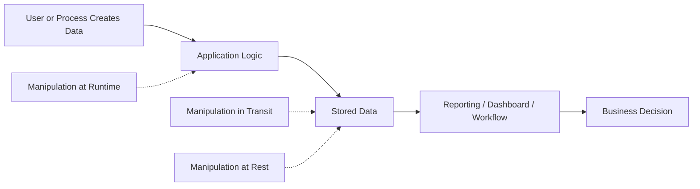
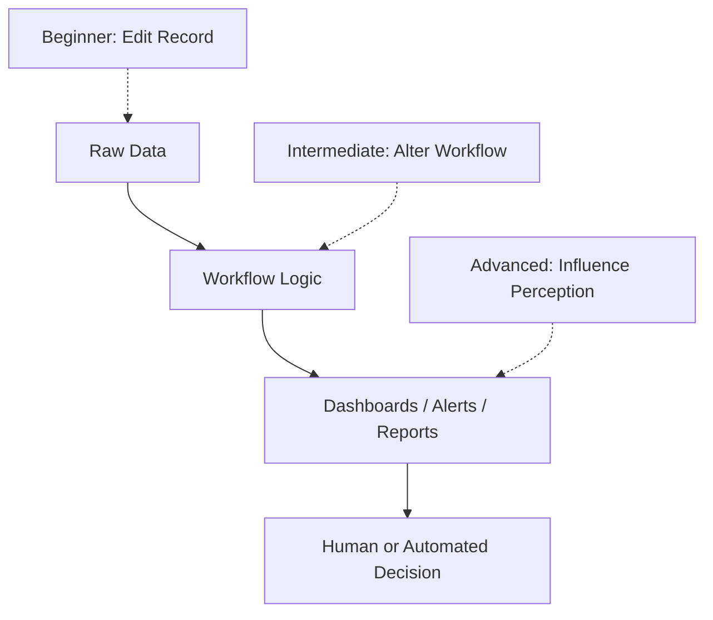
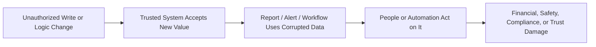
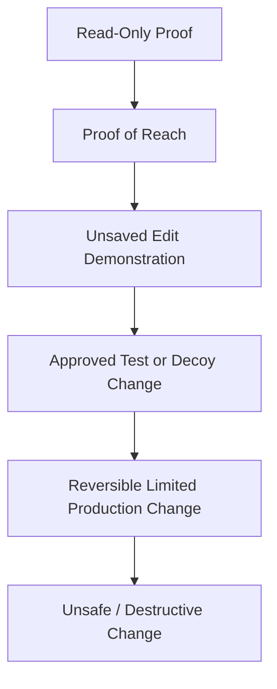
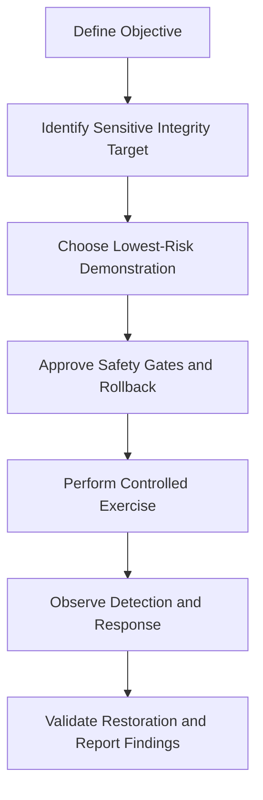
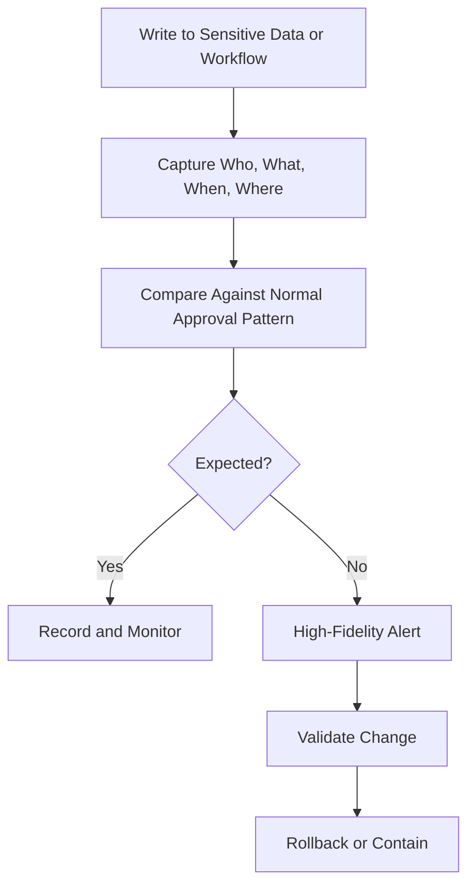

# Data Manipulation

> **Difficulty:** Beginner → Advanced | **Category:** Red Teaming | **Related ATT&CK:** [T1565 – Data Manipulation](https://attack.mitre.org/techniques/T1565/) / [TA0040 – Impact](https://attack.mitre.org/tactics/TA0040/)

> **Authorized-use note:** This topic is for **approved adversary emulation, defensive testing, and reporting**. The goal is to understand integrity risk and safely demonstrate it. Do **not** use these ideas for unauthorized intrusion or destructive actions.

---

## Table of Contents

1. [Why Data Manipulation Matters](#1-why-data-manipulation-matters)
2. [What ATT&CK Means by Data Manipulation](#2-what-attck-means-by-data-manipulation)
3. [Beginner → Advanced Mental Model](#3-beginner--advanced-mental-model)
4. [Where Integrity Failures Hurt the Business](#4-where-integrity-failures-hurt-the-business)
5. [Safe Red Team Demonstration Patterns](#5-safe-red-team-demonstration-patterns)
6. [Designing a Responsible Exercise](#6-designing-a-responsible-exercise)
7. [What Defenders Should Detect and Prevent](#7-what-defenders-should-detect-and-prevent)
8. [Reporting Data Manipulation Clearly](#8-reporting-data-manipulation-clearly)
9. [Key Takeaways](#9-key-takeaways)
10. [References](#10-references)

---

## 1. Why Data Manipulation Matters

Many people think impact means only:

- stealing data
- encrypting data
- deleting data
- stopping services

But **changing trusted data** can be just as damaging.

If a record still exists, people may assume it is correct. That makes integrity attacks dangerous: the business keeps operating, but it operates on **false information**.

### Simple examples

- a vendor bank account is changed before payment is released
- a fraud alert is closed or downgraded without authorization
- a manufacturing threshold is altered so bad output looks normal
- a patient record is edited in a way that changes treatment decisions
- a CI/CD setting is modified so an unsafe build is treated as approved

### Why this is powerful in red team work

Executives may not care about a statement like:

> “The team gained write permissions in an internal application.”

They care a lot about:

> “The team proved it could change a finance approval record, meaning an attacker could influence payments or reporting decisions.”

---

## 2. What ATT&CK Means by Data Manipulation

MITRE ATT&CK defines **Data Manipulation (T1565)** as inserting, deleting, or changing data to influence outcomes or hide activity. In practice, this is an **integrity attack**.

### The three major forms

| Form | What it means | Easy example |
|---|---|---|
| **Stored data manipulation** | changing data at rest | editing a database row, file, document, or stored email |
| **Transmitted data manipulation** | altering data while it moves | changing data between systems before the receiver trusts it |
| **Runtime data manipulation** | changing what a user or process sees while it runs | causing the application to display or consume false values |

### Integrity is different from theft

| Objective | Main question |
|---|---|
| **Data theft** | “Was the data exposed?” |
| **Data destruction** | “Is the data gone?” |
| **Data manipulation** | “Can the data still be trusted?” |

That last question is often the hardest one to answer quickly during an incident.

---

## 3. Beginner → Advanced Mental Model

The easiest way to learn this topic is to think in layers.

### Beginner: direct record changes

At the beginner level, data manipulation means:

- changing a row
- editing a document
- altering a configuration value
- modifying an approval state

This is the most visible form of integrity impact.

### Intermediate: workflow and trust manipulation

At the intermediate level, the attacker is no longer changing only the record itself. They are changing the **process around the record**.

Examples:

- rerouting approvals
- changing alert severity thresholds
- altering ticket status or escalation logic
- modifying allowlists, routing rules, or reconciliation logic

This matters because many organizations trust the workflow more than the raw data.

### Advanced: decision and perception manipulation

At the advanced level, the goal is to influence what operators, systems, or leaders **believe**.

Examples include:

- manipulating dashboard values
- causing monitoring systems to show false normality
- altering data feeds used by downstream analytics
- changing deployment or release metadata so malicious or unsafe output appears legitimate

### Key lesson

The most dangerous integrity attacks are often not the loudest ones.  
They are the ones that make defenders, operators, or finance teams trust the wrong output.

---

## 4. Where Integrity Failures Hurt the Business

Data manipulation becomes more serious when the altered data drives a real-world decision.

### High-value target areas

| Area | What makes it sensitive | Example business effect |
|---|---|---|
| **Finance / ERP** | trusted by accounting and payment teams | payment fraud, reporting errors, reconciliation failures |
| **Identity / IAM** | controls who gets access and with what privileges | silent privilege expansion, improper approvals |
| **SOC / ticketing** | drives incident response and triage | missed incidents, slower containment, false closure |
| **CI/CD and build systems** | creates trusted software outputs | unsafe release, poisoned deployment, supply chain risk |
| **Healthcare / OT / manufacturing** | affects safety or physical operations | safety incidents, bad production decisions, compliance failures |
| **Executive reporting** | shapes leadership understanding | wrong risk decisions, delayed response, false assurance |

### Integrity impact chain

### A useful way to explain it

Think of integrity failures as **decision poisoning**.

The attacker may never need to steal a million records if they can:

- make the wrong payment happen
- hide the right alert
- approve the wrong action
- release the wrong software

---

## 5. Safe Red Team Demonstration Patterns

A professional red team should usually prove capability with the **lowest-risk action** that still convinces the client.

### Preferred order of safety

Red teams should aim to stay in the first five levels and avoid the last one unless the engagement is explicitly designed for that risk.

### Safe demonstration methods

| Method | What it proves | Why it is safer |
|---|---|---|
| **Read-only verification** | the team reached a sensitive integrity point | no data is changed |
| **Unsaved edit proof** | the interface or API allows modification | shows write path without committing |
| **Test or decoy record update** | a realistic integrity change is possible | easy to reverse, low business impact |
| **Sandbox workflow exercise** | approval or routing logic can be altered | validates process risk outside production |
| **Reversible production marker** | a narrowly approved live change can occur | highest realism while remaining controlled |

### Good red-team safety questions

Before any integrity test, ask:

1. Is a real change necessary, or will proof of capability be enough?
2. Is there a pre-approved test record, dummy asset, or decoy object?
3. Can the change be rolled back in seconds?
4. Who validates the rollback?
5. Which monitoring teams need deconfliction or real-time notice?
6. What is the business stop condition if anything unexpected happens?

### What red teams should usually avoid

- changing real payroll, HR, medical, legal, or safety data without a dedicated exercise framework
- making broad production edits just to “prove impact”
- altering data that downstream systems may automatically replicate
- modifying logs or evidence in a way that harms incident response or audit obligations

> **Warning:** Integrity testing becomes risky very quickly because one small change can spread to caches, dashboards, backups, reports, and partner systems.

---

## 6. Designing a Responsible Exercise

The best data manipulation exercises are tightly scoped and clearly reversible.

### Recommended exercise model

### Practical exercise phases

#### 1. Choose the business question

Examples:

- Could an attacker influence a payment decision?
- Could an attacker silently close or alter security alerts?
- Could an attacker change a trusted release or approval path?

If the question is clear, the exercise stays focused.

#### 2. Map the trust path

For any integrity target, identify:

- where the data is created
- where it is stored
- what systems reuse it
- who approves it
- which dashboards, reports, or automations depend on it

This is important because the real impact may appear **downstream**, not at the point of change.

#### 3. Select the least harmful proof

Examples of acceptable red-team proofs:

- demonstrating that a pre-approved test invoice can be edited
- changing a decoy SOC ticket status
- altering a staging configuration value with rollback confirmed
- proving write access to a release control without publishing a real change

#### 4. Define safety gates

| Safety gate | Why it matters |
|---|---|
| written approval | proves the effect is authorized |
| named emergency contacts | enables immediate deconfliction |
| rollback instructions | prevents confusion during restoration |
| business freeze windows | avoids colliding with critical operations |
| evidence plan | ensures the report is credible without repeating the test |

#### 5. Measure the response

A mature exercise does not stop at “we changed it.”

Also measure:

- how long it took to detect
- whether anyone questioned the changed value
- how quickly the organization verified integrity
- whether rollback was fast and accurate
- whether related systems noticed the inconsistency

---

## 7. What Defenders Should Detect and Prevent

Defenders often watch for reads, exports, and deletion. Many are weaker at detecting **unauthorized writes**.

### Defensive priorities

| Control area | Defensive goal |
|---|---|
| **Separation of duties** | prevent one identity from both creating and approving sensitive changes |
| **Change validation** | require maker-checker approval for high-risk edits |
| **Immutable or append-only audit trails** | preserve evidence even if the main data changes |
| **Versioning and rollback** | restore trusted state quickly |
| **Integrity monitoring** | alert on changes to critical tables, configs, and workflows |
| **Out-of-band verification** | confirm sensitive changes through a second trusted channel |

### Detection mindset

Ask:

- Who changed the value?
- Was that identity expected to make this type of change?
- Did the change happen at a strange time or from a strange location?
- Did the change bypass the normal approval process?
- Did related systems immediately begin behaving differently?

### A simple integrity-monitoring model

### Advanced defender lesson

The best integrity defenses are not just about blocking writes.  
They also help teams answer:

> “What was the last known good state, and how quickly can we restore trust in the data?”

That is why version history, audit integrity, and change provenance matter so much.

---

## 8. Reporting Data Manipulation Clearly

A weak report says:

> “Write access to application records was obtained.”

A strong report says:

> “The team demonstrated, using a pre-approved test invoice, that an attacker with the same access path could alter financial records before downstream reconciliation, creating fraud risk and undermining trust in monthly reporting.”

### What strong reporting should include

| Evidence | Why it matters |
|---|---|
| target data type or workflow | shows what was at risk |
| approval and safety constraints | proves professionalism and control |
| exact change performed | keeps the exercise reproducible and auditable |
| before/after state | makes integrity impact obvious |
| downstream business effect | translates technical risk into business language |
| rollback confirmation | shows the team restored the environment safely |
| detection outcome | shows whether defenders can catch integrity abuse |

### Useful metrics

- **time to detect unauthorized write**
- **time to validate whether the value was trustworthy**
- **time to restore the last known good state**
- **number of downstream systems affected**
- **whether approval controls stopped or merely logged the action**

### Reporting structure that works well

1. **Objective** – what integrity risk was being tested  
2. **Authorized demonstration** – what safe action was performed  
3. **Observed business consequence** – what would have happened at scale  
4. **Detection and response result** – whether defenders noticed  
5. **Recommended controls** – how to reduce recurrence and blast radius  

---

## 9. Key Takeaways

- **Data manipulation is an integrity attack**, not just a technical write action.
- The real danger is often **decision poisoning**, not visible destruction.
- MITRE ATT&CK separates manipulation into **stored**, **transmitted**, and **runtime** forms.
- In red teaming, the goal is to **safely prove the risk**, not to cause uncontrolled corruption.
- The best exercises use **test records, decoys, reversible changes, and clear rollback plans**.
- Mature defenders monitor **unauthorized writes, workflow abuse, and trust-chain anomalies**, not only exfiltration and outages.

---

## 10. References

- [MITRE ATT&CK – T1565 Data Manipulation](https://attack.mitre.org/techniques/T1565/)
- [MITRE ATT&CK – T1565.001 Stored Data Manipulation](https://attack.mitre.org/techniques/T1565/001/)
- [MITRE ATT&CK – TA0040 Impact](https://attack.mitre.org/tactics/TA0040/)
- [NIST SP 800-53 Rev. 5 – Security and Privacy Controls](https://csrc.nist.gov/publications/detail/sp/800-53/rev-5/final)
