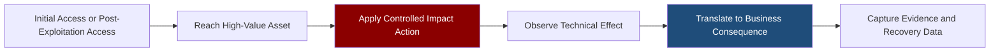
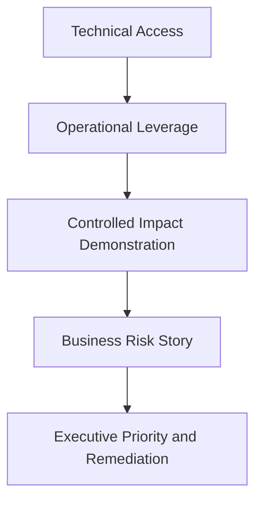
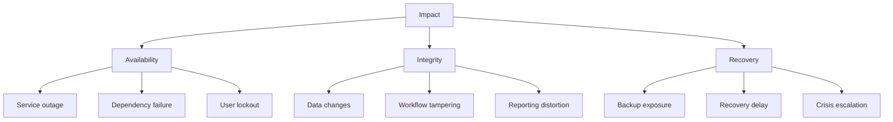
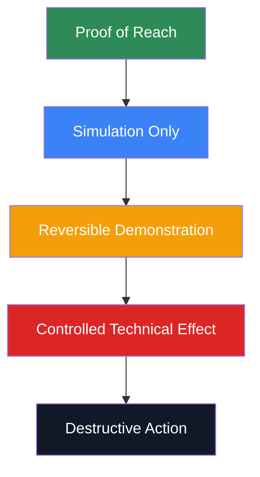
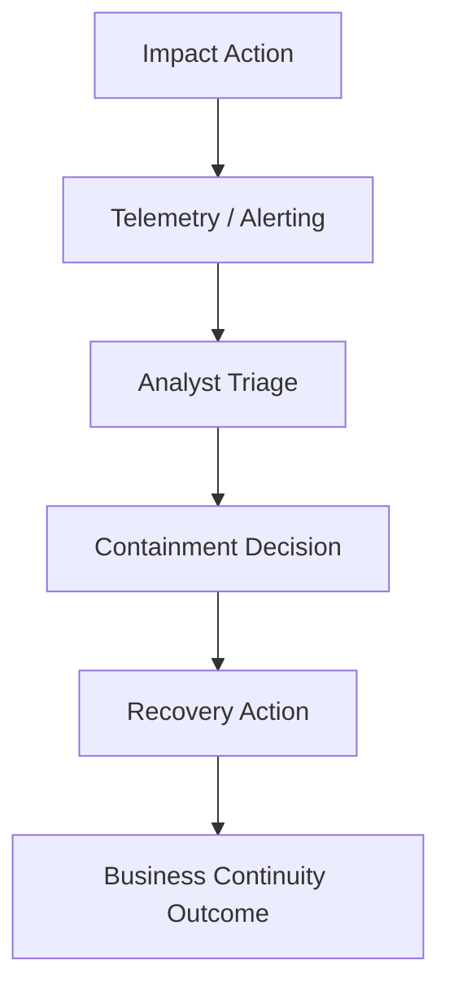

# Impact Operations

> **Difficulty:** Beginner → Advanced | **Category:** Red Teaming | **MITRE Tactic:** [TA0040 – Impact](https://attack.mitre.org/tactics/TA0040/) | **Mindset:** Authorized, controlled, reversible adversary emulation only

---

## Table of Contents

1. [What Impact Operations Are](#1-what-impact-operations-are)
2. [Why Impact Matters in Red Teaming](#2-why-impact-matters-in-red-teaming)
3. [Impact Categories and ATT&CK Mapping](#3-impact-categories-and-attck-mapping)
4. [The Safety Model](#4-the-safety-model)
5. [A Practical Impact Workflow](#5-a-practical-impact-workflow)
6. [Safe Demonstration Patterns](#6-safe-demonstration-patterns)
7. [Beginner → Advanced Scenarios](#7-beginner--advanced-scenarios)
8. [What to Measure During Impact](#8-what-to-measure-during-impact)
9. [How to Report Impact Clearly](#9-how-to-report-impact-clearly)
10. [Common Mistakes](#10-common-mistakes)
11. [References](#11-references)

---

## 1. What Impact Operations Are

Impact operations are the part of an engagement where the red team demonstrates **what the compromise means to the organization**.

Earlier phases answer questions like:

- Can we get in?
- Can we move?
- Can we reach sensitive systems?

The impact phase answers harder business questions:

- Could an attacker interrupt operations?
- Could they manipulate decisions or records?
- Could they slow recovery?
- Would defenders detect the final, high-pressure stage of an intrusion?

In real intrusions, this phase may include destructive or coercive actions. In professional red teaming, it should usually be a **bounded proof, safe simulation, or reversible demonstration** backed by explicit approval.

### Simple mental model

```text
Access proves compromise.
Impact proves consequence.
```

### Impact in one diagram



### Why beginners often misunderstand impact

A beginner may think impact means “breaking something.”

A better definition is:

> **Impact is the evidence-based demonstration of business harm an attacker could cause with the access already obtained.**

That harm can be shown without causing uncontrolled damage.

---

## 2. Why Impact Matters in Red Teaming

A red team engagement is supposed to feel like a realistic adversary campaign, but it must still protect the client. That creates a constant balance between **realism** and **safety**.

### Real attacker vs authorized red team

| Real attacker goal | Authorized red team equivalent |
|---|---|
| encrypt production data | encrypt approved dummy files or simulate the workflow |
| corrupt business records | modify test records or perform a reversible approved change |
| destroy recovery options | prove access to recovery systems without changing them |
| lock out users broadly | perform a limited account lockout drill on approved test accounts |
| deface public assets | simulate internal messaging or use a mock page in a test environment |
| force executive panic | run a coordinated exercise with pre-briefed emergency contacts |

### Why this phase is so valuable

Impact operations help answer questions that technical exploitation alone cannot:

1. **How much damage could this path really cause?**
2. **How fast would defenders recognize the situation?**
3. **Can IT and incident response recover quickly?**
4. **Would leadership make good decisions under pressure?**
5. **Which controls reduce blast radius, not just prevent initial compromise?**

### The red-team value proposition

Many pentests stop at “critical access achieved.”

Red teaming goes further:



If a finding cannot be translated into business consequence, it is often harder for leadership to prioritize.

---

## 3. Impact Categories and ATT&CK Mapping

MITRE ATT&CK groups impact behaviors under **TA0040 – Impact**. Not every engagement should exercise every impact type, but understanding the categories helps you design safe and useful objectives.

### Common impact categories

| Impact category | What it means | Example safe red-team proof | Relevant ATT&CK examples |
|---|---|---|---|
| Availability | users or systems lose access to a service | controlled interruption of a non-critical test dependency | Service Stop, Endpoint DoS, System Shutdown/Reboot |
| Integrity | data or workflows are altered | reversible change to approved test data | Data Manipulation |
| Recovery inhibition | restoration becomes slower or harder | demonstrate reachable backup or recovery controls without modifying them | Inhibit System Recovery |
| Access denial | legitimate users are prevented from using accounts or services | test-account lockout exercise with client oversight | Account Access Removal |
| Trust/reputation | users lose confidence in systems or messages | internal simulation or staged messaging in test scope | Defacement |
| Financial or decision impact | attacker influences business decisions or transactions | tabletop using evidence of reachable finance or approval systems | Financial Theft, Data Manipulation |

### Integrity, availability, and recovery are the core trio

Most impact objectives fit into one of these buckets:



### A key ATT&CK insight

MITRE descriptions are useful because they remind us that impact is not just destruction. It can also mean:

- changing stored data to alter decisions
- removing account access to block users
- stopping services at key moments
- affecting the organization’s ability to recover

That means impact operations are often more about **control over business outcomes** than about dramatic visible damage.

---

## 4. The Safety Model

This is the most important section in practice.

Impact work without safety controls stops being professional adversary emulation and starts becoming unnecessary risk.

### The safety hierarchy



### How to interpret the ladder

| Level | Meaning | Typical red-team use |
|---|---|---|
| Proof of reach | show that a critical target or control plane is reachable | very common |
| Simulation only | emulate business effect without changing real assets | very common |
| Reversible demonstration | make a tightly bounded approved change and roll it back | common with planning |
| Controlled technical effect | create a temporary real effect in a narrow window | less common, higher scrutiny |
| Destructive action | irreversible or high-risk effect | usually avoided outside labs or dedicated exercises |

### Safety gates before any impact action

Every impact action should have answers to these questions:

1. **Is it explicitly authorized in writing?**
2. **Can the same lesson be shown with a safer method?**
3. **What is the exact blast radius if something goes wrong?**
4. **Who owns rollback?**
5. **Who is the real-time emergency contact?**
6. **What are the stop conditions?**
7. **What evidence must be captured?**

### A practical authorization checklist

| Control | Why it matters |
|---|---|
| written approval tied to a named objective | proves the action was expected and permitted |
| exact systems/accounts listed | prevents accidental scope drift |
| approved time window | reduces business disruption risk |
| rollback steps and owners | enables fast recovery |
| client observers notified | prevents panic and misinterpretation |
| detection/IR contacts defined | speeds response if an issue appears |
| prohibited actions documented | sets hard red lines |

### Red lines that usually require extreme caution or should be avoided

- irreversible deletion of production data
- modification of backups or recovery points
- broad user lockouts
- public-facing defacement
- actions that could affect life safety, regulated operations, or industrial processes
- any activity not clearly covered in the rules of engagement

> **Rule:** If the client would be surprised to see the action happening, the planning was not good enough.

---

## 5. A Practical Impact Workflow

The easiest way to design safe impact work is to think in phases.


### Phase 1: Choose the business objective

Start with a business question, not a tool or technique.

Good objective examples:

- Can a compromised admin path interrupt identity services used by staff?
- Can an attacker alter an approval workflow in a way that affects financial decisions?
- Can backup infrastructure be reached from the compromised trust zone?
- Could defenders recognize a ransomware-style final stage before business disruption occurs?

### Phase 2: Pick the safest proof method

Ask:

- Do we need a real effect, or is proof of access enough?
- Would a test environment answer the same question?
- Can we use dummy data, test accounts, or maintenance windows?

A strong impact operator always prefers the **least risky action that still proves the point**.

### Phase 3: Map dependencies and blast radius

Impact is rarely isolated.

A small change may affect:

- authentication
- scheduling
- messaging
- backups
- dashboards
- approval chains
- external customer-facing systems

```text
One service change
      ↓
Dependency failure
      ↓
Workflow interruption
      ↓
Business delay or decision error
```

### Phase 4: Prepare rollback and communications

Before the action:

- confirm who can restore the state
- confirm how long restoration should take
- confirm who must be notified live
- confirm evidence collection method
- confirm stop conditions

### Phase 5: Execute the approved action

Execution should be short, controlled, and observable.

Good signs:

- clear timestamps
- client observers aware
- rollback ready
- logs preserved
- team members understand exact boundaries

### Phase 6: Measure detection and recovery

The action itself is only half the story.

Also measure:

- whether alerts fired
- whether analysts interpreted them correctly
- how long containment took
- whether the business knew what was happening
- how fast services or workflows were restored

### Phase 7: Translate technical effect into business meaning

A weak statement:

> “The team had permissions to affect a service.”

A strong statement:

> “The team demonstrated that a compromised administrative path could interrupt a shared identity dependency used by payroll and HR workflows, potentially preventing staff access and delaying time-sensitive processing.”

---

## 6. Safe Demonstration Patterns

The best impact notes are practical. The table below shows common patterns that preserve realism without turning the exercise into uncontrolled damage.

### Impact pattern catalog

| Pattern | What it proves | Typical safety level | Good evidence |
|---|---|---|---|
| proof of access to critical controls | attacker reached the final gate | low risk | screenshots, logs, approvals |
| dummy artifact placement | ability to affect user or operator experience | low risk | labeled file, banner, note, screenshot |
| reversible test-data modification | integrity risk to a workflow or report | medium risk | before/after record, rollback confirmation |
| temporary test-service interruption | availability impact to a dependency | medium risk | outage duration, monitoring, restore time |
| test-account access removal | ability to deny access to users | medium risk | account state timeline, recovery steps |
| backup-plane exposure proof | attacker could threaten recovery | low-to-medium risk | reachable consoles, roles, paths |
| executive tabletop with technical injects | leadership and IR decision quality | very low technical risk | timeline of decisions and gaps |

### Pattern 1: Proof of access to a critical control plane

This is the safest useful pattern.

Examples:

- proving access to a backup administration interface
- proving reachability to an orchestration layer
- proving access to a privileged workflow engine

Use this when the question is:

> “Could an attacker get to the thing that would matter most?”

### Pattern 2: Dummy artifact placement

A dummy artifact is a clearly labeled test object used to demonstrate capability without misleading defenders for long or harming users.

Examples:

- a clearly marked test ransom note on approved systems
- a banner or message in a test environment
- a dummy file showing where encryption could have occurred

This is effective because it turns an abstract risk into something operators and leaders can see.

### Pattern 3: Reversible data manipulation

This is useful when the client cares about integrity risk more than availability risk.

Safe examples:

- modify a test invoice record
- change a non-production approval state
- alter a dummy dashboard metric during an exercise

Strong controls for this pattern:

- use non-production or approved test data where possible
- predefine exact fields allowed to change
- capture before/after state
- perform and verify rollback immediately

### Pattern 4: Temporary service impact in a maintenance window

Use only when the organization truly needs proof of service disruption risk.

Good candidates:

- redundant non-critical services
- test instances
- short-duration dependency drills

The goal is not maximum disruption. The goal is to measure:

- whether defenders notice
- whether operations understand dependency chains
- how fast recovery occurs

### Pattern 5: Recovery-plane exposure proof

This is especially important in ransomware-themed exercises.

A mature red team often gets high value from proving:

- backup consoles are reachable
- recovery admins share trust boundaries with production admins
- restore workflows could be delayed by access to certain control planes

Notice what is missing: destructive backup changes. In most engagements, the proof is strong enough **without** modifying recovery assets.

---

## 7. Beginner → Advanced Scenarios

This section shows how impact operations grow in sophistication.

### Level 1: Beginner — Prove reach to a critical asset

**Objective:** Show that a compromised path reaches a business-critical system.

**Example:** The team reaches an approved finance application admin panel but makes no changes.

**What this teaches:**

- access boundaries failed
- critical systems were reachable from the compromised trust zone
- leadership now understands which systems were truly exposed

**Evidence:**

- access screenshot
- role/permission evidence
- dependency context

### Level 2: Intermediate — Reversible workflow manipulation

**Objective:** Demonstrate integrity impact safely.

**Example:** In a test or approved non-production workflow, the team changes the state of a dummy approval item and immediately rolls it back.

**What this teaches:**

- unauthorized workflow changes were possible
- integrity controls were weak
- monitoring may not have flagged meaningful business tampering

**Evidence:**

- before/after state
- change timestamp
- rollback confirmation
- alert timeline

### Level 3: Intermediate+ — Controlled dependency disruption

**Objective:** Show that a small technical action can create a larger process outage.

**Example:** During an approved window, a redundant test dependency is interrupted briefly and recovery timing is observed.

**What this teaches:**

- dependency mapping may be incomplete
- restoration procedures may be slower than expected
- blue-team alerts may describe symptoms but not business impact

### Level 4: Advanced — Multi-team ransomware-style exercise

**Objective:** Test technical, operational, and executive response together.

**Example components:**

- evidence of reach to file, identity, and backup planes
- dummy file-impact demonstration on approved assets
- incident response observation
- leadership injects around legal, communications, and recovery decisions

**What this teaches:**

- whether the organization can recognize late-stage adversary behavior
- whether backup and recovery governance are separated enough from production compromise
- whether executives can make decisions under time pressure

### Level 5: Expert design principle

The most advanced impact operations are not the most destructive ones.

They are the ones that best connect:

```text
technical control failure
        ↓
operational effect
        ↓
decision-making pressure
        ↓
measurable recovery outcome
```

That is what makes the exercise realistic and useful.

---

## 8. What to Measure During Impact

Impact should produce measurements, not just screenshots.

### Core metrics

| Metric | Why it matters |
|---|---|
| time to detect | shows whether defenders saw the impact stage quickly |
| time to triage correctly | shows whether alerts were understood |
| time to contain | measures operational effectiveness |
| time to restore | measures resilience and recovery readiness |
| time to notify stakeholders | measures crisis communication maturity |
| quality of business impact assessment | shows whether teams understand dependencies |
| rollback success | proves the exercise remained controlled |

### A useful impact scorecard

| Question | Example answer |
|---|---|
| What was the approved objective? | demonstrate integrity impact to approval workflow |
| What exact action was taken? | reversible change to dummy record |
| What technical effect occurred? | workflow state changed successfully |
| What business effect could result? | unauthorized approvals or reporting distortion |
| Did monitoring detect it? | delayed / partial / no |
| How long did recovery take? | measured in minutes or hours |
| Was rollback confirmed? | yes, by named client owner |

### Measuring the full story



If you only measure the left side of the diagram, you miss the part leadership cares about most.

---

## 9. How to Report Impact Clearly

Impact reporting is where technical work becomes executive value.

### A strong impact finding includes

1. **Objective** – what the team was trying to prove
2. **Access path** – how the team reached the impact point
3. **Approved action** – what was done and under what controls
4. **Observed effect** – what actually changed or was demonstrated
5. **Business consequence** – what that means operationally
6. **Detection and recovery observations** – what defenders did or missed
7. **Recommendations** – how to reduce likelihood or blast radius

### Example finding structure

| Section | Example content |
|---|---|
| Objective | determine whether privileged access could affect payroll workflow integrity |
| Path | compromised admin path reached workflow management tier |
| Action | changed approved dummy transaction state under client observation |
| Effect | workflow accepted unauthorized state transition |
| Business consequence | attacker could influence approvals and downstream reporting |
| Detection | no alert on privileged business-state change |
| Recovery | rollback completed quickly once identified |

### Example reporting language

> “The team demonstrated that an attacker with the same administrative path could alter a workflow state within the approval system, affecting the integrity of downstream business decisions. Although the exercise used only approved dummy data and was immediately rolled back, the same access in a real intrusion could enable fraud, reporting errors, or loss of trust in process outputs.”

### Executive-friendly phrasing

Executives usually respond better to:

- “order processing could be delayed”
- “approval integrity could be undermined”
- “recovery could be slowed because the backup control plane was reachable”
- “analysts saw technical symptoms but did not recognize business severity”

than to purely technical wording.

### Good remediation themes

Impact findings often lead to improvements in:

- privileged access separation
- segmentation around critical services
- approval workflow validation
- change monitoring for high-value systems
- backup-plane isolation
- incident response coordination
- recovery testing and dependency mapping

---

## 10. Common Mistakes

### Mistake 1: Starting with a dramatic technical action

Professionals start with the business question and choose the safest proof.

### Mistake 2: Treating impact as only “destruction”

A quiet integrity change may matter more than a visible outage.

### Mistake 3: Ignoring dependencies

A seemingly small action can affect many systems. Always map what depends on the target.

### Mistake 4: Measuring only whether the action worked

You must also measure detection, response, communications, and recovery.

### Mistake 5: Weak rollback planning

If rollback is vague, the action is not ready.

### Mistake 6: Poor evidence collection

Impact without timestamps, screenshots, approvals, and recovery confirmation is much less credible.

### Mistake 7: Surprising the client

A good impact operation is realistic, not chaotic. The client should never confuse a planned exercise with uncontrolled harm.

---

## 11. References

- [MITRE ATT&CK – TA0040 Impact](https://attack.mitre.org/tactics/TA0040/)
- [MITRE ATT&CK – T1565 Data Manipulation](https://attack.mitre.org/techniques/T1565/)
- [MITRE ATT&CK – T1490 Inhibit System Recovery](https://attack.mitre.org/techniques/T1490/)
- [MITRE ATT&CK – T1489 Service Stop](https://attack.mitre.org/techniques/T1489/)
- [NIST SP 800-115 – Technical Guide to Information Security Testing](https://csrc.nist.gov/publications/detail/sp/800-115/final)
- [NIST SP 800-34 Rev. 1 – Contingency Planning Guide](https://csrc.nist.gov/publications/detail/sp/800-34/rev-1/final)

