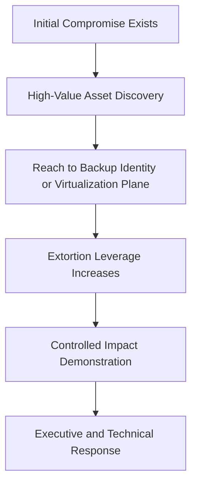
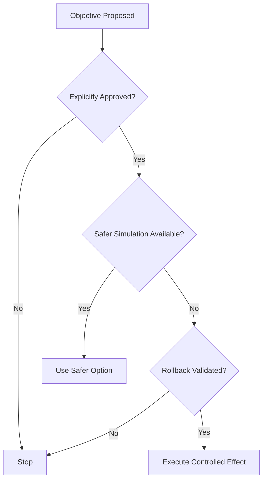
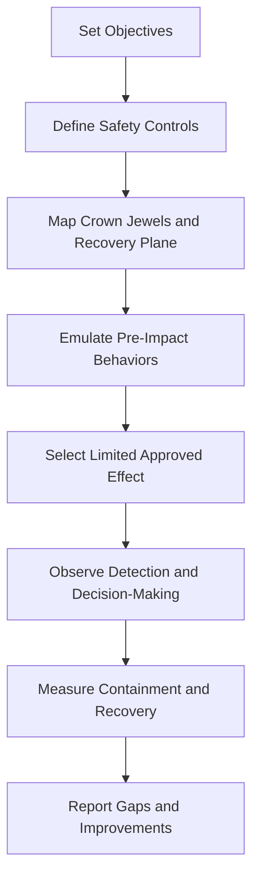
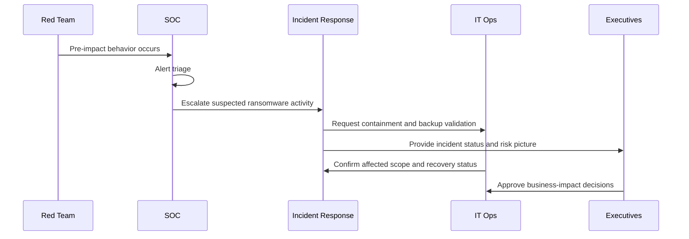

# Ransomware Simulation

> **Difficulty:** Beginner → Advanced | **Category:** Red Teaming — Impact Operations | **Related ATT&CK:** [TA0040 – Impact](https://attack.mitre.org/tactics/TA0040/), [T1486 – Data Encrypted for Impact](https://attack.mitre.org/techniques/T1486/), [T1490 – Inhibit System Recovery](https://attack.mitre.org/techniques/T1490/)

---

## Table of Contents

1. [What Ransomware Simulation Really Means](#1-what-ransomware-simulation-really-means)
2. [Why Organizations Run It](#2-why-organizations-run-it)
3. [How Real Ransomware Campaigns Create Pressure](#3-how-real-ransomware-campaigns-create-pressure)
4. [Safety and Authorization First](#4-safety-and-authorization-first)
5. [The Ransomware Simulation Maturity Ladder](#5-the-ransomware-simulation-maturity-ladder)
6. [A Practical Exercise Model](#6-a-practical-exercise-model)
7. [Safe Technical Effects You Can Use](#7-safe-technical-effects-you-can-use)
8. [What Defenders Should Detect and Measure](#8-what-defenders-should-detect-and-measure)
9. [Exercise Scenarios: Beginner to Advanced](#9-exercise-scenarios-beginner-to-advanced)
10. [Reporting, Debriefing, and Improvement](#10-reporting-debriefing-and-improvement)
11. [Common Mistakes](#11-common-mistakes)
12. [Quick Reference](#12-quick-reference)
13. [References](#13-references)

---

## 1. What Ransomware Simulation Really Means

A **ransomware simulation** is an **authorized adversary-emulation exercise** that tests whether an organization could:

- detect the behaviors that usually happen **before** encryption
- protect identity, backup, and management planes
- contain spread before business-wide disruption occurs
- make good incident and executive decisions under pressure
- recover safely and quickly if impact is attempted

The most important idea for beginners is this:

> **A professional ransomware simulation does not need real ransomware or broad encryption to be valuable.**

Its purpose is to prove exposure and resilience, not to cause uncontrolled harm.

### Real attacker vs authorized simulation

| Real ransomware operation | Authorized simulation equivalent |
|---|---|
| steal credentials and expand access | emulate access paths already approved in scope |
| discover backup and recovery systems | verify whether those systems are reachable or weak |
| exfiltrate sensitive data for extortion | use approved dummy data or evidence-only access validation |
| encrypt files at scale | encrypt only approved dummy files or simulate the final effect |
| disable recovery options | assess exposure without deleting or damaging recovery assets |
| force executive pressure | run a controlled technical + tabletop crisis exercise |


---

## 2. Why Organizations Run It

Ransomware simulations are useful because they test **security, operations, and leadership at the same time**.

### Questions a good exercise should answer

- Could an attacker move from one compromised foothold to systems that matter to the business?
- Would defenders notice the **pre-impact behaviors**, or only notice after disruption begins?
- Are backup systems isolated enough to survive a major incident?
- Can IT and incident response teams coordinate quickly?
- Can leadership make decisions when legal, communications, finance, and operations are all affected?

### Business value

| Area | What the simulation reveals |
|---|---|
| Security monitoring | whether early-stage behavior is visible |
| Identity security | whether privileged accounts become a blast-radius multiplier |
| Backup resilience | whether recovery systems are exposed to the same attack path |
| Segmentation | whether disruption can spread across trust boundaries |
| Crisis management | whether leaders can prioritize containment and recovery |
| Reporting | whether impact can be translated into business risk |

### Why this matters in red teaming

Ransomware-style activity is often the point where many small weaknesses become one major business problem:

```text
Weak MFA + Flat Network + Over-Privileged Admins + Exposed Backups
= Enterprise-Scale Risk
```

That is why this note belongs in **Impact Operations**. It tests the path from compromise to business disruption.

---

## 3. How Real Ransomware Campaigns Create Pressure

Without giving harmful intrusion instructions, it is still important to understand the **shape** of real campaigns.

### High-level campaign pattern

Most ransomware operations are not just “encrypt files and leave a note.” They often combine:

1. **Access and expansion** – gain enough reach to affect more than one host
2. **Discovery** – find important servers, identities, shares, hypervisors, and recovery systems
3. **Staging** – prepare access, identify high-value data, and create fallback paths
4. **Extortion leverage** – create pressure through data exposure, lockout risk, or service disruption
5. **Impact** – attempt encryption, data denial, or recovery inhibition

### ATT&CK-aligned view

| ATT&CK idea | Why it matters in simulation |
|---|---|
| **TA0040 – Impact** | measures business disruption potential |
| **T1486 – Data Encrypted for Impact** | represents ransomware-style availability loss |
| **T1490 – Inhibit System Recovery** | tests whether backups and recovery are protected |
| **T1485 – Data Destruction** | reminds red teams where the ethical stop line is |

### Pressure model



### Key beginner insight

The danger is usually **not one endpoint**.
The danger is when the attacker can touch:

- **identity systems**
- **shared storage**
- **backup infrastructure**
- **virtualization management**
- **remote administration paths**

Once those are reachable, the blast radius grows very quickly.

---

## 4. Safety and Authorization First

Ransomware-themed work has a higher risk of confusion and real-world harm than many other red team activities. Safety controls are therefore part of the methodology, not an afterthought.

### Mandatory principles

1. **Written authorization** must explicitly allow impact simulation.
2. **Rules of engagement** must define the maximum allowed technical effect.
3. **Emergency contacts** must be reachable during the exercise.
4. **Rollback plans** must exist before any visible effect is created.
5. **Production data and recovery assets** must not be harmed unless the client has built a special exercise environment for that purpose.

### Safe vs unsafe thinking

| Good practice | Bad practice |
|---|---|
| prove the path with dummy files | encrypt real business data broadly |
| verify backup exposure without deleting backups | destroy restore points or recovery images |
| use a test share for visible impact | impact critical business systems unexpectedly |
| pre-brief crisis contacts and trigger words | create panic with ambiguous messaging |
| capture evidence before and after | make changes with no rollback or audit trail |

> **Warning:** In authorized adversary emulation, “realistic” does **not** mean “destructive.” It means the exercise creates believable evidence with bounded, reversible effects.

### Pre-impact safety gate



### Approval checklist

- what exact systems are in scope?
- what visible artifacts are allowed?
- who can authorize escalation during the exercise?
- what is the emergency stop word or stop process?
- what evidence must be collected?
- how will artifacts be removed after the exercise?

---

## 5. The Ransomware Simulation Maturity Ladder

Not every organization should start with the same level of realism. A maturity ladder helps teams choose an exercise they can handle safely.


### Levels explained

| Level | Description | Best for |
|---|---|---|
| 1. Tabletop only | no technical effect; decision and process exercise | organizations new to ransomware readiness |
| 2. Evidence-only validation | prove access to critical planes without causing visible disruption | teams building confidence safely |
| 3. Controlled dummy-file impact | approved encryption or lockout effect on non-business data | mature security teams needing technical realism |
| 4. Multi-team crisis exercise | combine technical evidence, SOC response, IR, legal, execs | enterprises testing full response capability |
| 5. Dedicated lab destructive test | destructive actions only in isolated cyber range or clone lab | advanced programs with purpose-built environments |

### Recommended red-team default

For most production environments, the safest and most valuable level is:

> **Level 2 or Level 3** — prove reach, then create a small, reversible, clearly approved effect.

---

## 6. A Practical Exercise Model

This section shows how to run a ransomware simulation **without turning it into an unsafe intrusion guide**.

### End-to-end exercise lifecycle



### Phase 1: Objective setting

Decide what you want to learn.

Common objectives:

- test whether backup systems are isolated from normal admin paths
- test whether SOC detects staging activity before impact
- test whether legal, PR, and executives can coordinate with technical responders
- test whether a business unit can operate during partial file-share loss

### Phase 2: Crown-jewel and recovery mapping

A ransomware simulation is much stronger when it focuses on systems that matter most:

- identity providers and privileged access paths
- shared storage and collaboration platforms
- hypervisors and virtualization management
- backup consoles and recovery repositories
- critical business applications
- executive and legal communication channels

### Phase 3: Pre-impact emulation

The red team emulates **behaviors associated with ransomware campaigns**, but only within scope and authorization. The goal is to answer:

- how far could access realistically spread?
- what monitoring alerts fire before impact?
- can defenders differentiate noise from real attack progression?

### Phase 4: Controlled effect selection

Choose the minimum effect that still proves the risk.

Examples:

- place a realistic but clearly approved ransom note on test systems
- encrypt only approved dummy files on a test share
- demonstrate that a backup console was reachable without modifying it
- simulate user lockout or service interruption in a non-critical test segment

### Phase 5: Response observation

Watch how different teams react:

| Team | What to observe |
|---|---|
| SOC / Detection | alert quality, triage speed, escalation accuracy |
| IR / DFIR | containment decisions, timeline reconstruction |
| IT Operations | account control, segmentation, backup checks |
| Leadership | risk decisions, communications, legal escalation |
| Business Owners | clarity on priorities and recovery sequence |

### Phase 6: Recovery validation

A strong exercise does not stop at “we could have encrypted files.” It should also ask:

- how quickly were affected systems identified?
- how quickly were backups validated as usable?
- were recovery systems trusted, isolated, and documented?
- what delayed restoration most?

---

## 7. Safe Technical Effects You Can Use

The safest ransomware simulations produce **clear evidence** while avoiding irreversible damage.

### Safe effect patterns

| Pattern | What it demonstrates | Typical risk |
|---|---|---|
| dummy-file encryption | proof that impact could occur | low if tightly scoped |
| ransom-note placement on approved systems | business realism and visibility | low |
| access-path validation to backup console | recovery-plane exposure | low |
| temporary lockout of a test account or test share | limited availability impact | medium if not coordinated |
| executive tabletop triggered by technical evidence | crisis response quality | low |

### Example architecture view

```text
                 ┌───────────────────────┐
                 │ Identity / Privileged │
                 │ Access Plane          │
                 └──────────┬────────────┘
                            │
                            ▼
┌──────────────┐    ┌───────────────────────┐    ┌─────────────────────┐
│ User / Admin │──▶ │ Critical File / App   │ ◀──│ Backup / Recovery   │
│ Access Paths │    │ Plane                 │    │ Plane               │
└──────────────┘    └───────────────────────┘    └─────────────────────┘
                            │
                            ▼
                 ┌───────────────────────┐
                 │ Visible Controlled    │
                 │ Impact on Test Assets │
                 └───────────────────────┘
```

### What to avoid in normal production engagements

- broad encryption of real user or server data
- deletion of backup sets, restore points, or snapshots
- disabling recovery mechanisms in production
- touching hypervisors or storage clusters in a way that could become irreversible
- unsignaled panic-inducing actions outside agreed communication channels

### Practical evidence collection

For each allowed effect, retain:

- written approval
- before-and-after screenshots or state validation
- timestamps
- system names and asset owners
- rollback confirmation
- defender response timeline

---

## 8. What Defenders Should Detect and Measure

A ransomware simulation is only partly about the red team. It is also a test of the blue team and the organization around them.

### Detection focus areas

| Focus area | Why it matters |
|---|---|
| unusual access to privileged paths | early sign that blast radius may expand |
| access to backup or virtualization systems | strong indicator of pre-impact staging |
| rapid changes across shared storage | possible preparation for impact |
| extortion-style artifacts or messaging | confirms visible impact stage |
| containment action timing | shows operational maturity |
| backup validation timing | shows resilience, not just detection |

### Metrics that matter

| Metric | What it tells you |
|---|---|
| time to first alert | how quickly early-stage behavior is seen |
| time to analyst triage | whether alerts are actionable |
| time to incident declaration | whether the organization recognizes seriousness |
| time to isolate or contain | whether spread can be slowed |
| time to validate backups | whether recovery confidence exists |
| time to executive decision | whether business leadership is prepared |
| time to restore test services or assets | whether recovery is practical |

### Detection-to-recovery timeline



### What “good” looks like

- alerts arrive **before** visible impact
- incident severity is raised quickly
- backup and identity teams are engaged early
- business owners know which systems matter most
- executives get simple, accurate updates instead of raw technical noise

---

## 9. Exercise Scenarios: Beginner to Advanced

These scenarios are practical but intentionally non-destructive.

### Scenario A — Beginner: Tabletop with technical injects

**Goal:** teach the organization how ransomware pressure unfolds.

**Approach:**
- provide a realistic attack timeline
- inject evidence such as suspicious admin access, file-share anomalies, and a mock ransom note
- require SOC, IR, IT, legal, and leadership to make decisions

**Best for:** organizations with limited prior exercise experience.

**Success looks like:**
- people know who owns the incident
- containment and communications decisions are clear
- backup validation is requested early

---

### Scenario B — Intermediate: Evidence-only adversary emulation

**Goal:** prove whether a real attacker could reach identity, storage, or recovery systems.

**Approach:**
- emulate pre-impact behaviors within approved scope
- stop at evidence collection
- show exactly which critical planes were reachable

**Best for:** teams that want technical realism without visible disruption.

**Success looks like:**
- defenders detect staging behavior
- report clearly shows blast radius and control failures
- leadership understands why seemingly small weaknesses combine dangerously

---

### Scenario C — Advanced: Controlled dummy-file impact

**Goal:** test detection, containment, and recovery with a small visible effect.

**Approach:**
- use approved dummy files or test shares only
- place a controlled note or create a tightly bounded encryption proof
- observe full technical and executive response

**Best for:** mature programs that already have clear rules of engagement.

**Success looks like:**
- effect stays inside approved boundaries
- response teams detect and escalate quickly
- recovery teams validate backups and restore test assets confidently

---

### Scenario D — Advanced+: Full crisis exercise

**Goal:** combine red teaming, blue teaming, crisis management, and executive decision-making.

**Approach:**
- technical team produces evidence of reach and controlled impact
- crisis cell receives timed injects about legal exposure, business interruption, and stakeholder communications
- recovery activities are measured in parallel

**Best for:** enterprises, regulated sectors, or organizations with complex recovery dependencies.

**Success looks like:**
- technical teams and executives share one common incident picture
- communications are deliberate, not chaotic
- the final report includes both technical and business lessons

---

## 10. Reporting, Debriefing, and Improvement

A ransomware simulation report should explain not only **what the red team proved**, but also **what the organization must change next**.

### Report structure

| Section | What it should include |
|---|---|
| Executive summary | business risk, exposure level, top decisions |
| Objectives and scope | what was authorized and what was not |
| Attack path narrative | how access could have become business disruption |
| Impact evidence | what limited effect was performed or simulated |
| Detection timeline | when teams noticed and how they escalated |
| Recovery analysis | backup, restoration, and resilience findings |
| Priority remediation | identity, segmentation, recovery, monitoring improvements |

### Example reporting statement

> “The exercise did not require real ransomware deployment to demonstrate enterprise risk. The team showed that an adversary with the same approved access could reach shared storage and backup management paths, and could create a controlled impact on approved dummy assets before effective containment occurred.”

### Debrief questions

- what was detected too late?
- what slowed containment?
- which privileged paths should never have been reachable?
- which backup or recovery assumptions were false?
- which executive decisions depended on missing information?
- what should be retested in the next exercise?

### Remediation themes that often emerge

- stronger privileged access controls
- tighter segmentation between user, server, and recovery planes
- backup isolation and immutable recovery options
- better alerting on pre-impact behaviors
- faster crisis communications and ownership clarity

---

## 11. Common Mistakes

### 1. Focusing only on encryption

If the exercise starts and ends with a fake ransom note, it may miss the most important question:

> **Could the attacker reach the systems that make ransomware catastrophic?**

### 2. Ignoring the recovery plane

Many teams test endpoints and servers but forget:

- backup consoles
- snapshot management
- virtualization management
- remote admin tooling
- identity systems that can reset or unlock access broadly

### 3. Making the exercise too technical for leadership

Executives do not need every log detail. They need:

- business impact summary
- decision points
- time pressure
- legal and communications implications
- prioritized next actions

### 4. Creating avoidable panic

Ransomware-themed exercises can go wrong when language is unclear. Always define:

- what messages will be used
- who will receive them
- whether the blue team is informed or partially informed
- how to halt the exercise immediately

### 5. Treating a single successful simulation as “mission complete”

A good exercise is not the end. It is the start of:

- architecture improvements
- detection tuning
- recovery hardening
- retesting with higher maturity later

---

## 12. Quick Reference

### Beginner mental model

```text
Ransomware Simulation
= Authorized proof that an attacker could create business disruption
+ Safe, bounded technical effects
+ Measurement of detection, containment, and recovery
+ Executive decision testing
```

### Planning checklist

| Item | Confirmed? |
|---|---|
| written authorization for impact simulation | yes / no |
| approved systems and data types listed | yes / no |
| safer alternative considered first | yes / no |
| rollback plan documented | yes / no |
| emergency contacts active | yes / no |
| dummy files / test shares prepared | yes / no |
| evidence collection plan ready | yes / no |
| recovery validation criteria defined | yes / no |

### Best one-sentence definition

**Ransomware simulation is a controlled, authorized exercise that proves whether an organization can detect, contain, and recover from ransomware-style impact without causing real-world harm.**

---

## 13. References

- [MITRE ATT&CK – Impact (TA0040)](https://attack.mitre.org/tactics/TA0040/)
- [MITRE ATT&CK – Data Encrypted for Impact (T1486)](https://attack.mitre.org/techniques/T1486/)
- [MITRE ATT&CK – Inhibit System Recovery (T1490)](https://attack.mitre.org/techniques/T1490/)
- [NIST SP 800-115 – Technical Guide to Information Security Testing and Assessment](https://csrc.nist.gov/publications/detail/sp/800-115/final)
- [NIST SP 800-61 Rev. 2 – Computer Security Incident Handling Guide](https://csrc.nist.gov/publications/detail/sp/800-61/rev-2/final)
