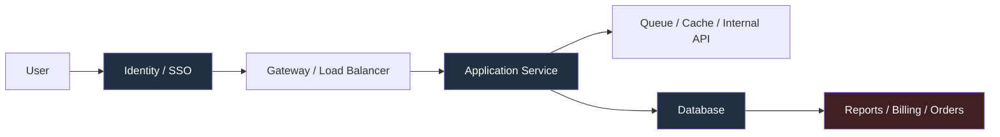
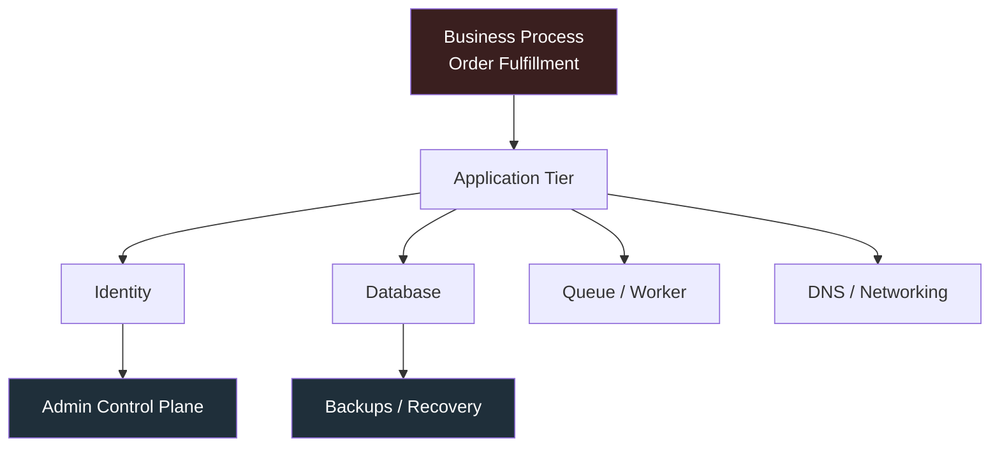
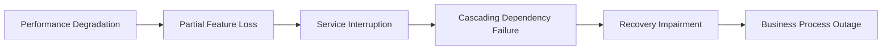
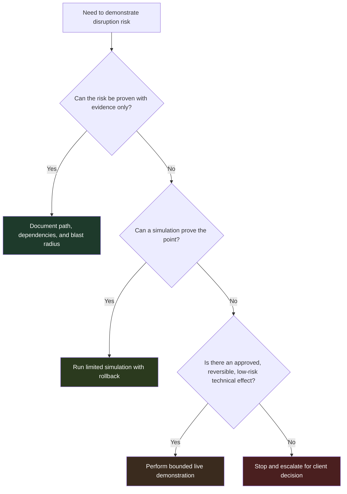
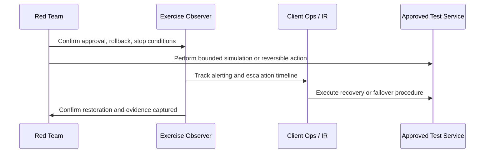
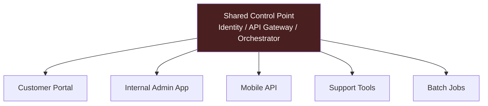
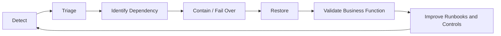

# Service Disruption

> **Difficulty:** Beginner → Advanced | **Category:** Red Teaming | **Related ATT&CK:** [T1489 – Service Stop](https://attack.mitre.org/techniques/T1489/), [T1529 – System Shutdown/Reboot](https://attack.mitre.org/techniques/T1529/), [T1490 – Inhibit System Recovery](https://attack.mitre.org/techniques/T1490/), [TA0040 – Impact](https://attack.mitre.org/tactics/TA0040/)
>
> **Authorized use only:** This note is for approved adversary emulation, purple-team exercises, and resilience testing. The objective is to measure how well defenders detect, contain, and recover from availability-impacting actions **without causing uncontrolled harm**.

---

## Table of Contents

1. [What Service Disruption Really Means](#1-what-service-disruption-really-means)
2. [Why Adversaries Target Services](#2-why-adversaries-target-services)
3. [Understanding Dependency Chains](#3-understanding-dependency-chains)
4. [The Disruption Spectrum](#4-the-disruption-spectrum)
5. [A Safe Adversary-Emulation Model](#5-a-safe-adversary-emulation-model)
6. [Practical Exercise Patterns](#6-practical-exercise-patterns)
7. [Advanced Environments and Hidden Risks](#7-advanced-environments-and-hidden-risks)
8. [What to Measure During the Exercise](#8-what-to-measure-during-the-exercise)
9. [Detection, Recovery, and Hardening Lessons](#9-detection-recovery-and-hardening-lessons)
10. [How to Report Service Disruption Well](#10-how-to-report-service-disruption-well)
11. [References](#11-references)

---

## 1. What Service Disruption Really Means

Service disruption is any attacker-caused condition that reduces or removes a business capability by affecting the systems that support it.

That does **not** always mean “the server is fully down.” In real environments, disruption can appear as:

- slow authentication
- delayed order processing
- failed API calls between internal services
- message queues backing up
- monitoring or logging going blind
- backup or recovery tools becoming unavailable
- a platform staying online but becoming unusable for real work

### Beginner view

Think of a business service as a chain, not a single box.

If a user cannot log in, an API cannot reach its database, or the queue that moves work between systems stops processing jobs, the business may experience an outage even if most hosts are still powered on.

If any critical dependency in that chain fails, the visible business process can fail too.

### Key idea for red teams

A strong service-disruption finding does **not** say only:

> “An administrator could stop a service.”

It says:

> “An attacker with this access could interrupt a dependency used by payroll, VPN authentication, and customer support, creating a multi-team operational outage.”

---

## 2. Why Adversaries Target Services

Adversaries target services because availability pressure creates urgency, confusion, and leverage.

MITRE ATT&CK documents that threat actors frequently stop services, reboot systems, or inhibit recovery before or during impact operations. In practice, they do this for several reasons:

- to disable security tooling
- to stop databases, email, or application components that block later actions
- to make recovery slower
- to break trust in core business processes
- to force defenders into crisis mode

### Real attacker logic vs safe red-team equivalent

| Real attacker objective | Why it matters to them | Safe red-team equivalent |
|---|---|---|
| stop a business-critical service | create immediate operational pain | prove reachable control path, then simulate or perform a tightly bounded test on a non-critical equivalent |
| interrupt identity services | block user access across many systems | validate blast radius with dependency mapping and synthetic logon tests |
| impair backups or recovery tooling | make restoration harder | demonstrate access to the recovery plane without destructive changes |
| restart or shut down systems | interrupt operations and complicate response | run an approved maintenance-window simulation or tabletop decision drill |
| degrade monitoring/logging | increase dwell time and confusion | assess whether defenders detect telemetry loss rather than causing broad blindness |

### Important mindset

In authorized adversary emulation, the goal is usually **not** to recreate maximum damage.

The goal is to answer:

1. Could the attacker reach the controls that matter?
2. What would break first?
3. Would defenders notice quickly?
4. Could the organization restore service fast enough?

---

## 3. Understanding Dependency Chains

The hardest part of service disruption is usually **not** the final technical action.

It is understanding the dependency graph behind the business service.

### Core dependency types

| Dependency type | Example | If disrupted, what happens? |
|---|---|---|
| Identity | Active Directory, SSO, MFA provider | users cannot authenticate or sessions fail |
| Name resolution | DNS, service discovery | applications cannot find each other |
| Data | SQL/NoSQL database, storage | reads/writes fail or become stale |
| Messaging | queue, event bus, broker | workflows stall or process later |
| Network path | firewall policy, VPN, load balancer | traffic cannot reach the service |
| Observability | logging, metrics, tracing | outages last longer because teams lose visibility |
| Recovery plane | backup console, snapshots, DR orchestration | restoration becomes slow or impossible |

### A useful mental model

This diagram shows a crucial lesson:

- the **data plane** delivers the service
- the **control plane** manages the service
- the **recovery plane** restores the service after failure

A mature red team looks at all three.

### Why beginners often underestimate disruption

New testers often focus only on “the app server.” But major outages often come from smaller shared dependencies such as:

- an identity provider used by many apps
- an internal DNS service
- a certificate service
- a queue consumer that silently stops processing
- the orchestration platform that schedules containers or VMs

A tiny technical interruption in one shared component can create a large business outage.

---

## 4. The Disruption Spectrum

Not every disruption is a full outage. Red teams should think in levels.

### Disruption levels

| Level | Technical example | Business meaning | Typical exercise style |
|---|---|---|---|
| Degradation | response times spike, queue lag grows | users can work, but badly | synthetic transaction and telemetry validation |
| Partial outage | one workflow or feature breaks | delays and workarounds appear | bounded test against a non-critical component |
| Service interruption | a core service becomes unavailable | business process pauses | maintenance-window demonstration with rollback |
| Cascading outage | shared dependency impacts many apps | multi-team incident | dependency-mapping plus limited live proof |
| Recovery impairment | backups or failover are affected | outage duration grows sharply | access-path validation and tabletop recovery drill |

### Translating technical effects into business language

| Weak statement | Strong statement |
|---|---|
| “We could affect a Windows or Linux service.” | “We could affect a shared dependency used by employee logon and customer support applications.” |
| “A restart was possible.” | “A restart at this layer could interrupt time-sensitive processing and create backlogs across three downstream teams.” |
| “The backup plane was reachable.” | “The recovery environment was exposed to the same privileged path, increasing the chance that restoration would be delayed during a real incident.” |

### The reporting lesson

Executives care most about:

- duration of likely interruption
- number of affected business processes
- whether customer-facing operations stop
- whether recovery is straightforward or degraded

---

## 5. A Safe Adversary-Emulation Model

Service disruption is one of the easiest places for a red team to become reckless. A professional team stays disciplined.

### Safety-first decision model

### Golden rules

1. **Authorization must be explicit.** If impact testing is not clearly approved, do not improvise.
2. **Prefer proof over damage.** Showing the reachable control path is often enough.
3. **Prefer simulation over live effect.** Synthetic users, test systems, and maintenance windows reduce risk.
4. **Prefer reversible actions over destructive ones.** Recovery must be quick and practiced.
5. **Always define stop conditions.** If monitoring, latency, or user impact exceeds the agreed threshold, stop.

### Required planning questions

Before any disruption exercise, answer these:

- Which exact service or dependency is in scope?
- Is it production, staging, test, or a canary equivalent?
- What is the rollback procedure?
- Who can authorize continuation in real time?
- How will the team know the impact is becoming unsafe?
- Which observers will measure detection, escalation, and restoration?

### Safe patterns vs unsafe patterns

| Good practice | Why it is safer |
|---|---|
| use a test instance or redundant node | reduces blast radius |
| validate business effect with synthetic transactions | measures impact without waiting for real users to complain |
| rehearse rollback first | avoids improvisation during stress |
| keep the blue-team observation plan ready | ensures the exercise generates learning |
| collect timestamps, metrics, and approvals live | supports accurate reporting |

| Dangerous practice | Why it is poor red-team behavior |
|---|---|
| touching a critical service without explicit approval | can cause unauthorized harm |
| assuming failover will work without checking | creates hidden risk |
| disrupting monitoring while also disrupting a service | makes recovery harder and evidence weaker |
| changing recovery systems during a routine engagement | may create lasting damage |
| “trying it quickly” in production | turns a controlled exercise into an uncontrolled incident |

---

## 6. Practical Exercise Patterns

The best exercises are realistic, bounded, and easy to explain.

### Pattern 1: Identity dependency disruption

**Goal:** Show how much of the environment depends on centralized identity.

**Safe ways to emulate it:**

- map which applications depend on the same identity source
- use synthetic logon attempts before and during a small approved simulation
- test a non-production identity path or a maintenance-window failover scenario

**What this proves:**

- whether a small identity problem becomes an enterprise-wide outage
- whether alerts fire when authentication degrades or fails
- whether teams know which apps depend on the identity path

### Pattern 2: Queue or worker interruption

**Goal:** Show that services can appear “up” while business processing quietly stops.

**Safe ways to emulate it:**

- pause a non-critical worker or test consumer with approval
- track backlog growth and delayed job completion
- validate whether dashboards show “green” while work actually accumulates

**What this proves:**

- whether operations teams monitor real business throughput
- whether backlog thresholds and alerts are meaningful
- whether retry logic masks underlying impact for too long

### Pattern 3: Database dependency interruption

**Goal:** Demonstrate that application availability depends on database reachability, failover, and transaction behavior.

**Safe ways to emulate it:**

- exercise a test replica or approved failover path
- use synthetic transactions to measure read/write behavior
- validate whether the application fails cleanly or produces corrupted workflows

**What this proves:**

- whether failover procedures are real or only assumed
- whether upstream services degrade gracefully
- whether operators can quickly distinguish app failure from data-layer failure

### Pattern 4: Monitoring or logging blind spot exercise

**Goal:** Test whether defenders notice loss of telemetry during an outage.

OWASP notes that application logging is valuable not only for security events but also for business process monitoring, unusual conditions, and incident investigation. If the monitoring plane is weak, even a small outage lasts longer.

**Safe ways to emulate it:**

- validate alert coverage for missing telemetry
- compare infrastructure health with application-level synthetic checks
- assess whether analysts can detect that the visibility system itself is degraded

**What this proves:**

- whether the team notices “monitoring is blind” as its own incident
- whether logs, metrics, and traces are separated enough to avoid common-mode failure

### Pattern 5: Backup and recovery-plane exposure

**Goal:** Show whether an attacker who reaches production administration can also influence recovery.

**Safe ways to emulate it:**

- validate access paths to backup consoles or recovery orchestration without making destructive changes
- review separation of duties, approval controls, and logging around recovery systems
- run a tabletop to test restoration decisions after a bounded outage scenario

**What this proves:**

- whether the organization can actually restore after disruption
- whether backup systems are isolated from normal administration
- whether the recovery plan survives a privileged compromise scenario

### A practical exercise flow

### What makes these exercises valuable

Good disruption exercises answer practical questions such as:

- Did the service owner notice first, or did users?
- Did the SOC detect the problem before operations raised a ticket?
- Did failover happen automatically, manually, or not at all?
- Did the outage remain local, or did it spread through dependencies?
- How long until business leaders received a correct explanation?

---

## 7. Advanced Environments and Hidden Risks

As environments mature, disruption risk often moves away from single hosts and into shared platforms.

### Environment-specific considerations

| Environment | Hidden disruption risk | Safer way to emulate |
|---|---|---|
| Kubernetes / containers | control-plane mistakes, broken service discovery, failed autoscaling, bad config rollout | use an approved namespace, canary service, or synthetic workload |
| Virtualization platforms | cluster-level actions affect many workloads at once | validate dependency and access paths before any live effect |
| Cloud platforms | IAM, networking, storage policy, and automation changes can cascade quickly | test in isolated subscriptions/accounts/projects or via tabletop evidence |
| Microservices | API gateway or identity service becomes a single point of failure | map dependencies and use business-level transactions, not only pod health |
| Hybrid environments | cloud and on-prem dependencies fail in different ways | trace the full transaction across network, identity, and data boundaries |

### Advanced lesson: healthy infrastructure can still mean broken business

OWASP's Microservices Security Cheat Sheet highlights that centralizing decisions at the API gateway can create a single point of decision. In practice, this means a platform may look technically alive while the business function is still broken.

For example:

- pods are running, but authentication fails
- the API gateway responds, but downstream authorization is broken
- databases are reachable, but workers are not processing messages
- dashboards show infrastructure health, but customer transactions fail

### Hidden blast-radius diagram

One shared service can create five separate incidents at the same time.

### Advanced red-team focus areas

At the advanced level, service disruption work should examine:

- whether control-plane access is separated from application administration
- whether recovery-plane credentials are isolated and monitored
- whether maintenance actions require approval, dual control, or just one powerful account
- whether failover is automatic, manual, or fictional
- whether dependency maps are documented and trusted

---

## 8. What to Measure During the Exercise

A disruption exercise is only as useful as its measurements.

### Operational metrics

| Metric | Why it matters |
|---|---|
| time to first alert | shows visibility speed |
| time to human acknowledgement | shows monitoring workflow quality |
| time to identify root dependency | shows troubleshooting maturity |
| time to contain blast radius | shows operational coordination |
| time to restore service | shows actual resilience, not assumed resilience |
| time to confirm data integrity after restoration | shows whether “up again” truly means recovered |

### Business metrics

| Metric | Example question |
|---|---|
| affected users or teams | who could no longer work? |
| delayed transactions | how many jobs, orders, or approvals were blocked? |
| workaround availability | could staff continue manually? |
| customer-facing exposure | was the issue visible externally? |
| leadership decision speed | how quickly were the right people engaged? |

### Detection-quality metrics

| Signal | What good looks like |
|---|---|
| service-stop or health alerts | accurate, fast, and routed correctly |
| synthetic transaction failures | trigger before users flood the help desk |
| dependency correlation | analysts can tie app failure to the real upstream cause |
| telemetry-loss detection | the team notices when its own visibility is impaired |
| recovery verification | restoration is confirmed with evidence, not assumption |

### Simple exercise scorecard

| Question | Green | Yellow | Red |
|---|---|---|---|
| Was the issue detected quickly? | within target threshold | delayed but acceptable | detected by users first |
| Was root cause understood? | clear dependency identified | partial understanding | confused / misdiagnosed |
| Was recovery executed cleanly? | tested runbook worked | ad hoc steps required | no clear recovery path |
| Was impact contained? | stayed local | moderate spread | cascaded broadly |

---

## 9. Detection, Recovery, and Hardening Lessons

Service disruption findings should produce resilience improvements, not just fear.

### High-value defensive controls

- alert on service stops, repeated restarts, and dependency failures
- maintain synthetic transactions for critical business paths
- separate production administration from backup and recovery administration
- require stronger approval controls for high-impact service actions
- document service dependencies, not just host inventories
- rehearse restoration and failover, not only incident notification
- ensure observability platforms do not share the same single point of failure as production systems

### Logging and visibility

OWASP emphasizes that application logging is useful for business process monitoring and incident investigation, not only for pure security events. That matters here because service disruption is often first visible in:

- failed transactions
- abnormal queue depth
- rising authentication errors
- health-check failures
- missing telemetry from expected sources

### A resilience loop

### Questions defenders should ask after the exercise

- Which shared dependency created the largest blast radius?
- Which alert fired first, and was it the right one?
- Did we restore technical health or actual business capability?
- Could the same privileged path also affect recovery systems?
- Which steps were documented, and which existed only in staff memory?

---

## 10. How to Report Service Disruption Well

A strong report connects access, dependency, business impact, and recovery reality.

### Recommended report structure

| Section | What to include |
|---|---|
| Objective | what was tested and why |
| Scope and approvals | which systems, window, observers, rollback, stop conditions |
| Technical path | how the team reached the disruptive control point |
| Dependency analysis | which applications and processes relied on the affected component |
| Demonstration method | evidence-only, simulation, or bounded live effect |
| Observed response | alerts, escalation, troubleshooting, failover, restoration |
| Business impact | what users or workflows would lose in a real incident |
| Remediation | concrete resilience and monitoring improvements |

### Example of strong reporting language

> “The team demonstrated that the same privileged path used to administer a shared identity dependency could, if abused by a real adversary, interrupt logon for multiple internal applications. During the approved simulation, synthetic user transactions failed within two minutes, but operational escalation took eleven minutes and recovery required manual coordination across three teams. This indicates meaningful exposure to availability loss and delayed restoration.”

### Evidence that strengthens the finding

- timeline with exact timestamps
- before/after health and transaction metrics
- screenshots of alerts, dashboards, or dependency maps
- rollback confirmation
- observations from operations, IR, and service owners
- clear statement of what was **not** done for safety reasons

### A mature conclusion

The best disruption findings do not sensationalize.

They explain:

- what was reachable
- what was demonstrated
- what was intentionally not executed
- what the likely business effect would be in a real attack
- how the organization can reduce the blast radius next time

---

## 11. References

- [MITRE ATT&CK – T1489: Service Stop](https://attack.mitre.org/techniques/T1489/)
- [MITRE ATT&CK – T1529: System Shutdown/Reboot](https://attack.mitre.org/techniques/T1529/)
- [MITRE ATT&CK – T1490: Inhibit System Recovery](https://attack.mitre.org/techniques/T1490/)
- [MITRE ATT&CK – TA0040: Impact](https://attack.mitre.org/tactics/TA0040/)
- [OWASP Logging Cheat Sheet](https://cheatsheetseries.owasp.org/cheatsheets/Logging_Cheat_Sheet.html)
- [OWASP Microservices Security Cheat Sheet](https://cheatsheetseries.owasp.org/cheatsheets/Microservices_Security_Cheat_Sheet.html)
- [NIST SP 800-34 Rev. 1 – Contingency Planning Guide for Federal Information Systems](https://csrc.nist.gov/publications/detail/sp/800-34/rev-1/final)
