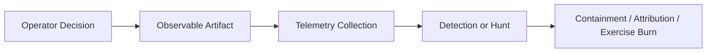
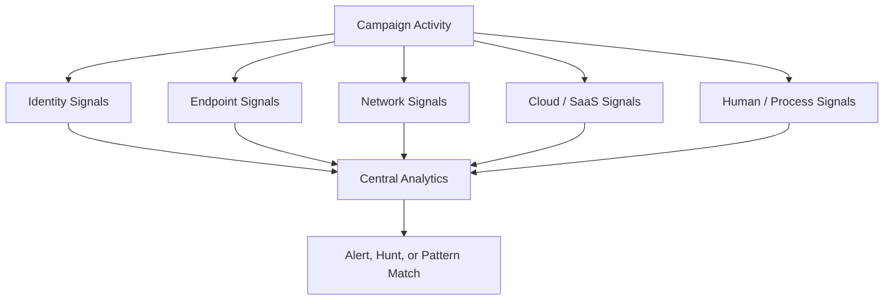
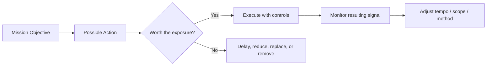
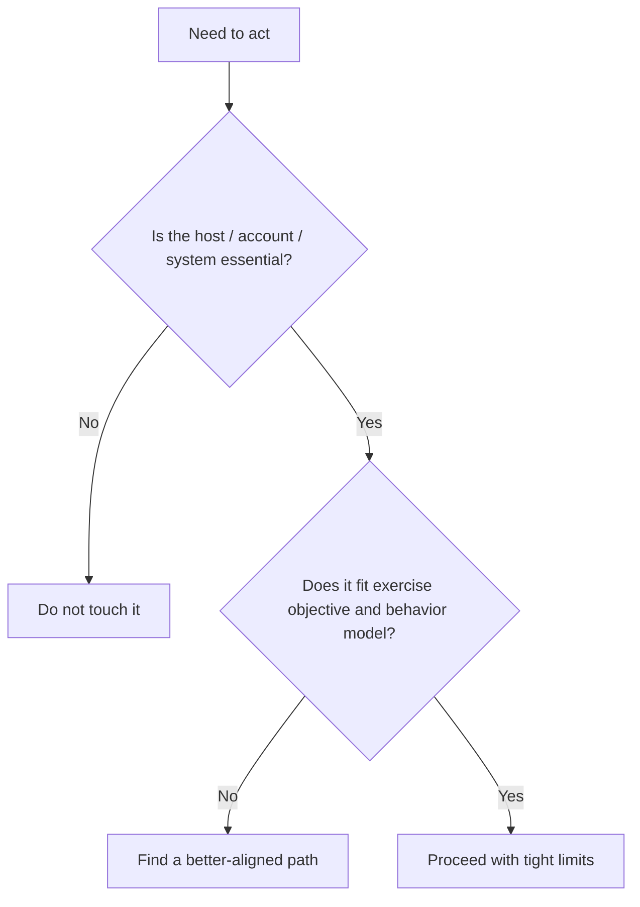
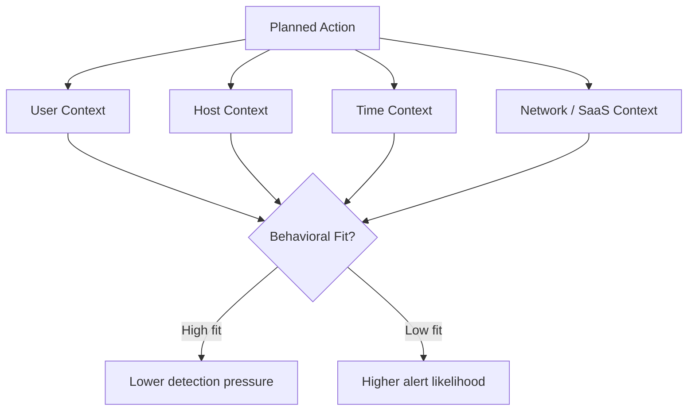
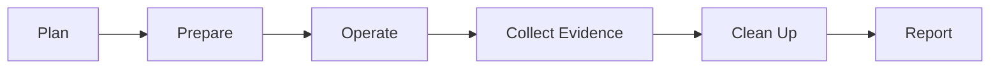
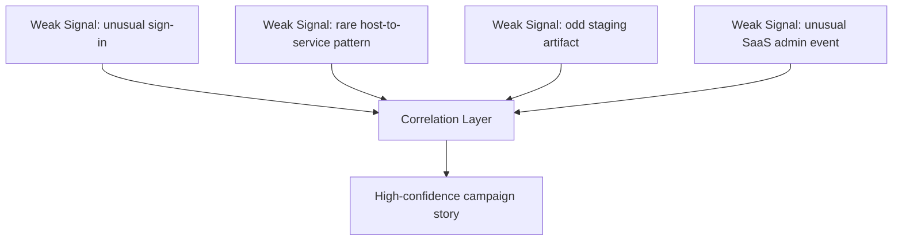

# Campaign Stealth

> **Difficulty:** Beginner → Advanced | **Category:** Red Teaming | **Focus:** Running authorized adversary-emulation activity with the smallest practical detection footprint
>
> **Authorized Use Only:** This note is for approved red-team and adversary-emulation exercises. It focuses on planning, exposure reduction, detection-aware decision-making, and defender learning — **not** unauthorized intrusion or step-by-step evasion abuse.

---

## Table of Contents

1. [What Campaign Stealth Really Means](#1-what-campaign-stealth-really-means)
2. [Why It Matters in Authorized Emulation](#2-why-it-matters-in-authorized-emulation)
3. [The Observable Surface](#3-the-observable-surface)
4. [Noise Budget Thinking](#4-noise-budget-thinking)
5. [Business Tempo, Timing, and Scope](#5-business-tempo-timing-and-scope)
6. [Behavioral Realism](#6-behavioral-realism)
7. [Stealth Across the Campaign Lifecycle](#7-stealth-across-the-campaign-lifecycle)
8. [A Practical Decision Framework](#8-a-practical-decision-framework)
9. [Beginner → Advanced Maturity Model](#9-beginner--advanced-maturity-model)
10. [Common Mistakes](#10-common-mistakes)
11. [Defender Takeaways](#11-defender-takeaways)
12. [References](#12-references)

---

## 1. What Campaign Stealth Really Means

Campaign stealth is **not** the total absence of evidence.

A better definition is:

> the ability to achieve an authorized exercise objective **without creating enough unusual signal for defenders to quickly detect, correlate, and confidently respond**.

That means stealth is about **reducing observability pressure**, not magically becoming invisible.

### Stealth vs invisibility

| Term | What it really means |
|---|---|
| invisibility | leaves no evidence anywhere — unrealistic in modern environments |
| stealth | keeps activity below the defender’s confidence threshold for long enough to complete the objective |
| OPSEC | the broader discipline of reducing exposure, correlation, and attribution |

Modern environments generate telemetry across:

- endpoints
- identity providers
- DNS and proxies
- SaaS platforms
- cloud control planes
- SIEM, EDR, XDR, and analytics pipelines

So a mature operator assumes:

1. **some evidence will always exist**
2. **correlation is the real danger**
3. **every action must justify its exposure cost**

### Simple mental model

The goal of campaign stealth is to shrink or normalize the **observable artifact** layer.

---

## 2. Why It Matters in Authorized Emulation

In a real engagement, stealth is not pursued for ego or theatrics. It matters because it changes the **quality of the measurement**.

If the red team is detected immediately because of obviously unrealistic behavior, the client learns less about:

- how well layered defenses work over time
- whether weak signals are correlated correctly
- whether identity, endpoint, network, and SaaS monitoring connect into one story
- how defenders perform against a patient, plausible adversary model

### Important framing

Stealth is only correct when it matches the **exercise objective**.

| Exercise goal | Best posture |
|---|---|
| validate alert triage on obvious attacker behavior | deliberately noisier may be appropriate |
| test detection of patient adversary activity | stealth-first approach adds value |
| measure identity and cloud anomaly detection | behaviorally realistic and low-volume activity matters more than speed |
| simulate smash-and-grab ransomware precursor behavior | some noise may be expected by design |

### The key lesson

A good red team does **not** ask:

> “How quiet can we be?”

It asks:

> “How quiet do we need to be to faithfully emulate the agreed threat while staying safe, authorized, and useful?”

### Quick pre-mission checklist

Before the campaign begins, confirm:

- the threat model being emulated
- whether stealth is a primary or secondary objective
- stop conditions and escalation contacts
- evidence collection limits
- what “success” means for the client
- how exercise artifacts will be documented and removed

---

## 3. The Observable Surface

Most beginners think stealth is mainly about malware or command-and-control traffic.

In reality, defenders see a **stack** of signals.

### 3.1 Identity surface

Examples defenders notice:

- sign-ins from unusual locations or systems
- strange MFA patterns
- token use inconsistent with normal role behavior
- privileged actions from accounts that rarely perform them

### 3.2 Endpoint surface

Examples defenders notice:

- unusual process trees
- temporary staging artifacts
- new services, tasks, or startup entries
- file access patterns inconsistent with the user or host role

### 3.3 Network surface

Examples defenders notice:

- rare outbound destinations
- new DNS patterns
- traffic volume spikes
- protocols or connection timing that do not match the host’s baseline

### 3.4 Cloud and SaaS surface

Examples defenders notice:

- admin API actions
- mailbox or file-sharing anomalies
- unusual OAuth consent or token usage
- control-plane events outside normal operational workflows

### 3.5 Human and process surface

Often ignored, but extremely important:

- help-desk tickets triggered by odd account behavior
- user reports of unexpected prompts or approvals
- inconsistent social engineering pretexts
- screenshots, notes, or exported evidence handled carelessly by the team

### Practical takeaway

If you think only about one host, you will miss the campaign story.

If defenders correlate identity + endpoint + network + SaaS context, a “quiet” action on one layer may still be loud overall.

---

## 4. Noise Budget Thinking

A useful way to reason about stealth is to assign each action a **noise cost**.

Not every action is equally dangerous from a detection perspective.

### Example noise-cost thinking

| Action pattern | Typical noise cost | Why |
|---|---|---|
| one expected-looking business action from a normal context | low | blends with baseline |
| unusual admin behavior by the wrong identity | medium-high | role mismatch is visible |
| repeated failed authentication or broad access attempts | high | easy to alert on and correlate |
| large staging or archive behavior on a user workstation | high | creates multiple endpoint and data-movement signals |
| narrowly scoped evidence capture through an approved path | lower | fewer systems and artifacts involved |

### Good noise-budget habits

- spend noise only on actions that advance the objective
- avoid “just in case” exploration
- prefer smaller proof over excessive proof
- review whether each extra host, account, or workflow adds real value

### Bad noise-budget habits

- collecting every interesting artifact because it might help later
- expanding to more systems than the objective requires
- repeating actions after enough evidence already exists
- assuming slow automatically means stealthy

> **Important:** A slow campaign can still be noisy if every action is unusual. Tempo helps, but context matters more.

---

## 5. Business Tempo, Timing, and Scope

MITRE ATT&CK highlights **business tempo** as useful adversary knowledge: understanding how a victim organization normally operates can reveal when activity is least conspicuous.

For authorized adversary emulation, that idea becomes:

> understand the client’s normal rhythm so exercise activity can be measured against realistic context.

### 5.1 Timing

Timing is not just “business hours vs after hours.” It includes:

- maintenance windows
- regional work schedules
- finance close periods
- help-desk operating times
- backup or batch-processing windows
- seasonal business cycles

An action that is normal at 02:00 on a patch-management server may be extremely suspicious at 14:00 from a sales laptop.

### 5.2 Tempo

Tempo is the **rate and cadence** of activity.

| Tempo choice | Benefit | Risk |
|---|---|---|
| fast | objective achieved sooner | correlation spikes, alert bursts, operator mistakes |
| slow | lower peak signal | more dwell time, more chances for long-term anomaly detection |
| bursty | efficient when carefully justified | may create obvious clusters of activity |
| steady and sparse | often blends better | can look machine-like if too regular |

### 5.3 Scope control

Scope is one of the strongest stealth levers.

Every extra system touched creates more opportunities for defenders to:

- see repeated patterns
- build confidence from weak signals
- identify the campaign’s direction of travel

### 5.4 Practical rules

- narrow the host set
- narrow the account set
- narrow the evidence set
- narrow the time window
- narrow the number of repeated actions

This is one of the simplest ways to become quieter without changing any tooling.

---

## 6. Behavioral Realism

The strongest stealth often comes from **behavioral fit**.

Many detections are not based on whether an action is technically possible, but whether it is **normal for this identity, this host, this network path, and this time**.

### Four-context blend model

### Questions to ask before an action

#### User context

- Does this account normally do this type of work?
- Is the privilege level consistent with the scenario?
- Would defenders view this as an expected identity path?

#### Host context

- Is this the kind of host where this action normally happens?
- Would this system usually reach that destination or service?
- Will this look like maintenance, administration, user activity, or none of the above?

#### Time context

- Does this align with business tempo?
- Would the user or system normally be active now?
- Does the action match expected change or operations windows?

#### Network and SaaS context

- Is the path common or brand-new?
- Is the destination already trusted and expected?
- Does this create a sudden pattern change in cloud or SaaS logs?

### Easy way to remember it

If the answer to most of these is **“not really”**, the action is probably loud even if the tool itself is not.

---

## 7. Stealth Across the Campaign Lifecycle

Campaign stealth should be designed across the whole engagement, not added at the last minute.

### Lifecycle view

| Phase | Main stealth question | Common failure | Better mindset |
|---|---|---|---|
| planning | what will defenders notice first? | focusing only on tools | map observables before execution |
| infrastructure preparation | what can be linked, correlated, or exposed? | reuse across campaigns | keep separation and realism |
| live operations | does each action justify its exposure? | unnecessary exploration | objective-first, minimal touch |
| evidence collection | how much proof is enough? | collecting too much | prove impact with the smallest safe data set |
| cleanup | what artifacts remain? | forgetting secondary traces | review identity, endpoint, network, and SaaS residue |
| reporting | what should the client learn? | glorifying “stealthiness” | explain controls, misses, and lessons clearly |

### Practical phase guidance

#### Planning phase

Define, in advance:

- likely defender-visible artifacts
- allowed vs disallowed risk
- fallback paths if a method becomes too noisy
- what telemetry the exercise is intended to test

#### Preparation phase

Good preparation reduces accidental exposure. Examples include:

- aligning infrastructure and naming with the scenario
- separating engagement components to reduce correlation risk
- predefining how evidence will be stored and protected

#### Live operations phase

The core discipline is restraint:

- fewer systems
- fewer repeated actions
- fewer artifacts
- fewer surprises

#### Evidence phase

A common beginner mistake is over-collection.

In mature operations, evidence should be:

- sufficient to prove impact
- minimized to reduce unnecessary client exposure
- handled in line with rules of engagement and data protection requirements

#### Cleanup and reporting phase

Cleanup is part of stealth, but also part of professionalism.

The point is not to “erase history.” The point is to remove temporary exercise artifacts that no longer serve the engagement and to document what remains relevant for the client.

---

## 8. A Practical Decision Framework

When a team is unsure whether an action is worth taking, use a simple value-versus-exposure decision model.

### 8.1 Risk matrix

| Detection / exposure risk | Mission value | Guidance |
|---|---|---|
| low | low | use only if it supports the story or learning goal |
| low | high | generally acceptable with monitoring and documentation |
| high | low | usually avoid |
| high | high | requires explicit justification, controls, and likely leadership approval |

### 8.2 Five decision questions

1. **Is this action necessary for the exercise objective?**
2. **Is there a lower-observable way to obtain the same learning outcome?**
3. **Does this fit the user, host, and time context?**
4. **What telemetry layers will see this?**
5. **If defenders notice it now, is the resulting story acceptable for the exercise?**

### 8.3 Stoplight model

| Color | Meaning |
|---|---|
| green | low exposure, good behavioral fit, strong mission value |
| yellow | acceptable only with limits and monitoring |
| red | misaligned, over-scoped, or likely to burn the campaign |

### 8.4 A practical exposure worksheet

| Factor | Low concern | High concern |
|---|---|---|
| identity | expected role behavior | unusual privilege or geography |
| endpoint | normal admin or user path | rare artifact creation |
| network | known destination / normal timing | new route / unusual volume |
| cloud / SaaS | common workflow | rare admin action or sharing pattern |
| human | believable, consistent pretext | something likely to trigger a ticket or phone call |

If several columns land in **high concern**, the action is probably not stealthy enough for a quiet campaign.

---

## 9. Beginner → Advanced Maturity Model

### Level 1 — Beginner: “Don’t be obviously noisy”

At this stage, operators usually understand that broad, repetitive, high-volume activity is bad, but they mostly think in terms of **speed and volume**.

Typical characteristics:

- reduces obvious bursts
- avoids touching unnecessary systems when reminded
- starts thinking about time of day
- still underestimates identity and SaaS telemetry

### Level 2 — Intermediate: “Match the environment”

Here, the operator thinks about **context**, not just noise.

Typical characteristics:

- considers user, host, and time fit
- plans evidence minimization
- avoids cross-client reuse patterns
- understands that cloud and SaaS logs matter as much as endpoint logs

### Level 3 — Advanced: “Engineer the whole campaign for low correlation”

At the advanced level, stealth is built into the exercise design itself.

Typical characteristics:

- defines expected observables before execution
- treats every action as part of a cross-layer telemetry story
- uses feedback loops to adjust tempo and scope during the operation
- aligns OPSEC decisions to the exact adversary model and exercise purpose
- documents residual artifacts and defender learning opportunities clearly

### Summary table

| Maturity | Primary mindset | Main weakness |
|---|---|---|
| beginner | avoid obvious spikes | ignores context and correlation |
| intermediate | blend with normal behavior | may overestimate how well it blends |
| advanced | control cross-layer exposure story | slower planning, more discipline required |

---

## 10. Common Mistakes

### 10.1 Confusing stealth with fancy tooling

A familiar tool used in the wrong place, by the wrong identity, at the wrong time is still suspicious.

### 10.2 Expanding because access exists

Just because more systems are reachable does not mean touching them improves the exercise.

### 10.3 Collecting too much proof

More screenshots, more files, more archives, and more exports often create more risk than more value.

### 10.4 Ignoring cloud and SaaS visibility

Teams that think only in terms of endpoint artifacts are often surprised by mailbox, file-sharing, identity, or control-plane detections.

### 10.5 Assuming slow equals stealthy

A low-and-slow pattern can still look abnormal if it is persistent, oddly timed, or behaviorally implausible.

### 10.6 Forgetting defender objectives

A stealth-first approach can be the wrong answer if the client wants to test early triage, crisis communications, or overt containment.

### 10.7 Treating cleanup as optional

Temporary exercise artifacts left behind can confuse incident response or create unnecessary risk after the engagement.

---

## 11. Defender Takeaways

Campaign stealth is useful for defenders because it shows where security programs depend too heavily on one obvious alert.

### What defenders should improve

- correlate weak signals across identity, endpoint, network, and SaaS layers
- baseline normal user, host, and business-tempo behavior
- alert on unusual combinations, not just single “high severity” events
- retain enough telemetry to reconstruct slow campaigns over time
- look for sequence and narrative, not only signatures

### Why this matters

NIST guidance on continuous monitoring and log management exists for exactly this reason: organizations need durable visibility, good retention, and cross-source context. Quiet campaigns are often found not by one giant alert, but by several **small truths added together**.

### Useful defender questions

- What activity is rare but still plausible in our environment?
- Which users, hosts, and services have no strong baseline today?
- Can we connect identity anomalies to endpoint and SaaS activity quickly?
- Do our analysts see isolated alerts, or coherent timelines?

---

## 12. References

- [MITRE ATT&CK](https://attack.mitre.org/)
- [MITRE ATT&CK – T1591.003 Identify Business Tempo](https://attack.mitre.org/techniques/T1591/003/)
- [MITRE ATT&CK – TA0011 Command and Control](https://attack.mitre.org/tactics/TA0011/)
- [NIST SP 800-92 – Guide to Computer Security Log Management](https://csrc.nist.gov/pubs/sp/800/92/final)
- [NIST SP 800-137 – Information Security Continuous Monitoring (ISCM)](https://csrc.nist.gov/pubs/sp/800/137/final)
