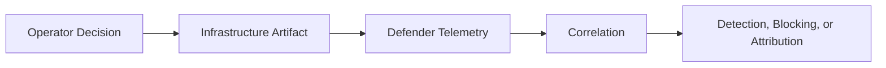
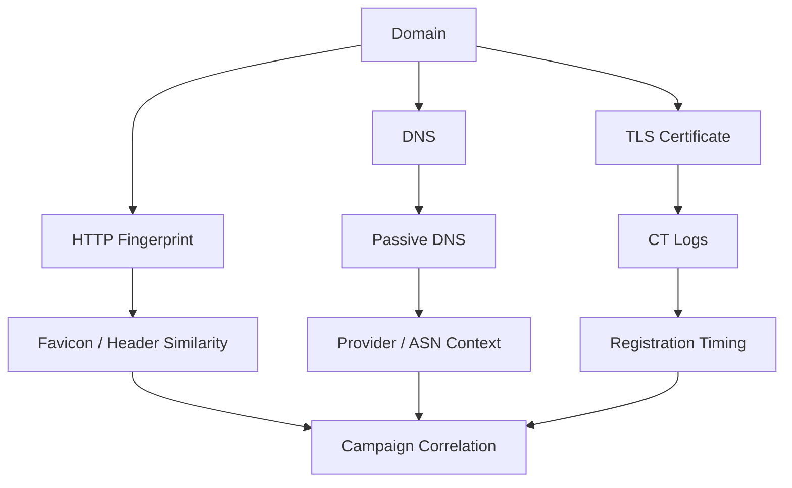
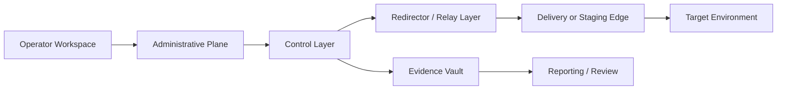
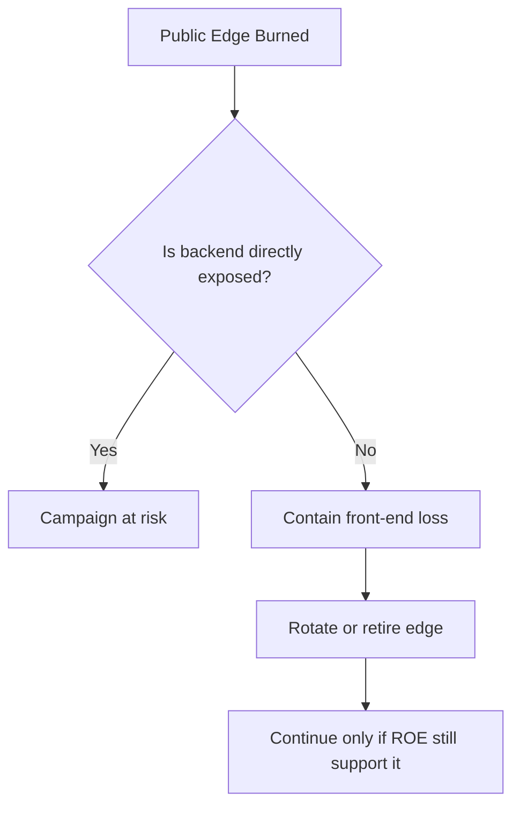
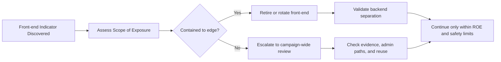
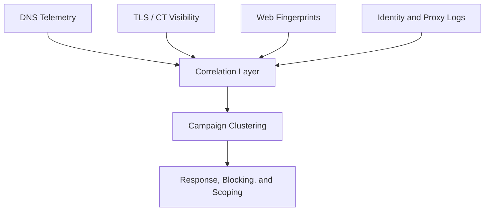

# Infrastructure Anonymity

> **Difficulty:** Beginner → Advanced | **Category:** Red Teaming | **Focus:** Compartmentalizing Campaign Infrastructure and Reducing Attribution Risk in Authorized Adversary Emulation

> **Authorized-use note:** This topic is for approved red team and adversary-emulation exercises. The goal is to design infrastructure that measures defender visibility realistically while protecting operators, clients, and evidence. It is **not** a guide to conduct unauthorized intrusion or abuse third-party infrastructure.

---

## Table of Contents

1. [Why Infrastructure Anonymity Matters](#1-why-infrastructure-anonymity-matters)
2. [What “Anonymity” Really Means](#2-what-anonymity-really-means)
3. [What Defenders Can Correlate](#3-what-defenders-can-correlate)
4. [A Safe Reference Architecture](#4-a-safe-reference-architecture)
5. [Beginner Foundation: One Campaign, One Boundary](#5-beginner-foundation-one-campaign-one-boundary)
6. [Intermediate Compartmentalization](#6-intermediate-compartmentalization)
7. [Advanced Burn Resistance and Resilience](#7-advanced-burn-resistance-and-resilience)
8. [Practical Planning Checklist](#8-practical-planning-checklist)
9. [Common Failure Modes](#9-common-failure-modes)
10. [Defender Takeaways](#10-defender-takeaways)
11. [References](#11-references)

---

## 1. Why Infrastructure Anonymity Matters

Infrastructure often gives a campaign away **before** payloads, commands, or objectives do.

A target may notice:

- a newly registered look-alike domain
- a strange TLS certificate appearing in Certificate Transparency logs
- an unusual hosting provider or region
- repeated web fingerprints, server banners, or headers
- multiple campaign domains pointing back to the same infrastructure pattern

In other words, defenders do not need full payload visibility to identify a campaign. They can often correlate **metadata** faster than content.

### A simple mental model

Good infrastructure OPSEC tries to reduce the strength of the links in the middle of that chain.

### Why this matters in red teaming

Poor infrastructure anonymity can distort an exercise:

| Problem | Exercise impact |
|---|---|
| infrastructure is easy to correlate | defenders find the team too early |
| campaign assets resemble previous engagements | cross-client contamination becomes possible |
| public-facing systems expose backend details | one burned layer reveals the whole operation |
| evidence is stored on exposed systems | client data and engagement artifacts face unnecessary risk |

A mature red team does not treat infrastructure anonymity as a vanity project. It treats it as part of **exercise realism**, **client safety**, and **evidence protection**.

---

## 2. What “Anonymity” Really Means

In professional engagements, **anonymity** rarely means perfect invisibility. A better word is **separation**.

The goal is to reduce easy linkages between:

- the operator and the campaign
- one campaign and another campaign
- public-facing delivery infrastructure and backend control systems
- approved evidence collection points and exposed internet services

### Separation goals

| Separation goal | Why it matters |
|---|---|
| operator from campaign | protects team identities and admin paths |
| campaign from campaign | prevents defenders from tying unrelated clients together |
| edge from backend | allows a front-end system to be discovered without exposing the control plane |
| collection from exposure | reduces the chance that public services leak approved evidence |

### The key idea to remember

> **Infrastructure anonymity is usually about limiting correlation, not achieving invisibility.**

That is why strong OPSEC often looks like:

- compartmentalization
- realistic infrastructure choices
- careful metadata review
- controlled reuse, or no reuse at all
- fast containment when a layer is burned

---

## 3. What Defenders Can Correlate

Defenders enrich infrastructure alerts from many angles at once. If a red team wants realistic tradecraft, it should assume defenders can combine signals across domains, certificates, email, DNS, web, cloud, and identity telemetry.

### Common observable layers

| Observable | What defenders learn | OPSEC lesson |
|---|---|---|
| domain age and naming pattern | whether the domain looks newly created or synthetic | do not assume the domain alone will look trustworthy |
| DNS records and name servers | shared patterns across infrastructure families | avoid accidental cross-campaign similarity |
| TLS certificates and CT exposure | newly issued certs, repeated SAN patterns, issuer timing | certificate metadata can reveal intent before traffic volume does |
| IP space, ASN, and region | provider reputation and geographic consistency | infrastructure should fit the scenario, not just “work” |
| HTTP headers, error pages, and favicon hashes | common backend tooling or reused images | defaults and template reuse create fast signatures |
| admin exposure | management panels, SSH banners, or exposed services | the administrative plane should not be visible from the public edge |
| evidence handling patterns | whether sensitive data lands on exposed infrastructure | keep approved collection and public services separated |

### What a defender sees as a graph

This is why a red team should periodically review its own infrastructure **the way a defender would**.

### ATT&CK context

MITRE ATT&CK documents that real adversaries acquire or compromise infrastructure such as domains and VPSs, and then use application-layer protocols for command and control. In an **authorized** exercise, those mappings are useful for threat modeling and defender emulation—not as approval to abuse third-party infrastructure outside scope.

---

## 4. A Safe Reference Architecture

A practical red team architecture should assume that the **front-most layer may be discovered**. The design question is not “Can we hide everything?” It is “What happens when one layer is found?”

### Reference layout

### What each layer is for

| Layer | Purpose | Design goal |
|---|---|---|
| operator workspace | where the team works | keep operator identity and daily activity separate from campaign infrastructure |
| administrative plane | approved management access path | avoid exposing admin services to the same audience as the public edge |
| control layer | backend coordination, control, or collection logic | protect the most valuable systems behind other layers |
| redirector / relay layer | absorbs public discovery and relays traffic | make the front layer disposable |
| delivery / staging edge | public-facing hosting for approved scenarios | keep it realistic, minimal, and isolated |
| evidence vault | approved storage for artifacts and proof | prevent public systems from becoming evidence repositories |

### One of the most important architecture rules

> **Do not let public exposure and evidence storage live in the same place unless the exercise explicitly requires it and the risk is accepted.**

### Public edge versus private control

This is the practical value of layered design: a burned edge should be inconvenient, not catastrophic.

---

## 5. Beginner Foundation: One Campaign, One Boundary

For beginners, the safest mindset is:

> **Treat each campaign as its own sealed unit.**

That means avoiding “shared everything” habits.

### Beginner objectives

1. prevent accidental cross-campaign linkage
2. protect operator identity and client data
3. keep public exposure limited and understandable
4. make cleanup and closure easy

### A beginner-friendly baseline

| Area | Solid baseline practice | Why it helps |
|---|---|---|
| campaign identity | define a unique campaign boundary and naming scheme | prevents accidental asset mixing |
| management access | use a dedicated administrative path for the engagement | reduces operator-to-campaign linkage |
| public services | expose only what the scenario requires | limits unnecessary metadata and attack surface |
| evidence handling | store approved evidence away from exposed systems | protects sensitive artifacts |
| documentation | maintain an internal map of domains, endpoints, owners, and burn criteria | speeds response when something is flagged |
| reuse | avoid reusing infrastructure pieces across clients when possible | reduces family resemblance |

### Beginner mistake to avoid

A common failure is building a technically functional setup that has **no clear boundary** between:

- admin traffic
- public delivery traffic
- backend control systems
- stored evidence

That kind of design works right up until the first exposed clue ties everything together.

---

## 6. Intermediate Compartmentalization

At the intermediate level, the focus shifts from “having separate pieces” to **managing what each piece reveals**.

### 6.1 Split by function

A more mature campaign separates infrastructure by mission role:

- delivery and pretexting
- public edge and relay
- backend control
- approved evidence collection
- reporting and long-term retention

The less overlap those roles have, the lower the blast radius when one component is detected.

### 6.2 Split by lifecycle stage

Different stages of an engagement create different telemetry.

| Stage | Typical exposure | Better OPSEC mindset |
|---|---|---|
| pre-engagement setup | domain, DNS, certificate, hosting metadata | review what becomes visible before operations start |
| live operation | traffic patterns, headers, timing, destinations | assume defenders are enriching every weak signal |
| burn response | takedowns, blocks, analyst investigation | know what can be retired without harming evidence integrity |
| closeout | leftover DNS, certificates, logs, cloud assets | finish with disciplined retirement and documentation |

### 6.3 Match the scenario, not just the technology

A believable infrastructure choice is often quieter than a merely clever one.

Questions to ask:

- Does the region make sense for the emulated threat or business pretext?
- Do visible services resemble the scenario being tested?
- Do time zones, language choices, and naming conventions fit the story?
- Would a defender see this as plausible, or instantly synthetic?

### 6.4 Review metadata like a blue team would

Intermediate teams should self-audit observable traits such as:

- DNS layout
- certificate issuance timing
- public headers and error pages
- cloud-provider fingerprints
- similarity to previously used templates or assets

This is not about chasing perfection. It is about finding **easy correlations before defenders do**.

---

## 7. Advanced Burn Resistance and Resilience

Advanced infrastructure OPSEC is less about hiding forever and more about **surviving discovery gracefully**.

### 7.1 Design for partial loss

Assume one of these may be discovered first:

- a domain
- a public IP
- a certificate
- a relay node
- a delivery path

The campaign should not automatically collapse if one front-end element is identified.

### 7.2 Burn resistance model

### 7.3 Think in terms of “family resemblance”

Even when individual assets differ, campaigns can still be tied together by:

- repeated naming styles
- similar certificate patterns
- identical web responses or error handling
- the same hosting choices and timing habits
- the same operational rhythm for setup and teardown

Advanced teams reduce this resemblance intentionally.

### 7.4 Build a defender-emulation loop

A strong maturity marker is periodically asking:

> If I were the client’s defenders, what would I correlate first?

Useful advanced habits include:

- reviewing infrastructure as a graph, not as isolated assets
- checking whether public metadata creates campaign fingerprints
- validating that retirement of one layer does not orphan evidence or break records
- ensuring shutdown and closeout steps are documented before live use

### 7.5 Remember the safety boundary

Advanced OPSEC is still bounded by authorization. If a realistic technique would require unsafe, unlawful, or out-of-scope behavior, the correct answer is to **simulate or model it**, not perform it.

---

## 8. Practical Planning Checklist

The easiest way to make this topic actionable is to turn it into a checklist.

### Before the campaign

- define the campaign boundary and what assets belong to it
- define what “burned” means for the exercise
- document which layers are public-facing and which are not
- verify that admin access does not share the same exposure path as the public edge
- confirm where approved evidence will be stored
- review visible metadata for obvious inconsistencies

### During the campaign

- track which public assets are most likely to be discovered first
- watch for indicators that a front-end layer is being investigated or blocked
- avoid unnecessary expansion of exposed services
- keep evidence handling separate from disposable infrastructure
- re-evaluate whether the infrastructure still fits the exercise objective

### If a layer is burned

- determine whether the exposure is limited to the public edge or reaches backend systems
- confirm whether approved evidence or client data are affected
- decide whether to retire, replace, or end the campaign component under ROE
- document what the defender likely saw and how quickly they saw it

### At closeout

- retire exposed assets in a controlled way
- verify that no unneeded public endpoints remain online
- preserve only the evidence required by the engagement
- record which observable artifacts would have made defender correlation easier

### Maturity ladder

| Maturity | What it looks like |
|---|---|
| beginner | unique campaign boundary, separate admin path, no casual reuse |
| intermediate | clear separation between edge, backend, and evidence; regular metadata review |
| advanced | burn-resistant architecture, defender-style self-correlation, disciplined retirement playbooks |

---

## 9. Common Failure Modes

Infrastructure OPSEC failures are usually not dramatic. They are often small, boring, and cumulative.

| Failure mode | Why it hurts |
|---|---|
| reusing the same infrastructure patterns across clients | creates fast correlation paths |
| exposing backend management services through the public edge | one discovery can expose the whole campaign |
| leaving default headers, error pages, or service fingerprints in place | defenders can cluster related assets quickly |
| mixing public delivery and evidence collection on the same systems | raises client-data risk |
| picking locations, naming, or visible traits that do not fit the scenario | reduces realism and increases suspicion |
| failing to define burn criteria before launch | slows response when defenders notice the campaign |
| poor closeout discipline | old records, certificates, or assets remain discoverable |

### The most important lesson

> **Most attribution problems come from reuse and exposure overlap, not from a single magical detection trick.**

---

## 10. Defender Takeaways

This topic is useful for defenders because it shows where mature campaigns try to reduce easy linkage.

### What defenders should correlate

- domain registration and age patterns
- name server and DNS similarities
- certificate issuance timing and visible metadata
- IP, ASN, and hosting-provider reputation
- repeated web fingerprints, header patterns, or favicon hashes
- overlap between suspicious domains, email lures, and outbound destinations
- evidence of public-edge systems exposing backend services

### Why continuous monitoring matters

NIST guidance on continuous monitoring and incident response reinforces the same lesson: isolated signals are weak, but linked signals become actionable. A defender who correlates DNS, TLS, HTTP, identity, and cloud telemetry will force red teams to operate with much tighter discipline.

### A defensive diagram

The better defenders get at clustering weak signals, the less useful sloppy “anonymous” infrastructure becomes.

---

## 11. References

- [MITRE ATT&CK – TA0011 Command and Control](https://attack.mitre.org/tactics/TA0011/)
- [MITRE ATT&CK – T1583.001 Acquire Infrastructure: Domains](https://attack.mitre.org/techniques/T1583/001/)
- [MITRE ATT&CK – T1583.003 Acquire Infrastructure: Virtual Private Server](https://attack.mitre.org/techniques/T1583/003/)
- [MITRE ATT&CK – T1584.001 Compromise Infrastructure: Domains](https://attack.mitre.org/techniques/T1584/001/)
- [NIST SP 800-137 – Information Security Continuous Monitoring (ISCM)](https://csrc.nist.gov/pubs/sp/800/137/final)
- [NIST SP 800-61 Rev. 2 – Computer Security Incident Handling Guide](https://csrc.nist.gov/pubs/sp/800/61/r2/final)
- [Mandiant – M-Trends](https://www.mandiant.com/resources/m-trends)
- [Microsoft Security – Threat Intelligence and Disruption Research](https://www.microsoft.com/security)
