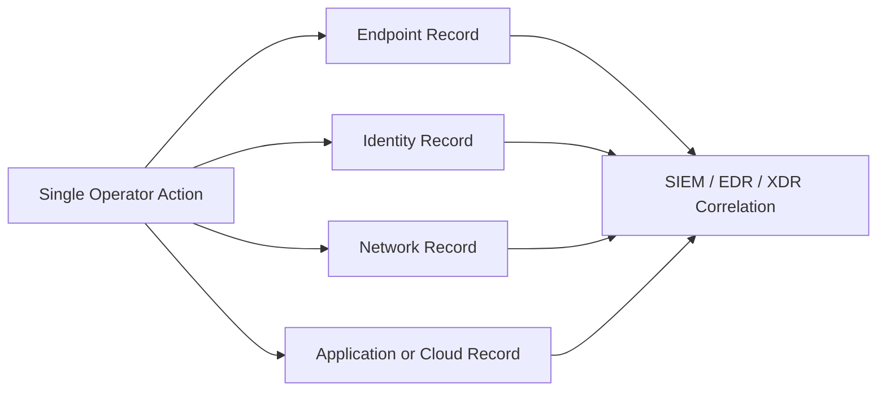
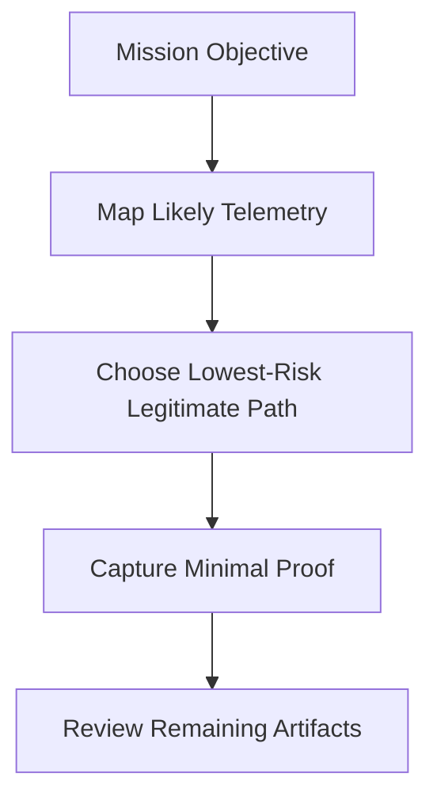
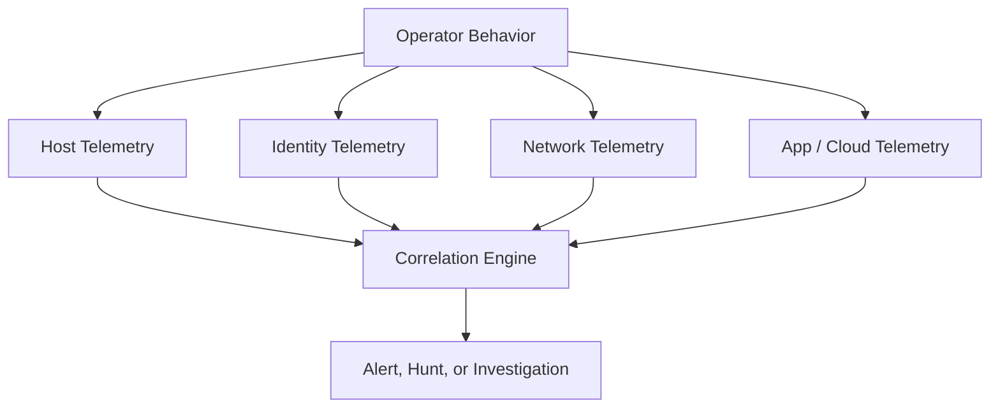
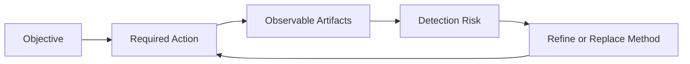
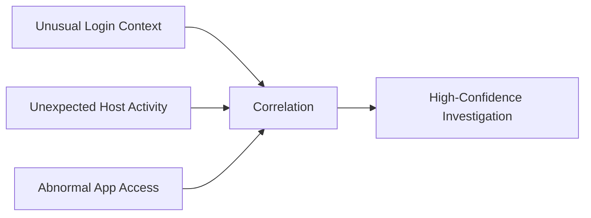
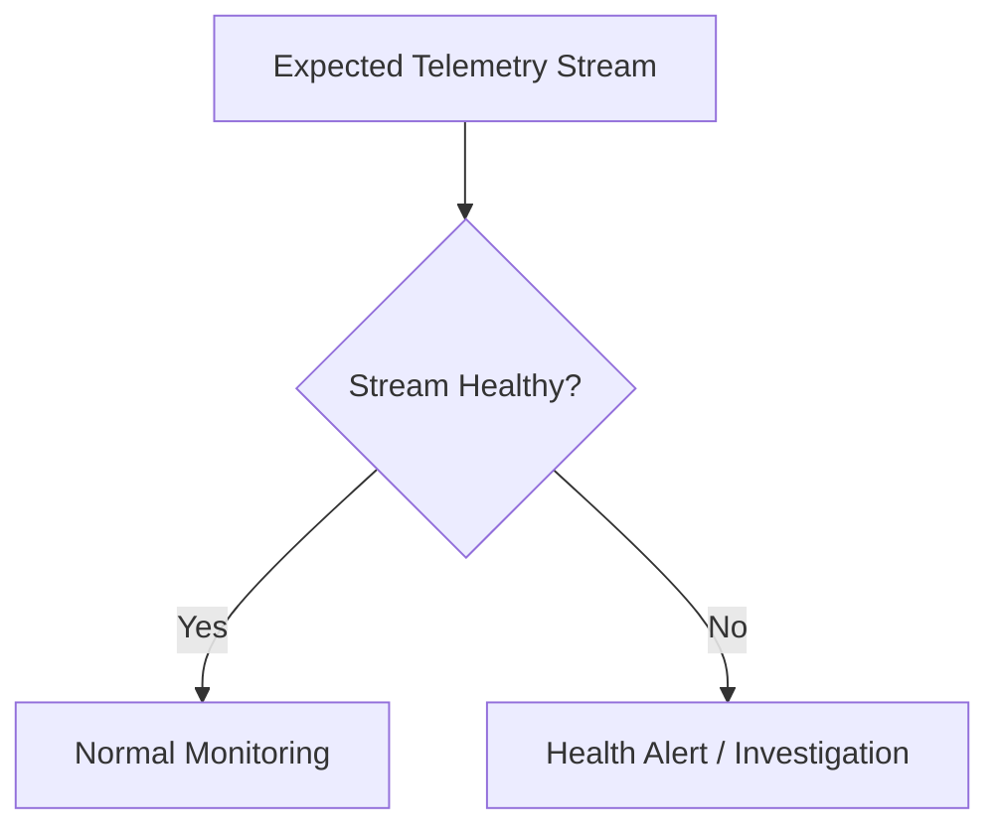

# Log Avoidance

> **Difficulty:** Beginner → Advanced | **Category:** Red Teaming | **Focus:** Reducing unnecessary telemetry during authorized adversary emulation

> **Authorized-use only:** This note is about making red-team and adversary-emulation activity more realistic and measurable inside a sanctioned engagement. It is **not** a guide to illegal intrusion or destructive anti-forensics. In mature exercises, avoiding unnecessary logs is usually better than tampering with logs after the fact.

---

## Table of Contents

1. [What Log Avoidance Actually Means](#1-what-log-avoidance-actually-means)
2. [Why It Matters in Adversary Emulation](#2-why-it-matters-in-adversary-emulation)
3. [How Telemetry Fans Out](#3-how-telemetry-fans-out)
4. [The Noise Budget Mental Model](#4-the-noise-budget-mental-model)
5. [Practical Choices That Change Logging](#5-practical-choices-that-change-logging)
6. [Platform and Environment Visibility](#6-platform-and-environment-visibility)
7. [Scenario-Based Examples](#7-scenario-based-examples)
8. [Advanced Concepts](#8-advanced-concepts)
9. [Common Mistakes and False Assumptions](#9-common-mistakes-and-false-assumptions)
10. [Authorized Operator Checklist](#10-authorized-operator-checklist)
11. [Defender Takeaways](#11-defender-takeaways)
12. [References](#12-references)

---

## 1. What Log Avoidance Actually Means

**Log avoidance** means choosing methods, timing, identities, and evidence collection patterns that create the **least unnecessary defender-visible telemetry** while still meeting the engagement objective.

In plain language:

> do the job with the smallest realistic footprint, instead of creating noise and trying to erase it later.

A beginner-friendly way to think about logs is this:

> **logs are receipts** for actions that happened on systems, accounts, networks, applications, and cloud services.

That matters because most actions do not create just one receipt.
One action often creates **many related records**.

### Avoidance vs. tampering

These ideas are related, but they are not the same.

| Concept | Main idea | Why mature teams prefer it |
|---|---|---|
| log avoidance | reduce avoidable telemetry before it is created | more realistic, less risky, usually harder to detect |
| log tampering | alter, clear, disable, or destroy evidence after the fact | often loud, often detectable, may violate engagement intent |

MITRE ATT&CK documents **Indicator Removal on Host (T1070)**, which includes clearing or modifying artifacts. In real adversary emulation, however, a team often learns more by asking:

- Can the objective be met with fewer observable actions?
- Can the same proof be collected with less staging and less transfer volume?
- Can activity be aligned to a believable user, host, application, or time window?

If the answer is yes, that is usually better OPSEC than direct log interference.

---

## 2. Why It Matters in Adversary Emulation

Red teaming is not just about “getting access.” It is about measuring **how defenders would see a realistic adversary**.

If a team generates unnecessary noise, the exercise becomes less useful:

| Poor log discipline causes... | Why that hurts the exercise |
|---|---|
| early detection from noisy activity | the team measures its own mistakes more than the client's controls |
| unrealistic anti-forensics behavior | results stop matching the emulated threat |
| excessive data collection or staging | defenders see artifacts that a disciplined adversary might never create |
| unnecessary admin changes | the exercise becomes louder than the business reality it is meant to test |

### The core red-team rule

> If a method only looks stealthy because it requires deleting evidence afterward, it is usually not good OPSEC.

### What “good” looks like

A good log-avoidance mindset is:

- objective-first
- scope-aware
- defender-aware
- minimally invasive
- fully documented for the client afterward

---

## 3. How Telemetry Fans Out

Many beginners focus only on local operating-system logs. Mature defenders do not. They correlate across layers.

### Main telemetry layers

| Layer | Typical examples | Why it matters |
|---|---|---|
| endpoint | process starts, script execution, file access, service changes | tells defenders what happened on a host |
| identity | logons, MFA prompts, token use, privilege assignment | shows who did it and under what context |
| network | DNS, proxy, firewall, VPN, web gateway, flow records | shows where activity went and when |
| application | web access logs, database audit trails, API actions | captures business-context actions |
| cloud / SaaS | control-plane actions, mailbox audit, file sharing, admin events | often survives even when hosts are short-lived |
| centralized analytics | SIEM, EDR, XDR, detections, data lakes | combines weak signals into stronger findings |

### Why this matters operationally

A local artifact may be only one piece of the picture.
Even if one source is weak, defenders may still see:

- the identity being used
- the network path taken
- the application object accessed
- the timing relationship between multiple actions

### A useful web-app lesson

The OWASP Logging Cheat Sheet emphasizes that **application logs provide business and user context** that infrastructure logs alone do not. For red teams, that means an action that looks quiet at the OS level may still be obvious in:

- admin audit logs
- export history
- workflow records
- object access trails
- API activity timelines

---

## 4. The Noise Budget Mental Model

A practical way to teach beginners is to treat every action like it spends from a **noise budget**.

You do not have infinite budget.
Every extra action creates extra observables.

### Noise budget questions

Before doing something, ask:

1. **What is the actual objective?**
2. **What proof is minimally required?**
3. **Which telemetry layers will record this?**
4. **What part of the action is high-signal?**
5. **Is there a simpler path that produces fewer new artifacts?**
6. **Does this require explicit approval because it touches security controls or logging?**

### A simple scoring model

| Question | Low-cost answer | High-cost answer |
|---|---|---|
| identity | expected account for the workflow | unusual or high-privilege account |
| host | role-appropriate system | random workstation or sensitive server |
| timing | matches business rhythm | sudden burst at an odd time |
| volume | small, scoped proof | broad collection or repeated retries |
| persistence | temporary and approved | new durable artifacts |
| correlation | isolated event | many linked events across systems |

The goal is not perfection.
The goal is to **avoid spending noise where it adds no mission value**.

---

## 5. Practical Choices That Change Logging

This is where log avoidance becomes operational rather than theoretical.

### 5.1 Identity context

Identity is often louder than the action itself.
A moderate action from an obviously wrong account may stand out more than a technically complex action from an expected one.

Think about:

- whether the identity fits the role being emulated
- whether the source device fits that identity
- whether the privilege level fits the task
- whether authentication patterns look normal or sudden

### 5.2 Host selection

The same behavior can tell very different stories depending on **where** it happens.

| Host choice | Likely defender interpretation |
|---|---|
| admin workstation or jump host | possibly expected for privileged operations |
| developer build server | may fit automation-related activity |
| finance desktop | privileged or infrastructure actions may look abnormal fast |
| critical server | even low-volume actions may receive immediate scrutiny |

### 5.3 Process creation and tooling behavior

New processes, unusual parent-child relationships, script execution, and admin tooling launches often generate strong endpoint telemetry.

A good principle is:

> the more your method changes normal execution patterns, the more likely it is to be visible.

That does **not** mean “never use tools.”
It means understand the **behavioral fit** of a tool in a specific environment.

### 5.4 Authentication patterns

Repeated failures, unusual logon types, explicit-credential usage, and sudden privilege changes are often high-signal.

Common mistakes include:

- retry storms
- broad authentication attempts
- unnecessary account switching
- using privileged context for low-value tasks

### 5.5 Timing and tempo

Noise is not only about what you do. It is also about **how fast** and **how often** you do it.

| Tempo pattern | Effect |
|---|---|
| bursty, repeated, automated-looking actions | easier to baseline as abnormal |
| paced, objective-driven, limited actions | fewer spikes and fewer chained alerts |
| “just in case” repeated checks | often create avoidable extra logs |

### 5.6 Data minimization

Large data staging, bulk exports, and oversized evidence collection create extra logs around:

- archive creation
- file access
- data movement
- outbound transfer
- cloud object access

A mature team captures **the smallest approved proof** needed to support the report.

### 5.7 Application-aware behavior

On modern platforms, application and SaaS telemetry can be richer than host logs.
That means actions should align to how the application is normally used.

Examples of things defenders may notice quickly:

- error-heavy request patterns
- impossible user workflows
- mass object access
- unusual admin actions
- export features used outside normal business context

### Higher-noise vs lower-noise thinking

| Objective | Higher-noise pattern | Lower-noise pattern |
|---|---|---|
| prove access exists | repeated broad validation attempts | one scoped validation with minimal proof |
| review sensitive material | large staging or archive creation | targeted review of approved sample data |
| test privileged path | sudden privileged activity from mismatched context | scenario-aligned use of an approved role path |
| emulate application abuse | bursty workflow-inconsistent actions | rate-limited, scope-aligned validation |

These are **decision patterns**, not instructions. The lesson is that the same mission goal can often be achieved with very different visibility profiles.

---

## 6. Platform and Environment Visibility

Log avoidance gets easier when you understand what each platform tends to record.

### 6.1 Windows environments

Windows often gives defenders telemetry from multiple overlapping places:

- Security log
- PowerShell operational logging
- Sysmon operational logging
- Task Scheduler and service creation records
- Windows Event Forwarding (WEF)
- EDR/XDR sensor telemetry

Commonly monitored signals include:

| Signal area | Example defender interest |
|---|---|
| account use | successful logons, failed logons, explicit credentials |
| privilege | special privileges assigned, admin changes |
| execution | process creation, script execution, parent-child anomalies |
| persistence | new services, scheduled tasks, autorun changes |
| tampering | event log clearing, sensor stoppage, audit policy changes |

Important practical lesson:

> local log interference rarely removes everything, because forwarded events, EDR telemetry, and correlation platforms may already have the data.

### 6.2 Linux and macOS environments

Typical visibility may include:

- authentication and sudo logs
- `journald` / system log records
- audit frameworks such as `auditd`
- shell history artifacts
- SSH server records
- package-management records
- EDR or osquery-like telemetry

Key lesson:

Even if one artifact is weak or missing, defenders may still reconstruct:

- account usage
- source system
- command execution timing
- file access patterns
- outbound network behavior

### 6.3 Web, application, and API environments

Application environments create their own powerful story:

- access logs
- admin audit events
- data export records
- object modification history
- workflow transitions
- API request metadata
- rate-limit or abuse-detection events

This is why “quiet on the endpoint” does not necessarily mean “quiet in the app.”

### 6.4 Cloud and SaaS environments

Cloud and SaaS actions frequently create durable audit trails, including:

- console sign-ins
- control-plane changes
- role or permission updates
- mailbox actions
- file sharing activity
- object store access
- identity-provider events

In some environments, cloud audit visibility is **better retained** than endpoint visibility.
That reverses a common beginner assumption.

---

## 7. Scenario-Based Examples

These examples stay at the decision level. They are meant to build judgment, not provide attack steps.

### 7.1 Objective: prove access to a sensitive file share

| Less mature approach | More mature approach |
|---|---|
| browse broadly, touch many files, stage extra copies | validate a narrowly scoped approved sample and record only the proof needed |

**Lesson:** broad curiosity creates a bigger log trail than objective-driven proof collection.

### 7.2 Objective: emulate misuse of a privileged workflow

| Less mature approach | More mature approach |
|---|---|
| perform the action from an unusual identity, host, and time window | align the test to a believable role, path, and approved time window |

**Lesson:** identity and context often matter more than raw technical stealth.

### 7.3 Objective: evaluate web-application monitoring

| Less mature approach | More mature approach |
|---|---|
| send noisy, error-heavy, repetitive requests that do not match the app's workflow | validate only the scoped behavior, at realistic pace, with workflow-aware actions |

**Lesson:** application defenders notice impossible user journeys and volume anomalies quickly.

### 7.4 Objective: show that a cloud permission path is risky

| Less mature approach | More mature approach |
|---|---|
| explore widely across many services and objects | verify the minimum approved control weakness and stop |

**Lesson:** control-plane audit logs make “just looking around” much more visible than many operators expect.

---

## 8. Advanced Concepts

Once the basics are understood, log avoidance becomes a correlation problem.

### 8.1 Correlation beats single events

Mature defenders do not need one perfect alert.
Several weak signals can become one strong story.

This means you should think in **chains**, not isolated actions.

### 8.2 Role congruence

Advanced OPSEC asks whether these things make sense **together**:

- account
- source host
- destination
- time of day
- privilege level
- business action

If one element is believable but the overall combination is not, correlation may still expose the activity.

### 8.3 Chain compression

Every extra pivot, retry, staging step, or verification loop adds receipts.
A mature operator asks:

> can the same objective be met in fewer observable steps?

Fewer steps usually means:

- fewer processes
- fewer authentications
- less lateral context
- less staging
- fewer opportunities for chained detection

### 8.4 Telemetry gaps are telemetry too

Advanced defenders monitor not only suspicious activity, but also:

- sensors going silent
- missing logs from important assets
- forwarding interruptions
- sudden drops in expected event volume

So even “absence” can become a signal.

### 8.5 The evidence-floor concept

A mature goal is often not “leave zero evidence.”
That is unrealistic in modern enterprises.

A better goal is:

> stay below the defender's actionable detection threshold long enough to complete the approved objective.

That framing is both more realistic and more educational for the client.

---

## 9. Common Mistakes and False Assumptions

| False assumption | Better understanding |
|---|---|
| “If local logs are gone, the evidence is gone.” | forwarded, correlated, cloud, identity, and app logs may still exist. |
| “Using built-in tools is automatically invisible.” | defenders often detect behavior, not just tool names. |
| “Business hours always make activity blend in.” | the wrong account or host during business hours can still stand out. |
| “No alert means no trace.” | some evidence may simply not be triaged yet. |
| “Cloud actions are less visible than host actions.” | cloud control-plane and SaaS audit logs are often durable and searchable. |
| “Silencing a sensor helps me.” | sudden telemetry loss can itself trigger investigation. |

### A major beginner trap

Many people think log avoidance is mostly about deleting things.
In practice, good log avoidance is more often about:

- restraint
- planning
- choosing the right context
- minimizing unnecessary activity
- understanding defender telemetry

---

## 10. Authorized Operator Checklist

Use this before and during a sanctioned exercise.

### Pre-execution checklist

| Question | Why it matters |
|---|---|
| Is the objective clearly defined? | vague objectives create extra exploratory noise |
| Is the minimum proof requirement known? | prevents over-collection and unnecessary staging |
| Are logging or security-control touches explicitly approved? | avoids unsafe or out-of-scope tampering |
| Which telemetry layers will likely record this? | supports realistic risk estimation |
| Does the identity-host-time combination make scenario sense? | reduces obvious context mismatches |
| Is there a lower-noise path that still meets the objective? | improves realism and lowers avoidable exposure |

### During execution

- move only as far as needed to satisfy the objective
- avoid repetitive “double-check” actions unless they add mission value
- treat new persistence, service changes, or logging changes as high-risk decisions
- record internally what artifacts you expect defenders to see
- stop and reassess when an action starts spending too much noise budget

### After execution

- document what telemetry was probably created
- note where defenders should have seen the activity
- explain which actions were intentionally minimized
- identify where client visibility was stronger or weaker than expected

This turns OPSEC decisions into report value instead of hidden operator folklore.

---

## 11. Defender Takeaways

Red-team log avoidance teaches defenders an important lesson:

> attackers do not always beat telemetry by turning it off; often they succeed by operating where visibility is fragmented, poorly correlated, or treated as routine.

### Defensive improvements

- centralize endpoint, identity, network, cloud, SaaS, and application telemetry
- protect and monitor log forwarding paths
- alert on **gaps in telemetry**, not only suspicious events
- watch for mismatched identity-host-action combinations
- monitor high-value workflows such as exports, admin actions, and privilege use
- keep application logging rich enough to capture business context, as OWASP recommends

### Simple defender maturity model

| Level | Characteristic |
|---|---|
| basic | collects some endpoint logs |
| developing | adds identity and network visibility |
| mature | correlates endpoint, identity, network, and cloud/SaaS data |
| advanced | detects subtle campaigns through context, sequence, and telemetry health |

A strong program makes “quiet enough to ignore” much harder than “technically possible to execute.”

---

## 12. References

- [MITRE ATT&CK – Indicator Removal on Host (T1070)](https://attack.mitre.org/techniques/T1070/)
- [MITRE ATT&CK – Clear Windows Event Logs (T1070.001)](https://attack.mitre.org/techniques/T1070/001/)
- [MITRE ATT&CK – Clear Command History (T1070.003)](https://attack.mitre.org/techniques/T1070/003/)
- [OWASP Logging Cheat Sheet](https://cheatsheetseries.owasp.org/cheatsheets/Logging_Cheat_Sheet.html)
- [NIST SP 800-92 – Guide to Computer Security Log Management](https://csrc.nist.gov/publications/detail/sp/800-92/final)
