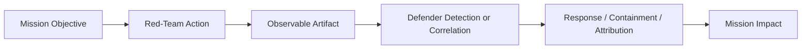
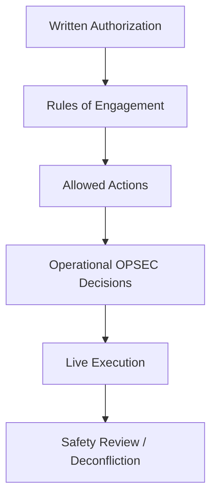
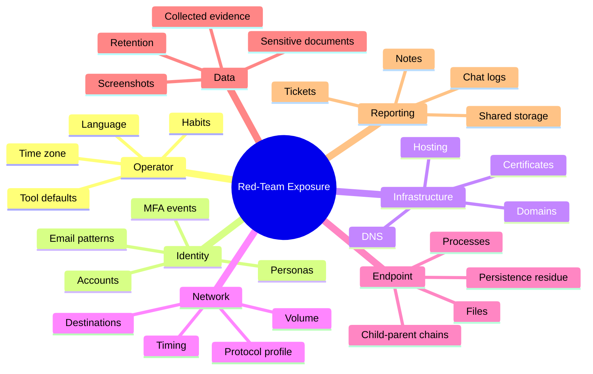
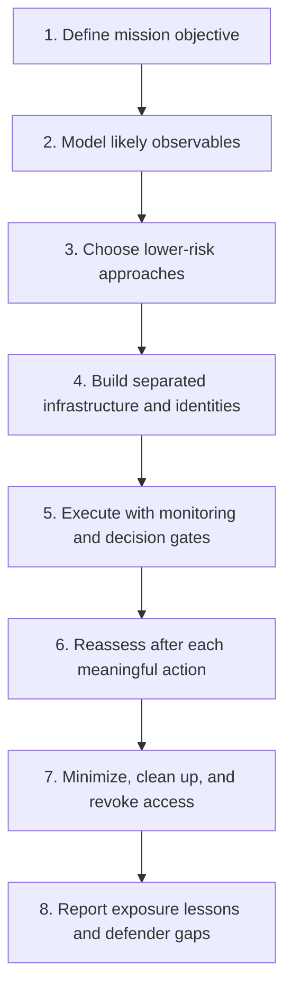
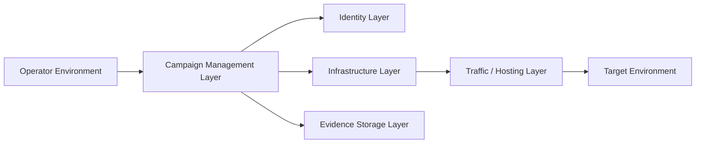
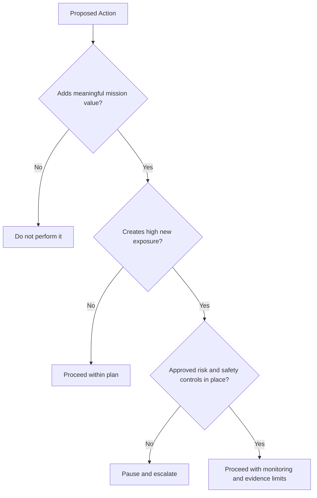
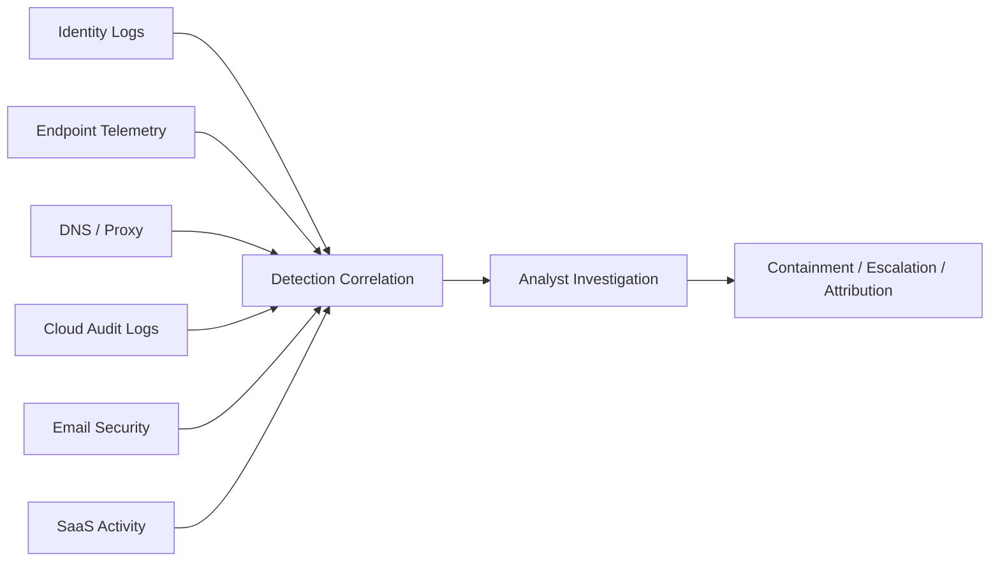
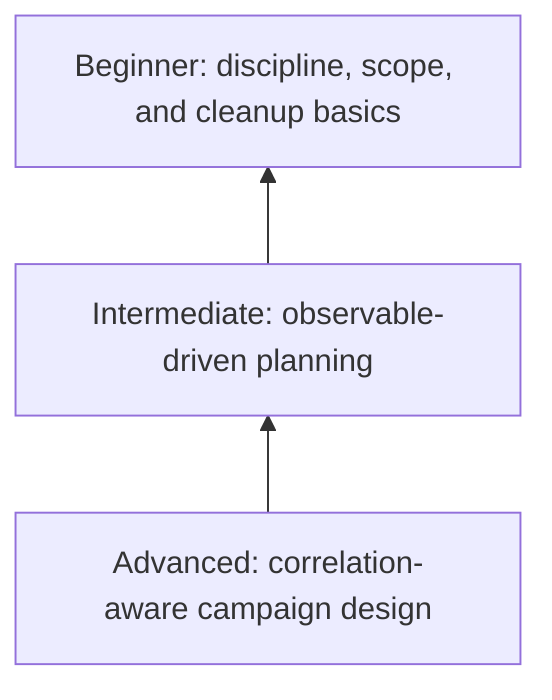

# Red Team OPSEC

> **Difficulty:** Beginner → Advanced | **Category:** Red Teaming | **Focus:** Authorized Adversary Emulation, Exposure Management, and Operational Safety

> **Important:** This note is for **authorized, contract-backed adversary emulation only**. It explains how professional teams reduce unnecessary exposure, preserve exercise realism, and protect client data **without** giving step-by-step intrusion instructions.

---

## Table of Contents

1. [What Red-Team OPSEC Means](#1-what-red-team-opsec-means)
2. [Why OPSEC Matters](#2-why-opsec-matters)
3. [Safety, Legal, and Ethical Boundaries](#3-safety-legal-and-ethical-boundaries)
4. [The Main Exposure Surfaces](#4-the-main-exposure-surfaces)
5. [The Red-Team OPSEC Lifecycle](#5-the-red-team-opsec-lifecycle)
6. [Planning OPSEC Before the First Action](#6-planning-opsec-before-the-first-action)
7. [Infrastructure, Identity, and Communication Hygiene](#7-infrastructure-identity-and-communication-hygiene)
8. [Execution Discipline During Live Operations](#8-execution-discipline-during-live-operations)
9. [Evidence, Data Handling, and Artifact Control](#9-evidence-data-handling-and-artifact-control)
10. [Defender View: What Blue Teams Correlate](#10-defender-view-what-blue-teams-correlate)
11. [OPSEC Maturity: Beginner → Advanced](#11-opsec-maturity-beginner--advanced)
12. [Common OPSEC Failure Modes](#12-common-opsec-failure-modes)
13. [Worked Example: Safe OPSEC Decision-Making](#13-worked-example-safe-opsec-decision-making)
14. [Practical Checklists](#14-practical-checklists)
15. [References](#15-references)

---

## 1. What Red-Team OPSEC Means

**Operational Security (OPSEC)** in red teaming is the discipline of controlling what defenders, service providers, third parties, and even the client can learn from the red team’s actions **during an authorized engagement**.

A simple definition:

> Red-team OPSEC is the practice of reducing unnecessary observables so the exercise measures real detection and response capability instead of accidental noise created by the assessment team.

That means OPSEC is **not** just “stealth,” and it is definitely not “do whatever avoids logging.” In professional adversary emulation, OPSEC is about:

- protecting the integrity of the exercise
- avoiding unrealistic exposure caused by sloppy operations
- limiting collateral risk to the client and third parties
- preventing accidental attribution to the operator or consultancy
- handling client data safely from beginning to end

### OPSEC in one picture

OPSEC mostly lives in the middle of that chain:

- **What artifacts are created?**
- **How visible are they?**
- **Can they be correlated?**
- **Do they match the emulated adversary?**

### OPSEC is not invisibility

A mature red team knows that “maximum stealth” is not always the goal.

Sometimes the correct choice is to:

- accept a visible action because it is mission-critical
- deliberately trigger a detection to test escalation paths
- use a provided account or seeded path because the Rules of Engagement require it
- stop an action because the risk to the client outweighs the learning value

That is why OPSEC should be treated as **risk management for observables**, not as a magic trick.

---

## 2. Why OPSEC Matters

Poor OPSEC creates false results.

If defenders catch the team because of a sloppy domain registration pattern, reused infrastructure, careless evidence handling, or noisy operator behavior, the exercise may tell the client very little about their real-world readiness.

### What weak OPSEC looks like

| Weak practice | What happens | Why it hurts the exercise |
|---|---|---|
| Reused infrastructure | Blocking and attribution happen quickly | The target detects your past campaigns, not this one |
| Weak identity separation | Operator details leak into campaign actions | The exercise stops being realistic |
| Noisy execution | Defenders see obvious anomalies too early | Detection is measured against your mistakes |
| Poor artifact cleanup | Temporary files, logs, or credentials remain | Client risk increases after the exercise |
| Excessive data collection | Sensitive data leaves the environment unnecessarily | Legal, privacy, and trust risk increase |
| Unplanned communication | Mixed channels create confusion during incidents | Safety and deconfliction become harder |

### Why clients care

Clients do not hire red teams only to ask, “Can you get in?”

They usually want answers to questions like:

- Can an adversary achieve a business objective before responders notice?
- Which telemetry sources would have exposed the activity earlier?
- Where are our detection blind spots?
- Can our defenders correlate weak signals across identity, endpoint, network, and cloud control plane?
- Do our incident procedures work under ambiguity?

Bad OPSEC distorts all of those answers.

### The realism principle

Good red-team OPSEC supports **realism**, but realism is broader than stealth.

Realism means the operation should look like a plausible adversary campaign in terms of:

- timing
- target selection
- infrastructure style
- level of patience
- amount of data touched
- tolerance for risk
- expected operational mistakes

That is why MITRE ATT&CK is useful here: it reminds teams that an operation is a **sequence of behaviors**, not just a set of technical tricks.

---

## 3. Safety, Legal, and Ethical Boundaries

Red-team OPSEC begins **before** the first technical action. If authorization, scope, escalation paths, and safety controls are weak, the team does not have an OPSEC problem — it has a governance problem.

### Non-negotiable foundations

Every live red-team engagement should have:

- explicit written authorization
- documented scope and out-of-scope assets
- Rules of Engagement (RoE)
- emergency stop and deconfliction procedures
- named client contacts for operational and legal escalation
- data handling rules
- approval requirements for higher-risk actions

### OPSEC vs concealment from the client

This is a key beginner mistake.

**OPSEC does not mean hiding from the client sponsor.** It means controlling exposure inside the exercise while staying within the client-approved framework.

There are usually multiple audiences:

| Audience | What they may know |
|---|---|
| Executive sponsor | Full authorization and business objective |
| Engagement manager | Full scope, timing, risks, safety controls |
| Deconfliction contact | Enough information to stop or steer operations safely |
| Blue team | Varies by engagement type: none, partial, or delayed disclosure |
| Third parties / providers | Ideally nothing beyond normal service interactions |

### Safety over stealth

If a choice must be made between:

- preserving stealth, or
- preventing client harm,

professional teams choose **safety**.

That includes situations involving:

- suspected production instability
- accidental third-party interaction
- access to highly sensitive regulated data
- cloud cost spikes or service impact
- signs that defenders are escalating into business disruption

### A simple boundary model

OPSEC sits **inside** the authorized action space, not outside it.

---

## 4. The Main Exposure Surfaces

A red team can be exposed in many places that have nothing to do with the implant, browser session, or endpoint. Think in **surfaces**, not only in payloads.

### 4.1 Operator exposure

This is the human layer.

Examples:

- working hours that clearly match the operator’s time zone instead of the emulated adversary
- repeated spelling, naming, or formatting habits
- reuse of personal research accounts or browsing profiles
- copy-pasted defaults from tooling, templates, or automation

### 4.2 Identity exposure

This includes campaign personas, cloud tenants, email accounts, usernames, and any account used to support the operation.

Examples:

- naming patterns that link multiple campaigns
- rushed account creation that looks synthetic
- login flows that do not fit the pretext
- account recovery or MFA processes that expose the team

### 4.3 Infrastructure exposure

Infrastructure is one of the biggest OPSEC surfaces because it can be correlated **before** the target sees any host-level activity.

Examples:

- domain registration fingerprints
- TLS certificate reuse
- provider concentration
- DNS patterns
- redirector misconfiguration
- control-plane logs at the hosting provider

### 4.4 Network exposure

Even when content is encrypted, behavior still leaks.

Examples:

- beacon timing that is too regular
- unusual egress destinations
- inconsistent geolocation
- traffic bursts during local off-hours
- destination reuse across unrelated exercises

### 4.5 Endpoint exposure

This is what defenders often think about first, but it is only one slice.

Examples:

- process trees that do not fit the host’s normal behavior
- temporary files left behind after a task
- shortcuts, archives, or staging remnants
- persistence mechanisms that remain longer than necessary

### 4.6 Data and reporting exposure

Many engagements are “burned” by note-taking, evidence storage, or internal collaboration rather than by the technical path itself.

Examples:

- screenshots with visible secrets or personal data
- raw client documents synced to uncontrolled storage
- shared chat logs that contain credentials
- evidence retained longer than the contract allows

### Exposure surface summary

| Surface | Typical observable | Useful red-team control | Common defender data source |
|---|---|---|---|
| Operator | time, language, habits | standardized workflows, peer review, scheduling discipline | investigation notes, metadata, behavioral analytics |
| Identity | account creation and login patterns | campaign-specific identities and approval workflows | IdP logs, SaaS audit trails |
| Infrastructure | domain, DNS, TLS, provider details | segmentation, hygiene, inventory, reputation review | DNS logs, passive DNS, threat intel |
| Network | timing, volume, destination profile | pacing, realistic routing, change management | proxy logs, firewall, NDR |
| Endpoint | files, processes, persistence residue | artifact minimization, time-bounded actions, cleanup | EDR, Sysmon, local logs |
| Data | overcollection or mishandling | minimization, secure storage, retention rules | DLP, audit logs, investigation artifacts |

---

## 5. The Red-Team OPSEC Lifecycle

Strong OPSEC is continuous. It is not a one-time checklist.

### Phase 1: Define the mission objective

If the goal is vague, OPSEC decisions become vague too.

Bad objective:

- “Get as deep as possible.”

Good objective:

- “Determine whether an authorized adversary could reach a finance approval workflow without being detected within the agreed timeframe.”

Specific objectives help the team reject unnecessary actions that create exposure but do not improve the answer.

### Phase 2: Model observables

Before acting, ask:

- What logs will this likely create?
- Which teams could see those logs?
- Which observables are normal for this environment?
- Which observables are rare and immediately suspicious?
- What can be correlated across identity, endpoint, network, SaaS, and cloud?

### Phase 3: Choose lower-risk approaches

OPSEC is often about **selection**, not invention.

If two methods produce the same learning outcome, prefer the one that:

- touches fewer systems
- creates fewer artifacts
- is easier to reverse
- fits the emulated threat better
- is less likely to create client-side instability

### Phase 4: Build with separation

Separation means one compromise does not reveal everything.

Typical separation layers:

- operator identity vs campaign identity
- research environment vs live environment
- infrastructure used for staging vs infrastructure used for communication
- client data storage vs internal project management
- test credentials vs personal credentials

### Phase 5: Execute with decision gates

Do not let operations drift.

Use decision gates such as:

- “Pause if the next action touches regulated data.”
- “Escalate if this requires crossing a trust boundary not in the original plan.”
- “Stop if defenders appear to be taking business-impacting action.”

### Phase 6: Reassess continuously

A professional team updates its OPSEC posture when:

- defenders start noticing weak signals
- the environment behaves differently than expected
- the threat model changes
- the mission objective is already proven
- further action adds little value but much more risk

### Phase 7: Cleanup and revocation

Cleanup is part of OPSEC, not an afterthought.

This includes:

- revoking temporary accounts and tokens
- tearing down campaign infrastructure on schedule
- verifying evidence retention rules
- removing unnecessary artifacts that the RoE requires you to remove
- documenting what intentionally remains for client review

---

## 6. Planning OPSEC Before the First Action

The best OPSEC work happens before the live phase begins.

### 6.1 Start with an OPSEC planning matrix

| Planning question | Why it matters | Example safe output |
|---|---|---|
| What business objective are we testing? | Prevents unnecessary activity | “Validate whether finance approval can be reached” |
| Which defender teams might see us first? | Drives observable modeling | “Identity + email security + proxy” |
| What would burn the campaign early? | Helps prioritize controls | “Account creation anomalies, unrealistic login profile” |
| What must never be touched? | Defines hard stops | “Production customer data, third-party tenants” |
| What needs sponsor approval mid-operation? | Prevents improvisation risk | “Any action that could affect availability” |
| What evidence is enough? | Reduces overcollection | “Minimal screenshots and timestamps, not full data copies” |

### 6.2 Tie OPSEC to the threat model

A common mistake is building an OPSEC plan that is technically polished but strategically wrong.

If the client wants an emulation of a patient, low-volume actor, then the plan should reflect that with:

- slower tempo
- narrow target selection
- limited infrastructure footprint
- strict data minimization
- careful use of identities and cloud resources

If the client wants to test whether defenders can catch a smash-and-grab cloud intrusion, the OPSEC plan may allow a louder profile — but that should be **intentional and documented**.

### 6.3 Define acceptable exposure

Not every observable is bad.

A useful planning exercise is to classify observables into three groups:

| Observable type | Meaning |
|---|---|
| Expected and acceptable | Normal side effect of realistic activity |
| Concerning but tolerable | Might trigger review, but still acceptable for the objective |
| Unacceptable | Breaks realism, increases risk, or violates the RoE |

### 6.4 Decide what “good enough evidence” means

A lot of unnecessary exposure comes from continuing after the objective is already proven.

Examples of good stopping questions:

- Have we already demonstrated the business risk?
- Would one more step only produce redundant screenshots?
- Are we collecting more data than the report actually needs?
- Is the next action useful for the client, or only satisfying for the operator?

### 6.5 Build approval and deconfliction paths

Good OPSEC planning includes people, not just systems.

Minimum live-engagement contacts usually include:

- red-team lead
- client sponsor
- deconfliction contact
- emergency stop contact
- if needed, legal / privacy escalation contact

---

## 7. Infrastructure, Identity, and Communication Hygiene

This is where many campaigns are won or lost.

### 7.1 Separation model

The key idea is simple:

> If one layer is exposed, it should not automatically expose every other layer.

### 7.2 Identity hygiene

Professional teams maintain separation between:

- operator accounts
- client communication accounts
- campaign personas
- provider administration accounts
- evidence repository access

Good practice usually includes:

- campaign-specific naming conventions
- documented account ownership
- controlled password or secret storage
- clear approval for any shared credentials
- rapid revocation plan at engagement end

### 7.3 Infrastructure hygiene

Think of infrastructure as something defenders, providers, and external intelligence sources may all inspect.

Practical hygiene topics:

- inventory every asset used in the campaign
- understand who can see each control plane
- avoid accidental reuse of identifiers across engagements
- maintain teardown dates and ownership records
- monitor your own infrastructure for unexpected exposure

### 7.4 Communication hygiene

Teams often focus heavily on technical tradecraft while leaking context through collaboration tools.

Protect:

- internal chat channels
- ticketing systems
- screenshots and screen recordings
- temporary notes
- exported evidence bundles

A useful rule:

> Treat your own project management and evidence workflow as part of the attack surface.

### 7.5 Safe infrastructure questions to ask

These are strategic questions, not tactical bypass instructions:

- Does this identity look plausible in the scenario we are simulating?
- Could this domain, tenant, or provider choice be trivially linked to prior work?
- Which logs can our own providers see about this infrastructure?
- What happens if one campaign asset is burned today?
- Can we revoke or dismantle this layer quickly if the client requests it?

### 7.6 Advanced concept: correlation resistance

Advanced OPSEC is often less about hiding a single event and more about preventing easy **correlation** of many weak signals.

Defenders may correlate:

- domain age
- certificate details
- cloud provider metadata
- email timing
- login geolocation
- user-agent patterns
- recurring destinations

A mature team thinks in terms of **campaign fingerprint**, not just individual artifacts.

---

## 8. Execution Discipline During Live Operations

Even a strong plan fails if live behavior is sloppy.

### 8.1 Tempo is an OPSEC variable

How fast you move changes how visible you are.

| Tempo choice | Benefit | Risk |
|---|---|---|
| Very fast | Quick objective completion | May look automated or unrealistic |
| Moderate | Easier to reassess between actions | Slower mission progress |
| Very slow | Better realism for patient actors | Longer exposure window |

The “right” tempo depends on:

- the emulated adversary
- client business hours and environment rhythms
- defender staffing model
- detection goals of the exercise

### 8.2 Use value-vs-exposure decisions

Before each meaningful action, ask two questions:

1. **What mission value does this add?**
2. **What new observable does this create?**

If exposure rises sharply but learning value barely increases, the action is usually a poor choice.

### 8.3 Watch for operator drift

Operator drift is when a team slowly stops behaving like the emulated actor and starts behaving like an impatient tester.

Common signs:

- broadening target scope without objective need
- taking actions “just to see if it works”
- collecting more data than the report requires
- repeating failed actions too many times
- switching from realistic patience to obvious urgency

### 8.4 Keep evidence proportional

You usually do **not** need the biggest possible proof.

Often enough:

- a timestamped observation
- minimal metadata
- a safe screenshot with redaction rules
- a short narrative of what was reachable

This reduces risk while still supporting the report.

### 8.5 Know when to stop

Good OPSEC includes disciplined stopping.

Stop or pause when:

- the objective is already demonstrated
- the next action has little incremental value
- defenders are escalating in a way that could create business disruption
- an unplanned sensitive dataset is encountered
- a third-party boundary may be crossed
- the environment becomes unstable or ambiguous

### 8.6 Advanced concept: control-plane awareness

Experienced teams remember that cloud, SaaS, email, and identity platforms create **administrative telemetry** outside the target endpoint.

That means exposure may happen in places like:

- identity provider sign-in logs
- SaaS admin alerts
- cloud audit logs
- provider abuse monitoring
- certificate transparency logs

Advanced OPSEC means thinking beyond the endpoint and into the full service ecosystem.

---

## 9. Evidence, Data Handling, and Artifact Control

Red-team OPSEC is incomplete if the team handles client data carelessly.

### 9.1 Data minimization

Collect only what is required to prove the point.

Good evidence handling usually means:

- proving access without exporting more than necessary
- redacting where possible
- storing evidence in approved locations only
- time-bounding retention
- separating raw evidence from report-ready evidence

### 9.2 Artifact categories

| Artifact type | Example | OPSEC concern |
|---|---|---|
| Identity artifacts | accounts, tokens, invites | may remain valid after exercise |
| Infrastructure artifacts | domains, records, hosted content | may be correlated later |
| Endpoint artifacts | temporary files, logs, processes | may increase client risk if left behind |
| Evidence artifacts | screenshots, exports, notes | may contain sensitive client data |
| Collaboration artifacts | chat messages, tickets, recordings | may leak context or secrets |

### 9.3 Chain-of-custody mindset

Even when the engagement is not a forensic investigation, a chain-of-custody mindset helps.

Track:

- who collected the evidence
- when it was collected
- why it was collected
- where it is stored
- who has access
- when it should be deleted or archived

### 9.4 Cleanup should be explicit

A weak cleanup process creates two problems:

1. leftover risk for the client
2. loss of confidence in the team

Cleanup planning should define:

- what must be removed
- what may intentionally remain for validation
- who verifies the cleanup
- what evidence of cleanup is retained

---

## 10. Defender View: What Blue Teams Correlate

Red-team OPSEC becomes much stronger when you think like the defender.

### Multi-source correlation model

### What defenders often notice first

This depends on the environment, but common early signals include:

- odd identity events
- suspicious email workflow anomalies
- DNS lookups for new or unusual destinations
- endpoint child-parent process relationships
- unusual SaaS administrative actions
- off-hours access patterns
- deviations from normal user geography or device profile

### Use defender hypotheses, not just attacker intent

A mature team asks:

- “What would a SOC analyst suspect from this event?”
- “Which two or three weak signals would combine into a strong signal?”
- “What control plane logs exist that the endpoint operator may forget?”
- “What would look implausible for this user, host, or business process?”

### ATT&CK as an OPSEC aid

MITRE ATT&CK is helpful here because it frames activity across a full lifecycle.

For OPSEC planning, ATT&CK helps teams ask:

- Are our actions consistent with the emulated campaign phase?
- Which tactics are likely to generate the strongest defender correlation?
- Which steps require especially strong approvals because they create many observables?

A safe, useful mindset is to map **behaviors and observables**, not to obsess over one isolated action.

---

## 11. OPSEC Maturity: Beginner → Advanced

Not every team needs elite tradecraft on day one. The goal is progressive maturity.

### Beginner

A beginner team usually focuses on basic discipline:

- clear RoE
- scope control
- simple evidence handling rules
- campaign-specific identities
- approved storage for notes and screenshots
- basic cleanup checklist

### Intermediate

An intermediate team starts modeling observables and planning around them:

- pre-engagement OPSEC matrix
- infrastructure and identity separation
- decision gates during live operations
- data minimization tied to reporting needs
- defender telemetry awareness beyond the endpoint

### Advanced

An advanced team operates with a full campaign perspective:

- campaign fingerprint review
- correlation-aware infrastructure design
- control-plane telemetry awareness
- realistic tempo and target selection modeling
- continuous reassessment of value vs exposure
- documented teardown and revocation discipline

### Maturity ladder

### A useful maturity test

Ask your team this question:

> “If one campaign artifact were exposed today, how much of the rest of the operation would become easy to attribute, block, or unravel?”

The smaller that blast radius, the stronger your OPSEC maturity.

---

## 12. Common OPSEC Failure Modes

### 12.1 Treating OPSEC as only a tooling problem

Tools matter, but many OPSEC failures come from:

- rushed planning
- inconsistent identities
- poor data handling
- weak approvals
- lack of stop conditions

### 12.2 Chasing stealth at the cost of learning value

If the team avoids every meaningful action out of fear of being seen, the client learns very little.

OPSEC should help answer the mission question, not replace it.

### 12.3 Overcollecting evidence

A surprising number of teams gather far more screenshots, exports, and copies than needed.

That creates:

- privacy risk
- retention burden
- legal complexity
- more places for sensitive data to leak

### 12.4 Forgetting provider-side visibility

A team may be careful on the endpoint while ignoring what cloud providers, SaaS platforms, certificate logs, DNS services, and email systems can see.

### 12.5 Failing to update the plan mid-engagement

No plan survives first contact unchanged.

If the environment, defender posture, or business risk changes, OPSEC assumptions must change too.

### 12.6 Leaving cleanup to the end

If cleanup is not designed early, it often becomes incomplete.

### Failure-mode table

| Failure mode | Root cause | Better habit |
|---|---|---|
| Burned too early | reused patterns or unrealistic observables | plan observables before launch |
| Too much data collected | no evidence threshold defined | define “proof enough” early |
| Business disruption risk | no safety gate for high-risk actions | require pause / approval path |
| Exposure across campaigns | poor separation | isolate identities and assets |
| Weak final hygiene | cleanup was not owned | assign teardown and verification owners |

---

## 13. Worked Example: Safe OPSEC Decision-Making

Below is a **non-instructional** example showing how a professional team reasons about OPSEC during an authorized exercise.

### Scenario

A client asks:

> “Can an authorized adversary-emulation exercise demonstrate a path to a finance approval workflow without triggering a timely defender response?”

The team identifies three possible ways to continue the scenario after initial foothold conditions are met within scope:

| Option | Mission value | Exposure profile | OPSEC view |
|---|---|---|---|
| Broad, fast expansion | high short-term reach | high correlation and business-risk potential | usually too noisy unless specifically approved |
| Narrow, patient progression | focused value | lower observable spread | often best for realistic emulation |
| Additional proof collection after objective is proven | low | unnecessary extra exposure | usually stop instead |

### Safe decision logic

The team decides to:

1. keep the path narrow and tied to the agreed objective
2. collect only the evidence needed to show access conditions were met
3. pause before any action that would touch more sensitive data than required
4. use the deconfliction path if defender response appears likely to affect operations
5. stop once the reportable business outcome is demonstrated

### Why this is good OPSEC

Because the team is optimizing for:

- realism
- safety
- evidence quality
- limited blast radius
- meaningful lessons for the client

—not for “maximum depth at any cost.”

---

## 14. Practical Checklists

### 14.1 Pre-engagement OPSEC checklist

- Is written authorization complete and current?
- Are scope and out-of-scope assets unambiguous?
- Are safety stops and deconfliction contacts defined?
- Is there a mission-specific OPSEC plan, not just a generic template?
- Are campaign identities, provider accounts, and evidence repositories separated?
- Do we know what evidence is sufficient?
- Are retention and deletion rules documented?
- Have we identified the most likely defender telemetry sources?

### 14.2 Live-operations checklist

- Does this next action directly support the mission objective?
- What new observable will it create?
- Is that exposure acceptable under the plan?
- Has the environment changed since the last reassessment?
- Are we still behaving like the emulated threat, not like impatient testers?
- Are we collecting only the evidence we need?
- Do we need a sponsor or deconfliction decision before continuing?

### 14.3 Post-engagement checklist

- Were temporary identities and tokens revoked?
- Was campaign infrastructure dismantled or transferred as agreed?
- Were artifacts removed where required by the RoE?
- Was sensitive evidence stored, redacted, or destroyed correctly?
- Can we explain every retained artifact and why it remains?
- Did the report capture both detection gaps and OPSEC lessons learned?

### 14.4 Fast mental model

If you want one compact OPSEC rule to remember, use this:

> **Every meaningful action should be justified by objective, proportionate in evidence, and bounded by safety.**

---

## 15. References

- [MITRE ATT&CK](https://attack.mitre.org/) — useful for mapping realistic adversary behavior across the full lifecycle.
- [NIST SP 800-115: Technical Guide to Information Security Testing and Assessment](https://csrc.nist.gov/pubs/sp/800/115/final) — planning, testing, and assessment discipline.
- [NIST SP 800-61 Rev. 2: Computer Security Incident Handling Guide](https://csrc.nist.gov/pubs/sp/800/61/r2/final) — useful for understanding defender response and escalation.

