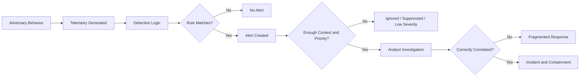
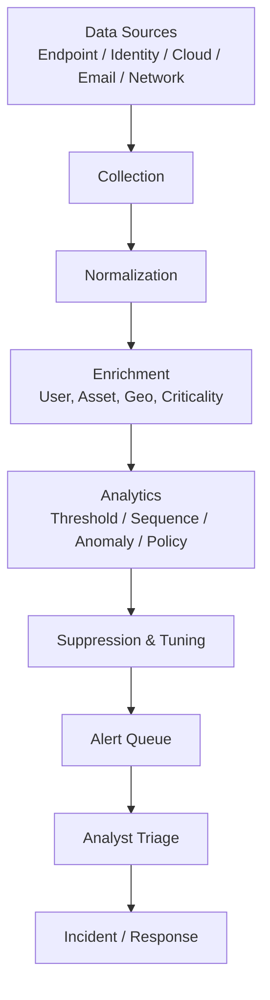
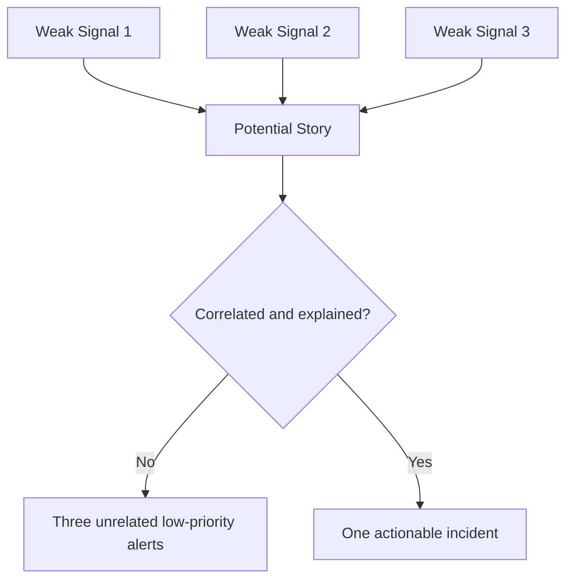
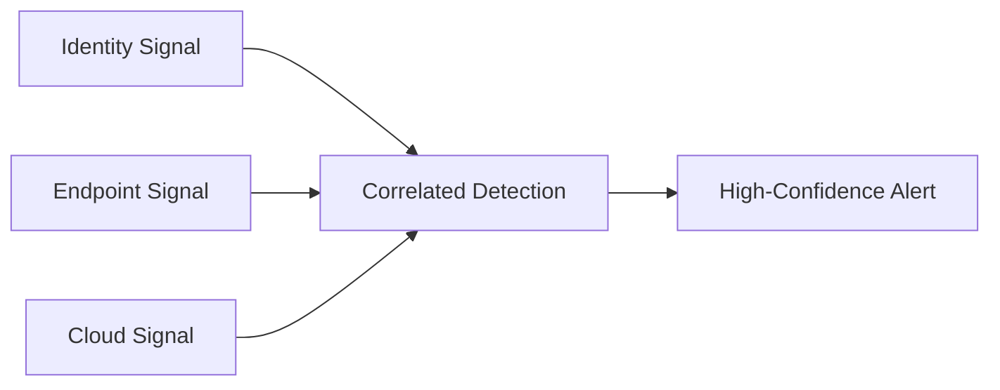
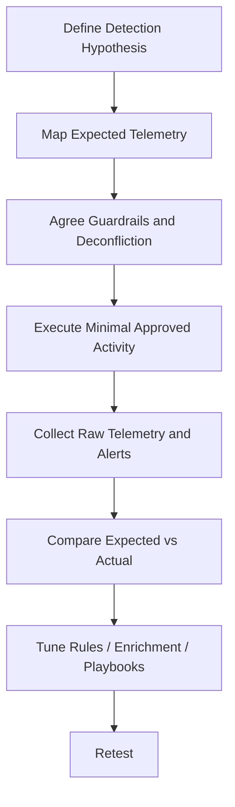

# Alert Evasion

> **Difficulty:** Beginner → Advanced | **Category:** Red Teaming | **Focus:** Validating whether real-world alert pipelines notice adversary behavior under authorized conditions

> **Authorized use only:** This note is for approved red teaming, purple teaming, adversary emulation, and detection engineering. It explains **why alerts fail** and **how to test coverage safely**. It does **not** provide step-by-step intrusion procedures or covert tradecraft instructions.

Alert evasion is often misunderstood. In mature environments, the question is rarely **"Was there any telemetry?"** and more often **"Did the telemetry become a useful alert quickly enough for defenders to act?"**

That distinction matters:

- **Telemetry can exist without an alert**
- **An alert can exist without enough context to escalate**
- **A detection can work in a lab but fail in a noisy enterprise**
- **A SOC can see weak signals but miss the attacker story**

In other words, alert evasion is usually about **breaking the defender's decision chain**, not magically becoming invisible.

---

## Table of Contents

1. [What Alert Evasion Actually Means](#1-what-alert-evasion-actually-means)
2. [How an Alert Gets Created](#2-how-an-alert-gets-created)
3. [Beginner Mental Models You Should Know](#3-beginner-mental-models-you-should-know)
4. [Why Alerts Fail in Real Environments](#4-why-alerts-fail-in-real-environments)
5. [Common Adversary-Emulation Themes](#5-common-adversary-emulation-themes)
6. [Advanced Correlation Blind Spots](#6-advanced-correlation-blind-spots)
7. [Safe Red Team Workflow for Testing Alert Gaps](#7-safe-red-team-workflow-for-testing-alert-gaps)
8. [Practical Validation Scenarios](#8-practical-validation-scenarios)
9. [Defender Improvements That Reduce Alert Evasion](#9-defender-improvements-that-reduce-alert-evasion)
10. [Quick Checklists](#10-quick-checklists)
11. [References](#11-references)

---

## 1. What Alert Evasion Actually Means

**Alert evasion** means an adversary achieves some objective **without triggering timely, actionable defender response**.

That can happen in several ways:

- the activity produces raw events, but no rule matches
- a rule matches, but the alert is suppressed or deprioritized
- several weak signals occur, but correlation never joins them
- the alert fires, but lacks enough host, user, or cloud context
- analysts see the event, but the queue is too noisy to respond quickly

### Telemetry vs Detection vs Alert vs Incident

| Term | Meaning | Why it matters |
|---|---|---|
| **Telemetry** | Raw logs, events, process data, identity events, network flows | Visibility starts here |
| **Detection** | Analytic logic that identifies suspicious conditions | Converts data into signal |
| **Alert** | Detection output presented to analysts | Must be actionable, not just technically correct |
| **Incident** | Multiple alerts/signals grouped into a response case | What defenders actually investigate |



> **Key idea:** A red team can be fully visible in the logs and still successfully "evade alerts" if the SOC never receives a high-confidence, actionable signal.

---

## 2. How an Alert Gets Created

Most defenders do not alert directly from raw events. There is usually a pipeline:



### Stages where things commonly break

| Stage | What can go wrong |
|---|---|
| **Collection** | Missing logs, agent blind spots, products not integrated |
| **Normalization** | Field parsing errors, inconsistent host/user naming |
| **Enrichment** | No asset criticality, no service-account tagging, weak identity linking |
| **Analytics** | Rule too narrow, threshold too high, lookback too short |
| **Suppression** | Broad allowlists, noisy rule exceptions, legacy exclusions |
| **Triage** | Queue fatigue, weak summaries, low analyst confidence |

### Common alert logic types

| Alert model | What it looks for | Strength | Common weakness |
|---|---|---|---|
| **Signature** | Known-bad pattern | Precise | Misses novel behavior |
| **Threshold** | "Too much" activity in a window | Simple | Low-and-slow activity slips through |
| **Anomaly** | Unusual compared to baseline | Good for unknowns | Baselines are hard in noisy environments |
| **Correlation** | Several related weak signals | High confidence | Breaks if data is fragmented |
| **Policy** | Activity that should never happen | Very high fidelity | Depends on accurate scoping and exceptions |

Microsoft's custom detection guidance explicitly warns teams to tune rules so they do not alert on normal day-to-day activity. That is necessary, but it also creates the exact pressure that adversaries exploit: **detections are often weakened to stay usable**.

---

## 3. Beginner Mental Models You Should Know

If you are new to this topic, learn these first.

### 3.1 Alert evasion is usually a **defender engineering** problem

A lot of "stealth" is not magical. It comes from one of these:

- the environment is too noisy
- the rule is tuned conservatively
- the signal exists in one tool but never reaches correlation
- the event is treated as normal because of trusted context

### 3.2 Precision and recall are always in tension

| Goal | What defenders want | Tradeoff |
|---|---|---|
| **High precision** | Few false positives | May miss real attacks |
| **High recall** | Catch more suspicious behavior | May flood analysts |

This tension explains why some dangerous behaviors remain lightly monitored: the fully sensitive rule was probably too noisy in production.

### 3.3 "Below the noise floor" matters more than "undetectable"

An action can be suspicious in theory but still disappear operationally if:

- it resembles normal admin behavior
- it is common in the environment
- it happens during change windows or maintenance periods
- it is spread across time or entities

### 3.4 Alerts are only as good as their context

The same event means very different things depending on:

- **who** performed it
- **where** it happened
- **what asset** was involved
- **when** it occurred
- **what happened before and after**

Without that context, defenders often cannot distinguish real adversary activity from legitimate operations.

---

## 4. Why Alerts Fail in Real Environments

### 4.1 Threshold assumptions are too simple

Many rules assume suspicious behavior is noisy, concentrated, or repetitive. Real adversaries often do not behave that way.

**Defensive lesson:** If a rule only detects burst behavior, it may miss slower campaigns entirely.

### 4.2 Trusted workflows create blind spots

SOC teams intentionally reduce noise from:

- approved admin tooling
- automation accounts
- software deployment systems
- cloud management actions
- backup, patching, and orchestration platforms

That is rational for operations, but it also creates high-value blind spots if suspicious activity appears inside those trusted paths.

### 4.3 Correlation depends on clean entity mapping

Correlation is difficult when:

- the same user appears under multiple naming formats
- hostnames differ across products
- cloud identities and endpoint identities are not linked
- process, authentication, and network data live in separate tools

If defenders cannot join the records reliably, multi-stage behavior becomes much harder to recognize.

### 4.4 Short lookback windows miss slow campaigns

Some products look back minutes or hours by default. Real adversaries may stretch behavior across days.

**Result:** Every individual event appears unremarkable, but the campaign is suspicious when viewed as a longer timeline.

### 4.5 Suppression rules age badly

Allowlists and suppressions often begin as practical exceptions:

- noisy scanners
- legacy systems
- known service accounts
- approved management infrastructure

Over time, these exceptions may outlive their justification and silently reduce coverage.

### 4.6 Analysts inherit the cost of poor detection design

Even when the tool raises an alert, analysts may struggle if the alert:

- has a vague title
- lacks surrounding evidence
- does not identify the impacted asset clearly
- omits previous related activity
- scores too low to reach the front of the queue



---

## 5. Common Adversary-Emulation Themes

This section stays at the **principle** level. The goal is to help red teams design safe tests and help defenders understand what they should measure.

### Theme 1: Tempo and distribution

Instead of assuming suspicious behavior appears as a burst, ask:

> Can our detections notice behavior when suspicious activity is spread over time, across identities, or across hosts?

**What defenders should test**

- longer aggregation windows
- cross-user and cross-host grouping
- risk scoring that accumulates weak signals

### Theme 2: Trusted-context abuse

Ask:

> Do our detections still work when suspicious activity occurs inside channels that are usually treated as administrative, automated, or approved?

**What defenders should test**

- service account visibility
- exceptions around management tools
- policy-based rules on sensitive assets even for trusted users

### Theme 3: Correlation disruption

Ask:

> If endpoint, identity, and cloud signals appear in different tools, can defenders still connect them into one story?

**What defenders should test**

- entity resolution quality
- shared identifiers
- timeline building across products

### Theme 4: Delayed or staged activity

Ask:

> Does the SOC rely on short time windows that miss suspicious sequences spread across hours or days?

**What defenders should test**

- delayed follow-on activity
- long-window analytics
- hunt content for weak-signal sequences

### Theme 5: Exception-path reliance

Ask:

> Have our operational exceptions become security blind spots?

**What defenders should test**

- stale allowlists
- legacy exclusions
- detections for activity on crown-jewel systems even when exceptions exist

### Theme 6: Analyst overload

Ask:

> If the rule fires, will the analyst actually recognize it as important in a busy queue?

**What defenders should test**

- alert titles and summaries
- evidence packaging
- triage playbooks
- incident grouping quality

### Theme Summary

| Theme | What the red team is validating | Typical defender weakness |
|---|---|---|
| **Tempo** | Can slow or distributed behavior still be detected? | Thresholds too burst-focused |
| **Trusted context** | Do alerts survive admin/tooling exceptions? | Over-broad allowlists |
| **Correlation** | Can weak signals be joined into one story? | Fragmented data sources |
| **Delayed staging** | Can long campaigns be seen as one chain? | Lookback windows too short |
| **Exceptions** | Are legacy suppressions hiding risk? | Untested exclusions |
| **Triage** | Would analysts escalate quickly? | Alert fatigue and weak context |

---

## 6. Advanced Correlation Blind Spots

At advanced maturity levels, the problem is rarely "we have no logs." It is usually one of the following:

### 6.1 Detection dependency chains

A high-confidence alert may depend on multiple lower-level detections. If any dependency fails, the final alert never appears.

Example dependency map:



If one data source is delayed, missing, misparsed, or suppressed, the full analytic can collapse.

### 6.2 Entity resolution failures

Advanced detection depends on answering:

- Is this cloud user the same person as this endpoint user?
- Is this hostname the same asset as this EDR device ID?
- Is this service principal tied to a known automation workflow?

When those answers are unclear, the defender loses narrative continuity.

### 6.3 Risk dilution

Many suspicious actions are not individually severe. They become meaningful only when grouped.

If a platform treats each event independently, the campaign may never exceed alert thresholds even though the full picture is dangerous.

### 6.4 Coverage asymmetry

Organizations often have uneven maturity:

- strong endpoint telemetry
- weaker SaaS visibility
- decent identity logs
- poor east-west network context
- good detection content for workstations, weaker coverage for servers or cloud control plane activity

Adversaries do not need every control to fail. They only need to operate where the coverage is weakest.

### 6.5 Alert pipeline latency

Even good detections can be operationally weak if:

- enrichment arrives late
- alerts are batched
- severity is reassigned after delay
- triage ownership is unclear

For red teams, this means a behavior can be "detected" on paper but still succeed before response begins.

---

## 7. Safe Red Team Workflow for Testing Alert Gaps

Red teams should not treat this as a game of "how sneaky can we be?" The correct model is **control validation with guardrails**.



### 7.1 Start with a hypothesis

Good examples:

- "The SOC should detect suspicious identity activity even when each event is low volume."
- "Administrative exceptions should not suppress alerts on crown-jewel assets."
- "Cloud and endpoint signals should correlate into one incident within the response SLA."

### 7.2 Define expected evidence before the test

Document:

- expected raw logs
- expected detections
- expected alert severity
- expected incident grouping
- expected analyst action time

This prevents hindsight bias after the exercise.

### 7.3 Use minimum necessary activity

The goal is to validate coverage, not maximize impact.

That means:

- minimal scope
- explicit safety controls
- clear abort conditions
- no destructive behavior unless separately approved

### 7.4 Measure both **visibility** and **response usefulness**

A mature after-action review asks:

- Did the raw telemetry exist?
- Was it searchable?
- Did a detection fire?
- Was the alert understandable?
- Did it correlate with related signals?
- Did the analyst respond in time?

---

## 8. Practical Validation Scenarios

These are safe **testing scenarios**, not attack recipes.

### Scenario 1: Low-and-slow authentication risk

**Question:** Can defenders detect suspicious identity behavior when no single event exceeds the classic brute-force threshold?

| Validate | What success looks like |
|---|---|
| Identity telemetry | Relevant sign-in/authentication events are present and searchable |
| Long-window detection | Weak signals accumulate over longer periods |
| Entity context | User, device, location, and asset risk are linked |
| Triage | Analysts can explain why the pattern matters |

### Scenario 2: Trusted administrative path

**Question:** Do security controls still produce useful alerts when suspicious activity appears inside approved tooling or administrative workflows?

| Validate | What success looks like |
|---|---|
| Exception management | Admin exceptions are narrow and documented |
| Sensitive asset handling | Crown-jewel systems still raise attention |
| Analyst context | Alerts identify the administrative context clearly |
| Investigation quality | Analysts can separate normal maintenance from suspicious usage |

### Scenario 3: Cross-domain correlation

**Question:** Can identity, endpoint, and cloud events be connected into one coherent incident?

| Validate | What success looks like |
|---|---|
| Shared identifiers | User and asset mapping works across products |
| Timeline building | Events appear in correct sequence |
| Correlation | Related weak signals produce one stronger incident |
| Response | Ownership is clear across teams |

### Scenario 4: Exception-path review

**Question:** Have suppressions, allowlists, or legacy exclusions become blind spots?

| Validate | What success looks like |
|---|---|
| Exception inventory | Teams know what is suppressed and why |
| Review cadence | Old suppressions are revisited regularly |
| High-risk overrides | Exceptions do not hide suspicious activity on critical assets |
| Documentation | Risk acceptance is explicit, not accidental |

### Scenario 5: Alert quality under load

**Question:** If several weak alerts are generated during a busy period, will analysts still escalate correctly?

| Validate | What success looks like |
|---|---|
| Alert summaries | Clear description of behavior and scope |
| Severity logic | Important alerts are not buried |
| Grouping | Related alerts are bundled usefully |
| Runbooks | Triage guidance is specific and realistic |

---

## 9. Defender Improvements That Reduce Alert Evasion

### 9.1 Treat alert evasion as a systems problem

Do not focus only on the detection rule. Improve the full chain:

- telemetry completeness
- field normalization
- enrichment quality
- correlation logic
- exception governance
- analyst usability

### 9.2 Add context to thresholds

Thresholds become far stronger when combined with:

- asset criticality
- identity risk
- unusual geography
- privileged access state
- known administrative windows

### 9.3 Review suppressions like code

Every suppression should have:

- an owner
- a reason
- a time limit or review date
- a documented risk tradeoff

### 9.4 Detect sequences, not just events

Single events are often ambiguous. Sequences are more meaningful.

Examples of stronger analytic thinking:

- unusual identity event **plus** sensitive asset access
- admin action **plus** atypical source system
- endpoint anomaly **plus** cloud role change

### 9.5 Measure the right outcomes

Useful metrics include:

- **Coverage:** which ATT&CK behaviors are seen at all?
- **Alertability:** which visible behaviors become alerts?
- **Actionability:** which alerts contain enough context for responders?
- **MTTD:** how quickly is the behavior recognized?
- **Retest success:** did tuning actually fix the gap?

### 9.6 Purple team repeatedly

One successful test does not prove durable coverage. Environments change:

- new SaaS platforms
- new service accounts
- new suppressions
- new business processes
- new detection content

Repeated purple-team validation is what keeps alert logic honest.

---

## 10. Quick Checklists

### Red Team / Purple Team Checklist

- Is the exercise explicitly authorized and scoped?
- Is there a clear detection hypothesis?
- Are expected logs and alerts defined before execution?
- Are guardrails, abort criteria, and deconfliction documented?
- Are you validating defender outcomes rather than chasing stealth for its own sake?
- Did you record both telemetry presence and alert quality?

### Defender Checklist

- Do we know which behaviors produce telemetry but no alert?
- Do our allowlists have owners and review dates?
- Can we correlate identity, endpoint, cloud, and network data reliably?
- Do our detections use long enough time windows?
- Do alerts contain the context analysts need?
- Have we retested after every major tuning or platform change?

### Fast Memory Aid

```text
Telemetry ≠ Detection ≠ Alert ≠ Incident
```

If a red team succeeds quietly, ask where the chain broke:

```text
Collection → Enrichment → Analytics → Suppression → Triage → Response
```

---

## 11. References

- [MITRE ATT&CK – Defense Evasion (TA0005)](https://attack.mitre.org/tactics/TA0005/)
- [MITRE Engenuity ATT&CK Evaluations](https://attackevals.mitre-engenuity.org/)
- [Microsoft Defender XDR – Custom detection rules](https://learn.microsoft.com/en-us/defender-xdr/custom-detection-rules)

