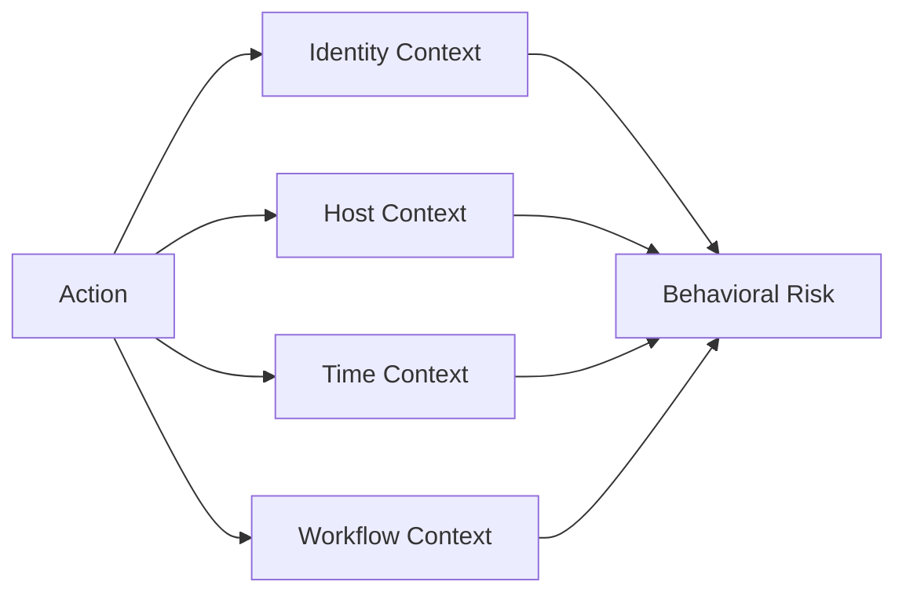
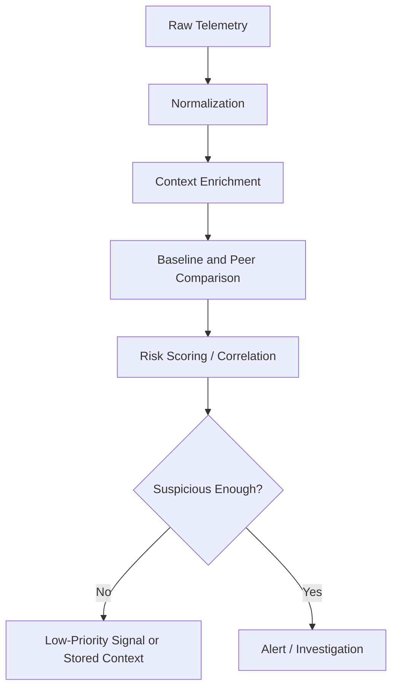
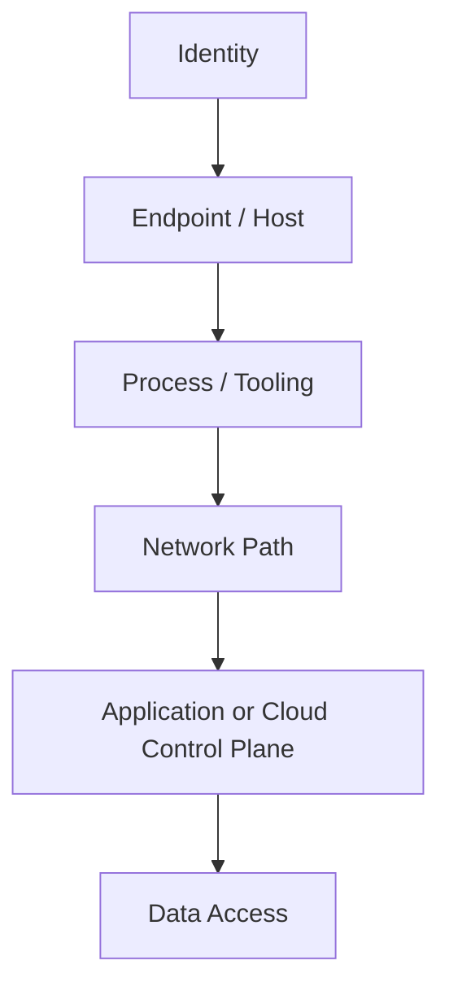
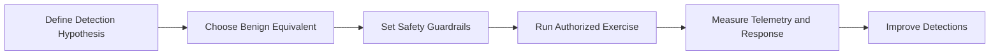
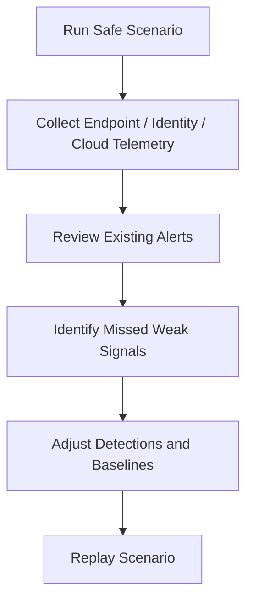
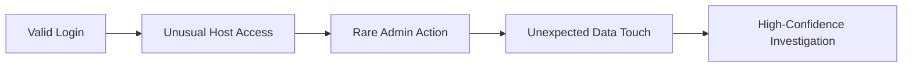

# Behavioral Evasion

> **Difficulty:** Beginner → Advanced | **Category:** Red Teaming | **Focus:** Testing whether malicious objectives can hide inside normal-looking identity, host, and workflow patterns

> **Authorized-use note:** This note is for sanctioned adversary emulation, purple teaming, and detection engineering. It explains how behavior-based detection works, why realistic campaigns sometimes blend into routine activity, and how defenders can improve. It intentionally avoids unauthorized intrusion guidance, malware instructions, or procedural bypass steps.

---

## Table of Contents

1. [What Behavioral Evasion Is](#1-what-behavioral-evasion-is)
2. [Why Behavior-Based Detection Matters](#2-why-behavior-based-detection-matters)
3. [How Behavioral Detection Actually Works](#3-how-behavioral-detection-actually-works)
4. [The Main Baselines Adversaries Try to Blend Into](#4-the-main-baselines-adversaries-try-to-blend-into)
5. [Common Behavioral Evasion Patterns](#5-common-behavioral-evasion-patterns)
6. [Where This Appears in MITRE ATT&CK Thinking](#6-where-this-appears-in-mitre-attck-thinking)
7. [Practical Adversary-Emulation Planning](#7-practical-adversary-emulation-planning)
8. [Safe Exercise Ideas for Red and Purple Teams](#8-safe-exercise-ideas-for-red-and-purple-teams)
9. [What Still Gives a Campaign Away](#9-what-still-gives-a-campaign-away)
10. [Defender Countermeasures](#10-defender-countermeasures)
11. [Behavioral Detection Maturity Model](#11-behavioral-detection-maturity-model)
12. [Key Takeaways](#12-key-takeaways)
13. [References](#13-references)

---

## 1. What Behavioral Evasion Is

Behavioral evasion is the attempt to make suspicious activity look **routine enough** that defenders, analytics, or response workflows do not immediately treat it as malicious.

This is different from:

- **signature evasion** — changing files, payloads, or indicators so they do not match known-bad patterns
- **monitoring bypass** — operating where telemetry is weak or missing
- **alert evasion** — avoiding the specific logic that turns telemetry into an alert

Behavioral evasion is mostly about **context**:

- who performed the action
- from which device, host, network, or region
- at what time and frequency
- against which systems or data
- through which tool or workflow
- whether the action fits the user’s normal role

### Simple mental model

> A behavior can look harmless in isolation while still being dangerous in context.



A red team studies whether defensive systems can tell the difference between:

- **normal administration** and **adversary use of trusted access**
- **approved automation** and **abusive automation**
- **routine business activity** and **stealthy campaign progression**

---

## 2. Why Behavior-Based Detection Matters

Modern environments are full of legitimate tools, remote access paths, cloud APIs, helpdesk workflows, and privileged automation. Because of that, defenders cannot rely only on malware signatures or simple blocklists.

Behavior-based detection exists to answer questions such as:

- Is this action rare for this user or peer group?
- Is this host interacting with systems it normally never touches?
- Is the volume, timing, or sequence unusual?
- Does a legitimate credential appear to be used in an illegitimate way?
- Does a trusted tool appear in the wrong business context?

### Why this matters in red teaming

A realistic adversary-emulation exercise is not just about proving that access is possible. It is also about testing whether defenders can identify **malicious intent disguised as routine work**.

That makes behavioral evasion a valuable learning topic for:

- red teams
- purple teams
- detection engineers
- SOC analysts
- threat hunters

---

## 3. How Behavioral Detection Actually Works

Behavior-based detections usually combine several models rather than relying on one rule.

| Detection model | What it looks for | Strength | Weakness |
|---|---|---|---|
| signature | exact known-bad pattern | high confidence | misses new or modified behavior |
| threshold | too much activity in a period | simple and fast | easy to tune too loosely or too tightly |
| anomaly | deviation from baseline | catches novel behavior | can be noisy without good baselines |
| peer-group | difference from similar users/hosts | good for role-aware detection | depends on accurate grouping |
| sequence/correlation | suspicious chain of events | strong campaign visibility | requires good telemetry stitching |
| graph/risk scoring | suspicious relationships across entities | catches subtle campaigns | harder to engineer and explain |

### Common processing flow



### What gets enriched before scoring

Behavioral detections become much better when telemetry is enriched with:

- identity role and privilege level
- device ownership and sensitivity
- asset criticality
- geolocation or source network trust
- change window or maintenance window context
- ticketing or approval metadata
- peer-group information

### Why single events often fail

A single event may look normal:

- a valid login
- a trusted admin tool
- an approved automation account
- a normal SaaS API call

But a **sequence** may not look normal:

```text
Valid login → unusual host access → rare admin action → data touch pattern → external follow-on behavior
```

That is why mature defenders correlate weak signals over time instead of treating each event alone.

---

## 4. The Main Baselines Adversaries Try to Blend Into

Behavioral evasion works best when defenders have weak or overly broad ideas of “normal.” In practice, there are multiple baselines.

### Core baseline types

| Baseline type | Normality is defined by | Example questions defenders ask |
|---|---|---|
| user baseline | the person’s usual hours, devices, apps, and targets | Does this user normally access this system? |
| peer baseline | similar users in the same role or team | Do finance users normally perform this admin action? |
| host baseline | the endpoint or server’s expected behavior | Does this server usually talk to this service? |
| application baseline | normal application or SaaS workflows | Is this API usage common for this tenant? |
| admin baseline | expected maintenance and automation behavior | Is this typical for a helpdesk or infra account? |
| data baseline | normal file, table, or object access patterns | Is this amount or timing of data access expected? |
| network baseline | common paths, protocols, and flow sizes | Is this east-west traffic pattern common? |

### Layered view of behavior



A campaign may appear normal at one layer and abnormal at another.

### Example

A privileged account using an approved tool may look normal at the **tooling** layer, but if that account normally never touches a specific crown-jewel system, the **identity-to-asset relationship** is still suspicious.

---

## 5. Common Behavioral Evasion Patterns

This section focuses on **principles**, not procedural bypass steps.

### Pattern 1: Role congruence

Activity is less suspicious when it matches what the identity is expected to do.

- a systems admin touching infrastructure is less surprising than a marketing user doing it
- a service account invoking management APIs may look routine
- a helpdesk workflow may create noise that hides rare but risky actions

**Defender lesson:** high privilege must never equal high trust.

### Pattern 2: Time congruence

Actions performed during common business or maintenance windows may receive less scrutiny than the same actions at unusual times.

**Defender lesson:** expected time windows should reduce false positives, not eliminate review.

### Pattern 3: Device and source congruence

The same action looks very different depending on whether it comes from:

- a managed workstation
- an admin jump host
- a new device
- a remote network never associated with the user

**Defender lesson:** device trust and user trust should be scored separately.

### Pattern 4: Workflow congruence

Adversary behavior can hide inside workflows defenders already expect:

- software deployment
- infrastructure maintenance
- cloud administration
- remote support
- backup and data management

**Defender lesson:** workflows need guardrails, approvals, and context-aware detections.

### Pattern 5: Low-and-slow distribution

Some detections fire only when activity is too fast, too large, or too concentrated. Spreading activity across time, hosts, or identities may keep each individual event below review thresholds.

**Defender lesson:** long-horizon correlation matters.

### Pattern 6: Peer-group camouflage

A behavior may be rare globally but common inside one privileged peer group. That can make dangerous activity blend into a very noisy admin population.

**Defender lesson:** watch for anomalies *within* privileged peer groups, not only outside them.

### Pattern 7: Trusted-path abuse

Behavior is harder to separate when it arrives through paths already considered legitimate, such as:

- remote management channels
- approved admin tools
- signed binaries
- sanctioned APIs
- enterprise automation frameworks

**Defender lesson:** approved path does not mean approved purpose.

### Pattern 8: Exception and allowlist abuse

Emergency access, legacy exceptions, test tenants, and operational allowlists often create space where detections are weaker.

**Defender lesson:** every exception is a detection design problem.

### Pattern comparison table

| Pattern | What makes it blend in | Why defenders miss it | Better defensive question |
|---|---|---|---|
| role congruence | the identity “looks allowed” | privilege is mistaken for legitimacy | Should this identity do this **here and now**? |
| time congruence | the action happens during routine hours | analyst fatigue during busy windows | Is the timing consistent with a ticket or change record? |
| device congruence | the device is managed or familiar | device trust overweights risk decisions | Is the device usual for this user and this action? |
| workflow congruence | the action resembles admin work | business process creates cover | Does the full sequence match the approved workflow? |
| low-and-slow | each event stays weak-signal | short windows miss the pattern | What does the week-long pattern show? |
| allowlist abuse | the path is intentionally quiet | exceptions become permanent blind spots | Who reviews exceptions and how often? |

---

## 6. Where This Appears in MITRE ATT&CK Thinking

Behavioral evasion is not a single ATT&CK technique. It appears across multiple technique families where adversaries inherit **trust, familiarity, or expected context**.

| ATT&CK reference | Why it matters behaviorally |
|---|---|
| [Defense Evasion (TA0005)](https://attack.mitre.org/tactics/TA0005/) | shows that evasion is broader than hiding files; it includes avoiding scrutiny altogether |
| [Valid Accounts (T1078)](https://attack.mitre.org/techniques/T1078/) | trusted credentials reduce immediate suspicion when detections rely on obvious compromise artifacts |
| [Masquerading (T1036)](https://attack.mitre.org/techniques/T1036/) | familiar names, icons, or identities make activity look routine to users and analysts |
| [Signed Binary Proxy Execution (T1218)](https://attack.mitre.org/techniques/T1218/) | approved binaries or trusted tooling can make malicious intent look like normal administration |

### Important point

Studying these ATT&CK entries does **not** mean copying tradecraft. In an authorized red-team context, they help defenders ask:

- which trusted identities are over-trusted?
- which approved tools are under-monitored?
- which naming or workflow cues mislead analysts?
- which detections rely too heavily on “known bad” instead of suspicious combinations?

---

## 7. Practical Adversary-Emulation Planning

A safe behavioral-evasion exercise should test **detection quality**, not maximize operational damage.

### Recommended planning sequence



### Step 1: Start with a detection hypothesis

Examples:

- Can the SOC distinguish approved admin activity from adversary use of trusted access?
- Can analytics detect rare identity-to-asset relationships even when the login itself is valid?
- Can the team spot unusual data access performed through normal tools?

### Step 2: Use benign equivalents

Instead of performing harmful actions, use pre-approved, low-risk activities that exercise similar telemetry paths.

Examples of safe substitutes include:

- read-only access instead of destructive changes
- test accounts instead of production identities
- lab assets or scoped pilot systems instead of crown-jewel systems
- harmless file or object access patterns instead of sensitive data movement

### Step 3: Define safety guardrails

Guardrails should include:

- written authorization
- scoped accounts, hosts, tenants, and time windows
- prohibited actions list
- clear stop conditions
- deconfliction contacts
- telemetry retention requirements

### Step 4: Decide how success will be measured

A useful exercise measures more than “did the action work?”

| Metric | Example |
|---|---|
| visibility | Were the relevant logs collected and searchable? |
| detection | Did a rule, model, or hunt identify the pattern? |
| fidelity | Was the alert high-confidence or ignored as noise? |
| triage speed | How long until analyst review began? |
| context quality | Did the alert explain *why* the behavior mattered? |
| containment readiness | Did responders know what to do next? |

### Practical design checklist

| Question | Why it matters |
|---|---|
| Is the identity realistic for the scenario? | unrealistic identities create unrealistic detections |
| Is the target asset appropriate for that identity? | identity-to-asset mismatch is often the real signal |
| Is the activity timed realistically? | timing heavily changes suspicion |
| Is there a change ticket or business context? | defenders need to distinguish approved from abusive use |
| Are peer groups defined correctly? | weak peer groups make anomaly detection weaker |
| Are we using a benign equivalent? | keeps the exercise safe and measurable |

---

## 8. Safe Exercise Ideas for Red and Purple Teams

These are **authorized, benign, detection-focused** exercise designs.

### Exercise catalog

| Exercise idea | Safe version | What defenders should learn |
|---|---|---|
| privileged identity realism | use a pre-approved admin or break-glass test account in a controlled window to perform benign admin-like actions | whether the SOC over-trusts privileged identities |
| trusted-tool visibility | execute a harmless, approved management action with enterprise tooling in a lab or test OU | whether trusted tools are monitored by context, not just by name |
| low-and-slow correlation | spread a benign sequence across a longer window using test accounts and non-sensitive targets | whether weak signals are correlated over time |
| cloud control-plane review | perform read-only API or configuration queries in a test tenant | whether cloud admin workflows have behavioral coverage |
| data-access pattern testing | simulate unusual but harmless access to non-sensitive sample data | whether data analytics detect rare access relationships |

### Example defender questions to attach to each exercise

- Did the activity appear in all expected telemetry sources?
- Did the account, device, and asset relationship raise risk?
- Did the analyst have enough context to recognize abnormal intent?
- Was the event dismissed because it used a trusted workflow?
- Would the same pattern be caught on a critical asset?

### Purple-team review loop



This loop is the main value of studying behavioral evasion: it improves detection engineering without requiring risky tradecraft.

---

## 9. What Still Gives a Campaign Away

Even when individual actions look normal, campaigns often reveal themselves through **combinations** that do not fit together.

### Common giveaways

- a valid user accessing an asset they never use
- a trusted device used for an unusual privilege level or workflow
- a maintenance action with no related ticket or approval trail
- behavior that is normal for *somebody*, but not for this user or peer group
- a series of weak events that form a strong story when correlated
- rare actions against crown-jewel systems
- unusual access relationships across identity, endpoint, cloud, and data layers

### Why correlation beats isolated logic



Each step may look survivable alone. Together they become suspicious.

### Advanced defender insight

The hardest behaviors to spot are not always the loudest ones. They are often the ones that look **plausible** until cross-domain context is added.

---

## 10. Defender Countermeasures

The goal is not to flag every rare event. It is to identify **risky combinations in important contexts**.

### High-value countermeasures

1. **Build peer-group baselines**
   - compare users to similar users, not only to the whole company
   - compare servers to similar servers, not only to all hosts

2. **Separate identity trust from device trust**
   - a known user on a known device may still perform risky actions

3. **Score identity-to-asset relationships**
   - rare relationships matter, especially around privileged or sensitive systems

4. **Correlate over longer windows**
   - behavioral evasion often defeats short threshold windows, not week-long or campaign-level analysis

5. **Enrich with business context**
   - change tickets, maintenance windows, and approvals reduce false positives only when they are actually tied to the observed event

6. **Treat emergency and service accounts as special cases**
   - “break-glass” and automation accounts should get more scrutiny, not less

7. **Prioritize crown-jewel context**
   - even low-confidence anomalies deserve attention on domain controllers, identity providers, CI/CD systems, backup systems, and sensitive SaaS tenants

8. **Continuously validate detections**
   - use red-team and purple-team exercises to test whether trusted workflows are over-trusted

### Practical detection ideas

| Detection idea | Why it helps |
|---|---|
| rare identity-to-asset access | catches valid accounts used outside normal relationships |
| privileged action without expected preceding context | catches workflow abuse |
| trusted tool used by unusual peer group | catches approved-tool misuse |
| maintenance-window activity without a matching ticket | catches false trust in time-based logic |
| weak-signal sequence on sensitive assets | catches low-and-slow campaigns |
| sudden silence from critical telemetry sources | catches attempts to reduce or break visibility |

---

## 11. Behavioral Detection Maturity Model

| Maturity level | Characteristics | Main weakness |
|---|---|---|
| basic | collects logs and writes isolated rules | treats events individually |
| developing | uses thresholds and some anomaly rules | weak peer grouping and poor context |
| mature | correlates identity, endpoint, network, cloud, and data signals | can still over-trust approved workflows |
| advanced | uses risk scoring, peer baselines, asset criticality, and long-window analytics | requires constant tuning and validation |

### What separates mature from advanced teams

Advanced teams ask:

- What is normal **for this role**?
- What is normal **for this asset**?
- What is normal **for this workflow**?
- What combination of small deviations becomes high risk?

That is the point where behavioral evasion becomes much harder.

---

## 12. Key Takeaways

- Behavioral evasion is about blending into **expected context**, not just hiding code or disabling tools.
- Valid accounts, trusted tools, and routine workflows can all reduce suspicion if detections are shallow.
- The best red-team use of this topic is to design **safe, benign, measurable** exercises that test whether defenders can spot abuse of trusted paths.
- The best defensive response is **role-aware baselining, cross-domain correlation, and continuous validation**.
- “Looks normal” should never be the same as “is safe.”

---

## 13. References

- [MITRE ATT&CK – Defense Evasion (TA0005)](https://attack.mitre.org/tactics/TA0005/)
- [MITRE ATT&CK – Valid Accounts (T1078)](https://attack.mitre.org/techniques/T1078/)
- [MITRE ATT&CK – Masquerading (T1036)](https://attack.mitre.org/techniques/T1036/)
- [MITRE ATT&CK – Signed Binary Proxy Execution (T1218)](https://attack.mitre.org/techniques/T1218/)
- [NIST SP 800-137 – Information Security Continuous Monitoring](https://csrc.nist.gov/publications/detail/sp/800-137/final)
- [NIST SP 800-61 Rev. 2 – Computer Security Incident Handling Guide](https://nvlpubs.nist.gov/nistpubs/SpecialPublications/NIST.SP.800-61r2.pdf)
