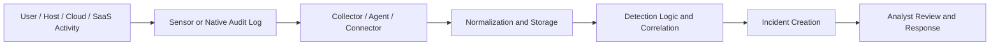
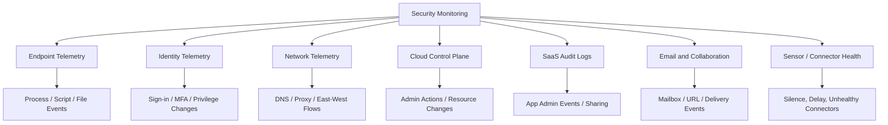
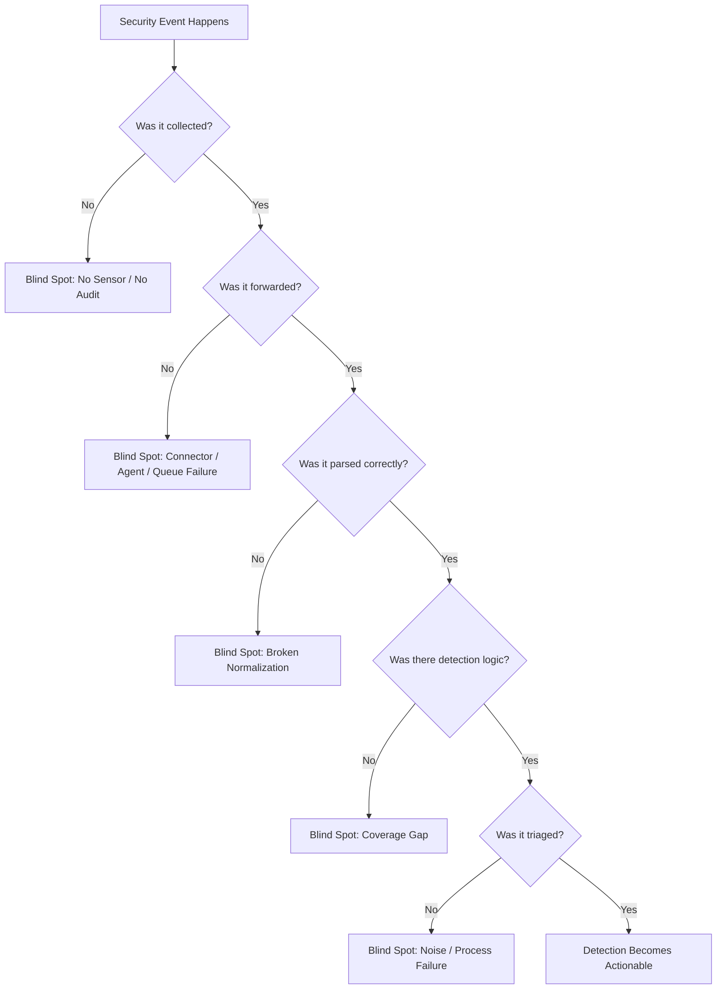
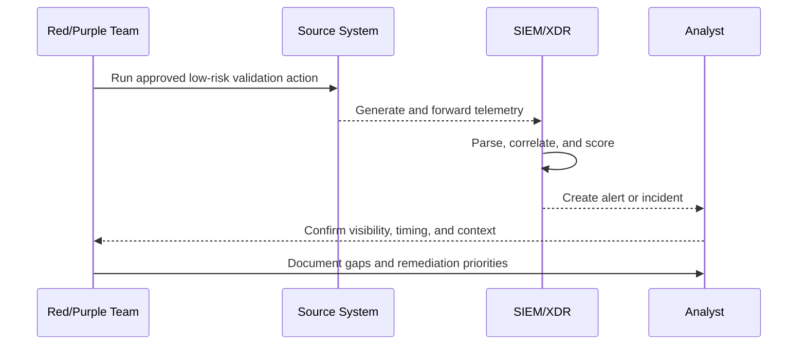
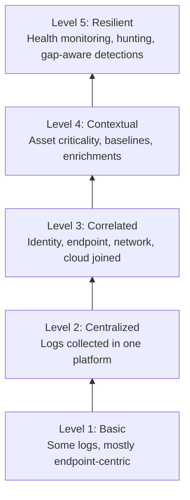

# Security Monitoring Bypass

> **Difficulty:** Beginner → Advanced | **Category:** Red Teaming | **Focus:** Understanding how adversary activity slips past monitoring pipelines during **authorized** adversary-emulation exercises

> **Authorised-use only:** This note is for sanctioned red-team, purple-team, and defensive validation work. It explains **how monitoring gaps happen, how to assess them safely, and how defenders can close them**. It does **not** provide destructive or step-by-step intrusion instructions for disabling tools, tampering with logs, or bypassing controls on real targets.

---

## Table of Contents

1. [Why This Topic Matters](#1-why-this-topic-matters)
2. [What “Security Monitoring Bypass” Really Means](#2-what-security-monitoring-bypass-really-means)
3. [How Modern Monitoring Pipelines Work](#3-how-modern-monitoring-pipelines-work)
4. [Where Monitoring Pipelines Commonly Break](#4-where-monitoring-pipelines-commonly-break)
5. [Common Blind Spots by Telemetry Domain](#5-common-blind-spots-by-telemetry-domain)
6. [Adversary-Emulation Mindset](#6-adversary-emulation-mindset)
7. [Practical, Safe Assessment Workflow](#7-practical-safe-assessment-workflow)
8. [Scenario Walkthroughs](#8-scenario-walkthroughs)
9. [Detection Engineering Patterns That Reduce Bypass Risk](#9-detection-engineering-patterns-that-reduce-bypass-risk)
10. [Metrics and Maturity Model](#10-metrics-and-maturity-model)
11. [Defender Hardening Checklist](#11-defender-hardening-checklist)
12. [Key Takeaways](#12-key-takeaways)
13. [References](#13-references)

---

## 1. Why This Topic Matters

In real environments, defenders rarely fail because they have **zero** tools. They fail because visibility is:

- missing on some systems
- delayed in transport
- badly parsed in the SIEM
- poorly correlated across domains
- deprioritized as noise
- ignored because the SOC is overloaded

That is why **security monitoring bypass** is often less about “beating” a tool and more about **operating where coverage is thin, fragmented, or not actionable**.

For red teams, this topic matters because it helps answer questions like:

- Which actions create alerts immediately?
- Which actions are logged but never reviewed?
- Which platforms have weak or inconsistent telemetry?
- Which detection rules depend on one fragile signal?
- Which high-value systems become invisible when one connector fails?

For defenders, this topic matters because bypass analysis is one of the fastest ways to find:

- logging coverage gaps
- unhealthy sensors and collectors
- weak detection logic
- broken enrichment pipelines
- alert fatigue and triage failures

---

## 2. What “Security Monitoring Bypass” Really Means

Security monitoring bypass means achieving an adversary objective **without generating strong, actionable defender visibility**.

That can happen in several ways:

| Type | What it means | Example outcome |
|---|---|---|
| **Absence** | The activity is not collected at all | The event never reaches defenders |
| **Delay** | The data arrives too late | The alert appears after the operator has already moved on |
| **Parsing failure** | Telemetry exists but is malformed or dropped | Important fields are missing, so the rule never fires |
| **Correlation failure** | Related signals are never linked together | Multiple weak events never become one high-confidence incident |
| **Noise masking** | The activity blends into routine admin or user behavior | Analysts ignore it as normal |
| **Response failure** | An alert exists, but nobody acts on it quickly enough | Detection happened, but protection still failed |

### 2.1 What bypass is **not**

In mature adversary emulation, monitoring bypass is **not automatically**:

- smashing logs
- turning off agents
- deleting evidence
- breaking collectors
- performing risky anti-forensics on production assets

Those actions are often:

- highly visible
- operationally risky
- outside rules of engagement
- more useful for defenders to detect than for operators to perform

A professional engagement usually gets more value from proving that activity can pass through **existing blind spots** than from destructively interfering with security tooling.

### 2.2 Beginner mental model

Think of it like this:

```text
No camera installed     -> no visibility
Camera installed badly  -> poor visibility
Camera footage delayed  -> late visibility
Camera footage ignored  -> ineffective visibility
```

The operator succeeds whenever defender visibility is **missing, weak, late, or not actionable**.

---

## 3. How Modern Monitoring Pipelines Work

Most enterprises do not “monitor” with one product. They monitor through a **pipeline** of sensors, connectors, storage, analytics, enrichment, and human response.



A red team does not need every stage to fail. **One weak stage can be enough.**

### 3.1 The six major pipeline stages

| Stage | Purpose | Typical failure mode |
|---|---|---|
| **Collection** | Capture raw activity | Logging disabled, incomplete, or unsupported |
| **Transport** | Move data to a central platform | Connector unhealthy, backlog, dropped events |
| **Normalization** | Parse and map fields | Source data ingested, but important fields lost |
| **Detection** | Match suspicious behavior | Rule too narrow, too noisy, or missing |
| **Correlation** | Join multiple low-signal events | Identity, endpoint, cloud, and SaaS data stay siloed |
| **Response** | Investigate and contain | Alert triaged late, auto-closed, or ignored |

### 3.2 Visibility is multi-domain, not just endpoint



A team that only monitors endpoints can still miss the bigger story if the important action happened in:

- an identity provider
- a cloud control plane
- a SaaS admin console
- an email or collaboration system
- a connector health dashboard

### 3.3 Advanced concept: **negative space detection**

Mature defenders do not only alert on suspicious events. They also alert on **missing expected telemetry**.

Examples:

- a privileged host stops sending data
- a cloud connector goes unhealthy
- a domain controller suddenly becomes quiet
- a high-value endpoint has a long gap in process events

This matters because sometimes the strongest signal is not a bad event. It is the **absence** of expected events.

---

## 4. Where Monitoring Pipelines Commonly Break

The easiest way to understand monitoring bypass is to study where pipelines routinely fail.



### 4.1 Common root causes

| Root cause | Why it happens in real environments |
|---|---|
| **Partial deployment** | Some servers, laptops, cloud accounts, or subsidiaries were never onboarded |
| **Operational exceptions** | Teams create allowlists, exclusions, or reduced logging to keep systems stable |
| **Connector fragility** | APIs rate-limit, credentials expire, collectors backlog, parsers drift |
| **Product silos** | Identity, endpoint, network, and cloud teams work in separate consoles |
| **Detection debt** | Rules lag behind new admin tools, SaaS apps, or cloud workflows |
| **Analyst overload** | High alert volume pushes low-confidence but important activity out of focus |
| **Business-normal behavior** | Privileged actions look routine because they are performed by trusted accounts |

### 4.2 Why “logged” does not mean “detected”

A beginner mistake is assuming:

```text
If it is in a log, defenders will see it.
```

That is rarely true.

For detection to become useful, the event usually must be:

1. collected
2. forwarded
3. parsed correctly
4. enriched with context
5. correlated with other signals
6. prioritized above noise
7. reviewed fast enough to matter

A lot can go wrong before that chain becomes an incident.

---

## 5. Common Blind Spots by Telemetry Domain

Different environments have different weak points. The table below gives a practical starting map.

| Telemetry domain | Common blind spot | Why it matters |
|---|---|---|
| **Endpoint** | Unmanaged servers, developer systems, Linux/macOS coverage gaps | High-value actions may never reach the SOC |
| **Identity** | Service accounts, break-glass accounts, federated auth, legacy protocols | Powerful account activity can look routine |
| **Network** | East-west traffic, internal DNS, encrypted flows without metadata context | Lateral activity can stay invisible inside the environment |
| **Cloud** | Audit logs not centralized, short retention, account coverage gaps | Control-plane abuse may not correlate to endpoint activity |
| **SaaS** | Admin events not ingested, sharing logs ignored, app connector drift | Sensitive actions happen outside traditional perimeter tools |
| **Email / Collaboration** | Mailbox rules, suspicious sharing, delegated access not correlated | Business workflows hide attacker behavior |
| **Health telemetry** | Sensor silence, delayed ingestion, unhealthy connectors not monitored | Defenders miss the fact that they are blind |

### 5.1 Trusted-path blind spots

Some of the hardest activity to detect lives inside **legitimate administrative workflows**.

Examples include:

- approved remote administration tools
- automation accounts
- software deployment systems
- cloud management actions
- helpdesk and identity workflows

These paths are difficult because defenders want to avoid breaking business operations. As a result, monitoring may be looser, noisier, or full of exceptions.

### 5.2 Data volume blind spots

Sometimes bypass happens because defenders collect **too much**, not too little.

Excessive low-value alerting creates:

- analyst fatigue
- auto-closure rules
- weak triage quality
- overbroad suppressions

An operator does not always need to become invisible. It can be enough to appear **unimportant**.

---

## 6. Adversary-Emulation Mindset

In an authorized engagement, the goal is not “How do I break monitoring?”

The better question is:

> **Where does the client believe they have detection, and where does that belief fail under realistic conditions?**

### 6.1 High-level questions a mature operator asks

- Which assets are considered crown-jewel systems?
- Which telemetry sources are supposed to protect them?
- Which identities can perform high-impact actions with little scrutiny?
- Which data sources are near-real-time, and which are delayed?
- Which controls depend on one product, one parser, or one connector?
- Which systems are trusted so strongly that their behavior is rarely challenged?
- Which alerts are routinely ignored because they are too noisy?

### 6.2 The safe emulation principle

A mature red team should prefer:

- low-risk validation actions
- pre-approved atomic tests
- lab-first verification
- explicit deconfliction with stakeholders
- proving gaps through evidence, not destruction

That approach gives defenders useful findings without creating unnecessary operational risk.

### 6.3 Operator view vs defender view

| Operator asks | Defender should answer |
|---|---|
| “Is this action visible?” | “Yes, in which platform and at what latency?” |
| “Is it correlated?” | “Yes, across identity, endpoint, network, and cloud.” |
| “Will anyone investigate it?” | “Yes, with clear severity and playbooks.” |
| “If one sensor fails, do you notice?” | “Yes, health telemetry generates its own alerts.” |
| “Can trusted admin activity bypass scrutiny?” | “Only with strong context and anomaly review.” |

---

## 7. Practical, Safe Assessment Workflow

This is the practical part of the note. The workflow below is suitable for **authorized adversary emulation, purple teaming, and detection validation**.

### 7.1 Step 1 — Define hypotheses before testing

Do not start with random actions. Start with statements like:

- “Privileged identity actions in cloud are visible within 5 minutes.”
- “Critical endpoints generate process telemetry without gaps.”
- “SaaS admin actions are correlated to the initiating user and device.”
- “If an important connector fails, the SOC is alerted.”

A good engagement tests **hypotheses**, not just tools.

### 7.2 Step 2 — Build a telemetry map

Create a simple coverage matrix:

| Asset / workflow | Expected telemetry | Owner | Expected alert or evidence |
|---|---|---|---|
| Privileged workstation | Endpoint + identity + DNS | SOC / endpoint team | Incident or huntable evidence |
| Domain controller | Authentication + process + health | Identity / SOC | High-confidence visibility |
| Cloud admin action | Cloud audit + identity correlation | Cloud security | Timely audit trail and detection |
| SaaS sharing action | SaaS logs + user context | SaaS / SOC | Reviewable alert or dashboard trace |

This immediately reveals where assumptions are vague.

### 7.3 Step 3 — Use approved, low-risk simulations

Use one of the following:

- customer-approved benign validation actions
- vendor-provided test events
- atomic emulation with a clearly understood footprint
- lab-rehearsed procedures that have already been de-risked

Avoid unnecessary production disruption. If a test only proves something in a lab, say so clearly.

### 7.4 Step 4 — Measure the entire pipeline

Do not only ask whether an EDR console saw the event. Ask all of these:

1. Did the source create telemetry?
2. Did the collector forward it?
3. Did the SIEM parse it correctly?
4. Did any analytic or rule trigger?
5. Was an incident created or only a raw event?
6. Did an analyst receive context that made the alert actionable?
7. How long did each stage take?

### 7.5 Step 5 — Record evidence, not just conclusions

Useful evidence includes:

- timestamps from each pipeline stage
- screenshots or exports from source and destination systems
- connector or sensor health state
- parsing gaps or missing fields
- rule names that should have triggered but did not
- analyst workflow observations

### 7.6 Step 6 — Turn gaps into fixable findings

Every bypass finding should map to one or more root causes:

| Observation | Likely root cause | Example remediation direction |
|---|---|---|
| Event seen locally, absent centrally | Forwarding gap | Fix connector health and backlog monitoring |
| Event present, no alert | Detection gap | Add analytic logic or correlation |
| Alert exists, triaged as low value | Tuning/process issue | Improve prioritization and enrichment |
| Entire asset class quiet | Coverage gap | Onboard systems and validate baseline health |
| Cloud event isolated from user/device context | Correlation gap | Join identity, device, and cloud data |

### 7.7 Safe purple-team sequence



This sequence is simple, but it is exactly how detection quality improves.

---

## 8. Scenario Walkthroughs

These examples are intentionally high level. They show **how bypass conditions are discovered**, not how to intrude.

### 8.1 Scenario A — Endpoint telemetry exists, but central visibility does not

**Situation:** A benign emulation action is performed on a critical host. The local security product records it, but the SIEM never receives the event.

**What this means:**

- source telemetry exists
- central monitoring is incomplete
- the gap is likely in forwarding, API collection, or parsing

**Why it matters:** The client may believe the host is “covered,” but only the local console sees the evidence.

**Defender fix:** Treat connector health and ingestion verification as first-class detection problems.

---

### 8.2 Scenario B — Identity and cloud data never meet

**Situation:** A privileged cloud action is logged by the cloud provider, and the sign-in is logged by the identity provider, but no rule correlates them.

**What this means:**

- the data is present
- the story is missing
- defenders have visibility fragments instead of visibility outcomes

**Defender fix:** Correlate who signed in, from what device, with what risk, and what administrative action followed.

---

### 8.3 Scenario C — Trusted admin behavior hides important anomalies

**Situation:** An action is performed through a legitimate admin path. It looks normal enough that no alert is raised.

**What this means:**

- defenders rely too heavily on tool names or trusted process labels
- the environment lacks good baselines for “rare but legitimate-looking” activity

**Defender fix:** Detect on rarity, identity context, host sensitivity, and sequence of events—not just whether the tool is approved.

---

### 8.4 Scenario D — The real blind spot is silence

**Situation:** A high-value system stops sending telemetry for a period of time, and nobody notices.

**What this means:**

- the organization monitors events, but not monitoring health
- defenders may be blind without realizing it

**Defender fix:** Alert on telemetry gaps, unhealthy connectors, sudden drops in volume, and silent high-value assets.

---

## 9. Detection Engineering Patterns That Reduce Bypass Risk

The best defense against monitoring bypass is not more alerts. It is **better detection design**.

### 9.1 From single-event alerts to behavior stories

Weak detection:

```text
One suspicious event -> one low-confidence alert
```

Stronger detection:

```text
Unusual identity activity
+ sensitive asset interaction
+ admin or execution event
+ connector health context
= high-confidence incident
```

### 9.2 Detection patterns defenders should prefer

| Pattern | Why it helps |
|---|---|
| **Sequence-based detection** | Catches suspicious chains, not isolated events |
| **Cross-domain correlation** | Joins identity, endpoint, cloud, email, and SaaS context |
| **Asset criticality weighting** | Makes the same event more important on crown-jewel systems |
| **Rarity / baseline analysis** | Flags unusual use of otherwise legitimate admin paths |
| **Health telemetry monitoring** | Detects blind spots caused by silence or ingestion failure |
| **Human-centered tuning** | Reduces noise so analysts can actually respond |

### 9.3 Practical examples of good detection questions

Defenders should ask questions such as:

- Did a rare privileged action follow an unusual sign-in?
- Did a sensitive host generate an execution event shortly before going quiet?
- Did a SaaS admin action occur from a device or location not normally associated with that user?
- Did a connector go unhealthy during a period of suspicious account activity?
- Did multiple low-severity events combine into a high-severity story?

### 9.4 Why hunting matters

Some monitoring bypasses will never produce an alert on day one. That is where **threat hunting** becomes important.

Microsoft Defender XDR’s advanced hunting model is a good example of why raw, queryable telemetry matters: defenders need the ability to explore endpoint, identity, email, and cloud data together when a rule was absent or too weak.

The lesson is simple:

> **A mature SOC needs both detections and hunting.**

Detections catch the known and engineered. Hunting helps reveal the unseen and uncatalogued.

---

## 10. Metrics and Maturity Model

If a team wants to improve, it needs measurable outcomes.

### 10.1 Useful metrics

| Metric | Why it matters |
|---|---|
| **Telemetry coverage % by asset class** | Shows where visibility is incomplete |
| **Connector health / ingestion success rate** | Reveals silent blind spots |
| **Mean time from event to searchable data** | Measures detection latency |
| **Mean time from event to incident** | Measures analytic effectiveness |
| **Alert-to-incident conversion quality** | Shows whether rules create actionable output |
| **False-positive rate by rule family** | Indicates where analysts may ignore real signals |
| **High-value asset silence rate** | Highlights dangerous monitoring gaps |

### 10.2 Monitoring maturity ladder



### 10.3 What advanced teams do differently

Advanced teams:

- monitor the monitoring stack itself
- test detections with controlled emulation regularly
- track connector failures as security issues
- score events based on business impact and asset value
- correlate identity, device, and cloud context automatically
- review suppressions and allowlists as carefully as detections

---

## 11. Defender Hardening Checklist

Use this as a practical review list after a red-team or purple-team exercise.

### 11.1 Coverage and collection

- Inventory all critical assets and required telemetry sources.
- Confirm onboarding for servers, workstations, cloud accounts, SaaS platforms, and identity systems.
- Validate retention and time synchronization.
- Identify unsupported platforms and document compensating controls.

### 11.2 Transport and health

- Monitor collector, agent, and connector health continuously.
- Alert on sudden drops in data volume from high-value systems.
- Review API limits, expired credentials, and backlog conditions.
- Treat “telemetry silence” as a security signal.

### 11.3 Detection and correlation

- Prefer behavior chains over single-event logic.
- Correlate identity, endpoint, network, cloud, email, and SaaS events.
- Add asset criticality and user risk context.
- Revisit rules that generate large amounts of unactionable noise.

### 11.4 Process and response

- Validate that alerts reach humans with enough context to act.
- Measure how long it takes to move from event to incident.
- Test after-hours and weekend response paths.
- Reassess allowlists, exclusions, and automated closures regularly.

### 11.5 Continuous validation

- Run controlled emulation exercises on a schedule.
- Track findings as coverage gaps, parser defects, tuning issues, or process failures.
- Re-test after remediation instead of assuming the fix worked.
- Use lessons learned to improve both detections and hunt content.

---

## 12. Key Takeaways

- Security monitoring bypass usually happens because visibility is **incomplete, delayed, fragmented, or ignored**.
- A bypass does **not** require defeating every tool; one weak pipeline stage may be enough.
- Mature adversary emulation focuses on **proving coverage gaps safely**, not destructively tampering with production defenses.
- The hardest blind spots often sit in **identity, cloud, SaaS, trusted admin paths, and telemetry health**.
- Defenders reduce bypass risk by correlating multiple data sources, monitoring connector health, tuning for analyst usability, and validating detections continuously.

---

## 13. References

- [MITRE ATT&CK — Defense Evasion (TA0005)](https://attack.mitre.org/tactics/TA0005/)
- [MITRE ATT&CK — Indicator Removal on Host (T1070)](https://attack.mitre.org/techniques/T1070/)
- [NIST SP 800-61 Rev. 2 — Computer Security Incident Handling Guide](https://csrc.nist.gov/publications/detail/sp/800-61/rev-2/final)
- [NIST SP 800-137 — Information Security Continuous Monitoring (ISCM) for Federal Information Systems and Organizations](https://csrc.nist.gov/publications/detail/sp/800-137/final)
- [Microsoft Defender XDR — Advanced Hunting Overview](https://learn.microsoft.com/en-us/defender-xdr/advanced-hunting-overview)
- [Microsoft Sentinel — Overview and data visibility](https://learn.microsoft.com/en-us/azure/sentinel/get-visibility)
