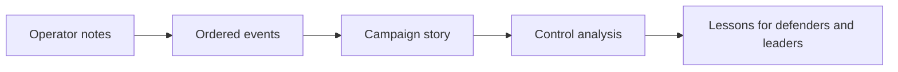
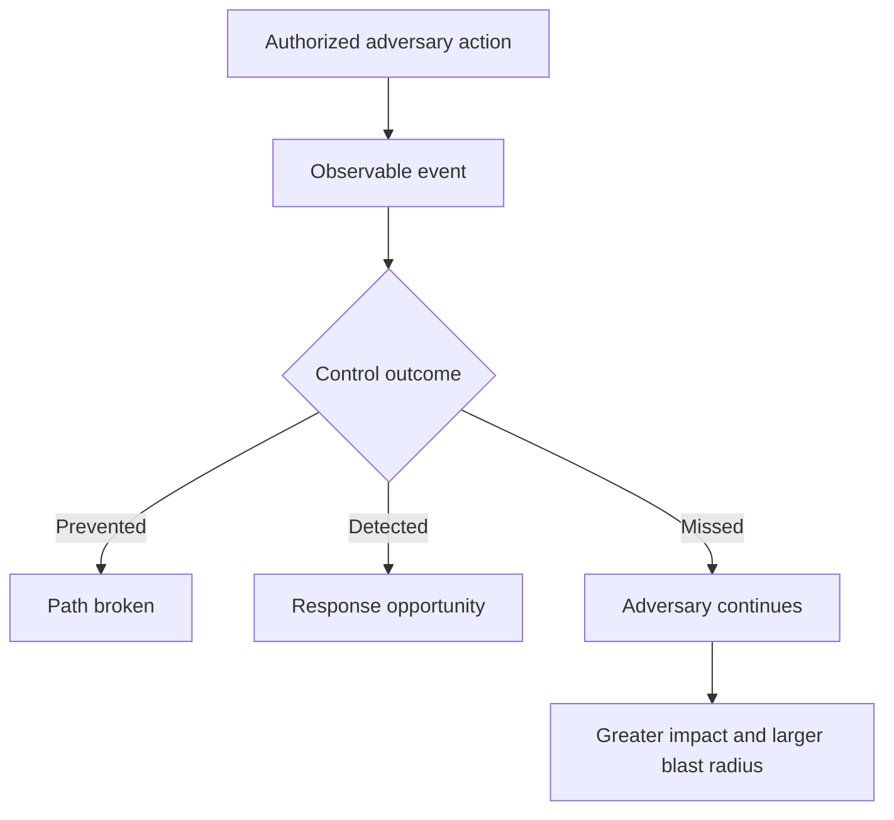
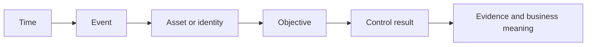
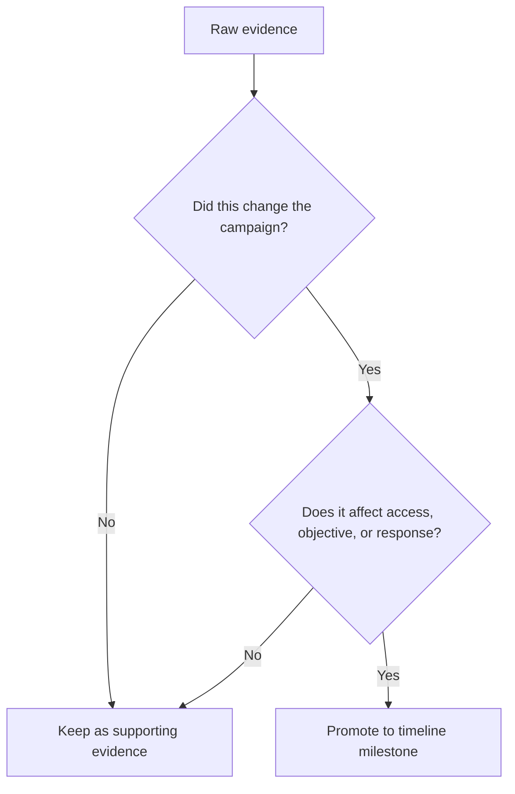
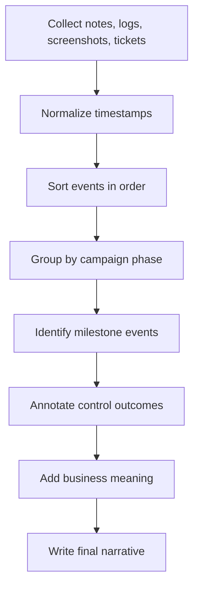
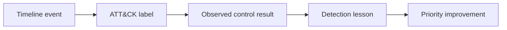
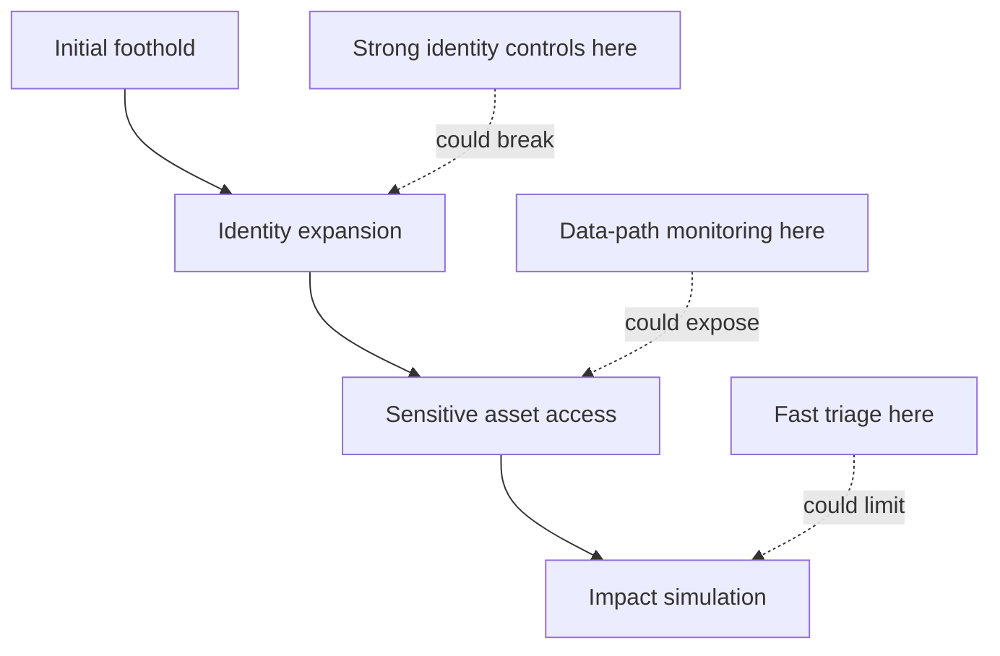
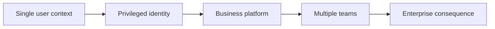

# Attack Timeline

> **Difficulty:** Beginner → Advanced | **Category:** Red Teaming | **Focus:** Reconstructing an Authorized Adversary-Emulation Campaign in Clear Chronological Order
>
> **Safety note:** This topic is about documenting activity from **authorized security exercises only**. The goal is to help defenders, leaders, and system owners understand exposure, timing, and control performance — not to provide intrusion instructions.

---

## Table of Contents

1. [What an Attack Timeline Actually Is](#1-what-an-attack-timeline-actually-is)
2. [Why Timelines Matter in Red Team Reporting](#2-why-timelines-matter-in-red-team-reporting)
3. [The Anatomy of a Strong Timeline](#3-the-anatomy-of-a-strong-timeline)
4. [Milestones vs. Noise](#4-milestones-vs-noise)
5. [A Practical Timeline Construction Workflow](#5-a-practical-timeline-construction-workflow)
6. [Time Normalization and Evidence Hygiene](#6-time-normalization-and-evidence-hygiene)
7. [Linking Events to ATT&CK, Controls, and Outcomes](#7-linking-events-to-attck-controls-and-outcomes)
8. [Example Authorized Exercise Timeline](#8-example-authorized-exercise-timeline)
9. [How to Present Timelines to Different Audiences](#9-how-to-present-timelines-to-different-audiences)
10. [Advanced Timeline Analysis](#10-advanced-timeline-analysis)
11. [Common Mistakes](#11-common-mistakes)
12. [References](#12-references)

---

## 1. What an Attack Timeline Actually Is

An attack timeline is the **chronological story of the exercise**.

It explains:

- **what happened**
- **when it happened**
- **where it happened**
- **why it mattered**
- **what defenders saw or missed**

A good timeline is not just a list of operator actions.
It is a reporting tool that connects:

```text
technical event → security meaning → business consequence → response decision
```

### Simple mental model

Think of the timeline as the "movie version" of the engagement.
Other report sections explain findings, root causes, or remediation.
The timeline shows **how the campaign unfolded over time**.



### What the timeline should answer

A reader should be able to answer questions like:

- When did the exercise first achieve meaningful access?
- How quickly did the campaign move between phases?
- Which actions were pivotal turning points?
- When could defenders realistically have detected the activity?
- How long did key objectives remain available before response began?

---

## 2. Why Timelines Matter in Red Team Reporting

In a standard pentest, the report often emphasizes **individual weaknesses**.
In a red team engagement, the report emphasizes the **adversary path**.

That makes the timeline one of the most important sections in the entire report.

| Pentest-style view | Red-team timeline view |
|---|---|
| What vulnerability existed? | How did the campaign progress across people, process, and technology? |
| Can the issue be reproduced? | Could the organization prevent, detect, slow, or contain the path? |
| Which host or application was vulnerable? | Which chain of identities, systems, and decisions enabled the objective? |
| How severe is the flaw? | How quickly could a realistic adversary move from access to impact? |

### Why leadership cares

Executives usually do not need every technical detail.
They need to understand:

- how serious the path was
- how fast it unfolded
- where detection lagged
- what should be fixed first

### Why defenders care

SOC analysts, incident responders, and detection engineers use the timeline differently.
They want to know:

- which events should have been visible
- which telemetry sources mattered most
- where alerts were absent, delayed, or ignored
- which point in the chain offered the best chance to break the campaign

### Why engineers care

System owners and architects use the timeline to identify:

- trust relationships that amplified access
- weak identity boundaries
- poorly protected control-plane systems
- business-critical dependencies that increased blast radius

### Core idea



A timeline makes those control outcomes visible in order.
That is what turns technical notes into a useful security narrative.

---

## 3. The Anatomy of a Strong Timeline

A professional timeline usually combines **technical precision** with **plain-language explanation**.

### Minimum fields

| Field | Why it matters |
|---|---|
| timestamp | establishes order, dwell time, and response lag |
| event summary | explains the action in plain language |
| system / identity | shows where the event occurred |
| campaign phase | places the event in the broader path |
| control outcome | prevented, detected, delayed, missed, or simulated |
| evidence reference | links to screenshots, logs, notes, or case IDs |

### Stronger fields for mature reporting

| Extra field | Why it improves the timeline |
|---|---|
| ATT&CK tactic or technique | helps defenders compare with known adversary behaviors |
| objective linkage | shows why this event mattered to the campaign |
| business note | connects the event to a process, asset, or consequence |
| confidence level | separates direct proof from inference |
| response note | shows when analysts, responders, or owners reacted |

### Practical structure



### A useful reporting formula

If you are unsure how to write an entry, this pattern works well:

```text
[time] + [what happened] + [where / who] + [why it mattered] + [what controls did]
```

Example format:

```text
10:14 UTC — Privileged access to the identity platform was validated through a chained weakness, expanding the campaign from a single user context to organization-wide administration. No alert or escalation was observed at that time.
```

Notice what this does:

- it stays chronological
- it stays readable
- it explains significance
- it includes defender context

---

## 4. Milestones vs. Noise

One of the most common reporting mistakes is turning the timeline into a raw log dump.

A timeline is not useful if it contains every command, click, request, or screen change.
A timeline becomes useful when it emphasizes the events that **changed the campaign**.

### Three levels of timeline detail

| Level | What it includes | Best use |
|---|---|---|
| raw events | every note, log line, and evidence point | analyst working data |
| supporting events | important context around a milestone | technical appendix |
| milestone events | turning points that altered access, visibility, or impact | main report timeline |

### What counts as a milestone

Milestone events often include:

- initial access or first meaningful foothold
- first successful identity expansion
- access to a sensitive system or crown-jewel asset
- proof of collection, manipulation, or impact under rules of engagement
- first defender alert, triage action, or containment step
- campaign-ending containment or exercise stop point

### Milestone filtering model



### Beginner tip

If removing an event does **not** change the reader's understanding of the campaign, it probably belongs in an appendix rather than the main timeline.

### Advanced tip

Keep the main report timeline short and strategic, then maintain a deeper analyst timeline separately.
That gives leadership a readable narrative while preserving technical traceability for defenders.

---

## 5. A Practical Timeline Construction Workflow

A strong timeline usually comes from a repeatable process rather than last-minute writing.



### Step 1: Collect all relevant evidence

Typical sources include:

- operator notes
- screenshots and proof artifacts
- ticket numbers or exercise control logs
- EDR, SIEM, email, cloud, identity, and SaaS timestamps
- blue-team alert times
- incident-response or escalation timestamps

The goal is not to prove every tiny action in the main report.
The goal is to build a reliable evidence base so the final timeline is defensible.

### Step 2: Normalize timestamps

Before analysis, convert all timestamps into a common reference.
UTC is usually the safest choice for reporting.

Why this matters:

- endpoints may log local time
- SaaS platforms may log in UTC
- analysts may take notes in local time
- different systems may have clock drift

### Step 3: Sort events chronologically

Once timestamps are normalized, order everything from earliest to latest.
At this stage, you are building a **working timeline**, not the polished report timeline.

### Step 4: Group events by campaign phase

Common grouping options:

| Phase grouping | Example use |
|---|---|
| objective-based | access, privilege, discovery, collection, impact |
| ATT&CK-based | Initial Access, Discovery, Credential Access, Lateral Movement |
| infrastructure-based | email, endpoint, identity provider, cloud, file services |
| response-based | pre-detection, alert generated, triage, containment |

Grouping makes it easier to see where the campaign accelerated or stalled.

### Step 5: Identify the turning points

Ask these questions:

- when did access become meaningful?
- when did the campaign gain broader reach?
- when did the first crown-jewel asset become reachable?
- when did defenders first have a realistic chance to intervene?
- when did response meaningfully change the path?

### Step 6: Annotate control outcomes

For every milestone, note whether controls:

- prevented the action
- detected the action quickly
- detected it late
- produced noisy or low-confidence signals
- missed it entirely
- only became relevant after later correlation

### Step 7: Write the narrative around the facts

This is where the timeline becomes readable.
Instead of copying raw notes, translate them into clear statements with context.

Bad version:

```text
10:03 — access ok. user token worked. checked share. no alerts.
```

Better version:

```text
10:03 UTC — Access to a sensitive file-share path was validated from the compromised user context, confirming that a single-user foothold could reach finance data without additional containment controls. No corresponding alert was reported at that time.
```

---

## 6. Time Normalization and Evidence Hygiene

Timeline quality depends heavily on time accuracy.
If your time data is inconsistent, the report can tell the wrong story.

### Common time problems

| Problem | What it causes | Reporting fix |
|---|---|---|
| mixed time zones | events appear out of order | convert all reporting times to UTC |
| daylight saving confusion | incorrect sequence or duration | record source timezone and normalized timezone |
| clock drift | false dwell time conclusions | note source clock reliability and uncertainty |
| manual notes without seconds | reduced precision | label as approximate where needed |
| SaaS logging delay | response appears later than reality | mention ingestion or processing delay |
| copied screenshots without metadata | weak traceability | pair images with evidence IDs or timestamps |

### Recommended evidence discipline

Use a simple standard for each event:

| Evidence question | Good practice |
|---|---|
| where did this time come from? | note the source system or note set |
| is the time exact or estimated? | label as exact, approximate, or inferred |
| can another reader trace it? | link to an evidence ID, screenshot, or ticket |
| does the event include context? | capture system, identity, phase, and outcome |

### Example confidence labels

| Confidence label | Meaning |
|---|---|
| confirmed | directly observed and evidenced |
| high confidence | strongly supported by multiple sources |
| moderate confidence | likely correct but based on partial evidence |
| estimated | timing or sequencing inferred from surrounding evidence |

### Reporting rule

Never hide uncertainty.
A professional timeline is honest about what was:

- directly demonstrated
- safely simulated
- inferred from evidence
- unavailable because logging was absent or incomplete

That honesty improves trust in the report.

---

## 7. Linking Events to ATT&CK, Controls, and Outcomes

An attack timeline becomes far more useful when it is connected to a recognized behavior model.
MITRE ATT&CK is often used for this because it helps readers map events to known adversary tactics and techniques.

### Why ATT&CK helps

ATT&CK gives the timeline a shared language for:

- detection engineering
- defensive coverage review
- purple-team follow-up
- control gap prioritization

The Enterprise ATT&CK matrix spans enterprise platforms such as Windows, Linux, macOS, identity providers, SaaS, IaaS, containers, and network devices.
That makes it especially useful when a single red-team path crosses endpoint, cloud, and identity layers.

### Practical ATT&CK usage

Do **not** turn the timeline into a giant ATT&CK spreadsheet.
Use ATT&CK only where it adds clarity.

A good pattern is:

```text
event → ATT&CK tactic / technique → control outcome → defender takeaway
```

### Example mapping table

| Timeline event | ATT&CK-style lens | Control question | Why it matters |
|---|---|---|---|
| first foothold proved | Initial Access | should this have been blocked or challenged? | establishes the first meaningful exposure |
| directory information gathered | Discovery | did telemetry show reconnaissance behavior? | signals the campaign was expanding knowledge |
| privileged identity reached | Privilege Escalation / Credential Access | was identity protection triggered? | increases blast radius dramatically |
| sensitive business data reached | Collection | were sensitive paths monitored? | turns access into business consequence |
| response initiated | Detection / Response overlay | how long did triage take? | shows resilience, not just exposure |

### ATT&CK plus control outcome is stronger than ATT&CK alone



### Connection to incident handling

NIST SP 800-61 emphasizes analyzing incident-related data and determining appropriate response actions.
That same mindset improves red-team timelines:

- gather evidence carefully
- analyze it consistently
- identify response opportunities
- explain what action should follow

That is why a good timeline is useful beyond the report itself.
It can feed purple-team exercises, incident-response tuning, and tabletop scenarios.

---

## 8. Example Authorized Exercise Timeline

The example below is intentionally sanitized and high level.
It shows how to communicate the **shape of a campaign** without giving harmful, step-by-step intrusion instructions.

### Example scenario

A red team was authorized to evaluate whether a user-level compromise could expand into access to a sensitive finance workflow and whether defenders would detect the path in time.

### Example timeline table

| Time (UTC) | Event | System / Identity | Campaign phase | Control outcome | Why it mattered |
|---|---|---|---|---|---|
| 08:42 | Initial user-context access was validated through an approved simulation path. | user workstation / standard user | Initial Access | missed | established the first meaningful foothold |
| 09:05 | Internal directory and environment information was gathered from the initial context. | workstation / enterprise directory | Discovery | missed | improved adversary understanding of reachable assets |
| 09:41 | A chained weakness allowed expansion from a user context to a more privileged identity. | identity platform / privileged role | Privilege Expansion | missed | significantly increased blast radius |
| 10:14 | Reachability to a finance data path was confirmed under exercise rules. | file service / finance share | Discovery / Collection | missed | connected technical access to a business-critical asset |
| 10:37 | Sample records were enumerated and proof captured under evidence restrictions. | finance data path | Collection | no alert observed | demonstrated confidentiality impact without unnecessary exposure |
| 10:49 | Exfiltration potential was safely simulated rather than performed. | reporting evidence only | Impact Simulation | delayed / not observed | showed what a real adversary could do next |
| 11:18 | The first analyst investigation began after separate signals were correlated. | SOC case | Detection / Triage | delayed | indicated visibility existed but was not timely enough |
| 11:46 | Containment actions restricted the campaign path. | identity and endpoint controls | Containment | successful but late | ended the demonstrated path after key objectives were already reached |

### What this timeline tells the reader

Even before any deep technical appendix, the reader can already see:

- the campaign moved from initial access to meaningful business exposure in about two hours
- the critical turning point was identity expansion
- detection was possible, but not timely
- the organization's most important opportunity to break the path was before finance access was reached

### Visualizing the same scenario


### Adversary path versus defender timing

```text
08:42  Initial foothold
09:05  Discovery begins
09:41  Privileged identity reached
10:14  Sensitive finance path reached
10:49  Impact potential safely demonstrated
11:18  SOC triage begins
11:46  Containment applied

Key lesson:
The most important detection opportunity existed well before the first formal response action.
```

---

## 9. How to Present Timelines to Different Audiences

The same underlying timeline can be presented at different levels of detail.

### Audience-specific presentation

| Audience | What they need most | Best timeline style |
|---|---|---|
| executives | speed, consequence, and priority actions | short milestone summary |
| security leadership | path, missed controls, and choke points | milestone table with control outcomes |
| SOC / IR teams | exact sequence, telemetry gaps, and response lag | detailed technical timeline |
| engineers / system owners | affected systems and trust boundaries | timeline plus architecture context |
| purple-team facilitators | behaviors to validate and tune against | ATT&CK-linked timeline with detection notes |

### Good presentation pattern

A mature report often uses **two timeline layers**:

1. a short executive timeline in the main body
2. a deeper technical timeline in the appendix

This keeps the report readable while preserving analyst value.

### Suggested executive timeline format

| Time | Milestone | Security meaning |
|---|---|---|
| 08:42 | initial foothold | starting point of the path |
| 09:41 | privileged identity reached | major blast-radius increase |
| 10:14 | finance access proved | business-sensitive exposure |
| 11:18 | first triage activity | delayed defender response |
| 11:46 | containment | successful but after objective reach |

### Suggested technical appendix format

| Time (UTC) | Event | Evidence ID | ATT&CK lens | Control result | Notes |
|---|---|---|---|---|---|
| 08:42:16 | initial foothold validated | EV-001 | Initial Access | missed | operator screenshot and ticket reference |
| 09:05:42 | environment information gathered | EV-004 | Discovery | missed | no corresponding alert found |
| 09:41:03 | privileged role reached | EV-011 | Privilege Escalation | missed | key turning point |

### Copy-friendly timeline template

Use this structure when building your own note set:

| Time (UTC) | Event summary | System / identity | Objective linkage | ATT&CK lens | Control outcome | Evidence ref | Business note |
|---|---|---|---|---|---|---|---|
| HH:MM | what happened in plain language | where / who | why it mattered | tactic / technique | prevented, detected, delayed, missed | screenshot, ticket, log | impact or consequence |

---

## 10. Advanced Timeline Analysis

Once the basic sequence is clear, stronger reports go further.
They analyze **tempo, choke points, and resilience**.

### 1. Measure campaign tempo

Tempo shows how quickly the path progressed.

Questions to ask:

- How long from foothold to privilege expansion?
- How long from privilege to sensitive asset access?
- How long from first visible signal to active response?
- Which part of the chain was fastest, and why?

### 2. Identify choke points

A choke point is a moment where one control could have broken multiple downstream steps.



The most valuable remediation is often the control that would have stopped **an entire branch of the timeline**, not just one isolated event.

### 3. Separate proof from projection

Red-team timelines should clearly distinguish between:

| Category | Meaning |
|---|---|
| demonstrated | directly achieved and evidenced during the exercise |
| simulated | intentionally not executed, but safely modeled under rules |
| inferred next step | realistic follow-on action based on what was reached |

This distinction protects report credibility.
It also avoids overstating impact.

### 4. Add blast-radius context

A timeline becomes more strategic when it explains not only what was reached, but **how far consequences could spread**.



### 5. Compare adversary time to defender time

One of the most important advanced insights is the difference between:

- **adversary time-to-objective**
- **defender time-to-detect**
- **defender time-to-contain**

If time-to-objective is much shorter than time-to-response, the organization has a resilience gap even if logs technically existed.

### 6. Use the timeline to drive follow-on exercises

A mature security team can reuse the timeline for:

- purple-team validation
- detection rule tuning
- incident-response playbook review
- control-priority workshops
- tabletop exercises for leadership and responders

That is why a strong timeline is more than a reporting artifact.
It becomes a roadmap for improvement.

---

## 11. Common Mistakes

### 1. Mixing time zones without saying so

This creates false sequencing and confusion.
Always state the reporting timezone.

### 2. Including every low-level action

This makes the timeline unreadable.
Focus on milestones and supporting evidence.

### 3. Omitting defender activity

A red-team timeline should include not only adversary actions, but also:

- alert generation
- triage
- escalation
- containment
- recovery-related decisions

### 4. Reporting technical events without meaning

"Access succeeded" is not enough.
Explain why that event mattered to the objective or business process.

### 5. Overstating impact

Separate what was proved from what was simulated or inferred.
Precision increases trust.

### 6. Hiding uncertainty

If a time or sequence is estimated, label it.
A report is stronger when its limitations are clear.

### 7. Failing to identify the key turning point

Most campaigns have one or two moments that changed everything.
If the reader cannot identify those moments quickly, the timeline needs work.

### 8. Treating the timeline as an appendix afterthought

In red-team reporting, the timeline is often one of the clearest ways to show:

- path progression
- control failure sequence
- response timing
- business exposure

It should be written deliberately, not assembled carelessly at the end.

---

## 12. References

- [MITRE ATT&CK – Enterprise Matrix](https://attack.mitre.org/matrices/enterprise/)
- [MITRE ATT&CK – Data and Tools](https://attack.mitre.org/resources/attack-data-and-tools/)
- [NIST SP 800-61 Rev. 2 – Computer Security Incident Handling Guide](https://csrc.nist.gov/publications/detail/sp/800-61/rev-2/final)
- [NIST SP 800-115 – Technical Guide to Information Security Testing and Assessment](https://csrc.nist.gov/publications/detail/sp/800-115/final)
