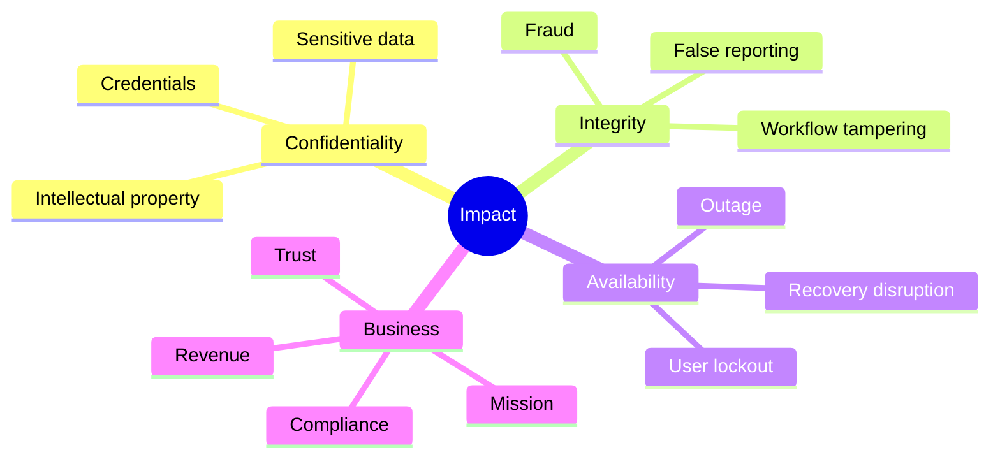
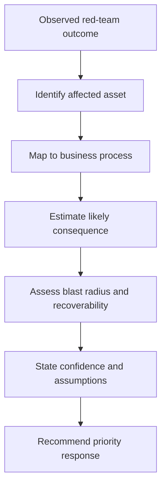
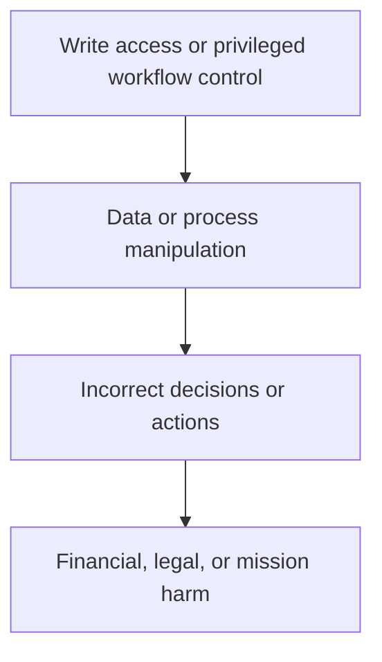
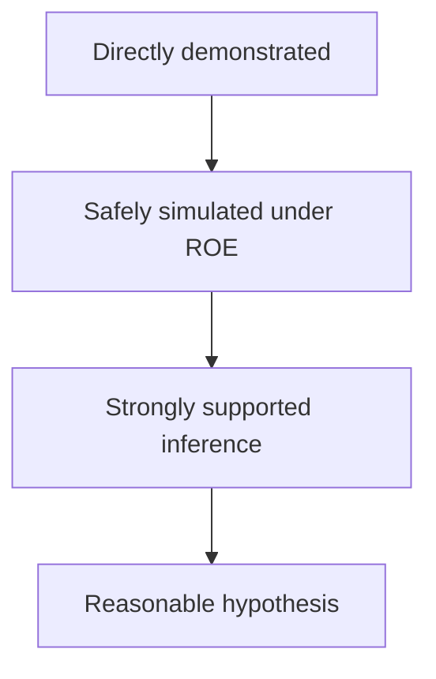
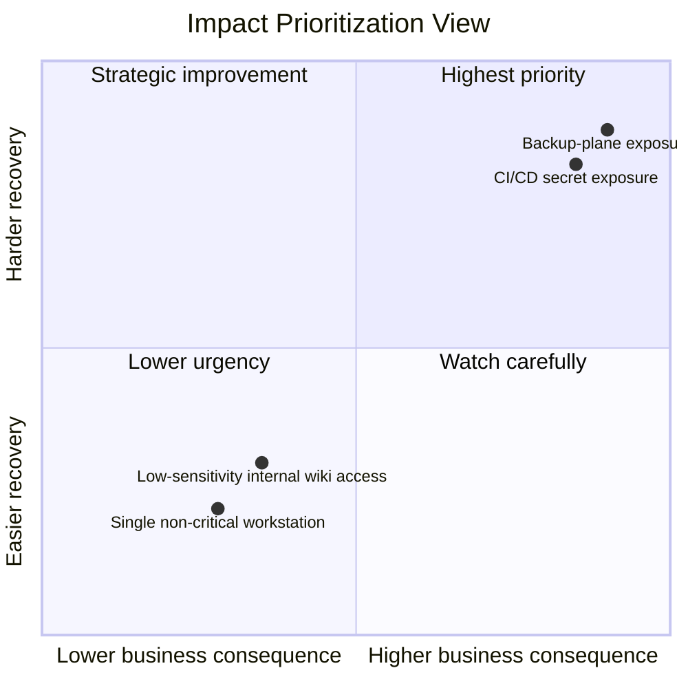

# Impact Analysis

> **Difficulty:** Beginner → Advanced | **Category:** Red Teaming | **Focus:** Converting Authorized Adversary-Emulation Results Into Clear Business Consequences
>
> **Safety note:** This topic is about **reporting and risk translation during authorized exercises only**. The goal is to explain what a validated adversary path means for the organization — not to provide intrusion instructions.

---

## Table of Contents

1. [What Impact Analysis Actually Means](#1-what-impact-analysis-actually-means)
2. [Why It Matters in Red Teaming](#2-why-it-matters-in-red-teaming)
3. [The Core Impact Dimensions](#3-the-core-impact-dimensions)
4. [A Practical Translation Workflow](#4-a-practical-translation-workflow)
5. [Business Impact Lenses](#5-business-impact-lenses)
6. [Evidence, Confidence, and Reporting Discipline](#6-evidence-confidence-and-reporting-discipline)
7. [Writing Strong Impact Statements](#7-writing-strong-impact-statements)
8. [Prioritizing What Matters Most](#8-prioritizing-what-matters-most)
9. [Common Red-Team Impact Patterns](#9-common-red-team-impact-patterns)
10. [Common Mistakes](#10-common-mistakes)
11. [References](#11-references)

---

## 1. What Impact Analysis Actually Means

Impact analysis answers the most important reporting question:

> **“If a real adversary achieved this same outcome, what would it mean for the organization?”**

In a red team engagement, technical success alone is not the final product.

Examples of **technical outcomes**:

- a privileged identity was reached
- a sensitive business system became accessible
- a SaaS admin role was exposed
- a backup management plane was reachable
- a sample set of sensitive records was accessed under rules of engagement
- a destructive or disruptive action was shown to be *possible* but not executed

Impact analysis converts those outcomes into language leaders can act on.

### Simple idea

```text
Technical fact  →  Business meaning  →  Priority decision
```

### Beginner mental model

Think of impact analysis as a translation layer:


If the report stops at “domain admin was obtained,” the client still has work to do mentally.
If the report explains “privileged identity access made it realistic to change identity controls, disrupt recovery, and access finance workflows,” the result is immediately more useful.

---

## 2. Why It Matters in Red Teaming

Pentest reporting often focuses on **individual findings**.
Red-team reporting focuses on **adversary paths, mission outcomes, and resilience gaps**.

That means impact analysis in red teaming is usually broader than simple vulnerability severity.

| Pentest-style question | Red-team-style question |
|---|---|
| How severe is this flaw? | What mission or business objective could this path enable? |
| Can developers reproduce the issue? | Could defenders prevent, detect, or contain the campaign? |
| What is the CVSS-like rating? | What is the likely operational and organizational consequence? |
| Which component is vulnerable? | Which chain of identities, systems, and processes created material risk? |

### The real purpose

Good impact analysis helps different audiences answer different questions:

- **executives:** How serious is this to the business?
- **security leaders:** Which control failures mattered most?
- **defenders:** Where did visibility or containment break down?
- **engineers and system owners:** Which business-critical dependencies were exposed?

### Red-team framing

A mature impact section should show all of the following:

1. what was **proved** during the exercise
2. what was **safely simulated** but not executed
3. what a real adversary could **realistically do next**
4. why the outcome matters to **mission, revenue, safety, trust, compliance, or recovery**

---

## 3. The Core Impact Dimensions

The easiest way to start impact analysis is with the classic **CIA triad**, then expand into business consequences.

| Dimension | Simple question | Example consequence |
|---|---|---|
| confidentiality | What could be exposed? | customer data, credentials, strategy documents, legal material |
| integrity | What could be changed, falsified, or manipulated? | payroll changes, fraudulent approvals, altered logs, modified code |
| availability | What could be interrupted, degraded, or made unrecoverable? | outage, delayed operations, blocked users, damaged recovery process |

### But red teams usually need more than CIA

Business impact often becomes clearer when you add extra lenses:

| Lens | What it helps explain |
|---|---|
| financial | direct loss, fraud, lost sales, contractual exposure |
| regulatory / legal | notification duties, penalties, legal scrutiny |
| operational | downtime, delayed manufacturing, missed service delivery |
| reputational | loss of trust, customer churn, partner concern |
| strategic | IP loss, deal impact, M&A sensitivity, roadmap exposure |
| safety / mission | harm to public service, healthcare delivery, industrial process, or critical mission |
| recovery | difficulty restoring systems, trust, or clean administration |

### Quick visual



### Important distinction

Impact analysis is **not** the same as “worst-case imagination.”
It should be based on:

- validated exercise evidence
- realistic next-step consequences
- organization-specific context
- clear separation between proof and inference

---

## 4. A Practical Translation Workflow

A practical impact workflow starts with evidence and ends with action.



### Step 1: Start from the observed outcome

Examples:

- privileged access to an identity provider
- access to a build pipeline or deployment secret store
- reachability to backup orchestration
- access to HR, finance, healthcare, or customer-support data
- approved simulation of message manipulation or workflow interruption

Describe the outcome in plain language before analyzing it.

### Step 2: Identify the asset that was truly reached

Do not stop at the server or account name.
Ask:

- What does this system support?
- Who depends on it?
- Is it a control-plane asset, data-plane asset, or business application?
- Is it ordinary infrastructure or a crown-jewel dependency?

### Step 3: Map the asset to a business process

This is where impact becomes real.

| Asset reached | Business process example |
|---|---|
| HR records system | onboarding, payroll, employee privacy |
| CI/CD platform | software release integrity and production trust |
| identity provider | enterprise authentication and privileged access |
| backup console | restoration and ransomware resilience |
| finance approval workflow | payments, vendor management, audit accuracy |
| CRM or support platform | customer service continuity and privacy |

### Step 4: Describe the likely consequence

Move from technical outcome to organizational consequence:

```text
Reached SaaS admin role
→ could alter identity settings and delegated access
→ could disrupt user access or expand compromise
→ could affect enterprise operations and recovery trust
```

### Step 5: Estimate blast radius

Impact grows with scale.


Useful blast-radius questions:

- how many users or records were within reach?
- how many systems depend on this platform?
- would the effect stay local or spread through trust relationships?
- would the issue affect production, support, recovery, or all three?

### Step 6: Assess recoverability

Two impacts may look similar at first but differ greatly in recovery cost.

| Scenario | Recoverability question |
|---|---|
| privileged email access | can access be revoked and sessions reset quickly? |
| CI/CD integrity concern | how do you re-establish trust in artifacts and releases? |
| backup management exposure | can recovery remain trusted after compromise? |
| workflow data manipulation | can incorrect transactions be identified and reversed confidently? |

### Step 7: State assumptions and confidence

This is critical in professional reporting.

A strong impact statement tells the reader whether the consequence was:

- directly demonstrated
- safely simulated
- strongly supported by evidence
- a plausible but unvalidated concern

---

## 5. Business Impact Lenses

A single technical event can create several kinds of business impact at once.

### 5.1 Confidentiality impact

This matters when an adversary path could expose:

- regulated personal data
- trade secrets or source code
- legal, M&A, or strategy material
- authentication material or recovery secrets

**Good reporting language:**

> “The exercise validated access to a data store containing customer support artifacts. In a real compromise, that access could expose personal data, internal case notes, and authentication-reset workflows, creating both privacy risk and follow-on account compromise risk.”

### 5.2 Integrity impact

Integrity is often underestimated.
It includes not just “changing files,” but changing **trustworthy business decisions**.

Examples:

- modifying payroll or vendor details
- changing deployment outputs or release logic
- altering case-management records
- falsifying logs, evidence, or operational dashboards
- tampering with model inputs, policy content, or approval workflows



### 5.3 Availability impact

Availability is not only “full outage.”
It includes degraded operations, delayed recovery, user lockout, and loss of trusted administration.

Examples:

- administrators unable to manage core systems
- users locked out of shared business platforms
- delayed restoration because the recovery plane is no longer trusted
- service disruption in manufacturing, healthcare, logistics, or customer support

### 5.4 Identity and trust-plane impact

In modern environments, the biggest impact often comes from **identity systems**, not individual servers.

If the exercise reaches:

- identity provider administration
- privileged access workflows
- certificate or signing infrastructure
- device-management control
- CI/CD or code-signing trust

then the effect may extend far beyond one system.

```text
Privileged identity control
    ↓
Many accounts and services depend on it
    ↓
Trust in access, administration, and response is weakened
```

### 5.5 Recovery and resilience impact

Some compromises matter most because they threaten the organization's ability to recover from a future crisis.

Examples:

- backup management exposure
- recovery credential exposure
- incident-response communication compromise
- logging and evidence integrity degradation

These are often high-priority even if no visible disruption occurred during the exercise.

### 5.6 Regulatory, contractual, and stakeholder impact

Impact analysis should also consider whether the demonstrated path could trigger:

- breach-notification obligations
- contractual reporting duties
- audit findings
- regulator scrutiny
- customer or partner trust damage

This is especially important for sectors such as finance, healthcare, public sector, SaaS, and critical infrastructure.

---

## 6. Evidence, Confidence, and Reporting Discipline

One of the easiest ways to lose credibility is to blur the line between what was proven and what was assumed.

### A useful confidence ladder



### How to use it

| Confidence level | Meaning | Example wording |
|---|---|---|
| directly demonstrated | observed during the exercise | “The team accessed the approval workflow data store.” |
| safely simulated | intentionally not executed for safety, but feasibility was validated | “Per rules of engagement, disruptive action was not performed; however, the team validated sufficient access to make such disruption realistic.” |
| strongly supported inference | evidence clearly supports the next step | “Because the team reached the CI/CD secret store, modification of deployment trust should be treated as a realistic consequence.” |
| reasonable hypothesis | possible, but not yet validated | “This may also create downstream partner exposure, though that was not tested.” |

### Reporting discipline rules

- separate **fact**, **inference**, and **assumption**
- avoid dramatic claims that the evidence cannot support
- avoid understating high-impact access just because no destructive action was taken
- note any safety limitations, time-boxing, or out-of-scope boundaries

### A practical evidence checklist

Before finalizing impact, ask whether you have:

- evidence of the asset reached
- evidence of the business function supported
- evidence of identity or trust relationships
- a clear statement of what was and was not executed
- enough context from the client to estimate business consequence responsibly

---

## 7. Writing Strong Impact Statements

Good impact writing is specific, plain-language, and tied to the organization.

### A simple formula

```text
Because the team reached [asset / identity / process],
a real adversary could likely [consequence],
which would affect [business function / stakeholder / mission area].
```

### Weak vs strong examples

#### Weak

> “The team got admin on a server.”

#### Better

> “The team obtained administrative access to a server used by the finance function.”

#### Strong

> “The team obtained administrative access to infrastructure supporting vendor-payment workflows. In a real compromise, that level of access could enable unauthorized payment manipulation, audit-record tampering, or service interruption in finance operations.”

### Another example

#### Weak

> “We accessed the backup environment.”

#### Strong

> “The team validated access to backup-management components. Although no backup data was altered, this access would materially weaken organizational resilience because a real adversary could interfere with restoration confidence during a major incident.”

### Writing rules that improve clarity

- name the **business process**, not only the technology
- quantify scope where possible: users, records, regions, environments, business units
- explain whether impact was **direct**, **indirect**, or **cascading**
- distinguish **data exposure**, **decision manipulation**, and **service disruption**
- translate technical control-plane access into business language

### Executive-friendly wording

Executives usually respond better to this structure:

1. what was reached
2. why it matters
3. what could happen next
4. why the organization should care now

Example:

> “The exercise showed that a path existed from a user-level foothold to identity administration. That matters because enterprise authentication and privileged access depend on that trust plane. A real adversary with the same access could expand compromise, interrupt user access, and complicate incident recovery across multiple business services.”

---

## 8. Prioritizing What Matters Most

Not every impact statement deserves the same urgency.
A practical model looks at more than technical severity.

### Priority factors

| Factor | Higher priority when... |
|---|---|
| asset criticality | the path reaches crown-jewel data, trust systems, or recovery systems |
| blast radius | many users, services, or business units depend on the affected asset |
| consequence depth | the path enables fraud, broad exposure, or major operational disruption |
| recoverability | restoring trust or service would be slow, expensive, or uncertain |
| detectability | the organization is unlikely to notice quickly |
| repeatability | the same weakness probably exists elsewhere |
| adversary realism | the path matches realistic threat behavior for the sector |

### Simple prioritization diagram



### Useful prioritization mindset

A red-team report is most valuable when it helps the client fix the **fewest things that break the most attack paths**.

That usually means elevating issues involving:

- identity administration
- privileged access workflows
- code and deployment trust
- backup and recovery trust
- sensitive data concentration
- weak detective coverage across critical transitions

---

## 9. Common Red-Team Impact Patterns

These patterns help beginners move from “technical success” to “business consequence.”

### Pattern 1: Identity provider or privileged directory access

| Technical outcome | Business meaning |
|---|---|
| access to IdP administration or privileged identity workflows | broad account impact, trust erosion, harder containment, possible enterprise-wide disruption |

### Pattern 2: CI/CD, artifact, or signing access

| Technical outcome | Business meaning |
|---|---|
| exposure of build secrets, deployment trust, or signing material | software integrity risk, downstream customer impact, large remediation cost |

### Pattern 3: Backup and recovery plane access

| Technical outcome | Business meaning |
|---|---|
| access to backup orchestration or recovery credentials | reduced resilience, slower crisis recovery, uncertainty about clean restoration |

### Pattern 4: Finance or approval workflow access

| Technical outcome | Business meaning |
|---|---|
| reach to payment, invoice, or procurement workflows | fraud risk, audit concerns, integrity loss, potential direct financial impact |

### Pattern 5: Customer data and support-system access

| Technical outcome | Business meaning |
|---|---|
| access to CRM, support tickets, or account-reset artifacts | privacy exposure, customer trust loss, follow-on account abuse risk |

### Pattern 6: High-trust collaboration or email access

| Technical outcome | Business meaning |
|---|---|
| mailbox or collaboration control for sensitive users | social engineering amplification, business-process manipulation, reputation impact |

### Pattern 7: Operational technology, healthcare, or mission systems

| Technical outcome | Business meaning |
|---|---|
| access affecting real-world services or critical missions | safety, service continuity, public trust, and regulatory consequences beyond IT |

### Sample impact-mapping table

| Observed exercise result | Immediate consequence | Downstream concern | Reporting priority |
|---|---|---|---|
| privileged SaaS admin access | broad tenant control | user lockout, policy change, data exposure | very high |
| backup-console reachability | recovery trust weakened | major-incident recovery delay | very high |
| finance-share data access | sensitive business exposure | fraud enablement, legal exposure | high |
| single low-sensitivity server access | localized compromise | limited lateral concern | moderate |
| customer-support platform access | privacy and reset-process risk | churn, support abuse, trust loss | high |

---

## 10. Common Mistakes

### 1. Treating all admin access as equally impactful

Administrative access to a lab host is not the same as administrative access to an identity or recovery control plane.

### 2. Confusing data volume with business importance

A small set of highly sensitive records can matter more than a huge set of low-value files.

### 3. Ignoring integrity impact

Many teams focus only on theft or outage. In practice, **fraud, tampering, and decision manipulation** can be just as serious.

### 4. Failing to state what was not done

If disruptive actions were intentionally avoided under rules of engagement, say so clearly.
That increases trust in the report.

### 5. Writing for operators only

If only a red teamer can understand the impact section, it is not finished.

### 6. Overclaiming “catastrophic” outcomes

Professional credibility is built by precise, evidence-based language.

### 7. Underclaiming because the exercise was safe

A red team often stops before executing harmful actions. That does **not** mean the impact is low.
It means the report must explain feasible consequence responsibly.

---

## 11. References

- [MITRE ATT&CK – Impact Tactic (TA0040)](https://attack.mitre.org/tactics/TA0040/)
- [MITRE ATT&CK](https://attack.mitre.org/)
- [NIST SP 800-115 – Technical Guide to Information Security Testing and Assessment](https://csrc.nist.gov/publications/detail/sp/800-115/final)
- [NIST SP 800-61 Rev. 2 – Computer Security Incident Handling Guide](https://nvlpubs.nist.gov/nistpubs/SpecialPublications/NIST.SP.800-61r2.pdf)
- [FIRST – CVSS Resources](https://www.first.org/cvss/)

---

## Final Takeaway

A strong impact analysis does not simply say **what the red team touched**.
It explains:

- what the exercise proved
- what business function was placed at risk
- how serious the likely consequence is
- how wide the blast radius could become
- why leadership should prioritize action

> **Best practice:** If a reader can understand the likely business consequence without needing the operator in the room, the impact analysis is doing its job.
