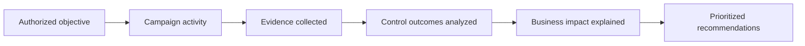
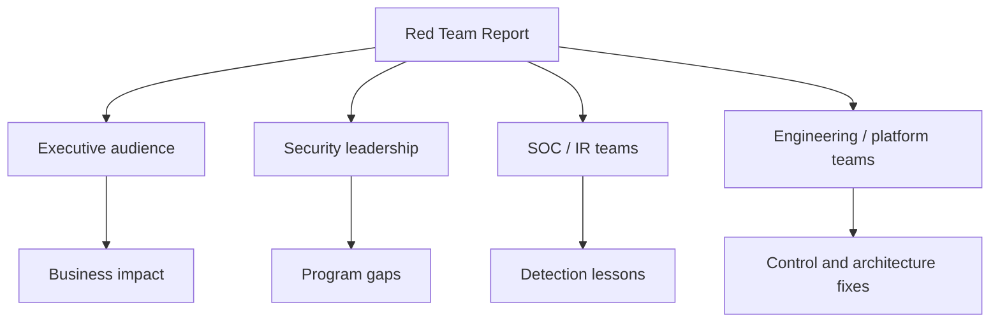
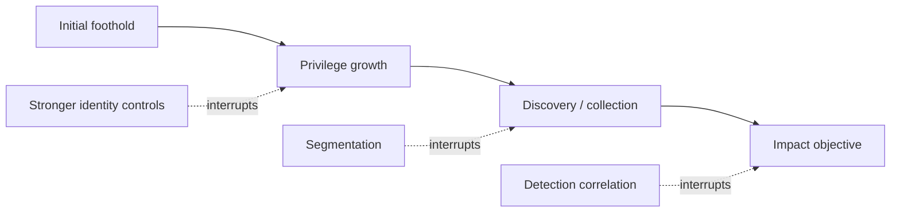
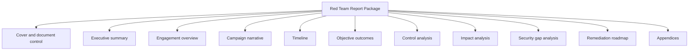
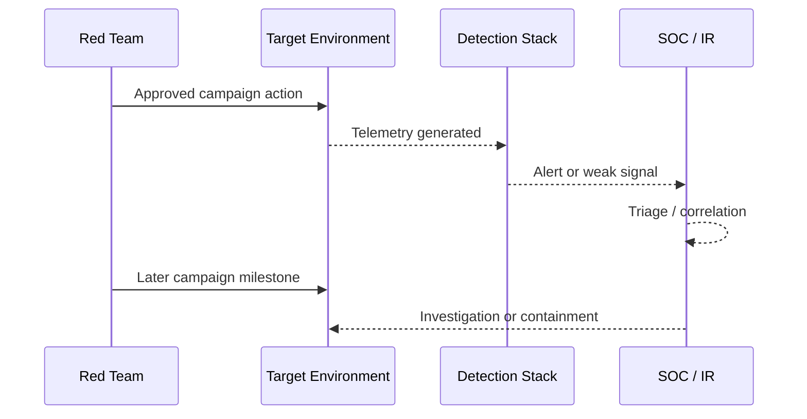
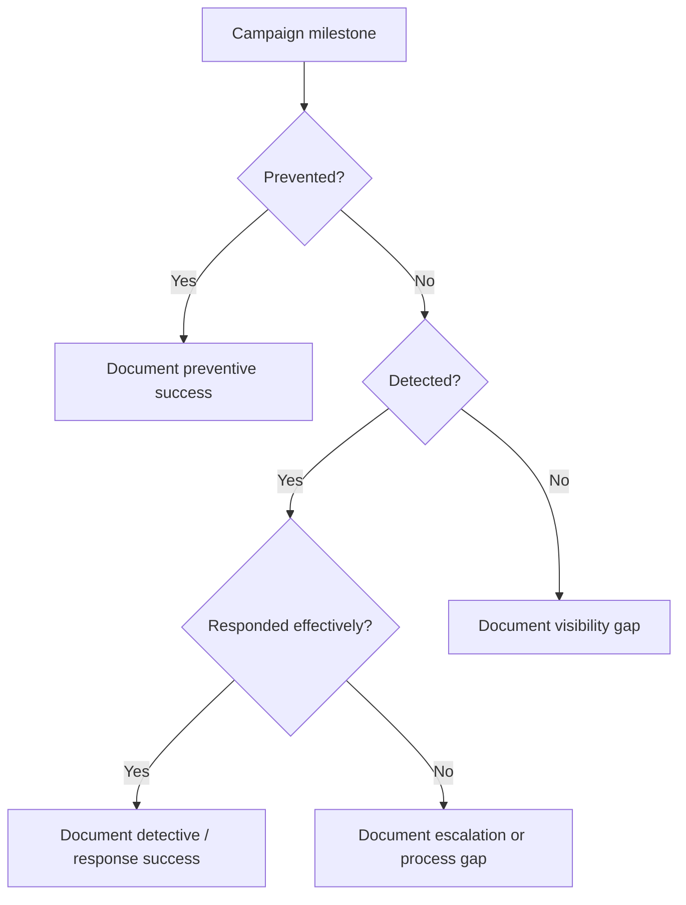
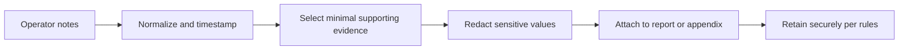
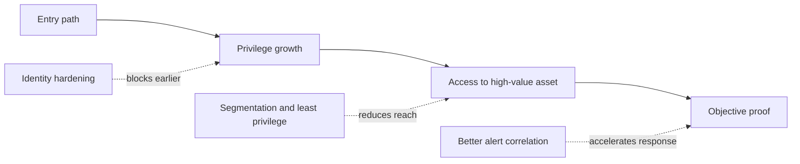
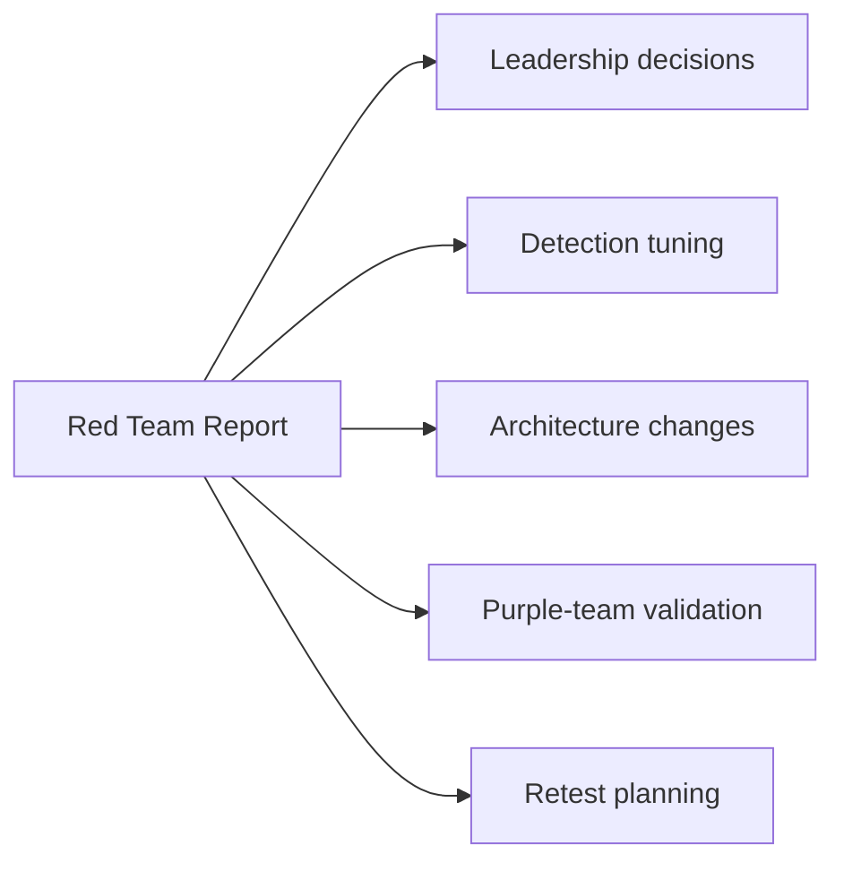

# Red Team Reporting

> **Difficulty:** Beginner → Advanced | **Category:** Red Teaming | **Focus:** Turning an **authorized adversary-emulation exercise** into decisions, detections, and durable security improvement

---

## Table of Contents

1. [What Red Team Reporting Really Is](#1-what-red-team-reporting-really-is)
2. [How It Differs From Pentest Reporting](#2-how-it-differs-from-pentest-reporting)
3. [Who the Report Is For](#3-who-the-report-is-for)
4. [Principles of High-Value Red Team Reports](#4-principles-of-high-value-red-team-reports)
5. [The Full Report Structure](#5-the-full-report-structure)
6. [Executive Summary Writing](#6-executive-summary-writing)
7. [Campaign Narrative and Attack Timeline](#7-campaign-narrative-and-attack-timeline)
8. [Control Analysis: Prevent, Detect, Respond](#8-control-analysis-prevent-detect-respond)
9. [Impact, Risk, and Objective Scoring](#9-impact-risk-and-objective-scoring)
10. [Evidence Handling and Safety](#10-evidence-handling-and-safety)
11. [Remediation That Breaks the Attack Path](#11-remediation-that-breaks-the-attack-path)
12. [Metrics, ATT&CK Mapping, and Maturity Views](#12-metrics-attck-mapping-and-maturity-views)
13. [Practical Templates and Example Snippets](#13-practical-templates-and-example-snippets)
14. [Common Mistakes](#14-common-mistakes)
15. [Advanced Reporting Practices](#15-advanced-reporting-practices)
16. [References](#16-references)

---

## 1. What Red Team Reporting Really Is

Red team reporting is **not just a list of findings**.

It is the process of explaining, in a safe and defensible way:

- what the authorized emulation objective was
- what the team was able to prove
- which defensive controls worked, failed, or only partially worked
- how the campaign affected business risk
- which changes would most effectively break the path next time

A good red team report turns a complex exercise into a clear answer to this question:

> **“If a real adversary tried something similar, how would our organization perform?”**

### Beginner view

A beginner can think of the report as the **story of the exercise**:

- where the campaign started
- where it went
- what it reached
- what defenders saw
- what should be improved first

### Advanced view

At an advanced level, the report becomes a **decision document** for multiple audiences:

- executives use it to prioritize funding and risk decisions
- defenders use it to improve detections and response workflows
- engineers use it to fix architectural or control weaknesses
- governance teams use it to track risk ownership and closure



### Why this matters

A red team exercise may be technically impressive, but if the report is weak:

- leadership may not understand the significance
- defenders may not know where they missed signals
- engineers may fix symptoms instead of causes
- the organization may repeat the same failure in the next exercise

---

## 2. How It Differs From Pentest Reporting

Pentest reporting and red team reporting overlap, but they are **not the same product**.

### Core difference

A pentest report often centers on **individual vulnerabilities**.
A red team report centers on the **adversary path and the organization's resilience**.

| Pentest reporting | Red team reporting |
|---|---|
| focuses on flaws | focuses on campaign outcomes |
| usually finding-by-finding | usually story-by-story or objective-by-objective |
| asks “what is vulnerable?” | asks “what path was possible?” |
| emphasizes reproduction and remediation of each flaw | emphasizes interruption of the overall path |
| often rates individual issues | often rates objective impact, control gaps, and response performance |

### Easy mental model

```text
Pentest report:   Here are the doors that were unlocked.
Red team report:  Here is the path an approved adversary could take through the building,
                  which alarms worked, which guards responded, and what would have
                  stopped the mission sooner.
```

### Red team reporting usually includes more of the following

- campaign narrative
- attack timeline
- ATT&CK mapping
- detection timeline
- control validation results
- blue-team response observations
- security gap analysis
- path-based remediation

### Important safety framing

Because red teaming simulates adversary behavior, the report must stay grounded in **authorized emulation**.

That means the report should:

- describe **what was validated**, not provide harmful how-to intrusion playbooks
- include only the evidence needed to support conclusions
- avoid unnecessary operational detail that would increase misuse risk
- respect the rules of engagement, data handling rules, and legal approvals

---

## 3. Who the Report Is For

One of the biggest reporting mistakes is writing for only one audience.

A professional red team report usually serves **four audiences at once**.

| Audience | What they care about | What they usually do with the report |
|---|---|---|
| executives / board | mission impact, business risk, top priorities | fund and prioritize remediation |
| security leadership | control failures, response performance, program maturity | assign owners and shape roadmap |
| SOC / defenders | missed signals, alert quality, timeline, detection gaps | improve analytics and triage |
| engineers / admins / architects | affected systems, design weaknesses, fix strategy | implement hardening and validation |



### Writing rule

Use **layered communication**:

- **executive summary:** plain language, business impact, top actions
- **main body:** campaign narrative, control outcomes, decisions
- **appendices:** technical evidence, mapping tables, timestamps, artifacts

This lets different readers consume different levels of detail without losing the main message.

---

## 4. Principles of High-Value Red Team Reports

A strong report is usually built on a small set of principles.

### 4.1 Accuracy

Every claim should be supportable.

- say what was proven
- clearly separate proof from reasonable inference
- avoid dramatic wording that evidence cannot support

### 4.2 Narrative clarity

A red team report should read like a coherent campaign story, not a random dump of notes.

Bad:

> “Multiple activities occurred across several systems.”

Better:

> “The exercise validated that an approved initial access scenario could lead to privileged identity abuse, movement into a finance-supporting system, and access to sensitive records before high-confidence investigation began.”

### 4.3 Minimal sensitive detail

Include enough evidence to support learning, but not so much that the report becomes a misuse guide.

Preferred evidence style:

- screenshots with sensitive values redacted
- approved proof files or controlled screenshots
- summaries of control outcomes
- timestamps and system identifiers

Avoid unnecessary inclusion of:

- reusable secrets
- real customer data
- harmful step-by-step operational tradecraft
- excessive low-level tool output with no learning value

### 4.4 Defensibility

The report should survive scrutiny from:

- the client
- internal quality reviewers
- legal or compliance teams
- leadership asking “how do you know?”

### 4.5 Actionability

A report is successful when it helps the client decide:

- what to fix first
- what to monitor better
- what processes need to change
- what should be re-tested later

### 4.6 Path interruption thinking

The most valuable recommendation is often **not** “fix this one issue.”
It is “make this whole campaign path much harder or much noisier.”



---

## 5. The Full Report Structure

There is no single mandatory format, but mature red team reports usually contain the following layers.



### 5.1 Cover page and document control

This section answers basic governance questions:

- who produced the report
- for whom
- when the exercise occurred
- version and review status
- classification marking and handling restrictions

**Typical fields:**

| Field | Example |
|---|---|
| title | Red Team Exercise Report |
| client | ExampleCorp |
| engagement window | 2025-02-10 to 2025-02-21 |
| report version | v1.0 Final |
| classification | Confidential / Restricted Distribution |
| authors and reviewers | red team lead, quality reviewer |

### 5.2 Executive summary

This is the part senior leaders are most likely to read.

It should answer:

- what was the exercise objective?
- what did the team prove?
- what was the business significance?
- what are the top three to five actions?

### 5.3 Engagement overview

This section sets context:

- authorized scope
- approved assumptions and scenario
- exercise objectives
- constraints and safety controls
- dates and major limitations

### 5.4 Campaign narrative

This is the plain-language explanation of what happened across the exercise.

It should focus on:

- major milestones
- points where the campaign accelerated or slowed
- defensive wins and misses
- lessons that matter to the client's environment

### 5.5 Attack and detection timelines

Two timelines are often better than one:

- **operator timeline:** what the red team did and when
- **defender timeline:** what the defenders saw and when they reacted

This makes delay, dwell time, and missed visibility much easier to understand.

### 5.6 Objective outcomes

Red team exercises are often objective-driven rather than finding-driven.

Examples of outcome statements:

- objective achieved
- objective partially achieved
- objective blocked
- objective achieved but detected early

### 5.7 Control analysis

This section groups outcomes by control function:

- preventive controls
- detective controls
- response controls
- recovery or resilience observations

### 5.8 Impact analysis

Translate technical success into business significance.

### 5.9 Security gap analysis

Explain **why** the path existed:

- identity governance issue?
- logging or telemetry gap?
- segmentation weakness?
- data governance issue?
- escalation playbook weakness?

### 5.10 Remediation roadmap

The end of the report should not feel like “good luck.”
It should give a usable improvement path with owners, priorities, and validation ideas.

---

## 6. Executive Summary Writing

The executive summary should be short, plain, and important.

### What executives need

They usually want answers to these questions:

1. How serious were the results?
2. What business process or sensitive asset was at risk?
3. Did our controls detect and respond effectively?
4. What do we fix first?

### Good executive summary structure

| Component | Purpose |
|---|---|
| engagement overview | explains what was exercised |
| key outcome statement | says what was proven |
| control performance summary | says what worked and what failed |
| business impact summary | explains significance |
| top priorities | lists immediate actions |

### Example executive summary logic

```text
Exercise goal
   ↓
Validated path
   ↓
Business consequence
   ↓
Most important improvements
```

### Example executive wording

> “During an authorized adversary-emulation exercise, the team demonstrated a path from an approved initial scenario to access within systems supporting financial operations. Multiple detections were generated, but correlation and escalation were delayed, allowing the campaign to progress further than leadership would likely expect. The most important improvements are privileged identity hardening, better cross-source alert correlation, and tighter access boundaries around high-value systems.”

### What to avoid in executive sections

- dense technical jargon
- long ATT&CK lists with no interpretation
- raw logs or screenshots
- exploit-centric wording
- vague claims like “security needs improvement”

### Executive summary checklist

- can a non-technical leader understand it?
- does it explain the most important path?
- does it mention control outcomes, not only compromise?
- does it recommend a few concrete next steps?

---

## 7. Campaign Narrative and Attack Timeline

The campaign narrative is the heart of the report.

It explains **how the authorized scenario unfolded over time**.

### 7.1 Narrative over note dump

A red team report should not simply list every action taken.
Instead, it should focus on the milestones that changed the exercise.

Typical milestones include:

- initial approved foothold established
- privileged access gained or attempted
- high-value asset reached
- sensitive data or mission objective validated
- first detection generated
- first meaningful investigation initiated
- containment or response action taken

### 7.2 Why timelines matter

Timelines help answer:

- how long the campaign progressed without interruption
- where defenders had visibility
- where analysts lost confidence or context
- how quickly response began after meaningful signal appeared



### 7.3 Dual-timeline model

A very practical format is to place campaign and response observations together.

| Time (UTC) | Campaign milestone | Defensive visibility | Outcome |
|---|---|---|---|
| 09:05 | approved scenario began | email / endpoint telemetry present | no high-confidence escalation |
| 10:12 | privileged identity misuse validated | low-fidelity signal present | not correlated |
| 11:03 | high-value server reached | endpoint alert generated | delayed triage |
| 11:41 | objective proof captured | network activity logged | no blocking action |
| 12:08 | investigation opened | analyst review started | partial response |

### 7.4 What makes a timeline useful

- normalized timestamps
- plain-language event names
- links to objective or ATT&CK tactic
- control outcome at each milestone
- references to evidence or ticket IDs

### 7.5 Narrative writing pattern

A useful pattern is:

```text
Objective → milestone → defender visibility → consequence → lesson
```

Example:

> “The approved scenario progressed from external foothold to internal privileged access within the same business day. Relevant telemetry existed in more than one control layer, but the signals were not correlated into a high-confidence case. This allowed the team to validate access to a finance-supporting asset before meaningful investigation began.”

---

## 8. Control Analysis: Prevent, Detect, Respond

A red team report becomes much more valuable when it evaluates the environment by **security function**, not only by event.

### 8.1 Three practical questions

For each major campaign milestone, ask:

1. **Should this have been prevented?**
2. **Should this have been detected?**
3. **Should this have triggered a stronger response?**

### 8.2 Control outcome model

| Outcome | Meaning |
|---|---|
| prevented | the control stopped the action or forced a different path |
| detected | the action generated a meaningful, actionable signal |
| delayed | signal existed but response was slow or incomplete |
| missed | no useful signal or no effective response occurred |
| partially mitigated | the control added friction but did not stop progress |



### 8.3 Practical control analysis table

| Milestone | Preventive control view | Detective control view | Response view |
|---|---|---|---|
| initial scenario | access path allowed under exercise assumptions | telemetry present but low fidelity | no action expected at this stage |
| privileged activity | identity boundaries insufficient | suspicious behavior logged | escalation did not occur |
| high-value asset reach | segmentation insufficient | endpoint/network signals existed | response arrived after objective proof |

### 8.4 Balanced reporting matters

Red team reporting should document **defensive successes too**.

Examples:

- an EDR rule forced the team into a slower alternate path
- privilege misuse created logs that analysts later used effectively
- response playbooks reduced blast radius once the case was opened

This matters because the point is not just to criticize. It is to measure resilience honestly.

---

## 9. Impact, Risk, and Objective Scoring

Red team reports often mix different kinds of scoring. Keep them distinct.

### 9.1 Objective success is not the same as vulnerability severity

Red team reporting often cares about:

- **objective success:** did the team achieve the exercise goal?
- **business impact:** what would success mean for the organization?
- **control performance:** how well did prevention, detection, and response work?
- **remediation priority:** what should be fixed first?

### 9.2 A practical scoring model

You can score a campaign path using four dimensions:

| Dimension | Question |
|---|---|
| impact | if a real adversary succeeded, what would matter most? |
| likelihood / realism | how realistic is the path in this environment? |
| detectability | how likely is the path to be noticed early? |
| interruption value | how much risk would a fix remove? |

### 9.3 Simple heat-map thinking

```text
High impact + low detectability = top leadership concern
High impact + high detectability = containment / tuning opportunity
Lower impact + systemic repeatability = architecture / hygiene concern
```

### 9.4 Writing impact well

Weak:

> “Administrative access was obtained.”

Better:

> “The exercise validated access to systems supporting payroll processing, meaning a real adversary with similar access could create confidentiality, integrity, and operational disruption risk around a core business function.”

### 9.5 Distinguish proof from projection

A professional report clearly separates:

- **proven outcome:** what the team actually validated
- **reasonable next-step risk:** what a real adversary could likely do next

This protects credibility.

### 9.6 Example objective scorecard

| Objective | Outcome | Business significance | Detection outcome | Priority |
|---|---|---|---|---|
| reach finance-supporting asset | achieved | high | delayed | high |
| access crown-jewel data set | partially achieved | high | partial visibility | high |
| maintain stealth through full exercise | not achieved | moderate | eventually detected | medium |

---

## 10. Evidence Handling and Safety

Evidence is essential, but red team reporting should handle it carefully.

### 10.1 Evidence goals

Evidence should be:

- accurate
- minimal
- traceable
- reviewable
- safe to store and share internally

### 10.2 Good evidence sources

- screenshots with redaction
- sanitized console output
- detection timestamps and ticket IDs
- metadata proving asset or file access
- short narrative notes tied to time and objective
- ATT&CK or control mappings used for analysis

### 10.3 Evidence chain



### 10.4 Evidence handling rules

A mature report usually avoids:

- placing raw secrets in the main document
- embedding unnecessary live identifiers
- storing unrestricted copies in casual locations
- over-sharing screenshots that expose real user data

### 10.5 Practical redaction guidance

Redact or summarize where possible:

- account names if not needed for learning
- tokens and secrets
- customer or employee data
- internal addresses if overexposure adds no value

### 10.6 Approved proof philosophy

Red team reporting should favor **controlled proof** over unnecessary realism.

Examples of safe proof styles:

- approved screenshots showing access confirmation
- hashes, file names, or metadata instead of full file contents
- limited sample evidence instead of bulk data
- synthetic or agreed demonstration artifacts when allowed

---

## 11. Remediation That Breaks the Attack Path

The most useful red team remediation section is **not just a list of isolated fixes**.

It shows how to break the path earlier.

### 11.1 Path-based remediation model



### 11.2 Recommendation categories

| Category | Purpose | Example themes |
|---|---|---|
| immediate containment | reduce urgent exposure now | rotate secrets, reduce standing access, tighten temporary exposure |
| near-term control improvements | break the validated path | segmentation, MFA hardening, logging improvements |
| structural improvements | reduce systemic repeatability | architecture changes, governance, asset ownership |
| response maturity improvements | reduce dwell time next time | playbooks, analyst tuning, escalation paths, exercise cadence |

### 11.3 Good recommendation writing

A strong recommendation usually includes:

- what to change
- why it matters
- which path or objective it interrupts
- who should likely own it
- how success could be validated

### 11.4 Example recommendation style

| Recommendation | Why it matters | Likely owner | Validation idea |
|---|---|---|---|
| reduce standing privileged access | makes privilege growth harder | IAM / platform team | retest approved identity path |
| improve cross-source alert correlation | turns weak signals into actionable cases | SOC engineering | purple-team validation |
| segment finance-supporting systems | reduces blast radius | network / infrastructure | access boundary review and retest |

### 11.5 Prioritization questions

- does this break multiple campaign stages?
- does this protect high-value assets or identities?
- can it be implemented safely and realistically?
- does it improve both prevention and detection?
- does it reduce repeatability across the environment?

---

## 12. Metrics, ATT&CK Mapping, and Maturity Views

Metrics help the report move from “interesting exercise” to “measurable improvement plan.”

### 12.1 Useful red team reporting metrics

| Metric | Why it helps |
|---|---|
| time to first meaningful detection | shows visibility speed |
| time to first investigation | shows triage effectiveness |
| time to containment or interruption | shows response maturity |
| number of milestone actions detected | shows coverage quality |
| number of campaign stages interrupted | shows resilience |
| objective completion rate | shows overall exercise outcome |

### 12.2 ATT&CK mapping

ATT&CK mapping is useful when it adds context.

Use it to:

- organize campaign behavior by tactic
- align detections and telemetry gaps
- compare coverage across exercises
- support defender tuning and purple teaming

Do **not** use ATT&CK just to fill pages.
It should explain something meaningful.

### 12.3 Simple ATT&CK reporting table

| Campaign milestone | ATT&CK tactic | Detection status | Improvement theme |
|---|---|---|---|
| approved initial scenario | Initial Access | partial | strengthen entry controls and telemetry |
| privileged misuse | Privilege Escalation / Credential Access | delayed | improve identity analytics |
| movement to high-value asset | Lateral Movement / Discovery | weak | segmentation and correlation |
| objective proof | Collection / Exfiltration / Impact | missed or delayed | data-aware monitoring and response |

### 12.4 Maturity view

A mature report may summarize posture by function:

```text
Preventive maturity:   Moderate
Detective maturity:    Developing
Response maturity:     Inconsistent
Recovery / resilience: Outside scope or partially observed
```

### 12.5 Scorecards are summaries, not substitutes

Heat maps, dashboards, and traffic-light charts are useful, but they should support the narrative — not replace it.

---

## 13. Practical Templates and Example Snippets

### 13.1 Example report outline

```text
1. Cover Page
2. Document Control and Classification
3. Executive Summary
4. Engagement Overview
5. Exercise Objectives and Scope
6. Campaign Narrative
7. Combined Attack / Detection Timeline
8. Objective Outcome Summary
9. Control Analysis
10. Impact Analysis
11. Security Gap Analysis
12. Remediation Roadmap
13. Appendices
```

### 13.2 Example objective summary table

| Objective ID | Objective | Result | Notes |
|---|---|---|---|
| RT-01 | validate path to privileged business system | achieved | detection lag reduced resilience |
| RT-02 | validate access to sensitive data set | partially achieved | proof limited per safety rules |
| RT-03 | test defender correlation and escalation | mixed | alerts existed but case-building was slow |

### 13.3 Example control summary box

```text
CONTROL SUMMARY
- Prevention: Some barriers existed, but they did not stop the validated path.
- Detection: Multiple low-confidence signals appeared, but correlation was limited.
- Response: Analyst action occurred after the most important milestone.
- Overall lesson: the environment generated telemetry, but the organization did not
  consistently convert telemetry into timely interruption.
```

### 13.4 Example recommendation block

```text
RECOMMENDATION 1 — HARDEN PRIVILEGED IDENTITY PATHS
Why: The validated campaign accelerated significantly after privileged access was obtained.
Value: This would disrupt multiple later phases, not just one observed action.
Owner: IAM + Security Engineering
Validation: Re-test the approved objective path and confirm improved alerting.
```

### 13.5 Example appendix contents

Appendices may include:

- evidence index
- ATT&CK mapping table
- glossary
- detailed timestamps
- detection references or case IDs
- assumptions and limitations

---

## 14. Common Mistakes

### Mistake 1: writing only for technical readers

If only operators understand the report, leadership may miss the point.

### Mistake 2: reporting only compromise, not control performance

A red team report should explain what happened **and** how the defensive system performed.

### Mistake 3: overloading the report with raw detail

Too much low-level output hides the key lessons.

### Mistake 4: confusing proof with speculation

Say clearly what was validated versus what is a realistic next-step assumption.

### Mistake 5: giving isolated fixes instead of path-based recommendations

The client needs to know how to break the campaign, not just patch one symptom.

### Mistake 6: failing to document defensive wins

Balanced reporting increases credibility and helps teams build on what already works.

### Mistake 7: unsafe evidence handling

Reports are sensitive documents. Treat them accordingly.

### Mistake 8: no ownership or validation plan

If recommendations do not name likely owners and retest ideas, they often become vague backlog items.

---

## 15. Advanced Reporting Practices

As reporting maturity improves, organizations often add richer analysis layers.

### 15.1 Multi-layer reporting package

Some teams deliver more than one artifact:

- executive brief
- full report
- SOC-focused detection appendix
- engineering remediation tracker
- purple-team validation plan

### 15.2 Cross-exercise trend tracking

Advanced programs compare multiple exercises over time.

Useful questions include:

- are the same control themes appearing repeatedly?
- is time to detection improving?
- are crown-jewel assets becoming harder to reach?
- are recommendations actually reducing path viability?

### 15.3 Reporting on uncertainty

Advanced reporting is honest about uncertainty.

Examples:

- “This objective was partially assessed due to safety limits.”
- “Telemetry suggested possible visibility, but log retention gaps limited confidence.”
- “The team observed indicators of analyst awareness, but could not verify full response workflow execution.”

This kind of language improves trust.

### 15.4 Turning reports into exercises

A great red team report can feed directly into:

- purple-team validation
- tabletop exercises
- detection engineering backlog
- architecture review
- retest or mini-assessment planning



### 15.5 What “excellent” looks like

An excellent red team report is:

- easy for a beginner to follow
- precise enough for technical teams to act on
- restrained enough to stay safe and professional
- evidence-backed and reviewable
- focused on resilience improvement, not operator ego

---

## 16. References

- [NIST SP 800-115 — Technical Guide to Information Security Testing and Assessment](https://csrc.nist.gov/publications/detail/sp/800-115/final)
- [MITRE ATT&CK](https://attack.mitre.org/)
- [FIRST CVSS Resources](https://www.first.org/cvss/)
- [NIST Cybersecurity Framework](https://www.nist.gov/cyberframework)

---

## Final Takeaway

A penetration test report often asks:

> **“What was wrong?”**

A red team report asks:

> **“What path was possible, how well did the organization resist it, and what changes would most improve resilience next time?”**

That shift — from isolated flaws to **authorized adversary-path learning** — is what makes red team reporting so valuable.
