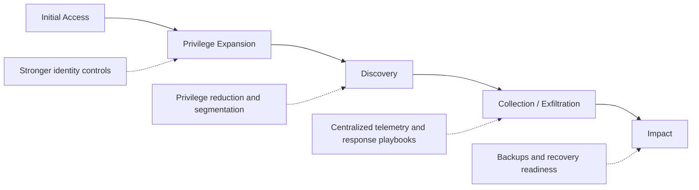
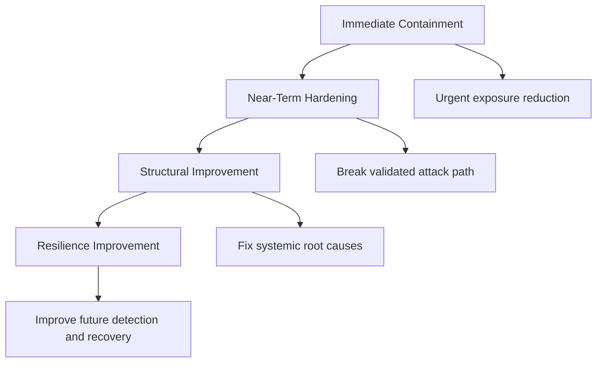
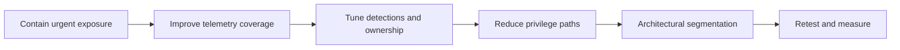
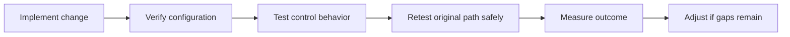

# Remediation Strategy

> **Difficulty:** Beginner → Advanced | **Category:** Red Teaming | **Focus:** Turning Authorized Adversary-Emulation Results Into a Prioritized Security Improvement Roadmap

---

## Table of Contents

1. [Why Remediation Strategy Matters](#1-why-remediation-strategy-matters)
2. [Think in Attack Paths, Not Isolated Findings](#2-think-in-attack-paths-not-isolated-findings)
3. [A Layered Remediation Model](#3-a-layered-remediation-model)
4. [How to Prioritize What to Fix First](#4-how-to-prioritize-what-to-fix-first)
5. [Ownership, Sequencing, and Roadmap Design](#5-ownership-sequencing-and-roadmap-design)
6. [Validation and Retesting](#6-validation-and-retesting)
7. [Common Mistakes and Maturity Growth](#7-common-mistakes-and-maturity-growth)
8. [References](#8-references)

---

## 1. Why Remediation Strategy Matters

A red team engagement creates value only when the organization changes something meaningful afterward. The goal of remediation is **not** to close tickets for every isolated issue. The goal is to make the validated adversary path:

- harder to start
- harder to expand
- easier to detect
- faster to contain
- less damaging if it succeeds

### Beginner view

A finding says:

> “Something was weak.”

A remediation strategy says:

> “Here is the smallest set of changes that most reduces the chance of this campaign succeeding again.”

### Authorized adversary-emulation framing

> **Important:** In red teaming, remediation should be framed around **authorized adversary emulation, defensive improvement, and risk reduction**. The purpose is to improve prevention, detection, response, and resilience — not to teach unauthorized intrusion or reproduce harmful tradecraft step by step.

### Four simple questions every remediation plan should answer

1. What part of the attack path did we prove?
2. Which control could have stopped it earliest?
3. Which control could have detected it fastest?
4. Which changes reduce blast radius even if prevention fails?

---

## 2. Think in Attack Paths, Not Isolated Findings

One of the biggest reporting mistakes is treating remediation like a shopping list of unrelated fixes. Red team remediation works better when it focuses on **path interruption**.

### Why path interruption matters

If one improvement can break three later stages of a campaign, it is usually more valuable than ten narrow fixes applied at the end of the chain.

### Example attack-path thinking

| Campaign stage | What enabled progress | Better remediation question |
|---|---|---|
| initial access | identity weakness or exposed entry point | what would make entry significantly harder? |
| privilege growth | excessive trust or standing access | what would remove unnecessary privilege paths? |
| discovery | weak segmentation or broad visibility | what would limit attacker reach and asset discovery? |
| collection / exfiltration | weak logging, egress visibility, or data controls | what would detect or slow data movement quickly? |
| impact | poor response preparation | what would reduce downtime and recovery complexity? |

### Path-interruption diagram

### A practical mapping table

| Observed outcome | Symptom fix | Strategic fix |
|---|---|---|
| one privileged account was abused | reset that one account | reduce standing admin rights, enforce stronger authentication, review admin paths broadly |
| one sensitive share was reachable | remove one share permission | review data ownership, access models, and segmentation for similar repositories |
| one suspicious action was missed | write one detection rule | improve telemetry coverage and correlation across identity, endpoint, cloud, and network sources |
| one exfiltration path succeeded | block one destination | improve data classification, egress policy, and alerting for suspicious transfer behavior |

> **Key idea:** Strategic remediation fixes the **condition** that allowed the campaign, not only the single artifact seen during the engagement.

---

## 3. A Layered Remediation Model

Strong remediation plans mix fast risk reduction with longer-term architectural improvement.

### The four remediation layers

| Layer | Purpose | Typical time horizon | Examples |
|---|---|---|---|
| immediate containment | reduce urgent exposure quickly | hours to days | rotate credentials, disable exposed accounts, restrict risky paths |
| near-term hardening | block the proven attack path | days to weeks | tighten privilege, improve logging, strengthen identity controls |
| structural improvement | remove repeatable systemic weakness | weeks to months | segmentation redesign, data governance, platform hardening |
| resilience improvement | reduce dwell time and recovery pain next time | ongoing | playbooks, exercises, backup validation, monitoring maturity |

### Control types to balance

| Control type | What it does | Common red-team remediation value |
|---|---|---|
| preventive | stops activity before it succeeds | reduces likelihood |
| detective | reveals activity quickly | reduces attacker dwell time |
| responsive | speeds containment and decision-making | reduces impact duration |
| governance | fixes ownership, standards, and accountability gaps | reduces repeated failure across many systems |

### Layered-remediation model

### Quick wins vs foundational fixes

| Type | Good for | Limitation |
|---|---|---|
| quick win | immediate risk reduction and visible progress | may not solve underlying design issues |
| foundational fix | long-term security improvement across many systems | takes more coordination, time, and budget |

A mature remediation strategy deliberately includes **both**.

---

## 4. How to Prioritize What to Fix First

Prioritization should be understandable to executives and practical for engineering teams.

### Five useful prioritization factors

| Factor | Higher priority when... |
|---|---|
| path criticality | the fix interrupts multiple campaign stages |
| business importance | crown-jewel systems, sensitive data, or privileged identities are involved |
| repeatability | the same weakness likely exists across many systems or teams |
| detection gap | defenders currently have little or no visibility |
| feasibility | the fix can be deployed safely without major delay |

### A simple weighted model

You do not need perfect scoring. You need **consistent scoring**.

| Factor | Weight | Scoring question |
|---|---|---|
| path interruption value | 30% | how much of the campaign does this break? |
| business risk reduction | 25% | how much high-value risk does this remove? |
| implementation feasibility | 20% | how realistic is delivery in the near term? |
| visibility improvement | 15% | how much faster would defenders detect similar activity? |
| breadth of benefit | 10% | does this help one system or many? |

### Example prioritization scorecard

| Candidate remediation | Path value | Business value | Feasibility | Visibility | Breadth | Outcome |
|---|---|---|---|---|---|---|
| strengthen admin authentication | high | high | medium-high | medium | high | immediate priority |
| centralize and correlate telemetry | medium | high | medium | very high | high | immediate / near-term priority |
| redesign network segmentation | high | high | lower | medium | high | structural priority |
| improve playbooks only | lower | medium | high | medium | medium | support priority, not primary fix |

### Practical prioritization rule

Fixes usually deserve top priority when they do **at least two** of the following:

- block early-stage campaign progress
- protect high-value identities or data
- improve detection for multiple techniques
- address a weakness repeated across the environment

---

## 5. Ownership, Sequencing, and Roadmap Design

Good recommendations fail when no team owns them, no dependency is recorded, or no success criteria are defined.

### Every remediation item should have

- a clear owner
- a realistic timeline
- dependencies and prerequisites
- a measurable success condition
- a validation method
- a risk note if implementation is delayed

### Example remediation roadmap matrix

| ID | Remediation action | Primary owner | Time horizon | Dependencies | Success criteria |
|---|---|---|---|---|---|
| REM-01 | strengthen authentication for privileged and remote access paths | IAM / identity team | 2-4 weeks | change window, user communication, exception handling | high-risk access paths require stronger authentication and exceptions are documented |
| REM-02 | centralize telemetry and improve correlation across identity, endpoint, and network data | SOC / security engineering | 4-8 weeks | logging coverage, parser tuning, alert ownership | validated attack-path signals produce actionable alerts within agreed SLA |
| REM-03 | reduce standing privilege and review high-risk administrative groups | IAM + platform owners | 2-6 weeks | role review, approval workflow | privileged membership is reduced, justified, and reviewed on schedule |
| REM-04 | segment crown-jewel systems and administrative planes | infrastructure / architecture | 1-3 months | network design, testing, rollback plan | unauthorized paths are blocked and business traffic still functions safely |
| REM-05 | rehearse response playbooks for the proven attack path | incident response / SOC | 2-4 weeks | scenario design, stakeholder availability | escalation, containment, and communication steps are exercised and timed |

### Sequencing matters

Some fixes are logically upstream of others. For example, better detection content is less effective if logs are not collected centrally. Segmentation changes are risky if application dependencies are not understood first.

### Roadmap design principle

A strong roadmap answers three audiences at once:

| Audience | What they need from the roadmap |
|---|---|
| executives | top priorities, business rationale, sequencing, and investment view |
| engineering teams | exact ownership, scope, dependencies, and implementation window |
| defenders | how validation will prove the path is blocked or detected faster |

### Change-safety guidance

> **Note:** Remediation itself can create operational risk. Authentication, segmentation, logging, and access-control changes should be piloted carefully, coordinated through change management, and paired with rollback planning where appropriate.

---

## 6. Validation and Retesting

A remediation ticket is not truly done when someone marks it complete. It is done when the organization can show that the original red-team path is now:

- blocked earlier
- detected faster
- contained faster
- or significantly reduced in blast radius

### Validation cycle

### Validation methods by control type

| Control type | Validation method | Evidence of success |
|---|---|---|
| preventive | configuration review, policy verification, access testing | the previously viable path no longer works as designed |
| detective | alert testing, telemetry review, purple-team validation | relevant activity produces timely, actionable alerts |
| responsive | tabletop exercises, workflow timing, escalation review | teams know what to do and execute within target time |
| governance | approval records, ownership checks, scheduled reviews | control ownership and review cadence are durable |

### What a strong success statement looks like

Weak statement:

> “Logging was improved.”

Better statement:

> “Identity, endpoint, and network telemetry for the validated campaign path is now collected centrally, correlated, and assigned to an alert owner with a documented escalation procedure.”

Best statement:

> “During retest, activity similar to the original adversary path generated triage-ready alerts within the agreed response window, and the path could no longer progress to sensitive systems without earlier detection or control failure.”

### Useful remediation metrics

| Metric | Why it matters |
|---|---|
| time to detect | shows whether visibility improved |
| time to contain | shows whether response became more effective |
| percentage of privileged access under stronger controls | shows identity hardening progress |
| percentage of critical assets with centralized telemetry | shows coverage maturity |
| number of repeated gap patterns across systems | shows whether remediation is systemic or superficial |

---

## 7. Common Mistakes and Maturity Growth

### Common remediation mistakes

| Mistake | Why it hurts |
|---|---|
| fixing only the final symptom | the same campaign can return through a slightly different path |
| prioritizing only by ease | important systemic issues remain exposed |
| writing vague recommendations | owners cannot implement or measure success |
| ignoring detection and response | prevention eventually fails somewhere |
| skipping retest | the organization does not know whether risk really changed |

### Beginner-to-advanced maturity model

| Maturity level | Typical behavior | Better next step |
|---|---|---|
| beginner | fix individual findings one by one | map each finding to the broader attack path |
| intermediate | prioritize by severity and obvious business risk | add ownership, dependencies, and validation criteria |
| advanced | interrupt paths, reduce systemic weakness, and measure outcomes | integrate remediation into architecture, operations, and recurring exercises |

### What excellent remediation strategy looks like

An excellent remediation strategy does all of the following:

- translates technical findings into business decisions
- prioritizes controls that interrupt multiple stages of the campaign
- balances quick wins with foundational improvements
- assigns owners and timelines clearly
- includes validation, retesting, and metrics
- improves prevention, detection, response, and resilience together

> **Remember:** The best remediation plan is not the longest list of fixes. It is the clearest path to making the same adversary objective much harder, noisier, slower, and less damaging.

---

## 8. References

- [MITRE ATT&CK](https://attack.mitre.org/)
- [NIST SP 800-61 Rev. 2 – Computer Security Incident Handling Guide](https://csrc.nist.gov/pubs/sp/800/61/r2/final)
- [NIST SP 800-115 – Technical Guide to Information Security Testing and Assessment](https://csrc.nist.gov/pubs/sp/800/115/final)
- [OWASP Web Security Testing Guide](https://owasp.org/www-project-web-security-testing-guide/)
- [NIST Cybersecurity Framework](https://www.nist.gov/cyberframework)
