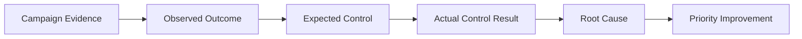
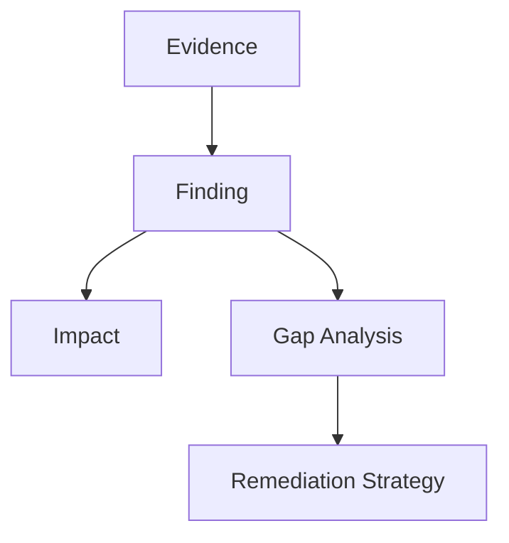
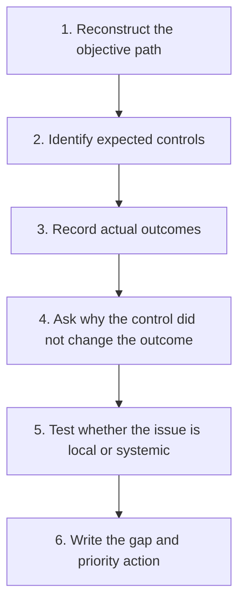
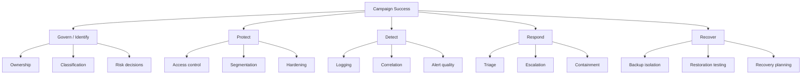
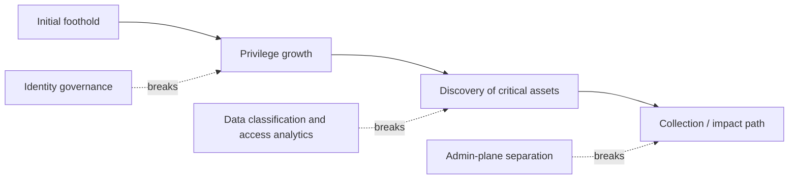
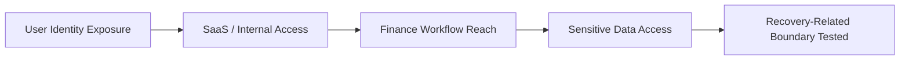
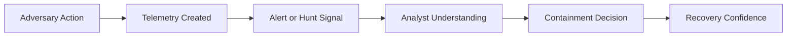

# Security Gap Analysis

> **Difficulty:** Beginner → Advanced | **Category:** Red Teaming | **Focus:** Explaining Which Controls, Processes, and Decisions Allowed an Authorized Adversary Emulation to Reach Its Objectives

> **Authorized-use note:** This note is about analyzing results from approved red team and adversary-emulation engagements. Its purpose is defensive improvement, reporting quality, and control design — not step-by-step intrusion guidance.

---

## Table of Contents

1. [What Security Gap Analysis Means](#1-what-security-gap-analysis-means)
2. [How It Differs From Findings and Remediation](#2-how-it-differs-from-findings-and-remediation)
3. [The Core Workflow](#3-the-core-workflow)
4. [A Practical Gap Taxonomy](#4-a-practical-gap-taxonomy)
5. [Building a Gap Analysis Matrix](#5-building-a-gap-analysis-matrix)
6. [Writing High-Value Gap Statements](#6-writing-high-value-gap-statements)
7. [Prioritizing Systemic Fixes](#7-prioritizing-systemic-fixes)
8. [Worked Authorized Emulation Example](#8-worked-authorized-emulation-example)
9. [Advanced Analysis Techniques](#9-advanced-analysis-techniques)
10. [Common Mistakes](#10-common-mistakes)
11. [References](#11-references)

---

## 1. What Security Gap Analysis Means

A **security gap analysis** explains **why the campaign worked**.

A red team report already has other sections for chronology, evidence, and business consequence:

- **attack timeline** explains *when* major events happened
- **impact analysis** explains *why the outcome matters*
- **remediation strategy** explains *what to change next*
- **security gap analysis** explains *which defenses, decisions, and operating assumptions allowed the path to remain viable*

In other words, this section is the bridge between:

- **observed adversary success**, and
- **systemic defensive improvement**

A beginner-friendly way to think about it is:

> A finding says **what happened**. A gap analysis says **what should have stopped, detected, or contained it — and why that did not happen**.

### Questions this section should answer

A strong gap analysis usually answers questions such as:

- Which control function failed: **govern, identify, protect, detect, respond, or recover**?
- Was the issue a **missing control**, a **weak control**, a **misconfigured control**, or a **control that existed but was not operationalized**?
- Was the weakness primarily about **people, process, technology, architecture, or governance**?
- Would one fix interrupt only one event, or **multiple stages of the attack path**?
- Did defenders miss the activity entirely, see it but not understand it, or respond too slowly to matter?

### The main goal

The real goal is not to produce more words. The goal is to help the client move from:

- “we missed an alert”

to:

- “our identity, logging, and escalation design made this entire path too easy to repeat.”

---

## 2. How It Differs From Findings and Remediation

These sections are closely related, so they are often mixed together. Keeping them separate makes the report clearer.

| Section | Main question | Typical output |
|---|---|---|
| finding / evidence | what was observed or proven? | screenshots, logs, system names, proof of access |
| attack timeline | when and in what sequence did it happen? | chronological narrative |
| impact analysis | why does the outcome matter? | business consequence and risk framing |
| security gap analysis | what allowed the path to succeed? | control failure and root-cause explanation |
| remediation strategy | what should the client do next? | prioritized actions, owners, validation plan |

### Simple example

| Reporting element | Example |
|---|---|
| finding | the authorized emulation team reached a sensitive finance share |
| impact | financial records and approval workflows could have been exposed |
| security gap | access governance and identity monitoring did not restrict or flag the path |
| remediation | reduce standing access, add identity-to-data correlation, validate with retest |

### A useful mental model

A report becomes much easier to use when each section does one job well.

---

## 3. The Core Workflow

A practical security gap analysis can be built in six repeatable steps.

### Step 1: Reconstruct the objective path

Start from the campaign story, not from isolated evidence.

Useful inputs include:

- operator notes
- timeline milestones
- blue-team detection timestamps
- systems reached
- identities used during the exercise
- approved proof-of-objective artifacts

You are trying to answer:

- Which stages actually mattered?
- Which actions changed the campaign outcome?
- Which parts were noise and should stay out of the gap section?

### Step 2: Identify the expected controls

For each meaningful stage, ask what *should reasonably* have helped.

Examples:

- **governance**: ownership, policy, approval workflow, asset classification
- **preventive controls**: MFA, segmentation, least privilege, application allowlisting
- **detective controls**: SIEM rules, identity analytics, EDR alerts, SaaS telemetry correlation
- **response controls**: triage playbooks, escalation paths, containment authority
- **recovery controls**: backup isolation, restoration testing, recovery decision-making

### Step 3: Record actual outcomes

Do not jump straight to blame. First, describe what really happened.

Useful outcome labels:

| Outcome label | Meaning |
|---|---|
| prevented | the control stopped the action |
| detected | the action occurred, but defenders observed it clearly |
| delayed | the action succeeded, but the control slowed it materially |
| contained | the action occurred, but the blast radius was limited |
| missed | no meaningful interruption or visibility was observed |
| ambiguous | evidence is incomplete; avoid overclaiming |

These labels improve precision. “Monitoring failed” is vague. “Activity was logged but not escalated” is much better.

### Step 4: Ask why

Once you know the expected control and the actual outcome, ask why the gap existed.

Good “why” questions include:

- Was the control absent, or present but weak?
- Was the control deployed broadly enough?
- Was the telemetry available but not correlated?
- Was an alert generated but not triaged correctly?
- Did ownership confusion delay action?
- Did a business exception quietly become permanent risk?

### Step 5: Decide whether the issue is local or systemic

A local issue affects one host, one app, or one team.
A systemic issue affects a **class of assets**, a **shared process**, or a **cross-environment design decision**.

| If the issue appears in... | It is more likely to be... |
|---|---|
| one isolated server | local |
| many privileged identities | systemic |
| one dashboard misconfiguration | local to regional/system setup |
| all SaaS logging pipelines | systemic |
| one forgotten share | local |
| lack of data ownership across business units | systemic |

### Step 6: Write the gap statement and action direction

At the end of the workflow, each important gap should be expressible in one or two strong sentences:

- what failed
- why that mattered
- what kind of correction has the highest leverage

---

## 4. A Practical Gap Taxonomy

Gap analysis gets much stronger when you classify issues consistently.

### A. Classify by control function

The NIST CSF 2.0 view is especially useful here because it keeps the analysis bigger than any single tool.

| Control function | What it asks | Example gap theme |
|---|---|---|
| govern | were expectations, ownership, and accountability defined? | privileged access exceptions existed without review discipline |
| identify | did the organization know what data, systems, and trust paths mattered? | crown-jewel mapping was incomplete |
| protect | should the path have been blocked earlier? | standing access was broader than necessary |
| detect | should defenders have seen high-signal activity? | identity and proxy telemetry were not correlated |
| respond | did the team investigate and act quickly enough? | alerts were triaged but not escalated decisively |
| recover | could the organization restore safely after impact? | backup administration was not sufficiently separated |

### B. Classify by root-cause layer

| Root-cause layer | What it usually looks like |
|---|---|
| people | unclear skills, overloaded teams, or training gaps |
| process | weak review workflow, unclear escalation, untested playbooks |
| technology | tool misconfiguration, missing data source, broken integration |
| architecture | trust boundaries too flat, poor separation of planes, risky defaults |
| governance | no owner, no control standard, no risk acceptance record |

### C. Classify by control condition

| Control condition | Meaning |
|---|---|
| missing | the control does not exist |
| partial | the control exists only in some systems or teams |
| misconfigured | the control exists but is set incorrectly |
| unintegrated | the control works alone but not together with other data sources |
| unvalidated | the control is assumed to work, but has not been tested |
| unenforced | policy exists, but exceptions or drift make it ineffective |

### Two-dimensional thinking

The best gap statements often combine **function** and **layer**.

Example:

> “This was not only a detective gap. It was a detective gap caused by a process and governance weakness: the organization collected relevant logs, but there was no enforced workflow for correlating identity risk with access to sensitive data locations.”

---

## 5. Building a Gap Analysis Matrix

A good matrix prevents vague reporting. It forces each important observation into a consistent structure.

### Recommended columns

| Column | Why it matters |
|---|---|
| campaign phase | keeps the analysis tied to the actual path |
| objective reached or attempted | shows attacker intent in business terms |
| expected control | states what should have helped |
| actual outcome | prevented, detected, delayed, contained, missed, ambiguous |
| gap type | preventive, detective, responsive, governance, recovery |
| root cause | the deeper explanation |
| business effect | why leaders should care |
| likely owner | who must act |
| priority | what should move first |

### Practical example matrix

| Campaign phase | Objective reached | Expected control | Actual outcome | Gap type | Root cause | Business effect | Likely owner | Priority |
|---|---|---|---|---|---|---|---|---|
| initial access follow-on | risky identity used beyond normal pattern | identity risk policy and session controls | delayed visibility only | protect / detect | conditional access not tuned to risk context | foothold remained usable too long | IAM + SOC | high |
| internal discovery | sensitive data locations identified | asset and data classification | missed | identify / govern | incomplete crown-jewel mapping | defenders could not prioritize truly critical paths | security architecture + data owners | high |
| privilege expansion | access extended into admin workflow | least privilege and approval review | missed | protect | standing privilege and weak review cycle | blast radius expanded | IAM | critical |
| collection | sensitive repository accessed | data access monitoring | logged but not escalated | detect | telemetry existed without meaningful correlation | suspicious access blended into normal activity | SOC + data platform | high |
| impact resilience | backup-related plane reachable | admin-plane separation and recovery safeguards | partially contained | recover / architecture | insufficient separation of duties and trust boundaries | recovery confidence reduced | infrastructure + resilience team | critical |

### Template you can reuse

| Phase | Objective | Expected control | Actual outcome | Gap type | Root cause | Evidence ref | Owner | Priority |
|---|---|---|---|---|---|---|---|---|
|  |  |  |  |  |  |  |  |  |

### Important rule

One row should represent **one meaningful control lesson**, not every technical action.

That keeps the matrix readable for:

- security engineering
- SOC leadership
- identity teams
- executives reviewing priority themes

---

## 6. Writing High-Value Gap Statements

Weak gap statements are generic. Strong gap statements are specific, fair, and useful.

### Weak statement

> “Monitoring needs improvement.”

### Better statement

> “The organization collected endpoint and identity telemetry, but did not consistently correlate those signals with access to sensitive repositories, allowing the emulation path to continue without a high-confidence investigation.”

### Strong statement

> “The engagement showed a systemic detective gap in cross-domain telemetry correlation. Although endpoint, identity, and repository access events were logged, the organization lacked a workflow and analytic logic for combining them into an escalated high-risk case. As a result, suspicious access to sensitive data looked like separate low-priority events rather than one coherent campaign.”

### A reliable formula

A high-value gap statement often follows this pattern:

> **Because** `[control condition or design weakness]`, the organization could not reliably `[prevent / detect / respond / recover]` when `[campaign event]` occurred, which allowed `[meaningful outcome]`. This points to a broader issue in `[governance / process / architecture / technology]` and should be prioritized through `[high-leverage correction]`.

### Checklist for strong wording

A strong statement usually includes:

- the **control function** that underperformed
- the **observed consequence**
- the **scope** of the weakness
- whether the weakness is **local or systemic**
- a **direction** for remediation, even if the detailed roadmap lives elsewhere

### Avoid these common wording problems

| Weak wording pattern | Why it is weak | Better approach |
|---|---|---|
| “security was weak” | too broad, not actionable | name the failed function and scope |
| “the SOC missed the attack” | may oversimplify blame | explain whether logging, detection logic, triage, or escalation failed |
| “MFA should be enabled” | may be true but incomplete | explain where risk-based access control and session enforcement were insufficient |
| “segment the network” | too generic | specify which trust boundary mattered and why |
| “users need more training” | often lazy root cause analysis | show whether the real problem was governance, approval design, or detection coverage |

### A note on tone

A red team report should be direct, but not accusatory.

Bad tone:

- “The security team failed to notice obvious malicious activity.”

Better tone:

- “The activity did not trigger a response outcome proportional to its risk because telemetry correlation and escalation criteria were not mature enough for this scenario.”

That style keeps the report professional and focused on improvement.

---

## 7. Prioritizing Systemic Fixes

The best gap analyses do not just list weaknesses. They help the client decide what to fix first.

### Think in terms of path interruption

A single high-leverage change can disrupt multiple later stages.

### Practical prioritization factors

| Factor | Higher priority when... |
|---|---|
| path leverage | one change breaks several stages of the campaign |
| crown-jewel proximity | the weakness touches critical identities, data, or recovery systems |
| repeatability | the condition likely exists in many places, not one exception |
| visibility deficit | defenders currently have little confidence they would see it next time |
| blast radius | a failure enables access across teams, domains, or business units |
| implementation realism | the action can be owned and validated within a reasonable timeframe |

### A simple scoring model

You do not need a complicated formula. A practical approach is to rate each gap from 1 to 5 on:

- **campaign leverage**
- **business criticality**
- **repeatability**
- **detection weakness**
- **implementation feasibility**

This produces a prioritized order that is easier to defend than “it just felt important.”

### Group actions by time horizon

| Time horizon | Goal | Typical examples |
|---|---|---|
| immediate | reduce urgent exposure now | tighten access, review active exceptions, improve watchlists |
| near-term | break the validated path | improve correlation, remove unnecessary standing privilege, refine trust boundaries |
| structural | prevent future similar paths | architecture redesign, data ownership model, control-plane separation |
| validation | prove the fix works | targeted retest, purple-team detection validation, tabletop review |

### What to prioritize first

In most mature reports, the highest-value recommendations are the ones that:

1. break the attack path earlier
2. apply across many systems or identities
3. improve both **prevention** and **detection**
4. can be validated after implementation

---

## 8. Worked Authorized Emulation Example

> **Scenario note:** The example below stays at the reporting and control-analysis level. It intentionally avoids procedural intrusion detail.

Imagine an approved adversary-emulation exercise where the team:

- validated use of a risky user identity in a controlled scenario
- reached a sensitive finance workflow
- accessed a repository containing high-value business data
- demonstrated potential reach toward backup administration boundaries

### Campaign summary diagram

### Step 1: Identify what mattered most

Not every logged event belongs in the gap section. The important milestones are the ones that changed the mission outcome.

| Milestone | Why it matters |
|---|---|
| risky identity remained usable | shows preventive and detective opportunity |
| sensitive business workflow reached | shows business relevance |
| data repository accessed | shows confidentiality impact |
| recovery-related boundary approached | shows resilience implications |

### Step 2: Convert milestones into control lessons

| Milestone | Expected control outcome | Actual result | Security gap |
|---|---|---|---|
| risky identity use | session risk controls should challenge or limit access | activity remained usable too long | identity protection policy was not sufficiently risk-aware |
| finance workflow reach | privileged access should require stronger review and narrower entitlements | path succeeded without meaningful friction | excessive standing access and weak entitlement governance |
| sensitive data access | data location should be classified and monitored with high signal | logs existed but did not become an escalated case | data monitoring was not integrated with identity context |
| recovery-boundary testing | backup and admin planes should be clearly separated | boundary was closer than intended | resilience architecture and separation-of-duties design need strengthening |

### Step 3: Extract the real root causes

At this point, the report should go deeper than “tool X missed event Y.”

Better root-cause themes might be:

- critical business data was not mapped clearly enough to drive monitoring priority
- access review focused on entitlement ownership, but not on attack-path consequence
- telemetry existed in separate systems without strong correlation logic
- recovery-related administration was hardened, but not isolated enough from adjacent trust paths

### Step 4: Write executive-ready gap statements

#### Example gap statement 1

> “The exercise revealed a systemic identity governance gap: privileged and business-sensitive access paths were broader and more durable than required for normal operations, allowing a controlled adversary path to progress from user-level access to sensitive workflows with limited resistance.”

#### Example gap statement 2

> “The organization’s logging posture was not absent, but its detective workflow was fragmented. Relevant identity, access, and repository events were available, yet they were not combined into a high-confidence signal tied to sensitive data access.”

#### Example gap statement 3

> “Recovery resilience depended on controls that were individually present but not architecturally separated enough from the tested trust path, reducing confidence that a determined adversary would be contained before affecting recovery operations.”

### Step 5: Prioritize the fixes

From this scenario, the highest-leverage actions are likely:

1. stronger identity governance for privileged and sensitive access
2. better crown-jewel mapping for finance and recovery-related systems
3. telemetry correlation across identity, data, and admin activity
4. clearer separation between production, administrative, and recovery planes

That is what makes gap analysis valuable: it transforms a campaign story into a **defensive investment story**.

---

## 9. Advanced Analysis Techniques

Once the basics are in place, advanced analysts make the section far more useful by adding structure and measurement.

### 1. Distinguish missing, weak, and unvalidated controls

These are not the same problem.

| Condition | Meaning | Why it matters |
|---|---|---|
| missing | no meaningful control existed | likely needs design and funding |
| weak | control existed but underperformed | may need tuning or broader deployment |
| unvalidated | control was assumed effective without realistic testing | often a maturity and assurance issue |

### 2. Measure latency, not just existence

A control can exist and still fail operationally.

Useful timing questions:

- **detection latency:** how long before defenders noticed?
- **decision latency:** how long before someone understood the significance?
- **containment latency:** how long before meaningful action was taken?
- **recovery latency:** how long before the organization could restore confidence?

If a report says “an alert fired,” but that alert did not materially change the outcome, the gap may still be serious.

### 3. Use framework mapping carefully

Framework mapping helps communication, but it should support the analysis rather than replace it.

| Framework | Good use in gap analysis |
|---|---|
| MITRE ATT&CK | map campaign behavior and explain where along the path controls underperformed |
| MITRE D3FEND | think about defensive design options at a conceptual level |
| NIST CSF 2.0 | classify gaps by govern, identify, protect, detect, respond, recover |
| NIST SP 800-53 Rev. 5 | tie strategic gaps to control families and assurance expectations |
| CISA CPGs | compare major weaknesses against practical baseline outcomes |

### 4. Look for assumption gaps

Some of the most important issues are not technical misconfigurations. They are **bad assumptions**.

Examples:

- “This system is not business critical.”
- “That account is rarely used, so it is low risk.”
- “If logs exist, the SOC will see the issue.”
- “Backups are protected because they require separate credentials.”

Gap analysis becomes more strategic when it exposes these assumptions explicitly.

### 5. Highlight what worked too

A mature gap analysis is not a list of failures only.

If segmentation slowed movement, if a review process blocked one branch of the path, or if a responder recognized suspicious behavior late but correctly, say so.

That helps the client:

- preserve useful controls
- tune working processes rather than replacing them blindly
- understand where the security program already has momentum

### 6. Track recurrence across engagements

One campaign can be unlucky. Repeated patterns are harder to dismiss.

If the same themes appear across exercises, assessments, or incidents, call that out.

Examples of recurring patterns:

- privileged access broader than operational need
- weak ownership of sensitive data stores
- incomplete SaaS logging integration
- slow escalation for cross-domain events
- insufficient isolation of recovery administration

That is often the moment when a “finding” becomes a **program-level issue**.

---

## 10. Common Mistakes

### 1. Repeating the timeline instead of analyzing it

A gap section should not read like a second timeline. It should explain *why controls did not change the outcome*.

### 2. Confusing one alert miss with the whole problem

Sometimes the missed alert is only the last visible symptom. The deeper issue may be identity design, ownership confusion, or lack of monitoring around sensitive assets.

### 3. Writing recommendations inside every sentence

The section should point toward remediation, but it should still remain an analysis section. Do not let it turn into a disorganized fix list.

### 4. Blaming users or analysts too quickly

Human error matters, but many “human failures” are actually process or architecture failures in disguise.

### 5. Overstating what was proven

Say what the engagement demonstrated, what was strongly implied, and what remains an informed hypothesis. Precision increases credibility.

### 6. Ignoring recovery and resilience

Red team reporting often over-focuses on prevention and detection. If the campaign touched backup trust boundaries, administrative planes, or business continuity assumptions, the recovery side matters too.

### 7. Producing generic language

If the same paragraph could fit any client, it is not specific enough.

### A final quality test

Before finalizing the section, ask:

- Could an executive understand the top three gaps?
- Could a technical owner tell what kind of control failed?
- Could a program manager assign ownership and validation steps?
- Does the section explain why the path succeeded, not just that it succeeded?

If the answer is yes, the gap analysis is doing its job.

---

## 11. References

- [MITRE ATT&CK](https://attack.mitre.org/)
- [MITRE D3FEND](https://d3fend.mitre.org/)
- [NIST Cybersecurity Framework 2.0](https://www.nist.gov/cyberframework)
- [NIST SP 800-53 Rev. 5](https://csrc.nist.gov/publications/detail/sp/800-53/rev-5/final)
- [NIST SP 800-61 Rev. 2](https://csrc.nist.gov/publications/detail/sp/800-61/rev-2/final)
- [CISA Cybersecurity Performance Goals](https://www.cisa.gov/cybersecurity-performance-goals)
