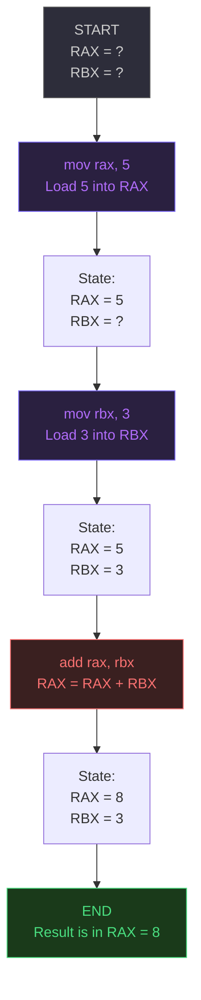

# x86-64 Registers — Complete Beginner's Guide

> **Who this is for:** Anyone starting out in assembly language, reverse engineering, or low-level cybersecurity. No prior knowledge assumed.

---

## Table of Contents

- [What Are CPU Registers?](#what-are-cpu-registers)
- [Register Size Evolution](#register-size-evolution)
- [Register Overlapping](#register-overlapping)
- [x86-64 General Purpose Registers](#x86-64-general-purpose-registers)
- [Practical Example](#practical-example)
- [Cheat Sheet](#cheat-sheet)

---

## What Are CPU Registers?

### The Problem Registers Solve

When a CPU performs operations — adding two numbers, comparing values, running a loop — it needs somewhere to hold data temporarily. That somewhere is **not** RAM (main memory). Here's why:

- RAM holds gigabytes of data but sits physically far from the CPU
- Accessing RAM takes **hundreds of CPU cycles**
- Registers are built directly into the processor chip itself
- Reading or writing a register takes just **1 CPU cycle**

For a CPU running at 3+ GHz, the difference between 1 cycle and 300 cycles is enormous at scale.

### What a Register Actually Is

A **register** is a named, fixed-size storage slot built into the CPU. Think of it like a small labeled box sitting right on the processor's desk.

```
CPU (the "desk")
┌─────────────────────────────────────────┐
│  ┌──────┐  ┌──────┐  ┌──────┐           │
│  │ RAX  │  │ RBX  │  │ RCX  │  ...16x   │
│  └──────┘  └──────┘  └──────┘           │
│         General Purpose Registers       │
│                                         │
│  ┌──────┐                               │
│  │ RIP  │  ← Instruction Pointer        │
│  └──────┘                               │
└─────────────────────────────────────────┘
```

### Key Properties of Registers

- **Volatile** — data is lost when the CPU stops using it (or the machine powers off)
- **Fixed size** — each register has a defined width (8, 16, 32, or 64 bits)
- **Named** — you refer to them by name in assembly code (e.g. `rax`, `rbx`)
- **Fast** — the fastest accessible storage on a computer

### Registers vs. Memory: A Quick Comparison

| Storage | Location | Speed | Capacity |
|---|---|---|---|
| Registers | Inside the CPU | ~1 cycle | 16 × 64-bit slots |
| CPU Cache (L1) | On the CPU chip | ~4 cycles | 32–128 KB |
| RAM | Motherboard | ~100–300 cycles | GBs |
| SSD/HDD | Storage drive | Thousands of cycles | TBs |

> **Analogy:** Registers are like the sticky notes on your monitor — only a few, but instantly accessible. RAM is the filing cabinet across the room. Your hard drive is a warehouse in another building.

---

## Register Size Evolution

Intel didn't design x86-64 from scratch. Each CPU generation **extended** the previous one, keeping backward compatibility. This is why modern register names have strange prefixes.

### The Journey: One Register Family's History

Take the "A" register as an example. It started small and grew with each CPU generation:

```
8-bit (Intel 8008 — 1970s)
┌────────┐
│   AL   │  bits 7–0
└────────┘

16-bit (Intel 8086 — 1978)
┌────────┬────────┐
│   AH   │   AL   │  = AX  (bits 15–0)
└────────┴────────┘

32-bit (Intel 80386 — 1985)
┌─────────────────┬────────┬────────┐
│   (upper 16)    │   AH   │   AL   │  = EAX  (bits 31–0)
└─────────────────┴────────┴────────┘

64-bit (AMD64 / Intel EM64T — 2003+)
┌──────────────────────────────────┬─────────────────┬────────┬────────┐
│          (upper 32 bits)         │   (upper 16)    │   AH   │   AL   │
└──────────────────────────────────┴─────────────────┴────────┴────────┘
= RAX  (bits 63–0)
```

### What the Prefixes Mean

| Register | Era | Width | Name Origin |
|---|---|---|---|
| `AL` / `AH` | 8008 (1970s) | 8-bit | A Low / A High |
| `AX` | 8086 (1978) | 16-bit | A eXtended |
| `EAX` | 80386 (1985) | 32-bit | **E**xtended AX |
| `RAX` | AMD64 (2003+) | 64-bit | **R**eally-wide AX (colloquially) |

> The `E` prefix means "Extended" (32-bit). The `R` prefix means 64-bit. This same pattern applies to all the classic registers: `BX → EBX → RBX`, `CX → ECX → RCX`, etc.

### Why Does This Matter for Reverse Engineering?

When you disassemble real-world binaries, you'll encounter all four register widths. A 64-bit program might use `eax` (32-bit) to write a result, which simultaneously affects `rax`. Understanding this overlap is essential for reading and analyzing compiled code.

---

## Register Overlapping

This is one of the most important — and most confusing — concepts in x86 assembly.

### The Core Idea

The smaller register names (`eax`, `ax`, `ah`, `al`) are **not separate registers**. They are different-sized windows into the **same physical storage slot**.

```
RAX — the full 64-bit register
╔═══════════════════════════════════════════════════════════════════╗
║  bit 63                                                   bit 0  ║
║  ┌──────────────────────────────────┬──────────────────────────┐ ║
║  │         upper 32 bits            │          EAX             │ ║
║  └──────────────────────────────────┴──────────────────────────┘ ║
║                                      ┌───────────┬──────────────┐║
║                                      │  (upper)  │      AX      │║
║                                      └───────────┴──────────────┘║
║                                                  ┌────┬──────────┐║
║                                                  │ AH │    AL    │║
║                                                  └────┴──────────┘║
╚═══════════════════════════════════════════════════════════════════╝

Bit ranges:
  RAX = bits 63–0  (64 bits)
  EAX = bits 31–0  (32 bits, lower half of RAX)
   AX = bits 15–0  (16 bits, lower quarter of RAX)
   AH = bits 15–8  ( 8 bits, high byte of AX)
   AL = bits  7–0  ( 8 bits, low byte of AX)
```

### What Happens When You Write to a Sub-Register?

Writing to a smaller register **modifies** the corresponding bits of the larger register. This has important side effects:

```asm
mov rax, 0xFFFFFFFFFFFFFFFF   ; RAX = 0xFFFFFFFFFFFFFFFF (all 1s)
mov al, 0x00                  ; Write 0 into the low 8 bits (AL)
; Now RAX = 0xFFFFFFFFFFFFFF00
; EAX = 0xFFFFFF00
; AX  = 0xFF00
; AH  = 0xFF
; AL  = 0x00
```

> **Special case for 32-bit writes:** Writing to `EAX` **zero-extends** into the upper 32 bits of `RAX`. This is a quirk of the x86-64 design — writing to `AX` or `AL` does NOT zero-extend; it only changes the relevant bits.

```asm
mov rax, 0xFFFFFFFFFFFFFFFF
mov eax, 0x00000001           ; 32-bit write ZERO-EXTENDS into upper 32 bits
; RAX is now 0x0000000000000001, not 0xFFFFFFFF00000001
```

### The Same Pattern Applies to All "Classic" Registers

| 64-bit | 32-bit | 16-bit | 8-bit high | 8-bit low |
|---|---|---|---|---|
| `RAX` | `EAX` | `AX` | `AH` | `AL` |
| `RBX` | `EBX` | `BX` | `BH` | `BL` |
| `RCX` | `ECX` | `CX` | `CH` | `CL` |
| `RDX` | `EDX` | `DX` | `DH` | `DL` |
| `RSI` | `ESI` | `SI` | — | `SIL` |
| `RDI` | `EDI` | `DI` | — | `DIL` |
| `RSP` | `ESP` | `SP` | — | `SPL` |
| `RBP` | `EBP` | `BP` | — | `BPL` |

> Note: `RSI`, `RDI`, `RSP`, and `RBP` do **not** have an "H" (high byte) variant — only the original four (`RAX`, `RBX`, `RCX`, `RDX`) do.

---

## x86-64 General Purpose Registers

x86-64 has **16 general purpose registers** plus the special instruction pointer. Here is each one explained:

> These are Intel's *conventional* purposes — compilers and the OS follow these conventions, but technically most registers can hold any value.

---

### RAX — Accumulator / Return Value

**Purpose:** The primary arithmetic register. More importantly, it is the standard location for **function return values**.

**When you'll see it:**
- After calling any function, the return value is in `RAX`
- Division results (quotient goes into `RAX`)
- General arithmetic

```asm
; Calling a function — result lands in RAX
call strlen          ; returns length of string
; RAX now contains the string length

; Arithmetic
mov rax, 100
add rax, 50          ; RAX = 150
```

---

### RBX — Base Register

**Purpose:** Historically a "base pointer" to a data section. In modern compiled code it often holds general-purpose values that need to survive across function calls (it's "callee-saved").

```asm
mov rbx, [data_array]   ; point RBX at the start of an array
mov rax, [rbx + 8]      ; read the second element (offset 8 bytes)
```

---

### RCX — Counter Register

**Purpose:** Used as a **loop counter** and in string/memory operations. When you see a counted loop in disassembled code, look for `RCX`.

```asm
mov rcx, 10          ; set loop counter to 10

loop_start:
    ; ... do something ...
    dec rcx          ; decrement counter
    jnz loop_start   ; jump if not zero → loop 10 times
```

---

### RDX — Data / I/O Register

**Purpose:** Used as a secondary register in I/O operations, and as a second register in division (`DIV`/`IDIV`). When dividing a 128-bit value by 64-bit, the upper 64 bits of the dividend go in `RDX`.

```asm
mov rax, 17
mov rdx, 0           ; zero out RDX (upper half of dividend)
mov rbx, 5
div rbx              ; divide RDX:RAX by RBX
; quotient  → RAX = 3
; remainder → RDX = 2
```

---

### RSI — Source Index

**Purpose:** Points to the **source** address in memory copy operations. Used with string instructions like `MOVSB` (move string byte).

```asm
; Copy 8 bytes from [source] to [dest]
lea rsi, [source]    ; RSI = address to read FROM
lea rdi, [dest]      ; RDI = address to write TO
mov rcx, 8           ; number of bytes
rep movsb            ; repeat move-byte 8 times
```

---

### RDI — Destination Index

**Purpose:** Points to the **destination** address in memory copy/set operations. Always paired with `RSI`.

> In the **Linux 64-bit calling convention**, `RDI` holds the **first argument** passed to a function. This is crucial for reverse engineering Linux binaries.

```asm
; In Linux x86-64, function args are passed as:
; 1st arg → RDI
; 2nd arg → RSI
; 3rd arg → RDX

; Example: write(fd=1, buf, len)
mov rdi, 1           ; fd = 1 (stdout)
lea rsi, [message]   ; buf = pointer to message
mov rdx, 13          ; len = 13 bytes
mov rax, 1           ; syscall number for write
syscall
```

---

### RSP — Stack Pointer

**Purpose:** Always points to the **top of the stack**. The stack is a region of memory used for function calls, local variables, and saving registers.

> **⚠️ Warning:** Do not modify `RSP` carelessly. Corrupting the stack pointer causes crashes and is a common exploit technique (stack overflow, ROP chains).

```asm
push rax     ; RSP decreases by 8 (stack grows downward), value of RAX stored
pop  rbx     ; value popped from stack into RBX, RSP increases by 8
```

The stack grows **downward** in memory — when you `push` something, `RSP` gets smaller.

```
High address  ┌────────────┐
              │            │  ← before push: RSP points here
              ├────────────┤
              │  RAX value │  ← after push:  RSP points here
Low address   └────────────┘
```

---

### RBP — Base Pointer / Frame Pointer

**Purpose:** Points to the **base of the current function's stack frame**. Used to access local variables and function parameters at known, stable offsets.

This is why you'll see patterns like `[rbp - 8]` (a local variable) and `[rbp + 16]` (a function argument) in disassembled code.

```asm
; Typical function prologue
push rbp             ; save caller's base pointer
mov  rbp, rsp        ; set our frame base = current stack top

; Access a local variable
mov rax, [rbp - 8]   ; first local variable
mov rbx, [rbp - 16]  ; second local variable

; Typical function epilogue
pop rbp              ; restore caller's base pointer
ret
```

---

### RIP — Instruction Pointer

**Purpose:** Holds the **memory address of the next instruction** to execute. The CPU automatically updates `RIP` after every instruction.

> **Why this matters for security:** Controlling `RIP` means controlling what code the CPU executes next. Exploits like buffer overflows and ROP chains work by overwriting `RIP` to redirect execution to attacker-controlled code.

```asm
; You can't write to RIP directly in normal code:
; mov rip, 0x401000   ← this is NOT valid

; But jump/call instructions implicitly change RIP:
jmp 0x401000         ; RIP = 0x401000
call some_function   ; pushes return address, RIP = address of some_function
ret                  ; pops return address into RIP
```

---

### The "New" Registers: R8 Through R15

When AMD extended x86 to 64-bit, they added 8 brand-new registers: `R8` through `R15`. These follow a simple, logical naming pattern:

| 64-bit | 32-bit | 16-bit | 8-bit |
|---|---|---|---|
| `R8` | `R8D` | `R8W` | `R8B` |
| `R9` | `R9D` | `R9W` | `R9B` |
| `R10` | `R10D` | `R10W` | `R10B` |
| ... | ... | ... | ... |
| `R15` | `R15D` | `R15W` | `R15B` |

**Suffix meaning:**
- No suffix → 64-bit
- `D` → 32-bit (Double-word)
- `W` → 16-bit (Word)
- `B` → 8-bit (Byte)

In the Linux 64-bit calling convention, `R8` and `R9` hold the **5th and 6th function arguments**.

---

## Practical Example

Let's trace a simple addition program instruction by instruction to see exactly what happens inside the registers.

### The Program

```asm
section .text
global _start

_start:
    mov rax, 5       ; instruction 1
    mov rbx, 3       ; instruction 2
    add rax, rbx     ; instruction 3
    ; result: RAX = 8
```

### Step-by-Step Execution Flow



### What Each Instruction Does

**Instruction 1: `mov rax, 5`**
- `mov` means "copy this value into this register"
- The literal number `5` is written into `RAX`
- Nothing else changes
- `RIP` advances to the next instruction

**Instruction 2: `mov rbx, 3`**
- Same idea: the literal number `3` is written into `RBX`
- `RAX` is untouched, still holds `5`
- `RIP` advances again

**Instruction 3: `add rax, rbx`**
- `add` reads both operands, adds them, and stores the result in the **first operand** (`RAX`)
- `RAX = RAX + RBX = 5 + 3 = 8`
- `RBX` is unchanged — it was only read, not written
- `RAX` now holds the result `8`

### Register State at Each Step

| Step | Instruction | RAX | RBX | Notes |
|---|---|---|---|---|
| 0 | (start) | unknown | unknown | Nothing initialized |
| 1 | `mov rax, 5` | **5** | unknown | RAX loaded |
| 2 | `mov rbx, 3` | 5 | **3** | RBX loaded |
| 3 | `add rax, rbx` | **8** | 3 | RAX overwritten with sum |

> **Note:** In real compiled programs, the CPU would be executing millions of such instructions per second, with `RIP` incrementing continuously to point to whatever comes next.

---

## Cheat Sheet

### Register Quick Reference

| Register | Role | Key Usage |
|---|---|---|
| `RAX` | Accumulator / Return value | Function return values, arithmetic |
| `RBX` | Base register | General purpose, callee-saved |
| `RCX` | Counter | Loop counters, string operations |
| `RDX` | Data / I/O | Division remainder, I/O ops |
| `RSI` | Source index | Memory copy source; Linux arg 2 |
| `RDI` | Destination index | Memory copy dest; Linux arg 1 |
| `RSP` | Stack pointer | Top of stack — handle with care |
| `RBP` | Frame base pointer | Local variable access `[rbp±n]` |
| `RIP` | Instruction pointer | Next instruction — key for exploits |
| `R8`–`R15` | Extra GPRs | Linux args 5–6 (`R8`, `R9`), general use |

### Sub-Register Sizes (Using RAX as Template)

| Name | Bits | Width |
|---|---|---|
| `RAX` | 63–0 | 64-bit |
| `EAX` | 31–0 | 32-bit |
| `AX` | 15–0 | 16-bit |
| `AH` | 15–8 | 8-bit (high) |
| `AL` | 7–0 | 8-bit (low) |

### Size Suffix Reference (R8–R15 Family)

| Suffix | Width | Example |
|---|---|---|
| none | 64-bit | `R8` |
| `D` | 32-bit | `R8D` |
| `W` | 16-bit | `R8W` |
| `B` | 8-bit | `R8B` |

### Linux x86-64 Function Calling Convention (Syscall Args)

| Argument | Register |
|---|---|
| 1st | `RDI` |
| 2nd | `RSI` |
| 3rd | `RDX` |
| 4th | `RCX` |
| 5th | `R8` |
| 6th | `R9` |
| Return value | `RAX` |

---

## Further Reading

- [Intel 64 and IA-32 Architectures Software Developer's Manual](https://www.intel.com/content/www/us/en/developer/articles/technical/intel-sdm.html)
- [x64 ABI calling conventions (Microsoft)](https://docs.microsoft.com/en-us/cpp/build/x64-software-conventions)

---

*Derived from Xeno Kovah's "Architecture 1001: x86-64 Assembly" class, available at https://ost.fyi — licensed CC BY-SA 4.0*
