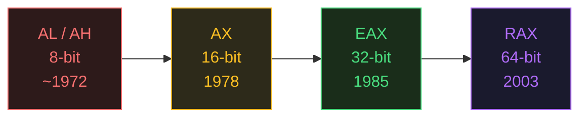

# Register Size Evolution

---

## Table of Contents

- [Why Registers Grew Over Time](#why-registers-grew-over-time)
- [The Four Generations](#the-four-generations)
- [How Each Generation Extended the Last](#how-each-generation-extended-the-last)
- [Backward Compatibility: The Double-Edged Sword](#backward-compatibility)
- [What This Means in Practice](#what-this-means-in-practice)

---

## Why Registers Grew Over Time

Each time Intel released a new processor generation, software developers needed:

1. **Larger numbers** — 8-bit registers max out at 255. A loop counter or memory address needs far more.
2. **Larger memory addresses** — A 16-bit register can only address 64 KB. A 32-bit register can address 4 GB. A 64-bit register can address 16 exabytes.
3. **Performance** — Wider registers mean fewer instructions needed to process the same data.

The challenge: **existing software had to keep working.** Intel couldn't just throw away the old register names. So they did something clever — they made each new register *contain* the old ones inside it.

---

## The Four Generations

### Generation 1 — 8-bit (Intel 8008, ~1972)

The earliest Intel processors had only 8-bit registers. The "A" register (accumulator) was split into two 8-bit halves:

```
┌────────┬────────┐
│   AH   │   AL   │
│ bits   │ bits   │
│ 15–8   │  7–0   │
└────────┴────────┘
```

- `AL` = "A Low" — bits 0 through 7
- `AH` = "A High" — bits 8 through 15
- Each holds a value from 0 to 255

**Use case:** Early microcontrollers, simple arithmetic, character manipulation.

---

### Generation 2 — 16-bit (Intel 8086, 1978)

The 8086 introduced **16-bit registers**. Rather than replacing AH and AL, it created a new name — `AX` — that referred to both halves together:

```
┌────────────────────────┐
│           AX           │
│ ┌────────┬────────┐    │
│ │   AH   │   AL   │    │
│ └────────┴────────┘    │
│   bits 15–0            │
└────────────────────────┘
```

- `AX` = "A eXtended" — accesses all 16 bits at once
- You could still access `AH` and `AL` individually
- Maximum value: 65,535
- Could address up to 1 MB of memory (with segment registers)

**Registers added:** `AX`, `BX`, `CX`, `DX`, `SI`, `DI`, `SP`, `BP`, `IP`

---

### Generation 3 — 32-bit (Intel 80386, 1985)

The 386 was a major leap. It introduced **32-bit registers** with the `E` prefix (Extended):

```
┌──────────────────────────────────────────────┐
│                    EAX                       │
│ ┌──────────────────┬────────────────────────┐│
│ │  upper 16 bits   │           AX           ││
│ │  (no name)       │ ┌────────┬────────┐    ││
│ │                  │ │   AH   │   AL   │    ││
│ │                  │ └────────┴────────┘    ││
│ └──────────────────┴────────────────────────┘│
│   bits 31–0                                  │
└──────────────────────────────────────────────┘
```

- `EAX` = "Extended AX" — all 32 bits
- Writing to `EAX` also changes `AX`, `AH`, `AL`
- Maximum value: ~4.29 billion
- Can address up to 4 GB of memory directly

**Registers added:** `EAX`, `EBX`, `ECX`, `EDX`, `ESI`, `EDI`, `ESP`, `EBP`, `EIP`

**This was the dominant era for decades.** Most Windows XP-era programs ran in 32-bit mode.

---

### Generation 4 — 64-bit (AMD Opteron / Intel EM64T, 2003–2004)

AMD (not Intel!) was first to release a 64-bit extension to x86, called **AMD64**. Intel followed with **EM64T** (later called Intel 64). The `R` prefix was used for the new 64-bit registers:

```
┌───────────────────────────────────────────────────────────────────────┐
│                               RAX                                     │
│  ┌──────────────────────────────┬──────────────────────────────────┐  │
│  │       upper 32 bits          │              EAX                 │  │
│  │       (no special name)      │  ┌──────────────────┬──────────┐ │  │
│  │                              │  │  upper 16 bits   │    AX    │ │  │
│  │                              │  │   (no name)      │  ┌──┬──┐ │ │  │
│  │                              │  │                  │  │AH│AL│ │ │  │
│  │                              │  │                  │  └──┴──┘ │ │  │
│  │                              │  └──────────────────┴──────────┘ │  │
│  └──────────────────────────────┴──────────────────────────────────┘  │
│   bits 63–0                                                            │
└───────────────────────────────────────────────────────────────────────┘
```

- `RAX` — all 64 bits
- Maximum value: 18,446,744,073,709,551,615
- Can address up to 16 exabytes of memory (theoretical)
- **8 new registers added:** `R8` through `R15`

**Registers added:** `RAX`–`RDI` (renamed), `R8`–`R15` (brand new), `RIP`, `RSP`, `RBP`

---

## How Each Generation Extended the Last

Here is the complete evolutionary table for all "classic" registers:



| 8-bit Low | 8-bit High | 16-bit | 32-bit | 64-bit |
|---|---|---|---|---|
| `AL` | `AH` | `AX` | `EAX` | `RAX` |
| `BL` | `BH` | `BX` | `EBX` | `RBX` |
| `CL` | `CH` | `CX` | `ECX` | `RCX` |
| `DL` | `DH` | `DX` | `EDX` | `RDX` |
| `SIL` | — | `SI` | `ESI` | `RSI` |
| `DIL` | — | `DI` | `EDI` | `RDI` |
| `SPL` | — | `SP` | `ESP` | `RSP` |
| `BPL` | — | `BP` | `EBP` | `RBP` |
| — | — | — | — | `R8`–`R15` |

---

## Backward Compatibility

Because each generation extended the previous one, older programs still run on modern CPUs:

- A 16-bit DOS program can still use `AX` on a 64-bit CPU — it's just accessing the lower 16 bits of `RAX`
- A 32-bit Windows program can use `EAX` — it accesses the lower 32 bits of `RAX`
- 64-bit code uses the full `RAX`

This is why x86-64 CPUs have multiple operating modes:
- **Real mode** — 16-bit (legacy DOS behavior)
- **Protected mode** — 32-bit (standard modern 32-bit OS)
- **Long mode** — 64-bit (modern 64-bit OS)

### The 32-bit Zero-Extension Quirk

One important behavior: **writing to the 32-bit register (`EAX`) automatically zeroes the upper 32 bits of `RAX`.** This does NOT happen when writing to 8-bit or 16-bit registers.

```asm
mov rax, 0xFFFFFFFFFFFFFFFF     ; RAX = all 1s

; Writing 32-bit:
mov eax, 0x00000001             ; EAX = 1 AND upper 32 bits of RAX are ZEROED
; RAX is now 0x0000000000000001  ← upper bits cleared!

; Writing 16-bit:
mov ax, 0x0001                  ; AX = 1, but upper 48 bits of RAX UNCHANGED
; RAX is now 0xFFFFFFFF0000FFFF ← only lower 16 changed
```

This behavior was intentional — 32-bit writes are the most common in 64-bit code, and this prevents accidental data leakage from leftover upper bits.

---

## What This Means in Practice

When you're reverse engineering a binary or writing assembly, you'll encounter all four sizes. Here's a practical guide:

### Recognizing Size from the Instruction

```asm
mov rax, rbx    ; 64-bit — using 8-byte registers
mov eax, ebx    ; 32-bit — using 4-byte registers  
mov ax, bx      ; 16-bit — using 2-byte registers
mov al, bl      ; 8-bit  — using 1-byte registers
```

### Why Compilers Mix Sizes

Modern compilers often use `EAX` instead of `RAX` even in 64-bit code when:
- The value is known to fit in 32 bits
- It's smaller (in bytes) to encode `EAX` than `RAX` in some instructions
- Zero-extension is desired as a side effect

Don't be confused when you see `eax` in a 64-bit binary — it's just the lower half of `rax`.

---

*Derived from Xeno Kovah's "Architecture 1001: x86-64 Assembly" class, available at https://ost.fyi*
