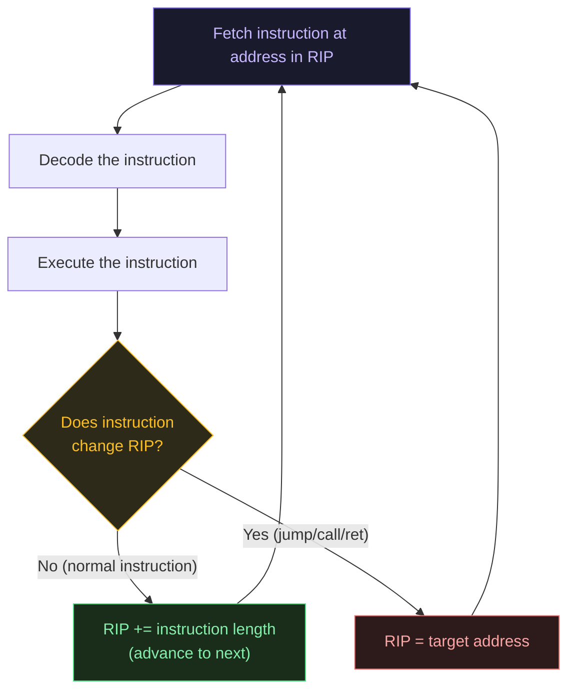

# The Instruction Pointer (RIP)

---

## Table of Contents

- [What Is the Instruction Pointer?](#what-is-the-instruction-pointer)
- [How RIP Works](#how-rip-works)
- [Instructions That Change RIP](#instructions-that-change-rip)
- [RIP-Relative Addressing](#rip-relative-addressing)
- [Why RIP Matters for Security](#why-rip-matters-for-security)
- [Evolution: IP → EIP → RIP](#evolution)

---

## What Is the Instruction Pointer?

Every CPU needs to know one crucial piece of information at all times: **"what should I execute next?"**

The answer is always stored in a special register called the **Instruction Pointer**. In 64-bit x86 mode, this register is called **`RIP`**.

- `RIP` always contains a **memory address**
- That address points to the **next instruction** to be fetched and executed
- The CPU reads `RIP`, executes the instruction at that address, then updates `RIP` automatically

```
Memory layout (simplified):
Address     | Bytes         | Assembly
─────────────────────────────────────────
0x401000    | 48 C7 C0 05   | mov rax, 5
0x401004    | 48 C7 C3 03   | mov rbx, 3
0x401008    | 48 01 D8      | add rax, rbx
0x40100B    | C3            | ret

When executing mov rax, 5:
  RIP = 0x401004  (already pointing to the NEXT instruction)
```

> **Note:** `RIP` is updated to point to the *next* instruction as soon as the current instruction starts executing. By the time you read `RIP` in a debugger mid-instruction, it already points ahead.

---

## How RIP Works

Here is the basic CPU execution loop, repeated billions of times per second:



### Normal Instruction Execution

For most instructions, `RIP` simply advances by the byte-length of the instruction:

```asm
; These instructions are 4 bytes, 4 bytes, and 3 bytes long respectively:
0x401000: mov rax, 5    ; 4 bytes → after execution, RIP = 0x401004
0x401004: mov rbx, 3    ; 4 bytes → after execution, RIP = 0x401008
0x401008: add rax, rbx  ; 3 bytes → after execution, RIP = 0x40100B
```

x86-64 instructions are **variable length** (1 to 15 bytes), so `RIP` doesn't increment by a fixed amount each time.

---

## Instructions That Change RIP

The following instruction types explicitly set `RIP` to a new address, breaking normal sequential flow:

### Unconditional Jump (`jmp`)

Jumps directly to a target address. `RIP` is set to the destination.

```asm
jmp 0x401050    ; RIP = 0x401050 (execution continues there)
jmp rax         ; RIP = value stored in RAX (indirect jump)
```

### Conditional Jump (`je`, `jne`, `jg`, `jl`, etc.)

Jumps only if a condition (set by a previous `cmp` or `test`) is true. Otherwise, `RIP` advances normally.

```asm
cmp rax, 0      ; compare RAX with 0 (sets flags)
je  some_label  ; if RAX == 0, jump (RIP = address of some_label)
                ; if RAX != 0, RIP just advances to next instruction
```

### Function Call (`call`)

Pushes the return address (current `RIP` value) onto the stack, then sets `RIP` to the function's address.

```asm
call printf     ; 1. push RIP (return address) onto stack
                ; 2. RIP = address of printf
                ; execution continues inside printf
```

### Return (`ret`)

Pops the saved return address off the stack and puts it into `RIP`.

```asm
ret             ; RIP = value popped from top of stack
                ; execution returns to caller
```

> **This is the mechanism exploited by buffer overflows:** if an attacker can overwrite the saved return address on the stack, `ret` will set `RIP` to an attacker-controlled value.

---

## RIP-Relative Addressing

In 64-bit mode, `RIP` is also used for **position-independent code**. Instead of hardcoding absolute memory addresses, instructions can reference memory relative to `RIP`:

```asm
; Access a global variable using RIP-relative addressing:
mov rax, [rip + 0x2f4]   ; read from address (RIP + 0x2f4)
```

This is why you see `[rip + offset]` in disassembly. It allows code to run at any memory address — useful for shared libraries and ASLR (Address Space Layout Randomization).

```
Before executing: RIP = 0x401008
Instruction: mov rax, [rip + 0x2f4]
             ↓
Effective address = 0x401008 + 0x2f4 = 0x401300
→ reads 8 bytes from memory address 0x401300 into RAX
```

---

## Why RIP Matters for Security

`RIP` is the most security-critical register. **Controlling `RIP` = controlling program execution.**

### Buffer Overflow — The Classic Attack

```
Stack layout during a function call:
┌──────────────────┐  ← RSP (top of stack)
│  local variable  │  ← [rbp - 8]
│  local variable  │  ← [rbp - 16]
│  ...             │
│  saved RBP       │  ← [rbp]
│  return address  │  ← [rbp + 8]  ← this is a saved RIP value!
│  (caller's RIP)  │
└──────────────────┘
```

If a program copies user input into a local buffer **without checking size**, an attacker can overflow the buffer, overwrite the saved return address, and when the function executes `ret`, `RIP` gets set to the attacker's value.

### Return-Oriented Programming (ROP)

Modern exploit technique: instead of injecting new code, attackers chain together small existing code snippets ("gadgets") that each end in `ret`. Each `ret` pops a new address from the attacker-controlled stack into `RIP`, executing the next gadget.

```
Stack (controlled by attacker):
┌──────────────────┐
│  gadget_1 addr   │  ← ret pops this → RIP = gadget_1
│  gadget_2 addr   │  ← gadget_1's ret pops this → RIP = gadget_2
│  gadget_3 addr   │  ← gadget_2's ret pops this → RIP = gadget_3
│  ...             │
└──────────────────┘
```

### Debugging Tip

In a debugger (GDB, x64dbg, etc.), `RIP` tells you exactly where execution is paused:

```bash
# In GDB:
(gdb) info registers rip
rip = 0x401008

# Or print the instruction at RIP:
(gdb) x/i $rip
=> 0x401008 <main+8>: add rax, rbx
```

---

## Evolution

Like all x86 registers, the instruction pointer grew with each CPU generation:

| Register | Era | Width |
|---|---|---|
| `IP` | 8086 (1978) | 16-bit |
| `EIP` | 80386 (1985) | 32-bit |
| `RIP` | AMD64/EM64T (2003+) | 64-bit |

In 32-bit Windows programs you'll see `EIP` in crash dumps and debuggers. In 64-bit programs, it's always `RIP`.

---

## Key Takeaways

- `RIP` always points to the **next** instruction to execute
- Normal instructions advance `RIP` by the instruction's byte length
- `jmp`, `call`, and `ret` set `RIP` to a new address
- `RIP` is used in **RIP-relative addressing** for position-independent code
- Controlling `RIP` is the goal of most code-execution exploits
- In 32-bit mode this register is called `EIP`; in 16-bit mode, `IP`

---

*Derived from Xeno Kovah's "Architecture 1001: x86-64 Assembly" class, available at https://ost.fyi*
